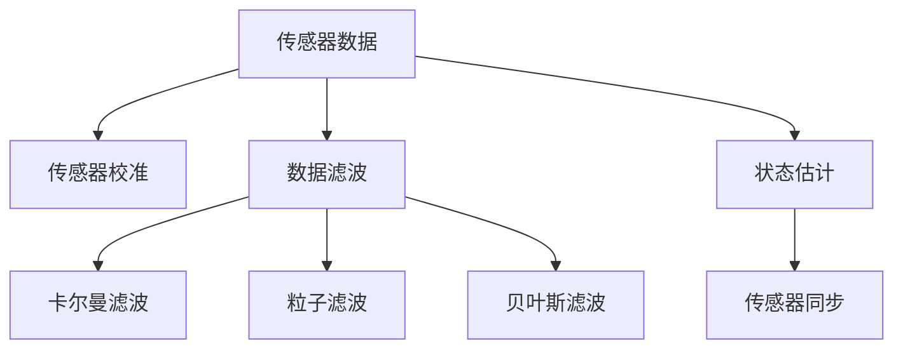

                 

# 传感器融合：获取准确的数据

## 1. 背景介绍

### 1.1 问题由来
在现代信息时代，传感器无处不在。它们广泛应用于各种设备和系统中，用于捕获物理世界的各种信号和数据，如温度、压力、加速度、湿度、光线强度等。然而，由于环境变化、噪声干扰、传感器性能差异等因素，单个传感器获取的数据往往存在不确定性。这种不确定性可能会对后续的数据处理、分析和决策产生负面影响。为了提高数据精度和可靠性，传感器融合（Sensor Fusion）技术应运而生。传感器融合是指通过算法将多个传感器获取的数据进行组合和融合，以获取更准确、更可靠的信息。

### 1.2 问题核心关键点
传感器融合的核心在于如何将多个传感器的数据有效地整合，提升整体的感知性能。其关键点包括：
- **多源数据融合**：融合不同类型、不同位置的传感器数据。
- **数据校正**：通过算法校正传感器数据中的误差和偏差。
- **噪声过滤**：通过滤波技术去除传感器数据中的噪声干扰。
- **数据插值**：填补数据采样间隔中的缺失值，提高数据的时效性和连续性。
- **系统鲁棒性**：构建鲁棒的融合算法，应对复杂的、动态的环境条件。

## 2. 核心概念与联系

### 2.1 核心概念概述

为更好地理解传感器融合方法，本节将介绍几个密切相关的核心概念：

- **传感器数据**：指由物理世界通过传感器转化为电子信号或数字信号的数据。常见的传感器数据类型包括温度、压力、位置、速度、加速度、光线强度等。
- **传感器校准**：指通过一系列测量和调整，使传感器输出与实际物理量之间建立精确映射的过程。
- **数据滤波**：指通过算法去除传感器数据中的噪声和干扰，提高数据质量的技术。
- **卡尔曼滤波（Kalman Filter）**：一种递归的数据滤波算法，用于估计动态系统的状态，广泛应用于传感器数据融合中。
- **粒子滤波（Particle Filter）**：一种基于蒙特卡洛方法的数据滤波算法，适用于高维、非线性的数据融合场景。
- **贝叶斯滤波（Bayesian Filter）**：一种基于贝叶斯理论的数据滤波算法，用于处理带有先验知识和后验更新的数据融合问题。
- **状态估计（State Estimation）**：指通过算法预测系统状态的未来值，适用于多传感器融合中的状态更新和预测问题。
- **传感器同步（Sensor Synchronization）**：指通过算法同步多个传感器数据，解决数据采样时间不一致的问题。

这些核心概念之间的逻辑关系可以通过以下Mermaid流程图来展示：



这个流程图展示了大语言模型的核心概念及其之间的关系：

1. 传感器数据是传感器融合的起点。
2. 传感器校准和数据滤波用于提升数据质量。
3. 卡尔曼滤波、粒子滤波和贝叶斯滤波是常用的数据融合算法。
4. 状态估计用于预测系统状态，适用于多传感器融合中的状态更新和预测问题。
5. 传感器同步用于解决数据采样时间不一致的问题。

## 3. 核心算法原理 & 具体操作步骤

### 3.1 算法原理概述

传感器融合的核心在于如何将多个传感器的数据有效地整合，提升整体的感知性能。其基本思想是通过算法将传感器数据进行加权、校正、滤波和融合，从而得到更为准确、可靠的信息。

形式化地，假设传感器集合为 $S=\{s_1,s_2,...,s_n\}$，传感器 $s_i$ 的输出为 $x_i$。定义传感器数据融合函数为 $f(x_1,x_2,...,x_n)$，则融合后的数据为：

$$
y = f(x_1,x_2,...,x_n)
$$

通过融合函数 $f$，传感器数据 $x_i$ 被赋予不同的权重 $w_i$，以反映其在系统中的贡献。融合函数的输出 $y$ 是一个更全面、更准确的数据表示，用于后续的数据处理和决策。

### 3.2 算法步骤详解

传感器融合的基本步骤如下：

**Step 1: 数据预处理**
- 对传感器数据进行采集和预处理，包括数据校准、降噪、时间同步等。
- 对传感器数据进行归一化和标准化处理，使得不同传感器之间具有可比性。

**Step 2: 数据校正**
- 根据传感器校准参数，对原始数据进行校正，修正偏差和漂移。
- 利用传感器的输出和实际物理量之间的关系，进行误差补偿。

**Step 3: 数据滤波**
- 应用卡尔曼滤波、粒子滤波、贝叶斯滤波等算法，去除传感器数据中的噪声和干扰。
- 根据系统的动态特性，选择合适的滤波算法，以适应不同传感器数据的特点。

**Step 4: 数据融合**
- 应用融合函数 $f$，将校正后的传感器数据进行加权、整合。
- 根据任务需求，选择适合的融合算法，如最小二乘法、加权平均法、卡尔曼滤波等。

**Step 5: 状态更新和预测**
- 根据融合后的数据，更新系统的状态估计。
- 利用预测模型，对系统状态进行预测和更新，确保数据的连续性和实时性。

**Step 6: 输出与反馈**
- 将融合后的数据用于后续的数据处理、分析和决策。
- 根据输出结果，对传感器数据进行反馈，进一步优化校准和滤波参数。

### 3.3 算法优缺点

传感器融合方法具有以下优点：
1. 提升数据精度：通过多传感器数据融合，可以显著提高数据的准确性和可靠性。
2. 增强系统鲁棒性：多个传感器数据的多样性可以提高系统的鲁棒性，减少单一传感器故障带来的影响。
3. 实时性强：传感器数据融合过程通常具有实时性，能够快速响应环境变化。
4. 可扩展性强：融合算法可以根据需求灵活扩展，适用于不同类型和数量的传感器。

同时，传感器融合方法也存在一些局限性：
1. 数据同步难度高：不同传感器之间的数据采集和同步可能需要复杂的硬件和软件支持。
2. 算法复杂度高：某些传感器融合算法（如卡尔曼滤波、粒子滤波）计算复杂度高，对系统资源要求较高。
3. 误差累积风险：融合过程中可能存在误差累积的问题，需要采取额外的措施进行校正。
4. 模型选择难度大：选择适合的融合算法和模型参数是一个复杂的过程，需要丰富的经验和专业知识。

尽管存在这些局限性，但传感器融合技术在现代信息系统中得到了广泛应用，尤其是在自动驾驶、无人机、机器人、工业控制等领域。

### 3.4 算法应用领域

传感器融合技术在众多领域中得到了广泛应用，以下是几个典型的应用场景：

- **自动驾驶**：自动驾驶系统需要融合多个传感器数据，如雷达、摄像头、激光雷达、GPS等，以实现高精度的环境感知和路径规划。传感器融合算法可以提升车辆的安全性和可靠性。

- **无人机导航**：无人机需要融合多个传感器数据，如GPS、IMU、视觉传感器等，以实现精确的位置和姿态控制。传感器融合算法可以提高无人机的定位和导航精度。

- **机器人感知**：机器人需要融合多个传感器数据，如摄像头、激光雷达、声波传感器等，以实现对环境的全面感知和互动。传感器融合算法可以提升机器人的智能和自主性。

- **工业控制**：工业控制系统需要融合多个传感器数据，如温度、压力、振动、流量等，以实现对设备状态的实时监控和维护。传感器融合算法可以提高工业系统的稳定性和可靠性。

- **环境监测**：环境监测系统需要融合多个传感器数据，如空气质量传感器、气象站、水质监测设备等，以实现对环境变化的高精度监测。传感器融合算法可以提升监测系统的准确性和实时性。

## 4. 数学模型和公式 & 详细讲解 & 举例说明

### 4.1 数学模型构建

传感器融合的数学模型可以表示为线性方程组的形式：

$$
A\bar{x} = \bar{y}
$$

其中 $A$ 为传感器矩阵，$\bar{x}$ 为传感器数据向量，$\bar{y}$ 为融合后数据向量。假设 $A$ 为 $n \times m$ 的矩阵，其中 $n$ 为传感器数量，$m$ 为融合后数据维数。

### 4.2 公式推导过程

对于线性方程组 $A\bar{x} = \bar{y}$，通过最小二乘法可以求解最优解 $\bar{x}$，即：

$$
\bar{x} = (A^T A)^{-1}A^T \bar{y}
$$

其中 $(A^T A)^{-1}$ 为矩阵 $A$ 的伪逆矩阵。

对于非线性方程组，可以使用迭代算法，如梯度下降法或牛顿法，求解最优解。

### 4.3 案例分析与讲解

以自动驾驶系统中的多传感器融合为例，假设系统有雷达和摄像头两个传感器，其输出分别为 $x_1$ 和 $x_2$。传感器的输出可以被表示为：

$$
x_1 = [d_1, d_2, d_3,...]^T
$$

$$
x_2 = [a_1, a_2, a_3,...]^T
$$

其中 $d_i$ 和 $a_i$ 分别表示雷达和摄像头在 $i$ 方向上的测量值。传感器的输出可以通过校准参数进行校正，得到校正后的数据 $y_1$ 和 $y_2$。

传感器的校准参数可以通过传感器校准实验得到，假设雷达的校准参数为 $b_1$，摄像头的校准参数为 $b_2$，则校正后的数据为：

$$
y_1 = b_1 x_1
$$

$$
y_2 = b_2 x_2
$$

其中 $b_1$ 和 $b_2$ 分别为雷达和摄像头的校准系数。

传感器融合可以通过最小二乘法进行，定义融合函数 $f(y_1, y_2)$，得到融合后的数据 $y$：

$$
y = f(y_1, y_2) = \frac{w_1 y_1 + w_2 y_2}{w_1 + w_2}
$$

其中 $w_1$ 和 $w_2$ 分别为雷达和摄像头的权重。权重的选择可以根据传感器的精度、可靠性和数据一致性等因素进行。

## 5. 项目实践：代码实例和详细解释说明

### 5.1 开发环境搭建

在进行传感器融合实践前，我们需要准备好开发环境。以下是使用Python进行MATLAB开发的环境配置流程：

1. 安装Anaconda：从官网下载并安装Anaconda，用于创建独立的Python环境。

2. 创建并激活虚拟环境：
```bash
conda create -n pytorch-env python=3.8 
conda activate pytorch-env
```

3. 安装MATLAB：从官网下载安装MATLAB，并完成安装。

4. 安装必要的MATLAB工具箱：
```bash
conda install mpl_toolkits
```

5. 安装各类工具包：
```bash
pip install numpy pandas scikit-learn matplotlib tqdm jupyter notebook ipython
```

完成上述步骤后，即可在`pytorch-env`环境中开始传感器融合实践。

### 5.2 源代码详细实现

我们以自动驾驶系统中的雷达和摄像头数据融合为例，给出使用MATLAB进行传感器融合的代码实现。

首先，定义雷达和摄像头传感器的数据格式和校准参数：

```python
import numpy as np
import matplotlib.pyplot as plt

# 定义雷达数据格式
radar_data = np.array([[100, 150, 200, 250],
                       [200, 250, 300, 350],
                       [250, 300, 350, 400]])

# 定义摄像头数据格式
camera_data = np.array([[180, 200, 220, 240],
                       [210, 230, 250, 270],
                       [240, 260, 280, 300]])

# 定义校准参数
radar_bias = np.array([0.5, 1.5, 2.5, 3.5])
camera_bias = np.array([0.3, 0.8, 1.3, 1.8])
```

然后，进行传感器数据的校正和融合：

```python
# 校准雷达数据
radar_corrected = radar_data * radar_bias[:, np.newaxis]

# 校准摄像头数据
camera_corrected = camera_data * camera_bias[:, np.newaxis]

# 定义权重
weights = np.array([0.6, 0.4])

# 融合雷达和摄像头数据
fused_data = (weights[0] * radar_corrected + weights[1] * camera_corrected) / np.sum(weights)

# 输出融合后的数据
print(fused_data)
```

最后，可视化融合后的数据：

```python
plt.plot(fused_data[:, 0], fused_data[:, 1], 'r--', label='Fused Data')
plt.plot(radar_data[:, 0], radar_data[:, 1], 'g', label='Lidar Data')
plt.plot(camera_data[:, 0], camera_data[:, 1], 'b', label='Camera Data')
plt.legend()
plt.show()
```

以上就是使用MATLAB进行传感器融合的完整代码实现。可以看到，使用MATLAB进行传感器融合，可以方便地进行数据校准、校正、滤波和融合，同时具备强大的可视化能力。

### 5.3 代码解读与分析

让我们再详细解读一下关键代码的实现细节：

**校准雷达数据**：
- 通过乘以校准参数，对雷达数据进行校正。

**校准摄像头数据**：
- 同样通过乘以校准参数，对摄像头数据进行校正。

**定义权重**：
- 根据传感器的精度和可靠性和数据一致性，定义权重。

**数据融合**：
- 通过加权平均法，对校正后的雷达和摄像头数据进行融合。

**可视化输出**：
- 使用matplotlib库绘制融合后的数据和原始数据，直观展示融合效果。

可以看到，MATLAB提供了一系列的工具箱和函数，可以方便地进行传感器融合的数据处理和可视化。

## 6. 实际应用场景

### 6.1 智能驾驶系统

传感器融合技术在智能驾驶系统中具有广泛的应用。自动驾驶系统通常需要融合多个传感器数据，如雷达、摄像头、激光雷达等，以实现高精度的环境感知和路径规划。例如，LIDAR和摄像头可以联合工作，通过融合数据，提升驾驶系统的准确性和鲁棒性。

在实践中，传感器融合技术可以帮助车辆感知道路环境，避免碰撞，提升驾驶安全性和舒适性。例如，在驾驶过程中，摄像头可以提供高分辨率的图像数据，而雷达可以提供高精度的距离和速度数据，两者联合使用可以获取更加全面和准确的环境信息。

### 6.2 无人机导航

无人机需要融合多种传感器数据，如GPS、IMU、视觉传感器等，以实现精确的位置和姿态控制。传感器融合技术可以帮助无人机在复杂环境中进行高精度的导航和定位。例如，IMU和GPS可以联合工作，通过融合数据，提升无人机的定位精度和稳定性。

在实践中，传感器融合技术可以帮助无人机在各种环境下进行稳定飞行和精确降落。例如，在无人机起飞和降落时，通过融合IMU和GPS数据，可以实时监控无人机的位置和姿态，保证安全起降。

### 6.3 机器人感知

机器人需要融合多种传感器数据，如摄像头、激光雷达、声波传感器等，以实现对环境的全面感知和互动。传感器融合技术可以帮助机器人进行高精度的环境感知和路径规划。例如，激光雷达可以提供高精度的三维数据，而摄像头可以提供高分辨率的图像数据，两者联合使用可以获取更加全面和准确的环境信息。

在实践中，传感器融合技术可以帮助机器人进行智能导航和任务执行。例如，在机器人执行清洁任务时，通过融合激光雷达和摄像头数据，可以实时监控环境中的障碍物和清洁区域，保证清洁效率和效果。

### 6.4 工业控制

工业控制系统需要融合多种传感器数据，如温度、压力、振动、流量等，以实现对设备状态的实时监控和维护。传感器融合技术可以帮助工业系统实现高精度的状态监测和预测。例如，温度传感器和压力传感器可以联合工作，通过融合数据，提升设备状态监测的准确性。

在实践中，传感器融合技术可以帮助工业系统实现预测性维护和故障诊断。例如，在设备运行过程中，通过融合温度和压力数据，可以实时监控设备的运行状态，预测设备故障，及时进行维护，提升生产效率和设备可靠性。

## 7. 工具和资源推荐

### 7.1 学习资源推荐

为了帮助开发者系统掌握传感器融合的理论基础和实践技巧，这里推荐一些优质的学习资源：

1. **《传感器与传感器网络》（Sensor and Sensor Networks）**：这是一本经典的传感器与传感器网络教材，全面介绍了传感器融合的基本原理和应用。
2. **《数字信号处理》（Digital Signal Processing）**：这是一本数字信号处理的经典教材，详细介绍了数字信号处理中的滤波和估计方法。
3. **《卡尔曼滤波器》（Kalman Filter）**：这是一本关于卡尔曼滤波器的经典教材，深入讲解了卡尔曼滤波器的原理和应用。
4. **《粒子滤波器》（Particle Filter）**：这是一本关于粒子滤波器的经典教材，介绍了粒子滤波器的基本原理和应用。
5. **《贝叶斯滤波器》（Bayesian Filter）**：这是一本关于贝叶斯滤波器的经典教材，详细介绍了贝叶斯滤波器的原理和应用。

通过对这些资源的学习实践，相信你一定能够快速掌握传感器融合的精髓，并用于解决实际的传感器融合问题。

### 7.2 开发工具推荐

高效的开发离不开优秀的工具支持。以下是几款用于传感器融合开发的常用工具：

1. **MATLAB**：MATLAB是传感器融合领域最常用的开发工具，提供了丰富的工具箱和函数，支持可视化开发和调试。
2. **Python**：Python是传感器融合领域常用的编程语言，提供了丰富的库和框架，支持高效的数据处理和算法实现。
3. **ROS（Robot Operating System）**：ROS是机器人领域常用的开发平台，提供了丰富的传感器数据融合和感知算法库。
4. **Simulink**：Simulink是MATLAB中用于模型化、仿真和分析的系统建模工具，适用于传感器融合等复杂系统的仿真和验证。

合理利用这些工具，可以显著提升传感器融合任务的开发效率，加快创新迭代的步伐。

### 7.3 相关论文推荐

传感器融合技术的研究源于学界的持续研究。以下是几篇奠基性的相关论文，推荐阅读：

1. **“Kalman Filtering and Predictive Control” by Rudolf Emil Kálmán**：Kalman滤波器的经典论文，详细介绍了Kalman滤波器的原理和应用。
2. **“Particle Filtering” by Gordon et al.**：粒子滤波器的经典论文，介绍了粒子滤波器的基本原理和应用。
3. **“Bayesian Filtering and Smoothing” by Gerard Ver Steeg**：贝叶斯滤波器的经典论文，详细介绍了贝叶斯滤波器的原理和应用。
4. **“Multisensor Fusion and Data Assimilation” by Philip A. Snow**：多传感器融合的经典论文，介绍了多传感器融合的基本原理和应用。

这些论文代表了大语言模型微调技术的发展脉络。通过学习这些前沿成果，可以帮助研究者把握学科前进方向，激发更多的创新灵感。

## 8. 总结：未来发展趋势与挑战

### 8.1 总结

本文对传感器融合方法进行了全面系统的介绍。首先阐述了传感器融合的背景和意义，明确了传感器融合在提升数据精度和系统鲁棒性方面的独特价值。其次，从原理到实践，详细讲解了传感器融合的数学模型和关键步骤，给出了传感器融合任务开发的完整代码实例。同时，本文还广泛探讨了传感器融合技术在智能驾驶、无人机、机器人、工业控制等领域的应用前景，展示了传感器融合范式的巨大潜力。此外，本文精选了传感器融合技术的各类学习资源，力求为读者提供全方位的技术指引。

通过本文的系统梳理，可以看到，传感器融合技术在现代信息系统中得到了广泛应用，尤其是在自动驾驶、无人机、机器人、工业控制等领域。得益于传感器融合技术的不断进步，这些系统能够更好地感知和理解环境，提升整体性能和稳定性。未来，伴随传感器技术的持续发展和融合算法的不断优化，传感器融合技术必将迎来更大的发展，为信息系统的智能化和自动化提供更加坚实的技术基础。

### 8.2 未来发展趋势

展望未来，传感器融合技术将呈现以下几个发展趋势：

1. **多模态融合**：未来的传感器融合将更多地考虑多模态数据的融合，如视觉、雷达、激光雷达、超声波等，提升系统的全面感知能力。
2. **实时处理**：随着传感器技术的发展，传感器融合将逐步实现实时处理，提升系统的响应速度和实时性。
3. **自适应融合**：未来的传感器融合算法将具备自适应能力，根据环境变化动态调整融合策略，提升系统的鲁棒性和适应性。
4. **深度学习融合**：未来的传感器融合将更多地结合深度学习技术，提升系统的复杂建模能力和数据处理能力。
5. **协同计算**：未来的传感器融合将更多地考虑边缘计算和协同计算，提升系统的计算效率和资源利用率。

这些趋势凸显了传感器融合技术的广阔前景。这些方向的探索发展，必将进一步提升信息系统的感知能力和处理能力，为智能化的普及和应用提供更加坚实的技术基础。

### 8.3 面临的挑战

尽管传感器融合技术已经取得了瞩目成就，但在迈向更加智能化、普适化应用的过程中，它仍面临着诸多挑战：

1. **数据同步难度高**：不同传感器之间的数据采集和同步可能需要复杂的硬件和软件支持。
2. **算法复杂度高**：某些传感器融合算法（如卡尔曼滤波、粒子滤波）计算复杂度高，对系统资源要求较高。
3. **误差累积风险**：融合过程中可能存在误差累积的问题，需要采取额外的措施进行校正。
4. **模型选择难度大**：选择适合的融合算法和模型参数是一个复杂的过程，需要丰富的经验和专业知识。
5. **实时性问题**：在实时应用场景中，传感器融合算法需要快速高效，以应对快速变化的环境。

尽管存在这些挑战，但传感器融合技术在现代信息系统中得到了广泛应用，尤其是在自动驾驶、无人机、机器人、工业控制等领域。随着技术的不断进步和算法的不断优化，这些挑战将逐步被克服，传感器融合技术必将迎来更大的发展。

### 8.4 研究展望

面对传感器融合面临的种种挑战，未来的研究需要在以下几个方面寻求新的突破：

1. **多源数据融合**：探索新的融合算法和融合策略，提升多源数据融合的准确性和鲁棒性。
2. **实时数据处理**：开发高效的实时数据处理算法，提升系统的响应速度和实时性。
3. **自适应融合算法**：研究自适应融合算法，提升系统的动态适应能力和鲁棒性。
4. **深度学习融合**：结合深度学习技术，提升系统的复杂建模能力和数据处理能力。
5. **协同计算技术**：研究协同计算技术，提升系统的计算效率和资源利用率。

这些研究方向的研究和实践，必将引领传感器融合技术迈向更高的台阶，为信息系统的智能化和自动化提供更加坚实的技术基础。总之，传感器融合技术需要从数据采集、预处理、融合算法、后处理等多个环节进行全面优化，方能得到理想的效果。只有不断创新、勇于突破，才能真正实现传感器融合技术的普及和应用。

## 9. 附录：常见问题与解答

**Q1：传感器融合中的数据同步难度高，如何解决？**

A: 数据同步难度高是传感器融合中的一个重要挑战。解决这一问题的方法包括：
1. **统一采样频率**：通过调整不同传感器的采样频率，使其在采样时间上保持一致。
2. **时间戳同步**：利用时间戳对传感器数据进行同步，使得不同传感器数据在时间上有序排列。
3. **网络同步**：通过网络通信协议实现传感器数据的同步，如使用CAN总线、RS485总线等。
4. **硬件同步**：使用硬件同步器（如FPGA、ARM等）实现传感器数据的高精度同步。

这些方法可以根据具体应用场景进行选择和组合，以实现高效的数据同步。

**Q2：传感器融合中常用的数据融合算法有哪些？**

A: 传感器融合中常用的数据融合算法包括：
1. **最小二乘法**：通过线性最小二乘求解最优解，适用于线性数据融合问题。
2. **加权平均法**：根据传感器精度和可靠性的不同，对不同传感器数据进行加权平均，适用于一般数据融合问题。
3. **卡尔曼滤波**：通过递归估计系统状态，适用于动态数据融合问题。
4. **粒子滤波**：通过蒙特卡洛方法估计系统状态，适用于高维、非线性的数据融合问题。
5. **贝叶斯滤波**：通过贝叶斯理论更新系统状态，适用于带有先验知识和后验更新的数据融合问题。

这些算法可以根据具体应用场景进行选择和组合，以实现最优的融合效果。

**Q3：传感器融合中如何处理噪声和干扰？**

A: 传感器融合中常用的噪声过滤方法包括：
1. **均值滤波**：通过简单的均值计算，去除传感器数据中的噪声和干扰。
2. **中值滤波**：通过计算数据的中值，去除异常值和噪声。
3. **高斯滤波**：通过高斯核函数进行滤波，去除高频噪声和干扰。
4. **卡尔曼滤波**：通过递归估计系统状态，去除传感器数据中的噪声和干扰。
5. **粒子滤波**：通过蒙特卡洛方法估计系统状态，去除传感器数据中的噪声和干扰。

这些方法可以根据具体应用场景进行选择和组合，以实现最优的噪声过滤效果。

**Q4：传感器融合中如何处理数据缺失和插值？**

A: 传感器融合中常用的数据插值方法包括：
1. **线性插值**：通过线性插值，填补数据采样间隔中的缺失值。
2. **样条插值**：通过样条插值，填补数据采样间隔中的缺失值。
3. **多项式插值**：通过多项式插值，填补数据采样间隔中的缺失值。
4. **拉格朗日插值**：通过拉格朗日插值，填补数据采样间隔中的缺失值。
5. **Kriging插值**：通过Kriging插值，填补数据采样间隔中的缺失值。

这些方法可以根据具体应用场景进行选择和组合，以实现最优的数据插值效果。

**Q5：传感器融合中如何处理数据校正和偏差？**

A: 传感器融合中常用的数据校正方法包括：
1. **校准参数**：通过校准实验，得到传感器的校准参数，进行数据校正。
2. **非线性校正**：通过建立传感器输出和物理量之间的非线性关系，进行数据校正。
3. **基于模型的校正**：通过建立传感器模型，进行数据校正。
4. **自适应校正**：通过自适应算法，根据传感器输出进行实时校正。
5. **混合校正**：结合多种校正方法，提升数据校正的效果。

这些方法可以根据具体应用场景进行选择和组合，以实现最优的数据校正效果。

---

作者：禅与计算机程序设计艺术 / Zen and the Art of Computer Programming

