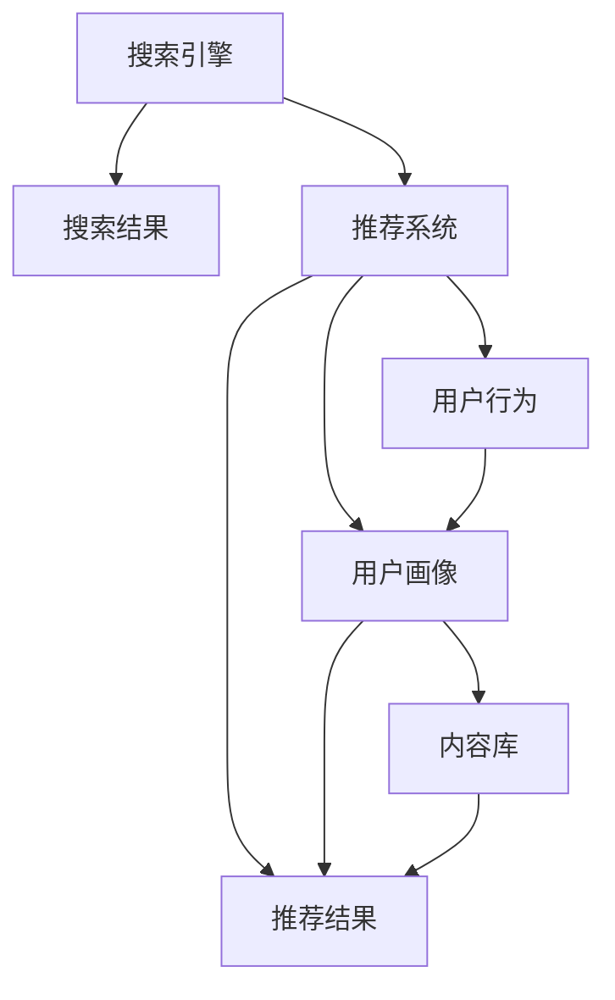

                 

# 传统搜索推荐系统的价值

## 1. 背景介绍

### 1.1 问题由来

在信息爆炸的时代，如何高效地从海量的数据中挖掘出有价值的信息，成为现代社会面临的重要挑战。特别是在电商、新闻、社交媒体等平台上，用户在浏览时面临着琳琅满目的内容，如何从中找到最符合自己需求的内容，是提升用户体验、增加平台粘性的关键。

传统的搜索推荐系统正是应运而生，通过分析用户的浏览行为、点击数据等，为用户推荐可能感兴趣的内容。传统的搜索推荐系统通常基于规则、机器学习和深度学习等技术，通过分析用户行为数据，预测用户兴趣，并从内容库中筛选出符合用户兴趣的推荐内容。

然而，随着用户需求的不断变化，传统的搜索推荐系统在面对大规模、多维度的数据时，逐渐显现出其局限性，如推荐准确率低下、难以适应用户个性化需求等。本文旨在探讨传统搜索推荐系统的价值，分析其工作原理和局限性，探讨未来发展趋势。

### 1.2 问题核心关键点

传统的搜索推荐系统主要包括两种主要技术：

- 搜索（Search）：通过关键词匹配、布尔查询等技术，从海量的数据中快速找到用户感兴趣的内容。
- 推荐（Recommendation）：根据用户的历史行为和兴趣，预测并推荐可能感兴趣的内容。

其核心价值在于：

- 提升用户体验：通过精准的搜索和推荐，帮助用户快速找到所需内容，提升浏览和购买体验。
- 增加平台粘性：通过个性化推荐，增加用户的停留时间和使用频次，提升平台价值。
- 优化内容分发：通过分析用户行为，优化内容分发策略，提升整体流量转化率。

## 2. 核心概念与联系

### 2.1 核心概念概述

为了更好地理解传统搜索推荐系统，本节将介绍几个密切相关的核心概念：

- 搜索引擎（Search Engine）：如Google、Bing等，用于快速搜索并返回相关信息。
- 推荐系统（Recommendation System）：如Amazon、Netflix等，通过分析用户行为，预测并推荐内容。
- 搜索结果（Search Result）：搜索引擎返回的网页、视频、新闻等，用户可根据需要进一步阅读。
- 推荐结果（Recommendation Result）：推荐系统推荐的内容，包括商品、文章、视频等，用户可根据需要进行选择。
- 用户行为（User Behavior）：用户在平台上的浏览、点击、购买等行为数据，是推荐系统的数据基础。
- 用户画像（User Profile）：根据用户行为数据生成的用户特征向量，用于描述用户兴趣和偏好。
- 内容库（Content Library）：平台上的内容集合，包括商品、文章、视频等。
- 推荐算法（Recommendation Algorithm）：用于预测和推荐内容的算法，如协同过滤、矩阵分解、深度学习等。

这些核心概念之间的逻辑关系可以通过以下Mermaid流程图来展示：



这个流程图展示了一连串的逻辑关系：

1. 用户通过搜索引擎进行搜索，获取搜索结果。
2. 推荐系统分析用户行为，生成用户画像。
3. 根据用户画像，推荐系统从内容库中推荐内容。
4. 用户可根据搜索结果和推荐结果进行选择。

## 3. 核心算法原理 & 具体操作步骤
### 3.1 算法原理概述

传统的搜索推荐系统通过分析用户行为数据，预测用户兴趣，从而推荐符合用户需求的内容。其核心算法包括以下几个步骤：

1. 用户行为数据采集：通过用户在平台上的浏览、点击、购买等行为，生成用户行为数据。
2. 用户画像生成：通过用户行为数据，构建用户画像，描述用户的兴趣和偏好。
3. 内容表示：将平台上的内容进行特征提取，生成内容向量。
4. 推荐算法计算：根据用户画像和内容向量，通过推荐算法计算预测用户对内容的评分。
5. 推荐结果排序：根据评分，对内容进行排序，生成推荐结果。
6. 推荐展示：将推荐结果展示给用户，供其选择。

### 3.2 算法步骤详解

以下是具体的推荐算法步骤：

#### 3.2.1 用户行为数据采集

用户行为数据是推荐系统的数据基础，主要包括用户的浏览记录、点击记录、购买记录等。通过这些数据，可以构建出用户的历史行为数据集。

#### 3.2.2 用户画像生成

用户画像是根据用户行为数据生成的用户特征向量，用于描述用户的兴趣和偏好。常见的用户画像生成方法包括：

- 基于内容的画像：根据用户的历史浏览记录，生成用户对不同内容的偏好。
- 基于协同过滤的画像：通过分析用户之间的行为相似性，生成用户的兴趣向量。
- 基于深度学习的画像：通过神经网络模型，自动学习用户行为的特征表示。

#### 3.2.3 内容表示

内容表示是将平台上的内容进行特征提取，生成内容向量。常见的内容表示方法包括：

- 基于项的表示：将每个内容表示为一个特征向量，捕捉每个内容的特征。
- 基于用户的表示：将每个用户表示为一个特征向量，捕捉用户对不同内容的兴趣。
- 基于内容的深度表示：使用深度学习模型，自动提取内容的语义特征。

#### 3.2.4 推荐算法计算

推荐算法是推荐系统的核心，用于根据用户画像和内容向量，计算预测用户对内容的评分。常见的推荐算法包括：

- 协同过滤（Collaborative Filtering）：通过分析用户之间的行为相似性，推荐相似用户喜欢的内容。
- 矩阵分解（Matrix Factorization）：将用户行为矩阵分解为用户画像和内容向量，预测用户对内容的评分。
- 深度学习推荐（Deep Learning Recommendation）：使用深度学习模型，预测用户对内容的评分。

#### 3.2.5 推荐结果排序

根据推荐算法的计算结果，对内容进行排序，生成推荐结果。排序方式通常包括：

- 基于评分的排序：将内容按照预测评分进行排序，推荐得分高的内容。
- 基于时序的排序：将内容按照时间顺序进行排序，推荐最新内容。
- 基于多样性的排序：将内容按照多样性进行排序，推荐不同类型的内容。

#### 3.2.6 推荐展示

将推荐结果展示给用户，供其选择。推荐展示方式通常包括：

- 列表展示：将推荐结果按顺序展示在界面上，供用户点击选择。
- 聚合展示：将推荐结果进行聚合，生成摘要、图片等形式，供用户快速浏览。
- 交互展示：通过交互方式，动态展示推荐结果，如滑动、拖拽等。

### 3.3 算法优缺点

传统的搜索推荐系统具有以下优点：

- 简单易实现：算法原理相对简单，易于理解和实现。
- 数据驱动：推荐结果基于用户行为数据，更符合用户实际需求。
- 实时性高：推荐结果可以快速生成，满足用户的即时需求。

同时，也存在以下缺点：

- 准确率低下：推荐结果依赖用户行为数据，当用户行为数据不足时，推荐效果差。
- 冷启动问题：新用户或新商品缺乏足够的历史行为数据，难以进行有效推荐。
- 模型复杂度低：推荐算法简单，难以适应用户多样化的需求。
- 难以适应用户兴趣变化：用户兴趣容易变化，传统推荐算法难以实时更新。
- 难以适应用户个性化需求：用户个性化需求复杂，传统推荐算法难以满足。

### 3.4 算法应用领域

传统搜索推荐系统在电商、新闻、社交媒体等平台中得到了广泛应用。例如：

- 电商推荐：如Amazon、淘宝等，通过分析用户的浏览记录、购买记录等，推荐商品。
- 新闻推荐：如今日头条、知乎等，通过分析用户的点击记录、阅读记录等，推荐新闻。
- 社交媒体推荐：如微信朋友圈、微博等，通过分析用户的互动行为，推荐文章、视频等。

此外，传统搜索推荐系统也在智慧医疗、智慧城市、智能交通等众多领域中得到应用，为各行各业带来了便利和效率提升。

## 4. 数学模型和公式 & 详细讲解 & 举例说明（备注：数学公式请使用latex格式，latex嵌入文中独立段落使用 $$，段落内使用 $)
### 4.1 数学模型构建

以下是一个基本的推荐系统数学模型，假设用户行为数据为 $U$，内容向量为 $I$，用户画像为 $P$，推荐结果为 $R$。

目标是最小化预测误差：

$$
\min_{\theta} \sum_{u,i} (y_{ui} - \hat{y}_{ui})^2
$$

其中 $y_{ui}$ 为实际评分，$\hat{y}_{ui}$ 为预测评分，$\theta$ 为模型参数。

### 4.2 公式推导过程

根据上述目标函数，可以使用最小二乘法求解模型参数 $\theta$。通过梯度下降等优化算法，不断更新参数，直至收敛。具体的推导过程如下：

设损失函数为：

$$
L(\theta) = \frac{1}{2}\sum_{u,i} (y_{ui} - \hat{y}_{ui})^2
$$

则目标函数的梯度为：

$$
\nabla_{\theta} L(\theta) = \frac{\partial L(\theta)}{\partial \theta} = \sum_{u,i} -2(y_{ui} - \hat{y}_{ui})\frac{\partial \hat{y}_{ui}}{\partial \theta}
$$

通过求解梯度方程，可以更新参数 $\theta$：

$$
\theta \leftarrow \theta - \eta \nabla_{\theta} L(\theta)
$$

其中 $\eta$ 为学习率。

### 4.3 案例分析与讲解

以协同过滤算法为例，假设用户 $u$ 对内容 $i$ 的评分 $y_{ui}$ 为 $y_{ui} = \sum_{j} \alpha_{uj} \alpha_{ij}$，其中 $\alpha_{uj}$ 为用户画像，$\alpha_{ij}$ 为内容向量。则协同过滤算法的目标是最小化预测误差：

$$
\min_{\alpha_{uj}, \alpha_{ij}} \sum_{u,i} (y_{ui} - \hat{y}_{ui})^2
$$

通过求解目标函数，可以得出用户画像和内容向量的更新公式：

$$
\alpha_{uj} \leftarrow \alpha_{uj} - \eta \sum_{i} (y_{ui} - \hat{y}_{ui})(\alpha_{uj} - \hat{\alpha}_{uj})\nabla_{\alpha_{uj}} \hat{y}_{ui}
$$

$$
\alpha_{ij} \leftarrow \alpha_{ij} - \eta \sum_{u} (y_{ui} - \hat{y}_{ui})(\alpha_{ij} - \hat{\alpha}_{ij})\nabla_{\alpha_{ij}} \hat{y}_{ui}
$$

通过不断迭代更新用户画像和内容向量，可以生成推荐结果。

## 5. 项目实践：代码实例和详细解释说明
### 5.1 开发环境搭建

在进行推荐系统开发前，我们需要准备好开发环境。以下是使用Python进行TensorFlow开发的环境配置流程：

1. 安装Anaconda：从官网下载并安装Anaconda，用于创建独立的Python环境。

2. 创建并激活虚拟环境：
```bash
conda create -n tf-env python=3.8 
conda activate tf-env
```

3. 安装TensorFlow：根据CUDA版本，从官网获取对应的安装命令。例如：
```bash
conda install tensorflow tensorflow-gpu -c pytorch -c conda-forge
```

4. 安装NumPy、Pandas等常用库：
```bash
pip install numpy pandas scikit-learn
```

完成上述步骤后，即可在`tf-env`环境中开始推荐系统开发。

### 5.2 源代码详细实现

以下是一个简单的推荐系统代码实现，使用TensorFlow搭建协同过滤模型：

```python
import tensorflow as tf
import numpy as np
from sklearn.metrics import mean_squared_error

# 用户行为数据
U = np.array([[4, 5, 6], [1, 2, 3], [4, 5, 6], [1, 2, 3]])

# 内容向量
I = np.array([[1, 2], [1, 2], [1, 2], [1, 2]])

# 初始化模型参数
alpha_u = tf.Variable(tf.random.normal([4, 2]))
alpha_i = tf.Variable(tf.random.normal([2, 1]))

# 预测评分
def predict(rating):
    return tf.reduce_sum(tf.multiply(rating, tf.multiply(alpha_u, alpha_i)), axis=1)

# 计算误差
def calculate_error(rating, predicted_rating):
    return rating - predicted_rating

# 优化目标
def optimize(alpha_u, alpha_i, U, I, U_mean, I_mean):
    error = calculate_error(U, predict(alpha_u, alpha_i, U_mean, I_mean, I))
    return tf.reduce_mean(tf.square(error))

# 更新模型参数
def update(alpha_u, alpha_i, learning_rate, U, I, U_mean, I_mean):
    with tf.GradientTape() as tape:
        loss = optimize(alpha_u, alpha_i, U, I, U_mean, I_mean)
    grads = tape.gradient(loss, [alpha_u, alpha_i])
    return tf.assign(alpha_u, alpha_u - learning_rate * grads[0]), tf.assign(alpha_i, alpha_i - learning_rate * grads[1])

# 初始化均值
U_mean = tf.reduce_mean(U, axis=0)
I_mean = tf.reduce_mean(I, axis=0)

# 设置学习率
learning_rate = 0.1

# 迭代次数
epochs = 100

# 训练过程
for i in range(epochs):
    _, _ = update(alpha_u, alpha_i, learning_rate, U, I, U_mean, I_mean)
    U_mean = tf.reduce_mean(U, axis=0)
    I_mean = tf.reduce_mean(I, axis=0)
    if i % 10 == 0:
        print("Epoch %d, MSE: %f" % (i+1, mean_squared_error(U, predict(alpha_u, alpha_i, U_mean, I_mean, I))))

# 推荐结果
rating = predict(alpha_u, alpha_i, U_mean, I_mean, I)
print("Predicted Rating: ", rating)
```

### 5.3 代码解读与分析

让我们再详细解读一下关键代码的实现细节：

**协同过滤算法**：
- 定义用户行为数据 $U$ 和内容向量 $I$。
- 初始化用户画像 $\alpha_u$ 和内容向量 $\alpha_i$。
- 定义预测评分函数 `predict`，使用用户画像和内容向量计算预测评分。
- 定义误差计算函数 `calculate_error`，计算预测评分与实际评分的误差。
- 定义优化目标函数 `optimize`，计算误差并返回平均误差。
- 定义模型参数更新函数 `update`，使用梯度下降算法更新用户画像和内容向量。
- 初始化用户画像和内容向量的均值 $U_mean$ 和 $I_mean$。
- 设置学习率，迭代次数。
- 通过不断迭代更新用户画像和内容向量，计算误差并输出。

**梯度下降算法**：
- 使用TensorFlow的`GradientTape`自动求导，计算损失函数对模型参数的梯度。
- 使用`assign`函数更新模型参数，以最小化损失函数。

**迭代过程**：
- 在每个epoch中，使用梯度下降算法更新模型参数。
- 计算每个epoch的平均误差，并输出。
- 通过预测评分函数，得到推荐结果。

## 6. 实际应用场景

### 6.1 电商推荐

电商推荐是传统推荐系统的典型应用场景。通过分析用户的浏览记录、购买记录等，推荐符合用户需求的商品。例如，Amazon通过分析用户的浏览记录，推荐用户可能感兴趣的商品。

**实现方式**：
- 收集用户浏览、点击、购买等数据。
- 构建用户画像，描述用户的兴趣和偏好。
- 对商品进行特征提取，生成内容向量。
- 使用协同过滤等算法，预测用户对商品的评分。
- 根据评分对商品进行排序，生成推荐结果。
- 将推荐结果展示给用户，供其选择。

**应用效果**：
- 提升用户体验：通过精准的商品推荐，帮助用户快速找到所需商品，提升购买体验。
- 增加平台粘性：通过个性化推荐，增加用户的停留时间和使用频次，提升平台价值。
- 优化内容分发：通过分析用户行为，优化商品分发策略，提升整体流量转化率。

### 6.2 新闻推荐

新闻推荐是传统推荐系统的另一个典型应用场景。通过分析用户的点击记录、阅读记录等，推荐可能感兴趣的新闻。例如，今日头条通过分析用户的点击记录，推荐用户可能感兴趣的新闻。

**实现方式**：
- 收集用户的点击记录、阅读记录等数据。
- 构建用户画像，描述用户的兴趣和偏好。
- 对新闻进行特征提取，生成内容向量。
- 使用协同过滤等算法，预测用户对新闻的评分。
- 根据评分对新闻进行排序，生成推荐结果。
- 将推荐结果展示给用户，供其选择。

**应用效果**：
- 提升用户体验：通过精准的新闻推荐，帮助用户快速找到所需新闻，提升阅读体验。
- 增加平台粘性：通过个性化推荐，增加用户的停留时间和使用频次，提升平台价值。
- 优化内容分发：通过分析用户行为，优化新闻分发策略，提升整体流量转化率。

## 7. 工具和资源推荐
### 7.1 学习资源推荐

为了帮助开发者系统掌握传统推荐系统的理论基础和实践技巧，这里推荐一些优质的学习资源：

1. 《推荐系统实战》：本书系统介绍了推荐系统的原理、算法和实践，适合入门学习和项目开发。
2. 《深度学习推荐系统》：本书详细介绍了深度学习在推荐系统中的应用，适合有一定深度学习基础的读者。
3. 《推荐系统论文选集》：本书精选了推荐系统领域的重要论文，适合研究和借鉴。
4. 推荐系统课程：Coursera等平台提供推荐系统相关课程，适合系统学习推荐系统原理和算法。
5. 推荐系统开源项目：如TensorFlow推荐系统，提供推荐系统的代码实现和应用示例，适合学习和参考。

通过对这些资源的学习实践，相信你一定能够快速掌握传统推荐系统的精髓，并用于解决实际的推荐问题。
###  7.2 开发工具推荐

高效的开发离不开优秀的工具支持。以下是几款用于传统推荐系统开发的常用工具：

1. TensorFlow：由Google主导开发的深度学习框架，生产部署方便，适合大规模工程应用。
2. PyTorch：基于Python的开源深度学习框架，灵活动态的计算图，适合快速迭代研究。
3. Scikit-learn：Python机器学习库，提供简单易用的机器学习算法和工具。
4. Apache Spark：大数据处理框架，支持分布式计算，适合处理大规模推荐数据。
5. Jupyter Notebook：交互式编程环境，适合快速原型开发和数据探索。

合理利用这些工具，可以显著提升传统推荐系统的开发效率，加快创新迭代的步伐。

### 7.3 相关论文推荐

传统推荐系统的发展源于学界的持续研究。以下是几篇奠基性的相关论文，推荐阅读：

1. Matrix Factorization Techniques for Recommender Systems：提出了矩阵分解算法，用于推荐系统。
2. Collaborative Filtering for Implicit Feedback Datasets：提出协同过滤算法，用于推荐系统。
3. Deep Collaborative Filtering：提出深度学习算法，用于推荐系统。
4. Recommender Systems Handbook：系统介绍了推荐系统的基本概念和算法，适合系统学习。
5. Advances in Neural Information Processing Systems：包含大量推荐系统相关的论文，适合前沿研究和参考。

这些论文代表了大推荐系统的发展脉络。通过学习这些前沿成果，可以帮助研究者把握学科前进方向，激发更多的创新灵感。

## 8. 总结：未来发展趋势与挑战

### 8.1 总结

本文对传统的搜索推荐系统进行了全面系统的介绍。首先阐述了搜索推荐系统的背景和核心价值，明确了推荐系统在提升用户体验、增加平台粘性、优化内容分发等方面的独特作用。其次，从原理到实践，详细讲解了推荐算法的核心步骤，给出了推荐系统开发的完整代码实例。同时，本文还广泛探讨了推荐系统在电商、新闻、社交媒体等平台中的实际应用，展示了推荐系统范式的广泛适用性。

通过本文的系统梳理，可以看到，传统推荐系统在信息爆炸的时代发挥了重要的作用，帮助用户快速找到所需内容，提升平台价值。未来，伴随推荐技术的不断演进，推荐系统必将更加智能、个性化，为各行各业带来更多的便利和效率提升。

### 8.2 未来发展趋势

展望未来，推荐系统将呈现以下几个发展趋势：

1. 推荐结果多样性：未来推荐系统将不再仅仅依赖单一的推荐算法，而是结合多种算法，提高推荐结果的多样性，满足用户的多样化需求。
2. 实时性增强：未来推荐系统将更加注重实时性，通过实时分析用户行为，快速生成推荐结果，提高用户的即时体验。
3. 个性化提升：未来推荐系统将更加智能化，通过深度学习等技术，更准确地预测用户兴趣和需求，提供个性化的推荐内容。
4. 数据融合：未来推荐系统将更加注重数据融合，结合用户行为数据、外部数据、社交网络数据等多种数据，提高推荐的准确性。
5. 跨平台推荐：未来推荐系统将更加注重跨平台推荐，通过统一的推荐策略，提高用户在不同平台之间的连贯性。
6. 知识引导：未来推荐系统将更加注重知识引导，结合专家知识、知识图谱等，提升推荐内容的可信度和价值。

以上趋势凸显了推荐系统的广阔前景。这些方向的探索发展，必将进一步提升推荐系统的性能和应用范围，为各行各业带来更多的便利和效率提升。

### 8.3 面临的挑战

尽管传统推荐系统已经取得了瞩目成就，但在迈向更加智能化、普适化应用的过程中，它仍面临着诸多挑战：

1. 数据获取难度：获取高质量用户行为数据和内容数据，需要投入大量的人力和时间，数据获取难度较大。
2. 数据隐私问题：用户行为数据涉及用户隐私，如何在保护用户隐私的前提下，获取有价值的数据，是推荐系统面临的重要挑战。
3. 冷启动问题：新用户或新商品缺乏足够的历史行为数据，难以进行有效推荐。
4. 模型复杂度：推荐算法复杂度较高，需要较强的计算能力和数据处理能力。
5. 推荐质量不稳定：用户兴趣容易变化，推荐算法难以实时更新，推荐质量不稳定。
6. 推荐结果多样性：推荐结果过于单调，难以满足用户的多样化需求。

### 8.4 未来突破

面对推荐系统面临的种种挑战，未来的研究需要在以下几个方面寻求新的突破：

1. 数据获取新方法：探索无监督学习、主动学习等方法，降低数据获取难度，提高数据质量和覆盖度。
2. 模型简化：探索模型压缩、特征选择等方法，降低模型复杂度，提高计算效率。
3. 数据融合新技术：结合知识图谱、多模态数据等，提高推荐系统的数据融合能力。
4. 实时性提升：探索实时推荐算法，提高推荐系统的实时性。
5. 个性化推荐：探索深度学习、强化学习等方法，提高个性化推荐效果。
6. 隐私保护技术：探索差分隐私、联邦学习等技术，保护用户隐私。

这些研究方向的探索，必将引领推荐系统技术迈向更高的台阶，为推荐系统的发展提供新的突破点。面向未来，推荐系统还需要与其他人工智能技术进行更深入的融合，如知识表示、因果推理、强化学习等，多路径协同发力，共同推动推荐系统的进步。

## 9. 附录：常见问题与解答

**Q1：推荐系统如何处理冷启动问题？**

A: 推荐系统通常采用以下几种方法处理冷启动问题：

1. 基于内容的推荐：对于新用户，通过分析其浏览的网页、文章等，生成用户画像，推荐相关内容。
2. 基于协同过滤的推荐：对于新商品，通过分析相似商品的评分，生成推荐结果。
3. 基于混合推荐的推荐：结合多种推荐方法，提高冷启动推荐的准确性。
4. 基于深度学习的推荐：使用深度学习模型，自动学习用户兴趣和商品特征，推荐新商品。

**Q2：推荐系统如何处理用户兴趣变化？**

A: 推荐系统通常采用以下几种方法处理用户兴趣变化：

1. 实时推荐：通过实时分析用户行为，动态生成推荐结果，及时调整推荐策略。
2. 用户画像更新：定期更新用户画像，捕捉用户兴趣的变化趋势。
3. 多维度推荐：结合用户历史行为数据和外部数据，生成多维度的用户画像，提高推荐的准确性。
4. 混合推荐：结合多种推荐算法，提高推荐结果的多样性，满足用户的多样化需求。

**Q3：推荐系统如何提高推荐结果的多样性？**

A: 推荐系统通常采用以下几种方法提高推荐结果的多样性：

1. 多算法融合：结合多种推荐算法，生成多样化的推荐结果。
2. 用户行为分析：分析用户的历史行为数据，生成多维度的用户画像，推荐不同的内容。
3. 多样性推荐：在推荐结果中引入多样性约束，推荐不同类型的内容。
4. 用户兴趣变化：通过实时分析用户行为，动态调整推荐策略，提高推荐结果的多样性。

**Q4：推荐系统如何提高实时性？**

A: 推荐系统通常采用以下几种方法提高实时性：

1. 分布式计算：使用分布式计算框架，提高推荐算法的计算效率。
2. 实时数据处理：通过实时数据流处理技术，提高数据的实时性。
3. 缓存技术：使用缓存技术，减少推荐算法的计算量。
4. 增量更新：通过增量更新算法，减少推荐算法的计算量，提高实时性。

**Q5：推荐系统如何提高推荐质量？**

A: 推荐系统通常采用以下几种方法提高推荐质量：

1. 深度学习推荐：使用深度学习模型，提高推荐算法的准确性。
2. 多维特征表示：使用多维特征表示方法，提高内容的特征表示能力。
3. 实时推荐：通过实时分析用户行为，动态生成推荐结果，提高推荐质量。
4. 用户画像更新：定期更新用户画像，捕捉用户兴趣的变化趋势，提高推荐质量。

---

作者：禅与计算机程序设计艺术 / Zen and the Art of Computer Programming

