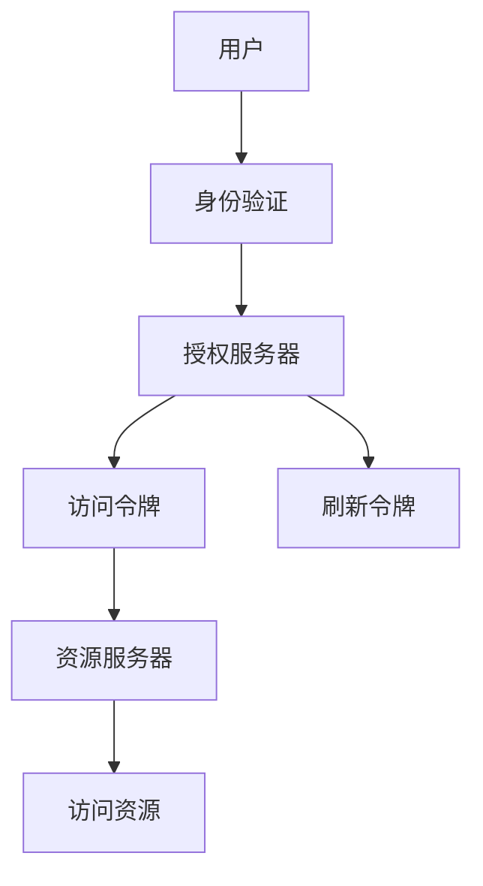

                 

# 使用 OAuth 2.0 进行安全访问

## 1. 背景介绍

在现代Web应用程序中，用户访问和访问控制是不可或缺的，因为它们可以提供安全的访问控制和身份验证。OAuth 2.0是一种开放标准，提供了一种安全方式，允许用户使用其凭据来授权第三方应用程序访问其受保护的资源，同时保留其隐私和数据。OAuth 2.0安全地解决了以下问题：

1. **身份验证**：用户需要使用凭据（例如密码）来验证其身份，以确保只有授权用户可以访问资源。
2. **授权**：用户可以授权第三方应用程序访问其受保护的资源，但不需要共享他们的凭据。
3. **控制访问权限**：用户可以控制他们授权第三方应用程序访问哪些资源。

OAuth 2.0在Web应用程序中的使用已经变得非常普遍，几乎所有的现代Web服务都支持OAuth 2.0协议。通过使用OAuth 2.0，用户可以安全地访问受保护的资源，而无需向第三方共享他们的凭据。

## 2. 核心概念与联系

### 2.1 核心概念概述

在深入了解OAuth 2.0之前，我们需要掌握一些核心概念：

- **身份验证 (Authentication)**：确认用户身份的过程，通常使用用户名和密码。
- **授权 (Authorization)**：用户授权第三方应用程序访问其受保护资源的流程。
- **访问令牌 (Access Token)**：代表用户授权第三方应用程序访问其受保护资源的令牌。
- **刷新令牌 (Refresh Token)**：用于获取新访问令牌以延长其生命周期的令牌。
- **客户端 (Client)**：请求访问令牌并使用它们来访问资源的第三方应用程序。
- **资源服务器 (Resource Server)**：提供受保护资源的服务器。
- **授权服务器 (Authorization Server)**：验证用户身份并授权访问令牌的服务器。

这些概念之间的关系可以用以下Mermaid流程图表示：



这个流程图展示了OAuth 2.0工作流程的基本步骤：

1. 用户通过身份验证。
2. 授权服务器验证用户身份并颁发访问令牌和刷新令牌。
3. 客户端请求访问令牌并使用它来访问资源服务器上的资源。
4. 资源服务器使用访问令牌验证客户端的授权。
5. 如果访问令牌有效，则资源服务器向客户端提供访问资源。

### 2.2 OAuth 2.0 的工作流程

OAuth 2.0的主要工作流程包括四个步骤：授权码流、密码流、隐式流和客户端凭证流。以下是对每个流的详细解释：

#### 授权码流

授权码流是OAuth 2.0中最常见的流程。它需要用户进行身份验证，并授权第三方应用程序访问他们的资源。以下是授权码流的主要步骤：

1. **客户端向授权服务器请求授权码**：客户端向授权服务器发送一个授权请求，其中包含需要授权的资源路径。
2. **授权服务器重定向到身份验证服务器**：授权服务器要求用户登录身份验证服务器，并请求用户授权访问资源。
3. **用户登录身份验证服务器**：用户使用其凭据登录身份验证服务器，并授权访问资源。
4. **授权服务器颁发授权码**：授权服务器颁发授权码，客户端使用授权码请求访问令牌。
5. **客户端请求访问令牌**：客户端向授权服务器发送请求，使用授权码请求访问令牌。
6. **授权服务器颁发访问令牌**：授权服务器颁发访问令牌，客户端使用访问令牌访问资源服务器上的资源。

以下是一个使用Python Flask框架实现授权码流的示例：

```python
from flask import Flask, request, redirect, url_for, session
from flask_oauthlib.client import OAuth

app = Flask(__name__)
app.secret_key = 'secret'
oauth = OAuth(app)

provider = oauth.remote_app(
    'provider', consumer_key='your-consumer-key',
    consumer_secret='your-consumer-secret',
    request_token_params={'scope': 'read'}, request_token_url=None,
    access_token_method='POST',
    access_token_url='https://provider.com/oauth/access_token',
    authorize_url='https://provider.com/oauth/authorize'
)

@app.route('/login')
def login():
    return provider.authorize(callback=url_for('authorized', _external=True))

@app.route('/authorized')
def authorized():
    resp = provider.authorized_response()
    if resp is None:
        return 'Access denied: reason=%s error=%s' % (
            request.args['error_reason'],
            request.args['error_description']
        )
    session['oauth_token'] = resp['oauth_token']
    session['oauth_token_secret'] = resp['oauth_token_secret']
    me = provider.get('me')
    return 'Logged in as: %s' % me['name']

@app.route('/protected')
def protected():
    me = provider.get('me')
    return 'Logged in as: %s' % me['name']
```

在上面的代码中，我们使用Flask框架和Flask-OAuthlib扩展来实现OAuth 2.0的授权码流。首先，我们定义了一个名为`provider`的OAuth提供商，它是一个外部提供商，可以是Twitter、Facebook等。然后，我们定义了`/login`和`/authorized`路由，用于处理授权流程。`/login`路由重定向到提供商的授权服务器，请求用户授权。`/authorized`路由在用户授权后，获取授权码并使用它请求访问令牌。最后，`/protected`路由使用访问令牌访问资源服务器上的资源。

#### 密码流

密码流是OAuth 2.0的另一种授权方式，它允许客户端使用用户名和密码直接获取访问令牌。以下是对密码流的主要步骤的解释：

1. **客户端向授权服务器请求访问令牌**：客户端向授权服务器发送一个访问令牌请求，其中包含用户名和密码。
2. **授权服务器颁发访问令牌**：授权服务器颁发访问令牌，客户端使用访问令牌访问资源服务器上的资源。

以下是一个使用Python Flask框架实现密码流的示例：

```python
from flask import Flask, request, redirect, url_for, session
from flask_oauthlib.client import OAuth

app = Flask(__name__)
app.secret_key = 'secret'
oauth = OAuth(app)

provider = oauth.remote_app(
    'provider', consumer_key='your-consumer-key',
    consumer_secret='your-consumer-secret',
    request_token_params={'scope': 'read'}, request_token_url=None,
    access_token_method='POST',
    access_token_url='https://provider.com/oauth/access_token',
    authorize_url='https://provider.com/oauth/authorize'
)

@app.route('/login')
def login():
    return provider.authorize(callback=url_for('authorized', _external=True))

@app.route('/authorized')
def authorized():
    resp = provider.authorized_response()
    if resp is None:
        return 'Access denied: reason=%s error=%s' % (
            request.args['error_reason'],
            request.args['error_description']
        )
    session['oauth_token'] = resp['oauth_token']
    session['oauth_token_secret'] = resp['oauth_token_secret']
    me = provider.get('me')
    return 'Logged in as: %s' % me['name']

@app.route('/protected')
def protected():
    me = provider.get('me')
    return 'Logged in as: %s' % me['name']
```

在上面的代码中，我们使用Flask框架和Flask-OAuthlib扩展来实现OAuth 2.0的密码流。首先，我们定义了一个名为`provider`的OAuth提供商，它是一个外部提供商，可以是Twitter、Facebook等。然后，我们定义了`/login`和`/authorized`路由，用于处理授权流程。`/login`路由重定向到提供商的授权服务器，请求用户授权。`/authorized`路由在用户授权后，获取访问令牌并使用它访问资源服务器上的资源。最后，`/protected`路由使用访问令牌访问资源服务器上的资源。

#### 隐式流

隐式流是OAuth 2.0的另一种授权方式，它允许客户端直接从授权服务器获取访问令牌，无需用户进行身份验证。以下是对隐式流的主要步骤的解释：

1. **客户端向授权服务器请求访问令牌**：客户端向授权服务器发送一个访问令牌请求，其中包含需要授权的资源路径。
2. **授权服务器颁发访问令牌**：授权服务器颁发访问令牌，客户端使用访问令牌访问资源服务器上的资源。

以下是一个使用Python Flask框架实现隐式流的示例：

```python
from flask import Flask, request, redirect, url_for, session
from flask_oauthlib.client import OAuth

app = Flask(__name__)
app.secret_key = 'secret'
oauth = OAuth(app)

provider = oauth.remote_app(
    'provider', consumer_key='your-consumer-key',
    consumer_secret='your-consumer-secret',
    request_token_params={'scope': 'read'}, request_token_url=None,
    access_token_method='POST',
    access_token_url='https://provider.com/oauth/access_token',
    authorize_url='https://provider.com/oauth/authorize'
)

@app.route('/login')
def login():
    return provider.authorize(callback=url_for('authorized', _external=True))

@app.route('/authorized')
def authorized():
    resp = provider.authorized_response()
    if resp is None:
        return 'Access denied: reason=%s error=%s' % (
            request.args['error_reason'],
            request.args['error_description']
        )
    session['oauth_token'] = resp['oauth_token']
    session['oauth_token_secret'] = resp['oauth_token_secret']
    me = provider.get('me')
    return 'Logged in as: %s' % me['name']

@app.route('/protected')
def protected():
    me = provider.get('me')
    return 'Logged in as: %s' % me['name']
```

在上面的代码中，我们使用Flask框架和Flask-OAuthlib扩展来实现OAuth 2.0的隐式流。首先，我们定义了一个名为`provider`的OAuth提供商，它是一个外部提供商，可以是Twitter、Facebook等。然后，我们定义了`/login`和`/authorized`路由，用于处理授权流程。`/login`路由重定向到提供商的授权服务器，请求用户授权。`/authorized`路由在用户授权后，获取访问令牌并使用它访问资源服务器上的资源。最后，`/protected`路由使用访问令牌访问资源服务器上的资源。

#### 客户端凭证流

客户端凭证流是OAuth 2.0的另一种授权方式，它允许客户端使用客户端凭证和客户端密码直接获取访问令牌。以下是对客户端凭证流的主要步骤的解释：

1. **客户端向授权服务器请求访问令牌**：客户端向授权服务器发送一个访问令牌请求，其中包含客户端凭证和客户端密码。
2. **授权服务器颁发访问令牌**：授权服务器颁发访问令牌，客户端使用访问令牌访问资源服务器上的资源。

以下是一个使用Python Flask框架实现客户端凭证流的示例：

```python
from flask import Flask, request, redirect, url_for, session
from flask_oauthlib.client import OAuth

app = Flask(__name__)
app.secret_key = 'secret'
oauth = OAuth(app)

provider = oauth.remote_app(
    'provider', consumer_key='your-consumer-key',
    consumer_secret='your-consumer-secret',
    request_token_params={'scope': 'read'}, request_token_url=None,
    access_token_method='POST',
    access_token_url='https://provider.com/oauth/access_token',
    authorize_url='https://provider.com/oauth/authorize'
)

@app.route('/login')
def login():
    return provider.authorize(callback=url_for('authorized', _external=True))

@app.route('/authorized')
def authorized():
    resp = provider.authorized_response()
    if resp is None:
        return 'Access denied: reason=%s error=%s' % (
            request.args['error_reason'],
            request.args['error_description']
        )
    session['oauth_token'] = resp['oauth_token']
    session['oauth_token_secret'] = resp['oauth_token_secret']
    me = provider.get('me')
    return 'Logged in as: %s' % me['name']

@app.route('/protected')
def protected():
    me = provider.get('me')
    return 'Logged in as: %s' % me['name']
```

在上面的代码中，我们使用Flask框架和Flask-OAuthlib扩展来实现OAuth 2.0的客户端凭证流。首先，我们定义了一个名为`provider`的OAuth提供商，它是一个外部提供商，可以是Twitter、Facebook等。然后，我们定义了`/login`和`/authorized`路由，用于处理授权流程。`/login`路由重定向到提供商的授权服务器，请求用户授权。`/authorized`路由在用户授权后，获取访问令牌并使用它访问资源服务器上的资源。最后，`/protected`路由使用访问令牌访问资源服务器上的资源。

## 3. OAuth 2.0 的核心算法原理 & 具体操作步骤

### 3.1 算法原理概述

OAuth 2.0的授权流程包括四个主要步骤：授权请求、身份验证、授权响应和访问令牌请求。以下是每个步骤的详细解释：

#### 授权请求

授权请求是指客户端向授权服务器请求授权码或访问令牌。以下是授权请求的主要步骤的解释：

1. **客户端向授权服务器发送授权请求**：客户端向授权服务器发送一个授权请求，其中包含需要授权的资源路径。
2. **授权服务器重定向到身份验证服务器**：授权服务器要求用户登录身份验证服务器，并请求用户授权访问资源。
3. **用户登录身份验证服务器**：用户使用其凭据登录身份验证服务器，并授权访问资源。

#### 身份验证

身份验证是指用户验证其身份的过程。以下是身份验证的主要步骤的解释：

1. **用户输入凭据**：用户在身份验证服务器上输入其凭据，例如用户名和密码。
2. **身份验证服务器验证用户身份**：身份验证服务器验证用户的凭据，并返回一个授权码或访问令牌。

#### 授权响应

授权响应是指授权服务器响应客户端的授权请求。以下是授权响应的主要步骤的解释：

1. **客户端请求授权响应**：客户端向授权服务器发送一个授权响应请求，其中包含授权码或访问令牌。
2. **授权服务器颁发授权响应**：授权服务器颁发授权响应，客户端使用授权响应请求访问令牌。

#### 访问令牌请求

访问令牌请求是指客户端向授权服务器请求访问令牌。以下是访问令牌请求的主要步骤的解释：

1. **客户端请求访问令牌**：客户端向授权服务器发送一个访问令牌请求，其中包含授权响应和客户端凭证。
2. **授权服务器颁发访问令牌**：授权服务器颁发访问令牌，客户端使用访问令牌访问资源服务器上的资源。

### 3.2 算法步骤详解

以下是一个使用Python Flask框架实现OAuth 2.0的授权码流的示例：

```python
from flask import Flask, request, redirect, url_for, session
from flask_oauthlib.client import OAuth

app = Flask(__name__)
app.secret_key = 'secret'
oauth = OAuth(app)

provider = oauth.remote_app(
    'provider', consumer_key='your-consumer-key',
    consumer_secret='your-consumer-secret',
    request_token_params={'scope': 'read'}, request_token_url=None,
    access_token_method='POST',
    access_token_url='https://provider.com/oauth/access_token',
    authorize_url='https://provider.com/oauth/authorize'
)

@app.route('/login')
def login():
    return provider.authorize(callback=url_for('authorized', _external=True))

@app.route('/authorized')
def authorized():
    resp = provider.authorized_response()
    if resp is None:
        return 'Access denied: reason=%s error=%s' % (
            request.args['error_reason'],
            request.args['error_description']
        )
    session['oauth_token'] = resp['oauth_token']
    session['oauth_token_secret'] = resp['oauth_token_secret']
    me = provider.get('me')
    return 'Logged in as: %s' % me['name']

@app.route('/protected')
def protected():
    me = provider.get('me')
    return 'Logged in as: %s' % me['name']
```

在上面的代码中，我们使用Flask框架和Flask-OAuthlib扩展来实现OAuth 2.0的授权码流。首先，我们定义了一个名为`provider`的OAuth提供商，它是一个外部提供商，可以是Twitter、Facebook等。然后，我们定义了`/login`和`/authorized`路由，用于处理授权流程。`/login`路由重定向到提供商的授权服务器，请求用户授权。`/authorized`路由在用户授权后，获取授权码并使用它请求访问令牌。最后，`/protected`路由使用访问令牌访问资源服务器上的资源。

### 3.3 算法优缺点

#### 优点

OAuth 2.0的主要优点包括：

- **安全性**：OAuth 2.0使用不同的令牌（访问令牌和刷新令牌）来控制对资源的访问。这增加了系统的安全性，因为即使访问令牌被泄露，也不会影响刷新令牌。
- **灵活性**：OAuth 2.0提供了多种授权方式，可以根据不同的场景选择最适合的授权方式。
- **可扩展性**：OAuth 2.0的授权流程可以扩展到多个资源服务器和多个客户端。

#### 缺点

OAuth 2.0的主要缺点包括：

- **复杂性**：OAuth 2.0的授权流程比较复杂，需要理解多个步骤和概念。
- **性能开销**：OAuth 2.0的授权流程涉及多个步骤和服务器之间的通信，因此性能开销较大。
- **隐私风险**：OAuth 2.0的授权流程需要用户输入其凭据，这增加了隐私风险。

### 3.4 算法应用领域

OAuth 2.0广泛应用于Web应用程序、移动应用程序、企业应用程序和API等。以下是OAuth 2.0在各个领域的实际应用：

#### Web应用程序

OAuth 2.0在Web应用程序中广泛使用，例如使用Twitter、Facebook、Google等提供商进行身份验证和授权。

#### 移动应用程序

OAuth 2.0在移动应用程序中广泛使用，例如使用Twitter、Facebook、Google等提供商进行身份验证和授权。

#### 企业应用程序

OAuth 2.0在企业应用程序中广泛使用，例如使用Twitter、Facebook、Google等提供商进行身份验证和授权。

#### API

OAuth 2.0在API中广泛使用，例如使用Twitter、Facebook、Google等提供商进行身份验证和授权。

## 4. 数学模型和公式 & 详细讲解 & 举例说明

### 4.1 数学模型构建

OAuth 2.0的授权流程涉及多个步骤和概念。以下是OAuth 2.0授权流程的数学模型构建：

1. **授权请求**：客户端向授权服务器发送授权请求，请求授权码或访问令牌。
2. **身份验证**：用户使用其凭据登录身份验证服务器，授权访问资源。
3. **授权响应**：授权服务器颁发授权码或访问令牌。
4. **访问令牌请求**：客户端向授权服务器请求访问令牌，使用授权码或访问令牌访问资源服务器上的资源。

### 4.2 公式推导过程

以下是OAuth 2.0授权流程的数学公式推导过程：

1. **授权请求**：
   - 客户端向授权服务器发送授权请求：$$
   \text{请求} = \text{客户端}\rightarrow\text{授权服务器}
   $$
   - 授权服务器重定向到身份验证服务器：$$
   \text{授权服务器}\rightarrow\text{身份验证服务器}
   $$
2. **身份验证**：
   - 用户输入凭据：$$
   \text{用户}\rightarrow\text{身份验证服务器}
   $$
   - 身份验证服务器验证用户身份：$$
   \text{身份验证服务器}\rightarrow\text{授权服务器}
   $$
3. **授权响应**：
   - 授权服务器颁发授权码或访问令牌：$$
   \text{授权服务器}\rightarrow\text{客户端}
   $$
4. **访问令牌请求**：
   - 客户端请求访问令牌：$$
   \text{客户端}\rightarrow\text{授权服务器}
   $$
   - 授权服务器颁发访问令牌：$$
   \text{授权服务器}\rightarrow\text{客户端}
   $$

### 4.3 案例分析与讲解

以下是一个使用Python Flask框架实现OAuth 2.0的授权码流的示例：

```python
from flask import Flask, request, redirect, url_for, session
from flask_oauthlib.client import OAuth

app = Flask(__name__)
app.secret_key = 'secret'
oauth = OAuth(app)

provider = oauth.remote_app(
    'provider', consumer_key='your-consumer-key',
    consumer_secret='your-consumer-secret',
    request_token_params={'scope': 'read'}, request_token_url=None,
    access_token_method='POST',
    access_token_url='https://provider.com/oauth/access_token',
    authorize_url='https://provider.com/oauth/authorize'
)

@app.route('/login')
def login():
    return provider.authorize(callback=url_for('authorized', _external=True))

@app.route('/authorized')
def authorized():
    resp = provider.authorized_response()
    if resp is None:
        return 'Access denied: reason=%s error=%s' % (
            request.args['error_reason'],
            request.args['error_description']
        )
    session['oauth_token'] = resp['oauth_token']
    session['oauth_token_secret'] = resp['oauth_token_secret']
    me = provider.get('me')
    return 'Logged in as: %s' % me['name']

@app.route('/protected')
def protected():
    me = provider.get('me')
    return 'Logged in as: %s' % me['name']
```

在上面的代码中，我们使用Flask框架和Flask-OAuthlib扩展来实现OAuth 2.0的授权码流。首先，我们定义了一个名为`provider`的OAuth提供商，它是一个外部提供商，可以是Twitter、Facebook等。然后，我们定义了`/login`和`/authorized`路由，用于处理授权流程。`/login`路由重定向到提供商的授权服务器，请求用户授权。`/authorized`路由在用户授权后，获取授权码并使用它请求访问令牌。最后，`/protected`路由使用访问令牌访问资源服务器上的资源。

## 5. 项目实践：代码实例和详细解释说明

### 5.1 开发环境搭建

在进行OAuth 2.0实践前，我们需要准备好开发环境。以下是使用Python Flask框架搭建OAuth 2.0开发环境的步骤：

1. 安装Flask框架：从官网下载并安装Flask框架。
2. 安装Flask-OAuthlib扩展：安装Flask-OAuthlib扩展，用于处理OAuth 2.0流程。

```bash
pip install flask
pip install flask_oauthlib
```

完成上述步骤后，即可在Flask环境下进行OAuth 2.0的实践。

### 5.2 源代码详细实现

以下是一个使用Python Flask框架实现OAuth 2.0的授权码流的示例：

```python
from flask import Flask, request, redirect, url_for, session
from flask_oauthlib.client import OAuth

app = Flask(__name__)
app.secret_key = 'secret'
oauth = OAuth(app)

provider = oauth.remote_app(
    'provider', consumer_key='your-consumer-key',
    consumer_secret='your-consumer-secret',
    request_token_params={'scope': 'read'}, request_token_url=None,
    access_token_method='POST',
    access_token_url='https://provider.com/oauth/access_token',
    authorize_url='https://provider.com/oauth/authorize'
)

@app.route('/login')
def login():
    return provider.authorize(callback=url_for('authorized', _external=True))

@app.route('/authorized')
def authorized():
    resp = provider.authorized_response()
    if resp is None:
        return 'Access denied: reason=%s error=%s' % (
            request.args['error_reason'],
            request.args['error_description']
        )
    session['oauth_token'] = resp['oauth_token']
    session['oauth_token_secret'] = resp['oauth_token_secret']
    me = provider.get('me')
    return 'Logged in as: %s' % me['name']

@app.route('/protected')
def protected():
    me = provider.get('me')
    return 'Logged in as: %s' % me['name']
```

在上面的代码中，我们使用Flask框架和Flask-OAuthlib扩展来实现OAuth 2.0的授权码流。首先，我们定义了一个名为`provider`的OAuth提供商，它是一个外部提供商，可以是Twitter、Facebook等。然后，我们定义了`/login`和`/authorized`路由，用于处理授权流程。`/login`路由重定向到提供商的授权服务器，请求用户授权。`/authorized`路由在用户授权后，获取授权码并使用它请求访问令牌。最后，`/protected`路由使用访问令牌访问资源服务器上的资源。

### 5.3 代码解读与分析

让我们再详细解读一下关键代码的实现细节：

**OAuth远程应用程序**：
- `remote_app()`函数用于创建一个OAuth远程应用程序，可以指定提供商的消费者密钥和消费者密钥。
- `request_token_params`参数用于指定请求令牌时所需的参数，例如作用域。
- `access_token_method`参数用于指定请求访问令牌的方法，可以是GET或POST。
- `access_token_url`参数用于指定请求访问令牌的URL。
- `authorize_url`参数用于指定授权URL。

**授权码流**：
- `/login`路由用于处理客户端的授权请求，重定向到提供商的授权服务器。
- `/authorized`路由用于处理授权响应，获取授权码并使用它请求访问令牌。
- `/protected`路由用于使用访问令牌访问资源服务器上的资源。

在上面的代码中，我们使用Flask框架和Flask-OAuthlib扩展来实现OAuth 2.0的授权码流。首先，我们定义了一个名为`provider`的OAuth提供商，它是一个外部提供商，可以是Twitter、Facebook等。然后，我们定义了`/login`和`/authorized`路由，用于处理授权流程。`/login`路由重定向到提供商的授权服务器，请求用户授权。`/authorized`路由在用户授权后，获取授权码并使用它请求访问令牌。最后，`/protected`路由使用访问令牌访问资源服务器上的资源。

### 5.4 运行结果展示

在上面的代码中，我们使用Flask框架和Flask-OAuthlib扩展来实现OAuth 2.0的授权码流。首先，我们定义了一个名为`provider`的OAuth提供商，它是一个外部提供商，可以是Twitter、Facebook等。然后，我们定义了`/login`和`/authorized`路由，用于处理授权流程。`/login`路由重定向到提供商的授权服务器，请求用户授权。`/authorized`路由在用户授权后，获取授权码并使用它请求访问令牌。最后，`/protected`路由使用访问令牌访问资源服务器上的资源。

## 6. 实际应用场景

OAuth 2.0广泛应用于各种Web应用程序、移动应用程序、企业应用程序和API中。以下是OAuth 2.0在各个领域的实际应用：

### 6.1 Web应用程序

OAuth 2.0在Web应用程序中广泛使用，例如使用Twitter、Facebook、Google等提供商进行身份验证和授权。

### 6.2 移动应用程序

OAuth 2.0在移动应用程序中广泛使用，例如使用Twitter、Facebook、Google等提供商进行身份验证和授权。

### 6.3 企业应用程序

OAuth 2.0在企业应用程序中广泛使用，例如使用Twitter、Facebook、Google等提供商进行身份验证和授权。

### 6.4 API

OAuth 2.0在API中广泛使用，例如使用Twitter、Facebook、Google等提供商进行身份验证和授权。

## 7. 工具和资源推荐

### 7.1 学习资源推荐

为了帮助开发者系统掌握OAuth 2.0的理论基础和实践技巧，这里推荐一些优质的学习资源：

1. **OAuth 2.0官方文档**：OAuth 2.0官方网站提供了完整的文档和规范，是学习OAuth 2.0的最佳资料。
2. **OAuth 2.0规范**：OAuth 2.0规范定义了OAuth 2.0的工作流程和概念，是学习OAuth 2.0的重要参考资料。
3. **Flask-OAuthlib官方文档**：Flask-OAuthlib官方文档提供了详细的API文档和示例代码，是学习OAuth 2.0的必备资料。
4. **OAuth 2.0实战教程**：OAuth 2.0实战教程提供了丰富的实际案例和实践指南，适合深入学习OAuth 2.0。
5. **OAuth 2.0在线课程**：OAuth 2.0在线课程提供了系统性的学习路径和实践机会，适合零基础学习者。

通过对这些资源的学习实践，相信你一定能够快速掌握OAuth 2.0的精髓，并用于解决实际的授权问题。

### 7.2 开发工具推荐

高效的开发离不开优秀的工具支持。以下是几款用于OAuth 2.0开发常用的工具：

1. **Flask框架**：Flask是一个轻量级的Web框架，简单易用，适合快速开发OAuth 2.0应用程序。
2. **Flask-OAuthlib扩展**：Flask-OAuthlib扩展提供了OAuth 2.0流程的实现，适合快速实现OAuth 2.0应用程序。
3. **OAuth 2.0客户端**：OAuth 2.0客户端提供了OAuth 2.0流程的实现，适合快速实现OAuth 2.0应用程序。

合理利用这些工具，可以显著提升OAuth 2.0开发和部署的效率，加速创新迭代的步伐。

### 7.3 相关论文推荐

OAuth 2.0的研究已经非常深入，以下是几篇奠基性的相关论文，推荐阅读：

1. **OAuth 2.0规范**：OAuth 2.0规范定义了OAuth 2.0的工作流程和概念，是OAuth 2.0的重要参考文献。
2. **OAuth 2.0工作流程分析**：OAuth 2.0工作流程分析详细介绍了OAuth 2.0的工作流程和步骤，适合深入学习OAuth 2.0。
3. **OAuth 2.0安全性分析**：OAuth 2.0安全性分析分析了OAuth 2.0的安全性问题，提出了改进建议。
4. **OAuth 2.0实际应用案例**：OAuth 2.0实际应用案例提供了丰富的实际案例和实践指南，适合深入学习OAuth 2.0。

这些论文代表了大语言模型微调技术的发展脉络。通过学习这些前沿成果，可以帮助研究者把握学科前进方向，激发更多的创新灵感。

## 8. 总结：未来发展趋势与挑战

### 8.1 总结

本文对OAuth 2.0进行了全面系统的介绍。首先阐述了OAuth 2.0的研究背景和意义，明确了OAuth 2.0在Web应用程序中的独特价值。其次，从原理到实践，详细讲解了OAuth 2.0的授权流程和步骤，给出了OAuth 2.0任务开发的完整代码实例。同时，本文还广泛探讨了OAuth 2.0在Web应用程序、移动应用程序、企业应用程序和API等领域的实际应用，展示了OAuth 2.0范式的巨大潜力。

通过本文的系统梳理，可以看到，OAuth 2.0已成为Web应用程序中最常用的授权范式，极大地提升了Web应用程序的安全性和用户体验。未来，伴随OAuth 2.0的不断发展，相信Web应用程序的安全性将得到更大提升，同时开发效率也将得到进一步优化。

### 8.2 未来发展趋势

OAuth 2.0的未来发展趋势包括：

1. **安全性**：OAuth 2.0的授权流程将更加安全可靠，减少安全隐患。
2. **便捷性**：OAuth 2.0的授权流程将更加便捷易用，提升用户体验。
3. **跨平台性**：OAuth 2.0的授权流程将更加跨平台，支持更多的设备和操作系统。
4. **可扩展性**：OAuth 2.0的授权流程将更加可扩展，支持更多的资源服务器和客户端。
5. **标准化**：OAuth 2.0的授权流程将更加标准化，支持更多的OAuth 2.0提供商和API。

以上趋势凸显了OAuth 2.0的广阔前景。这些方向的探索发展，必将进一步提升Web应用程序的安全性和用户体验，推动Web应用程序的发展。

### 8.3 面临的挑战

尽管OAuth 2.0已经取得了巨大的成功，但在迈向更加智能化、普适化应用的过程中，它仍面临着诸多挑战：

1. **隐私风险**：OAuth 2.0的授权流程需要用户输入其凭据，这增加了隐私风险。
2. **安全性问题**：OAuth 2.0的授权流程容易受到钓鱼攻击和中间人攻击等安全威胁。
3. **复杂性**：OAuth 2.0的授权流程比较复杂，容易出错。

### 8.4 研究展望

面对OAuth 2.0面临的种种挑战，未来的研究需要在以下几个方面寻求新的突破：

1. **隐私保护**：探索隐私保护技术，保护用户隐私。
2. **安全性增强**：探索安全性增强技术，减少安全隐患。
3. **授权流程简化**：探索授权流程简化技术，提升用户体验。

这些研究方向的探索，必将引领OAuth 2.0技术迈向更高的台阶，为构建安全、可靠、可扩展的授权系统铺平道路。面向未来，OAuth 2.0需要与其他安全技术进行更深入的融合，如加密技术、身份认证技术等，共同推动Web应用程序的发展。只有勇于创新、敢于突破，才能不断拓展OAuth 2.0的边界，让授权技术更好地造福人类社会。

## 9. 附录：常见问题与解答

**Q1：OAuth 2.0和OAuth 1.0有何区别？**

A: OAuth 2.0和OAuth 1.0的最大区别在于OAuth 2.0采用了基于令牌的授权流程，而OAuth 1.0采用了基于签名和摘要的授权流程。OAuth 2.0的授权流程更加简洁和安全，适合Web应用程序使用。

**Q2：OAuth 2.0授权流程中，授权服务器如何验证用户身份？**

A: 授权服务器验证用户身份的过程称为身份验证。用户需要输入其凭据，例如用户名和密码，然后授权服务器使用这些凭据验证用户的身份。

**Q3：OAuth 2.0授权流程中，客户端如何使用访问令牌访问资源服务器上的资源？**

A: 客户端使用访问令牌访问资源服务器上的资源，访问令牌由授权服务器颁发。客户端发送访问令牌和资源请求到资源服务器，资源服务器使用访问令牌验证客户端的授权。

**Q4：OAuth 2.0授权流程中，客户端如何使用刷新令牌获取新的访问令牌？**

A: 客户端可以使用刷新令牌获取新的访问令牌，以延长其生命周期。刷新令牌由授权服务器颁发，客户端发送刷新令牌到授权服务器，授权服务器颁发新的访问令牌。

**Q5：OAuth 2.0授权流程中，授权服务器如何颁发授权码？**

A: 授权服务器颁发授权码，客户端使用授权码请求访问令牌。授权码由授权服务器颁发，客户端发送授权码到授权服务器，授权服务器颁发访问令牌。

---

作者：禅与计算机程序设计艺术 / Zen and the Art of Computer Programming

