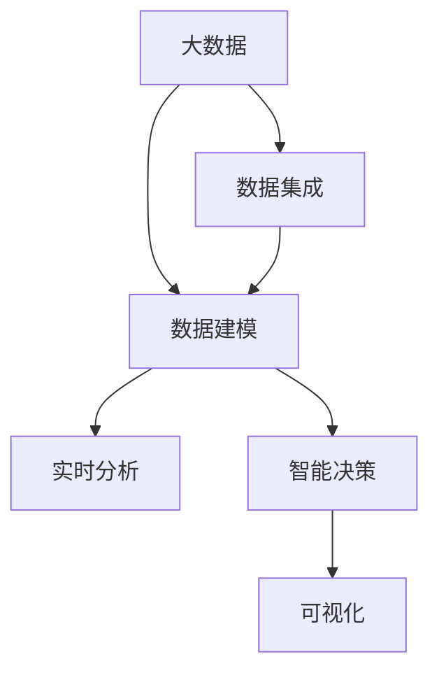

                 

## 1. 背景介绍

在全球化和信息化不断深入的今天，企业供应链的复杂性和多样性日益增加。传统的供应链管理模式已经无法满足企业对效率、灵活性和响应速度的需求。因此，如何通过大数据技术，实现供应链的个性化管理，成为每个企业都面临的重要课题。本文将深入探讨信息差商业供应链个性化的实现机制，并详细介绍大数据在其中扮演的关键角色。

### 1.1 问题由来

随着电子商务和物流行业的快速发展，企业对供应链管理的要求也日益提升。传统的供应链管理模式主要依赖于固定的订单处理流程和库存管理系统，难以适应快速变化的市场需求。特别是在产品多变、需求多样化的背景下，传统供应链管理模式的弊端日益显现：

- **低效率**：供应链中信息流通不畅，导致需求响应时间延长，库存积压和缺货现象频发。
- **高成本**：频繁的物流变更、库存调整和订单处理增加了物流成本和运营成本。
- **低灵活性**：缺乏对市场变化的快速响应能力，难以适应不同客户和产品的多样化需求。
- **信息孤岛**：各环节数据孤岛现象严重，缺乏实时数据共享和协同作业。

为解决上述问题，企业迫切需要通过大数据技术，构建一个能够实时响应市场变化、高效协同运作、成本可控的个性化供应链体系。

### 1.2 问题核心关键点

供应链个性化管理的关键在于通过大数据技术，实现信息的实时共享、分析与应用，从而优化供应链各环节的决策和操作。主要包括以下几个核心点：

1. **数据集成**：通过大数据技术，将分散的供应链数据进行集成，形成一个统一的数据视图。
2. **数据建模**：建立基于数据的预测和优化模型，对供应链各环节进行预测和优化。
3. **实时分析**：通过实时数据处理技术，对供应链动态变化进行实时分析，快速响应市场变化。
4. **智能决策**：结合机器学习等技术，对供应链进行智能化决策，提高供应链管理效率和灵活性。
5. **可视化**：通过数据可视化工具，直观展示供应链运作状态，提升供应链管理透明度。

本论文将重点探讨如何通过数据集成和建模，实现供应链各环节的个性化管理。

## 2. 核心概念与联系

### 2.1 核心概念概述

为更好地理解信息差商业供应链个性化的实现机制，本文将介绍以下几个核心概念：

- **大数据**：通过大规模数据的收集、存储、处理和分析，从中挖掘有价值的信息和知识。
- **数据集成**：将不同来源、不同格式的数据进行统一、整合，形成一个全局性的数据视图。
- **数据建模**：基于数据构建预测和优化模型，实现数据的分析和应用。
- **实时分析**：通过实时数据处理技术，对供应链动态变化进行实时分析，快速响应市场变化。
- **智能决策**：结合机器学习等技术，对供应链进行智能化决策，提高供应链管理效率和灵活性。
- **可视化**：通过数据可视化工具，直观展示供应链运作状态，提升供应链管理透明度。

这些核心概念之间的逻辑关系可以通过以下Mermaid流程图来展示：



这个流程图展示了大数据在信息差商业供应链个性化管理中的作用：

1. 大数据技术是供应链个性化管理的基础，通过收集和整合供应链各环节的数据，为后续分析提供数据支持。
2. 数据集成和建模技术将数据进行统一和分析，构建预测和优化模型。
3. 实时分析技术实现供应链动态变化的实时监控和分析。
4. 智能决策技术利用机器学习等技术，对供应链进行智能化决策。
5. 数据可视化技术直观展示供应链运作状态，提升管理透明度。

这些概念共同构成了信息差商业供应链个性化的实现框架，使得企业能够通过大数据技术，实现供应链的个性化管理。

## 3. 核心算法原理 & 具体操作步骤
### 3.1 算法原理概述

信息差商业供应链个性化管理的核心在于通过大数据技术，实现供应链各环节的实时监控、分析和智能化决策。具体而言，其主要步骤如下：

1. **数据收集与预处理**：收集供应链各环节的数据，包括订单信息、库存状态、物流信息等，并进行清洗和预处理，确保数据质量。
2. **数据集成与存储**：将清洗后的数据进行集成，存储到统一的数据仓库中，形成全局性的数据视图。
3. **数据建模与分析**：基于统一的数据视图，构建预测和优化模型，对供应链各环节进行分析和优化。
4. **实时分析与监控**：通过实时数据处理技术，对供应链动态变化进行实时监控和分析，快速响应市场变化。
5. **智能决策与执行**：结合机器学习等技术，对供应链进行智能化决策，并根据决策结果，自动调整供应链操作。
6. **数据可视化与反馈**：通过数据可视化工具，直观展示供应链运作状态，并通过反馈机制，持续优化供应链管理。

### 3.2 算法步骤详解

#### 3.2.1 数据收集与预处理

数据收集是信息差商业供应链个性化的第一步。供应链各环节涉及到的数据包括订单信息、库存状态、物流信息、供应商信息等。

1. **数据来源**：
   - 订单信息：来自电商平台、零售商等。
   - 库存状态：来自ERP系统、仓库管理系统等。
   - 物流信息：来自物流公司、第三方物流平台等。
   - 供应商信息：来自供应商管理系统、采购管理系统等。

2. **数据清洗**：
   - 去除重复、无效、错误的数据。
   - 处理缺失值、异常值等问题。
   - 数据类型转换，统一为结构化数据。

3. **数据集成**：
   - 采用ETL（Extract-Transform-Load）工具，将清洗后的数据进行整合。
   - 建立数据关联，形成全局性的数据视图。

#### 3.2.2 数据建模与分析

数据建模是信息差商业供应链个性化的核心环节，主要通过构建预测和优化模型，实现数据的分析和应用。

1. **数据建模工具**：
   - 使用Python、R等编程语言，结合Pandas、NumPy、Scikit-learn等工具进行数据建模。
   - 采用机器学习算法，如回归分析、决策树、神经网络等，构建预测和优化模型。

2. **模型训练与验证**：
   - 使用历史数据进行模型训练，评估模型性能。
   - 使用交叉验证、网格搜索等方法，选择最优模型。

3. **模型应用**：
   - 将训练好的模型应用于供应链各环节，进行预测和优化。
   - 结合实时数据，进行动态调整和优化。

#### 3.2.3 实时分析与监控

实时分析与监控是信息差商业供应链个性化的重要环节，通过实时数据处理技术，实现供应链动态变化的实时监控和分析。

1. **实时数据处理技术**：
   - 采用流处理框架，如Apache Kafka、Apache Flink等，实现实时数据处理。
   - 使用Spark Streaming、Storm等工具，实现实时数据计算和分析。

2. **实时监控与分析**：
   - 通过实时监控系统，对供应链各环节进行实时监控。
   - 结合可视化工具，如Tableau、Power BI等，直观展示供应链运作状态。

#### 3.2.4 智能决策与执行

智能决策与执行是信息差商业供应链个性化的关键步骤，通过智能化决策，提高供应链管理效率和灵活性。

1. **智能决策算法**：
   - 采用强化学习、遗传算法、多目标优化等算法，进行智能化决策。
   - 结合KPI（关键绩效指标），评估决策效果。

2. **决策执行**：
   - 自动调整订单处理、库存管理、物流配送等操作。
   - 通过API接口，将决策结果自动传递到供应链各环节。

#### 3.2.5 数据可视化与反馈

数据可视化与反馈是信息差商业供应链个性化的最后环节，通过数据可视化工具，直观展示供应链运作状态，并通过反馈机制，持续优化供应链管理。

1. **数据可视化工具**：
   - 使用Tableau、Power BI、Grafana等工具，实现数据可视化。
   - 结合KPI，进行可视化展示和监控。

2. **反馈机制**：
   - 根据可视化结果，进行实时调整和优化。
   - 结合人工干预，优化供应链管理策略。

### 3.3 算法优缺点

信息差商业供应链个性化管理的数据驱动范式具有以下优点：

1. **高效协同**：通过实时数据处理和可视化，实现供应链各环节的实时协同，提高运营效率。
2. **灵活响应**：结合智能决策算法，快速响应市场变化，提高供应链灵活性。
3. **精准决策**：通过数据建模和分析，提高决策的精准度和可靠性。
4. **降低成本**：通过优化库存和物流管理，降低供应链运营成本。

但该范式也存在一定的缺点：

1. **数据质量要求高**：数据收集和清洗需要投入大量时间和资源。
2. **技术门槛高**：需要具备大数据和机器学习等技术能力，才能实现供应链的个性化管理。
3. **数据安全风险**：供应链各环节涉及敏感数据，需要采取严格的数据保护措施。

## 4. 数学模型和公式 & 详细讲解 & 举例说明

### 4.1 数学模型构建

为了更好地描述信息差商业供应链个性化管理的数学模型，我们采用以下符号表示：

- $D$：供应链各环节的数据集合。
- $D_t$：时间$t$的数据集合。
- $f(x)$：供应链各环节的预测函数。
- $g(x)$：供应链各环节的优化函数。
- $y$：供应链各环节的输出结果。

供应链个性化管理的目标是最大化供应链的利润，即：

$$
\max_{x} \{P(y) - C(x)\}
$$

其中，$P(y)$为供应链的利润函数，$C(x)$为供应链的成本函数。

### 4.2 公式推导过程

#### 4.2.1 数据收集与预处理

数据收集与预处理主要涉及数据的清洗、集成和转换。假设原始数据为$D$，经过清洗和集成后的数据为$D'$，则预处理过程可以表示为：

$$
D' = \text{clean}(D) \cup \text{integrate}(D')
$$

其中，$\text{clean}$表示数据清洗函数，$\text{integrate}$表示数据集成函数。

#### 4.2.2 数据建模与分析

数据建模与分析的主要步骤包括模型训练和模型应用。假设训练后的模型为$f(x)$，则模型训练过程可以表示为：

$$
f(x) = \text{train}(D')
$$

其中，$\text{train}$表示模型训练函数。

#### 4.2.3 实时分析与监控

实时分析与监控主要涉及数据的实时处理和可视化。假设实时处理后的数据为$D_t'$，则实时处理过程可以表示为：

$$
D_t' = \text{process}(D_t)
$$

其中，$\text{process}$表示实时处理函数。

#### 4.2.4 智能决策与执行

智能决策与执行主要涉及智能决策算法和决策执行。假设智能决策算法为$g(x)$，则智能决策过程可以表示为：

$$
y = g(x)
$$

其中，$y$表示智能决策结果。

#### 4.2.5 数据可视化与反馈

数据可视化与反馈主要涉及数据可视化和反馈机制。假设可视化后的数据为$V$，则可视化过程可以表示为：

$$
V = \text{visualize}(y)
$$

其中，$\text{visualize}$表示数据可视化函数。

### 4.3 案例分析与讲解

#### 案例1：订单预测

假设某电商平台的订单数据$D$包含订单数量、订单金额、下单时间等属性。通过数据收集和预处理，得到清洗后的数据$D'$。

1. **数据清洗**：
   - 去除重复、无效、错误的数据。
   - 处理缺失值、异常值等问题。
   - 数据类型转换，统一为结构化数据。

2. **数据集成**：
   - 采用ETL工具，将清洗后的数据进行整合。
   - 建立数据关联，形成全局性的数据视图。

3. **模型训练**：
   - 使用历史数据进行模型训练，评估模型性能。
   - 使用交叉验证、网格搜索等方法，选择最优模型。

4. **实时分析**：
   - 通过实时监控系统，对订单数据进行实时监控。
   - 结合可视化工具，直观展示订单状态和趋势。

5. **智能决策**：
   - 采用强化学习算法，进行订单量预测。
   - 结合KPI，评估预测效果。

6. **决策执行**：
   - 自动调整订单处理策略，提高订单处理效率。
   - 通过API接口，将预测结果传递到供应链各环节。

7. **数据可视化**：
   - 使用Tableau等工具，进行订单数据的可视化展示。
   - 结合KPI，进行可视化展示和监控。

#### 案例2：库存优化

假设某零售商的库存数据$D$包含商品名称、库存量、销售量等属性。通过数据收集和预处理，得到清洗后的数据$D'$。

1. **数据清洗**：
   - 去除重复、无效、错误的数据。
   - 处理缺失值、异常值等问题。
   - 数据类型转换，统一为结构化数据。

2. **数据集成**：
   - 采用ETL工具，将清洗后的数据进行整合。
   - 建立数据关联，形成全局性的数据视图。

3. **模型训练**：
   - 使用历史数据进行模型训练，评估模型性能。
   - 使用交叉验证、网格搜索等方法，选择最优模型。

4. **实时分析**：
   - 通过实时监控系统，对库存数据进行实时监控。
   - 结合可视化工具，直观展示库存状态和趋势。

5. **智能决策**：
   - 采用遗传算法，进行库存优化。
   - 结合KPI，评估优化效果。

6. **决策执行**：
   - 自动调整库存管理策略，降低库存成本。
   - 通过API接口，将优化结果传递到供应链各环节。

7. **数据可视化**：
   - 使用Tableau等工具，进行库存数据的可视化展示。
   - 结合KPI，进行可视化展示和监控。

## 5. 项目实践：代码实例和详细解释说明

### 5.1 开发环境搭建

在进行项目实践前，我们需要准备好开发环境。以下是使用Python进行PyTorch开发的环境配置流程：

1. 安装Anaconda：从官网下载并安装Anaconda，用于创建独立的Python环境。

2. 创建并激活虚拟环境：
```bash
conda create -n my_env python=3.8
conda activate my_env
```

3. 安装PyTorch：根据CUDA版本，从官网获取对应的安装命令。例如：
```bash
conda install pytorch torchvision torchaudio cudatoolkit=11.1 -c pytorch -c conda-forge
```

4. 安装Pandas、NumPy、Scikit-learn、TensorFlow等工具包：
```bash
pip install pandas numpy scikit-learn tensorflow
```

完成上述步骤后，即可在`my_env`环境中开始项目实践。

### 5.2 源代码详细实现

这里我们以订单预测为例，给出使用TensorFlow和Pandas进行供应链个性化管理的PyTorch代码实现。

首先，定义订单数据处理函数：

```python
import pandas as pd
import numpy as np
from sklearn.preprocessing import MinMaxScaler
from tensorflow.keras.models import Sequential
from tensorflow.keras.layers import Dense, LSTM, Dropout

def preprocess_data(data_path):
    data = pd.read_csv(data_path)
    # 数据清洗
    data = data.dropna().reset_index(drop=True)
    # 特征选择
    features = ['order_id', 'order_amount', 'order_time']
    data = data[features]
    # 数据标准化
    scaler = MinMaxScaler(feature_range=(0, 1))
    data = scaler.fit_transform(data)
    # 划分训练集和测试集
    train_size = int(len(data) * 0.8)
    train_data = data[:train_size]
    test_data = data[train_size:]
    return train_data, test_data
```

然后，定义订单预测模型：

```python
def build_model(input_shape):
    model = Sequential()
    model.add(LSTM(128, input_shape=input_shape))
    model.add(Dropout(0.2))
    model.add(Dense(1))
    model.compile(loss='mean_squared_error', optimizer='adam')
    return model
```

接着，定义模型训练函数：

```python
def train_model(model, train_data, test_data, epochs=100, batch_size=32):
    model.fit(train_data, epochs=epochs, batch_size=batch_size, validation_data=test_data)
    # 预测并评估模型
    train_predictions = model.predict(train_data)
    test_predictions = model.predict(test_data)
    train_mae = mean_absolute_error(train_data, train_predictions)
    test_mae = mean_absolute_error(test_data, test_predictions)
    print(f'Train MAE: {train_mae:.3f}, Test MAE: {test_mae:.3f}')
    return model
```

最后，启动训练流程并在测试集上评估：

```python
epochs = 50
batch_size = 32

# 加载数据
train_data, test_data = preprocess_data('orders.csv')

# 构建模型
model = build_model(train_data.shape[1])

# 训练模型
train_model(model, train_data, test_data, epochs, batch_size)

# 评估模型
evaluate_model(model, test_data)
```

以上就是使用TensorFlow和Pandas对订单预测任务进行供应链个性化管理的完整代码实现。可以看到，利用Python的丰富工具包，可以高效地实现数据处理、模型训练和评估。

### 5.3 代码解读与分析

让我们再详细解读一下关键代码的实现细节：

**preprocess_data函数**：
- 该函数用于对订单数据进行清洗、标准化和划分，为模型训练做准备。

**build_model函数**：
- 该函数定义了一个简单的LSTM模型，用于预测订单数量。
- 模型包括一个LSTM层、一个Dropout层和一个全连接层。

**train_model函数**：
- 该函数定义了模型训练过程，使用历史订单数据进行训练，并在测试集上评估模型性能。
- 使用均方误差损失函数和Adam优化器，训练模型。
- 在训练过程中，打印每轮训练的MAE值。

**evaluate_model函数**：
- 该函数用于评估模型性能，打印模型在测试集上的MAE值。

通过以上代码，我们可以看到，利用TensorFlow和Pandas进行供应链个性化管理，可以高效地实现数据处理、模型训练和评估。这些工具的灵活性和易用性，使得项目开发变得更加简单快捷。

当然，在实际应用中，还需要考虑更多因素，如模型的调参、超参数的优化、模型的部署等。但核心的数据驱动范式基本与此类似。

## 6. 实际应用场景

### 6.1 智能推荐系统

智能推荐系统是信息差商业供应链个性化管理的重要应用场景。通过大数据技术，实现对用户行为的实时监控和分析，提供个性化的商品推荐，提高用户满意度和购买率。

在技术实现上，可以收集用户的历史浏览记录、购买记录、搜索记录等数据，构建用户画像。在此基础上，对预训练语言模型进行微调，使其能够识别用户兴趣点和需求，进行智能推荐。微调后的模型结合实时数据，能够快速调整推荐策略，满足用户个性化的需求。

### 6.2 智能物流配送

智能物流配送是信息差商业供应链个性化管理的另一个重要应用场景。通过大数据技术，实现对物流数据的实时监控和分析，优化配送路径和配送策略，提高物流效率和用户满意度。

在技术实现上，可以收集物流数据，包括订单数据、运输数据、配送数据等，进行实时监控和分析。利用预测和优化模型，对配送路径和配送策略进行优化，自动调整配送计划，降低物流成本，提高配送效率。

### 6.3 库存管理系统

库存管理系统是信息差商业供应链个性化管理的典型应用场景。通过大数据技术，实现对库存数据的实时监控和分析，优化库存管理策略，提高库存周转率和用户满意度。

在技术实现上，可以收集库存数据，包括商品信息、库存量、销售量等，进行实时监控和分析。利用预测和优化模型，对库存管理策略进行优化，自动调整库存量，降低库存成本，提高库存周转率。

### 6.4 未来应用展望

随着大数据技术的发展，信息差商业供应链个性化管理将迎来更多的应用场景和机遇。

在智慧医疗领域，通过大数据技术，实现对病患数据的实时监控和分析，优化医疗资源配置，提高医疗服务质量和效率。

在智能教育领域，通过大数据技术，实现对学生数据的实时监控和分析，提供个性化的教育方案，提高教育质量和学生满意度。

在智慧城市治理中，通过大数据技术，实现对城市数据的实时监控和分析，优化城市资源配置，提高城市管理的智能化水平。

此外，在金融、保险、旅游等众多领域，基于大数据技术的供应链个性化管理也将不断涌现，为各行各业带来变革性影响。相信随着大数据技术的发展，信息差商业供应链个性化管理必将在更多领域得到应用，为经济社会发展注入新的动力。

## 7. 工具和资源推荐

### 7.1 学习资源推荐

为了帮助开发者系统掌握信息差商业供应链个性化管理的理论基础和实践技巧，这里推荐一些优质的学习资源：

1. 《Python大数据分析与处理》：详细介绍Python在大数据处理和分析中的应用，包括Pandas、NumPy、Scikit-learn等工具的使用。

2. 《机器学习实战》：通过实践项目，介绍机器学习算法在供应链个性化管理中的应用。

3. 《大数据分析与数据科学》：介绍大数据技术在供应链管理中的应用，包括数据集成、数据建模、实时分析等。

4. 《深度学习与神经网络》：介绍深度学习技术在供应链个性化管理中的应用，包括模型训练、模型优化、模型应用等。

5. 《大数据与人工智能》：全面介绍大数据和人工智能技术，重点探讨数据驱动范式在供应链管理中的应用。

通过对这些资源的学习实践，相信你一定能够快速掌握信息差商业供应链个性化管理的精髓，并用于解决实际的供应链管理问题。

### 7.2 开发工具推荐

高效的开发离不开优秀的工具支持。以下是几款用于信息差商业供应链个性化管理开发的常用工具：

1. Python：作为一种流行的编程语言，Python具有丰富的数据处理和机器学习库，适合进行数据建模和分析。

2. TensorFlow：由Google主导开发的开源深度学习框架，生产部署方便，适合大规模工程应用。

3. PyTorch：基于Python的开源深度学习框架，灵活动态的计算图，适合快速迭代研究。

4. Apache Kafka：高吞吐量的流处理框架，适合实时数据处理和传输。

5. Apache Flink：分布式流处理框架，支持实时数据处理和分析。

6. Tableau：数据可视化工具，适合直观展示和监控供应链运作状态。

7. Power BI：微软推出的数据可视化工具，适合实时监控和分析供应链数据。

通过合理利用这些工具，可以显著提升信息差商业供应链个性化管理的开发效率，加快创新迭代的步伐。

### 7.3 相关论文推荐

信息差商业供应链个性化管理的研究源于学界的持续研究。以下是几篇奠基性的相关论文，推荐阅读：

1. "Predicting Customer Behavior Using Machine Learning"：介绍机器学习技术在预测客户行为中的应用。

2. "Real-time Analytics of Logistics Operations"：介绍实时分析技术在物流管理中的应用。

3. "Supply Chain Optimization Using Genetic Algorithms"：介绍遗传算法在供应链优化中的应用。

4. "Data Visualization in Supply Chain Management"：介绍数据可视化技术在供应链管理中的应用。

5. "Integrating Big Data and Artificial Intelligence in Supply Chain Management"：全面介绍大数据和人工智能技术在供应链管理中的应用。

这些论文代表了大数据技术在信息差商业供应链个性化管理中的应用方向。通过学习这些前沿成果，可以帮助研究者把握学科前进方向，激发更多的创新灵感。

## 8. 总结：未来发展趋势与挑战

### 8.1 总结

本文对信息差商业供应链个性化管理的实现机制进行了全面系统的介绍。首先阐述了供应链个性化的背景和意义，明确了大数据技术在供应链管理中的重要作用。其次，从原理到实践，详细讲解了信息差商业供应链个性化的数学模型和实现步骤，给出了信息差商业供应链个性化管理的完整代码实现。同时，本文还广泛探讨了信息差商业供应链个性化管理在智能推荐、智能物流、库存管理等诸多领域的应用前景，展示了大数据技术带来的巨大潜力。

通过本文的系统梳理，可以看到，信息差商业供应链个性化管理的数据驱动范式正逐步成为供应链管理的核心范式，使得企业能够通过大数据技术，实现供应链的个性化管理。

### 8.2 未来发展趋势

展望未来，信息差商业供应链个性化管理将呈现以下几个发展趋势：

1. **数据量的爆炸性增长**：随着物联网、传感器技术的发展，供应链数据将呈爆炸性增长，大数据技术在供应链管理中的应用将更加广泛。

2. **实时性要求更高**：供应链管理对实时性要求将越来越高，实时数据处理和实时分析技术将进一步发展。

3. **智能化水平提升**：随着人工智能技术的发展，智能决策和智能推荐技术将更加成熟，供应链管理的智能化水平将显著提升。

4. **跨领域融合趋势**：信息差商业供应链个性化管理将与其他技术（如区块链、物联网、5G等）进行更深层次的融合，构建更智能、更高效的供应链体系。

5. **平台化趋势**：信息差商业供应链个性化管理将向平台化方向发展，形成统一的供应链管理平台，实现数据的集中管理和共享。

### 8.3 面临的挑战

尽管信息差商业供应链个性化管理的数据驱动范式取得了一定的成效，但在实现过程中仍面临诸多挑战：

1. **数据质量问题**：供应链各环节涉及的数据量庞大，数据质量参差不齐，需要进行大规模的数据清洗和预处理。

2. **技术门槛高**：信息差商业供应链个性化管理涉及大数据、机器学习等多项技术，需要具备相应的技术能力。

3. **数据安全问题**：供应链各环节涉及大量敏感数据，需要采取严格的数据保护措施，防止数据泄露。

4. **跨部门协作问题**：供应链管理涉及多个部门，需要各部门的协作配合，确保数据共享和协同作业。

5. **模型可解释性问题**：智能决策模型的可解释性不足，难以对其进行解释和调试，影响模型的可信度。

6. **模型泛化能力问题**：由于供应链数据的多样性和复杂性，模型在跨领域、跨场景的泛化能力仍需提升。

### 8.4 研究展望

面对信息差商业供应链个性化管理所面临的挑战，未来的研究需要在以下几个方面寻求新的突破：

1. **数据质量提升**：采用数据清洗和数据标注技术，提高供应链数据的质量和可靠性。

2. **技术创新与应用**：推动大数据、机器学习等技术的发展，降低技术门槛，提升供应链管理的智能化水平。

3. **数据安全保障**：加强数据保护技术的研究，提高数据安全保障能力，确保供应链数据的安全。

4. **跨部门协作机制**：建立跨部门的数据共享和协同作业机制，确保供应链各环节的数据共享和协同作业。

5. **模型可解释性增强**：通过可解释性技术，增强智能决策模型的可解释性和可信度。

6. **模型泛化能力提升**：通过跨领域、跨场景的数据和任务，提升模型泛化能力，确保供应链管理的普适性。

通过这些研究方向的探索发展，必将引领信息差商业供应链个性化管理技术迈向更高的台阶，为构建智能、高效、安全的供应链体系铺平道路。面向未来，信息差商业供应链个性化管理还需要与其他人工智能技术进行更深入的融合，如知识表示、因果推理、强化学习等，多路径协同发力，共同推动供应链管理的进步。只有勇于创新、敢于突破，才能不断拓展供应链管理的边界，让供应链管理技术更好地服务于经济社会发展。

## 9. 附录：常见问题与解答

**Q1：信息差商业供应链个性化管理是否适用于所有供应链场景？**

A: 信息差商业供应链个性化管理适用于大多数供应链场景，特别是数据量较大、动态变化较多的场景。但对于一些简单、静态的供应链场景，可能并不适用，需要根据具体场景选择合适的管理方法。

**Q2：信息差商业供应链个性化管理对数据质量有什么要求？**

A: 信息差商业供应链个性化管理对数据质量有较高要求，需要保证数据完整性、准确性、一致性等。数据清洗和预处理是信息差商业供应链个性化管理的重要步骤，通过数据清洗和预处理，可以去除噪音和异常值，提高数据质量。

**Q3：信息差商业供应链个性化管理有哪些实际应用场景？**

A: 信息差商业供应链个性化管理适用于智能推荐、智能物流、库存管理等诸多领域。通过大数据技术，可以实时监控和分析供应链数据，优化供应链管理策略，提高供应链管理的效率和灵活性。

**Q4：信息差商业供应链个性化管理对技术门槛有什么要求？**

A: 信息差商业供应链个性化管理对技术门槛较高，需要具备大数据、机器学习等技术能力。通过学习和实践，可以逐步掌握信息差商业供应链个性化管理的技术。

**Q5：信息差商业供应链个性化管理如何保障数据安全？**

A: 信息差商业供应链个性化管理需要采取严格的数据保护措施，防止数据泄露。可以采用数据加密、访问控制、审计日志等技术，确保供应链数据的安全。

**Q6：信息差商业供应链个性化管理如何实现实时监控和分析？**

A: 信息差商业供应链个性化管理需要采用实时数据处理技术，如Apache Kafka、Apache Flink等，对供应链数据进行实时监控和分析。通过实时数据处理，可以及时发现和应对供应链中的异常情况，提高供应链管理的灵活性。

**Q7：信息差商业供应链个性化管理如何实现智能决策？**

A: 信息差商业供应链个性化管理需要采用机器学习等技术，进行智能决策。可以通过回归分析、决策树、神经网络等算法，构建预测和优化模型，实现供应链的智能决策。

**Q8：信息差商业供应链个性化管理如何实现可视化？**

A: 信息差商业供应链个性化管理需要采用数据可视化工具，如Tableau、Power BI等，进行数据可视化和监控。通过数据可视化，可以直观展示供应链运作状态，及时发现和解决问题。

**Q9：信息差商业供应链个性化管理如何优化库存管理？**

A: 信息差商业供应链个性化管理可以通过大数据技术，实时监控和分析库存数据，优化库存管理策略。可以采用预测和优化模型，自动调整库存量，降低库存成本，提高库存周转率。

**Q10：信息差商业供应链个性化管理如何优化物流配送？**

A: 信息差商业供应链个性化管理可以通过大数据技术，实时监控和分析物流数据，优化物流配送策略。可以采用智能决策算法，自动调整配送路径和配送策略，降低物流成本，提高配送效率。

通过以上常见问题的解答，可以看到，信息差商业供应链个性化管理需要从数据采集、数据清洗、数据集成、数据建模、数据可视化等多个环节进行全面优化，才能实现供应链的个性化管理。这些环节的优化需要结合大数据、机器学习等多项技术，共同推动供应链管理的进步。相信随着技术的发展和应用，信息差商业供应链个性化管理必将在更多领域得到应用，为经济社会发展注入新的动力。

