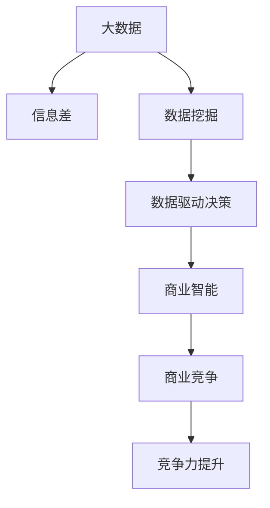

                 

# 信息差的商业竞争优势之源：大数据驱动的竞争力提升

> 关键词：大数据, 信息差, 商业竞争, 竞争力提升, 数据挖掘, 数据驱动决策

## 1. 背景介绍

### 1.1 问题由来

在当今竞争激烈的商业环境中，企业需要不断寻找并利用新的竞争优势以保持市场领先地位。传统上，企业依靠品牌、技术、资源等硬实力进行竞争，但这些手段的边际效益正在递减。随着数字化转型加速，企业竞争的重心开始向数据驱动决策转变。

### 1.2 问题核心关键点

数据驱动决策的核心在于获取并利用高质量的数据信息。而信息差（Information Gap），即企业内部、企业与用户之间、企业与合作伙伴之间等不同主体间的数据信息不对称现象，是导致商业决策失准、竞争力下降的重要因素。通过大数据技术获取并利用信息差，已成为企业提升竞争力、优化商业决策的关键途径。

## 2. 核心概念与联系

### 2.1 核心概念概述

为更好地理解大数据在商业竞争中的作用，本节将介绍几个关键概念：

- **大数据(Big Data)**：指结构化和非结构化数据规模巨大、多样性高、处理速度快的数据集合。大数据技术能够帮助企业从海量数据中提取有价值的信息，支持精准营销、产品优化等决策活动。

- **信息差(Information Gap)**：指在数据处理和分析过程中，不同主体之间存在的数据信息不对称现象。这种不对称可以体现在数据的质量、完整性、来源和分析能力上。

- **数据驱动决策(Data-Driven Decision Making)**：指以数据为依据，通过科学分析和预测，优化商业策略和决策过程。数据驱动决策要求高质量、高时效的数据支持，以实现更准确、更高效的决策。

- **数据挖掘(Data Mining)**：指从大量数据中挖掘出有价值的模式、趋势和知识，辅助企业进行市场分析、用户画像构建、个性化推荐等。

- **商业智能(Business Intelligence, BI)**：通过数据集成、可视化和分析，帮助企业管理层做出明智的商业决策，提升企业运营效率和市场竞争力。

这些核心概念之间的逻辑关系可以通过以下Mermaid流程图来展示：



这个流程图展示了大数据、信息差、数据挖掘、数据驱动决策、商业智能、商业竞争之间的逻辑关系：

1. 大数据为信息差分析提供了基础数据源。
2. 数据挖掘通过分析海量数据，揭示信息差，辅助商业决策。
3. 数据驱动决策要求高质量的数据支持，通过科学分析提升商业策略。
4. 商业智能通过可视化工具，帮助企业管理层理解数据，优化决策过程。
5. 商业智能中的数据洞察，转化为商业竞争优势，实现竞争力提升。

这些概念共同构成了大数据驱动决策的完整框架，帮助企业通过信息差提升商业竞争力。

## 3. 核心算法原理 & 具体操作步骤

### 3.1 算法原理概述

大数据驱动决策的核心在于利用高质量数据信息，进行科学分析，优化商业策略。通过信息差分析，企业可以识别出关键数据源，优化数据治理，提升数据驱动决策的科学性和准确性。具体而言，基于大数据的商业竞争优势提升，包括但不限于以下几个步骤：

1. **数据采集与集成**：收集和整合来自不同渠道、不同格式的数据，构建统一的数据平台。
2. **数据清洗与预处理**：去除噪音和异常值，标准化数据格式，提升数据质量。
3. **数据挖掘与分析**：利用机器学习、统计分析等技术，挖掘数据中的模式和趋势，生成商业洞察。
4. **商业智能与可视化**：将分析结果通过可视化工具呈现，辅助管理层进行决策。
5. **商业决策与优化**：基于数据洞察，制定和调整商业策略，优化决策过程。

### 3.2 算法步骤详解

#### 数据采集与集成

数据采集与集成是大数据驱动决策的第一步。其核心在于构建一个跨部门、跨系统的数据平台，实现数据的汇聚和共享。

1. **选择合适的数据源**：包括企业内部数据、用户数据、市场数据等，确保数据来源多样性。
2. **数据集成工具**：使用ETL（Extract, Transform, Load）工具，如Apache Nifi、Talend等，实现数据的提取、转换和加载。
3. **数据平台构建**：搭建数据湖（Data Lake）或数据仓库（Data Warehouse），支持大规模数据存储和查询。

#### 数据清洗与预处理

数据清洗与预处理是提升数据质量的重要环节。通过去除噪音、处理缺失值、标准化数据格式等操作，确保数据的质量和一致性。

1. **数据去重与去噪**：识别和去除重复和异常数据。
2. **数据归一化与标准化**：统一数据格式和单位，提升数据一致性。
3. **缺失值处理**：使用插值、均值填充等方法处理缺失数据。

#### 数据挖掘与分析

数据挖掘与分析是大数据驱动决策的核心环节。通过数据挖掘技术，从海量数据中提取有价值的模式和趋势，生成商业洞察。

1. **特征工程**：选择和构造关键特征，提升模型的性能。
2. **机器学习模型**：使用分类、聚类、回归等算法，进行模式识别和预测。
3. **统计分析**：使用描述性统计、假设检验等方法，评估数据特征和分布。

#### 商业智能与可视化

商业智能与可视化是将分析结果转化为可操作的商业洞察的重要手段。通过可视化工具，将数据洞察呈现给管理层，辅助决策。

1. **数据可视化工具**：使用Tableau、Power BI等工具，进行数据可视化。
2. **仪表盘与报表**：构建实时仪表盘和定期报表，支持动态监测和定期分析。
3. **数据洞察与应用**：将分析结果转化为具体商业建议和行动计划。

#### 商业决策与优化

商业决策与优化是基于数据洞察，制定和调整商业策略的过程。

1. **商业策略制定**：根据数据洞察，制定具体的商业策略和行动计划。
2. **策略执行与监测**：通过执行平台，实施商业策略，并监测执行效果。
3. **策略优化与调整**：根据执行效果和市场变化，持续优化商业策略。

### 3.3 算法优缺点

大数据驱动决策的优势在于其科学性和可量化性。通过数据驱动决策，企业能够更准确、更客观地理解市场和用户，优化商业策略，提升竞争力。然而，大数据驱动决策也存在一定的局限性：

#### 优点

1. **科学性**：基于数据进行决策，减少了人为因素的干扰，提升了决策的科学性和客观性。
2. **可量化**：数据驱动决策具有明确的衡量指标，便于量化和比较。
3. **灵活性**：数据驱动决策能够适应市场变化，快速调整策略。
4. **透明度**：数据驱动决策过程透明，便于追溯和审计。

#### 缺点

1. **数据质量问题**：数据清洗和预处理环节耗时耗力，数据质量问题可能导致误导性决策。
2. **隐私和安全问题**：大数据分析涉及大量敏感数据，可能带来隐私和安全风险。
3. **技术和资源投入**：大数据驱动决策需要大量技术和人力资源，初期投入较高。
4. **数据驱动的局限性**：数据驱动决策依赖于数据，可能无法捕捉非数据化的市场信息和用户情感。

### 3.4 算法应用领域

大数据驱动决策在多个领域得到了广泛应用，包括但不限于：

- **零售行业**：通过分析用户购买数据，优化库存管理、精准营销、个性化推荐等。
- **金融行业**：利用金融数据进行风险评估、欺诈检测、投资决策等。
- **医疗行业**：通过医疗数据进行疾病预测、治疗方案优化、资源配置等。
- **制造行业**：利用生产数据进行设备监控、质量控制、生产优化等。
- **物流行业**：通过物流数据进行路线规划、配送优化、库存管理等。

大数据驱动决策在多个行业中的应用，展示了其强大的商业价值和广泛的应用前景。

## 4. 数学模型和公式 & 详细讲解 & 举例说明

### 4.1 数学模型构建

在大数据驱动决策中，常见的数学模型包括分类、聚类、回归等。以下以分类模型为例，介绍其构建过程和公式推导。

#### 分类模型

假设训练数据集为 $\{(x_i, y_i)\}_{i=1}^N$，其中 $x_i \in \mathbb{R}^d$ 为输入特征向量，$y_i \in \{0, 1\}$ 为类别标签。分类模型的目标是找到一个决策函数 $f(x)$，使得 $f(x)$ 能够预测 $x$ 的类别。

常用的分类模型包括逻辑回归（Logistic Regression）和支持向量机（Support Vector Machine, SVM）。这里以逻辑回归为例，介绍其数学模型构建过程。

#### 公式推导过程

逻辑回归的决策函数为：

$$
f(x) = \frac{1}{1 + e^{-z(x)}} = \frac{1}{1 + e^{-\mathbf{w}^T\mathbf{x} + b}}
$$

其中 $\mathbf{w} \in \mathbb{R}^d$ 为模型参数，$b \in \mathbb{R}$ 为偏置项。$\mathbf{x}$ 为输入特征向量。

损失函数为交叉熵损失函数：

$$
\mathcal{L}(\mathbf{w}, b) = -\frac{1}{N} \sum_{i=1}^N (y_i \log f(x_i) + (1-y_i) \log (1-f(x_i)))
$$

最小化损失函数的过程称为模型训练。训练过程通过梯度下降算法实现，更新参数 $\mathbf{w}$ 和 $b$：

$$
\mathbf{w} \leftarrow \mathbf{w} - \eta \frac{\partial \mathcal{L}(\mathbf{w}, b)}{\partial \mathbf{w}}, \quad b \leftarrow b - \eta \frac{\partial \mathcal{L}(\mathbf{w}, b)}{\partial b}
$$

其中 $\eta$ 为学习率。

### 4.2 案例分析与讲解

以零售行业为例，展示大数据驱动决策的具体应用。

#### 用户画像构建

零售商可以通过大数据分析，构建详细的用户画像，了解用户的购买行为、偏好和需求。具体步骤如下：

1. **数据采集**：收集用户的基本信息、购买记录、浏览行为等数据。
2. **数据清洗**：去除噪音和异常值，标准化数据格式。
3. **特征工程**：选择和构造关键特征，如年龄、性别、购买频率等。
4. **聚类分析**：使用K-means等聚类算法，将用户分为不同的群体。
5. **画像构建**：根据聚类结果，生成用户画像，辅助营销策略制定。

#### 个性化推荐

个性化推荐是零售行业的重要应用场景。通过大数据分析，可以为用户提供精准的个性化推荐，提升用户满意度和转化率。具体步骤如下：

1. **数据采集**：收集用户的浏览记录、购买记录、评价等数据。
2. **数据清洗**：去除噪音和异常值，标准化数据格式。
3. **特征工程**：选择和构造关键特征，如商品类别、价格、用户评分等。
4. **协同过滤**：使用基于用户的协同过滤算法，生成个性化推荐列表。
5. **推荐呈现**：将推荐结果呈现给用户，优化购物体验。

### 4.3 案例分析与讲解

#### 数据驱动的库存管理

库存管理是零售行业的重要环节。通过大数据分析，可以优化库存管理，减少库存成本，提升销售效率。具体步骤如下：

1. **数据采集**：收集历史销售数据、预测数据、促销数据等。
2. **数据清洗**：去除噪音和异常值，标准化数据格式。
3. **时间序列分析**：使用ARIMA等时间序列模型，预测销售趋势。
4. **库存优化**：根据预测结果，调整库存水平，优化库存结构。
5. **库存监控**：实时监控库存状态，快速响应市场变化。

## 5. 项目实践：代码实例和详细解释说明

### 5.1 开发环境搭建

在进行大数据驱动决策的实践前，需要先准备好开发环境。以下是使用Python进行大数据驱动决策开发的常见环境配置流程：

1. **安装Python**：下载并安装Python，选择3.x版本。
2. **安装Jupyter Notebook**：使用pip安装Jupyter Notebook，方便编写和运行代码。
3. **安装数据处理库**：安装pandas、numpy等数据处理库。
4. **安装机器学习库**：安装scikit-learn、TensorFlow等机器学习库。
5. **安装数据可视化库**：安装matplotlib、seaborn等数据可视化库。

完成上述步骤后，即可在Python环境中进行大数据驱动决策的开发。

### 5.2 源代码详细实现

以下是一个简单的用户画像构建代码示例：

```python
import pandas as pd
import numpy as np
from sklearn.cluster import KMeans

# 数据加载
data = pd.read_csv('user_data.csv')

# 数据清洗
data = data.dropna(subset=['age', 'gender', 'purchase_frequency'])

# 特征工程
features = ['age', 'gender', 'purchase_frequency']

# 聚类分析
kmeans = KMeans(n_clusters=5, random_state=0)
kmeans.fit(data[features])

# 用户画像构建
labels = kmeans.labels_
data['segment'] = labels

# 输出用户画像
print(data.groupby('segment')['age'].mean())
```

### 5.3 代码解读与分析

以上代码展示了使用K-means算法进行用户分群的简单实现过程。代码的核心步骤包括数据加载、数据清洗、特征工程、聚类分析和用户画像构建。

**数据加载**：使用pandas库读取CSV格式的用户数据。

**数据清洗**：使用dropna方法去除缺失值，保留对用户画像构建有用的特征。

**特征工程**：选择年龄、性别、购买频率等关键特征。

**聚类分析**：使用K-means算法将用户分为5个群体。

**用户画像构建**：根据聚类结果，为每个用户打上对应的群体标签，构建用户画像。

通过用户画像的构建，零售商可以了解不同群体的特征和需求，制定更有针对性的营销策略，提升用户满意度和转化率。

## 6. 实际应用场景

### 6.1 智能客服

智能客服是大数据驱动决策的重要应用场景之一。通过大数据分析，可以构建智能客服系统，提升客户服务体验和效率。具体步骤如下：

1. **数据采集**：收集客户咨询记录、客服日志等数据。
2. **数据清洗**：去除噪音和异常值，标准化数据格式。
3. **文本分析**：使用自然语言处理技术，分析客户咨询文本，提取关键信息。
4. **情感分析**：使用情感分析算法，判断客户情绪状态。
5. **智能回复**：根据客户需求和情绪，生成智能回复，提升服务质量。

#### 用户画像构建

智能客服系统可以通过大数据分析，构建详细的客户画像，了解客户的咨询行为、需求和情绪。具体步骤如下：

1. **数据采集**：收集客户咨询记录、客服日志等数据。
2. **数据清洗**：去除噪音和异常值，标准化数据格式。
3. **特征工程**：选择和构造关键特征，如咨询时间、咨询频率、情感评分等。
4. **聚类分析**：使用K-means等聚类算法，将客户分为不同的群体。
5. **画像构建**：根据聚类结果，生成客户画像，辅助服务策略制定。

#### 情感分析

情感分析是大数据驱动决策的重要组成部分。通过情感分析，智能客服系统可以识别客户的情绪状态，提供更贴心的服务。具体步骤如下：

1. **数据采集**：收集客户咨询文本数据。
2. **数据清洗**：去除噪音和异常值，标准化数据格式。
3. **情感分析**：使用情感分析算法，判断客户情绪状态。
4. **智能回复**：根据客户情绪状态，生成智能回复，提升服务质量。

### 6.2 个性化推荐

个性化推荐是大数据驱动决策的重要应用场景之一。通过大数据分析，可以为用户提供精准的个性化推荐，提升用户满意度和转化率。具体步骤如下：

1. **数据采集**：收集用户的浏览记录、购买记录、评价等数据。
2. **数据清洗**：去除噪音和异常值，标准化数据格式。
3. **特征工程**：选择和构造关键特征，如商品类别、价格、用户评分等。
4. **协同过滤**：使用基于用户的协同过滤算法，生成个性化推荐列表。
5. **推荐呈现**：将推荐结果呈现给用户，优化购物体验。

#### 用户画像构建

个性化推荐系统可以通过大数据分析，构建详细的用户画像，了解用户的兴趣和需求。具体步骤如下：

1. **数据采集**：收集用户的浏览记录、购买记录、评价等数据。
2. **数据清洗**：去除噪音和异常值，标准化数据格式。
3. **特征工程**：选择和构造关键特征，如浏览时间、购买频率、评价评分等。
4. **聚类分析**：使用K-means等聚类算法，将用户分为不同的群体。
5. **画像构建**：根据聚类结果，生成用户画像，辅助推荐策略制定。

#### 推荐算法

个性化推荐系统需要使用推荐算法生成推荐列表。常用的推荐算法包括基于用户的协同过滤、基于物品的协同过滤、内容推荐等。以下是一个简单的基于用户的协同过滤推荐算法示例：

```python
import numpy as np
from scipy.spatial.distance import cosine

# 数据加载
ratings = np.load('ratings.npy')

# 计算相似度
def similarity(u, v):
    return 1 - cosine(u, v)

# 推荐计算
def recommend(user):
    user_score = ratings[user]
    user_vector = user_score
    recommendations = []
    for i in range(len(ratings)):
        if i != user:
            item_score = ratings[i]
            item_vector = item_score
            similarity_score = similarity(user_vector, item_vector)
            recommendations.append(similarity_score)
    recommendations.sort(reverse=True)
    return recommendations[:10]

# 输出推荐结果
print(recommend(0))
```

以上代码展示了基于用户的协同过滤推荐算法的简单实现过程。代码的核心步骤包括数据加载、相似度计算、推荐计算和推荐结果输出。

通过个性化推荐系统，电商企业可以为用户提供精准的个性化推荐，提升用户满意度和转化率。

### 6.3 智能制造

智能制造是大数据驱动决策的重要应用场景之一。通过大数据分析，可以优化生产流程、提高生产效率、降低成本。具体步骤如下：

1. **数据采集**：收集生产设备数据、工艺数据、供应链数据等。
2. **数据清洗**：去除噪音和异常值，标准化数据格式。
3. **特征工程**：选择和构造关键特征，如生产效率、设备状态、生产成本等。
4. **时间序列分析**：使用ARIMA等时间序列模型，预测生产趋势。
5. **生产优化**：根据预测结果，调整生产计划，优化生产流程。

#### 用户画像构建

智能制造系统可以通过大数据分析，构建详细的设备画像，了解设备的运行状态和维护需求。具体步骤如下：

1. **数据采集**：收集生产设备数据、工艺数据、供应链数据等。
2. **数据清洗**：去除噪音和异常值，标准化数据格式。
3. **特征工程**：选择和构造关键特征，如生产效率、设备状态、生产成本等。
4. **聚类分析**：使用K-means等聚类算法，将设备分为不同的群体。
5. **画像构建**：根据聚类结果，生成设备画像，辅助维护策略制定。

#### 生产优化

生产优化是大数据驱动决策的重要组成部分。通过生产优化，企业可以降低生产成本、提高生产效率。具体步骤如下：

1. **数据采集**：收集生产设备数据、工艺数据、供应链数据等。
2. **数据清洗**：去除噪音和异常值，标准化数据格式。
3. **特征工程**：选择和构造关键特征，如生产效率、设备状态、生产成本等。
4. **时间序列分析**：使用ARIMA等时间序列模型，预测生产趋势。
5. **生产优化**：根据预测结果，调整生产计划，优化生产流程。

## 7. 工具和资源推荐

### 7.1 学习资源推荐

为了帮助开发者系统掌握大数据驱动决策的理论基础和实践技巧，这里推荐一些优质的学习资源：

1. **《大数据分析实战》系列博文**：由大数据技术专家撰写，深入浅出地介绍了大数据分析的技术框架、工具和实践案例。
2. **《大数据驱动决策》课程**：在线平台上的大数据驱动决策课程，涵盖了数据采集、数据清洗、数据建模、商业智能等多个环节。
3. **《大数据与商业智能》书籍**：系统介绍了大数据技术在商业决策中的应用，包括数据采集、数据清洗、商业智能、商业智能可视化等多个方面。
4. **Kaggle竞赛**：Kaggle上的大数据驱动决策竞赛，提供大量实际应用场景的数据集和模型，帮助开发者实践和学习。
5. **Tableau官方文档**：Tableau的官方文档和教程，提供了丰富的商业智能可视化工具和应用案例。

通过对这些资源的学习实践，相信你一定能够快速掌握大数据驱动决策的精髓，并用于解决实际的商业问题。

### 7.2 开发工具推荐

高效的开发离不开优秀的工具支持。以下是几款用于大数据驱动决策开发的常用工具：

1. **Jupyter Notebook**：Jupyter Notebook是一个强大的交互式编程环境，支持Python、R等语言，适合数据处理和分析。
2. **Apache Hadoop**：Apache Hadoop是一个开源的大数据处理框架，支持分布式存储和计算，适合海量数据处理。
3. **Apache Spark**：Apache Spark是一个快速的分布式计算框架，支持多种编程语言，适合大数据分析和大规模数据处理。
4. **Pandas**：Pandas是一个高性能的数据处理库，支持多种数据格式，适合数据清洗和预处理。
5. **Scikit-learn**：Scikit-learn是一个机器学习库，支持多种机器学习算法，适合数据建模和分析。
6. **TensorFlow**：TensorFlow是一个强大的深度学习框架，支持多种深度学习算法，适合数据挖掘和预测分析。

合理利用这些工具，可以显著提升大数据驱动决策的开发效率，加快创新迭代的步伐。

### 7.3 相关论文推荐

大数据驱动决策的研究源于学界的持续研究。以下是几篇奠基性的相关论文，推荐阅读：

1. **《大数据驱动的商业决策》**：介绍了大数据技术在商业决策中的应用，包括数据采集、数据清洗、数据建模、商业智能等多个环节。
2. **《大数据驱动的零售营销》**：探讨了大数据技术在零售行业的应用，包括用户画像构建、个性化推荐、库存管理等多个方面。
3. **《大数据驱动的智能客服》**：介绍了大数据技术在智能客服中的应用，包括情感分析、智能回复等多个方面。
4. **《大数据驱动的智能制造》**：探讨了大数据技术在智能制造中的应用，包括设备画像构建、生产优化等多个方面。

这些论文代表了大数据驱动决策的研究前沿，通过学习这些前沿成果，可以帮助研究者把握学科前进方向，激发更多的创新灵感。

## 8. 总结：未来发展趋势与挑战

### 8.1 研究成果总结

大数据驱动决策已成为企业优化商业决策的重要手段。通过大数据分析，企业可以构建详细的用户画像、个性化推荐系统、智能客服系统等，提升客户服务体验和效率，优化生产流程和库存管理。大数据驱动决策在零售、金融、制造等多个行业得到了广泛应用，展示了其强大的商业价值和广泛的应用前景。

### 8.2 未来发展趋势

展望未来，大数据驱动决策的发展趋势包括：

1. **数据质量提升**：随着数据采集和清洗技术的进步，大数据驱动决策的质量将进一步提升，数据偏见和噪音等问题将得到有效缓解。
2. **智能算法创新**：机器学习、深度学习等智能算法的发展，将推动大数据驱动决策向更精准、更高效的方向演进。
3. **跨领域应用拓展**：大数据驱动决策将逐步扩展到更多领域，如医疗、教育、城市治理等，带来更多创新应用。
4. **实时决策支持**：大数据驱动决策将实时化，能够快速响应市场变化，提升决策的实时性和灵活性。
5. **多源数据融合**：大数据驱动决策将融合多种数据源，包括结构化数据、非结构化数据、实时数据等，提升决策的全面性和深度。

### 8.3 面临的挑战

尽管大数据驱动决策在商业中得到了广泛应用，但也面临着诸多挑战：

1. **数据隐私和安全**：大数据驱动决策涉及大量敏感数据，可能带来隐私和安全风险。如何保障数据隐私和安全，成为重要课题。
2. **数据质量问题**：数据清洗和预处理环节耗时耗力，数据质量问题可能导致误导性决策。如何提升数据质量，减少数据偏见和噪音，成为关键问题。
3. **技术和资源投入**：大数据驱动决策需要大量技术和人力资源，初期投入较高。如何降低技术门槛，提高资源利用效率，成为亟待解决的问题。
4. **数据驱动的局限性**：数据驱动决策依赖于数据，可能无法捕捉非数据化的市场信息和用户情感。如何结合非数据化信息，提升决策的全面性，成为研究方向。

### 8.4 研究展望

未来，大数据驱动决策的研究将需要在以下几个方面寻求新的突破：

1. **无监督学习**：探索无监督学习技术，减少对标注数据的需求，提升大数据驱动决策的灵活性和普适性。
2. **数据增强**：利用数据增强技术，提升数据驱动决策的鲁棒性和泛化能力。
3. **多源数据融合**：融合多种数据源，提升大数据驱动决策的全面性和深度。
4. **实时决策支持**：实现实时化的大数据驱动决策，快速响应市场变化，提升决策的实时性和灵活性。
5. **隐私保护**：结合隐私保护技术，保障数据隐私和安全，降低数据驱动决策的伦理风险。

这些研究方向的探索，将引领大数据驱动决策技术迈向更高的台阶，为构建安全、可靠、可解释、可控的智能系统铺平道路。面向未来，大数据驱动决策技术还需要与其他人工智能技术进行更深入的融合，如知识表示、因果推理、强化学习等，多路径协同发力，共同推动自然语言理解和智能交互系统的进步。只有勇于创新、敢于突破，才能不断拓展大数据驱动决策的边界，让数据驱动决策技术更好地造福人类社会。

## 9. 附录：常见问题与解答

**Q1：大数据驱动决策是否适用于所有行业？**

A: 大数据驱动决策在零售、金融、制造等多个行业得到了广泛应用。但对于一些特定领域的行业，如农业、航空等，可能需要结合行业特点进行定制化开发。此外，大数据驱动决策需要大量的数据和计算资源，对于数据资源有限的行业，可能需要结合其他技术手段，如专家知识、模拟仿真等，进行辅助决策。

**Q2：大数据驱动决策如何应对数据隐私和安全问题？**

A: 大数据驱动决策涉及大量敏感数据，可能带来隐私和安全风险。为了应对这些问题，可以采取以下措施：

1. **数据脱敏**：使用数据脱敏技术，去除敏感信息，保护用户隐私。
2. **数据加密**：对数据进行加密处理，防止数据泄露。
3. **访问控制**：实施严格的访问控制措施，限制数据访问权限。
4. **匿名化处理**：将数据进行匿名化处理，降低隐私风险。
5. **合规性检查**：确保数据处理符合相关法律法规，如GDPR等。

**Q3：大数据驱动决策的局限性有哪些？**

A: 大数据驱动决策存在以下局限性：

1. **数据依赖性强**：大数据驱动决策依赖于高质量数据，数据质量问题可能导致误导性决策。
2. **算法复杂度高**：大数据驱动决策涉及复杂的算法和模型，需要较高的技术门槛。
3. **计算资源需求大**：大数据驱动决策需要大量的计算资源，初期投入较高。
4. **决策透明度低**：大数据驱动决策的决策过程不透明，难以进行追溯和审计。

**Q4：如何提升大数据驱动决策的质量？**

A: 提升大数据驱动决策的质量，可以从以下几个方面进行：

1. **数据质量控制**：建立数据质量控制机制，及时发现和修正数据质量问题。
2. **算法优化**：优化算法和模型，提升预测精度和泛化能力。
3. **多源数据融合**：融合多种数据源，提升决策的全面性和深度。
4. **实时数据处理**：实现实时化的大数据驱动决策，快速响应市场变化。
5. **隐私保护**：结合隐私保护技术，保障数据隐私和安全。

**Q5：大数据驱动决策的应用前景如何？**

A: 大数据驱动决策的应用前景广阔，包括但不限于：

1. **零售行业**：通过分析用户购买数据，优化库存管理、精准营销、个性化推荐等。
2. **金融行业**：利用金融数据进行风险评估、欺诈检测、投资决策等。
3. **医疗行业**：通过医疗数据进行疾病预测、治疗方案优化、资源配置等。
4. **制造行业**：利用生产数据进行设备监控、质量控制、生产优化等。
5. **物流行业**：通过物流数据进行路线规划、配送优化、库存管理等。

总之，大数据驱动决策在多个行业的应用，展示了其强大的商业价值和广泛的应用前景。

---

作者：禅与计算机程序设计艺术 / Zen and the Art of Computer Programming

