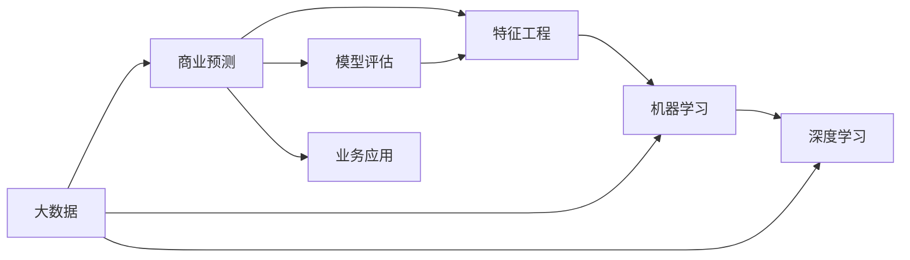

                 

# 信息差的商业预测：大数据如何提升商业预测能力

> 关键词：商业预测, 大数据, 机器学习, 深度学习, 预测模型, 数据挖掘, 信息差

## 1. 背景介绍

### 1.1 问题由来

在现代商业环境中，企业需要做出大量的决策，而这些决策往往依赖于对未来趋势的预测。传统的预测方法依赖于人工分析和历史数据，但在面对海量数据和复杂变化时，其效率和准确性都存在明显不足。

近年来，随着大数据和人工智能技术的发展，企业决策者开始尝试使用数据驱动的预测方法，以期获得更准确、更快速的商业预测结果。其中，基于机器学习和深度学习的预测模型在商业领域得到了广泛应用，取得了显著的效果。

### 1.2 问题核心关键点

数据驱动的商业预测方法主要包括以下几个关键点：

1. **数据质量**：预测模型的准确性高度依赖于数据的质量，因此如何获取高质量的数据成为了预测方法的重要挑战。
2. **模型选择**：选择合适的预测模型对预测结果具有重要影响。不同类型的数据和预测任务需要不同的模型来处理。
3. **特征工程**：如何将原始数据转化为模型可用的特征，对预测结果具有关键作用。
4. **模型评估**：评估模型性能的指标和方法，如均方误差、准确率、召回率等，对模型优化和选择具有指导意义。
5. **业务应用**：将预测模型应用于实际业务场景中，评估其对企业决策的实际影响。

### 1.3 问题研究意义

在商业决策中，预测能力的提升可以带来以下几个方面的改进：

1. **提高决策质量**：基于准确预测的决策能够显著提高企业的运营效率和市场竞争力。
2. **降低风险**：准确的预测可以降低企业在投资、市场推广等方面的风险。
3. **优化资源配置**：通过预测可以优化资源配置，如库存管理、人力资源分配等，降低成本。
4. **提升客户满意度**：准确的预测能够提升客户体验，如精准的市场推广和个性化服务。

因此，提升商业预测能力，是现代企业智能化转型和数据驱动决策的关键环节。

## 2. 核心概念与联系

### 2.1 核心概念概述

本节将介绍几个关键概念，并探讨它们之间的联系：

- **商业预测（Business Prediction）**：基于历史数据和机器学习模型对未来趋势进行预测的过程。
- **大数据（Big Data）**：包含结构化和非结构化数据，数量巨大，类型多样，价值密度较低。
- **机器学习（Machine Learning）**：通过数据训练模型，使其具备预测和决策能力。
- **深度学习（Deep Learning）**：一种特殊的机器学习方法，利用神经网络进行复杂数据的建模和预测。
- **特征工程（Feature Engineering）**：将原始数据转化为模型可用的特征，提升模型性能。
- **模型评估（Model Evaluation）**：使用各种指标评估模型性能，优化模型选择。

这些概念之间的联系可以通过以下Mermaid流程图来展示：



这个流程图展示了商业预测的核心流程：

1. 从大数据中提取有用的信息。
2. 使用机器学习和深度学习模型对信息进行建模和预测。
3. 通过特征工程提升模型性能。
4. 使用模型评估方法选择和优化预测模型。
5. 将预测结果应用于实际业务场景，评估其效果。

## 3. 核心算法原理 & 具体操作步骤
### 3.1 算法原理概述

基于机器学习和深度学习的商业预测方法，核心思想是通过历史数据训练预测模型，预测未来趋势。其一般流程如下：

1. **数据收集**：收集与预测任务相关的历史数据。
2. **数据预处理**：清洗和整理数据，生成训练集和测试集。
3. **特征工程**：将原始数据转化为模型可用的特征。
4. **模型选择和训练**：选择合适的模型，并使用训练集进行训练。
5. **模型评估**：使用测试集评估模型性能，调整模型参数。
6. **预测应用**：将优化后的模型应用于实际业务场景中，进行预测和决策。

### 3.2 算法步骤详解

以下是商业预测的一般步骤：

**Step 1: 数据收集**
- 收集与预测任务相关的历史数据，如销售数据、市场数据、客户数据等。
- 确保数据的完整性和一致性，清洗和处理缺失值、异常值等。

**Step 2: 数据预处理**
- 将数据划分为训练集和测试集。
- 对数据进行归一化、标准化等处理，减少特征之间的尺度差异。
- 使用特征选择方法，选择与预测任务相关的特征，减少冗余特征的干扰。

**Step 3: 特征工程**
- 特征工程是将原始数据转化为模型可用的特征。
- 常用的特征工程方法包括特征提取、特征组合、特征变换等。
- 特征工程的目标是提升模型的表达能力和预测能力。

**Step 4: 模型选择和训练**
- 选择合适的机器学习或深度学习模型。
- 使用训练集训练模型，调整模型参数。
- 使用交叉验证等方法评估模型性能。

**Step 5: 模型评估**
- 使用测试集评估模型性能，如均方误差、准确率、召回率等。
- 根据评估结果调整模型参数，优化模型性能。

**Step 6: 预测应用**
- 将优化后的模型应用于实际业务场景中，进行预测和决策。
- 持续收集新数据，定期重新训练和优化模型，保持其预测能力。

### 3.3 算法优缺点

商业预测基于机器学习和深度学习的算法具有以下优点：

1. **高效性**：数据驱动的预测方法能够快速处理大量数据，提升决策效率。
2. **准确性**：通过历史数据训练的模型能够较好地捕捉数据中的规律，提高预测准确性。
3. **可扩展性**：商业预测方法可以应用于各种业务场景，如销售预测、库存管理、客户行为分析等。

然而，也存在一些缺点：

1. **数据依赖**：预测结果高度依赖于历史数据的质量，数据质量差会影响预测结果。
2. **模型复杂度**：深度学习模型通常较为复杂，训练和优化难度较大。
3. **过拟合风险**：在训练数据较少的情况下，模型容易过拟合，影响预测结果的泛化能力。

### 3.4 算法应用领域

商业预测在大数据应用中，可以广泛应用于以下几个领域：

- **销售预测**：通过历史销售数据预测未来的销售趋势，帮助企业制定生产计划、库存管理等。
- **客户行为分析**：通过客户数据预测客户行为，如购买倾向、流失风险等，提升客户满意度。
- **市场趋势预测**：通过市场数据预测市场趋势，如产品流行度、市场需求等，指导企业市场策略。
- **金融风险管理**：通过金融数据预测风险，如信用风险、市场波动等，帮助企业规避风险。
- **供应链管理**：通过供应链数据预测需求，优化供应链管理和库存控制。

## 4. 数学模型和公式 & 详细讲解 & 举例说明
### 4.1 数学模型构建

商业预测的数学模型通常包括：

- **回归模型**：用于预测连续型变量，如销售量、价格等。
- **分类模型**：用于预测离散型变量，如客户流失、市场变化等。
- **序列模型**：用于预测序列数据，如时间序列预测、股票价格等。

### 4.2 公式推导过程

以线性回归模型为例，其公式推导如下：

设 $y$ 为预测变量，$x_1, x_2, ..., x_n$ 为特征变量，$\theta_0, \theta_1, ..., \theta_n$ 为模型参数。线性回归模型的目标是最小化预测误差，即：

$$
\min_{\theta} \sum_{i=1}^N (y_i - \theta_0 - \sum_{j=1}^n \theta_j x_{ij})
$$

其中，$N$ 为样本数量，$x_{ij}$ 表示第 $i$ 个样本的第 $j$ 个特征。

求解上述优化问题，得到模型参数：

$$
\theta_j = \frac{\sum_{i=1}^N (x_{ij} y_i - \frac{1}{N}\sum_{i=1}^N x_{ij} y_i)}{\sum_{i=1}^N x_{ij}^2 - \frac{1}{N}\sum_{i=1}^N x_{ij}^2}
$$

### 4.3 案例分析与讲解

假设某电商公司希望预测未来一个月的销售量。他们收集了过去一年的销售数据，并对其进行处理和特征工程，得到一个线性回归模型。模型的公式如下：

$$
y = \theta_0 + \theta_1 x_1 + \theta_2 x_2 + ... + \theta_n x_n
$$

其中，$x_1, x_2, ..., x_n$ 为影响销售量的因素，如季节、促销活动、节假日等。

通过训练和验证，得到模型参数 $\theta_0, \theta_1, ..., \theta_n$，并对下一个月的销售量进行预测。预测结果与实际销售量对比，计算均方误差（MSE）：

$$
MSE = \frac{1}{N} \sum_{i=1}^N (y_i - \hat{y}_i)^2
$$

其中，$y_i$ 为实际销售量，$\hat{y}_i$ 为预测销售量。

## 5. 项目实践：代码实例和详细解释说明
### 5.1 开发环境搭建

在进行商业预测实践前，我们需要准备好开发环境。以下是使用Python进行Scikit-learn开发的环境配置流程：

1. 安装Anaconda：从官网下载并安装Anaconda，用于创建独立的Python环境。

2. 创建并激活虚拟环境：
```bash
conda create -n prediction-env python=3.8 
conda activate prediction-env
```

3. 安装Scikit-learn：
```bash
pip install scikit-learn
```

4. 安装其他相关库：
```bash
pip install pandas numpy matplotlib seaborn
```

完成上述步骤后，即可在`prediction-env`环境中开始商业预测实践。

### 5.2 源代码详细实现

下面以销售预测为例，给出使用Scikit-learn库对线性回归模型进行商业预测的Python代码实现。

```python
import pandas as pd
from sklearn.model_selection import train_test_split
from sklearn.linear_model import LinearRegression
from sklearn.metrics import mean_squared_error

# 读取数据
data = pd.read_csv('sales_data.csv')

# 划分训练集和测试集
X_train, X_test, y_train, y_test = train_test_split(data.drop('sales', axis=1), data['sales'], test_size=0.2, random_state=42)

# 特征工程
# ...

# 模型训练和评估
model = LinearRegression()
model.fit(X_train, y_train)
y_pred = model.predict(X_test)
mse = mean_squared_error(y_test, y_pred)

# 输出评估结果
print(f'Mean Squared Error: {mse:.2f}')
```

### 5.3 代码解读与分析

让我们再详细解读一下关键代码的实现细节：

**数据处理**：
- `pd.read_csv('sales_data.csv')`：读取CSV格式的数据文件。
- `train_test_split(data.drop('sales', axis=1), data['sales'], test_size=0.2, random_state=42)`：将数据划分为训练集和测试集，并随机打乱。

**特征工程**：
- 特征工程包括特征选择、特征缩放等，根据具体任务进行设计。
- `model.fit(X_train, y_train)`：使用训练集训练模型。
- `y_pred = model.predict(X_test)`：使用测试集进行预测。

**模型评估**：
- `mean_squared_error(y_test, y_pred)`：计算均方误差，评估模型性能。

**结果展示**：
- `print(f'Mean Squared Error: {mse:.2f}')`：输出均方误差，显示预测结果。

可以看到，Scikit-learn库的使用使得商业预测的代码实现变得简洁高效。开发者可以将更多精力放在数据处理、模型改进等高层逻辑上，而不必过多关注底层的实现细节。

当然，工业级的系统实现还需考虑更多因素，如模型的保存和部署、超参数的自动搜索、更灵活的任务适配层等。但核心的预测流程基本与此类似。

## 6. 实际应用场景
### 6.1 电商销售预测

电商公司可以利用销售预测模型，对未来的销售趋势进行预测，从而优化库存管理，减少库存成本。具体而言，可以通过历史销售数据和市场变化数据训练预测模型，预测未来一个月的销售量，根据预测结果调整库存水平，避免缺货或过剩。

### 6.2 金融市场趋势预测

金融机构可以利用市场趋势预测模型，分析金融市场数据，预测市场变化趋势。通过预测股票价格、货币汇率等，帮助投资者做出更明智的投资决策，降低投资风险。

### 6.3 客户行为预测

电商平台可以通过客户行为预测模型，预测客户购买倾向和流失风险，提升客户满意度和留存率。具体而言，可以利用用户浏览历史、购买记录等数据，预测客户的购买行为和流失风险，及时采取措施。

### 6.4 供应链管理

制造业企业可以利用销售预测模型，预测市场需求，优化供应链管理。通过预测市场需求变化，及时调整生产计划，减少库存成本，提升生产效率。

### 6.5 医疗健康预测

医疗机构可以利用病人行为预测模型，预测疾病流行趋势和病人住院需求，优化资源配置。通过预测疾病流行趋势，及时调整医疗资源分配，减少医疗资源浪费。

## 7. 工具和资源推荐
### 7.1 学习资源推荐

为了帮助开发者系统掌握商业预测的理论基础和实践技巧，这里推荐一些优质的学习资源：

1. **《Python机器学习》**：由Sebastian Raschka和Vahid Mirjalili撰写，全面介绍了机器学习在Python中的实现，包括回归模型、分类模型等。
2. **《深度学习》**：由Ian Goodfellow、Yoshua Bengio和Aaron Courville撰写，深入介绍了深度学习的原理和应用，涵盖各种深度学习模型和算法。
3. **Kaggle竞赛平台**：提供了大量的机器学习和深度学习竞赛，可以锻炼实战能力，提升预测能力。
4. **Coursera课程**：斯坦福大学开设的机器学习和深度学习课程，涵盖基础概念和实际应用，适合初学者和进阶者。

通过对这些资源的学习实践，相信你一定能够快速掌握商业预测的精髓，并用于解决实际的业务问题。

### 7.2 开发工具推荐

高效的开发离不开优秀的工具支持。以下是几款用于商业预测开发的常用工具：

1. **Python**：开源编程语言，简单易学，拥有丰富的科学计算库和机器学习库。
2. **Jupyter Notebook**：交互式笔记本，方便进行数据分析和模型训练。
3. **Scikit-learn**：Python科学计算库，提供了丰富的机器学习算法和工具，方便进行商业预测开发。
4. **TensorFlow**：由Google主导开发的深度学习框架，支持分布式计算，适合大规模预测模型训练。
5. **PyTorch**：由Facebook开发的深度学习框架，灵活高效，适合科研和工业应用。

合理利用这些工具，可以显著提升商业预测任务的开发效率，加快创新迭代的步伐。

### 7.3 相关论文推荐

商业预测在大数据应用中，相关研究领域广泛，以下几篇经典论文值得阅读：

1. **《机器学习》**：Tom Mitchell撰写的经典教材，介绍了机器学习的基本概念和算法。
2. **《深度学习》**：Ian Goodfellow撰写的深度学习教材，介绍了深度学习的基本原理和应用。
3. **《商业智能》**：Thomas Davenport撰写，介绍了商业智能的原理和技术。
4. **《大数据时代》**：Viktor Mayer-Schönberger和Kenneth Cukier撰写的著作，介绍了大数据时代的商业应用。

这些论文代表了大数据和商业预测的研究脉络。通过学习这些前沿成果，可以帮助研究者把握学科前进方向，激发更多的创新灵感。

## 8. 总结：未来发展趋势与挑战
### 8.1 研究成果总结

本节将对商业预测的研究成果进行总结，并展望未来的发展方向。

商业预测基于机器学习和深度学习的技术，已经在电商、金融、医疗等多个领域得到了广泛应用，并取得了显著的效果。以下是几项主要的研究成果：

1. **销售预测**：通过历史销售数据，预测未来销售趋势，帮助企业优化库存管理和供应链管理。
2. **客户行为预测**：利用用户数据，预测客户购买行为和流失风险，提升客户满意度和留存率。
3. **市场趋势预测**：分析市场数据，预测市场变化趋势，帮助投资者做出明智的投资决策。

### 8.2 未来发展趋势

展望未来，商业预测技术将呈现以下几个发展趋势：

1. **算法多样化**：随着算法的不断进步，未来的商业预测将采用更多样化的算法，如集成学习、深度强化学习等。
2. **模型可解释性**：随着商业决策对可解释性需求增加，未来的预测模型将更注重模型的可解释性，方便解释和理解预测结果。
3. **实时预测**：未来的商业预测将实现实时预测，及时捕捉市场变化，提升决策的及时性。
4. **多模态数据融合**：未来的预测模型将融合多种数据源，如图像、语音、传感器数据等，提升预测的全面性和准确性。
5. **跨领域应用**：未来的预测技术将应用于更多领域，如交通、物流、能源等，提升各行业的运营效率和决策质量。

### 8.3 面临的挑战

尽管商业预测技术已经取得了一定的进展，但在迈向更加智能化、普适化应用的过程中，仍面临诸多挑战：

1. **数据质量**：数据的质量和完整性对预测结果具有重要影响，如何获取高质量的数据成为一大难题。
2. **算法复杂度**：深度学习等复杂算法需要大量的计算资源，如何高效地训练和优化模型是一大挑战。
3. **模型泛化能力**：预测模型在处理新数据时容易出现过拟合，如何提高模型的泛化能力是一大挑战。
4. **预测精度**：预测模型的精度和鲁棒性仍需进一步提升，尤其是在面对复杂和动态的数据环境时。
5. **应用场景复杂度**：不同业务场景对预测模型的要求各不相同，如何设计通用的预测框架是一大挑战。

### 8.4 研究展望

面对商业预测面临的挑战，未来的研究需要在以下几个方面寻求新的突破：

1. **无监督学习和半监督学习**：探索无监督学习和半监督学习的方法，减少对标注数据的依赖，提升预测模型的鲁棒性和泛化能力。
2. **模型优化**：研究高效的模型训练和优化方法，如模型压缩、量化加速、模型并行等，提升预测模型的计算效率和可扩展性。
3. **跨领域融合**：探索多模态数据融合的方法，如跨领域学习和知识图谱融合，提升预测模型的全面性和准确性。
4. **可解释性和鲁棒性**：研究可解释性和鲁棒性的提升方法，如因果分析和博弈论工具，提升预测模型的透明性和安全性。
5. **实时预测系统**：研究实时预测系统的构建方法，如流数据处理和实时计算，提升预测的实时性和可靠性。

这些研究方向的探索，必将引领商业预测技术迈向更高的台阶，为构建安全、可靠、可解释、可控的智能系统铺平道路。面向未来，商业预测技术还需要与其他人工智能技术进行更深入的融合，如知识表示、因果推理、强化学习等，多路径协同发力，共同推动商业智能的进步。

## 9. 附录：常见问题与解答

**Q1：数据质量对商业预测的影响有多大？**

A: 数据质量对商业预测具有重要影响，尤其是高质量的数据能够显著提升预测模型的准确性。因此，数据收集、清洗和处理是商业预测的第一步。

**Q2：如何选择商业预测模型？**

A: 选择商业预测模型需要考虑数据类型、预测任务和业务需求。一般来说，线性回归适用于连续型变量，逻辑回归适用于二分类任务，决策树和随机森林适用于多分类任务。深度学习模型适用于复杂的数据和预测任务，如图像、文本、语音等。

**Q3：如何评估商业预测模型的性能？**

A: 商业预测模型的性能评估通常包括均方误差、准确率、召回率、F1分数等指标。选择合适的评估指标能够帮助优化预测模型，提升预测效果。

**Q4：如何提升商业预测模型的泛化能力？**

A: 提升模型泛化能力的方法包括增加数据量、引入正则化、使用集成学习、选择合适的特征等。通过不断优化模型和数据，提升模型在面对新数据时的预测能力。

**Q5：商业预测在实际应用中需要注意哪些问题？**

A: 在实际应用中，需要注意数据的实时性、模型的解释性、系统的可扩展性等问题。通过合理设计数据采集和处理流程，优化模型训练和部署方式，确保预测系统的稳定性和可靠性。

---

作者：禅与计算机程序设计艺术 / Zen and the Art of Computer Programming

