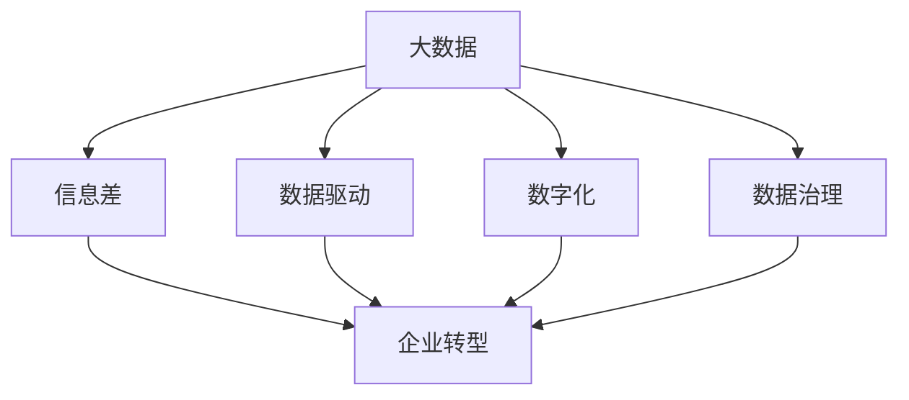

                 

# 信息差的战略意义：大数据如何推动企业转型

## 1. 背景介绍

在数字化时代，企业之间的竞争已从简单的商品和服务竞争转向数据驱动的战略竞争。信息差（Information Gap），即企业对市场动态、用户需求、竞争对手情况等信息掌握程度的差距，已经成为影响企业市场地位和竞争优势的关键因素。大数据技术的发展，使得企业能够更加精准、全面地掌握市场信息，缩短信息差，从而提升竞争力和市场响应速度。

信息差主要体现在两个方面：一方面，企业需要了解自身用户需求、产品反馈、市场趋势等信息，以便做出更好的决策；另一方面，企业需要及时了解竞争对手动态，包括新产品、市场策略、用户口碑等信息，以便调整自身策略，避免市场风险。

大数据技术通过分析海量数据，可以从海量数据中提取有价值的信息，帮助企业准确把握市场机会，及时调整市场策略，从而实现战略上的领先。同时，大数据技术还可以在供应链管理、客户关系管理、市场营销等多个领域发挥作用，全面提升企业的运营效率和竞争力。

## 2. 核心概念与联系

### 2.1 核心概念概述

为更好地理解大数据如何推动企业转型，本节将介绍几个关键概念：

- **大数据**（Big Data）：指规模庞大、类型多样、速度快、价值密度低的数据集合，通过分析可以发现新的知识和规律。
- **信息差**（Information Gap）：指企业对市场信息、用户需求、竞争对手情况等信息的掌握程度存在差异，这种信息差对企业的决策和竞争优势产生重大影响。
- **企业转型**（Corporate Transformation）：指企业通过优化内部流程、提升技术能力、增强市场响应速度等方式，实现业务模式和运营方式的全面升级和转型。
- **数据驱动**（Data-Driven）：指企业利用大数据分析、机器学习等技术，以数据为依据进行决策和运营管理。
- **数字化**（Digitization）：指将企业的业务流程、产品服务、管理方式等数字化，借助信息技术提升企业效率和竞争力。

这些概念之间的关系可以通过以下Mermaid流程图来展示：



这个流程图展示了大数据、信息差、企业转型、数据驱动和数字化之间的逻辑关系：

1. 大数据通过对企业业务数据和市场数据的分析，发现新的商业价值，缩短信息差，从而支撑企业转型。
2. 数据驱动以大数据为依据，优化决策和运营流程，提升企业效率和竞争力。
3. 数字化是实现数据驱动的关键途径，将企业业务流程数字化，提升数据采集、存储和分析能力。
4. 数据治理是确保数据质量、安全和可靠性的重要手段，保障数据驱动策略的有效实施。

## 3. 核心算法原理 & 具体操作步骤

### 3.1 算法原理概述

大数据驱动的战略意义在于通过数据收集、存储、分析和应用，缩小企业间信息差，提升决策的科学性和准确性，从而推动企业转型。具体算法原理包括以下几个方面：

1. **数据收集与存储**：通过传感器、日志文件、社交媒体、客户反馈等方式，收集企业内外部的海量数据，并进行存储。
2. **数据预处理**：清洗和整合数据，去除噪声和异常值，提取有用信息。
3. **数据分析**：利用统计分析、机器学习、深度学习等技术，从数据中提取有价值的信息，发现市场趋势、用户需求、竞争对手情况等。
4. **模型训练与优化**：构建数据模型，进行模型训练和优化，生成能够用于决策和运营的智能系统。
5. **数据应用与反馈**：将模型应用于业务流程，监测模型效果，不断迭代优化。

### 3.2 算法步骤详解

1. **数据收集**：通过数据采集技术，收集企业内外部的数据，包括客户行为数据、市场趋势数据、竞争对手数据等。
2. **数据清洗与预处理**：清洗数据，去除噪声、重复值和异常值，填充缺失值，统一数据格式，构建数据仓库。
3. **特征工程**：提取有价值的特征，包括时间特征、地理特征、用户行为特征等，用于训练模型。
4. **模型构建与训练**：选择合适的算法，如回归分析、分类算法、聚类算法等，构建数据模型，并进行训练。
5. **模型评估与优化**：评估模型效果，选择合适的方法进行模型优化。
6. **模型应用与反馈**：将模型应用于业务流程，监控模型效果，根据反馈进行迭代优化。

### 3.3 算法优缺点

大数据驱动的战略意义具有以下优点：

1. **决策科学化**：通过数据驱动，企业能够基于科学的数据分析进行决策，提升决策的准确性和效率。
2. **运营智能化**：数据驱动的运营管理，能够提升企业运营效率，降低成本。
3. **市场响应快速**：企业能够及时掌握市场动态，快速调整市场策略，提升市场竞争力。
4. **风险控制**：通过数据分析，企业能够及时发现风险点，提前采取措施，降低风险。

同时，大数据驱动的战略意义也存在一些局限性：

1. **数据隐私与安全**：大数据分析涉及大量敏感数据，可能存在隐私泄露和安全风险。
2. **技术门槛高**：大数据分析需要专业的技术能力，对企业技术能力要求较高。
3. **数据质量问题**：大数据分析对数据质量要求较高，数据缺失、噪声等问题会影响分析结果。
4. **模型复杂性**：大数据分析模型复杂，难以理解，可能存在黑盒问题。

### 3.4 算法应用领域

大数据驱动的战略意义在各个领域都得到了广泛应用，以下是几个典型应用领域：

1. **市场营销**：通过大数据分析，企业能够了解用户行为、市场趋势，制定精准的市场营销策略，提升营销效果。
2. **客户关系管理**：利用大数据分析客户需求，提升客户满意度，增强客户忠诚度。
3. **供应链管理**：通过大数据分析，企业能够优化供应链流程，降低成本，提升效率。
4. **金融风险控制**：利用大数据分析，企业能够及时发现金融风险，防范风险，保护资产安全。
5. **医疗健康**：通过大数据分析，医疗机构能够精准预测疾病趋势，提升诊疗效果。

## 4. 数学模型和公式 & 详细讲解 & 举例说明

### 4.1 数学模型构建

假设企业收集的数据包括用户行为数据 $X = (x_1, x_2, ..., x_n)$ 和市场趋势数据 $Y = (y_1, y_2, ..., y_m)$。

### 4.2 公式推导过程

以回归分析为例，假设回归模型为 $Y = f(X;\beta) = \beta_0 + \beta_1 x_1 + \beta_2 x_2 + ... + \beta_k x_k$，其中 $\beta_0, \beta_1, ..., \beta_k$ 为回归系数。

最小二乘法求解回归系数 $\beta$：

$$
\hat{\beta} = (X^TX)^{-1}X^TY
$$

### 4.3 案例分析与讲解

以一家电商企业的市场分析为例：

1. **数据收集**：通过销售记录、用户反馈、社交媒体等渠道，收集用户行为数据和市场趋势数据。
2. **数据清洗与预处理**：清洗数据，去除噪声和异常值，填充缺失值，统一数据格式。
3. **特征工程**：提取用户行为特征，如购买频率、浏览时长、浏览路径等。
4. **模型构建与训练**：构建线性回归模型，对用户行为与销售量之间的关系进行拟合。
5. **模型评估与优化**：评估模型效果，选择合适的方法进行模型优化。
6. **模型应用与反馈**：将模型应用于销售预测、广告投放等业务流程，根据反馈进行迭代优化。

## 5. 项目实践：代码实例和详细解释说明

### 5.1 开发环境搭建

在进行大数据驱动的企业转型项目实践前，我们需要准备好开发环境。以下是使用Python进行Pandas开发的环境配置流程：

1. 安装Anaconda：从官网下载并安装Anaconda，用于创建独立的Python环境。

2. 创建并激活虚拟环境：
```bash
conda create -n bigdata-env python=3.8 
conda activate bigdata-env
```

3. 安装Pandas：
```bash
pip install pandas
```

4. 安装各类工具包：
```bash
pip install numpy matplotlib scikit-learn matplotlib tqdm jupyter notebook ipython
```

完成上述步骤后，即可在`bigdata-env`环境中开始大数据驱动的企业转型项目实践。

### 5.2 源代码详细实现

以下是使用Pandas库进行大数据分析的Python代码实现：

```python
import pandas as pd
import numpy as np

# 加载数据
data = pd.read_csv('data.csv')

# 数据清洗
data = data.dropna()  # 删除缺失值
data = data.drop_duplicates()  # 删除重复数据

# 特征工程
features = data[['feature1', 'feature2', 'feature3']]
target = data['target']

# 模型训练
from sklearn.linear_model import LinearRegression
model = LinearRegression()
model.fit(features, target)

# 模型评估
score = model.score(features, target)
print(f'模型得分：{score:.3f}')

# 模型预测
new_data = pd.DataFrame({'feature1': [1.5, 2.5, 3.5], 'feature2': [2.0, 3.0, 4.0]})
prediction = model.predict(new_data)
print(f'预测值：{prediction:.2f}')
```

### 5.3 代码解读与分析

让我们再详细解读一下关键代码的实现细节：

**数据加载**：
- `pd.read_csv`方法用于加载CSV格式的数据文件。

**数据清洗**：
- `dropna`方法用于删除缺失值，`drop_duplicates`方法用于删除重复数据。

**特征工程**：
- `features`变量用于存储特征数据，`target`变量用于存储目标变量。

**模型训练**：
- `LinearRegression`类用于构建线性回归模型，`fit`方法用于模型训练。

**模型评估**：
- `score`方法用于计算模型在训练集上的得分，即决定系数。

**模型预测**：
- `predict`方法用于对新数据进行预测，生成预测结果。

## 6. 实际应用场景

### 6.1 智慧零售

大数据驱动的战略意义在智慧零售领域得到了广泛应用。传统零售企业通过大数据分析，能够实时掌握用户行为、市场趋势、库存状态等信息，从而实现精准营销、优化库存、提升运营效率。

在技术实现上，可以收集用户的浏览记录、购买记录、评价反馈等数据，利用大数据分析预测用户需求、优化商品陈列、制定个性化营销策略，同时实时监控库存状态，避免缺货或过剩。通过这种方式，零售企业能够显著提升用户体验和运营效率，降低成本。

### 6.2 金融风控

金融行业对大数据驱动的需求尤为迫切。大数据分析能够帮助金融机构及时发现风险点，预测违约概率，优化信贷评估，提升风险控制能力。

具体而言，可以收集用户的消费记录、信用记录、社交行为等数据，通过大数据分析构建风险评估模型，对客户的信用风险进行预测，并根据预测结果进行信贷审批。同时，实时监控市场动态和用户行为，及时调整策略，防范金融风险。

### 6.3 医疗健康

大数据驱动的战略意义在医疗健康领域也得到了广泛应用。医疗机构通过大数据分析，能够实时掌握患者病历、医疗设备数据、药品使用情况等信息，从而提升诊疗效果，优化医疗资源配置。

具体而言，可以收集患者的历史病历、影像数据、基因信息等数据，通过大数据分析预测疾病趋势，制定个性化诊疗方案。同时，实时监控医疗设备状态，优化医疗资源配置，提升医院运营效率。

### 6.4 未来应用展望

随着大数据技术的发展，大数据驱动的战略意义将不断扩展，在更多领域得到应用。

在智慧城市治理中，大数据分析能够实时监测交通流量、环境污染、公共安全等信息，提升城市管理水平，保障公共安全。

在智能制造中，大数据分析能够优化生产流程，提升产品质量，降低生产成本，推动制造业数字化转型。

在智能农业中，大数据分析能够优化种植方案，提升农作物产量，降低农业风险，推动农业智能化。

## 7. 工具和资源推荐

### 7.1 学习资源推荐

为了帮助开发者系统掌握大数据驱动的企业转型技术，这里推荐一些优质的学习资源：

1. 《数据科学导论》（Introduction to Data Science）：这是一本经典的数据科学入门书籍，涵盖了大数据分析、机器学习、深度学习等多个主题，适合初学者入门。

2. 《Python数据科学手册》（Python Data Science Handbook）：这是一本介绍Python数据科学工具和方法的书籍，涵盖Pandas、NumPy、Scikit-Learn等工具的使用，适合进一步深入学习。

3. Coursera《大数据科学与工程》（Big Data Science and Engineering）课程：由清华大学开设的在线课程，涵盖大数据分析、机器学习等多个主题，适合全面掌握大数据技术。

4. Kaggle数据科学竞赛：Kaggle提供的数据科学竞赛平台，集成了海量真实数据集，适合实战练习和提升技能。

5. PyCon Python会议：PyCon是Python开发者盛会，每年都会发布大量高质量的论文和项目，适合了解最新技术动态。

通过对这些资源的学习实践，相信你一定能够快速掌握大数据驱动的企业转型技术，并用于解决实际的业务问题。

### 7.2 开发工具推荐

高效的工具是进行大数据驱动的企业转型项目开发的关键。以下是几款用于大数据分析开发的常用工具：

1. Jupyter Notebook：开源的交互式编程环境，适合数据探索、分析和可视化，支持Python、R等多种语言。

2. Apache Spark：开源的分布式计算框架，适合大规模数据处理和分析。

3. Hadoop：开源的大数据处理框架，支持海量数据的存储和计算。

4. Tableau：商业智能工具，支持数据可视化，适合业务人员和数据科学家使用。

5. Apache Kafka：开源的消息流处理平台，支持实时数据采集和传输，适合大数据应用场景。

合理利用这些工具，可以显著提升大数据驱动的企业转型项目的开发效率，加速创新迭代的步伐。

### 7.3 相关论文推荐

大数据驱动的企业转型技术的发展源于学界的持续研究。以下是几篇奠基性的相关论文，推荐阅读：

1. "Big Data: A Revolution That Will Transform How We Live, Work, and Think"：该论文由Viktor Mayer-Schönberger和Kenneth Cukier合著，介绍了大数据革命对社会各方面的影响，是大数据领域的经典之作。

2. "The Data-Driven World"：由W. Shyy等人合著，介绍了大数据技术在工程应用中的重要性，并提出了数据驱动工程的概念。

3. "Data-Driven Decision Making"：由Andrew Ng等人合著，介绍了数据驱动决策的方法和应用，适合企业数据决策参考。

这些论文代表了大数据驱动的企业转型技术的发展脉络。通过学习这些前沿成果，可以帮助研究者把握学科前进方向，激发更多的创新灵感。

## 8. 总结：未来发展趋势与挑战

### 8.1 总结

本文对大数据驱动的企业转型技术进行了全面系统的介绍。首先阐述了大数据驱动的战略意义和信息差的概念，明确了大数据在缩短企业间信息差、提升企业转型中的重要作用。其次，从原理到实践，详细讲解了大数据驱动的企业转型技术的主要算法步骤，给出了项目开发的完整代码实例。同时，本文还广泛探讨了大数据驱动技术在智慧零售、金融风控、医疗健康等多个行业领域的应用前景，展示了大数据驱动技术的广阔前景。

通过本文的系统梳理，可以看到，大数据驱动的战略意义已经在各个领域得到了广泛应用，取得了显著的成果。未来，伴随大数据技术的进一步发展，企业将能够更好地掌握市场信息，缩短信息差，提升竞争力和市场响应速度，为企业的长期发展提供坚实的技术支撑。

### 8.2 未来发展趋势

展望未来，大数据驱动的企业转型技术将呈现以下几个发展趋势：

1. **人工智能的融合**：随着人工智能技术的不断发展，大数据驱动的企业转型将更加智能化。通过人工智能和大数据的融合，企业能够实现更精准的决策和运营，提升效率和竞争力。

2. **实时数据处理**：大数据驱动的企业转型将更加注重实时数据处理。通过实时数据采集和分析，企业能够及时调整策略，快速响应市场变化，提升市场响应速度。

3. **跨领域应用**：大数据驱动的企业转型技术将在更多领域得到应用，如智能制造、智能农业、智慧城市等。这些领域的大数据应用将进一步推动社会的数字化转型。

4. **数据安全与隐私**：随着大数据分析涉及的敏感数据越来越多，数据安全与隐私保护将成为重要研究方向。未来的企业转型将更加注重数据安全与隐私保护，建立完善的数据治理体系。

5. **技术标准与规范**：随着大数据分析的普及，技术标准与规范的制定将成为重要任务。未来的企业转型将遵循统一的技术标准与规范，提升数据共享与互操作能力。

### 8.3 面临的挑战

尽管大数据驱动的企业转型技术已经取得了显著的成果，但在迈向更加智能化、普适化应用的过程中，仍面临诸多挑战：

1. **技术复杂性**：大数据驱动的企业转型技术涉及的数据量庞大，算法复杂，对企业技术能力要求较高。如何降低技术门槛，提升技术普及度，将是重要挑战。

2. **数据隐私与安全**：大数据分析涉及大量敏感数据，可能存在隐私泄露和安全风险。如何确保数据隐私与安全，建立完善的治理体系，将是重要任务。

3. **数据质量问题**：大数据分析对数据质量要求较高，数据缺失、噪声等问题会影响分析结果。如何提升数据质量，建立高效的数据治理机制，将是重要挑战。

4. **技术生态与协同**：大数据驱动的企业转型技术需要跨领域、跨学科的协同合作。如何建立完善的技术生态，促进各方的协同合作，将是重要任务。

### 8.4 研究展望

面对大数据驱动的企业转型技术所面临的种种挑战，未来的研究需要在以下几个方面寻求新的突破：

1. **跨领域数据融合**：将不同领域的数据进行融合，提取有价值的信息，提升数据的综合利用能力。

2. **实时数据处理技术**：开发高效的实时数据处理技术，提升数据处理速度和效率，降低技术成本。

3. **数据隐私与安全技术**：开发先进的数据隐私与安全技术，确保数据安全与隐私保护，建立完善的数据治理体系。

4. **技术标准化与规范**：制定统一的技术标准与规范，提升数据共享与互操作能力，推动大数据技术的普及与推广。

5. **智能化的数据分析工具**：开发智能化的数据分析工具，提升数据分析的自动化和智能化水平，降低技术门槛。

这些研究方向将推动大数据驱动的企业转型技术迈向更高的台阶，为企业的长期发展提供坚实的技术支撑。

## 9. 附录：常见问题与解答

**Q1：大数据驱动的企业转型是否适用于所有企业？**

A: 大数据驱动的企业转型技术适用于大部分企业，尤其是数据驱动型和数字化程度较高的企业。大数据驱动的企业转型能够通过数据优化决策和运营流程，提升企业的竞争力。

**Q2：大数据驱动的企业转型需要哪些技术能力？**

A: 大数据驱动的企业转型需要以下技术能力：
1. 数据收集与存储：能够从企业内外部的各种渠道收集数据，并进行存储。
2. 数据清洗与预处理：能够清洗和整合数据，去除噪声和异常值，提取有用信息。
3. 数据分析与建模：具备数据分析和建模能力，能够构建数据模型，进行预测和决策。
4. 数据可视化：具备数据可视化的能力，能够将数据结果以图表形式呈现，帮助决策。

**Q3：企业如何进行大数据驱动的转型？**

A: 企业进行大数据驱动的转型，一般包括以下几个步骤：
1. 明确转型目标：确定企业需要解决的问题和期望达成的目标。
2. 数据收集与存储：收集企业内外部的各种数据，并进行存储。
3. 数据清洗与预处理：清洗和整合数据，去除噪声和异常值，提取有用信息。
4. 特征工程：提取有价值的特征，用于构建数据模型。
5. 模型训练与优化：选择合适的算法，构建数据模型，并进行训练和优化。
6. 模型应用与反馈：将模型应用于业务流程，根据反馈进行迭代优化。

**Q4：大数据驱动的企业转型如何保障数据隐私与安全？**

A: 大数据驱动的企业转型需要从数据收集、存储、处理、传输等各个环节保障数据隐私与安全。具体措施包括：
1. 数据匿名化：对数据进行匿名化处理，确保用户隐私。
2. 数据加密：对数据进行加密处理，确保数据传输安全。
3. 访问控制：设置严格的访问控制机制，确保数据仅被授权人员访问。
4. 安全审计：定期进行安全审计，发现并修复潜在的安全漏洞。

**Q5：大数据驱动的企业转型有哪些成功案例？**

A: 大数据驱动的企业转型在多个行业领域都有成功的案例，例如：
1. 亚马逊：通过大数据分析，优化库存管理，提升客户满意度。
2. 阿里巴巴：通过大数据分析，优化用户推荐系统，提升销售业绩。
3. 丰田：通过大数据分析，优化生产流程，提升产品质量。

这些成功案例展示了大数据驱动的企业转型在实际应用中的巨大潜力。通过科学地应用大数据技术，企业能够实现高效的决策和运营管理，提升竞争力。

---

作者：禅与计算机程序设计艺术 / Zen and the Art of Computer Programming

