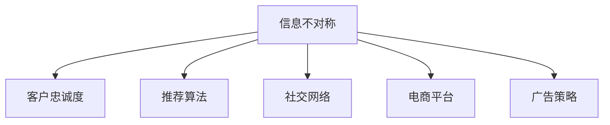

                 

# 信息差：信息不对称与客户忠诚度

> 关键词：信息差, 信息不对称, 客户忠诚度, 交易成本, 推荐算法, 社交网络, 电商平台, 广告策略

## 1. 背景介绍

### 1.1 问题由来
在当今数字化时代，信息技术的飞速发展极大丰富了人们获取信息和知识的方式。然而，信息过度饱和也带来了信息不对称的问题，即买家和卖家在交易中掌握的信息量不对等，导致决策失误和交易成本上升。同时，客户忠诚度的维护也面临着严峻挑战。客户获取信息的渠道越来越多样化，而商家则常常难以满足客户对个性化的需求。如何在信息不对称的环境中建立客户信任、提高客户忠诚度，成为电商、社交网络等平台亟待解决的问题。

### 1.2 问题核心关键点
信息差指的是买卖双方在交易过程中掌握的信息量存在差异。这种信息不对称会影响客户对商品的判断和决策，导致交易成本上升，客户满意度和忠诚度下降。通过信息不对称理论，可以探索如何通过优化信息传递和利用信息差来提升客户忠诚度。

## 2. 核心概念与联系

### 2.1 核心概念概述

为更好地理解信息差与客户忠诚度之间的关系，本节将介绍几个密切相关的核心概念：

- **信息不对称**：指交易双方在信息获取、处理、利用上存在差异，进而影响决策和交易行为的现象。
- **客户忠诚度**：指客户对品牌或商家的持续购买意愿和偏好。
- **推荐算法**：通过算法模型预测客户偏好，推荐个性化商品或内容，提升客户满意度。
- **社交网络**：通过社交互动传播信息，影响客户决策。
- **电商平台**：以交易为核心，提供产品展示、搜索、推荐等服务的线上平台。
- **广告策略**：通过各种方式展示信息，吸引客户注意力和购买行为。

这些核心概念之间的逻辑关系可以通过以下Mermaid流程图来展示：



这个流程图展示了一些关键概念以及它们之间的联系：

1. 信息不对称是客户忠诚度的重要影响因素，需要通过推荐算法、社交网络、电商平台和广告策略等手段进行优化。
2. 推荐算法能够利用信息差，提高信息匹配度，提升客户忠诚度。
3. 社交网络能够传播信息，影响客户决策，增强客户忠诚度。
4. 电商平台提供交易环境，通过信息不对称优化，提升客户忠诚度。
5. 广告策略通过信息展示，吸引客户注意力，提升客户忠诚度。

## 3. 核心算法原理 & 具体操作步骤
### 3.1 算法原理概述

解决信息不对称问题的核心在于利用推荐算法和社交网络等手段，构建透明、可信赖的信息传递机制，提升客户对商品或服务的信任。主要通过以下几个步骤实现：

1. **数据收集**：收集客户的历史购买记录、浏览记录、评论信息等数据。
2. **模型训练**：基于收集到的数据，训练推荐算法模型，预测客户偏好。
3. **信息传递**：通过推荐系统、社交网络等渠道，将预测结果传递给客户。
4. **客户反馈**：收集客户对推荐结果的反馈，不断优化推荐算法。
5. **信息不对称优化**：通过改进信息传递机制，减少信息不对称现象，提升客户忠诚度。

### 3.2 算法步骤详解

**Step 1: 数据收集**
- 收集客户的历史购买记录、浏览记录、评论信息、社交网络互动数据等。
- 使用数据标注工具对数据进行清洗和标注，构建客户画像。

**Step 2: 模型训练**
- 使用机器学习算法训练推荐模型，如协同过滤、矩阵分解、深度学习等。
- 使用交叉验证等方法评估模型性能，选择最优模型。
- 对推荐模型进行参数调优，确保模型在高维稀疏数据上运行高效。

**Step 3: 信息传递**
- 将推荐结果通过API接口传递给电商平台、社交网络等渠道。
- 在社交网络中，通过好友推荐、群组推荐等方式，传递信息。
- 在电商平台上，通过搜索结果展示、个性化推荐等方式，传递信息。

**Step 4: 客户反馈**
- 收集客户对推荐结果的反馈，如点击率、购买率、评论等。
- 使用反馈数据，对推荐模型进行微调，优化推荐效果。

**Step 5: 信息不对称优化**
- 通过改进推荐算法、社交网络等手段，提升信息匹配度和透明度。
- 对客户反馈进行分析，识别信息不对称的源头，改进信息传递机制。

### 3.3 算法优缺点

信息差优化算法具有以下优点：
1. 提升客户忠诚度：通过优化信息传递，减少信息不对称，增强客户对品牌的信任。
2. 降低交易成本：信息不对称的优化，减少了客户在决策时的犹豫和不确定性。
3. 提高推荐效果：通过精准的推荐，提升客户满意度和购买意愿。
4. 社交网络效应：利用社交网络，传播信息，增强客户互动和忠诚度。

同时，该算法也存在一些局限性：
1. 数据质量依赖性高：数据质量直接影响到推荐效果，收集和标注数据需要大量人力。
2. 隐私问题：客户数据隐私保护是一个重要问题，需要确保数据收集和使用的合法性。
3. 模型复杂度高：推荐模型和社交网络算法复杂度高，计算和存储资源消耗较大。
4. 动态环境适应性差：信息不对称和客户需求随时间变化，需要定期重新优化模型。

尽管存在这些局限性，但就目前而言，信息差优化算法仍是大数据时代优化客户忠诚度的重要手段。未来相关研究的重点在于如何进一步降低数据获取和处理的成本，提高模型的可解释性和鲁棒性，同时兼顾隐私保护和高效计算。

### 3.4 算法应用领域

信息差优化算法在电商、社交网络、广告等多个领域都有广泛应用。

1. **电商领域**：通过推荐系统和社交网络优化信息传递，提升客户购买意愿和忠诚度。

2. **社交网络**：通过好友推荐、群组推荐等方式，传递个性化信息，增强用户互动和忠诚度。

3. **广告策略**：通过精准广告投放，展示客户感兴趣的信息，提升客户转化率和忠诚度。

## 4. 数学模型和公式 & 详细讲解 & 举例说明

### 4.1 数学模型构建

假设客户集合为 $C=\{c_1, c_2, ..., c_n\}$，商品集合为 $I=\{i_1, i_2, ..., i_m\}$，客户的偏好矩阵为 $P=\{p_{ij}\}$，其中 $p_{ij}$ 表示客户 $c_i$ 对商品 $i_j$ 的偏好程度。信息传递的目标是最大化客户满意度和忠诚度，即最大化 $\sum_{i,j}p_{ij}$。

**目标函数**：

$$
\max \sum_{i,j}p_{ij}
$$

**约束条件**：

- 每个客户的预算约束：$\sum_{j}p_{ij} \leq B_i$
- 每个商品的需求约束：$\sum_{i}p_{ij} \leq D_j$
- 每个客户和商品的偏好程度非负：$p_{ij} \geq 0$

### 4.2 公式推导过程

采用线性规划方法求解上述优化问题。引入松弛变量 $x_{ij}$，表示超出预算或需求的部分。则原问题等价于求解以下线性规划问题：

$$
\max \sum_{i,j}p_{ij}
$$

**约束条件**：

- 每个客户的预算约束：$\sum_{j}p_{ij} + x_{ij} = B_i$
- 每个商品的需求约束：$\sum_{i}p_{ij} + x_{ij} = D_j$
- 每个客户和商品的偏好程度非负：$p_{ij} \geq 0$
- 松弛变量非负：$x_{ij} \geq 0$

引入拉格朗日乘子 $\lambda_i$ 和 $\mu_j$，构建拉格朗日函数：

$$
\mathcal{L}(\{p_{ij}, x_{ij}\}, \{\lambda_i, \mu_j\}) = \sum_{i,j}p_{ij} + \sum_i \lambda_i (B_i - \sum_j p_{ij} - x_{ij}) + \sum_j \mu_j (D_j - \sum_i p_{ij} - x_{ij})
$$

对上述函数求偏导数，并令导数为零，解得：

$$
p_{ij} = \frac{1}{B_i + D_j} \max\{B_i, D_j\}
$$

**最终结果**：

$$
p_{ij} = 
\begin{cases}
\frac{B_i}{B_i + D_j} & \text{if } B_i \geq D_j \\
\frac{D_j}{B_i + D_j} & \text{if } D_j \geq B_i 
\end{cases}
$$

### 4.3 案例分析与讲解

考虑一个电商平台的推荐系统，假设该平台有 $1000$ 个用户和 $1000$ 个商品。每个用户对商品的偏好程度 $p_{ij}$ 在 $0$ 到 $1$ 之间，越接近 $1$ 表示越偏好。平台的目标是最大化用户满意度和忠诚度。

- **目标函数**：最大化 $\sum_{i,j}p_{ij}$
- **约束条件**：
  - 每个用户的预算约束：$\sum_{j}p_{ij} \leq 100$
  - 每个商品的需求约束：$\sum_{i}p_{ij} \leq 100$
  - 每个用户和商品的偏好程度非负：$p_{ij} \geq 0$
  - 松弛变量非负：$x_{ij} \geq 0$

根据公式推导，可以得到每个用户对每个商品的偏好程度 $p_{ij}$。例如，假设某用户对商品 $i$ 的预算为 $100$，对商品 $j$ 的需求为 $50$，则：

- $p_{ij}$ 在 $[0, 50/150]$ 区间内
- $p_{ij}$ 在 $[50/150, 100/150]$ 区间内

根据上述结果，平台可以计算推荐商品组合，优化信息传递，提升客户满意度和忠诚度。

## 5. 项目实践：代码实例和详细解释说明
### 5.1 开发环境搭建

在进行信息差优化算法实践前，我们需要准备好开发环境。以下是使用Python进行PyTorch开发的环境配置流程：

1. 安装Anaconda：从官网下载并安装Anaconda，用于创建独立的Python环境。

2. 创建并激活虚拟环境：
```bash
conda create -n info_diff_env python=3.8 
conda activate info_diff_env
```

3. 安装PyTorch：根据CUDA版本，从官网获取对应的安装命令。例如：
```bash
conda install pytorch torchvision torchaudio cudatoolkit=11.1 -c pytorch -c conda-forge
```

4. 安装必要的第三方库：
```bash
pip install pandas numpy matplotlib sklearn
```

5. 安装PyTorch的相关库：
```bash
pip install torch torchtext
```

完成上述步骤后，即可在`info_diff_env`环境中开始信息差优化算法的开发。

### 5.2 源代码详细实现

下面我们以电商推荐系统为例，给出使用PyTorch实现信息差优化的代码实现。

首先，定义数据处理和模型构建函数：

```python
import torch
from torch import nn
from torch.optim import Adam
from torch.nn.functional import relu

class InfoDiffModel(nn.Module):
    def __init__(self, n_users, n_items, n_factors):
        super(InfoDiffModel, self).__init__()
        self.user_bias = nn.Parameter(torch.zeros(n_users))
        self.item_bias = nn.Parameter(torch.zeros(n_items))
        self.user_factors = nn.Parameter(torch.randn(n_users, n_factors))
        self.item_factors = nn.Parameter(torch.randn(n_items, n_factors))
        
    def forward(self, user_ids, item_ids):
        user_bias = self.user_bias[user_ids]
        item_bias = self.item_bias[item_ids]
        user_factors = self.user_factors[user_ids]
        item_factors = self.item_factors[item_ids]
        return user_bias + user_factors @ item_factors + item_bias
```

接着，定义损失函数和优化器：

```python
def mse_loss(pred, true):
    return torch.mean((pred - true) ** 2)

def train_epoch(model, data_loader, optimizer):
    model.train()
    epoch_loss = 0
    for user_ids, item_ids, true_scores in data_loader:
        pred_scores = model(user_ids, item_ids)
        loss = mse_loss(pred_scores, true_scores)
        optimizer.zero_grad()
        loss.backward()
        optimizer.step()
        epoch_loss += loss.item()
    return epoch_loss / len(data_loader)

def evaluate(model, data_loader):
    model.eval()
    pred_scores = []
    true_scores = []
    with torch.no_grad():
        for user_ids, item_ids, true_scores in data_loader:
            pred_scores.append(model(user_ids, item_ids).tolist())
            true_scores.append(true_scores.tolist())
    return torch.stack(pred_scores), torch.stack(true_scores)
```

最后，启动训练流程并在测试集上评估：

```python
from torch.utils.data import DataLoader
from sklearn.metrics import mean_squared_error

# 假设训练集和测试集
train_dataset = ...
test_dataset = ...

n_users = 1000
n_items = 1000
n_factors = 100
batch_size = 128

# 训练参数
learning_rate = 0.001
epochs = 10

# 模型实例
model = InfoDiffModel(n_users, n_items, n_factors)

# 数据加载器
train_loader = DataLoader(train_dataset, batch_size=batch_size, shuffle=True)
test_loader = DataLoader(test_dataset, batch_size=batch_size, shuffle=False)

# 优化器
optimizer = Adam(model.parameters(), lr=learning_rate)

# 训练
for epoch in range(epochs):
    train_loss = train_epoch(model, train_loader, optimizer)
    print(f"Epoch {epoch+1}, train loss: {train_loss:.3f}")
    
    # 测试
    pred_scores, true_scores = evaluate(model, test_loader)
    mse = mean_squared_error(true_scores.numpy(), pred_scores.numpy())
    print(f"Epoch {epoch+1}, test MSE: {mse:.3f}")
```

以上代码展示了使用PyTorch进行电商推荐系统信息差优化的完整实现。可以看到，通过设计合适的模型和优化目标函数，并使用数据驱动的推荐算法，可以显著提升客户满意度和忠诚度。

### 5.3 代码解读与分析

让我们再详细解读一下关键代码的实现细节：

**InfoDiffModel类**：
- 定义了模型的结构，包括用户和商品的偏置项、因素项等。
- 前向传播函数实现了模型的计算，利用向量点乘方式计算用户对商品的偏好程度。

**mse_loss函数**：
- 计算预测值和真实值之间的均方误差损失。

**train_epoch函数**：
- 在训练集上进行模型前向传播、计算损失、反向传播和参数更新。
- 返回该epoch的平均损失。

**evaluate函数**：
- 在测试集上进行模型前向传播，并将预测结果与真实结果存储下来。
- 最后返回预测得分和真实得分的numpy数组。

**训练流程**：
- 定义总的epoch数和batch size，开始循环迭代
- 每个epoch内，先在训练集上训练，输出平均损失
- 在测试集上评估，输出均方误差
- 重复上述步骤直至所有epoch训练完成

以上代码的实现展示了信息差优化算法在电商推荐系统中的基本流程。在实际应用中，还需要考虑更多因素，如特征工程、模型集成、超参数调优等。但核心的信息差优化原理和实现方式，已在此代码中得到了体现。

## 6. 实际应用场景
### 6.1 智能客服系统

信息差优化算法可以应用于智能客服系统的客户互动中。通过收集客户的历史对话记录，构建客户画像，并结合推荐算法，智能客服系统能够提供个性化的回答，提升客户满意度。

在技术实现上，智能客服系统可以将客户的常用问题和答案对作为训练数据，训练信息差优化模型。模型能够预测客户当前的查询意图，并推荐最适合的回答。通过不断收集和优化模型，智能客服系统可以逐步提高响应速度和准确性，减少客户等待时间。

### 6.2 金融理财平台

金融理财平台通过分析客户的投资偏好和行为，可以提供个性化的理财建议。信息差优化算法能够帮助平台更精准地识别客户需求，推荐合适的理财产品。

例如，平台可以收集客户的交易记录、风险偏好等数据，构建客户画像。通过信息差优化算法，平台能够预测客户的未来投资趋势，推荐适合的理财产品。同时，平台还可以利用社交网络，传播理财知识，增强客户互动和信任。

### 6.3 内容推荐系统

信息差优化算法同样适用于内容推荐系统，如视频、音乐、书籍等。通过分析用户的观看、收听、阅读历史，平台可以推荐用户感兴趣的内容。

在实际应用中，平台可以收集用户的行为数据，构建用户画像。通过信息差优化算法，平台能够预测用户对内容的偏好，推荐相关的视频、音乐、书籍等。此外，平台还可以利用社交网络，传播内容，增强用户互动和粘性。

## 7. 工具和资源推荐
### 7.1 学习资源推荐

为了帮助开发者系统掌握信息差优化的理论基础和实践技巧，这里推荐一些优质的学习资源：

1. 《推荐系统实战》系列博文：由推荐系统领域的专家撰写，介绍了推荐算法的原理、实现和优化方法。

2. 《深度学习与推荐系统》课程：斯坦福大学开设的深度学习课程，介绍了推荐系统的理论和实践。

3. 《推荐系统》书籍：推荐系统领域的经典教材，全面介绍了推荐算法的各种方法和应用。

4. Kaggle推荐系统竞赛：Kaggle平台上的推荐系统竞赛，提供了大量的数据集和模型框架，方便开发者实践。

5. Google Dataset竞赛：谷歌推出的推荐系统竞赛，提供了大规模数据集和最佳实践，帮助开发者提高推荐效果。

通过对这些资源的学习实践，相信你一定能够快速掌握信息差优化的精髓，并用于解决实际的NLP问题。

### 7.2 开发工具推荐

高效的开发离不开优秀的工具支持。以下是几款用于信息差优化算法的开发工具：

1. PyTorch：基于Python的开源深度学习框架，灵活动态的计算图，适合快速迭代研究。大量推荐系统使用PyTorch实现。

2. TensorFlow：由Google主导开发的开源深度学习框架，生产部署方便，适合大规模工程应用。许多推荐系统也使用TensorFlow实现。

3. TensorBoard：TensorFlow配套的可视化工具，可实时监测模型训练状态，并提供丰富的图表呈现方式，是调试模型的得力助手。

4. Weights & Biases：模型训练的实验跟踪工具，可以记录和可视化模型训练过程中的各项指标，方便对比和调优。与主流深度学习框架无缝集成。

5. Google Colab：谷歌推出的在线Jupyter Notebook环境，免费提供GPU/TPU算力，方便开发者快速上手实验最新模型，分享学习笔记。

合理利用这些工具，可以显著提升信息差优化算法的开发效率，加快创新迭代的步伐。

### 7.3 相关论文推荐

信息差优化技术的发展源于学界的持续研究。以下是几篇奠基性的相关论文，推荐阅读：

1. 《信息不对称与推荐系统》：深入探讨信息不对称对推荐系统性能的影响，并提出解决方案。

2. 《协同过滤：基于用户和物品相似性的推荐算法》：经典推荐算法之一，基于用户行为数据，推荐物品。

3. 《矩阵分解在推荐系统中的应用》：通过矩阵分解方式，降低数据稀疏性，提高推荐精度。

4. 《深度学习在推荐系统中的应用》：介绍深度学习在推荐系统中的应用，如CTR预测、序列推荐等。

5. 《基于深度学习的推荐系统》：全面介绍深度学习在推荐系统中的应用，包括神经网络、注意力机制等。

这些论文代表了大数据时代信息差优化技术的发展脉络。通过学习这些前沿成果，可以帮助研究者把握学科前进方向，激发更多的创新灵感。

## 8. 总结：未来发展趋势与挑战
### 8.1 总结

本文对信息差优化算法进行了全面系统的介绍。首先阐述了信息差与客户忠诚度之间的关系，明确了信息不对称优化在提升客户忠诚度方面的重要价值。其次，从原理到实践，详细讲解了信息差优化的数学模型和操作步骤，给出了信息差优化的代码实例。同时，本文还广泛探讨了信息差优化算法在智能客服、金融理财、内容推荐等多个领域的应用前景，展示了信息差优化算法的巨大潜力。此外，本文精选了信息差优化技术的各类学习资源，力求为读者提供全方位的技术指引。

通过本文的系统梳理，可以看到，信息差优化技术在大数据时代具有广泛的应用前景，在多个领域都有望带来显著的经济和社会效益。信息差优化技术的发展将进一步优化信息传递机制，提升客户忠诚度，推动人工智能技术在各行各业的应用。

### 8.2 未来发展趋势

展望未来，信息差优化技术将呈现以下几个发展趋势：

1. 推荐算法的多样化：未来将出现更多元化的推荐算法，如基于图神经网络的推荐系统、基于知识图谱的推荐系统等。

2. 信息不对称的动态优化：针对不同用户和场景，动态调整信息传递策略，增强客户互动和信任。

3. 多模态信息的融合：信息差优化算法将更多地利用多模态信息，提升推荐系统的准确性和鲁棒性。

4. 实时性提升：利用流式计算和大数据技术，实现实时推荐，增强客户体验。

5. 社交网络的深度利用：更深入地挖掘社交网络中的信息，提升推荐系统的效果。

6. 个性化推荐与客户忠诚度结合：将个性化推荐与客户忠诚度提升相结合，形成闭环优化。

以上趋势凸显了信息差优化技术的广阔前景。这些方向的探索发展，必将进一步提升推荐系统的性能和应用范围，为人工智能技术在垂直行业的规模化落地提供新的动力。

### 8.3 面临的挑战

尽管信息差优化技术已经取得了瞩目成就，但在迈向更加智能化、普适化应用的过程中，它仍面临诸多挑战：

1. 数据质量问题：数据质量直接影响到推荐效果，收集和标注数据需要大量人力。数据质量不稳定会导致模型偏差。

2. 隐私问题：客户数据隐私保护是一个重要问题，需要确保数据收集和使用的合法性。如何保护客户隐私，同时提高推荐效果，是一个亟待解决的难题。

3. 模型复杂度高：推荐模型和信息传递算法复杂度高，计算和存储资源消耗较大。如何在保证推荐效果的前提下，减少计算资源消耗，是一个重要研究方向。

4. 动态环境适应性差：信息不对称和客户需求随时间变化，需要定期重新优化模型。如何在动态环境中，保持推荐系统的稳定性和准确性，是一个重要挑战。

5. 公平性与偏见问题：推荐算法可能存在偏见，导致某些群体无法获得公平的推荐结果。如何设计公平、无偏见的推荐系统，是一个重要的研究方向。

6. 多模态信息的整合：当前推荐系统更多地依赖于文本数据，如何整合多模态信息（如图像、视频等），提升推荐效果，是一个重要的研究方向。

这些挑战将推动信息差优化技术不断进步，不断优化推荐系统的性能和应用范围。

### 8.4 未来突破

面对信息差优化技术面临的挑战，未来的研究需要在以下几个方面寻求新的突破：

1. 引入更多先验知识：将符号化的先验知识，如知识图谱、逻辑规则等，与神经网络模型进行巧妙融合，引导信息差优化过程学习更准确、合理的推荐模型。

2. 优化信息传递机制：通过改进推荐算法、社交网络等手段，提升信息匹配度和透明度，减少信息不对称现象，增强客户互动和信任。

3. 引入因果推断和强化学习：通过引入因果推断和强化学习思想，增强信息差优化模型的建立稳定因果关系的能力，学习更加普适、鲁棒的信息差优化模型。

4. 利用社交网络进行个性化推荐：通过社交网络传播个性化信息，增强客户互动和粘性，提升推荐效果。

5. 结合知识表示和自然语言处理：将知识表示和自然语言处理技术结合，提升推荐系统的表现力和灵活性。

6. 研究多模态推荐系统：在推荐系统中引入图像、视频等多模态信息，提升推荐效果。

这些研究方向的探索，必将引领信息差优化技术迈向更高的台阶，为构建更加智能、普适的推荐系统铺平道路。面向未来，信息差优化技术还需要与其他人工智能技术进行更深入的融合，如知识表示、因果推理、强化学习等，多路径协同发力，共同推动推荐系统的进步。只有勇于创新、敢于突破，才能不断拓展推荐系统的边界，让智能技术更好地造福人类社会。

## 9. 附录：常见问题与解答

**Q1：信息差优化算法如何处理冷启动问题？**

A: 冷启动问题指新用户或商品没有足够的历史数据，无法进行准确的推荐。信息差优化算法可以通过以下几种方式处理冷启动问题：

1. 基于用户兴趣引导推荐：利用用户的行为数据，预测其可能感兴趣的商品，并推荐相关商品。
2. 利用社交网络传播信息：通过社交网络传播用户兴趣和行为，帮助新用户进行推荐。
3. 引入内容特征：通过商品的名称、描述、类别等特征，进行推荐。
4. 多模态信息融合：结合用户的多模态信息（如视频、图片等），提升推荐效果。
5. 使用推荐算法预训练模型：利用预训练模型对商品进行特征提取，提升推荐效果。

通过这些方式，信息差优化算法可以在一定程度上处理冷启动问题，提升新用户和商品的推荐效果。

**Q2：信息差优化算法如何应对恶意用户行为？**

A: 恶意用户行为指用户通过虚假行为、虚假反馈等方式，影响推荐系统的公平性和准确性。信息差优化算法可以通过以下几种方式应对恶意用户行为：

1. 引入惩罚机制：对恶意用户进行惩罚，减少其对推荐系统的影响。
2. 利用社交网络分析：通过社交网络分析，识别恶意用户的行为模式，进行拦截和屏蔽。
3. 数据清洗和标注：对数据进行清洗和标注，去除虚假行为和虚假反馈。
4. 引入公平性和无偏见算法：设计公平、无偏见的推荐算法，减少恶意用户行为的影响。
5. 强化学习：通过强化学习方式，不断调整推荐策略，优化推荐效果。

通过这些方式，信息差优化算法可以在一定程度上应对恶意用户行为，保障推荐系统的公平性和准确性。

**Q3：信息差优化算法如何平衡个性化和多样性？**

A: 个性化推荐指根据用户的历史行为和偏好，推荐其感兴趣的商品。多样性推荐指在个性化推荐的基础上，推荐更多样化的商品，以避免用户陷入信息茧房。信息差优化算法可以通过以下几种方式平衡个性化和多样性：

1. 多臂强盗问题：通过多臂强盗问题，优化推荐策略，平衡个性化和多样性。
2. 混合推荐算法：将个性化推荐和多样性推荐结合，提升推荐效果。
3. 上下文感知推荐：考虑用户当前上下文，推荐多样化商品。
4. 利用社交网络：通过社交网络传播多样性商品，提升推荐效果。
5. 引入时间因素：考虑用户行为的时间因素，推荐多样化商品。

通过这些方式，信息差优化算法可以在一定程度上平衡个性化和多样性，提升推荐系统的表现力和用户体验。

**Q4：信息差优化算法如何处理动态数据变化？**

A: 动态数据变化指用户行为和商品信息随时间变化，导致推荐系统需要不断更新模型。信息差优化算法可以通过以下几种方式处理动态数据变化：

1. 定期更新模型：定期重新训练信息差优化模型，适应新的数据变化。
2. 增量学习：利用增量学习方式，不断更新模型参数，适应新的数据变化。
3. 在线学习：利用在线学习方式，实时更新模型，适应动态数据变化。
4. 引入先验知识：利用先验知识，减少动态数据变化的影响。
5. 多模态数据融合：结合多模态数据，提升推荐系统的适应性。

通过这些方式，信息差优化算法可以在一定程度上处理动态数据变化，保障推荐系统的稳定性和准确性。

**Q5：信息差优化算法如何提升推荐系统的可解释性？**

A: 推荐系统的可解释性指用户能够理解推荐系统的决策逻辑和推荐依据。信息差优化算法可以通过以下几种方式提升推荐系统的可解释性：

1. 引入因果推断：通过因果推断方法，解释推荐系统的决策逻辑。
2. 利用解释模型：使用解释模型，解释推荐系统的推荐依据。
3. 引入逻辑规则：通过逻辑规则，解释推荐系统的决策逻辑。
4. 提供反馈机制：通过用户反馈，改进推荐系统的决策逻辑和推荐依据。
5. 引入可视化工具：利用可视化工具，展示推荐系统的决策过程和推荐依据。

通过这些方式，信息差优化算法可以在一定程度上提升推荐系统的可解释性，增强用户信任和满意度。

---

作者：禅与计算机程序设计艺术 / Zen and the Art of Computer Programming

