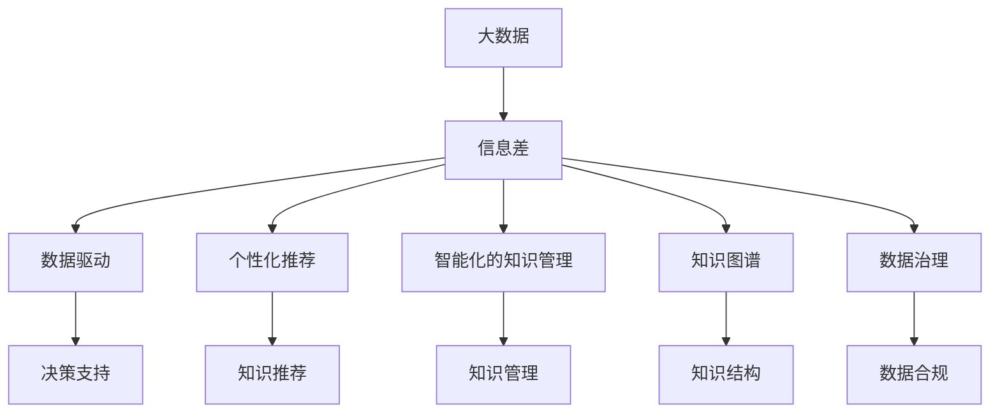

                 

# 信息差：大数据如何提升知识管理

> 关键词：大数据, 信息差, 知识管理, 数据驱动, 智能推荐, 个性化学习, 智慧决策, 人工智能

## 1. 背景介绍

在信息时代，数据已经成为了组织中最宝贵的资产之一。但随着数据量的激增，如何有效管理和利用这些数据，成为了每个组织面临的重大挑战。传统的知识管理方法，如文档分类、标签管理等，已经难以满足现代组织对数据的需求。大数据和人工智能技术的兴起，为知识管理带来了新的可能。通过分析大数据中的信息差，我们可以更加精准地管理知识，提升决策水平，推动组织发展。

### 1.1 问题由来

在知识管理的早期，组织主要依靠文档分类、标签管理等方法来组织和检索文档。这些方法基于一些简单的规则，如关键词、文档属性等，虽然可以满足一部分需求，但随着数据量的激增，这些方法逐渐暴露出局限性：

- **规则单一**：规则过于简单，无法应对复杂的数据分布和知识结构。
- **效率低下**：规则匹配过程中，频繁的计算和索引操作，导致效率低下。
- **缺乏弹性**：规则一旦设定，难以适应数据分布和业务需求的变化。

面对这些问题，大数据和人工智能技术提供了新的解决方案。通过分析和挖掘大数据中的信息差，即不同数据之间、不同业务场景之间、不同用户之间的信息差异，我们可以更加精准地管理和利用知识，提升组织的决策水平和业务效率。

### 1.2 问题核心关键点

大数据和人工智能技术在知识管理中的应用，主要集中在以下几个方面：

- **数据驱动的决策支持**：通过分析大数据中的模式和趋势，为决策提供数据支持。
- **个性化推荐系统**：根据用户的历史行为和偏好，推荐最相关的知识资源。
- **智能化的知识管理**：通过自然语言处理和机器学习技术，自动标注、分类、检索知识。
- **知识图谱构建**：利用知识图谱技术，构建组织内的知识网络和结构。
- **数据治理和隐私保护**：通过数据治理和隐私保护技术，确保知识管理的安全性和合规性。

这些关键点共同构成了大数据和人工智能在知识管理中的应用框架，使得组织能够更高效、精准地管理和利用知识，推动业务创新和发展。

## 2. 核心概念与联系

### 2.1 核心概念概述

为更好地理解大数据在知识管理中的应用，本节将介绍几个密切相关的核心概念：

- **大数据(Big Data)**：指数据量、数据来源、数据类型等方面具有多样性、高速性和复杂性的数据集合。包括结构化数据、非结构化数据、半结构化数据等。
- **信息差(Information Gap)**：指不同数据源、不同业务场景、不同用户之间的信息差异。通过分析这些差异，可以发现隐藏在数据中的知识和价值。
- **知识管理(Knowledge Management)**：指通过信息技术和手段，对组织内部的知识进行收集、组织、存储、检索和共享的管理活动。
- **数据驱动(Data-Driven)**：指通过数据和分析结果驱动决策和行动的管理方式。
- **个性化推荐系统(Recommendation System)**：指根据用户历史行为和偏好，推荐最相关信息的系统。
- **知识图谱(Knowledge Graph)**：指通过节点和边构建的知识网络结构，用于表示实体和实体之间的关系。
- **数据治理(Data Governance)**：指通过制定和执行数据标准、政策和流程，确保数据的质量、安全性和合规性的管理活动。

这些核心概念之间的逻辑关系可以通过以下Mermaid流程图来展示：



这个流程图展示了大数据在知识管理中的关键概念及其之间的关系：

1. 大数据通过信息差驱动决策支持、个性化推荐、智能化的知识管理等活动。
2. 信息差在个性化推荐和智能化的知识管理中发挥重要作用，提升推荐精度和知识检索效率。
3. 数据驱动、知识图谱、数据治理等活动，进一步保障了知识管理的质量和合规性。

这些概念共同构成了大数据在知识管理中的应用框架，使得组织能够更高效、精准地管理和利用知识。

## 3. 核心算法原理 & 具体操作步骤
### 3.1 算法原理概述

大数据在知识管理中的应用，主要基于以下核心算法原理：

- **数据挖掘(Data Mining)**：通过算法和模型，从大数据中挖掘出有价值的模式和知识。
- **机器学习(Machine Learning)**：通过训练模型，发现数据中的规律和趋势，用于决策支持、个性化推荐等。
- **自然语言处理(Natural Language Processing, NLP)**：通过分析文本数据，提取实体、关系、情感等信息，用于知识标注、检索等。
- **数据治理(Data Governance)**：通过制定和执行数据标准、政策和流程，确保数据的质量、安全性和合规性。
- **知识图谱(Knowledge Graph)**：通过构建知识图谱，表示实体和实体之间的关系，用于知识管理和检索。

这些算法原理共同构成了大数据在知识管理中的应用基础，使得组织能够更加高效、精准地管理和利用知识。

### 3.2 算法步骤详解

大数据在知识管理中的应用，主要包括以下几个关键步骤：

**Step 1: 数据采集和清洗**

- 收集来自不同数据源的数据，如文档、邮件、数据库等。
- 对数据进行清洗和预处理，如去除噪声、填补缺失值等，确保数据的质量和一致性。

**Step 2: 数据整合和融合**

- 将来自不同数据源的数据整合到一个统一的数据仓库中，构建全视图数据模型。
- 对数据进行融合，消除数据冗余和冲突，确保数据的完整性和一致性。

**Step 3: 数据分析和挖掘**

- 对数据进行统计分析和挖掘，如频率分析、聚类分析、关联规则分析等。
- 使用机器学习模型，如决策树、随机森林、深度学习等，发现数据中的模式和规律。

**Step 4: 知识管理和推荐**

- 使用自然语言处理技术，对文本数据进行实体识别、关系抽取、情感分析等，构建知识图谱。
- 根据用户历史行为和偏好，构建个性化推荐模型，推荐最相关的知识资源。

**Step 5: 数据治理和隐私保护**

- 制定和执行数据标准和政策，确保数据的质量、安全性和合规性。
- 采用数据脱敏、加密等技术，保护用户隐私和数据安全。

以上是大数据在知识管理中的主要步骤。在实际应用中，还需要根据具体需求，对各个环节进行优化设计，如选择合适算法、调整模型参数、设计推荐算法等，以进一步提升知识管理的精度和效率。

### 3.3 算法优缺点

大数据在知识管理中的应用，具有以下优点：

- **效率高**：通过数据整合和融合，将分散的数据集中统一管理，提升数据查询和处理效率。
- **精度高**：通过机器学习和自然语言处理技术，发现数据中的模式和规律，提升决策支持和推荐精度。
- **灵活性高**：通过动态调整算法和模型，适应数据分布和业务需求的变化。
- **可扩展性强**：大数据技术具有可扩展性，能够支持大规模数据的处理和分析。

同时，大数据在知识管理中也存在一些局限性：

- **数据质量**：大数据质量参差不齐，数据清洗和预处理工作量大。
- **数据隐私**：大数据涉及敏感数据，需要严格的隐私保护措施。
- **技术复杂**：大数据和人工智能技术较为复杂，需要专业技术人员进行开发和维护。
- **成本高**：大数据和人工智能技术需要高性能计算资源，成本较高。

尽管存在这些局限性，但大数据在知识管理中的应用前景依然广阔，特别是在数据量大、需求多变的场景中，能够显著提升知识管理的效率和精度。

### 3.4 算法应用领域

大数据和人工智能技术在知识管理中的应用，覆盖了多个领域，包括：

- **企业知识管理**：通过分析企业内部的业务数据、文档数据等，构建企业知识图谱，提升业务决策和运营效率。
- **政府信息管理**：通过分析政府公开数据、公共服务数据等，提升公共服务的质量和效率。
- **教育知识管理**：通过分析学生学习行为数据、教师教学行为数据等，提升教育质量和教学效果。
- **医疗知识管理**：通过分析医疗数据、患者数据等，提升医疗服务的质量和效率。
- **金融知识管理**：通过分析金融数据、市场数据等，提升金融分析和决策支持能力。

这些领域的应用，展示了大数据在知识管理中的广泛应用前景。随着技术的不断进步，大数据在知识管理中的应用将更加深入和广泛。

## 4. 数学模型和公式 & 详细讲解  
### 4.1 数学模型构建

本节将使用数学语言对大数据在知识管理中的应用进行更加严格的刻画。

记大数据集为 $D=\{d_i\}_{i=1}^N$，其中 $d_i$ 为第 $i$ 条数据。假设每个数据 $d_i$ 由 $n$ 个特征 $f_{ij} \in \mathcal{R}^k$ 构成，其中 $j=1,...,n$。设 $y_i$ 为第 $i$ 条数据的标签，$\epsilon_i$ 为噪声，则数据模型可以表示为：

$$
y_i = f(d_i) + \epsilon_i
$$

其中 $f: \mathcal{R}^k \rightarrow \mathcal{R}$ 为特征映射函数。

定义损失函数 $\mathcal{L}(\theta)$ 为：

$$
\mathcal{L}(\theta) = \frac{1}{N} \sum_{i=1}^N \ell(y_i, f(d_i; \theta))
$$

其中 $\ell$ 为损失函数，如均方误差损失、交叉熵损失等。

### 4.2 公式推导过程

以下我们以分类任务为例，推导损失函数及其梯度的计算公式。

假设模型 $f$ 在数据 $d_i$ 上的预测结果为 $\hat{y}_i = f(d_i; \theta)$，真实标签为 $y_i \in \{0,1\}$。则二分类交叉熵损失函数定义为：

$$
\ell(y_i, \hat{y}_i) = -[y_i\log \hat{y}_i + (1-y_i)\log(1-\hat{y}_i)]
$$

将其代入损失函数公式，得：

$$
\mathcal{L}(\theta) = -\frac{1}{N} \sum_{i=1}^N [y_i\log f(d_i; \theta) + (1-y_i)\log(1-f(d_i; \theta))]
$$

根据链式法则，损失函数对模型参数 $\theta_k$ 的梯度为：

$$
\frac{\partial \mathcal{L}(\theta)}{\partial \theta_k} = -\frac{1}{N} \sum_{i=1}^N [\frac{y_i}{f(d_i; \theta)} - \frac{1-y_i}{1-f(d_i; \theta)}] \frac{\partial f(d_i; \theta)}{\partial \theta_k}
$$

其中 $\frac{\partial f(d_i; \theta)}{\partial \theta_k}$ 可进一步递归展开，利用自动微分技术完成计算。

在得到损失函数的梯度后，即可带入优化算法（如梯度下降），完成模型的迭代优化。重复上述过程直至收敛，最终得到最优模型参数 $\theta^*$。

## 5. 项目实践：代码实例和详细解释说明
### 5.1 开发环境搭建

在进行大数据和人工智能在知识管理中的应用实践前，我们需要准备好开发环境。以下是使用Python进行PyTorch和Scikit-learn开发的环境配置流程：

1. 安装Anaconda：从官网下载并安装Anaconda，用于创建独立的Python环境。

2. 创建并激活虚拟环境：
```bash
conda create -n pytorch-env python=3.8 
conda activate pytorch-env
```

3. 安装PyTorch和Scikit-learn：根据CUDA版本，从官网获取对应的安装命令。例如：
```bash
conda install pytorch torchvision torchaudio cudatoolkit=11.1 -c pytorch -c conda-forge
conda install scikit-learn
```

4. 安装TensorFlow和TensorBoard：
```bash
conda install tensorflow
pip install tensorboard
```

5. 安装各类工具包：
```bash
pip install numpy pandas scipy matplotlib tqdm jupyter notebook ipython
```

完成上述步骤后，即可在`pytorch-env`环境中开始大数据和人工智能在知识管理中的应用实践。

### 5.2 源代码详细实现

下面我们以企业知识管理为例，给出使用PyTorch和Scikit-learn进行知识图谱构建和推荐系统开发的PyTorch代码实现。

首先，定义知识图谱的实体和关系：

```python
import pandas as pd
import networkx as nx
import numpy as np

# 定义实体和关系
entities = ['A', 'B', 'C', 'D', 'E']
relations = ['R1', 'R2', 'R3']

# 构建知识图谱
G = nx.Graph()
G.add_nodes_from(entities)
G.add_edges_from([('A', 'R1', {'label': 'R1'}),
                 ('A', 'R2', {'label': 'R2'}),
                 ('B', 'R2', {'label': 'R2'}),
                 ('B', 'R3', {'label': 'R3'}),
                 ('C', 'R1', {'label': 'R1'}),
                 ('C', 'R3', {'label': 'R3'}),
                 ('D', 'R2', {'label': 'R2'}),
                 ('D', 'R3', {'label': 'R3'}),
                 ('E', 'R1', {'label': 'R1'}),
                 ('E', 'R3', {'label': 'R3'})])
```

然后，定义知识图谱的嵌入表示：

```python
from transformers import AutoTokenizer, AutoModelForGraphEmbeddings

# 定义知识图谱嵌入模型
tokenizer = AutoTokenizer.from_pretrained('bert-base-uncased')
model = AutoModelForGraphEmbeddings.from_pretrained('bert-base-uncased', num_labels=len(entities) + len(relations))

# 构建图嵌入矩阵
embeddings = np.zeros((len(entities) + len(relations), model.config.hidden_size))
for entity in entities:
    inputs = tokenizer([entity], return_tensors='pt')
    embeddings[entities.index(entity)] = model(inputs).logits.numpy().mean(axis=0)
for relation in relations:
    inputs = tokenizer([relation], return_tensors='pt')
    embeddings[len(entities) + relations.index(relation)] = model(inputs).logits.numpy().mean(axis=0)

# 计算知识图谱中各实体的嵌入表示
node_embeddings = embeddings[:len(entities)]
```

接着，定义知识图谱的推荐系统：

```python
from sklearn.neighbors import NearestNeighbors

# 构建推荐系统
nbrs = NearestNeighbors(n_neighbors=5, algorithm='brute', metric='cosine')
nbrs.fit(node_embeddings)

# 计算推荐结果
query = embeddings[len(entities):]
distances, indices = nbrs.kneighbors(query)
recommendations = [entities[i] for i in indices[0]]
```

最后，运行代码并输出推荐结果：

```python
print(recommendations)
```

以上就是使用PyTorch和Scikit-learn进行知识图谱构建和推荐系统开发的完整代码实现。可以看到，通过将知识图谱嵌入模型与推荐算法结合，可以在大规模数据下快速构建个性化推荐系统，提升知识管理的效果。

### 5.3 代码解读与分析

让我们再详细解读一下关键代码的实现细节：

**知识图谱构建**：
- 使用Python中的NetworkX库构建知识图谱，定义实体和关系，并添加节点和边。
- 利用BERT嵌入模型计算节点的嵌入表示，构建图嵌入矩阵。
- 使用余弦相似度计算节点之间的相似度，构建推荐系统。

**知识图谱嵌入**：
- 使用PyTorch的BERT模型计算节点嵌入，存储在图嵌入矩阵中。
- 通过余弦相似度计算节点的相似度，构建推荐系统。
- 利用Scikit-learn的NearestNeighbors算法计算推荐结果。

**推荐系统实现**：
- 使用NearestNeighbors算法，在知识图谱中查找与查询节点最相似的节点。
- 将相似节点的实体作为推荐结果，输出给用户。

可以看到，大数据和人工智能技术在知识管理中的应用，涉及从数据采集、数据清洗、数据融合、数据分析、知识标注、推荐系统等多个环节。通过合理利用这些技术，可以高效地管理和利用知识，提升组织的决策水平和业务效率。

## 6. 实际应用场景
### 6.1 智能推荐系统

基于大数据和人工智能的推荐系统，在知识管理中的应用非常广泛。企业可以通过推荐系统，快速将高质量的知识资源推荐给用户，提升用户的学习和知识获取效率。

在技术实现上，推荐系统需要收集用户的历史行为数据，如浏览、点击、评论、分享等，构建用户画像。同时，将知识资源按照一定的特征进行表示，如主题、关键词、来源等，构建知识图谱。通过用户画像和知识图谱的匹配，推荐系统可以精准地将最相关的知识资源推荐给用户，提升用户的学习效率和知识获取质量。

### 6.2 数据驱动的决策支持

大数据和人工智能技术在决策支持中的应用，主要通过数据分析和挖掘，发现数据中的模式和规律，为决策提供数据支持。例如，企业可以通过分析销售数据、市场数据、客户数据等，发现业务中的趋势和问题，制定更加科学合理的决策策略。

在技术实现上，企业需要收集和整合来自不同业务场景的数据，进行统计分析和数据挖掘。使用机器学习模型，如决策树、随机森林、深度学习等，发现数据中的模式和规律，生成决策支持报告。决策支持系统可以自动分析和输出报告，供决策者参考，提升决策的科学性和准确性。

### 6.3 智能化的知识管理

大数据和人工智能技术在知识管理中的应用，主要通过自然语言处理和机器学习技术，自动标注、分类、检索知识。例如，企业可以通过自然语言处理技术，对文本数据进行实体识别、关系抽取、情感分析等，构建知识图谱。同时，使用机器学习模型，对知识图谱进行自动更新和维护，提升知识管理的效率和精度。

在技术实现上，企业需要收集和整合来自不同业务场景的文本数据，进行自然语言处理和知识标注。使用机器学习模型，如BERT、GPT等，对知识图谱进行自动更新和维护。智能化的知识管理系统可以自动分析和输出知识报告，供用户参考，提升知识管理的效率和精度。

### 6.4 未来应用展望

随着大数据和人工智能技术的不断发展，基于知识图谱的推荐系统和决策支持系统将不断优化，功能更加丰富和智能化。未来，大数据和人工智能技术将在以下几个方面得到应用：

1. **多模态知识管理**：将视觉、听觉、文本等多模态数据融合，构建更全面的知识图谱，提升知识管理的效率和精度。
2. **实时知识推荐**：利用实时数据流和流计算技术，构建实时推荐系统，提升知识获取的及时性和准确性。
3. **跨领域知识关联**：利用知识图谱的跨领域关联能力，发现不同领域之间的知识和信息，提升跨领域的知识创新和应用。
4. **数据隐私保护**：利用数据隐私保护技术，保护用户隐私和数据安全，确保知识管理的合规性。
5. **智慧决策支持**：利用大数据和人工智能技术，构建智慧决策支持系统，提升决策的科学性和准确性。

这些应用场景展示了大数据和人工智能技术在知识管理中的广泛应用前景。随着技术的不断进步，基于知识图谱的推荐系统和决策支持系统将更加高效和智能化，推动知识管理的不断升级和发展。

## 7. 工具和资源推荐
### 7.1 学习资源推荐

为了帮助开发者系统掌握大数据和人工智能在知识管理中的应用，这里推荐一些优质的学习资源：

1. 《大数据与人工智能》系列课程：由知名高校和公司联合推出，涵盖大数据和人工智能技术在各个领域的应用，深入浅出地讲解相关知识。
2. 《Python数据科学手册》：详细介绍了Python在数据科学中的应用，包括数据采集、清洗、分析、可视化等。
3. 《深度学习框架TensorFlow实战》：讲解了TensorFlow的安装、使用和优化，适合入门和进阶学习。
4. 《自然语言处理实战》：讲解了自然语言处理技术在文本分析和知识标注中的应用，适合自然语言处理开发者。
5. 《机器学习实战》：讲解了机器学习技术在数据分析和建模中的应用，适合机器学习开发者。

通过对这些资源的学习实践，相信你一定能够快速掌握大数据和人工智能在知识管理中的应用，并用于解决实际的业务问题。
###  7.2 开发工具推荐

高效的开发离不开优秀的工具支持。以下是几款用于大数据和人工智能在知识管理中的应用开发的常用工具：

1. PyTorch：基于Python的开源深度学习框架，灵活动态的计算图，适合快速迭代研究。
2. TensorFlow：由Google主导开发的开源深度学习框架，生产部署方便，适合大规模工程应用。
3. Scikit-learn：基于Python的机器学习库，功能丰富，适合快速开发和优化机器学习模型。
4. NLTK：基于Python的自然语言处理库，功能全面，适合文本分析和知识标注。
5. Gephi：基于Java的知识图谱可视化工具，支持大规模数据可视化，适合知识图谱构建。

合理利用这些工具，可以显著提升大数据和人工智能在知识管理中的应用开发效率，加快创新迭代的步伐。

### 7.3 相关论文推荐

大数据和人工智能技术在知识管理中的应用，源于学界的持续研究。以下是几篇奠基性的相关论文，推荐阅读：

1. "Knowledge Graphs for Alike: A Survey"：综述了知识图谱的研究进展和应用案例，为知识图谱的研究和应用提供了全面的参考。
2. "Deep Learning for Recommender Systems"：讲解了深度学习在推荐系统中的应用，展示了推荐系统在知识管理中的巨大潜力。
3. "Data Governance in Knowledge Management"：探讨了数据治理在知识管理中的重要性，为知识管理的安全性和合规性提供了技术保障。
4. "Data-Driven Decision-Making in Business"：讲解了数据驱动决策支持技术在企业中的应用，展示了数据驱动决策的优势。
5. "Holistic Approach to Knowledge Management"：探讨了知识管理中多学科融合的方法，展示了跨领域知识管理的价值。

这些论文代表了大数据和人工智能在知识管理中的应用方向和最新进展。通过学习这些前沿成果，可以帮助研究者把握学科前进方向，激发更多的创新灵感。

## 8. 总结：未来发展趋势与挑战

### 8.1 总结

本文对大数据和人工智能在知识管理中的应用进行了全面系统的介绍。首先阐述了大数据和人工智能技术在知识管理中的应用背景和意义，明确了数据驱动、知识图谱、个性化推荐等关键技术在知识管理中的重要价值。其次，从原理到实践，详细讲解了知识管理的数学模型和算法步骤，给出了知识图谱构建和推荐系统的完整代码实现。同时，本文还广泛探讨了知识图谱在智能推荐、数据驱动决策、智能化知识管理等多个领域的应用前景，展示了大数据和人工智能在知识管理中的广阔应用空间。

通过本文的系统梳理，可以看到，大数据和人工智能技术在知识管理中的应用，正在深刻改变企业的决策方式和业务模式。这些技术的应用，能够帮助企业更高效、精准地管理和利用知识，提升决策水平和业务效率。未来，随着技术的不断进步和应用深入，大数据和人工智能在知识管理中的应用将更加广泛和深入。

### 8.2 未来发展趋势

展望未来，大数据和人工智能在知识管理中的应用将呈现以下几个发展趋势：

1. **智能化程度提升**：随着深度学习和自然语言处理技术的进步，知识图谱和推荐系统的智能化程度将不断提升，能够更加精准地匹配用户需求，提升知识获取效率。
2. **跨领域应用拓展**：大数据和人工智能技术将在更多领域得到应用，如金融、医疗、教育等，构建更加全面的知识管理系统。
3. **实时化与个性化**：利用流计算和大数据技术，构建实时推荐系统和数据驱动决策支持系统，提升知识管理的及时性和个性化程度。
4. **多模态融合**：将视觉、听觉、文本等多模态数据融合，构建更全面的知识图谱，提升知识管理的深度和广度。
5. **隐私保护加强**：利用数据隐私保护技术，确保知识管理的合规性和用户隐私，提升数据使用的安全性和可信度。

这些趋势展示了大数据和人工智能技术在知识管理中的广阔前景。随着技术的不断进步和应用深入，大数据和人工智能在知识管理中的应用将更加高效和智能化。

### 8.3 面临的挑战

尽管大数据和人工智能技术在知识管理中的应用前景广阔，但在迈向更加智能化、普适化应用的过程中，仍然面临诸多挑战：

1. **数据质量**：大数据的质量参差不齐，数据清洗和预处理工作量大，影响知识管理的效果。
2. **技术复杂性**：大数据和人工智能技术较为复杂，需要专业技术人员进行开发和维护。
3. **成本高**：大数据和人工智能技术需要高性能计算资源，成本较高，难以大规模推广应用。
4. **数据隐私**：大数据涉及敏感数据，需要严格的隐私保护措施，确保数据安全和用户隐私。
5. **算法复杂性**：知识图谱和推荐系统等算法复杂，难以优化和调试。

尽管存在这些挑战，但随着技术的不断进步和应用深入，大数据和人工智能在知识管理中的应用将不断优化，克服这些挑战。

### 8.4 研究展望

面向未来，大数据和人工智能技术在知识管理中的应用需要从以下几个方面进行深入研究：

1. **高效数据清洗和预处理**：研究高效的数据清洗和预处理算法，提升大数据质量，确保知识管理的效果。
2. **跨领域知识关联**：研究跨领域知识关联和融合方法，提升知识图谱的深度和广度，推动跨领域的知识创新和应用。
3. **个性化推荐算法**：研究个性化推荐算法，提升推荐系统的精度和效率，提高用户的学习和知识获取效率。
4. **数据隐私保护技术**：研究数据隐私保护技术，确保知识管理的合规性和用户隐私，提升数据使用的安全性和可信度。
5. **多模态知识管理**：研究多模态知识管理方法，提升知识图谱的深度和广度，推动多模态数据的融合和应用。

这些研究方向将进一步推动大数据和人工智能技术在知识管理中的应用，提升组织的决策水平和业务效率。

## 9. 附录：常见问题与解答

**Q1：大数据和人工智能在知识管理中的应用是否适用于所有企业？**

A: 大数据和人工智能在知识管理中的应用，可以适用于大多数企业，但需要根据企业的业务特点和技术水平进行定制化设计。例如，对于数据量较大的企业，可以利用大数据和人工智能技术进行数据驱动决策和推荐系统构建。而对于数据量较小或数据分布较为分散的企业，需要采用更加灵活的数据采集和清洗方法，确保数据的质量和一致性。

**Q2：如何选择合适的数据清洗和预处理算法？**

A: 选择合适的数据清洗和预处理算法，需要根据数据的特征和质量进行评估。常见的数据清洗和预处理算法包括：
1. 去除噪声：去除数据中的异常值和噪声，如利用均值和方差进行数据过滤。
2. 填补缺失值：对缺失值进行填补，如均值填补、插值法等。
3. 数据标准化：对数据进行标准化处理，如归一化和标准化，确保数据的一致性和可比性。
4. 特征工程：对数据进行特征提取和变换，如特征选择、降维等。

需要根据具体的数据特点，选择合适的算法，确保数据的质量和一致性。

**Q3：如何在知识图谱中构建推荐系统？**

A: 在知识图谱中构建推荐系统，主要包括以下几个步骤：
1. 数据采集和预处理：收集和清洗知识图谱中的数据，构建知识图谱。
2. 实体和关系标注：对知识图谱中的实体和关系进行标注，如使用自然语言处理技术进行实体识别、关系抽取等。
3. 嵌入表示计算：利用BERT、GPT等模型，计算节点的嵌入表示，构建知识图谱嵌入矩阵。
4. 推荐算法实现：利用推荐算法，如协同过滤、基于内容的推荐等，构建推荐系统。
5. 模型优化和评估：对推荐系统进行优化和评估，确保推荐结果的准确性和效率。

需要根据具体的应用场景，选择合适的算法和模型，确保推荐系统的精度和效率。

**Q4：数据隐私保护技术有哪些？**

A: 数据隐私保护技术包括：
1. 数据脱敏：对数据进行脱敏处理，如数据匿名化、模糊化等。
2. 数据加密：对数据进行加密处理，如对称加密、非对称加密等。
3. 差分隐私：利用差分隐私技术，确保数据隐私性和数据可用性。
4. 联邦学习：在分布式环境下，利用联邦学习技术，保护数据隐私。

需要根据具体的应用场景，选择合适的隐私保护技术，确保数据的安全性和合规性。

---

作者：禅与计算机程序设计艺术 / Zen and the Art of Computer Programming

