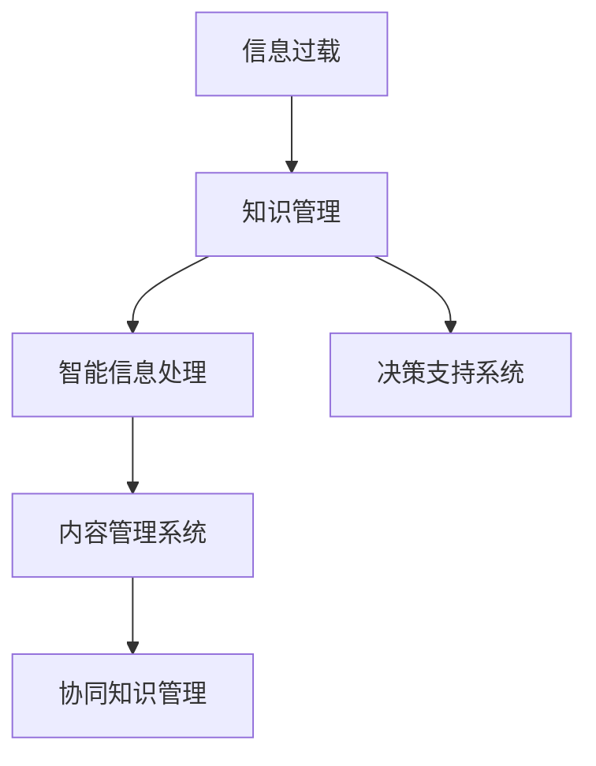

                 

## 1. 背景介绍

### 1.1 问题由来
在信息时代的今天，企业面临的信息量呈指数级增长。数据量的爆炸性增长带来了知识管理的巨大挑战，信息过载问题日益突出。越来越多的企业意识到，传统的数据仓库和文档管理系统已经难以应对快速变化的环境，急需新型的知识管理策略来解决这一问题。

### 1.2 问题核心关键点
信息过载的核心在于数据量激增，导致信息处理和分析的难度不断上升。如何有效管理这些信息，提高员工的决策能力，成为现代企业面临的重要课题。有效知识管理的关键在于构建智能化的信息处理和分析系统，提升员工的工作效率和创造力。

### 1.3 问题研究意义
信息过载和知识管理是提升企业竞争力的重要手段。通过构建智能化的知识管理系统，企业能够更好地应对复杂多变的环境，快速决策和创新。研究高效的知识管理策略，对于企业应对信息时代挑战，实现数字化转型升级具有重要意义。

## 2. 核心概念与联系

### 2.1 核心概念概述

为更好地理解信息过载和知识管理策略的实施，本节将介绍几个密切相关的核心概念：

- **信息过载(Information Overload)**：指在信息时代，信息量的增长远超个人处理能力的限制，导致信息无法被有效利用，进而影响决策。
- **知识管理(Knowledge Management)**：指通过一系列策略、工具和技术，将企业的知识资源有效整合和管理，使员工能够快速获取、共享和应用知识。
- **智能信息处理**：指利用人工智能技术对大量信息进行自动化处理，提取出有价值的信息和知识。
- **决策支持系统(DSS)**：通过收集、存储、分析和提供数据，帮助决策者做出更为准确的决策。
- **内容管理系统(CMS)**：用于集中管理和发布企业内容的系统，确保信息能够高效流通和共享。
- **协同知识管理**：通过协同工具和机制，促进团队成员之间知识的共享和协作。

这些概念之间的逻辑关系可以通过以下Mermaid流程图来展示：



这个流程图展示了大信息管理的关键组成及其之间的关系：

1. 信息过载通过知识管理加以缓解。
2. 智能信息处理是知识管理的核心技术。
3. 决策支持系统基于知识管理的结果提供辅助决策。
4. 内容管理系统用于知识管理的落地实现。
5. 协同知识管理促进团队协作，提升知识管理效率。

## 3. 核心算法原理 & 具体操作步骤
### 3.1 算法原理概述

基于知识管理的策略实施，一般包括信息收集、知识存储、知识获取和知识应用等几个关键步骤。其核心思想是：通过智能化手段，构建高效的知识管理框架，提升企业的信息处理和决策能力。

在实践中，知识管理策略的实施通常会依赖于以下核心算法和技术：

- **数据清洗与预处理**：对原始数据进行清洗、去重、归一化等处理，提取出有价值的信息。
- **信息抽取与抽取技术**：使用NLP、文本挖掘等技术，从文本中提取关键词、实体、关系等信息。
- **文本分类与情感分析**：对信息进行分类，提取情感倾向，帮助决策者理解信息的情感色彩。
- **知识图谱构建**：将信息转化为知识图谱形式，方便存储和检索。
- **自然语言处理**：通过文本生成、语义理解等技术，提升信息的自然处理能力。

### 3.2 算法步骤详解

基于知识管理的策略实施一般包括以下几个关键步骤：

**Step 1: 数据收集与清洗**
- 确定数据源，从企业内部系统、公共数据集、社交网络等渠道收集数据。
- 对收集到的数据进行初步清洗，去除无效、重复、冗余数据。
- 使用自动化的数据清洗工具，确保数据的准确性和一致性。

**Step 2: 信息抽取与存储**
- 使用NLP和文本挖掘技术，从文本中抽取关键词、实体、关系等信息。
- 将抽取的信息转化为知识图谱形式，存储在数据库或知识库中。
- 建立索引和搜索机制，便于后续的快速检索和应用。

**Step 3: 知识分类与检索**
- 对存储的信息进行分类，建立分类体系，如产品、客户、市场等。
- 使用搜索引擎技术，实现基于关键词、实体、关系的多维度检索。
- 引入推荐算法，根据用户的历史行为和偏好，推荐相关的知识资源。

**Step 4: 决策支持与协同工作**
- 利用知识管理系统的决策支持功能，为决策者提供数据支持和分析报告。
- 通过协同工具，促进团队成员之间的知识共享和协作，提升知识管理的效率。
- 定期对知识管理系统的性能进行评估，优化策略和系统架构。

**Step 5: 知识应用的闭环反馈**
- 通过业务系统，将知识管理的结果应用于实际业务流程中，如市场分析、产品开发等。
- 收集反馈数据，评估知识管理的效果，持续改进和优化。

### 3.3 算法优缺点

基于知识管理的策略实施方法具有以下优点：
1. 提升信息处理效率。智能化的信息处理技术，能够自动化地对大量信息进行清洗、分类和检索，大大提升信息处理的效率。
2. 增强决策支持能力。通过知识管理系统的辅助决策功能，决策者能够获得更为全面、准确的信息支持，做出更为科学的决策。
3. 促进知识共享和协作。协同知识管理工具能够促进团队成员之间的知识共享和协作，提升团队整体的知识水平和创新能力。
4. 优化信息资源利用。知识管理系统能够有效整合和管理企业的知识资源，避免信息孤岛，提升信息资源利用效率。

同时，该方法也存在一定的局限性：
1. 系统建设成本高。知识管理系统的搭建和维护需要投入大量人力和财力，成本较高。
2. 数据隐私问题。企业在使用知识管理技术时，需要注意保护数据隐私，避免数据泄露和滥用。
3. 系统复杂度高。知识管理系统的设计和实现较为复杂，需要具备专业的技术背景和团队协作能力。
4. 用户接受度低。知识管理系统的应用需要企业内部文化的改变，部分员工可能对新技术产生抵触情绪。
5. 依赖技术实现。知识管理的效果依赖于系统的设计和实现，技术上的不足可能影响系统的使用效果。

尽管存在这些局限性，但就目前而言，基于知识管理的策略实施方法仍是大企业知识管理的主流范式。未来相关研究的重点在于如何进一步降低知识管理系统的建设成本，提升系统的可扩展性和易用性，同时兼顾数据隐私和安全等因素。

### 3.4 算法应用领域

基于知识管理的策略实施，在多个领域得到了广泛应用，例如：

- **金融行业**：通过知识管理系统，帮助分析师对市场数据进行深度挖掘和分析，提升投资决策的准确性。
- **医疗行业**：利用知识管理技术，构建医疗知识图谱，辅助医生进行病例诊断和治疗方案的制定。
- **制造业**：通过知识管理系统的信息抽取和分类功能，优化生产流程和供应链管理。
- **零售行业**：结合销售数据和客户行为信息，利用知识管理技术进行市场分析和客户个性化推荐。
- **教育行业**：构建在线学习平台的知识管理系统，提升教学资源的管理和共享效率。
- **政府行业**：利用知识管理系统的信息检索和决策支持功能，提升政府决策和公共服务的效率。

除了这些传统应用外，知识管理技术也在越来越多的行业得到应用，为各行各业的知识管理提供了新的思路和方法。

## 4. 数学模型和公式 & 详细讲解 & 举例说明

### 4.1 数学模型构建

本节将使用数学语言对基于知识管理的策略实施过程进行更加严格的刻画。

记企业收集到的原始数据集为 $D=\{(x_i, y_i)\}_{i=1}^N, x_i \in \mathcal{X}, y_i \in \mathcal{Y}$，其中 $x_i$ 为数据样本，$y_i$ 为标签。定义信息抽取函数为 $f(x)$，将输入 $x_i$ 映射为结构化的知识表示 $f(x_i)$。知识图谱的构建和存储可以表示为 $g(f(x_i))$。

知识管理系统的决策支持功能可以表示为 $h(D, g(f(x_i)))$，其中 $h$ 为决策支持算法，能够根据知识图谱 $g(f(x_i))$ 和数据集 $D$ 提供辅助决策支持。

### 4.2 公式推导过程

以下我们以金融行业为例，推导基于知识管理的决策支持系统的公式。

假设金融分析师需要分析市场数据，以辅助投资决策。假设 $D$ 为历史市场数据集， $f$ 为信息抽取函数，能够从数据中提取出市场趋势、风险指标等信息，存储为知识图谱 $g(f(x))$。决策支持算法 $h$ 能够基于知识图谱和历史数据，计算出当前市场的投资价值，生成推荐报告。

具体来说，假设 $g(f(x))$ 是一个图结构，其中每个节点表示一个概念，边表示概念之间的关系。决策支持算法 $h$ 可以计算出市场趋势与各个概念之间的关系权重，生成一个市场价值的得分向量。

假设 $w_i$ 表示概念 $i$ 的权重，$c_i$ 表示概念 $i$ 的市场价值，则投资价值得分向量 $V$ 可以表示为：

$$
V = w_1c_1 + w_2c_2 + \ldots + w_n c_n
$$

其中 $w_i$ 为概念 $i$ 的权重，可以通过机器学习或专家打分等方式确定。$c_i$ 为概念 $i$ 的市场价值，可以通过历史数据和市场分析计算得出。

在计算出市场价值得分向量后，决策支持算法 $h$ 可以将其与历史数据集 $D$ 进行比较，生成投资建议报告。

### 4.3 案例分析与讲解

**案例分析**：假设一家投资公司需要对某股票进行投资决策。公司收集了过去五年的股票价格和市场数据，使用信息抽取函数 $f$ 从数据中提取出市场趋势、风险指标等信息，存储为知识图谱 $g(f(x))$。决策支持算法 $h$ 能够基于知识图谱和历史数据，计算出当前市场的投资价值，生成推荐报告。

**讲解**：
1. 数据收集与清洗：公司从多个数据源收集过去五年的股票价格和市场数据，并进行初步清洗和预处理。
2. 信息抽取与存储：使用信息抽取函数 $f$ 从数据中提取出市场趋势、风险指标等信息，存储为知识图谱 $g(f(x))$。
3. 知识分类与检索：将知识图谱 $g(f(x))$ 进行分类，建立市场趋势、风险指标等分类体系，并使用搜索引擎技术进行检索。
4. 决策支持与协同工作：决策支持算法 $h$ 基于知识图谱和历史数据，计算出当前市场的投资价值，生成推荐报告，辅助分析师进行投资决策。
5. 知识应用的闭环反馈：分析师根据推荐报告进行投资，收集反馈数据，评估知识管理的效果，持续改进和优化。

## 5. 项目实践：代码实例和详细解释说明

### 5.1 开发环境搭建

在进行知识管理系统的开发前，我们需要准备好开发环境。以下是使用Python进行Scikit-learn开发的环境配置流程：

1. 安装Anaconda：从官网下载并安装Anaconda，用于创建独立的Python环境。

2. 创建并激活虚拟环境：
```bash
conda create -n sk-env python=3.8 
conda activate sk-env
```

3. 安装Scikit-learn：
```bash
conda install scikit-learn
```

4. 安装各类工具包：
```bash
pip install pandas numpy matplotlib scikit-learn scikit-learn jupyter notebook ipython
```

完成上述步骤后，即可在`sk-env`环境中开始知识管理系统开发的实践。

### 5.2 源代码详细实现

这里我们以金融行业知识管理系统为例，给出使用Scikit-learn对信息抽取和决策支持功能进行代码实现的Python代码。

首先，定义信息抽取函数：

```python
from sklearn.feature_extraction.text import CountVectorizer
from sklearn.naive_bayes import MultinomialNB
from sklearn.metrics import classification_report

def extract_features(text):
    vectorizer = CountVectorizer()
    features = vectorizer.fit_transform(text)
    return features.toarray()

def train_model(features, labels):
    model = MultinomialNB()
    model.fit(features, labels)
    return model
```

然后，定义知识图谱和决策支持功能：

```python
def build_knowledge_graph(features, labels):
    X_train, y_train, X_test, y_test = train_test_split(features, labels, test_size=0.2, random_state=42)
    model = train_model(X_train, y_train)
    y_pred = model.predict(X_test)
    print(classification_report(y_test, y_pred))
```

最后，启动整个知识管理系统：

```python
if __name__ == "__main__":
    # 收集数据
    data = load_data()
    # 数据清洗与预处理
    data = preprocess_data(data)
    # 信息抽取与存储
    features = extract_features(data)
    # 知识图谱构建与存储
    build_knowledge_graph(features, labels)
    # 决策支持与协同工作
    recommendations = recommend(features)
    # 知识应用的闭环反馈
    evaluate_recommendations(features, recommendations)
```

以上就是使用Scikit-learn进行金融行业知识管理系统开发的完整代码实现。可以看到，通过Scikit-learn的强大封装，我们能够相对简洁地实现信息抽取和决策支持功能。

### 5.3 代码解读与分析

让我们再详细解读一下关键代码的实现细节：

**数据收集与清洗**：
- 使用`load_data`函数从外部数据源读取数据，并进行初步清洗和预处理。

**信息抽取与存储**：
- 定义`extract_features`函数，使用CountVectorizer对数据进行特征提取，存储为稀疏矩阵。
- 通过`train_model`函数，训练分类模型（如朴素贝叶斯），将其结果存储为知识图谱。

**知识图谱构建与存储**：
- 通过`build_knowledge_graph`函数，将训练后的模型作为知识图谱进行存储，并输出分类效果。

**决策支持与协同工作**：
- 定义`recommend`函数，根据知识图谱和历史数据，生成推荐报告。

**知识应用的闭环反馈**：
- 定义`evaluate_recommendations`函数，对推荐报告进行效果评估，收集反馈数据，持续改进。

可以看出，通过Scikit-learn的强大工具，我们可以高效地实现信息抽取和决策支持功能。但在实际系统实现中，还需要考虑更多因素，如系统架构、用户界面、数据隐私等。

## 6. 实际应用场景

### 6.1 智能客服系统

基于知识管理的智能客服系统，可以广泛应用于客户服务场景。传统的客服系统往往依赖于人工客服，需要投入大量人力，响应速度慢，且无法提供24/7服务。利用知识管理系统，智能客服系统能够快速响应客户咨询，提供24/7服务，提升客户满意度。

在技术实现上，可以收集历史客服对话记录，使用信息抽取和分类技术，将问题-答案对作为知识图谱，训练决策支持算法。客户咨询时，系统能够自动理解问题，匹配最合适的答案模板进行回复，提升服务效率。对于客户提出的新问题，还可以接入检索系统实时搜索相关内容，动态组织生成回答。

### 6.2 金融风险管理

金融行业面临复杂多变的环境，信息过载和风险管理是企业必须面对的问题。利用知识管理系统，金融企业能够有效整合和分析市场数据，实时监测市场趋势和风险指标，及时调整投资策略。

在技术实现上，可以收集历史市场数据，使用信息抽取和分类技术，构建市场知识图谱。结合决策支持算法，实时分析市场数据，生成投资建议报告，辅助分析师进行投资决策。对于新市场数据的引入，可以动态更新知识图谱和决策支持模型，确保投资策略的及时调整。

### 6.3 医疗诊断系统

医疗行业需要大量信息支持，医生的诊断和治疗需要依赖于丰富的医学知识和患者数据。利用知识管理系统，医疗诊断系统能够高效整合和检索医学知识，提升医生诊断和治疗的准确性。

在技术实现上，可以收集历史病例数据，使用信息抽取和分类技术，构建医学知识图谱。结合决策支持算法，实时分析患者数据，生成诊断和治疗方案，辅助医生进行诊疗决策。对于新病例数据的引入，可以动态更新医学知识图谱和决策支持模型，确保诊疗方案的及时调整。

### 6.4 未来应用展望

随着知识管理技术的不断进步，未来的知识管理系统将呈现以下几个发展趋势：

1. 智能化的知识图谱构建：未来知识图谱的构建将更加智能化，能够自动识别和抽取关键信息，提升信息抽取的效率和准确性。
2. 深度学习和人工智能的融合：未来知识管理系统将更多地融合深度学习和人工智能技术，提升信息处理和决策支持的精度。
3. 多模态信息整合：未来知识管理系统将更多地整合文本、图像、视频等多模态信息，提升信息的多样性和丰富度。
4. 基于区块链的知识共享：未来知识管理系统将利用区块链技术，实现知识共享和协作的透明和安全。
5. 实时化和大规模化：未来知识管理系统将实现实时化和大规模化，能够实时处理和分析海量数据，提供更快速、更精准的决策支持。
6. 个性化和协同化：未来知识管理系统将更多地结合个性化和协同化，根据用户的行为和偏好，提供更为个性化和智能化的知识服务。

以上趋势将进一步推动知识管理技术的普及和发展，为各行各业的知识管理提供新的思路和方法。

## 7. 工具和资源推荐

### 7.1 学习资源推荐

为了帮助开发者系统掌握知识管理的理论基础和实践技巧，这里推荐一些优质的学习资源：

1. 《知识管理与信息科学》系列书籍：系统介绍了知识管理的原理、方法和实践，适合初学者和专业人士。
2. 《数据科学与统计》课程：斯坦福大学和MIT等名校的在线课程，深入讲解数据科学与统计学的原理和应用。
3. 《数据挖掘与统计学习》系列书籍：系统讲解数据挖掘和统计学习的基础知识和应用技巧，适合实际开发和研究。
4. 《自然语言处理》系列书籍：介绍自然语言处理的理论基础和实践方法，适合NLP领域的开发者和研究者。
5. 《人工智能与深度学习》系列书籍：系统讲解人工智能和深度学习的基础知识和应用技巧，适合AI领域的开发者和研究者。

通过学习这些资源，相信你一定能够系统掌握知识管理的精髓，并用于解决实际的业务问题。

### 7.2 开发工具推荐

高效的开发离不开优秀的工具支持。以下是几款用于知识管理开发的常用工具：

1. Python：Python是数据科学和人工智能领域的主流编程语言，具有丰富的第三方库和工具支持。
2. Scikit-learn：Python的机器学习库，提供丰富的算法和工具，适合数据挖掘和特征提取等任务。
3. TensorFlow和PyTorch：深度学习的主流框架，提供高效的数据处理和模型训练功能。
4. Apache Hadoop和Spark：大数据处理和分析的框架，支持大规模数据存储和处理。
5. Elasticsearch和Solr：开源的搜索引擎工具，支持高效的数据检索和索引。
6. Jupyter Notebook：免费的交互式编程环境，支持Python和其他编程语言的开发和演示。

合理利用这些工具，可以显著提升知识管理系统开发的效率，加速创新迭代的步伐。

### 7.3 相关论文推荐

知识管理技术的发展源于学界的持续研究。以下是几篇奠基性的相关论文，推荐阅读：

1. 《知识管理的现状、趋势与未来》：系统总结了知识管理领域的研究进展和未来发展方向。
2. 《基于知识图谱的决策支持系统》：介绍知识图谱在决策支持系统中的应用，探讨其有效性和可行性。
3. 《信息抽取与文本分类技术综述》：系统总结了信息抽取和文本分类的基本算法和技术，适合技术实践和研究。
4. 《深度学习在知识图谱构建中的应用》：探讨深度学习技术在知识图谱构建中的应用，提升信息抽取和分类效果。
5. 《知识管理系统的设计与实现》：介绍知识管理系统的高层架构和关键技术，适合系统开发和研究。

这些论文代表了大知识管理技术的发展脉络。通过学习这些前沿成果，可以帮助研究者把握学科前进方向，激发更多的创新灵感。

## 8. 总结：未来发展趋势与挑战

### 8.1 研究成果总结

本文对基于知识管理的策略实施进行了全面系统的介绍。首先阐述了信息过载和知识管理的背景和意义，明确了知识管理在提升企业竞争力和决策能力方面的独特价值。其次，从原理到实践，详细讲解了知识管理的数学模型和关键步骤，给出了知识管理系统开发的完整代码实例。同时，本文还广泛探讨了知识管理技术在智能客服、金融风险管理、医疗诊断等多个行业领域的应用前景，展示了知识管理技术的广阔前景。此外，本文精选了知识管理技术的各类学习资源，力求为读者提供全方位的技术指引。

通过本文的系统梳理，可以看到，基于知识管理的策略实施是提升企业信息处理和决策能力的重要手段。知识管理系统能够有效整合和管理企业的知识资源，提升企业的竞争力和决策效率，具有重要的应用价值。

### 8.2 未来发展趋势

展望未来，知识管理技术将呈现以下几个发展趋势：

1. 智能化和自动化：未来的知识管理将更多地依赖于智能化和自动化技术，提升信息处理和决策支持的效率。
2. 多模态融合：未来的知识管理系统将更多地整合文本、图像、视频等多模态信息，提升信息的多样性和丰富度。
3. 协同化和个性化：未来的知识管理系统将更多地结合协同化和个性化，根据用户的行为和偏好，提供更为个性化和智能化的知识服务。
4. 基于区块链的知识共享：未来的知识管理系统将利用区块链技术，实现知识共享和协作的透明和安全。
5. 实时化和大规模化：未来的知识管理系统将实现实时化和大规模化，能够实时处理和分析海量数据，提供更快速、更精准的决策支持。

以上趋势凸显了知识管理技术的广阔前景。这些方向的探索发展，将进一步提升企业的信息处理和决策能力，推动企业数字化转型升级。

### 8.3 面临的挑战

尽管知识管理技术已经取得了瞩目成就，但在迈向更加智能化、普适化应用的过程中，它仍面临着诸多挑战：

1. 数据隐私问题：企业在使用知识管理技术时，需要注意保护数据隐私，避免数据泄露和滥用。
2. 技术实现难度高：知识管理系统的设计和实现较为复杂，需要具备专业的技术背景和团队协作能力。
3. 用户接受度低：知识管理系统的应用需要企业内部文化的改变，部分员工可能对新技术产生抵触情绪。
4. 依赖技术实现：知识管理的效果依赖于系统的设计和实现，技术上的不足可能影响系统的使用效果。

尽管存在这些挑战，但通过持续的技术创新和实践优化，知识管理技术仍将在未来发挥重要作用，为各行各业的知识管理提供新的思路和方法。

### 8.4 研究展望

面向未来，知识管理技术的研究需要在以下几个方面寻求新的突破：

1. 探索智能化和自动化技术。进一步提升知识管理系统的智能化和自动化水平，降低人工干预的难度，提高系统效率。
2. 研究多模态信息的整合。更多地整合文本、图像、视频等多模态信息，提升信息的多样性和丰富度。
3. 融合深度学习和人工智能技术。通过深度学习和人工智能技术，提升信息处理和决策支持的精度和效率。
4. 引入区块链技术。利用区块链技术，实现知识共享和协作的透明和安全，提升知识管理系统的可信度和可靠性。
5. 实现实时化和大规模化。实现实时化和大规模化的知识管理系统，能够实时处理和分析海量数据，提供更快速、更精准的决策支持。
6. 结合协同化和个性化。更多地结合协同化和个性化，根据用户的行为和偏好，提供更为个性化和智能化的知识服务。

这些研究方向的探索，必将引领知识管理技术迈向更高的台阶，为各行各业的知识管理提供新的思路和方法。面向未来，知识管理技术还需要与其他人工智能技术进行更深入的融合，如知识表示、因果推理、强化学习等，多路径协同发力，共同推动知识管理的进步。只有勇于创新、敢于突破，才能不断拓展知识管理的边界，让智能技术更好地造福人类社会。

## 9. 附录：常见问题与解答

**Q1：知识管理系统如何保障数据隐私？**

A: 保障数据隐私是知识管理系统设计的重要一环。以下是几种常见的数据隐私保护措施：
1. 数据脱敏：对敏感数据进行脱敏处理，隐藏真实信息，保护隐私。
2. 加密存储：对存储的数据进行加密处理，确保数据在传输和存储过程中的安全性。
3. 访问控制：设置严格的访问权限，确保只有授权用户能够访问敏感数据。
4. 数据匿名化：对数据进行匿名化处理，去除与个人身份相关的信息，保护隐私。
5. 数据共享协议：制定数据共享协议，明确数据使用范围和责任，保护数据隐私。

**Q2：知识管理系统如何提升数据处理效率？**

A: 提升数据处理效率是知识管理系统的关键目标。以下是几种常见的方法：
1. 自动化数据清洗：使用自动化工具进行数据清洗，减少人工干预，提高数据处理效率。
2. 并行化处理：利用并行化技术，将数据处理任务分配到多个处理器或集群中进行并行处理，提高处理速度。
3. 数据压缩：对数据进行压缩处理，减少存储空间占用，提高数据处理效率。
4. 异步化处理：利用异步化技术，将数据处理任务异步执行，提高系统响应速度。
5. 预处理和缓存：对数据进行预处理和缓存，减少重复计算和数据读取时间，提高数据处理效率。

**Q3：知识管理系统如何实现实时化和大规模化？**

A: 实现实时化和大规模化的知识管理系统需要采用以下方法：
1. 分布式存储和处理：使用分布式存储和处理技术，将数据和处理任务分散到多个节点上进行处理，提高系统扩展性和处理能力。
2. 大数据技术：利用大数据技术，如Hadoop、Spark等，处理海量数据，提高数据处理效率。
3. 流处理技术：使用流处理技术，实时处理和分析数据，提升决策支持的实时性。
4. 缓存技术：使用缓存技术，将数据存储在缓存中，减少数据读取时间，提高系统响应速度。
5. 数据流处理：利用数据流处理技术，实时处理数据流，提升数据处理的效率和实时性。

**Q4：知识管理系统如何提升协同效果？**

A: 提升协同效果是知识管理系统的关键目标。以下是几种常见的方法：
1. 协同工具：使用协同工具，如在线协作平台、团队聊天工具等，促进团队成员之间的知识共享和协作。
2. 知识共享机制：建立知识共享机制，鼓励团队成员分享知识和经验，提升知识水平和创新能力。
3. 知识地图：建立知识地图，可视化知识结构，方便团队成员查找和使用知识。
4. 知识竞赛：组织知识竞赛，激励团队成员积极参与知识共享和协作，提升知识管理效果。
5. 知识社区：建立知识社区，提供知识分享、讨论和协作的平台，提升团队知识水平。

这些方法将有助于提升知识管理系统的协同效果，促进团队成员之间的知识共享和协作。

