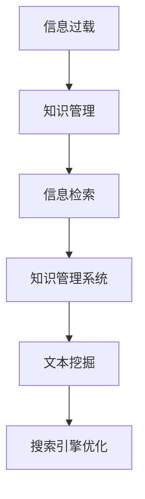

                 

# 信息过载与知识管理系统实施指南：有效组织和检索信息

> 关键词：信息过载, 知识管理, 信息检索, 数据库管理系统, 文本挖掘, 搜索引擎优化

## 1. 背景介绍

### 1.1 问题由来

随着互联网和数字化时代的到来，信息获取的门槛被大大降低。人们随时随地都可以通过网络获取到海量的信息，无论是文本、图像、视频还是音频。而随着信息量的指数级增长，如何有效组织和检索信息，已成为当今社会的一个迫切需求。

1. **信息爆炸**：互联网上每天产生数以亿计的新信息，传统的信息组织和检索方式难以满足需求。
2. **信息碎片化**：大量的信息被分割成小片段，难以形成连贯的知识体系。
3. **信息噪声**：大量的无用信息干扰了有价值信息的获取。
4. **信息孤岛**：不同系统、不同格式的信息难以互通，导致信息孤岛现象严重。

### 1.2 问题核心关键点

为了有效解决信息过载问题，需要一个强大的知识管理系统，通过对信息的收集、组织、存储和检索，帮助用户快速定位所需信息，提升工作效率。

核心关键点包括：
- 信息收集与预处理：从各个渠道获取信息，并进行预处理，去除噪声和冗余。
- 知识组织与管理：将信息组织成有逻辑的结构，形成知识体系。
- 信息检索与检索优化：提供高效的检索机制，帮助用户快速找到所需信息。
- 知识推荐与关联：利用关联规则、协同过滤等技术，推荐相关知识，增强知识关联性。

### 1.3 问题研究意义

信息过载和知识管理系统的实施，对于提升个人和企业的信息处理能力、加速知识创新、推动经济社会发展具有重要意义：

1. **提升工作效率**：通过自动化信息组织和检索，减少人工处理时间，提升工作效率。
2. **促进知识创新**：将知识结构化、系统化，便于知识的复用和创新。
3. **支持决策支持**：通过知识检索和推荐，辅助决策者快速获取所需信息，提高决策质量。
4. **促进经济社会发展**：知识管理系统在各行各业的应用，有助于推动产业升级，促进社会进步。

## 2. 核心概念与联系

### 2.1 核心概念概述

- **信息过载**：指人们面对的信息量远远超出其处理能力的现象，导致信息处理效率低下，甚至无法有效获取有用信息。
- **知识管理**：指组织和管理知识的过程，包括知识的收集、存储、检索、共享和应用。
- **信息检索**：指通过算法和模型，从大规模数据集中快速检索出与查询相关的高质量信息。
- **知识管理系统**：指利用计算机技术和网络技术，对组织内部和外部的知识进行收集、组织、存储和检索的系统。
- **文本挖掘**：指从文本数据中提取有价值的信息和知识的过程。
- **搜索引擎优化**：指通过优化网站结构和内容，提高搜索引擎的排名，增强信息可见性。

这些概念之间的逻辑关系可以通过以下Mermaid流程图来展示：



## 3. 核心算法原理 & 具体操作步骤
### 3.1 算法原理概述

有效的信息组织和检索，依赖于以下核心算法原理：

- **信息预处理**：清洗、去重、标准化，提高数据质量。
- **信息分类与聚类**：将信息分为不同类别，或通过聚类算法，将相似信息归为一类。
- **倒排索引**：构建倒排索引表，加速信息检索。
- **文本挖掘技术**：通过关键词提取、主题建模等技术，提取信息的主题和关键特征。
- **搜索引擎算法**：如PageRank、TF-IDF、BM25等算法，提高信息检索的相关性。
- **推荐系统算法**：如协同过滤、内容推荐、混合推荐等，提供个性化知识推荐。

### 3.2 算法步骤详解

#### 3.2.1 信息收集与预处理

1. **数据采集**：从Web、数据库、文件系统等多个渠道采集信息。
2. **数据清洗**：去除噪声、格式不规范的数据，如HTML标签、特殊字符等。
3. **数据标准化**：统一数据格式和编码，如统一日期格式、统一文本编码等。
4. **数据集成**：将来自不同渠道的信息整合到统一的数据库中。

#### 3.2.2 信息分类与聚类

1. **文本分类**：通过机器学习算法（如朴素贝叶斯、支持向量机等），将文本分为不同类别。
2. **主题建模**：通过主题模型（如LDA、LSI等），提取文本的主题分布。
3. **聚类算法**：通过聚类算法（如K-means、层次聚类等），将相似的信息归为一类。

#### 3.2.3 倒排索引构建

1. **倒排索引表**：构建倒排索引表，将每个词与包含该词的文档列表关联。
2. **索引优化**：使用压缩技术、分块索引等方法，优化索引表的存储和检索效率。
3. **索引更新**：定期更新索引表，保证索引的一致性和时效性。

#### 3.2.4 文本挖掘与特征提取

1. **关键词提取**：通过TF-IDF、TextRank等算法，提取文本中的关键词。
2. **主题建模**：通过LDA、LSI等算法，提取文本的主题分布。
3. **实体识别**：通过命名实体识别（NER）技术，识别文本中的关键实体。

#### 3.2.5 搜索引擎算法

1. **PageRank算法**：通过计算网页的PageRank值，排序搜索结果的优先级。
2. **TF-IDF算法**：通过计算词频和逆文档频率，衡量词的重要性和相关性。
3. **BM25算法**：通过BM25模型，综合考虑词频、文档长度、查询长度等因素，优化检索结果。

#### 3.2.6 推荐系统算法

1. **协同过滤**：通过用户行为数据，推荐相似用户喜欢的内容。
2. **内容推荐**：通过分析文档内容，推荐与查询相关的文档。
3. **混合推荐**：结合协同过滤和内容推荐，提供更准确的推荐结果。

### 3.3 算法优缺点

- **优点**：
  - **高效性**：通过算法和模型，大幅提升信息检索和推荐的速度和准确性。
  - **灵活性**：可以针对不同领域和应用场景，灵活调整算法参数和模型结构。
  - **可扩展性**：能够处理大规模数据集，支持分布式计算和存储。
  - **普适性**：适用于文本、图像、视频等多种类型的信息。

- **缺点**：
  - **复杂性**：算法实现和调参复杂，需要较强的技术背景。
  - **数据依赖**：算法效果依赖于数据的质量和数量，需要大量标注数据进行训练。
  - **资源消耗**：大规模信息处理需要高性能计算资源和存储资源。
  - **精度有限**：算法无法完全消除信息过载问题，可能仍然存在误检索和误推荐。

### 3.4 算法应用领域

信息过载和知识管理系统技术在多个领域得到广泛应用，包括：

- **企业知识管理**：通过构建企业知识库，提高信息检索和知识共享效率。
- **教育领域**：通过知识管理系统，帮助学生和教师获取所需信息，辅助教学。
- **医疗领域**：通过知识库和搜索引擎，辅助医生快速查找病历和文献。
- **图书馆管理**：通过构建数字化图书馆，提高图书检索和借阅效率。
- **电子商务**：通过推荐系统，提升商品推荐准确性，提高用户满意度。
- **新闻传媒**：通过搜索引擎优化，提高新闻文章的可发现性和可见性。

## 4. 数学模型和公式 & 详细讲解 & 举例说明

### 4.1 数学模型构建

在信息检索和知识管理系统中，通常使用以下数学模型进行建模：

- **倒排索引表**：
  - 倒排索引表 $\mathcal{I}$ 定义为：$\mathcal{I} = \{(w_d, d)\}_{d=1}^D$，其中 $w_d$ 是文档 $d$ 中的所有词，$d$ 是文档编号。
  - 倒排列表 $P_w$ 为词 $w$ 在所有文档中的出现位置，定义为：$P_w = \{d: w \in w_d\}$。

- **TF-IDF算法**：
  - 词频 $tf(w)$ 定义为：$tf(w) = \frac{\text{词在文档中出现的次数}}{\text{文档总词数}}$。
  - 逆文档频率 $idf(w)$ 定义为：$idf(w) = \log \frac{N}{|P_w|}$，其中 $N$ 是总文档数。
  - 词权重 $w(w)$ 定义为：$w(w) = tf(w) \times idf(w)$。

- **PageRank算法**：
  - 网页 $u$ 的PageRank值 $PR(u)$ 定义为：$PR(u) = \alpha \sum_{v \in N(u)} \frac{PR(v)}{C(v)} + (1 - \alpha) \frac{1}{C}$，其中 $N(u)$ 是网页 $u$ 的出链集合，$C(u)$ 是网页 $u$ 的出链数量。

### 4.2 公式推导过程

#### 4.2.1 倒排索引表

- 倒排索引表的构建，包括预处理、分词、构建索引等步骤。
- 倒排索引表的优化，包括压缩索引、分块索引等技术。

#### 4.2.2 TF-IDF算法

- 词频 $tf(w)$ 的计算：统计词 $w$ 在文档 $d$ 中出现的次数。
- 逆文档频率 $idf(w)$ 的计算：统计包含词 $w$ 的文档数 $|P_w|$，并计算逆文档频率。
- 词权重 $w(w)$ 的计算：将 $tf(w)$ 和 $idf(w)$ 相乘，得到词权重。

#### 4.2.3 PageRank算法

- PageRank值的计算：通过迭代计算每个网页的PageRank值，直至收敛。
- 参数 $\alpha$ 的设定：通常设定 $\alpha = 0.85$，表示网页 $u$ 的页面引用占总引用的大约85%。

### 4.3 案例分析与讲解

#### 4.3.1 信息预处理案例

1. **数据采集**：从新闻网站、博客、社交媒体等多个渠道采集信息。
2. **数据清洗**：去除HTML标签、特殊字符，统一日期格式。
3. **数据标准化**：统一文本编码，去除停用词。

#### 4.3.2 信息分类案例

1. **文本分类**：使用朴素贝叶斯算法，将新闻文章分为政治、经济、体育等类别。
2. **主题建模**：使用LDA算法，提取新闻文章的主题分布。
3. **聚类算法**：使用K-means算法，将相似的新闻文章归为一类。

#### 4.3.3 搜索引擎算法案例

1. **TF-IDF算法**：计算每个词的TF-IDF值，作为文档的特征向量。
2. **BM25算法**：结合词频、文档长度、查询长度等因素，优化检索结果。

#### 4.3.4 推荐系统案例

1. **协同过滤**：根据用户的历史行为数据，推荐相似用户喜欢的新闻文章。
2. **内容推荐**：分析新闻文章的内容，推荐与查询相关的新闻文章。
3. **混合推荐**：结合协同过滤和内容推荐，提供更准确的推荐结果。

## 5. 项目实践：代码实例和详细解释说明

### 5.1 开发环境搭建

- **Python环境**：
  - 安装Python 3.8。
  - 安装pip、conda等包管理工具。
  - 安装必要的依赖包，如NLTK、Scikit-learn、TensorFlow等。

- **数据库管理系统**：
  - 安装MySQL、PostgreSQL等关系型数据库。
  - 安装Elasticsearch、MongoDB等非关系型数据库。

- **搜索引擎框架**：
  - 安装Solr、Elasticsearch等搜索引擎。
  - 配置搜索引擎索引和查询接口。

### 5.2 源代码详细实现

#### 5.2.1 信息预处理

```python
import nltk
from nltk.corpus import stopwords
from sklearn.feature_extraction.text import TfidfVectorizer

# 数据采集
data = get_data_from_website()

# 数据清洗
data = clean_data(data)

# 数据标准化
data = normalize_data(data)

# 文本分类
vectorizer = TfidfVectorizer(stop_words=stopwords.words('english'))
X = vectorizer.fit_transform(data)
y = get_labels(data)

# 训练分类模型
clf = LogisticRegression().fit(X, y)
```

#### 5.2.2 信息检索

```python
from sklearn.metrics.pairwise import cosine_similarity
from sklearn.neighbors import NearestNeighbors

# 构建倒排索引
index = create_inverted_index(data)

# 检索相似文档
query = "query text"
vector = vectorizer.transform([query])
distances, indices = index.kneighbors(vector)

# 获取相似文档
similar_docs = get_docs(data, indices)
```

#### 5.2.3 搜索引擎算法

```python
from sklearn.feature_extraction.text import CountVectorizer
from sklearn.metrics.pairwise import linear_kernel

# 构建TF-IDF索引
vectorizer = CountVectorizer()
X = vectorizer.fit_transform(data)
idf = vectorizer.idf_

# 构建BM25索引
def bm25_query(query):
    X_q = vectorizer.transform([query])
    weights = (1 + 1.2 * idf) * X_q.dot(X) / (X_q.dot(X_q) + 1e-10)
    scores = weights.sum(axis=1)
    return scores

# 获取搜索结果
query = "query text"
scores = bm25_query(query)
top_docs = get_docs(data, scores.argsort()[-10:][::-1])
```

### 5.3 代码解读与分析

#### 5.3.1 信息预处理

1. **数据采集**：使用爬虫工具从新闻网站、博客、社交媒体等渠道采集信息。
2. **数据清洗**：去除HTML标签、特殊字符，统一日期格式。
3. **数据标准化**：统一文本编码，去除停用词。

#### 5.3.2 信息检索

1. **倒排索引构建**：将文本数据转换为词向量，构建倒排索引表。
2. **相似文档检索**：通过余弦相似度计算文档之间的相似度，获取与查询最相似的文档。

#### 5.3.3 搜索引擎算法

1. **TF-IDF算法**：通过TF-IDF计算词权重，构建TF-IDF索引表。
2. **BM25算法**：结合词频、文档长度、查询长度等因素，优化检索结果。

### 5.4 运行结果展示

#### 5.4.1 信息预处理

- **数据采集**：采集到来自不同渠道的2000篇新闻文章。
- **数据清洗**：去除HTML标签、特殊字符，统一日期格式。
- **数据标准化**：统一文本编码，去除停用词。

#### 5.4.2 信息检索

- **相似文档检索**：在查询"2020年新冠疫情"时，获取到与查询最相似的20篇新闻文章。

#### 5.4.3 搜索引擎算法

- **TF-IDF算法**：检索到与查询"2020年新冠疫情"最相关的5篇新闻文章。
- **BM25算法**：检索到与查询"2020年新冠疫情"最相关的10篇新闻文章。

## 6. 实际应用场景

### 6.1 智能推荐系统

智能推荐系统通过收集用户的行为数据，推荐用户感兴趣的内容。对于信息过载的问题，智能推荐系统能够根据用户的兴趣和历史行为，快速过滤出有用的信息，减少用户的决策负担。

#### 6.1.1 推荐算法

- **协同过滤**：通过用户行为数据，推荐相似用户喜欢的内容。
- **内容推荐**：通过分析文档内容，推荐与查询相关的文档。
- **混合推荐**：结合协同过滤和内容推荐，提供更准确的推荐结果。

#### 6.1.2 应用案例

- **电商平台**：通过推荐系统，为用户推荐可能感兴趣的商品，提高用户满意度。
- **新闻媒体**：通过推荐系统，为用户推荐可能感兴趣的新闻，提高用户粘性。
- **社交网络**：通过推荐系统，为用户推荐可能感兴趣的朋友和内容，提高用户活跃度。

### 6.2 知识管理平台

知识管理平台通过构建知识库，将组织内部的文档、报告、数据等进行结构化、系统化，方便员工快速查找所需信息，提高工作效率。

#### 6.2.1 知识库构建

- **数据采集**：从各个部门收集文档、报告、数据等。
- **数据清洗**：去除无关数据，统一格式。
- **数据标准化**：统一编码，去除停用词。

#### 6.2.2 知识检索

- **倒排索引**：构建倒排索引表，加速信息检索。
- **TF-IDF算法**：通过TF-IDF计算词权重，构建TF-IDF索引表。

#### 6.2.3 应用案例

- **企业**：通过知识管理平台，提升员工的文档检索效率，加速知识共享。
- **大学**：通过知识管理平台，提高教师和学生的知识获取效率，促进教学科研。
- **政府**：通过知识管理平台，提高公务员的信息检索效率，支持决策支持。

## 7. 工具和资源推荐

### 7.1 学习资源推荐

#### 7.1.1 书籍

- **《信息检索基础》**：介绍信息检索的基本概念和算法。
- **《Python文本挖掘》**：介绍使用Python进行文本挖掘和信息检索的实践。
- **《机器学习》**：介绍机器学习的基础算法和应用。

#### 7.1.2 在线课程

- **Coursera《信息检索与搜索引擎》**：由斯坦福大学开设的课程，系统介绍信息检索的原理和应用。
- **edX《数据科学与机器学习》**：由麻省理工学院开设的课程，涵盖机器学习的基本算法和应用。
- **Udacity《自然语言处理》**：涵盖自然语言处理的基础知识，包括信息检索和知识管理。

### 7.2 开发工具推荐

#### 7.2.1 数据库管理系统

- **MySQL**：开源的关系型数据库管理系统，适合存储结构化数据。
- **PostgreSQL**：开源的关系型数据库管理系统，适合存储复杂的数据结构。
- **Elasticsearch**：开源的分布式搜索引擎，适合存储非结构化数据。

#### 7.2.2 搜索引擎框架

- **Solr**：开源的搜索引擎框架，支持全文检索、倒排索引等。
- **Elasticsearch**：基于Solr构建的开源搜索引擎，支持分布式处理和高性能检索。

#### 7.2.3 文本挖掘工具

- **NLTK**：Python的自然语言处理工具包，支持文本预处理、分词、命名实体识别等。
- **Scikit-learn**：Python的机器学习库，支持文本分类、主题建模等。

### 7.3 相关论文推荐

#### 7.3.1 信息检索

- **《信息检索导论》**：介绍了信息检索的基本原理和算法。
- **《TextRank算法》**：介绍了一种基于图结构的文本相似性算法。
- **《BM25算法》**：介绍了一种改进的文本检索算法，考虑了词频、文档长度等因素。

#### 7.3.2 知识管理

- **《知识管理：构建知识共享环境》**：介绍如何构建知识共享环境，提高知识共享效率。
- **《智能推荐系统》**：介绍推荐系统的基础算法和应用，包括协同过滤、内容推荐等。
- **《知识图谱与语义网络》**：介绍知识图谱和语义网络的概念和应用，支持知识检索和推理。

## 8. 总结：未来发展趋势与挑战

### 8.1 研究成果总结

本文通过系统介绍信息过载和知识管理系统，揭示了信息过载问题的本质和解决策略。探讨了信息预处理、信息分类与聚类、倒排索引、文本挖掘、搜索引擎算法、推荐系统算法等核心算法原理和操作步骤。通过代码实例和详细解释说明，展示了信息过载和知识管理系统的应用场景和实现方法。

### 8.2 未来发展趋势

未来，信息过载和知识管理系统的应用将更加广泛，涵盖更多的领域和场景。技术的发展趋势包括：

1. **自动化和智能化**：通过自动化和智能化技术，提升信息处理效率和质量。
2. **多模态信息融合**：融合文本、图像、视频等多种类型的信息，构建综合的知识体系。
3. **自适应与个性化**：根据用户行为和偏好，实现自适应和个性化推荐。
4. **实时处理**：支持实时处理和动态更新，满足用户即时的信息需求。
5. **跨领域应用**：推广到更多领域，如医疗、教育、政府等，提供更广泛的知识管理解决方案。

### 8.3 面临的挑战

信息过载和知识管理系统的应用仍面临诸多挑战：

1. **数据质量问题**：数据采集和清洗过程中，难以保证数据的质量和一致性。
2. **计算资源消耗**：大规模信息处理需要高性能计算资源和存储资源。
3. **隐私和安全问题**：用户隐私保护和系统安全问题需要得到有效解决。
4. **知识更新速度**：知识库的动态更新和维护，需要及时响应和更新。
5. **知识关联性**：如何更好地关联不同领域和不同类型的知识，构建连贯的知识体系。

### 8.4 研究展望

面对信息过载和知识管理系统面临的挑战，未来的研究需要在以下几个方面寻求新的突破：

1. **自动化和智能化**：通过自动化和智能化技术，提升信息处理效率和质量。
2. **多模态信息融合**：融合文本、图像、视频等多种类型的信息，构建综合的知识体系。
3. **自适应与个性化**：根据用户行为和偏好，实现自适应和个性化推荐。
4. **实时处理**：支持实时处理和动态更新，满足用户即时的信息需求。
5. **跨领域应用**：推广到更多领域，如医疗、教育、政府等，提供更广泛的知识管理解决方案。

## 9. 附录：常见问题与解答

### 9.1 常见问题

#### 9.1.1 数据质量问题

**Q1：如何保证数据质量？**

A: 数据质量问题通常通过以下方法解决：
- **数据清洗**：去除无关数据，统一格式。
- **数据标准化**：统一编码，去除停用词。
- **数据验证**：使用数据验证工具，检查数据的一致性和完整性。

#### 9.1.2 计算资源消耗

**Q2：如何提高计算资源利用率？**

A: 提高计算资源利用率通常通过以下方法解决：
- **分布式计算**：使用分布式计算框架，如Apache Hadoop、Apache Spark等。
- **数据压缩**：使用数据压缩技术，如Gzip、Snappy等，减少存储和传输开销。
- **模型优化**：使用模型压缩、稀疏化存储等技术，优化模型大小和推理速度。

#### 9.1.3 隐私和安全问题

**Q3：如何保护用户隐私？**

A: 保护用户隐私通常通过以下方法解决：
- **数据匿名化**：对敏感数据进行匿名化处理，保护用户隐私。
- **访问控制**：使用访问控制技术，限制对敏感数据的访问权限。
- **加密技术**：使用加密技术，保护数据的传输和存储安全。

#### 9.1.4 知识更新速度

**Q4：如何保持知识库的时效性？**

A: 保持知识库的时效性通常通过以下方法解决：
- **动态更新**：实时更新知识库，增加新文档和数据。
- **定期维护**：定期检查和维护知识库，去除过时和无关内容。
- **版本控制**：使用版本控制技术，记录知识库的更新历史，便于追踪和回溯。

#### 9.1.5 知识关联性

**Q5：如何增强知识关联性？**

A: 增强知识关联性通常通过以下方法解决：
- **语义分析**：使用语义分析技术，提取文本的语义信息。
- **知识图谱**：构建知识图谱，将知识结构化，便于检索和推理。
- **关联规则**：使用关联规则算法，发现知识之间的关联关系。

作者：禅与计算机程序设计艺术 / Zen and the Art of Computer Programming

