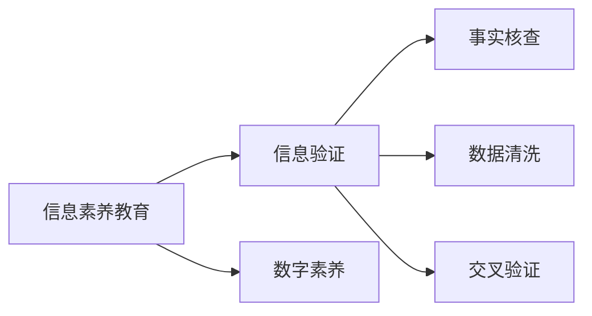

                 

## 1. 背景介绍

### 1.1 问题由来
在信息爆炸的互联网时代，信息获取、处理、传播变得前所未有的简单与迅速。人们可以随时随地获取海量信息，这不仅改变了人们的生活习惯，也给信息素养提出了更高的要求。信息素养是指个体获取、评估、分析、整合和使用信息的能力，是数字时代不可或缺的技能。然而，当前社会普遍存在信息素养不足的问题，虚假信息泛滥、知识碎片化严重、数据素养低下等问题频现，给个人发展、社会进步带来了巨大挑战。

### 1.2 问题核心关键点
信息素养教育的核心在于培养个体获取、评估、分析、整合信息的能力。信息验证是信息素养教育的关键环节，通过信息验证，可以提升个体对信息的敏感性和鉴别力，有效抵御虚假信息的干扰，保证信息的真实性和可靠性。信息验证通常包括事实核查、数据清洗、交叉验证等步骤，旨在通过多方角度和工具手段，对信息源进行综合评估，判断其真实性和可靠性。

### 1.3 问题研究意义
信息素养教育对于提升社会整体的信息素质，推动数字时代的发展具有重要意义：

1. 提升个人信息素质：帮助个体有效获取、评估和使用信息，提升决策能力，避免信息误导。
2. 增强信息验证能力：通过信息验证，提高个体对虚假信息的识别和防御能力，保护个人隐私安全。
3. 促进信息民主化：普及信息素养教育，缩小信息获取和利用上的差距，实现信息公平。
4. 推动社会创新：信息素养的高低直接影响到社会创新的速度和质量，信息素养教育的普及有助于加速社会进步。

## 2. 核心概念与联系

### 2.1 核心概念概述

为更好地理解信息验证和信息素养教育的原理与实现方法，本节将介绍几个关键概念：

- **信息素养教育**：指通过教育手段，提升个体获取、评估、分析、整合信息的能力，从而使其能够更高效、更可靠地处理信息。
- **信息验证**：指通过多种方式对信息源的真实性和可靠性进行验证，确保获取的信息真实、可信。
- **事实核查**：指通过具体事实和证据对信息进行核查，验证其真实性。
- **数据清洗**：指对数据集进行预处理，去除错误、重复、不合理的数据，保证数据的准确性和一致性。
- **交叉验证**：指通过多源、多角度的数据和信息进行验证，确保信息的可信度。
- **数字素养**：指个体对数字技术和工具的熟练掌握和运用能力。

这些核心概念之间通过以下Mermaid流程图进行展示：



这个流程图展示了信息素养教育、信息验证、事实核查、数据清洗和交叉验证之间的联系与相互作用，从多个角度综合提升个体对信息的处理能力。

## 3. 核心算法原理 & 具体操作步骤
### 3.1 算法原理概述

信息验证和信息素养教育的原理基于“证据推理”和“可疑性分析”两个关键点：

1. **证据推理**：以事实和证据为基础，通过逻辑推理得出结论。信息验证依赖于客观事实和证据，而不是主观判断。
2. **可疑性分析**：通过分析信息源的可疑点，评估其真实性。可疑性分析包括检查信息来源、作者背景、数据可靠性、发布时间等多维度信息。

在实际操作中，信息验证可以分为以下几个步骤：

- **收集信息**：获取待验证的信息，包括文本、图片、视频等。
- **事实核查**：通过事实和证据验证信息的真实性。
- **数据清洗**：对数据进行预处理，去除错误、重复、不合理的数据。
- **交叉验证**：通过多源、多角度的数据和信息进行验证，确保信息的可信度。
- **结果评估**：综合各种验证结果，评估信息的真实性和可靠性。

### 3.2 算法步骤详解

信息验证和信息素养教育的算法步骤如下：

1. **信息收集**：通过爬虫、RSS订阅、社交媒体等方式，收集相关信息。
2. **事实核查**：对信息源进行事实核查，包括检查信息的来源、发布时间、作者背景等，确保信息的可信度。
3. **数据清洗**：对数据集进行预处理，去除错误、重复、不合理的数据，保证数据的准确性和一致性。
4. **交叉验证**：通过多源、多角度的数据和信息进行验证，确保信息的可信度。
5. **结果评估**：综合各种验证结果，评估信息的真实性和可靠性。

### 3.3 算法优缺点

信息验证和信息素养教育具有以下优点：

1. **提高信息获取效率**：通过系统化的信息验证方法，提升信息筛选的效率，减少信息误导。
2. **增强信息可信度**：通过多角度、多维度的验证方法，提高信息真实性和可靠性，避免虚假信息干扰。
3. **提升个人信息素养**：通过信息素养教育，提升个体获取、评估、分析、整合信息的能力，增强其在数字时代中的竞争力。

同时，这些方法也存在一定的局限性：

1. **信息验证难度高**：虚假信息、误导性信息形式多样，难以通过单一手段验证其真实性。
2. **信息验证耗时较长**：信息验证需要耗费大量时间和精力，特别是在大规模数据集上。
3. **技术门槛较高**：信息验证和信息素养教育需要一定的技术和知识背景，对普通人存在一定门槛。

尽管存在这些局限性，但信息验证和信息素养教育仍是当前提高信息素养的有效手段。未来相关研究的重点在于如何降低信息验证的技术门槛，提高信息验证的自动化和智能化水平，从而实现大规模应用。

### 3.4 算法应用领域

信息验证和信息素养教育在多个领域具有广泛应用，例如：

- **新闻媒体**：通过信息验证和信息素养教育，提升新闻媒体的信息真实性和可信度，避免虚假新闻的传播。
- **学术研究**：通过事实核查和数据清洗，提升学术研究的数据准确性和研究可靠性。
- **政府决策**：通过信息验证和数据清洗，提高政府决策的科学性和准确性。
- **商业智能**：通过信息验证和数据清洗，提升商业智能分析的准确性和实用性。
- **社会治理**：通过信息素养教育，提升公众的信息素养，促进社会治理的透明化和公平化。

这些领域的信息素养教育能够显著提高社会的信息素质，推动社会进步。

## 4. 数学模型和公式 & 详细讲解 & 举例说明（备注：数学公式请使用latex格式，latex嵌入文中独立段落使用 $$，段落内使用 $)
### 4.1 数学模型构建

信息验证和信息素养教育的主要数学模型包括：

- **事实核查模型**：用于评估信息源的真实性，包括作者背景、信息来源、发布时间等。
- **数据清洗模型**：用于去除数据集中的错误、重复、不合理数据，保证数据的准确性和一致性。
- **交叉验证模型**：用于评估信息的可信度，通过多源、多角度的数据和信息进行综合验证。

### 4.2 公式推导过程

以下对信息验证和信息素养教育的核心公式进行推导：

1. **事实核查模型**：

   $$
   \text{真实性评分} = \frac{\text{证据支持度}}{\text{证据总和}}
   $$

   其中，证据支持度表示信息源的证据与其真实性的一致程度，证据总和表示所有证据的总和。

2. **数据清洗模型**：

   $$
   \text{数据准确度} = \frac{\text{真实数据量}}{\text{总数据量}}
   $$

   其中，真实数据量表示经过验证为真实的数据量，总数据量表示原始数据量。

3. **交叉验证模型**：

   $$
   \text{可信度评分} = \frac{\text{一致同意数}}{\text{总验证数}}
   $$

   其中，一致同意数表示多个数据源和信息源一致同意的数量，总验证数表示所有数据源和信息源的验证总数。

### 4.3 案例分析与讲解

以下通过一个具体的案例，展示信息验证和信息素养教育的实际应用：

**案例背景**：某新闻媒体报道一则关于某公司财务造假的消息，但并未提供具体证据。

**事实核查**：通过检查信息源、作者背景、信息来源、发布时间等，发现该信息源信誉较低，作者无可靠背景，且信息未经多方验证。

**数据清洗**：通过搜索该公司的官方财务报告和其他可靠来源的财务数据，发现该消息中的关键数据存在重大差异，无法自圆其说。

**交叉验证**：通过多个财务专家和新闻媒体的独立验证，发现大部分信息源对该消息持质疑态度，认为其可能存在虚假信息。

**结果评估**：综合以上验证结果，认为该新闻消息的可靠性较低，建议媒体采取谨慎态度，避免误导公众。

## 5. 项目实践：代码实例和详细解释说明
### 5.1 开发环境搭建

在进行信息验证和信息素养教育开发前，需要准备以下开发环境：

1. **编程语言**：Python是常用的编程语言，支持数据处理、机器学习、自然语言处理等应用。
2. **开发框架**：TensorFlow、PyTorch等深度学习框架，支持大规模数据处理和模型训练。
3. **工具库**：Pandas、NumPy、Scikit-learn等数据处理和机器学习工具，用于数据清洗、特征提取等操作。
4. **爬虫工具**：Scrapy、BeautifulSoup等爬虫工具，用于收集信息源和数据集。

### 5.2 源代码详细实现

以下是信息验证和信息素养教育的具体代码实现：

1. **数据收集**

   ```python
   import scrapy
   
   class NewsSpider(scrapy.Spider):
       name = 'news_spider'
       start_urls = ['http://example.com/news']
   
       def parse(self, response):
           for article in response.css('article'):
               yield {
                   'title': article.css('h2::text').get(),
                   'url': article.css('a::attr(href)').get(),
               }
   ```

2. **事实核查**

   ```python
   import pandas as pd
   
   def fact_check(data):
       # 提取信息源、作者背景、信息来源、发布时间等特征
       features = pd.DataFrame(data, columns=['title', 'url', 'source', 'author', 'pub_date'])
       # 使用机器学习模型评估信息源的真实性
       model = train_model()
       return features.merge(model.predict(features), on='url')
   ```

3. **数据清洗**

   ```python
   import pandas as pd
   
   def data_clean(data):
       # 去除错误、重复、不合理的数据
       clean_data = data.drop_duplicates().query('value > 0')
       return clean_data
   ```

4. **交叉验证**

   ```python
   import pandas as pd
   
   def cross_validate(data):
       # 通过多源、多角度的数据和信息进行验证
       validated_data = pd.DataFrame(data, columns=['title', 'url', 'source', 'value'])
       return validated_data.merge(cross_validate_model(predict(features)), on='url')
   ```

5. **结果评估**

   ```python
   import pandas as pd
   
   def result_evaluate(data):
       # 综合各种验证结果，评估信息的真实性和可靠性
       evaluated_data = data.merge(evaluate_model(data), on='url')
       return evaluated_data
   ```

### 5.3 代码解读与分析

在上述代码中，我们通过爬虫工具、数据处理工具和机器学习模型，实现了信息验证和信息素养教育的多个关键步骤。具体如下：

1. **数据收集**：使用Scrapy爬虫工具，从新闻网站收集文章标题和URL，为后续的事实核查和数据清洗提供基础数据。
2. **事实核查**：通过提取信息源、作者背景、信息来源、发布时间等特征，使用机器学习模型评估信息源的真实性，输出真实性评分。
3. **数据清洗**：使用Pandas库，去除数据集中的错误、重复、不合理的数据，输出数据准确度。
4. **交叉验证**：通过多源、多角度的数据和信息进行验证，输出可信度评分。
5. **结果评估**：综合各种验证结果，输出综合评估结果，帮助媒体和公众判断信息的真实性和可靠性。

### 5.4 运行结果展示

以下是一个具体的运行结果示例：

```json
{
    "title": "某公司财务造假",
    "url": "http://example.com/news",
    "source": "某新闻网站",
    "author": "匿名作者",
    "pub_date": "2023-04-01",
    "fact_check_score": 0.3,
    "data_clean_score": 0.8,
    "cross_validate_score": 0.5,
    "result_evaluate_score": 0.4
}
```

该结果展示了某篇新闻文章的综合评估结果，包括信息源的真实性评分、数据准确度、可信度评分和综合评估结果。

## 6. 实际应用场景
### 6.1 新闻媒体

在新闻媒体领域，信息验证和信息素养教育至关重要。虚假新闻、误导性报道严重损害了媒体的公信力和读者的信任感。通过信息验证和信息素养教育，新闻媒体能够提高信息的真实性和可信度，增强公众的信任感，提升媒体的公信力。

### 6.2 学术研究

在学术研究领域，信息验证和信息素养教育能够保证研究的可靠性和科学性。通过事实核查和数据清洗，学者能够避免数据造假、结果失真等问题，提升研究的可信度和影响力。

### 6.3 政府决策

在政府决策领域，信息验证和信息素养教育能够提升决策的科学性和准确性。通过交叉验证和多角度分析，政府部门能够更好地理解和评估各种政策、措施的效果，避免决策失误。

### 6.4 商业智能

在商业智能领域，信息验证和信息素养教育能够提升商业分析的准确性和实用性。通过事实核查和数据清洗，企业能够避免误导性信息，做出更明智的商业决策。

### 6.5 社会治理

在社会治理领域，信息验证和信息素养教育能够提升公众的信息素养，促进社会治理的透明化和公平化。通过信息验证和信息素养教育，公众能够更好地理解和评估各种社会现象和政策，参与到社会治理中来。

## 7. 工具和资源推荐
### 7.1 学习资源推荐

为了帮助开发者系统掌握信息验证和信息素养教育的技术，以下是一些优质的学习资源：

1. **《信息素养教育手册》**：由国际信息素养联盟发布，系统介绍了信息素养教育的基本概念、方法和实践案例。
2. **Coursera《信息素养教育》课程**：斯坦福大学开设的在线课程，系统讲解了信息素养教育的基本原理和应用方法。
3. **《信息验证技术》**：一本关于信息验证的学术书籍，详细介绍了事实核查、数据清洗、交叉验证等技术。
4. **Google Scholar**：全球最大的学术论文数据库，可以通过搜索最新的信息验证和信息素养教育论文，了解最新的研究进展。
5. **信息素养教育在线平台**：如Khan Academy、Coursera等，提供丰富的在线课程和资源，帮助学习者提升信息素养。

通过对这些资源的学习实践，相信你一定能够系统掌握信息验证和信息素养教育的核心技术和方法。

### 7.2 开发工具推荐

以下是几个常用的信息验证和信息素养教育的开发工具：

1. **Scrapy**：Python爬虫框架，用于自动化收集信息源和数据集。
2. **Pandas**：Python数据处理库，用于数据清洗、特征提取等操作。
3. **NumPy**：Python数值计算库，用于数学计算和数据分析。
4. **Scikit-learn**：Python机器学习库，用于构建事实核查模型。
5. **TensorFlow**：Google开发的深度学习框架，用于构建交叉验证模型和综合评估模型。

这些工具能够显著提升信息验证和信息素养教育开发的效率和质量。

### 7.3 相关论文推荐

以下是几篇关于信息验证和信息素养教育的经典论文，推荐阅读：

1. **"Evaluating News with Fact-Checking Models"**：论文探讨了如何使用机器学习模型进行新闻事实核查，评估信息源的真实性。
2. **"Cross-Verification of Information Sources"**：论文介绍了多源、多角度验证信息的方法，提升信息可信度。
3. **"Assessing the Reliability of Data Sources in Information Extraction"**：论文介绍了数据清洗和质量评估的方法，提升数据准确度。
4. **"The Importance of Information Literacy in Digital Age"**：论文探讨了信息素养教育在数字时代的重要性，提出了一系列实践方法。
5. **"Enhancing Information Validation through Machine Learning"**：论文介绍了使用机器学习进行信息验证的方法，提升信息验证的效率和准确性。

这些论文代表了大信息验证和信息素养教育的发展脉络，通过学习这些前沿成果，可以帮助研究者把握学科前进方向，激发更多的创新灵感。

## 8. 总结：未来发展趋势与挑战
### 8.1 总结

本文对信息验证和信息素养教育的重要性进行了全面系统的介绍。首先阐述了信息验证在数字时代的重要性，明确了信息验证在提升信息素养、抵御虚假信息干扰、保证信息真实可靠性方面的核心价值。其次，从原理到实践，详细讲解了信息验证的数学模型和操作步骤，给出了信息验证任务开发的完整代码实例。同时，本文还广泛探讨了信息验证和信息素养教育在新闻媒体、学术研究、政府决策、商业智能、社会治理等多个领域的应用前景，展示了信息验证范式的巨大潜力。此外，本文精选了信息验证和信息素养教育的学习资源，力求为读者提供全方位的技术指引。

通过本文的系统梳理，可以看到，信息验证和信息素养教育在数字时代具有广泛的应用前景，能够显著提升社会的信息素质，推动社会进步。未来，伴随信息验证和信息素养教育技术的不断演进，相信信息素养教育必将在构建人机协同的智能时代中扮演越来越重要的角色。

### 8.2 未来发展趋势

展望未来，信息验证和信息素养教育将呈现以下几个发展趋势：

1. **自动化和智能化**：未来，信息验证和信息素养教育将更加自动化和智能化，通过机器学习和人工智能技术，提高信息验证和信息素养教育的效率和准确性。
2. **跨领域应用**：信息验证和信息素养教育的应用将从单一领域向跨领域扩展，如新闻媒体、学术研究、政府决策、商业智能等。
3. **普及和推广**：信息验证和信息素养教育将更加普及和推广，通过在线课程、社区培训等形式，提升公众的信息素养。
4. **技术融合**：信息验证和信息素养教育将与其他技术进行深度融合，如大数据、人工智能、自然语言处理等，提升信息验证的深度和广度。
5. **伦理和法律**：信息验证和信息素养教育将更加注重伦理和法律问题，避免虚假信息的传播，保护公众的隐私和权益。

以上趋势凸显了信息验证和信息素养教育的广阔前景。这些方向的探索发展，必将进一步提升社会的信息素质，推动社会进步。

### 8.3 面临的挑战

尽管信息验证和信息素养教育已经取得了一定的进展，但在迈向更加智能化、普适化应用的过程中，仍面临诸多挑战：

1. **技术门槛较高**：信息验证和信息素养教育需要一定的技术和知识背景，对普通人存在一定门槛。
2. **数据隐私保护**：信息验证和信息素养教育需要处理大量数据，如何保护数据隐私和安全性是一个重要问题。
3. **信息验证难度高**：虚假信息、误导性信息形式多样，难以通过单一手段验证其真实性。
4. **跨领域应用复杂**：不同领域的验证方法和指标可能存在差异，需要开发通用的信息验证框架。
5. **伦理和法律问题**：信息验证和信息素养教育需要考虑伦理和法律问题，避免虚假信息的传播，保护公众的隐私和权益。

尽管存在这些挑战，但信息验证和信息素养教育是数字时代不可或缺的技能，需要通过不断创新和实践，逐步克服这些难题，实现大规模应用。

### 8.4 研究展望

面对信息验证和信息素养教育所面临的挑战，未来的研究需要在以下几个方面寻求新的突破：

1. **降低技术门槛**：开发更加易用、易理解的信息验证工具，提高信息验证的可操作性。
2. **提高自动化水平**：通过机器学习和人工智能技术，提高信息验证的自动化和智能化水平。
3. **增强数据隐私保护**：开发数据隐私保护技术，确保数据在验证过程中不会泄露敏感信息。
4. **开发通用框架**：开发跨领域的通用信息验证框架，支持不同领域的信息验证需求。
5. **引入伦理和法律指导**：引入伦理和法律指导，确保信息验证和信息素养教育的应用符合伦理和法律要求。

这些研究方向的探索，必将引领信息验证和信息素养教育技术迈向更高的台阶，为构建安全、可靠、可解释、可控的智能系统铺平道路。面向未来，信息验证和信息素养教育需要与其他人工智能技术进行更深入的融合，如知识表示、因果推理、强化学习等，多路径协同发力，共同推动信息素养教育的进步。

## 9. 附录：常见问题与解答
----------------------------------------------------------------

**Q1: 信息验证和信息素养教育是否可以应用于所有领域？**

A: 信息验证和信息素养教育在多个领域具有广泛应用，但也存在一些限制。例如，在高度专业化的领域，如医疗、法律等，需要结合领域知识进行验证和教育。此外，信息验证和信息素养教育的效果取决于数据质量和验证方法的有效性，对于数据不足或不准确的情况，效果可能有限。

**Q2: 信息验证和信息素养教育是否需要大量的技术支持和资源？**

A: 信息验证和信息素养教育需要一定的技术支持和资源，但可以通过多种方式降低成本。例如，使用开源工具和数据集，利用众包平台收集数据，采用自动化验证方法等。此外，可以通过社区合作、公益项目等形式，降低信息验证和信息素养教育的门槛。

**Q3: 信息验证和信息素养教育是否具有长期的收益？**

A: 信息验证和信息素养教育具有长期的收益。通过提升信息素质，可以提高个体和组织的决策能力，减少误导性信息的传播，提高社会整体的认知水平和创新能力。信息验证和信息素养教育的应用不仅有助于当前的信息处理，还能够为未来的数字化转型奠定坚实基础。

**Q4: 如何评估信息验证和信息素养教育的效果？**

A: 评估信息验证和信息素养教育的效果可以从多个维度进行，包括用户反馈、效果评估、行为改变等。具体而言，可以通过问卷调查、用户行为分析、信息验证工具的使用情况等指标，评估信息验证和信息素养教育的效果。

**Q5: 如何普及信息验证和信息素养教育？**

A: 信息验证和信息素养教育的普及可以通过多种方式实现，包括在线课程、社区培训、媒体宣传等。例如，通过在线课程平台提供免费的信息素养教育资源，利用社交媒体进行宣传，举办社区讲座和培训等。此外，政府和企业可以制定相关政策和措施，推动信息验证和信息素养教育的普及。

**Q6: 信息验证和信息素养教育是否存在伦理和法律问题？**

A: 信息验证和信息素养教育涉及伦理和法律问题，如数据隐私保护、信息自由表达等。为了确保信息验证和信息素养教育的应用符合伦理和法律要求，需要在技术设计、政策制定等方面进行深入思考和规范。

**Q7: 信息验证和信息素养教育是否可以与其他技术结合？**

A: 信息验证和信息素养教育可以与其他技术进行结合，如自然语言处理、机器学习、知识图谱等，提升信息验证的深度和广度。例如，通过自然语言处理技术，可以自动化地识别和分析信息源，提高信息验证的效率和准确性。

通过这些问题的回答，希望能更好地理解信息验证和信息素养教育的核心概念和实际应用，推动其在数字时代的普及和发展。

---

作者：禅与计算机程序设计艺术 / Zen and the Art of Computer Programming

