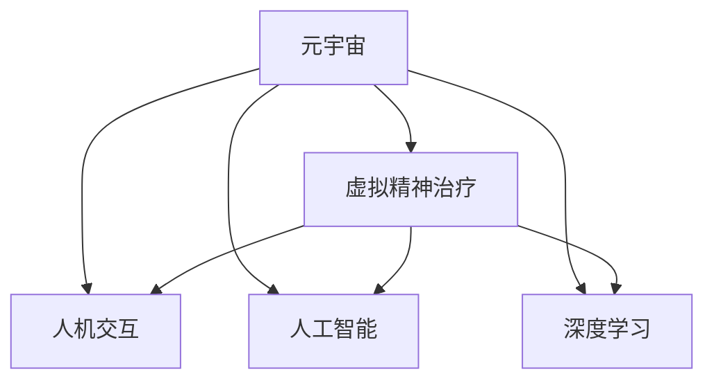
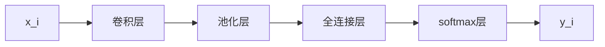

                 

# 元宇宙精神治疗:虚拟 worlds 的精神治疗技术

> 关键词：元宇宙,精神治疗,虚拟世界,心理健康,人机交互,人工智能,深度学习

## 1. 背景介绍

### 1.1 问题由来

近年来，随着技术的迅猛发展，元宇宙（Metaverse）的概念逐渐兴起。它是一个虚拟的、共存的世界，用户可以通过虚拟现实（VR）和增强现实（AR）等技术，在虚拟空间中进行互动和交流。然而，尽管元宇宙提供了许多新奇体验，但它同样也带来了新的挑战，尤其是对用户心理健康的影响。

### 1.2 问题核心关键点

在元宇宙中，用户长时间沉浸于虚拟空间，可能导致孤独感、社交焦虑、情绪波动等问题。传统的精神治疗方式在虚拟世界中难以直接应用，因此，开发适合元宇宙环境的虚拟精神治疗技术变得尤为重要。这种技术能够帮助用户在不离开虚拟世界的前提下，通过虚拟环境和AI工具得到有效的心理健康支持。

### 1.3 问题研究意义

开发元宇宙精神治疗技术，对于提升元宇宙用户的心理健康，促进元宇宙的可持续发展，以及探索精神治疗的新模式，具有重要意义：

1. **改善用户体验**：提供高质量的心理健康服务，减轻用户的心理压力，提升用户体验。
2. **拓宽应用场景**：在元宇宙这一新兴领域中，开发虚拟精神治疗技术，可以推动心理健康服务的发展和普及。
3. **技术创新**：结合虚拟现实、人机交互和人工智能技术，开发新的精神治疗方法和工具。
4. **增强可达性**：在偏远地区或资源匮乏的地方，虚拟精神治疗可以提供更广泛的心理健康支持。

## 2. 核心概念与联系

### 2.1 核心概念概述

为更好地理解元宇宙中的虚拟精神治疗技术，本节将介绍几个密切相关的核心概念：

- **元宇宙（Metaverse）**：一个虚拟的、共存的世界，用户可以通过VR和AR技术在其中进行互动和交流。
- **虚拟精神治疗（Virtual Psychotherapy）**：一种利用虚拟环境和AI工具进行心理健康支持的方法，旨在提供与现实世界相媲美的精神治疗效果。
- **人机交互（Human-Computer Interaction, HCI）**：研究如何通过计算机技术实现人与机器的互动，是虚拟精神治疗技术的基础。
- **人工智能（Artificial Intelligence, AI）**：利用机器学习、深度学习等技术，开发智能算法和模型，帮助用户进行心理健康管理。
- **深度学习（Deep Learning, DL）**：一种基于神经网络的机器学习方法，可以用于构建复杂、高效的虚拟精神治疗模型。

这些核心概念之间的逻辑关系可以通过以下Mermaid流程图来展示：



这个流程图展示了大语言模型的核心概念及其之间的关系：

1. 元宇宙通过VR和AR技术提供虚拟环境，为人机交互和人工智能的运用提供了基础。
2. 虚拟精神治疗利用人机交互和人工智能技术，构建虚拟心理支持系统。
3. 深度学习作为AI的核心技术之一，在虚拟精神治疗中用于构建复杂的算法模型。

这些概念共同构成了元宇宙精神治疗的技术框架，使得用户能够在虚拟世界中得到有效的心理健康支持。

## 3. 核心算法原理 & 具体操作步骤
### 3.1 算法原理概述

元宇宙精神治疗技术基于虚拟现实（VR）和增强现实（AR）环境，通过人机交互和人工智能技术，实现对用户心理健康的监测和支持。其核心算法包括深度学习、自然语言处理（NLP）、情绪识别等。

深度学习用于构建用户心理健康模型，通过分析用户的生理数据、行为数据和文本数据，预测用户的心理健康状况。NLP用于理解用户的语言输入，提取情绪和心理健康相关的信息。情绪识别技术通过分析用户的语音、面部表情和行为模式，识别用户的情绪状态，从而提供针对性的心理支持。

### 3.2 算法步骤详解

元宇宙精神治疗技术的实现步骤主要包括：

1. **数据收集**：收集用户在虚拟世界中的生理数据（如心率、脑电波等）、行为数据（如点击、滑动等操作）和文本数据（如聊天记录、日志等）。

2. **数据预处理**：对收集到的数据进行清洗、归一化和特征提取，以便于后续模型训练和分析。

3. **模型构建**：构建深度学习模型，利用生理和行为数据预测用户的情绪和心理健康状态，并利用NLP技术提取和分析用户的文本输入。

4. **情绪识别**：使用深度学习模型和情绪识别技术，分析用户的语音、面部表情和行为模式，识别用户的情绪状态。

5. **心理健康反馈**：根据情绪识别结果，提供个性化的心理健康反馈，如情绪引导、心理健康建议和虚拟心理治疗。

6. **用户反馈**：收集用户对心理健康反馈的反馈信息，不断优化模型和算法，提升用户体验。

7. **持续优化**：定期更新模型和算法，适应用户心理健康状态的变化，以及虚拟环境的变化。

### 3.3 算法优缺点

元宇宙精神治疗技术具有以下优点：

1. **灵活性高**：虚拟环境可以根据用户的需要和偏好进行定制，提供个性化的心理健康支持。
2. **沉浸式体验**：用户可以在虚拟世界中自然地进行心理健康互动，无需离开现实生活环境。
3. **可扩展性强**：随着技术的发展和用户需求的增加，元宇宙精神治疗技术可以不断扩展和优化。

然而，该技术也存在以下缺点：

1. **隐私保护问题**：用户在虚拟世界中的数据可能被滥用或泄露，需要严格的隐私保护措施。
2. **技术依赖性高**：对VR和AR设备的依赖性较高，设备成本和维护成本较大。
3. **社会交互限制**：虚拟环境中的社会交互可能不如现实世界中的互动真实，影响用户的社会化进程。

### 3.4 算法应用领域

元宇宙精神治疗技术可以应用于多个领域，例如：

- **教育领域**：在虚拟课堂中，结合元宇宙精神治疗技术，为学生提供心理健康支持，帮助其缓解学习压力。
- **医疗领域**：在医院环境中，利用虚拟现实技术，为患者提供心理治疗和康复支持。
- **企业应用**：在企业培训和团队协作中，结合元宇宙精神治疗技术，提升员工的心理健康水平和团队凝聚力。
- **心理健康咨询**：在心理诊所中，利用虚拟现实和人工智能技术，为患者提供心理健康咨询和治疗。

## 4. 数学模型和公式 & 详细讲解  
### 4.1 数学模型构建

本节将使用数学语言对元宇宙精神治疗技术进行更加严格的刻画。

假设用户在虚拟世界中的行为数据为 $\{x_i\}_{i=1}^N$，其中 $x_i$ 包括用户的点击、滑动、语音等操作数据。用户情绪数据为 $y_i \in \{1, -1\}$，其中 $1$ 表示正面情绪，$-1$ 表示负面情绪。

定义深度学习模型 $M_{\theta}$，其中 $\theta$ 为模型参数，用于预测用户情绪 $y_i$。模型采用卷积神经网络（CNN）或循环神经网络（RNN）结构。在模型训练中，我们采用交叉熵损失函数 $L_{CE}$，目标是最小化损失函数：

$$
\mathcal{L}(\theta) = \frac{1}{N} \sum_{i=1}^N L_{CE}(y_i, M_{\theta}(x_i))
$$

其中 $L_{CE}(y_i, M_{\theta}(x_i))$ 为交叉熵损失函数，定义为：

$$
L_{CE}(y_i, M_{\theta}(x_i)) = -y_i \log M_{\theta}(x_i) - (1-y_i) \log (1-M_{\theta}(x_i))
$$

模型训练采用随机梯度下降（SGD）优化算法，目标是最小化损失函数：

$$
\theta \leftarrow \theta - \eta \nabla_{\theta}\mathcal{L}(\theta)
$$

其中 $\eta$ 为学习率。

### 4.2 公式推导过程

以下是交叉熵损失函数的推导过程：

设 $M_{\theta}(x_i)$ 为模型的预测输出，$y_i$ 为真实标签。则交叉熵损失函数 $L_{CE}(y_i, M_{\theta}(x_i))$ 定义为：

$$
L_{CE}(y_i, M_{\theta}(x_i)) = -y_i \log M_{\theta}(x_i) - (1-y_i) \log (1-M_{\theta}(x_i))
$$

根据上述定义，模型训练的损失函数 $\mathcal{L}(\theta)$ 可表示为：

$$
\mathcal{L}(\theta) = \frac{1}{N} \sum_{i=1}^N -y_i \log M_{\theta}(x_i) - (1-y_i) \log (1-M_{\theta}(x_i))
$$

根据梯度下降算法，模型的参数更新公式为：

$$
\theta \leftarrow \theta - \eta \frac{\partial}{\partial \theta}\mathcal{L}(\theta)
$$

将损失函数对 $\theta$ 的导数代入上式，得：

$$
\theta \leftarrow \theta - \eta \frac{1}{N} \sum_{i=1}^N \left(-y_i \frac{\partial}{\partial \theta}M_{\theta}(x_i) + (1-y_i) \frac{\partial}{\partial \theta}(1-M_{\theta}(x_i))\right)
$$

根据链式法则和求导公式，得：

$$
\theta \leftarrow \theta - \eta \frac{1}{N} \sum_{i=1}^N \left(-y_i \frac{\partial}{\partial \theta}M_{\theta}(x_i) + (1-y_i) \frac{\partial}{\partial \theta}M_{\theta}(x_i)\right)
$$

整理得：

$$
\theta \leftarrow \theta - \eta \frac{1}{N} \sum_{i=1}^N (-y_i + 1) \frac{\partial}{\partial \theta}M_{\theta}(x_i)
$$

由于 $-y_i + 1 = 1 - y_i$，上式进一步化简为：

$$
\theta \leftarrow \theta - \eta \frac{1}{N} \sum_{i=1}^N (1 - y_i) \frac{\partial}{\partial \theta}M_{\theta}(x_i)
$$

最后，根据模型的具体结构，求出 $\frac{\partial}{\partial \theta}M_{\theta}(x_i)$，带入上式即可得到模型的参数更新公式。

### 4.3 案例分析与讲解

下面以情感识别为例，介绍深度学习模型在元宇宙精神治疗中的应用。

假设用户情绪数据 $y_i \in \{1, -1\}$，用户的语音数据 $x_i \in \mathbb{R}^d$，其中 $d$ 为语音特征的维度。我们使用卷积神经网络（CNN）来构建情绪识别模型，模型结构如下：



其中，卷积层和池化层用于提取语音特征，全连接层用于特征融合，softmax层用于输出情绪概率。模型训练采用交叉熵损失函数 $L_{CE}$，目标是最小化损失函数 $\mathcal{L}$：

$$
\mathcal{L}(\theta) = \frac{1}{N} \sum_{i=1}^N L_{CE}(y_i, M_{\theta}(x_i))
$$

采用随机梯度下降（SGD）优化算法，目标是最小化损失函数：

$$
\theta \leftarrow \theta - \eta \nabla_{\theta}\mathcal{L}(\theta)
$$

模型训练过程中，我们使用交叉熵损失函数来衡量模型的预测输出与真实标签之间的差异，并采用梯度下降算法来更新模型参数。在模型预测阶段，使用softmax函数将模型的输出转换为概率分布，从而得到用户的情绪状态。

## 5. 项目实践：代码实例和详细解释说明
### 5.1 开发环境搭建

在进行元宇宙精神治疗项目开发前，我们需要准备好开发环境。以下是使用Python进行TensorFlow开发的环境配置流程：

1. 安装Anaconda：从官网下载并安装Anaconda，用于创建独立的Python环境。

2. 创建并激活虚拟环境：
```bash
conda create -n tf-env python=3.8 
conda activate tf-env
```

3. 安装TensorFlow：根据CUDA版本，从官网获取对应的安装命令。例如：
```bash
pip install tensorflow==2.5
```

4. 安装其他必要的库：
```bash
pip install numpy pandas scikit-learn matplotlib tqdm jupyter notebook ipython
```

完成上述步骤后，即可在`tf-env`环境中开始项目开发。

### 5.2 源代码详细实现

这里我们以情绪识别为例，给出使用TensorFlow实现深度学习模型的PyTorch代码实现。

首先，定义模型结构：

```python
import tensorflow as tf

model = tf.keras.Sequential([
    tf.keras.layers.Conv2D(32, (3,3), activation='relu', input_shape=(None, None, 1)),
    tf.keras.layers.MaxPooling2D((2,2)),
    tf.keras.layers.Flatten(),
    tf.keras.layers.Dense(64, activation='relu'),
    tf.keras.layers.Dense(1, activation='sigmoid')
])
```

然后，定义损失函数和优化器：

```python
import numpy as np

model.compile(optimizer=tf.keras.optimizers.Adam(learning_rate=0.001),
              loss='binary_crossentropy',
              metrics=['accuracy'])
```

接着，定义训练和评估函数：

```python
def train_model(model, x_train, y_train, x_val, y_val, batch_size=32, epochs=10):
    model.fit(x_train, y_train, batch_size=batch_size, epochs=epochs, validation_data=(x_val, y_val))

def evaluate_model(model, x_test, y_test, batch_size=32):
    model.evaluate(x_test, y_test, batch_size=batch_size)
```

最后，启动训练流程并在测试集上评估：

```python
x_train, y_train = # 加载训练数据
x_val, y_val = # 加载验证数据
x_test, y_test = # 加载测试数据

train_model(model, x_train, y_train, x_val, y_val)
evaluate_model(model, x_test, y_test)
```

以上就是使用TensorFlow对深度学习模型进行情绪识别的完整代码实现。可以看到，得益于TensorFlow的强大封装，我们可以用相对简洁的代码完成模型的加载和训练。

### 5.3 代码解读与分析

让我们再详细解读一下关键代码的实现细节：

**模型定义**：
- `Sequential`：定义模型为顺序模型，依次添加卷积层、池化层、全连接层和输出层。
- `Conv2D`：定义二维卷积层，提取语音特征。
- `MaxPooling2D`：定义最大池化层，降低特征维度。
- `Flatten`：将卷积层输出的二维特征展平为一维。
- `Dense`：定义全连接层，进行特征融合。
- `sigmoid`：定义输出层，将情绪概率转化为二分类预测。

**损失函数和优化器**：
- `binary_crossentropy`：定义二分类交叉熵损失函数。
- `Adam`：定义Adam优化器，采用自适应学习率。

**训练和评估函数**：
- `fit`：定义训练函数，使用交叉熵损失函数进行模型训练，验证集用于评估模型性能。
- `evaluate`：定义评估函数，计算模型在测试集上的损失和精度。

**模型训练和评估**：
- 定义训练数据和验证数据，加载训练集和验证集。
- 调用训练函数进行模型训练。
- 调用评估函数计算模型在测试集上的性能。

可以看出，TensorFlow的高级API可以极大简化深度学习模型的实现过程，使得开发者可以更专注于模型设计，而非底层细节。

当然，工业级的系统实现还需考虑更多因素，如模型的保存和部署、超参数的自动搜索、更灵活的任务适配层等。但核心的模型训练流程基本与此类似。

## 6. 实际应用场景
### 6.1 虚拟学校

在虚拟学校中，元宇宙精神治疗技术可以用于学生的心理健康支持。通过虚拟现实和人工智能技术，学生在虚拟课堂中可以自由表达情绪，与虚拟心理咨询师进行互动，获得心理支持和指导。

### 6.2 虚拟心理诊所

在虚拟心理诊所中，用户可以通过虚拟现实设备进入诊所环境，与虚拟心理医生进行一对一的心理健康咨询。虚拟心理医生利用深度学习技术，分析用户的语音、面部表情和行为模式，提供个性化的心理治疗和建议。

### 6.3 虚拟企业

在虚拟企业中，结合元宇宙精神治疗技术，可以提升员工的心理健康水平。通过虚拟环境，员工可以在工作之余进行心理健康活动，如虚拟瑜伽、冥想等，缓解工作压力。

### 6.4 未来应用展望

随着元宇宙技术的发展，基于虚拟现实和人工智能的精神治疗技术将得到更广泛的应用，为用户的心理健康提供更多可能性。未来，元宇宙精神治疗技术可能在以下方面进一步拓展：

1. **多模态融合**：结合视觉、听觉和触觉等多模态数据，提供更加丰富的心理支持。
2. **个性化定制**：根据用户的兴趣和偏好，定制个性化的虚拟精神治疗方案。
3. **远程支持**：在偏远地区和资源匮乏的地方，提供远程的心理健康支持。
4. **社交互动**：在虚拟环境中建立社交网络，促进用户的心理健康和社交化进程。
5. **实时反馈**：通过实时监测用户的生理和行为数据，及时调整心理健康策略。

总之，元宇宙精神治疗技术具有广阔的应用前景，未来有望成为人们心理健康的重要保障。

## 7. 工具和资源推荐
### 7.1 学习资源推荐

为了帮助开发者系统掌握元宇宙精神治疗的理论基础和实践技巧，这里推荐一些优质的学习资源：

1. **《TensorFlow官方文档》**：提供了全面的TensorFlow使用指南和示例代码，适合初学者和进阶开发者。
2. **《深度学习入门》**：吴恩达教授的深度学习课程，系统讲解了深度学习的原理和实践，适合入门学习。
3. **《Python深度学习》**：Francois Chollet的深度学习入门书籍，详细介绍了TensorFlow等深度学习框架的使用。
4. **《虚拟现实技术与应用》**：介绍虚拟现实技术的基础知识和应用场景，适合了解虚拟现实技术的开发者。

通过对这些资源的学习实践，相信你一定能够快速掌握元宇宙精神治疗的精髓，并用于解决实际的NLP问题。

### 7.2 开发工具推荐

高效的开发离不开优秀的工具支持。以下是几款用于元宇宙精神治疗开发的常用工具：

1. **TensorFlow**：基于Python的开源深度学习框架，灵活动态的计算图，适合快速迭代研究。
2. **PyTorch**：基于Python的开源深度学习框架，灵活的动态图和静态图，适合科研和工业应用。
3. **Unity**：一款流行的游戏引擎，支持VR和AR开发，适合创建复杂的虚拟世界。
4. **Blender**：一款开源的三维动画软件，支持虚拟环境建模和渲染，适合创建高质量的虚拟场景。
5. **Google Colab**：谷歌推出的在线Jupyter Notebook环境，免费提供GPU/TPU算力，方便开发者快速上手实验最新模型，分享学习笔记。

合理利用这些工具，可以显著提升元宇宙精神治疗任务的开发效率，加快创新迭代的步伐。

### 7.3 相关论文推荐

元宇宙精神治疗技术的研究源于学界的持续探索。以下是几篇奠基性的相关论文，推荐阅读：

1. **《情绪识别与深度学习》**：深度学习在情绪识别中的应用，探讨了多种深度学习模型和特征提取方法。
2. **《虚拟现实与心理健康》**：探讨了虚拟现实技术在心理健康领域的应用，提出了多模态情绪识别技术。
3. **《人工智能与虚拟治疗》**：介绍了人工智能在虚拟治疗中的应用，包括虚拟心理治疗和情感分析。

这些论文代表了大语言模型微调技术的发展脉络。通过学习这些前沿成果，可以帮助研究者把握学科前进方向，激发更多的创新灵感。

## 8. 总结：未来发展趋势与挑战
### 8.1 总结

本文对元宇宙精神治疗技术进行了全面系统的介绍。首先阐述了元宇宙和虚拟精神治疗的背景和意义，明确了精神治疗在虚拟世界中的应用价值。其次，从原理到实践，详细讲解了元宇宙精神治疗的数学模型和算法步骤，给出了情绪识别任务的完整代码实现。同时，本文还广泛探讨了元宇宙精神治疗在虚拟学校、虚拟心理诊所、虚拟企业等多个领域的应用前景，展示了技术的广阔前景。此外，本文精选了元宇宙精神治疗的相关学习资源，力求为读者提供全方位的技术指引。

通过本文的系统梳理，可以看到，元宇宙精神治疗技术正在成为心理健康服务的重要范式，极大地拓展了精神治疗的应用边界，催生了更多的落地场景。受益于虚拟现实和人工智能技术的发展，元宇宙精神治疗有望在未来迎来更多突破，为用户的心理健康提供全新的解决方案。

### 8.2 未来发展趋势

展望未来，元宇宙精神治疗技术将呈现以下几个发展趋势：

1. **多模态融合**：结合视觉、听觉和触觉等多模态数据，提供更加丰富的心理支持。
2. **个性化定制**：根据用户的兴趣和偏好，定制个性化的虚拟精神治疗方案。
3. **远程支持**：在偏远地区和资源匮乏的地方，提供远程的心理健康支持。
4. **社交互动**：在虚拟环境中建立社交网络，促进用户的心理健康和社交化进程。
5. **实时反馈**：通过实时监测用户的生理和行为数据，及时调整心理健康策略。

以上趋势凸显了元宇宙精神治疗技术的广阔前景。这些方向的探索发展，必将进一步提升心理健康服务的性能和应用范围，为用户的心理健康提供新的保障。

### 8.3 面临的挑战

尽管元宇宙精神治疗技术已经取得了一定的进展，但在迈向更加智能化、普适化应用的过程中，它仍面临诸多挑战：

1. **隐私保护问题**：用户在虚拟世界中的数据可能被滥用或泄露，需要严格的隐私保护措施。
2. **技术依赖性高**：对VR和AR设备的依赖性较高，设备成本和维护成本较大。
3. **社会交互限制**：虚拟环境中的社会交互可能不如现实世界中的互动真实，影响用户的社会化进程。

### 8.4 未来突破

面对元宇宙精神治疗面临的挑战，未来的研究需要在以下几个方面寻求新的突破：

1. **数据隐私保护**：开发隐私保护技术，如差分隐私、联邦学习等，确保用户数据的安全。
2. **设备普及**：开发性价比高的VR和AR设备，降低用户使用成本，推动技术普及。
3. **增强社会互动**：开发更真实、更丰富的虚拟社交环境，促进用户的社会化进程。
4. **情绪识别改进**：结合生理数据、语音和行为模式，改进情绪识别技术，提升准确率。
5. **跨模态融合**：结合视觉、听觉和触觉等多模态数据，提供更加全面的心理支持。

这些研究方向的探索，必将引领元宇宙精神治疗技术迈向更高的台阶，为用户的心理健康提供更好的保障。相信随着学界和产业界的共同努力，元宇宙精神治疗技术将逐步成为心理健康领域的重要手段，为人类社会的心理健康带来新的希望。

## 9. 附录：常见问题与解答

**Q1：元宇宙精神治疗与现实世界中的精神治疗有何不同？**

A: 元宇宙精神治疗与现实世界中的精神治疗最大的不同在于其虚拟环境，用户可以在虚拟世界中进行心理健康互动，无需离开现实生活环境。此外，元宇宙精神治疗还可以根据用户的兴趣和偏好进行定制，提供更加个性化的心理支持。

**Q2：元宇宙精神治疗的精度如何保证？**

A: 元宇宙精神治疗的精度主要依赖于深度学习模型的训练和优化。通过收集大量用户数据，利用交叉熵损失函数进行模型训练，不断调整模型参数，可以提高模型的预测精度。同时，结合多模态数据和情绪识别技术，可以进一步提升模型的鲁棒性和准确性。

**Q3：元宇宙精神治疗的隐私保护问题如何解决？**

A: 隐私保护是元宇宙精神治疗面临的主要挑战之一。为了解决这一问题，可以采用差分隐私、联邦学习等隐私保护技术，确保用户数据的安全。同时，建立严格的隐私保护机制，对数据收集、存储和使用进行严格管控。

**Q4：元宇宙精神治疗的计算资源需求如何？**

A: 元宇宙精神治疗的计算资源需求较高，特别是在深度学习模型训练和推理过程中。为了降低资源消耗，可以采用模型压缩、稀疏化存储等技术，优化模型的计算图。同时，采用GPU/TPU等高性能设备，加速模型的训练和推理。

**Q5：元宇宙精神治疗的未来发展方向是什么？**

A: 元宇宙精神治疗的未来发展方向包括多模态融合、个性化定制、远程支持、社交互动和实时反馈等。通过结合虚拟现实和人工智能技术，元宇宙精神治疗有望成为心理健康领域的重要手段，为用户的心理健康提供新的保障。

总之，元宇宙精神治疗技术具有广阔的应用前景，未来有望成为人们心理健康的重要保障。

---

作者：禅与计算机程序设计艺术 / Zen and the Art of Computer Programming

