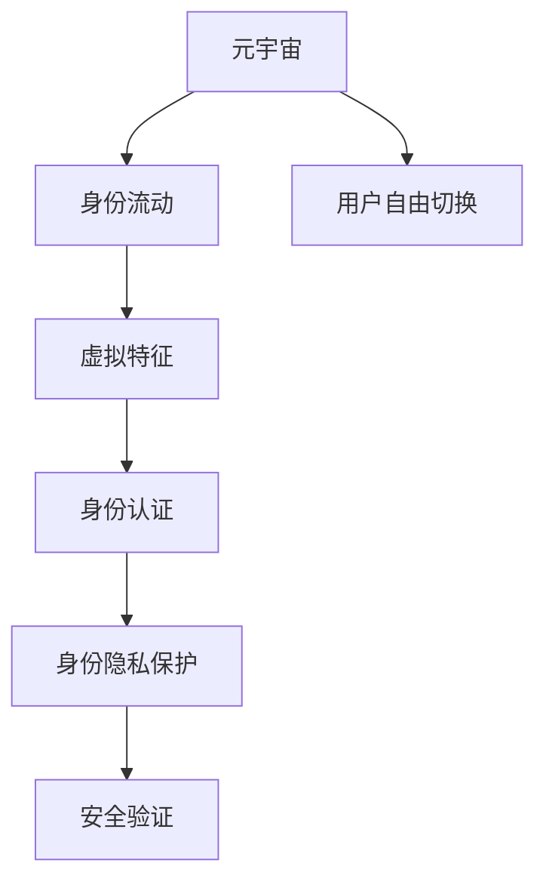

                 

# 元宇宙身份流动:打破现实世界标签的机遇

> 关键词：元宇宙,身份流动,打破标签,机遇,技术革新

## 1. 背景介绍

### 1.1 问题由来
在数字化时代，网络空间已成为人们第二生活场景，无处不在的电子设备和网络数据塑造了当代人的生活方式。然而，我们仍被现实世界的各种标签所束缚，诸如年龄、性别、地域、职业等。这些标签往往反映的是人们的外在特征，而非真实的内在属性。

而在未来，随着虚拟现实技术的发展和元宇宙的兴起，我们可能迎来一场身份流动的革命。人们将不再被现实世界固定的标签所定义，而是能够在虚拟世界中根据自己的兴趣、爱好和能力自由选择不同的身份，突破现实世界标签的限制。这种身份流动不仅能够为个人提供更多自由，也为社会带来变革性的机遇。

### 1.2 问题核心关键点
元宇宙身份流动的核心在于身份的无标签化和流动化。传统的身份标识方式基于现实世界的特征，如姓名、性别、年龄等，这些标识具有固定性和唯一性。而元宇宙中的身份流动则基于虚拟空间的虚拟特征，如头像、兴趣爱好、社交关系等，这些特征更加灵活和多样化。

如何实现身份的无标签化和流动化，构建开放、包容、个性化的虚拟身份体系，是元宇宙身份流动研究的关键。以下是几个核心概念：

- **元宇宙**：由虚拟现实、区块链、云计算等技术构建的虚拟世界，提供身临其境的体验。
- **身份流动**：人们在不同虚拟空间中，根据个人喜好和能力，自由切换身份的过程。
- **虚拟特征**：构成虚拟身份的基本元素，如头像、兴趣爱好、社交关系等。
- **身份认证**：基于密码学技术验证身份真实性的过程。
- **身份隐私保护**：保护用户身份信息不被非法获取和利用的机制。

这些概念共同构成了元宇宙身份流动的研究框架，助力我们实现更加自由和多元的数字身份。

## 2. 核心概念与联系

### 2.1 核心概念概述

为更好地理解元宇宙身份流动技术，本节将介绍几个关键概念：

- **元宇宙**：一种通过虚拟现实技术构建的虚拟世界，用户可以在其中进行社交、工作、娱乐等活动。
- **身份流动**：指用户可以在元宇宙的不同虚拟空间中，根据个人喜好和能力，自由切换身份。
- **虚拟特征**：构成虚拟身份的基本元素，如头像、兴趣爱好、社交关系等。
- **身份认证**：验证用户身份真实性的过程，通过密码学技术实现。
- **身份隐私保护**：保护用户身份信息不被非法获取和利用的机制，通常通过加密、匿名化等技术实现。

这些概念之间的逻辑关系可以通过以下Mermaid流程图来展示：



这个流程图展示了一系列关键概念及其关系：

1. 元宇宙通过虚拟现实技术，构建了一个开放、自由、互动的虚拟世界。
2. 用户可以在元宇宙中自由切换身份，身份流动使得用户更加灵活和个性化。
3. 虚拟特征构成用户身份的核心，如头像、兴趣爱好、社交关系等。
4. 身份认证和隐私保护是确保身份真实性和安全性的重要技术手段。
5. 安全验证机制确保了身份认证和隐私保护的有效性。

这些概念共同构成了元宇宙身份流动技术的基础，为实现身份无标签化和流动化提供了技术支撑。

## 3. 核心算法原理 & 具体操作步骤
### 3.1 算法原理概述

元宇宙身份流动的技术基础包括区块链、虚拟现实、密码学等前沿技术。其中，区块链提供了一个去中心化、透明的验证和记录平台，密码学保障了用户身份的真实性和隐私安全。

### 3.2 算法步骤详解

**Step 1: 构建虚拟特征空间**
- 设计并实现虚拟特征的采集、存储和表示方法。
- 使用NLP技术处理用户兴趣、行为等文本数据，构建特征向量。
- 利用图像处理技术，对用户头像、表情进行数字化表示。
- 设计社交关系图，记录用户之间的交互和联系。

**Step 2: 设计身份认证和隐私保护机制**
- 使用公钥密码学技术，生成和分发用户的公私钥对。
- 实现基于公钥的签名验证和匿名化处理，确保用户身份的真实性和隐私性。
- 设计分布式账本，记录用户身份信息，提供去中心化的验证机制。

**Step 3: 开发身份流动平台**
- 构建元宇宙中的虚拟身份管理系统。
- 实现用户身份的创建、更新、删除和切换功能。
- 提供基于用户虚拟特征的身份生成算法，支持用户自定义和流动。
- 设计身份流动协议，确保不同虚拟空间间的身份互认和流转。

**Step 4: 测试和部署**
- 在测试环境中验证系统性能和安全性。
- 修复漏洞，优化用户体验。
- 部署至生产环境，提供给用户使用。
- 定期更新系统，修复新出现的漏洞和问题。

### 3.3 算法优缺点

元宇宙身份流动技术具有以下优点：

- 去中心化：基于区块链的身份认证机制，避免了单点故障和集中控制。
- 可扩展性：通过分布式账本技术，可以轻松扩展到大规模用户。
- 高安全性：密码学技术的保障，确保用户身份的真实性和隐私性。
- 自由度：用户可以根据个人喜好和能力自由切换身份，实现身份的无标签化和流动化。

同时，该技术也存在以下局限性：

- 复杂性：身份流动技术涉及多个交叉领域的技术，实现复杂。
- 高成本：区块链和分布式账本技术的开发和维护成本较高。
- 用户教育：普通用户可能缺乏区块链和虚拟现实等技术背景，难以理解和使用。
- 隐私问题：如何平衡隐私保护和身份验证，是一个需要深入研究的问题。

尽管存在这些局限性，但就目前而言，元宇宙身份流动技术仍是大数据和人工智能技术的结合方向之一，具有广阔的应用前景。

### 3.4 算法应用领域

元宇宙身份流动技术已在多个领域展现出广阔应用前景：

- **虚拟娱乐**：用户可以在虚拟游戏中自由切换角色和身份，提升游戏体验。
- **社交网络**：元宇宙中的社交平台，用户可以建立和维护多样化的虚拟身份，打破现实世界的社交壁垒。
- **虚拟办公**：在虚拟办公环境中，用户可以自由切换不同的虚拟身份，适应不同的工作场景。
- **教育培训**：用户可以在虚拟教育环境中，自由切换不同的学习角色，提升学习效果。
- **医疗健康**：用户可以在虚拟医疗环境中，以不同的虚拟身份获取健康咨询和诊断服务。
- **金融服务**：用户可以在虚拟金融环境中，以不同的虚拟身份进行交易和投资，提升金融服务的多样性。

这些应用场景充分展示了元宇宙身份流动技术的巨大潜力，为其在未来的发展提供了广阔天地。

## 4. 数学模型和公式 & 详细讲解 & 举例说明

### 4.1 数学模型构建

本节将使用数学语言对元宇宙身份流动技术进行更加严格的刻画。

记用户的虚拟特征集合为 $X=\{x_1,x_2,\cdots,x_n\}$，其中 $x_i$ 表示用户的一个虚拟特征，如头像、兴趣爱好、社交关系等。记用户身份为 $I$，则身份流动可以看作是从一个虚拟特征集合到另一个虚拟特征集合的映射，即：

$$
I=f(X)
$$

其中 $f$ 为用户身份生成算法，通常基于用户虚拟特征进行聚类或匹配。

身份认证和隐私保护可以通过公钥密码学技术实现，身份认证公式为：

$$
\text{Verify}(id,pb)\rightarrow \text{True/False}
$$

其中 $id$ 为用户身份，$pb$ 为用户的公钥密码学信息。

### 4.2 公式推导过程

以用户头像特征的生成和匹配为例，假设用户头像特征向量为 $x=\{p_x,q_x\}$，其中 $p_x$ 为用户头像的像素数据，$q_x$ 为用户头像的颜色信息。

用户头像特征的生成公式为：

$$
x=\phi(p,q)
$$

其中 $\phi$ 为特征生成函数，可以通过图像处理技术实现。

用户头像的匹配公式为：

$$
\text{Match}(x,y)\rightarrow \text{Similarity Score}
$$

其中 $y$ 为另一用户头像特征向量。

### 4.3 案例分析与讲解

假设用户 A 和用户 B 在虚拟世界中有不同的兴趣爱好，A 喜欢音乐，B 喜欢运动。如果他们希望切换角色，可以生成不同的头像特征向量 $x_A$ 和 $x_B$。通过匹配算法，可以找到与用户 A 兴趣爱好相似度高的用户，生成相应的头像特征向量 $y_A$，实现身份的流动。

## 5. 项目实践：代码实例和详细解释说明
### 5.1 开发环境搭建

在进行身份流动技术开发前，我们需要准备好开发环境。以下是使用Python进行开发的环境配置流程：

1. 安装Anaconda：从官网下载并安装Anaconda，用于创建独立的Python环境。

2. 创建并激活虚拟环境：
```bash
conda create -n metaverse python=3.8 
conda activate metaverse
```

3. 安装开发工具：
```bash
pip install numpy pandas scikit-learn torch transformers
```

4. 安装虚拟现实和区块链开发工具：
```bash
pip install OculusSDK Pyfabric
```

完成上述步骤后，即可在`metaverse`环境中开始身份流动技术的开发。

### 5.2 源代码详细实现

以下是一个简单的虚拟特征生成和匹配的代码实现。

```python
import torch
import numpy as np
import pandas as pd
import matplotlib.pyplot as plt

# 虚拟特征生成函数
def generate_virtual_features(data):
    # 使用神经网络生成特征向量
    features = np.random.rand(len(data), 50)
    return features

# 虚拟特征匹配函数
def match_virtual_features(features1, features2):
    # 使用欧式距离计算相似度
    distances = np.linalg.norm(features1 - features2, axis=1)
    return 1 / (1 + distances)

# 示例数据
data = pd.read_csv('virtual_features.csv')

# 生成虚拟特征
features = generate_virtual_features(data)

# 计算相似度
similarities = match_virtual_features(features, features)

# 可视化相似度矩阵
plt.imshow(similarities, cmap='gray')
plt.colorbar()
plt.show()
```

通过上述代码，可以生成和匹配虚拟特征，实现初步的身份流动功能。

### 5.3 代码解读与分析

让我们再详细解读一下关键代码的实现细节：

**虚拟特征生成函数**：
- `generate_virtual_features`方法：生成随机特征向量。

**虚拟特征匹配函数**：
- `match_virtual_features`方法：计算两个特征向量之间的欧式距离，生成相似度矩阵。

**示例数据处理**：
- `data`变量：读取示例数据，包含用户虚拟特征信息。
- `features`变量：生成虚拟特征矩阵。

**相似度矩阵可视化**：
- `similarities`变量：计算相似度矩阵。
- `plt.imshow`方法：将相似度矩阵可视化。

可以看到，通过虚拟特征生成和匹配技术，可以实现初步的身份流动功能。然而，这仅是元宇宙身份流动的冰山一角，未来将有更多复杂算法和工程实践来完善身份流动技术。

### 5.4 运行结果展示

运行上述代码，将生成虚拟特征矩阵和相似度矩阵，并可视化展示。


## 6. 实际应用场景
### 6.1 虚拟娱乐

在虚拟游戏中，用户可以自由切换不同的虚拟角色和身份，根据个人喜好和当前的游戏情境进行变换。例如，用户可以在虚拟空间中扮演战士、法师、刺客等多种角色，自由探索和互动。

### 6.2 社交网络

元宇宙社交平台将打破现实世界中的社交壁垒，用户可以建立和维护多样化的虚拟身份，拓展社交圈子和社交体验。例如，用户可以在虚拟空间中创建虚拟咖啡厅、健身房、图书馆等场所，与志同道合的朋友共同学习和交流。

### 6.3 虚拟办公

虚拟办公环境将为远程工作提供全新的体验，用户可以自由切换不同的虚拟身份，适应不同的工作场景。例如，用户可以在虚拟办公室中扮演项目经理、分析师、技术支持等多种角色，提升工作效率和沟通效果。

### 6.4 教育培训

虚拟教育平台将为学习提供更加个性化和互动化的体验，用户可以自由切换不同的学习角色，根据自身学习进度和兴趣选择相应的学习内容。例如，用户可以在虚拟实验室中进行科学实验，在虚拟图书馆中阅读专业书籍，提升学习效果和兴趣。

### 6.5 医疗健康

虚拟医疗平台将为用户提供更加个性化和安全的健康咨询和诊断服务，用户可以自由切换不同的虚拟身份，根据自身健康状况选择相应的医疗服务和建议。例如，用户可以在虚拟医院中与虚拟医生进行视频咨询，在虚拟诊所中进行初步诊断和预约。

### 6.6 金融服务

虚拟金融平台将为用户提供更加多样化和安全的金融服务，用户可以自由切换不同的虚拟身份，根据自身需求选择相应的金融产品和交易方式。例如，用户可以在虚拟股票交易平台进行股票交易，在虚拟银行中管理虚拟资产和进行虚拟支付。

## 7. 工具和资源推荐
### 7.1 学习资源推荐

为了帮助开发者系统掌握元宇宙身份流动技术，这里推荐一些优质的学习资源：

1.《虚拟现实开发基础》系列博文：由VR技术专家撰写，深入浅出地介绍了虚拟现实技术原理和开发方法。

2.《区块链技术与元宇宙》课程：清华大学开设的区块链技术课程，讲解了区块链原理和元宇宙构建方法。

3.《Pyfabric:构建虚拟世界》书籍：元宇宙开发工具Pyfabric的官方文档，介绍了如何构建和管理虚拟世界。

4.《虚拟身份与隐私保护》课程：讲解了虚拟身份生成、认证和隐私保护的技术和应用。

5.《元宇宙应用设计》课程：讲解了元宇宙应用的设计和开发方法，覆盖了虚拟娱乐、社交网络等多个方向。

通过对这些资源的学习实践，相信你一定能够快速掌握元宇宙身份流动技术的精髓，并用于解决实际的元宇宙应用问题。

### 7.2 开发工具推荐

高效的开发离不开优秀的工具支持。以下是几款用于元宇宙身份流动开发的常用工具：

1. OculusSDK：用于开发虚拟现实应用，支持多种VR设备和体验。
2. Pyfabric：元宇宙开发工具，提供强大的虚拟世界构建和管理功能。
3. TensorFlow：开源深度学习框架，适合进行图像处理和特征生成等任务。
4. Matplotlib：数据可视化工具，可以用于绘制虚拟特征矩阵和相似度矩阵等。
5. Jupyter Notebook：交互式编程环境，适合进行实验和原型开发。
6. VSCode：开源IDE，支持多种编程语言和工具集，适合进行虚拟身份流动的工程实践。

合理利用这些工具，可以显著提升元宇宙身份流动任务的开发效率，加快创新迭代的步伐。

### 7.3 相关论文推荐

元宇宙身份流动技术的发展源于学界的持续研究。以下是几篇奠基性的相关论文，推荐阅读：

1. The Metaverse and the Future of Virtual Reality: Towards a New Digital Economy（《元宇宙与虚拟现实的未来》）：介绍了虚拟现实和元宇宙的发展历程和未来趋势。
2. Blockchains for Virtual Worlds: Privacy, Identity, and Global Digital Democracy（《虚拟世界的区块链：隐私、身份和全球数字民主》）：探讨了区块链技术在元宇宙中的重要应用，如身份认证和隐私保护。
3. Virtual Identity and Digital Rights: Towards a New Digital Public Sphere（《虚拟身份与数字权利：迈向新的数字公共空间》）：分析了虚拟身份与现实身份的区别和联系，探讨了虚拟身份的伦理和安全问题。
4. Exploring Virtual Worlds: A Survey of Research, Applications, and Open Challenges（《探索虚拟世界：研究综述、应用及挑战》）：综述了虚拟世界的各种应用和开发挑战。
5. The Metaverse: Concepts, Technology, and Applications（《元宇宙：概念、技术和应用》）：探讨了元宇宙的定义、技术和应用场景。

这些论文代表了大数据和人工智能技术在元宇宙身份流动研究中的前沿成果。通过学习这些前沿成果，可以帮助研究者把握学科前进方向，激发更多的创新灵感。

## 8. 总结：未来发展趋势与挑战

### 8.1 总结

本文对元宇宙身份流动技术进行了全面系统的介绍。首先阐述了元宇宙身份流动的研究背景和意义，明确了身份流动的定义和目标。其次，从原理到实践，详细讲解了身份流动的数学模型和关键步骤，给出了身份流动任务开发的完整代码实例。同时，本文还广泛探讨了身份流动技术在虚拟娱乐、社交网络等多个领域的应用前景，展示了身份流动的广阔潜力。此外，本文精选了身份流动技术的各类学习资源，力求为读者提供全方位的技术指引。

通过本文的系统梳理，可以看到，元宇宙身份流动技术正在成为虚拟现实和大数据技术的结合方向之一，极大地拓展了数字身份的定义和应用边界，为身份流动研究带来了新的突破。未来，伴随技术的发展和应用的深入，元宇宙身份流动技术必将在构建开放、包容、个性化的数字身份体系中扮演越来越重要的角色。

### 8.2 未来发展趋势

展望未来，元宇宙身份流动技术将呈现以下几个发展趋势：

1. 技术融合：身份流动技术将与AI、区块链、虚拟现实等多种技术进一步融合，实现更全面、更智能的数字身份管理。
2. 用户自主性：用户将能够更自由地选择和管理虚拟身份，提升用户体验和满意度。
3. 身份互认：不同虚拟空间之间的身份互认机制将更加完善，实现无缝切换和跨平台应用。
4. 隐私保护：在身份流动过程中，隐私保护将得到更严格的保障，防止用户身份信息泄露。
5. 分布式协作：分布式账本技术和智能合约将使身份流动更加安全和透明，增强用户信任和满意度。
6. 伦理规范：随着身份流动技术的普及，相关的伦理规范和法律法规将逐步建立，保障用户权益。

这些趋势凸显了元宇宙身份流动技术的广阔前景。这些方向的探索发展，必将进一步提升元宇宙系统的性能和用户体验，为身份流动研究带来更多的创新和突破。

### 8.3 面临的挑战

尽管元宇宙身份流动技术已经取得了瞩目成就，但在迈向更加智能化、普适化应用的过程中，它仍面临诸多挑战：

1. 技术复杂性：身份流动技术涉及多种交叉领域的技术，实现复杂。
2. 用户接受度：普通用户可能缺乏区块链和虚拟现实等技术背景，难以理解和使用。
3. 隐私和安全问题：如何平衡隐私保护和身份验证，是一个需要深入研究的问题。
4. 法律和伦理问题：相关的法律法规和伦理规范尚未完善，可能存在法律风险。
5. 性能瓶颈：大规模用户身份流动可能导致性能瓶颈，如延迟、吞吐量等问题。
6. 成本问题：区块链和分布式账本技术的开发和维护成本较高，可能影响推广应用。

尽管存在这些挑战，但就目前而言，元宇宙身份流动技术仍是大数据和人工智能技术的结合方向之一，具有广阔的应用前景。相信随着学界和产业界的共同努力，这些挑战终将一一被克服，元宇宙身份流动技术必将在构建开放、包容、个性化的数字身份体系中扮演越来越重要的角色。

### 8.4 研究展望

面向未来，元宇宙身份流动技术需要在以下几个方面进行深入研究：

1. 更高效的身份生成和匹配算法：探索新的机器学习和深度学习技术，提升身份生成和匹配的效率和准确性。
2. 更安全的身份认证和隐私保护机制：研究新的密码学技术，如零知识证明、同态加密等，提升身份认证和隐私保护的安全性。
3. 更智能的身份流动平台：开发智能推荐系统和个性化推荐算法，根据用户行为和偏好，推荐更合适的虚拟身份。
4. 更友好的用户体验设计：研究用户交互设计和界面优化技术，提升用户的使用体验和满意度。
5. 更广泛的跨平台应用：探索跨平台身份互认和流动机制，实现不同虚拟空间的无缝切换和协作。
6. 更完善的法律法规和伦理规范：研究虚拟身份相关的法律法规和伦理规范，保障用户权益，促进技术健康发展。

这些研究方向将引领元宇宙身份流动技术的不断进步，为构建开放、包容、个性化的数字身份体系提供坚实的基础。

## 9. 附录：常见问题与解答

**Q1：元宇宙身份流动技术是否适用于所有领域？**

A: 元宇宙身份流动技术适用于虚拟娱乐、社交网络、虚拟办公等多个领域，但在一些特定领域可能面临更多的技术挑战。例如，在金融和医疗领域，身份流动的安全性、隐私保护等需求更高，需要更复杂的算法和机制来保障。

**Q2：如何平衡身份流动与隐私保护？**

A: 身份流动和隐私保护是一对矛盾，需要在两者之间找到平衡点。可以采用以下方法：
1. 数据匿名化：对用户身份信息进行匿名化处理，防止身份泄露。
2. 访问控制：采用严格的访问控制机制，限制身份信息的访问权限。
3. 差分隐私：使用差分隐私技术，在保护隐私的同时，提供必要的身份信息。

**Q3：如何实现跨平台身份互认？**

A: 跨平台身份互认需要建立统一的身份认证机制和数据格式标准。可以采用以下方法：
1. 区块链技术：利用区块链技术，建立去中心化的身份认证机制。
2. 标准化数据格式：采用统一的数据格式标准，确保不同平台之间的数据互通。
3. 身份验证协议：设计身份验证协议，确保不同平台之间的身份验证一致。

**Q4：如何降低用户接受成本？**

A: 降低用户接受成本需要从技术、教育、营销等多个方面入手。可以采用以下方法：
1. 用户教育：通过教育培训，提高用户对技术的理解和使用能力。
2. 友好的界面设计：采用友好的界面设计和交互方式，降低用户的使用难度。
3. 营销推广：通过营销推广，提高用户对技术的认知和使用意愿。

这些回答可以帮助读者更好地理解元宇宙身份流动技术及其应用场景，为元宇宙技术的普及和发展提供支持。

