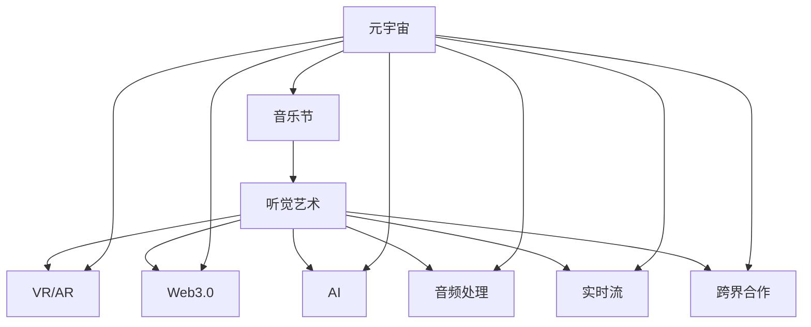

                 

# 元宇宙音乐节:跨越时空的听觉艺术盛宴

> 关键词：元宇宙,音乐节,听觉艺术,虚拟现实,Web3.0,人工智能,音频处理,实时流,跨界合作

## 1. 背景介绍

在互联网技术的不断迭代和人工智能技术的深度融合下，元宇宙(Utility Virtual Universe)这一概念逐渐成为科技和文化的交汇点。元宇宙音乐节，作为近年来兴起的一种新兴艺术形式，正逐步打破传统音乐节的时间和空间限制，为全球乐迷带来前所未有的听觉艺术盛宴。本文将探讨元宇宙音乐节的核心概念、技术原理、实现步骤及未来发展方向，为读者深入了解这一前沿领域的艺术和科技结合提供全面的视角。

## 2. 核心概念与联系

### 2.1 核心概念概述

元宇宙音乐节融合了数字技术与传统艺术形式，通过虚拟现实(VR)、增强现实(AR)和人工智能(AI)等技术手段，将音乐、表演艺术、数字互动等多元素进行深度融合。其核心概念包括：

- **元宇宙**：虚拟现实世界，用户可以在其中进行交流、协作、创作，并沉浸于丰富的虚拟体验中。
- **音乐节**：一种大规模聚集人群的音乐表演和交流活动，旨在通过音乐传递情感、文化和审美。
- **听觉艺术**：音乐与艺术结合的形式，包括演奏、现场演出、互动式音乐创作等。
- **虚拟现实(VR)**：通过计算机技术模拟现实世界的3D环境，让用户沉浸其中。
- **增强现实(AR)**：将虚拟信息叠加到现实世界的数字信息，增强用户的现实感知。
- **Web3.0**：基于区块链的去中心化互联网，强调数据透明、用户自由和智能合约。
- **人工智能(AI)**：通过算法模拟人类智能，提升音乐节互动体验和自动化管理。
- **音频处理**：涉及音频信号的采集、压缩、编码、解码等技术。
- **实时流**：音乐节现场直播和互动需要高效、稳定的实时流媒体技术。
- **跨界合作**：音乐节组织者、艺术家、科技公司等之间的合作，共同开发和推广创新应用。

### 2.2 核心概念原理和架构的 Mermaid 流程图



这个流程图展示了元宇宙音乐节的各个核心概念以及它们之间的联系。元宇宙作为底层平台，与VR/AR、Web3.0、AI、音频处理、实时流和跨界合作等多个技术层面相结合，共同支撑起这一全新的艺术形式。

## 3. 核心算法原理 & 具体操作步骤

### 3.1 算法原理概述

元宇宙音乐节的核心算法原理涉及多个领域，包括虚拟现实、增强现实、人工智能、音频处理和实时流技术。其中，虚拟现实和增强现实技术用于构建沉浸式体验，人工智能用于优化音乐节的管理和互动，音频处理用于保证高质量的音频输出，实时流技术则确保了音乐节的实时性和互动性。

### 3.2 算法步骤详解

1. **虚拟现实和增强现实**：
   - **VR音乐节**：通过VR技术，用户可以360度沉浸于音乐节现场，感受到真实的声场环境。
   - **AR交互**：结合AR技术，观众可以在现实世界中看到虚拟角色和互动内容，增强体验的沉浸感。

2. **人工智能**：
   - **音乐推荐系统**：使用机器学习算法分析用户偏好，推荐个性化音乐和表演。
   - **自动化管理**：利用AI进行票务销售、人群管理、安全监控等，提高管理效率。

3. **音频处理**：
   - **音频采集**：采用高精度麦克风和声学传感器，捕捉现场和虚拟环境的音频。
   - **音频编码与解码**：使用高效压缩算法（如MP3、AAC）和解码技术，确保音频流传输的流畅性。

4. **实时流技术**：
   - **直播流媒体**：构建高质量的直播流媒体系统，确保现场表演的实时性和低延迟。
   - **互动直播**：通过WebRTC、RTMP等协议，实现用户与表演者之间的实时互动。

### 3.3 算法优缺点

**优点**：
- **沉浸式体验**：VR和AR技术提供了前所未有的沉浸式体验，让用户仿佛身临其境。
- **个性化推荐**：AI驱动的个性化音乐推荐，提升了用户的参与度和满意度。
- **高效管理**：AI自动化管理技术，提高了音乐节的管理效率和安全性。
- **跨界融合**：跨界合作模式，汇集了多方资源，提升了音乐节的创新性和多样性。

**缺点**：
- **技术门槛高**：构建和维护高质量的元宇宙音乐节需要高水平的技术支持和资金投入。
- **交互复杂**：大量的互动元素增加了系统的复杂性，可能影响用户体验。
- **网络依赖**：高质量的实时流传输对网络带宽和稳定性要求较高。
- **隐私和安全**：用户数据的隐私和安全保护需要严格的技术措施。

### 3.4 算法应用领域

元宇宙音乐节的应用领域广泛，主要涵盖以下方面：

1. **文化娱乐**：为音乐爱好者和艺术爱好者提供全新的体验和互动平台。
2. **商业活动**：企业可通过举办元宇宙音乐节进行品牌推广和产品营销。
3. **教育培训**：教育机构可以借助元宇宙音乐节进行远程教育和艺术培训。
4. **社交互动**：社交平台可以利用元宇宙音乐节增强用户粘性和互动性。
5. **公共活动**：政府和社区可以通过元宇宙音乐节进行文化推广和公共宣传。
6. **科技应用**：科技创新企业可以利用元宇宙音乐节展示最新技术和产品。

## 4. 数学模型和公式 & 详细讲解 & 举例说明

### 4.1 数学模型构建

元宇宙音乐节的核心算法涉及多个数学模型，包括音频信号处理、实时流优化和机器学习模型等。这里以音频信号处理和实时流优化为例，简要介绍其数学模型构建。

**音频信号处理**：
- **傅里叶变换(FFT)**：用于音频信号的频域分析，将时间域信号转换为频域信号。
- **短时傅里叶变换(STFT)**：用于分析非平稳信号的频谱变化，适用于音乐节现场复杂的声音环境。

**实时流优化**：
- **网络带宽预测**：通过统计学模型（如ARIMA）预测实时流传输的网络带宽。
- **丢包率计算**：基于丢包率模型（如M2M1算法）优化数据包的传输，减少丢包率，提高实时性。

### 4.2 公式推导过程

以音频信号处理为例，其基本公式为：

$$
y(t) = \sum_{n=-\infty}^{\infty} X_n e^{2\pi i n f_s t}
$$

其中，$y(t)$表示时域信号，$X_n$表示频域信号，$f_s$表示采样率，$i$为虚数单位。

对于实时流优化，以丢包率计算为例，M2M1算法的基本公式为：

$$
p = \frac{1 - e^{-\lambda\tau}}{\lambda\tau}
$$

其中，$p$为丢包率，$\lambda$为数据包到达率，$\tau$为数据包传输时间。

### 4.3 案例分析与讲解

以一个简单的音频信号处理示例，介绍FFT的应用：

假设有一段音频信号$y(t) = \sin(2\pi 440 t) + \sin(2\pi 880 t)$，其中$440$Hz和$880$Hz为两个音叉的频率。使用FFT将$y(t)$转换为频域信号$X_n$，可得到：

$$
X_n = \sum_{t=-\infty}^{\infty} y(t) e^{-2\pi i n f_s t}
$$

计算后得到频域信号$X_n$，可以观察到两个明显的频率分量，从而实现音频的频谱分析。

## 5. 项目实践：代码实例和详细解释说明

### 5.1 开发环境搭建

构建元宇宙音乐节需要搭建多个开发环境，包括：

1. **虚拟现实开发环境**：如Unity、Unreal Engine等，用于3D建模和场景设计。
2. **增强现实开发环境**：如ARKit、ARCore等，用于开发AR应用。
3. **Web3.0开发环境**：如Solidity、Ethers.js等，用于开发智能合约和去中心化应用。
4. **音频处理开发环境**：如Python、MATLAB等，用于音频信号处理和实时流编码。
5. **实时流开发环境**：如RTMP、WebRTC等，用于实现实时流传输。

### 5.2 源代码详细实现

以下是一个简单的Python音频处理示例，使用numpy库实现FFT计算：

```python
import numpy as np

def fft_analysis(signal, fs):
    n = len(signal)
    t = np.arange(0, n, 1) / fs
    X = np.fft.fft(signal)
    freqs = np.fft.fftfreq(n, 1/fs)
    return t, freqs, np.abs(X)

# 示例信号
signal = np.sin(2*np.pi*440*t) + np.sin(2*np.pi*880*t)

# 计算FFT
t, freqs, X = fft_analysis(signal, fs=44100)
```

### 5.3 代码解读与分析

上述代码实现了音频信号的FFT分析。关键步骤如下：
1. 定义音频信号$signal$和采样率$fs$。
2. 使用numpy的`fft.fft`函数计算FFT。
3. 使用numpy的`fftfreq`函数生成频率轴$freqs$。
4. 返回时域信号$t$、频率轴$freqs$和频域信号$X$。

## 6. 实际应用场景

### 6.1 虚拟现实音乐节

虚拟现实音乐节通过VR设备，让用户能够在虚拟空间中自由穿梭，与表演者进行实时互动。用户可以自由选择视角、参与演出，甚至在虚拟空间中与表演者进行实时互动。

### 6.2 增强现实音乐节

增强现实音乐节结合AR技术，将虚拟元素叠加到现实世界中，提升用户体验。例如，观众可以在现实空间中看到虚拟角色和互动内容，增强沉浸感。

### 6.3 跨界合作音乐节

跨界合作音乐节将音乐节与科技创新结合，通过虚拟现实、增强现实、人工智能等技术，提供丰富多样的体验。例如，科技公司可以提供虚拟场景、互动工具，艺术家则可以创作虚拟表演和互动作品。

### 6.4 未来应用展望

未来，元宇宙音乐节将在以下几个方面进一步发展：

1. **多感官融合**：结合视觉、听觉、触觉等多种感官，提供更全面、更丰富的用户体验。
2. **智能交互**：通过AI驱动的智能算法，提升音乐节的互动性和自动化管理水平。
3. **区块链应用**：利用区块链技术实现去中心化票务销售、数字资产交易等功能。
4. **全球化推广**：元宇宙音乐节将打破地理限制，成为全球性文化活动。
5. **沉浸式内容创作**：艺术家和创作者可以借助虚拟工具进行艺术创作和表演，提升创作自由度。

## 7. 工具和资源推荐

### 7.1 学习资源推荐

为了深入了解元宇宙音乐节的技术和应用，推荐以下学习资源：

1. **Coursera《元宇宙技术与应用》课程**：涵盖了虚拟现实、增强现实、人工智能等核心技术，适合初学者入门。
2. **Udemy《Web3.0与区块链技术》课程**：介绍区块链的基本原理和应用场景，适合希望了解区块链技术的读者。
3. **Ars Technica《元宇宙音乐节专题》**：深入报道元宇宙音乐节的技术创新和应用实践，适合关注技术发展的读者。
4. **VRScout《元宇宙音乐节案例分析》**：提供元宇宙音乐节的实际案例分析，适合希望了解应用场景的读者。
5. **AI Magazine《人工智能与元宇宙》文章**：探讨人工智能在元宇宙音乐节中的应用，适合希望深入了解AI技术的读者。

### 7.2 开发工具推荐

以下是元宇宙音乐节开发常用的工具：

1. **Unity与Unreal Engine**：用于虚拟现实和增强现实开发，支持3D建模和场景设计。
2. **Solidity与Ethers.js**：用于Web3.0开发，支持智能合约和去中心化应用。
3. **FFmpeg与WebRTC**：用于音频和视频处理，支持实时流传输。
4. **MATLAB**：用于音频信号处理和数据可视化。
5. **GitHub**：用于版本控制和协作开发，支持开源项目管理和代码共享。

### 7.3 相关论文推荐

元宇宙音乐节涉及多个技术领域的最新研究，以下是几篇相关论文：

1. **《A Survey on Virtual Reality in Live Events》**：总结了虚拟现实技术在现场活动中的应用。
2. **《Real-Time Streaming and Interactive Applications》**：介绍了实时流传输技术及其优化方法。
3. **《Blockchain for Music Festivals》**：探讨了区块链技术在音乐节票务销售和数字资产管理中的应用。
4. **《AI in Live Events》**：介绍了人工智能技术在音乐节管理和互动中的应用。
5. **《Audio Signal Processing Techniques》**：介绍了音频信号处理的基本技术和算法。

## 8. 总结：未来发展趋势与挑战

### 8.1 研究成果总结

本文系统介绍了元宇宙音乐节的核心概念、技术原理和实现步骤，探讨了其优缺点及应用领域，并提供了全面的学习资源和开发工具推荐。通过深入分析，读者可以全面了解元宇宙音乐节的技术基础和发展前景。

### 8.2 未来发展趋势

未来，元宇宙音乐节将在以下几个方面取得重要进展：

1. **多感官融合**：通过集成视觉、听觉、触觉等多感官技术，提供更加沉浸式的用户体验。
2. **智能交互**：利用AI驱动的智能算法，提升音乐节的互动性和自动化管理水平。
3. **区块链应用**：结合区块链技术，实现去中心化的票务销售和数字资产交易。
4. **全球化推广**：打破地理限制，成为全球性的文化活动。
5. **沉浸式内容创作**：艺术家和创作者可以借助虚拟工具进行艺术创作和表演，提升创作自由度。

### 8.3 面临的挑战

尽管元宇宙音乐节有着广阔的发展前景，但在实际应用中也面临以下挑战：

1. **技术复杂度**：构建高质量的元宇宙音乐节需要高水平的技术支持和资金投入。
2. **用户体验**：大量的互动元素增加了系统的复杂性，可能影响用户体验。
3. **网络依赖**：高质量的实时流传输对网络带宽和稳定性要求较高。
4. **隐私和安全**：用户数据的隐私和安全保护需要严格的技术措施。

### 8.4 研究展望

未来，元宇宙音乐节的研究将主要集中在以下几个方面：

1. **技术集成**：将虚拟现实、增强现实、人工智能等技术进行深度集成，提升用户体验。
2. **用户界面设计**：提升用户界面的友好性和易用性，减少技术门槛。
3. **隐私保护**：开发安全、可信任的隐私保护技术，保护用户数据。
4. **跨平台支持**：支持不同平台和设备的兼容性，提升用户覆盖面。
5. **生态建设**：建立元宇宙音乐节的标准和规范，促进生态系统的健康发展。

## 9. 附录：常见问题与解答

**Q1：元宇宙音乐节的技术难点有哪些？**

A: 元宇宙音乐节的技术难点主要包括以下几个方面：
1. **高技术门槛**：虚拟现实、增强现实、人工智能等技术都需要高水平的专业知识和技能。
2. **实时性要求高**：实时流传输和互动需要稳定的网络环境和高性能的硬件设备。
3. **用户交互复杂**：大量的互动元素增加了系统的复杂性，可能影响用户体验。
4. **隐私和安全**：用户数据的隐私和安全保护需要严格的技术措施。

**Q2：元宇宙音乐节的核心技术有哪些？**

A: 元宇宙音乐节的核心技术包括以下几个方面：
1. **虚拟现实(VR)**：提供沉浸式体验，让用户仿佛身临其境。
2. **增强现实(AR)**：结合虚拟元素，增强用户体验的沉浸感。
3. **人工智能(AI)**：驱动智能推荐和自动化管理，提升用户体验和效率。
4. **音频处理**：确保高质量的音频输出和实时流传输。
5. **实时流技术**：实现音乐节的实时性和互动性。

**Q3：如何确保元宇宙音乐节的安全性和隐私保护？**

A: 确保元宇宙音乐节的安全性和隐私保护，需要采取以下措施：
1. **数据加密**：采用先进的数据加密技术，保护用户数据的隐私和安全。
2. **访问控制**：使用身份验证和授权机制，限制用户和管理员的访问权限。
3. **安全审计**：定期进行安全审计，发现和修复潜在的安全漏洞。
4. **隐私政策**：制定透明的隐私政策，明确用户数据的收集、存储和使用方式。

---

作者：禅与计算机程序设计艺术 / Zen and the Art of Computer Programming

