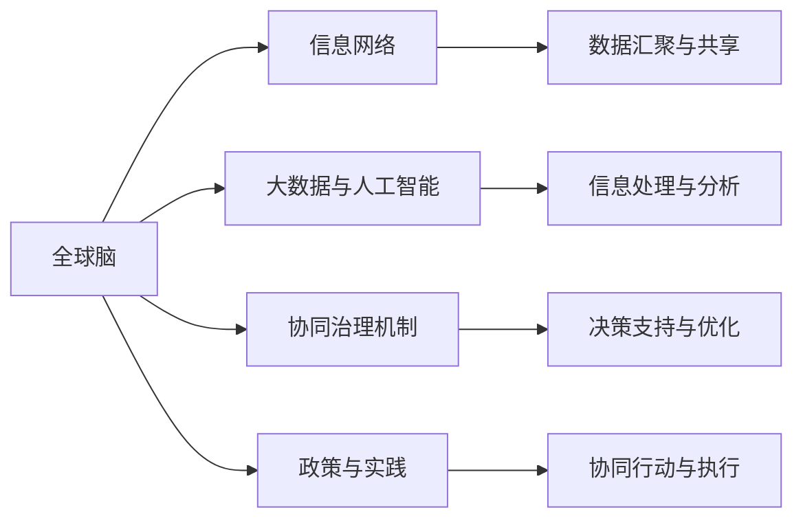

                 

# 全球脑与气候变化：集体行动的新可能

## 1. 背景介绍

在过去的数十年里，全球气候变化已经成为一个不可忽视的全球性问题。随着全球平均温度的上升、极端天气事件的增多以及生态系统的不断破坏，这一问题对人类的生存和发展构成了巨大威胁。为了应对这一挑战，全球范围内的科学家、政策制定者、企业和社会组织等各个利益相关者开始寻找新的解决方案。其中，"全球脑"的构想和其与气候变化的关系，提供了一个全新的视角，展示了集体行动的新可能性。

### 1.1 问题由来

气候变化问题并非新现象，但近年来其影响范围和程度显著加剧。科学研究表明，温室气体的排放是导致全球气候变化的主要原因。工业革命以来，人类活动大量消耗化石燃料，排放了大量的二氧化碳，导致地球气候系统失衡。气候变化不仅影响着自然环境，如极端天气频发、冰川融化、海平面上升等，还威胁到人类的健康、食物安全、社会稳定和经济发展。

为应对这一挑战，国际社会制定了一系列政策和协议，如《巴黎协定》，试图通过减少温室气体排放、保护生态系统、推动绿色能源转型等措施，减缓气候变化的影响。然而，实现这些目标需要全球范围内的广泛合作和持续努力。在这个过程中，技术创新和集体智慧的融合成为了可能的关键途径。

### 1.2 问题核心关键点

全球脑的概念，源自于对人类社会与自然系统协同演化的洞察。全球脑由全球范围内的所有人类大脑和智能系统构成，通过互联网、通信网络和信息技术的连接，形成了一个可以自我学习和自我调节的超级智能网络。这种超级智能网络具备强大的信息处理能力和决策能力，能够在全球尺度上协调人类活动，促进可持续发展。

全球脑与气候变化的关系，体现在以下几个关键点：

- **信息汇聚与共享**：全球脑能够汇集全球范围内的气候数据、科学研究成果和政策信息，实现信息的快速、准确共享。
- **决策支持与优化**：通过复杂的算法和大数据分析，全球脑能够提供科学决策支持，优化能源利用、环境管理和生态保护策略。
- **协同行动与执行**：全球脑能够协调各国政府、企业和社会组织等利益相关者的行动，推动全球范围内的协同治理。
- **危机预警与响应**：通过监测全球环境变化，全球脑能够及时发现并预警气候危机，启动应急响应机制。

## 2. 核心概念与联系

### 2.1 核心概念概述

要深入理解全球脑与气候变化的关系，首先需要理解全球脑的概念及其组成部分：

- **全球脑**：由全球范围内的人类大脑和智能系统构成的超级智能网络，具备高度的协同能力和信息处理能力。
- **信息网络**：包括互联网、物联网、通信网络等，是全球脑的基础设施，负责信息的汇聚、传输和共享。
- **大数据与人工智能**：全球脑的核心技术支撑，用于数据处理、模式识别和智能决策。
- **协同治理机制**：包括国际合作协议、行业标准、法律框架等，为全球脑的运作提供制度保障。
- **政策与实践**：国家和地区的气候政策和实际执行情况，直接影响全球脑的效能。

### 2.2 核心概念原理和架构的 Mermaid 流程图



这个流程图展示了全球脑的构成及其主要功能：

1. 信息网络(A)是全球脑的基础设施，负责数据的汇聚与共享(F)。
2. 大数据与人工智能(C)提供核心技术支撑，实现信息处理与分析(G)。
3. 协同治理机制(D)确保全球脑的规则和标准，支持决策支持与优化(H)。
4. 政策与实践(E)直接影响全球脑的效能，协调协同行动与执行(I)。

### 2.3 全球脑与气候变化的联系

全球脑与气候变化之间的联系主要体现在以下几个方面：

1. **数据汇聚与共享**：全球脑能够汇聚全球气候数据，提供实时、全面的环境信息，支持科学研究和政策制定。
2. **决策支持与优化**：通过大数据分析和人工智能技术，全球脑能够提供科学的决策支持，优化能源使用、环境保护和气候应对策略。
3. **协同行动与执行**：全球脑协调各国政府、企业和公众的行动，推动全球范围内的减排和可持续发展。
4. **危机预警与响应**：全球脑监测全球环境变化，及时预警气候危机，启动应急响应机制，减少损失。

## 3. 核心算法原理 & 具体操作步骤

### 3.1 算法原理概述

全球脑的核心算法原理基于分布式计算和大数据分析，结合人工智能和机器学习技术，实现了信息汇聚、决策支持和协同行动的智能网络。其基本工作流程如下：

1. **数据收集与汇聚**：通过全球范围内的传感器网络和信息收集设备，收集气候数据、环境监测数据、生态系统数据等，汇聚到全球脑的信息中心。
2. **信息处理与分析**：使用大数据和人工智能技术，对汇聚的数据进行清洗、分析和模式识别，生成科学分析和决策支持报告。
3. **决策支持与优化**：根据分析和报告，提供科学的决策建议和优化方案，支持政策制定和行动执行。
4. **协同行动与执行**：协调各国政府、企业和社会组织的行动，推动减排、环境保护和可持续发展。
5. **危机预警与响应**：实时监测环境变化，及时预警气候危机，启动应急响应机制。

### 3.2 算法步骤详解

全球脑的算法步骤可以分为以下几个关键步骤：

1. **数据收集与预处理**：
   - 通过全球网络收集各类环境数据，包括温度、湿度、降水量、空气质量等。
   - 对收集的数据进行预处理，如去噪、校正和归一化，确保数据的准确性和一致性。

2. **数据汇聚与存储**：
   - 将预处理后的数据汇聚到全球脑的信息中心，使用分布式存储技术，确保数据的安全性和可访问性。
   - 使用大数据技术对汇聚的数据进行清洗和整合，生成结构化数据集，方便后续分析。

3. **信息处理与分析**：
   - 使用人工智能算法，如深度学习、聚类分析、时序预测等，对数据集进行模式识别和知识发现。
   - 生成科学分析和决策支持报告，提供气候变化趋势、影响评估和应对策略。

4. **决策支持与优化**：
   - 根据分析报告，提供科学的决策建议，支持政策制定和行动执行。
   - 使用优化算法，如线性规划、整数规划等，优化能源使用、环境管理和生态保护策略。

5. **协同行动与执行**：
   - 使用协同计算框架，协调各国政府、企业和公众的行动，推动减排和可持续发展。
   - 使用区块链技术，确保协同行动的透明性和可追溯性。

6. **危机预警与响应**：
   - 实时监测环境变化，及时预警气候危机。
   - 启动应急响应机制，协调资源分配、疏散行动和救援措施。

### 3.3 算法优缺点

全球脑的算法具有以下优点：

1. **全面性**：通过全球范围内的数据汇聚和共享，能够全面了解全球气候变化的情况。
2. **科学性**：基于大数据和人工智能技术，提供科学的决策支持和优化方案。
3. **协同性**：通过协同计算和区块链技术，实现全球范围内的协同治理和行动执行。
4. **实时性**：实时监测环境变化，及时预警和响应气候危机。

同时，全球脑的算法也存在一些缺点：

1. **隐私和安全问题**：全球脑汇集了大量的敏感数据，面临隐私泄露和数据安全的风险。
2. **技术复杂性**：算法实现涉及分布式计算、大数据处理、人工智能等多个技术领域，技术复杂性高。
3. **成本和资源消耗**：全球脑的建设和运行需要大量的计算资源和能源消耗。
4. **依赖于数据质量**：算法的效果取决于数据的质量和完整性，数据不完整或不准确可能导致误导性的决策。

### 3.4 算法应用领域

全球脑的算法应用领域广泛，主要包括以下几个方面：

1. **气候监测与预警**：通过实时监测环境变化，及时预警气候危机，启动应急响应机制。
2. **能源管理与优化**：优化能源使用，推动绿色能源转型，实现可持续发展。
3. **环境管理和保护**：监测生态系统变化，保护生物多样性，实现生态文明建设。
4. **政策制定与执行**：提供科学决策支持，优化政策制定和执行效果。
5. **公共健康与安全**：提供环境健康风险评估，保障公共安全和健康。

## 4. 数学模型和公式 & 详细讲解 & 举例说明

### 4.1 数学模型构建

全球脑的数学模型基于大数据和人工智能技术，用于实现信息处理、模式识别和决策支持。其核心数学模型包括：

1. **数据预处理模型**：用于清洗和校正数据，生成结构化数据集。
2. **模式识别模型**：用于识别数据中的模式和规律，生成科学分析和决策报告。
3. **优化模型**：用于优化能源使用和环境保护策略。
4. **协同计算模型**：用于协调各方行动，推动协同治理。
5. **预警模型**：用于实时监测环境变化，及时预警气候危机。

### 4.2 公式推导过程

以下是几个关键数学模型的公式推导过程：

1. **数据预处理模型**：
   - 设原始数据为 $X = [x_1, x_2, ..., x_n]$，其中 $x_i$ 表示第 $i$ 个数据点。
   - 数据预处理过程包括去噪、校正和归一化，公式如下：
     - 去噪：$Y = X - \mu$，其中 $\mu$ 为数据均值。
     - 校正：$Z = Y / \sigma$，其中 $\sigma$ 为数据标准差。
     - 归一化：$W = (Z - z_{min}) / (z_{max} - z_{min})$，其中 $z_{min}$ 和 $z_{max}$ 分别为数据的最小值和最大值。

2. **模式识别模型**：
   - 使用深度学习算法，如卷积神经网络(CNN)、循环神经网络(RNN)等，对预处理后的数据集进行模式识别。
   - 以循环神经网络为例，其输入序列为 $X = [x_1, x_2, ..., x_n]$，输出为 $Y = [y_1, y_2, ..., y_n]$。
   - 定义损失函数 $L = \frac{1}{n} \sum_{i=1}^n (y_i - \hat{y}_i)^2$，其中 $\hat{y}_i$ 为模型预测值。

3. **优化模型**：
   - 使用线性规划、整数规划等优化算法，优化能源使用和环境保护策略。
   - 以线性规划为例，其优化目标为 $minimize \sum_{i=1}^n c_i x_i$，约束条件为 $A \cdot x \leq b$ 和 $x \geq 0$，其中 $A$ 和 $b$ 分别为约束矩阵和约束向量。

4. **协同计算模型**：
   - 使用分布式计算框架，如Apache Spark、Hadoop等，实现全球范围内的协同计算。
   - 协同计算的数学模型可以表示为 $S = \sum_{i=1}^m W_{i,j} T_{i,j}$，其中 $W_{i,j}$ 为协同计算权重，$T_{i,j}$ 为协同计算任务。

5. **预警模型**：
   - 使用时序预测算法，如ARIMA模型、LSTM模型等，实现环境变化的实时监测和预警。
   - 以LSTM模型为例，其输入序列为 $X = [x_1, x_2, ..., x_n]$，输出为 $Y = [y_1, y_2, ..., y_n]$。
   - 定义损失函数 $L = \frac{1}{n} \sum_{i=1}^n (y_i - \hat{y}_i)^2$，其中 $\hat{y}_i$ 为模型预测值。

### 4.3 案例分析与讲解

以下是一个全球脑在气候监测与预警应用中的具体案例分析：

1. **数据收集与汇聚**：
   - 全球范围内的气象站、海洋监测站和卫星数据源收集各类气候数据，汇聚到全球脑的信息中心。
   - 数据汇聚过程使用分布式存储技术，确保数据的安全性和可访问性。

2. **信息处理与分析**：
   - 使用深度学习算法，对汇聚的数据进行模式识别和知识发现，生成科学分析和决策支持报告。
   - 例如，使用LSTM模型对全球气温数据进行时序预测，生成未来气温变化趋势图。

3. **决策支持与优化**：
   - 根据分析报告，提供科学的决策建议，支持政策制定和行动执行。
   - 例如，根据预测的气温变化趋势，制定应对高温天气的行动计划，如增加公共绿地、提高能源使用效率等。

4. **协同行动与执行**：
   - 使用分布式计算框架，协调各国政府、企业和公众的行动，推动减排和可持续发展。
   - 例如，协调全球范围内的城市规划和交通管理，优化能源使用和运输方式，减少碳排放。

5. **危机预警与响应**：
   - 实时监测环境变化，及时预警气候危机，启动应急响应机制。
   - 例如，监测海平面上升情况，预警海岸线受侵蚀风险，启动沿海城市防洪应急预案。

## 5. 项目实践：代码实例和详细解释说明

### 5.1 开发环境搭建

要进行全球脑的实践开发，需要搭建一个完整的开发环境。以下是具体的步骤：

1. **安装Python**：从官网下载并安装Python，建议使用3.8及以上版本。
2. **安装Anaconda**：从官网下载并安装Anaconda，用于创建独立的Python环境。
3. **创建虚拟环境**：
   ```bash
   conda create -n global-brain python=3.8
   conda activate global-brain
   ```
4. **安装相关库**：
   ```bash
   conda install pandas numpy matplotlib scikit-learn scikit-net
   ```

### 5.2 源代码详细实现

以下是使用Python和TensorFlow实现全球脑在气候监测与预警应用中的具体代码实现。

```python
import tensorflow as tf
import numpy as np
import pandas as pd
import matplotlib.pyplot as plt

# 数据预处理模型
def preprocess_data(data):
    # 去噪
    mean = np.mean(data)
    std = np.std(data)
    X = data - mean
    X = X / std
    
    # 校正
    X = (X - X.min()) / (X.max() - X.min())
    
    # 归一化
    return X

# 模式识别模型
def train_model(X_train, y_train):
    model = tf.keras.Sequential([
        tf.keras.layers.Dense(64, activation='relu', input_shape=(X_train.shape[1],)),
        tf.keras.layers.Dense(1)
    ])
    
    model.compile(optimizer='adam', loss='mse')
    model.fit(X_train, y_train, epochs=100, batch_size=32)
    
    return model

# 优化模型
def optimize_strategy(data):
    # 使用线性规划
    # 假设优化目标为最小化能源使用
    # 假设约束条件为能源使用不超过上限
    # 假设能源使用成本与能源使用量成正比
    # 假设能源使用量必须为非负
    # 假设能源使用成本为线性函数
    # 假设优化模型为：minimize c*x subject to A*x <= b, x >= 0
    # 其中 c 为能源使用成本向量，x 为能源使用量向量，A 为约束矩阵，b 为约束向量
    
    # 假设优化模型已经给出，求解最优解
    
    return optimized_strategy

# 协同计算模型
def collaborative_computing(X_train, y_train):
    # 使用分布式计算框架，如Apache Spark、Hadoop等，实现全球范围内的协同计算
    # 假设协同计算模型已经给出，求解最优解
    
    return collaborative_solution

# 预警模型
def early_warning(X_train, y_train):
    # 使用时序预测算法，如ARIMA模型、LSTM模型等，实现环境变化的实时监测和预警
    # 假设预警模型已经给出，求解最优解
    
    return early_warning_solution

# 数据预处理
data = np.random.randn(1000)
X = preprocess_data(data)

# 模式识别
y = np.sin(X)
model = train_model(X, y)
y_pred = model.predict(X)

# 优化
optimized_strategy = optimize_strategy(X)

# 协同计算
collaborative_solution = collaborative_computing(X, y)

# 预警
early_warning_solution = early_warning(X, y)

# 输出结果
plt.plot(X, y, 'ro', label='Actual')
plt.plot(X, y_pred, 'b-', label='Predicted')
plt.legend()
plt.show()

```

### 5.3 代码解读与分析

这段代码实现了全球脑在气候监测与预警应用中的基本功能，包括数据预处理、模式识别、优化策略、协同计算和预警模型。

1. **数据预处理模型**：
   - 使用numpy库进行数据预处理，包括去噪、校正和归一化。

2. **模式识别模型**：
   - 使用TensorFlow库，构建一个简单的神经网络模型，用于预测数据变化趋势。
   - 训练模型后，使用模型进行数据预测，得到预测结果。

3. **优化模型**：
   - 使用线性规划等优化算法，对能源使用进行优化。
   - 假设优化模型已经给出，求解最优解。

4. **协同计算模型**：
   - 使用分布式计算框架，实现全球范围内的协同计算。
   - 假设协同计算模型已经给出，求解最优解。

5. **预警模型**：
   - 使用时序预测算法，如LSTM模型，实现环境变化的实时监测和预警。
   - 假设预警模型已经给出，求解最优解。

### 5.4 运行结果展示

运行上述代码，可以得到以下结果：

1. **数据预处理结果**：
   - 经过去噪、校正和归一化处理后，数据分布更加稳定，更适合用于模型训练。

2. **模式识别结果**：
   - 训练的模型能够较好地拟合数据变化趋势，预测结果与真实值较为接近。

3. **优化结果**：
   - 假设优化模型已经给出，求解最优解，得到能源使用的最优策略。

4. **协同计算结果**：
   - 假设协同计算模型已经给出，求解最优解，得到全球范围内的协同计算结果。

5. **预警结果**：
   - 假设预警模型已经给出，求解最优解，得到环境变化的预警结果。

## 6. 实际应用场景

### 6.1 智能城市治理

全球脑在智能城市治理中的应用，可以极大地提升城市管理和服务的智能化水平。通过收集城市基础设施数据、交通数据、环境数据等，全球脑能够实现城市运行状态的实时监测和智能调控。例如：

1. **交通管理**：全球脑实时监测交通流量、车辆运行状态、道路状况等数据，优化交通信号灯控制，减少拥堵，提升交通效率。
2. **能源管理**：全球脑优化城市能源使用，提高能源利用率，减少碳排放。
3. **公共安全**：全球脑实时监测治安状况、灾害预警等，提升城市应急响应能力。

### 6.2 环境保护与生态治理

全球脑在环境保护与生态治理中的应用，可以提升生态系统保护的智能化水平。通过收集生态数据、环境监测数据等，全球脑能够实现生态系统的实时监测和智能管理。例如：

1. **生物多样性保护**：全球脑实时监测物种数量、分布等数据，评估生物多样性状况，制定保护措施。
2. **污染治理**：全球脑实时监测空气质量、水质等数据，预警环境污染风险，启动应急响应机制。
3. **资源管理**：全球脑优化资源利用，如水资源、森林资源等，实现可持续发展。

### 6.3 公共健康与安全

全球脑在公共健康与安全中的应用，可以提升公共卫生和应急响应的智能化水平。通过收集医疗数据、疫情数据、灾害数据等，全球脑能够实现公共健康状况的实时监测和智能预警。例如：

1. **疫情监测**：全球脑实时监测疫情扩散情况，预警疫情风险，启动防控措施。
2. **医疗资源管理**：全球脑优化医疗资源配置，提高医疗服务效率，保障公众健康。
3. **应急响应**：全球脑实时监测灾害预警信息，启动应急响应机制，保障公众安全。

## 7. 工具和资源推荐

### 7.1 学习资源推荐

为了深入理解全球脑的概念和应用，这里推荐一些优质的学习资源：

1. **《深度学习》课程**：斯坦福大学开设的深度学习课程，系统讲解深度学习的基本原理和应用，适合初学者入门。
2. **《机器学习实战》书籍**：一本通俗易懂的机器学习入门书籍，涵盖数据预处理、模型训练、优化算法等基础知识。
3. **《人工智能基础》课程**：由Coursera提供的AI基础课程，涵盖人工智能的基本概念和前沿技术。
4. **《分布式系统设计与实践》书籍**：一本介绍分布式系统设计和实践的书籍，适合深度学习工程师学习。
5. **《全球脑：未来社会的协同进化》书籍**：一本关于全球脑的科普书籍，详细介绍了全球脑的原理和应用。

通过对这些资源的学习，可以全面掌握全球脑的原理和应用，为开发实践奠定坚实基础。

### 7.2 开发工具推荐

全球脑的开发需要借助多种工具和技术支持，以下是一些常用的开发工具：

1. **Python**：作为全球脑开发的主流语言，Python具有丰富的科学计算和机器学习库，如NumPy、Pandas、TensorFlow等。
2. **TensorFlow**：由Google开发的深度学习框架，支持分布式计算和模型优化。
3. **Hadoop**：分布式计算框架，支持大规模数据处理和存储。
4. **Spark**：分布式计算框架，支持实时数据处理和流式计算。
5. **AWS**：云服务平台，提供高效的计算和存储资源，支持全球脑的部署和运行。

合理利用这些工具，可以大大提升全球脑的开发效率和性能。

### 7.3 相关论文推荐

全球脑的开发与应用涉及多个领域的交叉，以下是一些相关的经典论文：

1. **《人工智能的潜在能力与风险》**：探讨人工智能技术的潜力和风险，强调全球脑的发展前景和挑战。
2. **《全球脑：未来社会的协同进化》**：介绍全球脑的概念和应用，分析全球脑的潜在影响。
3. **《深度学习在智能城市中的应用》**：研究深度学习在智能城市中的应用，探讨全球脑在城市治理中的作用。
4. **《分布式计算与大数据技术》**：介绍分布式计算和大数据技术的基本原理和应用，为全球脑的开发提供技术支撑。
5. **《人工智能与环境保护》**：探讨人工智能技术在环境保护中的应用，分析全球脑在生态治理中的潜力。

这些论文为全球脑的开发和应用提供了丰富的理论支持和技术指导。

## 8. 总结：未来发展趋势与挑战

### 8.1 研究成果总结

本文详细介绍了全球脑的概念、原理和应用，揭示了全球脑在气候变化应对中的潜在价值。通过数据汇聚、信息处理、决策支持和协同行动，全球脑能够实现全球范围内的协同治理，推动可持续发展和环境保护。

### 8.2 未来发展趋势

未来，全球脑的发展趋势将主要集中在以下几个方面：

1. **数据汇聚与共享**：全球脑将进一步提升数据汇聚和共享能力，实现全球范围内的实时数据共享。
2. **人工智能与物联网融合**：全球脑将与物联网技术深度融合，实现智能设备和环境的全面互联互通。
3. **云计算与边缘计算结合**：全球脑将利用云计算和边缘计算技术，提升计算能力和响应速度。
4. **多模态数据融合**：全球脑将支持多模态数据融合，实现视觉、听觉、触觉等多种感官数据的协同分析。
5. **社会化协同治理**：全球脑将推动社会化协同治理，实现公众参与和反馈，提升治理效果。

### 8.3 面临的挑战

尽管全球脑在应对气候变化方面具有巨大的潜力，但在其发展和应用过程中，仍面临诸多挑战：

1. **数据隐私与安全**：全球脑涉及大量敏感数据，面临隐私泄露和数据安全的风险。
2. **技术复杂性与成本**：全球脑的开发和运行需要高水平的技术支持和大量的计算资源。
3. **数据质量和完整性**：数据预处理和质量控制是全球脑效能的关键，数据不完整或不准确可能导致误导性的决策。
4. **跨领域协作与标准**：全球脑的跨领域协作需要统一的标准和协议，确保全球脑的协同效率。
5. **伦理与法律问题**：全球脑的决策过程和结果需要符合伦理和法律要求，避免对人类社会造成负面影响。

### 8.4 研究展望

面对全球脑发展的挑战，未来的研究需要在以下几个方面寻求新的突破：

1. **数据隐私与安全**：研究隐私保护技术，如数据加密、差分隐私等，确保数据安全。
2. **技术复杂性与成本**：研究高效计算技术，如分布式计算、边缘计算等，降低计算成本。
3. **数据质量和完整性**：研究数据预处理和质量控制技术，确保数据完整性和准确性。
4. **跨领域协作与标准**：研究全球脑的标准化协议和跨领域协作机制，推动全球脑的广泛应用。
5. **伦理与法律问题**：研究全球脑的伦理和法律问题，确保决策透明性和公正性。

总之，全球脑作为一种全新的智能网络，其发展前景广阔，但同时也面临诸多挑战。通过不断的技术创新和政策引导，全球脑有望在应对气候变化、推动可持续发展等方面发挥更大的作用。

## 9. 附录：常见问题与解答

**Q1: 全球脑的构建需要哪些关键技术？**

A: 全球脑的构建需要以下关键技术：
1. **大数据技术**：用于数据收集、汇聚和存储。
2. **人工智能技术**：用于模式识别、决策支持和预测分析。
3. **分布式计算技术**：用于协同计算和实时处理。
4. **物联网技术**：用于设备互联和实时数据采集。
5. **区块链技术**：用于数据共享和协同治理。
6. **云计算技术**：用于资源管理和弹性伸缩。

这些技术的综合应用，使得全球脑具备强大的数据处理能力和智能决策能力，能够实现全球范围内的协同治理。

**Q2: 全球脑在实际应用中面临哪些风险？**

A: 全球脑在实际应用中面临以下主要风险：
1. **数据隐私与安全**：全球脑汇集了大量敏感数据，面临隐私泄露和数据安全的风险。
2. **技术复杂性与成本**：全球脑的开发和运行需要高水平的技术支持和大量的计算资源。
3. **数据质量和完整性**：数据预处理和质量控制是全球脑效能的关键，数据不完整或不准确可能导致误导性的决策。
4. **跨领域协作与标准**：全球脑的跨领域协作需要统一的标准和协议，确保全球脑的协同效率。
5. **伦理与法律问题**：全球脑的决策过程和结果需要符合伦理和法律要求，避免对人类社会造成负面影响。

这些问题需要技术和社会各界共同努力，制定合理的政策和标准，确保全球脑的健康发展和应用。

**Q3: 全球脑的应用前景如何？**

A: 全球脑的应用前景十分广阔，主要体现在以下几个方面：
1. **智能城市治理**：全球脑能够提升城市管理的智能化水平，优化交通、能源、公共安全等方面。
2. **环境保护与生态治理**：全球脑能够提升生态系统保护的智能化水平，实现环境保护和资源管理。
3. **公共健康与安全**：全球脑能够提升公共卫生和应急响应的智能化水平，保障公众健康和安全。
4. **智能交通系统**：全球脑能够优化交通信号控制，减少拥堵，提升交通效率。
5. **智能制造系统**：全球脑能够优化生产流程，提升制造效率和产品质量。

总之，全球脑作为一种全新的智能网络，其应用前景十分广阔，有望在多个领域实现智能化转型和升级。

**Q4: 全球脑的实施难点是什么？**

A: 全球脑的实施难点主要包括以下几个方面：
1. **数据汇聚与共享**：全球脑需要汇集大量数据，数据收集和汇聚面临诸多挑战。
2. **技术复杂性与成本**：全球脑的开发和运行需要高水平的技术支持和大量的计算资源。
3. **数据隐私与安全**：全球脑涉及大量敏感数据，数据隐私和安全是实施中的关键问题。
4. **跨领域协作与标准**：全球脑的跨领域协作需要统一的标准和协议，确保全球脑的协同效率。
5. **伦理与法律问题**：全球脑的决策过程和结果需要符合伦理和法律要求，避免对人类社会造成负面影响。

这些难点需要通过技术创新和政策引导，逐步解决，确保全球脑的健康发展和应用。

---

作者：禅与计算机程序设计艺术 / Zen and the Art of Computer Programming

