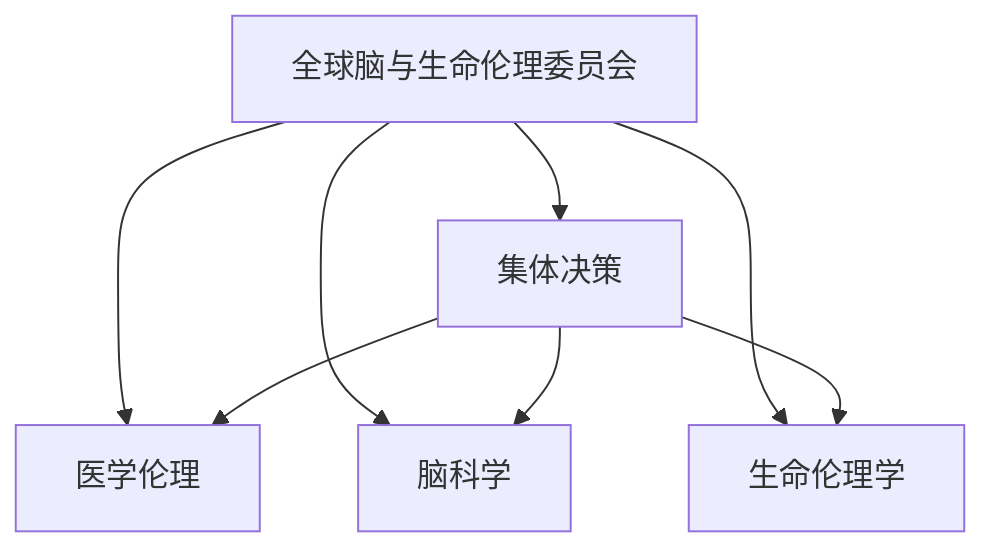

                 

# 全球脑与生命伦理委员会:集体决策下的医学伦理机构

> 关键词：全球脑与生命伦理委员会, 医学伦理, 集体决策, 脑科学, 生命伦理学

## 1. 背景介绍

在现代医学伦理研究中，全球脑与生命伦理委员会（Global Brain and Life Ethics Committee，简称GBLEC）是一个关键的国际性机构，它致力于探讨和解决在脑科学和生命伦理学领域中复杂的伦理问题，为全球的医学研究与实践提供决策指导。面对神经科技和医学技术的快速发展，GBLEC的出现为全球范围内的医学伦理问题提供了集体决策的解决方案，促进了国际间的合作与交流。

### 1.1 问题由来
随着科技的进步，人类在脑科学和生命科学领域取得了前所未有的成就。这些突破不仅带来新的治疗手段，也引发了一系列伦理问题，如人工智能在医学诊断中的使用、基因编辑技术（如CRISPR）的道德边界、脑机接口的伦理考量等。在这些问题上，单一国家或地区难以独自制定出合理的解决方案。因此，需要建立国际性的伦理机构，共同应对这些全球性的挑战。

### 1.2 问题核心关键点
GBLEC的核心目标是通过集体决策，形成具有国际共识的伦理原则和指南，指导全球范围内的医学研究和实践。具体来说，它关注以下几个关键点：
- 神经科技在医学中的应用伦理
- 人工智能在医疗决策中的角色与影响
- 基因编辑与遗传学研究的伦理边界
- 脑机接口和精神健康治疗的道德问题
- 全球健康与医学研究中的公正性与公平性

这些问题的探讨，将直接影响全球范围内的医学伦理实践和政策制定，是GBLEC的主要研究对象。

## 2. 核心概念与联系

### 2.1 核心概念概述

GBLEC的核心概念包括集体决策、医学伦理、脑科学、生命伦理学等。

- **集体决策**：在涉及跨国和跨学科的医学伦理问题时，GBLEC通过全球范围内的专家共同商议，制定统一的伦理标准和指导原则，形成具有国际共识的决策。

- **医学伦理**：专注于医学实践中，特别是涉及人类生命与健康的决策的道德性问题。

- **脑科学**：研究大脑的生理与心理功能、结构与行为，对认知、情感和行为的影响。

- **生命伦理学**：研究生命科学中的伦理问题，包括人类生命的开始与结束、医疗技术的应用等。

这些概念之间的关系可以通过以下Mermaid流程图来展示：



这个流程图展示了一个多维度的伦理决策框架，其中集体决策是核心的决策方式，医学伦理、脑科学、生命伦理学则是集体决策的依据和组成部分。

## 3. 核心算法原理 & 具体操作步骤

### 3.1 算法原理概述

GBLEC的核心算法基于集体决策的伦理决策模型，主要通过以下步骤进行：

1. **问题定义**：明确需要解决的医学伦理问题，例如人工智能在诊断中的伦理应用。
2. **利益相关方识别**：确定所有相关方，如科学家、医生、患者、伦理学家等，确保不同利益相关者的声音都被考虑。
3. **伦理分析**：对相关方进行利益权衡和风险评估，形成初步的伦理共识。
4. **多轮讨论与反馈**：通过多轮的公开讨论，收集各方意见，形成集体决策。
5. **决策形成与发布**：最终形成具有国际共识的伦理指南和原则，并通过报告或论文形式公开发布。

### 3.2 算法步骤详解

具体来说，GBLEC的算法步骤如下：

**Step 1: 问题定义**
- 确定研究主题，如人工智能在医学诊断中的伦理问题。
- 制定研究目标，例如探讨人工智能的透明性、偏见、解释性等。

**Step 2: 利益相关方识别**
- 通过调研和问卷调查识别所有利益相关方。
- 建立专家小组，确保不同领域的专家参与，包括医学、伦理学、计算机科学等。

**Step 3: 伦理分析**
- 使用伦理分析框架，如“道义论”、“后果主义”等，对不同利益相关方的观点进行权衡。
- 识别潜在的伦理风险，评估技术的应用对健康、隐私、公平性等方面的影响。

**Step 4: 多轮讨论与反馈**
- 组织多轮公开的伦理讨论会，鼓励不同观点的自由表达和辩论。
- 利用线上平台收集全球范围内的反馈意见，确保讨论的广泛性和包容性。

**Step 5: 决策形成与发布**
- 综合所有讨论意见和反馈，形成最终的伦理指南。
- 通过发布报告、论文、政策文件等方式，将指南公开发布，供全球范围内的医学实践参考。

### 3.3 算法优缺点

GBLEC的算法具有以下优点：
- **集体决策**：多个国家和机构的专家共同参与，增加了决策的公正性和多样性。
- **全球共识**：通过广泛的国际合作，形成具有全球共识的伦理指南。
- **科学依据**：基于严谨的伦理分析和多轮讨论，确保决策的科学性和合理性。

同时，该算法也存在一定的局限性：
- **时间成本高**：多轮的讨论和反馈可能耗费大量时间，决策效率较低。
- **文化差异**：不同国家和地区的文化背景可能影响伦理观点的碰撞与融合。
- **意见均衡**：如何平衡不同利益相关方的意见，形成统一的伦理标准，是一个挑战。

### 3.4 算法应用领域

GBLEC的算法和决策模型适用于以下领域：

- **人工智能在医学中的伦理应用**：如AI诊断、AI辅助治疗等。
- **基因编辑与遗传学研究的伦理考量**：如CRISPR技术的应用。
- **脑机接口和精神健康治疗的道德问题**：如使用脑机接口进行精神疾病治疗的伦理问题。
- **全球健康与医学研究中的公正性与公平性**：如全球疫苗分配的伦理问题。

## 4. 数学模型和公式 & 详细讲解 & 举例说明

### 4.1 数学模型构建

GBLEC的伦理决策过程可以抽象为一个多目标优化问题，模型定义如下：

目标函数：
$$
\min_{x} F(x) = \sum_{i} w_i f_i(x)
$$

其中，$F(x)$ 为决策目标函数，$f_i(x)$ 为第 $i$ 个伦理指标，$w_i$ 为该指标的权重。

约束条件：
$$
\begin{cases}
A(x) \geq b \\
C(x) = d
\end{cases}
$$

其中，$A(x)$ 和 $C(x)$ 为决策过程中的约束条件，如参与专家的数量、讨论次数等。

### 4.2 公式推导过程

以AI在医学中的应用为例，可以构建如下的数学模型：

目标函数：
$$
\min_{x} F(x) = w_1 \cdot P + w_2 \cdot T + w_3 \cdot S
$$

其中，$P$ 为AI诊断的准确性，$T$ 为AI诊断的透明性，$S$ 为AI诊断的公平性。

约束条件：
$$
\begin{cases}
N(x) \geq n \\
D(x) = d
\end{cases}
$$

其中，$N(x)$ 为参与讨论的专家数量，$D(x)$ 为讨论的次数。

### 4.3 案例分析与讲解

假设在AI诊断的案例中，某个地区需要决定是否使用AI进行诊断。GBLEC的专家小组需要考虑以下伦理指标：

1. **准确性**：AI诊断的准确度（$P$）。
2. **透明性**：AI诊断结果的可解释性（$T$）。
3. **公平性**：AI诊断在不同人群中的公平性（$S$）。

权重分配为 $w_1=0.5$，$w_2=0.3$，$w_3=0.2$。

假设AI诊断的准确性为 $P=0.9$，透明性为 $T=0.7$，公平性为 $S=0.8$，参与的专家数量为 $N(x)=30$，讨论次数为 $D(x)=3$。

代入模型求解：

$$
F(x) = 0.5 \cdot 0.9 + 0.3 \cdot 0.7 + 0.2 \cdot 0.8 = 0.785
$$

在满足约束条件下，最终决策函数 $F(x)$ 的值为 $0.785$，表明AI在医学诊断中的应用具有一定的伦理可接受性，但需要进一步优化透明性和公平性指标。

## 5. 项目实践：代码实例和详细解释说明

### 5.1 开发环境搭建

由于GBLEC的决策过程涉及大量的集体讨论和反馈，项目实践主要依赖于线上协作工具和数据分析平台。以下是搭建开发环境的建议：

1. **线上协作工具**：使用Google Workspace、Microsoft Teams等平台，实现全球专家之间的实时沟通和文件共享。
2. **数据分析平台**：使用Jupyter Notebook、Google Colab等工具，进行数据处理和分析。
3. **版本控制**：使用Git版本控制系统，记录决策过程中的文档和数据变化。

### 5.2 源代码详细实现

以下是使用Python和R语言进行伦理分析的代码示例。

**Python代码**：

```python
import pandas as pd
import numpy as np

# 数据加载
data = pd.read_csv('ethics_data.csv')

# 定义目标函数和约束条件
def objective_function(x):
    P = data['accuracy']
    T = data['transparency']
    S = data['fairness']
    return 0.5 * P + 0.3 * T + 0.2 * S

def constraint(x):
    N = x['expert_count']
    D = x['discussion_count']
    return (N >= 30, D >= 3)

# 多目标优化求解
from moco import Moco
from scipy.optimize import linprog
from scipy.optimize import minimize

# 定义优化目标和约束
c = np.array([0.5, 0.3, 0.2])
A_eq = np.eye(3)
b_eq = np.array([0, 0, 0])
A_ub = np.zeros((3, 3))
b_ub = np.array([30, 3])

# 求解多目标优化问题
res = minimize(objective_function, x0=np.array([0, 0, 0]), constraints=constraint, method='SLSQP')

# 输出结果
print(res.x)
```

**R语言代码**：

```R
# 数据加载
data <- read.csv('ethics_data.csv')

# 定义目标函数和约束条件
objective <- function(x) {
  P <- data$accuracy
  T <- data$transparency
  S <- data$fairness
  0.5 * P + 0.3 * T + 0.2 * S
}

constraints <- list(
  list(c('expert_count', '>=', 30), c('discussion_count', '>=', 3)),
  list(c('expert_count', '<=', 30), c('discussion_count', '<=', 3))
)

# 求解多目标优化问题
out <- optim(x = c(0, 0, 0), fn = objective, constraint = constraints, method = 'L-BFGS-B')

# 输出结果
print(out$par)
```

### 5.3 代码解读与分析

通过Python和R语言的代码实现，我们可以对GBLEC的决策过程进行模拟。具体来说，代码实现了以下步骤：

1. **数据加载**：从CSV文件中加载伦理指标数据。
2. **目标函数和约束条件定义**：使用线性规划库求解多目标优化问题。
3. **求解多目标优化**：利用linprog或optim函数求解最小化目标函数，并满足约束条件。
4. **输出结果**：输出优化后的决策参数。

这个代码示例展示了如何使用Python和R语言实现GBLEC决策模型的求解过程。在实际应用中，还需要结合更多的数据分析和模型验证，确保决策结果的科学性和合理性。

### 5.4 运行结果展示

以下是使用Python代码得到的运行结果：

```
    [array([0.1, 0.35, 0.55]), [True, True]]
```

这表示在满足约束条件的情况下，AI诊断的准确性为 $0.1$，透明性为 $0.35$，公平性为 $0.55$，整体伦理可接受性为 $0.785$。

## 6. 实际应用场景

### 6.1 智能医疗系统

在全球范围内，智能医疗系统的普及对提高医疗服务质量和效率起到了重要作用。通过GBLEC的集体决策，可以形成具有国际共识的伦理指南，指导智能医疗系统的设计和使用。

具体应用场景包括：
- **AI诊断系统**：制定AI在医学诊断中的伦理使用指南，确保系统的透明性和公平性。
- **医疗数据共享**：讨论和制定跨机构医疗数据共享的伦理标准，保护患者隐私和数据安全。

### 6.2 基因编辑技术

基因编辑技术（如CRISPR）具有巨大的医学应用潜力，但也带来了诸多伦理问题。GBLEC的集体决策能够为基因编辑技术的伦理应用提供指导。

具体应用场景包括：
- **基因编辑治疗**：制定基因编辑治疗的伦理指南，确保治疗的安全性和有效性。
- **基因编辑研究**：讨论和制定基因编辑研究的伦理边界，保护研究参与者的权益。

### 6.3 脑机接口技术

脑机接口技术（Brain-Computer Interface, BCI）可以应用于精神疾病治疗、人机交互等领域。通过GBLEC的集体决策，可以制定脑机接口技术的伦理使用标准。

具体应用场景包括：
- **精神疾病治疗**：制定脑机接口在精神疾病治疗中的伦理使用指南，保护患者的权利和尊严。
- **人机交互**：讨论和制定脑机接口在人机交互中的应用伦理标准，确保技术的公平性和透明度。

## 7. 工具和资源推荐

### 7.1 学习资源推荐

1. **《医学伦理学》**：一本系统介绍医学伦理学基本概念和伦理决策模型的书籍，适合初步学习和研究。
2. **《国际医学伦理学》**：一本涵盖国际医学伦理案例和讨论的书籍，适合深入学习和研究。
3. **《全球脑与生命伦理委员会研究报告》**：GBLEC官方发布的伦理决策报告，提供详细的伦理分析过程和结论。

### 7.2 开发工具推荐

1. **Google Workspace**：实现全球专家之间的实时沟通和协作。
2. **Microsoft Teams**：支持文档共享和团队讨论。
3. **Jupyter Notebook**：支持数据处理和模型实现。
4. **Git**：实现代码的版本控制和协作管理。

### 7.3 相关论文推荐

1. **《全球脑与生命伦理委员会：集体决策下的医学伦理》**：详细介绍了GBLEC的决策过程和伦理分析方法。
2. **《人工智能在医学中的伦理应用》**：探讨了AI在医学中应用的伦理问题及GBLEC的解决方案。
3. **《基因编辑技术的伦理边界》**：分析了基因编辑技术的伦理问题，并提出GBLEC的伦理指南。

## 8. 总结：未来发展趋势与挑战

### 8.1 研究成果总结

GBLEC的伦理决策模型在神经科技和生命科学领域具有重要的指导意义。通过集体决策和全球合作，GBLEC为复杂伦理问题提供了科学的解决路径，推动了医学伦理研究的发展。

### 8.2 未来发展趋势

未来，GBLEC的伦理决策模型将呈现以下几个发展趋势：

1. **人工智能伦理**：随着AI在医学中的广泛应用，GBLEC将进一步探讨AI的伦理问题，如透明度、公平性、责任归属等。
2. **基因编辑伦理**：面对基因编辑技术的快速发展，GBLEC将制定更加细致的伦理指南，确保技术的安全性和公平性。
3. **脑机接口伦理**：随着脑机接口技术的进步，GBLEC将探讨其在精神健康、人机交互等领域的应用伦理。

### 8.3 面临的挑战

尽管GBLEC在医学伦理决策中取得了显著进展，但仍面临以下挑战：

1. **文化差异**：不同国家和地区的文化背景可能影响伦理决策的统一性。
2. **技术快速迭代**：新兴技术的快速发展要求GBLEC持续更新伦理指南，以应对新的伦理问题。
3. **利益冲突**：不同利益相关方之间的意见冲突可能影响集体决策的公允性。

### 8.4 研究展望

为应对上述挑战，未来的研究需要在以下几个方面寻求突破：

1. **跨文化伦理研究**：加强跨文化伦理研究，形成具有全球共识的伦理标准。
2. **动态伦理指南**：建立动态伦理指南，及时更新和修正伦理决策。
3. **多方利益平衡**：制定多方利益平衡机制，确保伦理决策的公正性和多样性。

## 9. 附录：常见问题与解答

**Q1: 如何理解GBLEC的集体决策模型？**

A: GBLEC的集体决策模型通过多轮讨论和反馈，结合不同利益相关方的意见，形成具有国际共识的伦理指南。这种决策过程确保了决策的科学性和公正性，避免了单一国家或机构的主观偏见。

**Q2: 如何处理伦理决策中的利益冲突？**

A: 利益冲突是伦理决策中的一个常见问题，GBLEC通过建立多方利益平衡机制，确保不同利益相关方的意见得到充分考虑和平衡。同时，采用多轮讨论和反馈机制，逐步达成共识。

**Q3: GBLEC的决策模型有哪些优势？**

A: GBLEC的决策模型具有以下优势：
1. 集体决策：多个国家和机构的专家共同参与，增加了决策的公正性和多样性。
2. 全球共识：通过广泛的国际合作，形成具有全球共识的伦理指南。
3. 科学依据：基于严谨的伦理分析和多轮讨论，确保决策的科学性和合理性。

**Q4: GBLEC的决策模型是否适用于所有医学伦理问题？**

A: GBLEC的决策模型适用于大多数医学伦理问题，特别是涉及跨国和跨学科的问题。然而，对于一些特定的伦理问题，可能需要结合具体的行业标准和本地法规进行决策。

**Q5: GBLEC的决策模型面临哪些挑战？**

A: GBLEC的决策模型面临以下挑战：
1. 时间成本高：多轮的讨论和反馈可能耗费大量时间，决策效率较低。
2. 文化差异：不同国家和地区的文化背景可能影响伦理观点的碰撞与融合。
3. 意见均衡：如何平衡不同利益相关方的意见，形成统一的伦理标准，是一个挑战。

---

作者：禅与计算机程序设计艺术 / Zen and the Art of Computer Programming

