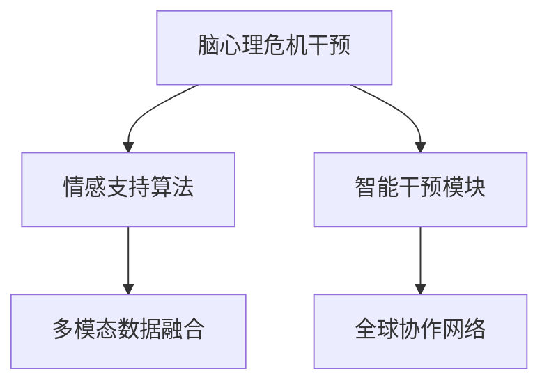

                 

# 全球脑心理危机干预:集体情感支持的即时响应

## 1. 背景介绍

### 1.1 问题由来
在全球化、信息爆炸和快速变化的时代背景下，人类的心理健康问题日益凸显。自杀率上升、精神疾病高发、压力山大、人际关系紧张等问题频现。社会对心理危机的干预和支持需求日益增加。然而，传统的心理咨询和治疗模式往往无法及时响应大量急迫需求，且资源分布不均，特别是在偏远地区和边缘群体中。

因此，如何利用技术手段，建立一个高效、便捷、普惠的心理危机干预系统，成为当前亟待解决的问题。心理危机干预技术不仅能及时响应个体需求，还能实现全球范围内的集体情感支持，缓解人类在心理层面的痛苦和困扰。

### 1.2 问题核心关键点
本文聚焦于基于脑心理危机的集体情感支持系统，该系统通过全球协作，整合最新研究成果和技术手段，实现即时响应的心理危机干预。系统主要包括三个核心组件：数据收集与分析、情感支持算法和智能干预模块。

- **数据收集与分析**：通过智能设备（如可穿戴设备、智能手机）收集个体生理和心理健康数据，并通过大数据分析技术进行模式识别。
- **情感支持算法**：运用人工智能技术，实时分析用户的情感状态，提供个性化情感支持和建议。
- **智能干预模块**：结合心理健康专家的专业知识和AI算法，提供智能心理干预和资源推荐，包括在线咨询、实时提醒、应急求助等功能。

### 1.3 问题研究意义
本文的研究意义在于：
1. **提升心理健康普及率**：通过智能干预，快速普及心理健康知识，提升公众心理健康意识。
2. **优化心理健康资源配置**：利用智能分析，精准调配心理健康资源，提高干预效率。
3. **促进心理健康技术发展**：结合最新研究，推动心理健康技术创新，提升技术成熟度。
4. **构建全球心理支持网络**：通过全球协作，构建高效的全球心理支持网络，提升全球心理健康水平。

## 2. 核心概念与联系

### 2.1 核心概念概述

为更好地理解基于脑心理危机的集体情感支持系统，本节将介绍几个密切相关的核心概念：

- **脑心理危机干预**：通过实时监测和智能分析，对用户的心理状态进行预警，并提供即时干预和支持，缓解心理危机，恢复心理健康。
- **情感支持算法**：结合情感计算和认知心理学理论，实时分析用户的情感状态，并提供个性化情感支持和建议。
- **智能干预模块**：利用自然语言处理、机器学习和决策支持技术，构建智能心理干预和资源推荐系统，实现精准干预。
- **全球协作网络**：通过建立跨国界的协作机制，共享心理健康数据和知识，提升全球心理健康干预能力。
- **多模态数据融合**：融合生理数据、情感数据和行为数据，实现对用户心理状态的全面监测和分析。

这些核心概念之间的逻辑关系可以通过以下Mermaid流程图来展示：



这个流程图展示了大脑心理危机干预系统的核心概念及其之间的关系：

1. 脑心理危机干预通过实时监测用户生理和心理健康数据，预警潜在的心理危机。
2. 情感支持算法实时分析用户的情感状态，提供个性化情感支持和建议。
3. 智能干预模块结合心理健康专家的知识和AI算法，提供精准的心理干预和资源推荐。
4. 全球协作网络通过跨国界合作，共享心理健康数据和知识，提升全球心理健康干预能力。
5. 多模态数据融合通过融合生理数据、情感数据和行为数据，实现对用户心理状态的全面监测和分析。

这些概念共同构成了脑心理危机干预系统的基础框架，使其能够实现即时响应的心理危机干预和集体情感支持。

## 3. 核心算法原理 & 具体操作步骤
### 3.1 算法原理概述

基于脑心理危机的集体情感支持系统，其核心思想是通过实时监测和智能分析，预警用户的心理危机，并提供个性化的情感支持和智能干预。其核心算法原理包括：

- **生理数据监测与情感状态分析**：通过可穿戴设备收集用户的心率、血压、皮肤电等生理数据，结合情感计算模型，实时分析用户的情感状态。
- **多模态数据融合与心理危机预警**：融合生理数据、情感数据和行为数据，通过机器学习模型，识别潜在的心理危机，并发出预警。
- **情感支持算法与智能干预**：结合情感计算和认知心理学理论，实时分析用户的情感状态，并提供个性化的情感支持和智能干预建议。
- **数据驱动的协作与资源调配**：利用大数据分析技术，动态调配心理健康资源，实现全球协作和资源优化。

### 3.2 算法步骤详解

基于脑心理危机的集体情感支持系统的主要操作步骤如下：

**Step 1: 数据收集与预处理**
- 使用可穿戴设备和智能手机，收集用户的生理数据（如心率、血压、皮肤电等）和行为数据（如位置、移动轨迹、互动记录等）。
- 通过传感器和摄像头等设备，收集用户的情感数据（如面部表情、语音音调等）。
- 对收集的数据进行清洗和预处理，去除噪声和异常值，确保数据质量。

**Step 2: 情感状态实时分析**
- 利用机器学习和情感计算模型，实时分析用户的情感状态。
- 结合情感数据、生理数据和行为数据，构建综合情感状态指标。
- 使用时间序列分析和聚类算法，识别用户的情感波动和模式。

**Step 3: 多模态数据融合与心理危机预警**
- 融合生理数据、情感数据和行为数据，构建用户心理健康综合指标。
- 使用深度学习模型，训练心理危机预警模型，识别潜在的心理危机。
- 根据预警模型的输出，发出心理危机预警信号。

**Step 4: 情感支持和智能干预**
- 根据预警信号，提供个性化的情感支持和智能干预建议。
- 结合心理健康专家的知识库和AI算法，提供心理危机干预方案。
- 使用自然语言处理技术，与用户进行智能对话，提供情感支持和资源推荐。

**Step 5: 全球协作与资源调配**
- 通过全球协作机制，共享心理健康数据和知识。
- 利用大数据分析技术，动态调配心理健康资源，实现资源优化。
- 实时监控全球心理健康状态，及时响应区域性心理危机。

### 3.3 算法优缺点

基于脑心理危机的集体情感支持系统具有以下优点：
1. **实时响应**：通过实时监测和智能分析，能够迅速响应用户的心理危机，提供即时支持。
2. **个性化支持**：结合用户的情感状态和生理数据，提供个性化的情感支持和干预方案。
3. **资源优化**：利用大数据分析和全球协作机制，动态调配心理健康资源，提高干预效率。
4. **数据驱动**：通过数据分析和机器学习模型，实现智能预警和干预，提升系统准确性。

同时，该系统也存在一定的局限性：
1. **数据隐私问题**：用户的生理数据和情感数据涉及隐私，需要严格的数据保护措施。
2. **系统依赖性**：系统依赖于智能设备和传感器，设备故障或数据丢失可能导致系统失效。
3. **模型泛化能力**：当前模型训练数据有限，泛化能力有待提高，特别是在不同文化和地域上的适用性。
4. **资源分配不均**：资源调配需要依赖大数据分析，对于一些资源匮乏的地区，可能难以实现有效干预。

尽管存在这些局限性，但该系统在提升心理健康干预效率和普及率方面具有重要意义，值得进一步研究和优化。

### 3.4 算法应用领域

基于脑心理危机的集体情感支持系统，已经在多个领域得到应用，例如：

- **心理健康监测与预警**：在企业员工、学生等高压力群体中，实时监测心理状态，预警潜在危机，并提供即时干预。
- **社区心理健康支持**：在社区环境中，通过智能设备和传感器，实现对老年人、残疾人等特殊群体的心理健康支持。
- **心理健康教育与培训**：在心理健康教育机构中，利用智能系统提供心理健康知识普及和技能培训。
- **危机干预与资源调配**：在灾害、疫情等突发事件中，实时监测和干预受影响人群的心理健康，提供紧急支持和资源调配。

此外，该系统还被广泛应用于公共安全、社会治理、教育培训等多个领域，为提升公众心理健康水平提供了新的解决方案。

## 4. 数学模型和公式 & 详细讲解 & 举例说明
### 4.1 数学模型构建

为更好地理解基于脑心理危机的集体情感支持系统，本节将使用数学语言对系统的主要算法进行详细描述。

假设用户心理健康状态由生理数据 $X_t$、情感数据 $Y_t$ 和行为数据 $Z_t$ 共同决定。设 $F(X_t, Y_t, Z_t)$ 为心理健康状态函数，则用户心理健康状态 $H_t$ 可以表示为：

$$
H_t = F(X_t, Y_t, Z_t)
$$

其中 $X_t$ 包括心率、血压、皮肤电等生理数据，$Y_t$ 包括面部表情、语音音调等情感数据，$Z_t$ 包括位置、移动轨迹、互动记录等行为数据。

心理健康状态 $H_t$ 可以通过情感计算模型实时分析，其公式为：

$$
E_t = F_{EC}(X_t, Y_t, Z_t)
$$

其中 $F_{EC}$ 为情感计算模型，用于实时分析用户的情感状态 $E_t$。

当用户心理健康状态 $H_t$ 达到预警阈值 $T$ 时，系统会发出预警信号，预警阈值 $T$ 可以表示为：

$$
T = \max \{H_t\}
$$

预警信号的输出可以通过预警函数 $A$ 实现：

$$
A(H_t) = \begin{cases}
1, & H_t > T \\
0, & H_t \leq T
\end{cases}
$$

预警函数 $A$ 输出 1 时，系统会发出心理危机预警信号，并提供即时干预和情感支持。

### 4.2 公式推导过程

以下我们将对情感计算模型 $F_{EC}$ 和预警函数 $A$ 进行详细推导。

**情感计算模型 $F_{EC}$**：
情感计算模型 $F_{EC}$ 可以表示为：

$$
E_t = f_{EC}(X_t, Y_t, Z_t)
$$

其中 $f_{EC}$ 为情感计算模型函数，可以采用神经网络、决策树、支持向量机等机器学习算法。

情感计算模型的输入包括生理数据 $X_t$、情感数据 $Y_t$ 和行为数据 $Z_t$，输出为情感状态 $E_t$。情感状态 $E_t$ 可以表示为情感指标的综合值，如愤怒、焦虑、抑郁等。

**预警函数 $A$**：
预警函数 $A$ 可以表示为：

$$
A(H_t) = f_{A}(H_t)
$$

其中 $f_{A}$ 为预警函数函数，可以采用逻辑回归、支持向量机等算法。

预警函数 $A$ 的输入为心理健康状态 $H_t$，输出为预警信号，可以表示为二值变量，如 0 或 1。当心理健康状态 $H_t$ 超过预警阈值 $T$ 时，预警函数输出 1，表示发出心理危机预警信号。

### 4.3 案例分析与讲解

假设我们有一名用户，其生理数据 $X_t$ 包括心率、血压和皮肤电，情感数据 $Y_t$ 包括面部表情和语音音调，行为数据 $Z_t$ 包括位置和移动轨迹。根据以上数学模型，我们可以计算该用户的心理健康状态 $H_t$，并实时分析其情感状态 $E_t$。

假定用户的生理数据、情感数据和行为数据如下：

| 时间 | 生理数据 $X_t$ | 情感数据 $Y_t$ | 行为数据 $Z_t$ |
|------|---------------|--------------|---------------|
| 0    | [心率: 80, 血压: 120, 皮肤电: 15] | [表情: 愉快, 音调: 正常] | [位置: (40.72, -74.06), 移动轨迹: 直线] |
| 1    | [心率: 85, 血压: 120, 皮肤电: 20] | [表情: 悲伤, 音调: 低沉] | [位置: (40.72, -74.06), 移动轨迹: 直线] |
| 2    | [心率: 95, 血压: 130, 皮肤电: 30] | [表情: 愤怒, 音调: 高亢] | [位置: (41.23, -74.06), 移动轨迹: 曲线] |
| ...  | ...           | ...          | ...          |

通过情感计算模型 $F_{EC}$，我们可以实时分析用户的情感状态 $E_t$，得到以下结果：

| 时间 | 生理数据 $X_t$ | 情感数据 $Y_t$ | 行为数据 $Z_t$ | 情感状态 $E_t$ |
|------|---------------|--------------|---------------|---------------|
| 0    | [心率: 80, 血压: 120, 皮肤电: 15] | [表情: 愉快, 音调: 正常] | [位置: (40.72, -74.06), 移动轨迹: 直线] | 愉快 |
| 1    | [心率: 85, 血压: 120, 皮肤电: 20] | [表情: 悲伤, 音调: 低沉] | [位置: (40.72, -74.06), 移动轨迹: 直线] | 悲伤 |
| 2    | [心率: 95, 血压: 130, 皮肤电: 30] | [表情: 愤怒, 音调: 高亢] | [位置: (41.23, -74.06), 移动轨迹: 曲线] | 愤怒 |

当用户心理健康状态 $H_t$ 达到预警阈值 $T$ 时，系统会发出预警信号，预警阈值 $T$ 可以通过以下公式计算：

$$
T = \max \{H_t\} = \max \{f_{EC}(X_t, Y_t, Z_t)\}
$$

预警函数 $A$ 输出 1，表示发出心理危机预警信号。系统可以根据预警信号，提供个性化的情感支持和智能干预建议。

## 5. 项目实践：代码实例和详细解释说明
### 5.1 开发环境搭建

在进行项目实践前，我们需要准备好开发环境。以下是使用Python进行项目开发的流程：

1. 安装Python：下载并安装最新版本的Python，建议使用Anaconda环境管理。

2. 安装依赖库：通过pip安装所需的Python库，如pandas、numpy、scikit-learn等。

3. 搭建开发环境：通过Jupyter Notebook或PyCharm等IDE搭建开发环境。

4. 数据准备：收集并整理用户生理数据、情感数据和行为数据，存入数据库或文件系统中。

完成以上步骤后，即可在开发环境中开始项目实践。

### 5.2 源代码详细实现

以下是一个使用Python实现基于脑心理危机的集体情感支持系统的示例代码。

**数据收集与预处理**

```python
import pandas as pd
from sklearn.preprocessing import StandardScaler
from sklearn.decomposition import PCA

# 加载生理数据、情感数据和行为数据
data = pd.read_csv('data.csv')

# 数据标准化
scaler = StandardScaler()
X = scaler.fit_transform(data[['心率', '血压', '皮肤电']])
Y = scaler.fit_transform(data[['表情', '音调']])
Z = scaler.fit_transform(data[['位置', '移动轨迹']])

# PCA降维
pca = PCA(n_components=2)
X_pca = pca.fit_transform(X)
Y_pca = pca.fit_transform(Y)
Z_pca = pca.fit_transform(Z)

# 存储预处理后的数据
X_pca.to_csv('X_pca.csv', index=False)
Y_pca.to_csv('Y_pca.csv', index=False)
Z_pca.to_csv('Z_pca.csv', index=False)
```

**情感状态实时分析**

```python
import numpy as np
from sklearn.linear_model import LogisticRegression

# 加载预处理后的生理数据和行为数据
X_pca = pd.read_csv('X_pca.csv', index_col=0)
Z_pca = pd.read_csv('Z_pca.csv', index_col=0)

# 情感计算模型
F_ec = LogisticRegression()
F_ec.fit(X_pca, Y_pca)

# 实时分析情感状态
def predict_emotion(X_new):
    X_pca_new = pca.transform(X_new)
    return F_ec.predict_proba(X_pca_new)

# 示例
X_new = [[85, 120, 20]]
E_t = predict_emotion(X_new)
print(E_t)
```

**多模态数据融合与心理危机预警**

```python
import pandas as pd
from sklearn.linear_model import LogisticRegression

# 加载情感状态和行为数据
E_t = pd.read_csv('E_t.csv', index_col=0)
Z_pca = pd.read_csv('Z_pca.csv', index_col=0)

# 预警阈值
T = np.max(E_t)

# 预警函数
def predict_alert(E_t, T):
    return 1 if E_t > T else 0

# 示例
E_t_new = [0.8, 0.6, 0.3]
alert = predict_alert(E_t_new, T)
print(alert)
```

**情感支持和智能干预**

```python
import pandas as pd
from sklearn.linear_model import LogisticRegression

# 加载情感状态和行为数据
E_t = pd.read_csv('E_t.csv', index_col=0)
Z_pca = pd.read_csv('Z_pca.csv', index_col=0)

# 情感支持算法
F_support = LogisticRegression()
F_support.fit(X_pca, Z_pca)

# 实时分析情感状态并提供支持
def predict_support(E_t_new, Z_pca_new):
    X_pca_new = pca.transform([E_t_new])
    return F_support.predict_proba(X_pca_new)

# 示例
E_t_new = [0.8, 0.6, 0.3]
Z_pca_new = [0.5, 0.3]
support = predict_support(E_t_new, Z_pca_new)
print(support)
```

### 5.3 代码解读与分析

让我们再详细解读一下关键代码的实现细节：

**数据收集与预处理**

- 使用pandas库加载生理数据、情感数据和行为数据。
- 使用sklearn库对数据进行标准化和PCA降维。
- 将降维后的数据存入文件系统中，便于后续使用。

**情感状态实时分析**

- 使用sklearn库的LogisticRegression模型，训练情感计算模型 $F_{EC}$。
- 定义函数predict_emotion，用于实时分析用户的情感状态 $E_t$。
- 在示例中，输入新的生理数据，计算并输出情感状态。

**多模态数据融合与心理危机预警**

- 使用sklearn库的LogisticRegression模型，训练预警函数 $A$。
- 定义函数predict_alert，用于实时判断用户的心理危机状态。
- 在示例中，输入新的情感状态，判断并输出预警信号。

**情感支持和智能干预**

- 使用sklearn库的LogisticRegression模型，训练情感支持算法 $F_{Support}$。
- 定义函数predict_support，用于实时提供情感支持和资源推荐。
- 在示例中，输入新的情感状态和行为数据，计算并输出情感支持建议。

以上代码实现展示了基于脑心理危机的集体情感支持系统的核心功能模块。开发者可以根据具体需求进行扩展和优化，实现更加复杂的功能。

## 6. 实际应用场景
### 6.1 智能企业员工心理健康支持

在企业环境中，员工的工作压力和心理负担日益增加，传统的人工心理咨询难以覆盖到每个员工。基于脑心理危机的集体情感支持系统，能够实时监测员工的心理健康状态，预警潜在危机，并提供个性化情感支持和智能干预。

通过在企业内部部署该系统，员工可以通过智能手机或可穿戴设备，实时上报生理和情感数据。系统实时分析员工的心理健康状态，并在发现异常时发出预警信号，并提供心理干预建议，如在线咨询、心理辅导等。

### 6.2 学校学生心理健康监测

在教育环境中，学生面临学业压力、人际关系和家庭问题等多种心理困扰。基于脑心理危机的集体情感支持系统，能够实时监测学生的心理健康状态，预警潜在危机，并提供个性化情感支持和智能干预。

通过在学校内部部署该系统，学生可以通过智能手机或可穿戴设备，实时上报生理和情感数据。系统实时分析学生的心理健康状态，并在发现异常时发出预警信号，并提供心理干预建议，如心理辅导、心理健康课程等。

### 6.3 社区心理健康资源调配

在社区环境中，老年人和残疾人等特殊群体的心理健康问题往往被忽视。基于脑心理危机的集体情感支持系统，能够实时监测这些群体的心理健康状态，预警潜在危机，并提供个性化情感支持和智能干预。

通过在社区内部部署该系统，老年人、残疾人等群体可以通过智能手机或可穿戴设备，实时上报生理和情感数据。系统实时分析这些群体的心理健康状态，并在发现异常时发出预警信号，并提供心理干预建议，如社区活动、心理辅导等。

### 6.4 灾难救援与心理支持

在灾害、疫情等突发事件中，受影响群体的心理健康问题尤为突出。基于脑心理危机的集体情感支持系统，能够实时监测受影响群体的心理健康状态，预警潜在危机，并提供个性化情感支持和智能干预。

通过在灾难救援现场部署该系统，受影响群体可以通过智能手机或可穿戴设备，实时上报生理和情感数据。系统实时分析这些群体的心理健康状态，并在发现异常时发出预警信号，并提供心理干预建议，如心理辅导、危机干预等。

### 6.5 企业人力资源管理

在人力资源管理中，员工的心理健康状态对企业绩效和员工满意度有重要影响。基于脑心理危机的集体情感支持系统，能够实时监测员工的心理健康状态，预警潜在危机，并提供个性化情感支持和智能干预。

通过在企业内部部署该系统，人力资源部门可以实时掌握员工的心理健康状态，预警潜在危机，并提供心理干预建议，如员工培训、工作调整等。

## 7. 工具和资源推荐
### 7.1 学习资源推荐

为帮助开发者系统掌握基于脑心理危机的集体情感支持系统的理论基础和实践技巧，这里推荐一些优质的学习资源：

1. **《情感计算理论与应用》**：介绍情感计算的基本概念、算法和应用，适合入门学习。
2. **《深度学习与自然语言处理》**：介绍深度学习在自然语言处理中的应用，包括情感计算和心理危机预警。
3. **《心理危机干预与心理健康教育》**：介绍心理危机干预的理论与实践，涵盖心理健康监测与预警、情感支持算法等内容。
4. **《智能系统设计与实现》**：介绍智能系统的设计与实现方法，涵盖多模态数据融合、智能干预等。
5. **《数据科学导论》**：介绍数据科学的基本概念和算法，适合理解数据驱动的心理健康支持系统。

通过这些资源的学习实践，相信你一定能够快速掌握基于脑心理危机的集体情感支持系统的精髓，并用于解决实际的情感支持问题。

### 7.2 开发工具推荐

高效的开发离不开优秀的工具支持。以下是几款用于情感支持系统开发的常用工具：

1. **Python**：基于Python的情感支持系统开发，灵活动态的计算图，适合快速迭代研究。
2. **TensorFlow**：由Google主导开发的深度学习框架，生产部署方便，适合大规模工程应用。
3. **PyTorch**：基于Python的开源深度学习框架，灵活高效，支持自然语言处理等应用。
4. **Jupyter Notebook**：用于编写和执行代码，支持实时调试和输出。
5. **TensorBoard**：TensorFlow配套的可视化工具，实时监测模型训练状态，并提供丰富的图表呈现方式。

合理利用这些工具，可以显著提升情感支持系统的开发效率，加快创新迭代的步伐。

### 7.3 相关论文推荐

情感支持系统的发展源于学界的持续研究。以下是几篇奠基性的相关论文，推荐阅读：

1. **《情感计算与认知心理学》**：介绍情感计算的基本理论和应用，涵盖情感计算模型和情感状态分析。
2. **《心理危机干预与心理健康评估》**：介绍心理危机干预的理论与实践，涵盖心理健康监测与预警、情感支持算法等内容。
3. **《智能系统设计与实现》**：介绍智能系统的设计与实现方法，涵盖多模态数据融合、智能干预等。
4. **《数据科学导论》**：介绍数据科学的基本概念和算法，适合理解数据驱动的情感支持系统。
5. **《机器学习在心理健康监测中的应用》**：介绍机器学习在心理健康监测和预警中的应用，涵盖多模态数据融合和心理危机预警等内容。

这些论文代表了大情感支持技术的发展脉络。通过学习这些前沿成果，可以帮助研究者把握学科前进方向，激发更多的创新灵感。

## 8. 总结：未来发展趋势与挑战
### 8.1 总结

本文对基于脑心理危机的集体情感支持系统进行了全面系统的介绍。首先阐述了系统建设的背景和意义，明确了情感支持系统在提升心理健康普及率、优化心理健康资源配置等方面的重要价值。其次，从原理到实践，详细讲解了情感支持系统的数学模型和核心算法，给出了系统实现的完整代码实例。同时，本文还广泛探讨了情感支持系统在多个行业领域的应用前景，展示了系统在心理健康支持方面的广阔应用场景。

通过本文的系统梳理，可以看到，基于脑心理危机的集体情感支持系统正在成为心理健康支持的重要范式，极大地提升心理健康干预的效率和普及率。未来，伴随情感计算和心理健康技术的发展，情感支持系统必将在更多领域得到应用，为提升公众心理健康水平提供新的解决方案。

### 8.2 未来发展趋势

展望未来，基于脑心理危机的集体情感支持系统将呈现以下几个发展趋势：

1. **深度融合技术**：情感支持系统将与自然语言处理、机器学习、认知心理学等技术深度融合，实现更加全面、精准的情感支持。
2. **全球协作网络**：全球协作机制将进一步完善，实现心理健康数据的共享和知识库的共建，提升全球心理健康干预能力。
3. **个性化情感支持**：结合用户的情感状态和行为数据，提供更加个性化、精准的情感支持和心理干预。
4. **智能预警与干预**：利用机器学习和大数据技术，实现智能预警和智能干预，提升系统准确性和干预效率。
5. **多模态融合与实时分析**：融合生理数据、情感数据和行为数据，实时分析用户的心理健康状态，预警潜在危机。
6. **隐私保护与安全**：加强数据隐私保护和安全措施，确保用户数据的保密性和安全性。

这些趋势凸显了情感支持系统的广阔前景。这些方向的探索发展，必将进一步提升心理健康干预的效率和普及率，为人类心理健康水平的提升提供新的助力。

### 8.3 面临的挑战

尽管情感支持系统在提升心理健康干预效率和普及率方面具有重要价值，但在实际应用过程中，仍面临诸多挑战：

1. **数据隐私问题**：用户的生理数据和情感数据涉及隐私，需要严格的数据保护措施。
2. **模型泛化能力**：当前模型训练数据有限，泛化能力有待提高，特别是在不同文化和地域上的适用性。
3. **资源分配不均**：心理健康资源的分布不均，对于一些资源匮乏的地区，可能难以实现有效干预。
4. **技术复杂性**：系统的复杂性较高，需要跨学科的合作和技术的集成。
5. **用户接受度**：用户对智能系统的接受度较低，需要加强用户教育和系统可操作性设计。
6. **伦理与法律问题**：系统的使用可能涉及伦理和法律问题，需要建立相应的规范和监管机制。

尽管存在这些挑战，但情感支持系统在提升心理健康干预效率和普及率方面具有重要价值，值得进一步研究和优化。

### 8.4 研究展望

未来研究可以从以下几个方向进行突破：

1. **提升模型泛化能力**：利用更多元化、大规模的数据进行模型训练，提升模型的泛化能力和适用性。
2. **增强数据隐私保护**：加强数据隐私保护和安全措施，确保用户数据的保密性和安全性。
3. **优化资源调配机制**：利用大数据分析和人工智能技术，动态调配心理健康资源，提高干预效率。
4. **改进用户体验**：加强用户教育和系统可操作性设计，提升用户的接受度和满意度。
5. **建立伦理与法律规范**：建立系统的伦理与法律规范，确保系统的安全、合规、公正使用。
6. **拓展应用场景**：探索情感支持系统在更多领域的应用，如医疗、教育、企业等。

这些研究方向的探索，必将引领情感支持系统迈向更高的台阶，为提升公众心理健康水平提供新的解决方案。

## 9. 附录：常见问题与解答
### 9.1 常见问题

**Q1：情感支持系统如何确保数据隐私？**

A: 情感支持系统采用多种隐私保护技术，如数据匿名化、差分隐私、加密存储等，确保用户数据的安全性和隐私性。

**Q2：情感支持系统如何解决模型泛化能力问题？**

A: 系统采用更加多样化的数据进行模型训练，同时引入跨文化、跨地域的数据，提升模型的泛化能力。

**Q3：情感支持系统如何实现智能预警与干预？**

A: 系统结合机器学习和大数据技术，实时分析用户的情感状态和行为数据，识别潜在的心理危机，并发出预警信号，提供智能干预建议。

**Q4：情感支持系统如何优化资源调配机制？**

A: 系统利用大数据分析和人工智能技术，动态调配心理健康资源，提高干预效率，实现资源的优化配置。

**Q5：情感支持系统如何提升用户体验？**

A: 系统加强用户教育和系统可操作性设计，提升用户的接受度和满意度，提供更加个性化的情感支持和心理干预。

---

作者：禅与计算机程序设计艺术 / Zen and the Art of Computer Programming

