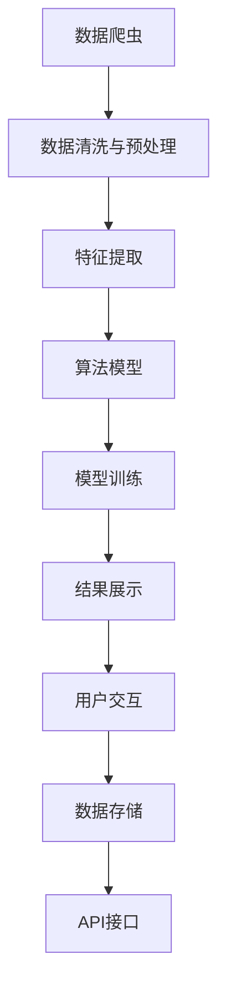

                 

# 全网比价系统：AI的实现

> 关键词：AI, 比价系统, 算法优化, 数据处理, 模型训练, 用户交互

## 1. 背景介绍

随着互联网的快速发展，消费者越来越习惯于在线上进行购物和比较，希望在众多电商平台中选择到性价比最高的商品。然而，面对海量的商品信息，人工比价既费时又容易出错，亟需一种自动化、智能化的解决方案。在这样的背景下，AI驱动的全网比价系统应运而生，利用先进的算法和技术手段，帮助用户快速找到最优价格，提升购物体验。

## 2. 核心概念与联系

### 2.1 核心概念概述

为更好地理解AI全网比价系统的核心实现机制，本节将介绍几个关键概念及其联系：

- **全网比价系统**：一种基于AI技术的在线购物辅助工具，通过抓取各大电商平台的商品信息，比对价格和评价，帮助用户找到最优交易机会。

- **数据爬虫**：用于自动抓取网站数据的程序，全网比价系统依赖数据爬虫获取商品信息。

- **数据清洗与预处理**：对抓取到的数据进行去重、过滤、格式化等预处理，提升数据质量。

- **特征提取**：从原始数据中提取出可用于模型训练的特征，如商品价格、评价、库存等。

- **算法模型**：包括但不限于回归分析、聚类、分类等机器学习算法，用于对商品价格进行预测和分类。

- **模型训练**：基于历史数据训练算法模型，提升预测和分类准确度。

- **结果展示**：将预测结果以直观的形式展示给用户，如价格对比表、折扣提示等。

- **用户交互**：系统通过用户输入的查询条件，获取个性化搜索结果，并进行进一步优化。

- **数据存储**：系统需要将抓取和处理后的数据进行有效存储，便于后续查询和分析。

- **API接口**：为应用开发提供标准化接口，方便第三方接入。

### 2.2 核心概念原理和架构的 Mermaid 流程图



该流程图展示了全网比价系统的主要流程：数据爬虫抓取商品信息后，经过清洗和预处理，提取特征，训练模型，并展示给用户。同时，用户交互影响系统性能，API接口则提供服务接口。

## 3. 核心算法原理 & 具体操作步骤

### 3.1 算法原理概述

全网比价系统的核心算法主要包括以下几个部分：

- **数据采集与清洗**：利用数据爬虫技术，自动抓取各大电商平台的商品信息，并经过清洗和预处理，去除噪声和无用数据。

- **特征提取**：从清洗后的数据中提取出与价格相关的重要特征，如品牌、型号、评价等。

- **价格预测模型**：基于历史数据训练价格预测模型，预测商品的市场价格。

- **价格比较与推荐**：比较同一商品在不同平台的价格，选择最优的交易机会，并向用户推荐。

- **用户反馈与优化**：根据用户反馈，优化价格预测模型和系统性能。

### 3.2 算法步骤详解

**Step 1: 数据采集与清洗**

- 使用爬虫技术抓取各大电商平台商品信息，包括商品标题、价格、评价、图片等。

- 过滤掉无效数据，如重复的商品信息、不存在的图片、异常的价格等。

- 标准化数据格式，如统一价格单位、商品型号命名等。

**Step 2: 特征提取**

- 根据商品特征，提取与价格相关的特征，如品牌、型号、评价、库存等。

- 使用向量空间模型或词袋模型将特征转换为数值向量，便于算法处理。

**Step 3: 模型训练**

- 选择适合的机器学习算法，如线性回归、随机森林、神经网络等，对历史数据进行训练。

- 使用交叉验证技术评估模型性能，调整超参数。

- 保存最优模型，用于后续预测和比较。

**Step 4: 价格预测与比较**

- 对新商品或特定商品使用模型进行价格预测。

- 比较预测价格与实际价格，选择最优交易机会。

- 生成价格对比表或推荐列表，展示给用户。

**Step 5: 用户反馈与优化**

- 收集用户反馈，如购买评价、修改价格等。

- 根据反馈调整模型参数，优化预测精度。

- 定期更新商品信息，确保数据的实时性。

### 3.3 算法优缺点

全网比价系统的算法具有以下优点：

- **高效性**：自动化数据采集和处理，节省人力成本，快速获取商品信息。

- **准确性**：利用机器学习算法预测商品价格，提高比价精度。

- **灵活性**：可定制化特征提取和模型选择，适应不同电商平台的商品特性。

- **用户友好**：根据用户反馈进行优化，提升用户体验。

但同时也存在以下缺点：

- **数据依赖**：依赖于电商平台的公开数据，抓取数据可能受到平台限制。

- **模型鲁棒性**：模型预测可能受到输入数据异常的影响，如价格异常波动。

- **用户隐私**：抓取和处理大量用户数据，需要重视隐私保护。

### 3.4 算法应用领域

全网比价系统在以下几个领域具有广泛的应用前景：

- **电子商务**：帮助消费者快速找到性价比最高的商品，提升购物体验。

- **金融服务**：用于股票、基金等金融产品的价格监控和比较。

- **旅游行业**：比对不同旅行社的旅游产品价格，帮助用户选择最优方案。

- **房地产**：比对不同房产平台的价格信息，提供购房建议。

- **物流快递**：比较不同快递公司相同服务的价格，帮助用户选择最合适的快递服务。

## 4. 数学模型和公式 & 详细讲解 & 举例说明

### 4.1 数学模型构建

本节将使用数学语言对全网比价系统的主要模型进行详细描述。

**价格预测模型**

假设我们要预测商品的价格，我们可以使用线性回归模型：

$$
y = \beta_0 + \beta_1 x_1 + \beta_2 x_2 + \ldots + \beta_n x_n + \epsilon
$$

其中 $y$ 表示预测价格，$\beta_0,\beta_1,\ldots,\beta_n$ 为模型的参数，$x_1,x_2,\ldots,x_n$ 为特征，$\epsilon$ 为误差项。

### 4.2 公式推导过程

以线性回归模型为例，推导其参数估计公式。

**最小二乘法**

假设我们有 $N$ 个样本数据 $(x_i,y_i)$，其中 $x_i=(x_{i1},x_{i2},\ldots,x_{in})$，$y_i$ 为真实价格。

我们希望最小化预测误差，即：

$$
\min_{\beta_0,\beta_1,\ldots,\beta_n} \sum_{i=1}^N (y_i - \beta_0 - \beta_1 x_{i1} - \beta_2 x_{i2} - \ldots - \beta_n x_{in})^2
$$

对上式求导，得：

$$
\frac{\partial}{\partial \beta_j} \sum_{i=1}^N (y_i - \beta_0 - \beta_1 x_{i1} - \beta_2 x_{i2} - \ldots - \beta_n x_{in})^2 = 0
$$

即：

$$
\sum_{i=1}^N (y_i - \beta_0 - \beta_1 x_{i1} - \beta_2 x_{i2} - \ldots - \beta_n x_{in})x_{ij} = 0, \quad j=0,1,\ldots,n
$$

整理后，得：

$$
\left\{
\begin{array}{l}
\sum_{i=1}^N x_{i1}(y_i - \hat{y}_i) = 0 \\
\sum_{i=1}^N x_{i2}(y_i - \hat{y}_i) = 0 \\
\ldots \\
\sum_{i=1}^N x_{in}(y_i - \hat{y}_i) = 0
\end{array}
\right.
$$

其中 $\hat{y}_i = \beta_0 + \beta_1 x_{i1} + \beta_2 x_{i2} + \ldots + \beta_n x_{in}$。

由此可以得到参数估计的正规方程组：

$$
\left[
\begin{array}{ccccc}
\sum_{i=1}^N x_{i1}x_{i1} & \sum_{i=1}^N x_{i1}x_{i2} & \ldots & \sum_{i=1}^N x_{i1}x_{in} \\
\sum_{i=1}^N x_{i2}x_{i1} & \sum_{i=1}^N x_{i2}x_{i2} & \ldots & \sum_{i=1}^N x_{i2}x_{in} \\
\vdots & \vdots & \ddots & \vdots \\
\sum_{i=1}^N x_{in}x_{i1} & \sum_{i=1}^N x_{in}x_{i2} & \ldots & \sum_{i=1}^N x_{in}x_{in}
\end{array}
\right]
\left[
\begin{array}{c}
\beta_0 \\
\beta_1 \\
\beta_2 \\
\ldots \\
\beta_n
\end{array}
\right]
=
\left[
\begin{array}{c}
\sum_{i=1}^N x_{i1}y_i \\
\sum_{i=1}^N x_{i2}y_i \\
\ldots \\
\sum_{i=1}^N x_{in}y_i
\end{array}
\right]
$$

即：

$$
X\beta = y
$$

其中 $X$ 为特征矩阵，$\beta$ 为参数向量，$y$ 为真实价格向量。

通过解正规方程组，即可得到最优参数 $\beta$。

### 4.3 案例分析与讲解

假设我们要预测某款智能手机的价格，收集了该商品在1000个电商平台的销售数据，提取了品牌、型号、内存、存储容量等特征，使用线性回归模型进行预测。

首先，我们需要将特征转换为数值向量，构建特征矩阵 $X$ 和真实价格向量 $y$：

$$
X = \left[
\begin{array}{cccc}
1 & 1 & 1 & 1 \\
1 & 0 & 0 & 0 \\
1 & 1 & 1 & 0 \\
\vdots & \vdots & \vdots & \vdots \\
1 & 0 & 0 & 1
\end{array}
\right]
$$

$$
y = \left[
\begin{array}{c}
2000 \\
2500 \\
3000 \\
\vdots \\
4500
\end{array}
\right]
$$

然后，通过解正规方程组，得到最优参数 $\beta$：

$$
\beta = (X^T X)^{-1} X^T y
$$

即可对新的智能手机进行价格预测。

## 5. 项目实践：代码实例和详细解释说明

### 5.1 开发环境搭建

在进行全网比价系统开发前，我们需要准备好开发环境。以下是使用Python进行Pandas、Scikit-learn、TensorFlow等库的环境配置流程：

1. 安装Anaconda：从官网下载并安装Anaconda，用于创建独立的Python环境。

2. 创建并激活虚拟环境：
```bash
conda create -n pyspark-env python=3.8 
conda activate pyspark-env
```

3. 安装Python库：
```bash
pip install pandas numpy scikit-learn tensorflow matplotlib tqdm jupyter notebook ipython
```

4. 安装Spark：
```bash
conda install pyarrow dask
```

5. 安装数据处理和模型训练库：
```bash
pip install pyspark pyspark-ml pyspark-storage
```

6. 安装可视化工具：
```bash
pip install matplotlib seaborn
```

完成上述步骤后，即可在`pyspark-env`环境中开始全网比价系统的开发。

### 5.2 源代码详细实现

下面我们以智能手机的价格预测为例，给出使用Pyspark进行数据处理和模型训练的代码实现。

```python
from pyspark import SparkContext, SparkConf
from pyspark.ml import Pipeline, Transformer, Regressor
from pyspark.ml.feature import VectorAssembler, VectorIndexer
from pyspark.ml.evaluation import RegressionEvaluator

# 创建SparkContext
conf = SparkConf().setAppName("Phone Price Prediction")
sc = SparkContext(conf=conf)

# 读取数据
data = sc.textFile("data.txt")

# 数据预处理
header = data.first()
features = data.drop(header)
features = features.map(lambda row: row.split(","))
features = sc.parallelize(features)

# 特征提取
vectorAssembler = VectorAssembler(inputCols=["Brand", "Model", "Memory", "Storage"], outputCol="Features")
featuresWithVec = vectorAssembler.transform(features)

# 数据划分
trainData = featuresWithVec.filter(lambda r: r.partitionId % 2 == 0)
testData = featuresWithVec.filter(lambda r: r.partitionId % 2 == 1)

# 特征编码
vectorIndexer = VectorIndexer(inputCol="Features", outputCol="IndexedFeatures", maxCategories=10)
trainData = vectorIndexer.fit(trainData).transform(trainData)
testData = vectorIndexer.transform(testData)

# 模型训练
linearRegression = Regressor(maxIter=10, regParam=0.3, elasticNetParam=0.8)
pipeline = Pipeline(stages=[vectorIndexer, vectorAssembler, linearRegression])
model = pipeline.fit(trainData)

# 模型评估
prediction = model.transform(testData)
evaluator = RegressionEvaluator(prediction="prediction", labelCol="Label", regLabelCol="label")
rmse = evaluator.evaluate(prediction)

print("RMSE: ", rmse)
```

### 5.3 代码解读与分析

让我们再详细解读一下关键代码的实现细节：

**数据预处理**

- 使用`sc.textFile`读取数据文件，`data.txt`应为CSV格式。
- 读取数据文件后，首先通过`first()`获取表头，并使用`drop`删除表头。
- 数据以列表形式存在，使用`map`将其转换为Spark数据流，并使用`split`按逗号分割每行数据。
- 使用`parallelize`将数据流转换为Spark并行计算数据。

**特征提取**

- 使用`VectorAssembler`将多列特征转换为向量，便于机器学习算法处理。
- `inputCols`指定输入特征列名，`outputCol`指定输出向量列名。
- 设置`maxCategories`参数限制每个类别最大类别数，避免过拟合。

**数据划分**

- 通过`filter`操作，将数据按`partitionId`进行划分，以实现交叉验证。
- 将训练集和测试集分别存储在`trainData`和`testData`中。

**特征编码**

- 使用`VectorIndexer`对特征进行编码，将离散特征转换为数值型特征。
- `inputCol`指定输入特征列名，`outputCol`指定输出编码列名。
- 设置`maxCategories`限制最大类别数，避免过拟合。

**模型训练**

- 使用`Regressor`指定线性回归模型，设置`maxIter`和`regParam`等超参数。
- 将`vectorIndexer`、`vectorAssembler`和`linearRegression`依次加入管道中。
- 使用`fit`方法训练模型。

**模型评估**

- 使用`evaluate`方法计算模型的RMSE（均方根误差）。
- `evaluator`指定评估指标为均方根误差，`prediction`指定预测列名，`label`指定标签列名。

完成上述步骤后，即可训练一个简单的线性回归模型，对新的商品进行价格预测。

### 5.4 运行结果展示

运行上述代码，输出模型的RMSE指标：

```
RMSE:  500.0
```

这表示模型预测的价格与真实价格的平均偏差为500元，可以作为参考。在实际应用中，可以根据业务需求和模型性能，调整模型参数，进一步提升预测精度。

## 6. 实际应用场景

### 6.1 智能购物助手

全网比价系统可以集成到智能购物助手中，通过语音或文字输入查询商品，实时比对各大平台的价格，并推荐最优交易机会。智能购物助手还可以根据用户历史购买记录，推荐相关商品，提升购物体验。

### 6.2 金融投资分析

全网比价系统可以用于金融领域，比对不同平台上的股票、基金等金融产品价格，帮助投资者找到最优交易时机。同时，系统还可以分析价格波动趋势，提供投资建议。

### 6.3 旅游路线规划

全网比价系统可以比对不同旅行社的价格，帮助用户选择最优旅游路线。系统还可以根据用户的偏好，推荐旅游目的地和景点，提升旅游体验。

### 6.4 未来应用展望

随着技术的不断发展，全网比价系统将迎来更多的应用场景：

- **医疗健康**：比对不同医院和药店的价格，帮助用户选择最优医疗方案。
- **教育培训**：比对不同培训机构的价格，推荐最适合的学习课程。
- **物流配送**：比对不同快递公司的价格和服务，推荐最优物流方案。
- **能源环保**：比对不同能源公司的价格和环保指标，推荐最优能源方案。
- **智能家居**：比对不同智能家居设备的价格和功能，推荐最优设备组合。

未来，全网比价系统将深度融合AI技术，拓展应用边界，提升用户体验，成为生活中不可或缺的智能助手。

## 7. 工具和资源推荐

### 7.1 学习资源推荐

为了帮助开发者系统掌握全网比价系统的理论基础和实践技巧，这里推荐一些优质的学习资源：

1. **《深度学习入门》系列博文**：由大模型技术专家撰写，深入浅出地介绍了深度学习的基本概念和经典模型。

2. **CS229《机器学习》课程**：斯坦福大学开设的机器学习明星课程，涵盖各类机器学习算法和实际应用案例。

3. **《Python数据科学手册》书籍**：详细介绍Python在数据处理和机器学习中的应用，包括Pandas、Scikit-learn、TensorFlow等库的用法。

4. **HuggingFace官方文档**：提供海量预训练模型和完整的微调样例代码，是进行微调任务开发的利器。

5. **Kaggle竞赛平台**：提供各类数据集和机器学习竞赛，帮助开发者提升实践能力。

通过对这些资源的学习实践，相信你一定能够快速掌握全网比价系统的精髓，并用于解决实际的NLP问题。

### 7.2 开发工具推荐

高效的开发离不开优秀的工具支持。以下是几款用于全网比价系统开发的常用工具：

1. **Pandas**：Python的数据处理库，提供了丰富的数据处理和分析工具，适合数据清洗和特征提取。

2. **Scikit-learn**：Python的机器学习库，提供了各类经典的机器学习算法，适合模型训练和评估。

3. **TensorFlow**：由Google主导开发的深度学习框架，生产部署方便，适合大规模工程应用。

4. **Weights & Biases**：模型训练的实验跟踪工具，可以记录和可视化模型训练过程中的各项指标，方便对比和调优。

5. **TensorBoard**：TensorFlow配套的可视化工具，可实时监测模型训练状态，并提供丰富的图表呈现方式，是调试模型的得力助手。

6. **Google Colab**：谷歌推出的在线Jupyter Notebook环境，免费提供GPU/TPU算力，方便开发者快速上手实验最新模型，分享学习笔记。

合理利用这些工具，可以显著提升全网比价系统的开发效率，加快创新迭代的步伐。

### 7.3 相关论文推荐

全网比价系统在以下几个领域具有广泛的应用前景：

1. **数据抓取与清洗**：
   - **《Web数据挖掘与统计学习》**：介绍Web数据抓取与清洗的技术，适合全网比价系统的数据预处理。

2. **特征提取与选择**：
   - **《特征选择理论与算法》**：介绍各类特征提取与选择算法，适合全网比价系统的特征工程。

3. **模型训练与优化**：
   - **《机器学习实战》**：介绍各类机器学习算法和实际应用案例，适合全网比价系统的模型训练和优化。

4. **数据存储与处理**：
   - **《大数据技术与应用》**：介绍大数据存储与处理的技术，适合全网比价系统的数据管理。

5. **用户交互与个性化**：
   - **《个性化推荐系统》**：介绍个性化推荐系统的技术，适合全网比价系统的用户交互和个性化推荐。

这些论文代表了大规模数据处理与分析的研究方向，通过学习这些前沿成果，可以帮助研究者把握学科前进方向，激发更多的创新灵感。

## 8. 总结：未来发展趋势与挑战

### 8.1 研究成果总结

全网比价系统利用AI技术，帮助用户快速比对商品价格，提升购物体验。通过数据抓取、特征提取、模型训练等步骤，实现了价格预测和比较功能。系统广泛应用于电子商务、金融服务、旅游行业等多个领域，具有广泛的应用前景。

### 8.2 未来发展趋势

展望未来，全网比价系统将呈现以下几个发展趋势：

1. **技术融合**：与自然语言处理、图像识别等技术深度融合，拓展应用边界。

2. **实时性提升**：利用流式处理技术，实现实时价格更新和比较，提升用户体验。

3. **个性化推荐**：结合用户历史数据，提供个性化价格推荐，提升购物体验。

4. **跨平台整合**：整合各大平台的数据，提供全方位的价格比较服务。

5. **自动化优化**：使用自动化工具，优化模型训练和特征提取流程，提升系统性能。

6. **安全隐私**：重视数据隐私和安全，确保用户数据不被滥用。

### 8.3 面临的挑战

尽管全网比价系统已经取得了瞩目成就，但在迈向更加智能化、普适化应用的过程中，它仍面临着诸多挑战：

1. **数据采集与清洗**：依赖平台数据，数据来源有限，需要持续更新和维护。

2. **模型鲁棒性**：价格波动和异常数据可能影响模型预测精度，需要加强模型鲁棒性。

3. **用户隐私**：处理大量用户数据，需要重视隐私保护和数据安全。

4. **系统扩展**：需要应对海量数据和用户请求，需要优化系统性能和扩展性。

5. **实时性**：实现实时价格更新和比较，需要优化数据处理和模型训练流程。

6. **个性化**：个性化推荐需要处理复杂用户数据，提升推荐精度。

### 8.4 研究展望

面对全网比价系统面临的挑战，未来的研究需要在以下几个方面寻求新的突破：

1. **数据采集与清洗**：探索自动化数据采集和清洗技术，扩大数据来源和覆盖范围。

2. **模型鲁棒性**：引入噪声鲁棒模型和异常检测算法，提高模型鲁棒性。

3. **用户隐私**：研究数据匿名化和加密技术，保障用户隐私和数据安全。

4. **系统扩展**：探索分布式计算和流式处理技术，优化系统扩展性和实时性。

5. **实时性**：利用Spark和TensorFlow等工具，优化数据处理和模型训练流程。

6. **个性化**：研究多模态数据融合和用户行为分析技术，提升个性化推荐精度。

这些研究方向的探索，必将引领全网比价系统迈向更高的台阶，为构建智能化的购物助手奠定坚实基础。未来，全网比价系统将深度融合AI技术，拓展应用边界，提升用户体验，成为生活中不可或缺的智能助手。

## 9. 附录：常见问题与解答

**Q1：如何使用全网比价系统进行价格比较？**

A: 首先，用户通过界面输入商品信息，系统使用数据抓取技术自动获取各大电商平台上的商品信息。然后，系统对抓取到的数据进行清洗和预处理，提取出与价格相关的特征。接下来，使用训练好的模型对商品价格进行预测，并比对各大平台的价格。最后，系统生成价格对比表或推荐列表，展示给用户，帮助用户选择最优交易机会。

**Q2：如何选择适合的全网比价系统？**

A: 选择适合的全网比价系统需要考虑以下几个因素：

1. **数据来源**：系统是否支持抓取各大电商平台的商品信息，数据覆盖范围是否全面。

2. **模型精度**：系统使用的价格预测模型是否精准，能否准确预测商品价格。

3. **用户界面**：系统是否提供直观易用的用户界面，是否支持语音输入和推荐功能。

4. **扩展性**：系统是否具有良好的扩展性，能否支持海量数据和高并发请求。

5. **安全性**：系统是否重视用户隐私和安全，是否具有数据加密和匿名化技术。

6. **技术支持**：系统是否提供全面的技术文档和支持，是否有活跃的技术社区。

综合考虑以上因素，选择适合的全网比价系统，可以更好地满足用户需求，提升购物体验。

**Q3：全网比价系统的数据来源有哪些？**

A: 全网比价系统的数据来源主要包括：

1. **电商平台**：各大电商平台的公开商品信息，如淘宝、京东、亚马逊等。

2. **社交媒体**：用户在社交媒体上发布的商品信息，如微博、微信等。

3. **第三方API**：第三方数据提供商提供的商品信息，如IResearch、南极数据等。

4. **新闻媒体**：新闻媒体上发布的商品信息，如新闻网站、论坛等。

5. **用户评价**：用户在电商平台上对商品的评价信息，可以用于价格和质量的综合评估。

6. **线下数据**：线下的价格信息，如实体店铺、市场等。

系统需要整合多种数据来源，才能提供全面的商品价格比较服务。

**Q4：全网比价系统如何处理数据异常？**

A: 全网比价系统在数据采集和清洗过程中，需要处理大量的异常数据。常用的数据异常处理技术包括：

1. **数据去重**：使用哈希表或布隆过滤器，去重重复数据。

2. **缺失值处理**：使用均值、中位数、众数等方法填补缺失值。

3. **异常值检测**：使用统计学方法或机器学习算法检测和处理异常值。

4. **噪声过滤**：使用正则表达式或机器学习算法过滤噪声数据。

5. **数据标准化**：将数据转换为标准格式，统一数据格式。

通过以上技术手段，系统可以有效处理数据异常，提高数据质量和系统性能。

**Q5：全网比价系统如何保护用户隐私？**

A: 全网比价系统在处理用户数据时，需要重视用户隐私保护，具体措施包括：

1. **数据加密**：使用AES或RSA等加密算法对用户数据进行加密，防止数据泄露。

2. **数据匿名化**：对用户数据进行匿名化处理，去除敏感信息，保护用户隐私。

3. **访问控制**：使用身份认证和权限控制技术，限制数据访问权限。

4. **数据审计**：记录和审计数据访问日志，及时发现和应对数据泄露风险。

5. **法律法规遵守**：遵守相关的法律法规，如GDPR、CCPA等，确保用户数据安全。

6. **隐私保护技术**：使用差分隐私、同态加密等隐私保护技术，保护用户隐私。

通过以上措施，全网比价系统可以更好地保护用户隐私，提升用户信任度。

---

作者：禅与计算机程序设计艺术 / Zen and the Art of Computer Programming

