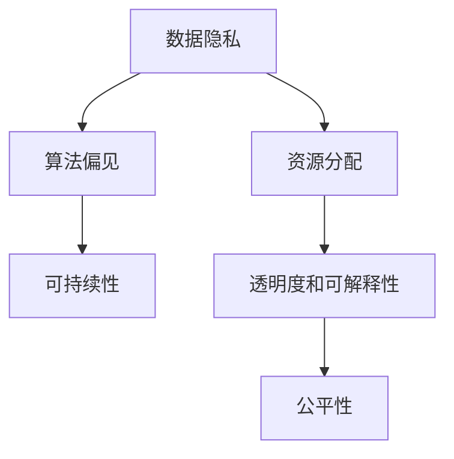

                 

# 公平、公正、可持续：人类计算的伦理

## 1. 背景介绍

在人工智能(AI)技术快速发展的今天，计算能力成为了人类社会进步的重要推动力。从简单的数据分析到复杂的自然语言处理，计算技术在各个领域展现出了巨大潜力。然而，伴随着计算能力的提升，计算伦理问题也逐渐凸显出来，如何在技术进步的同时，确保计算的公平性、公正性和可持续性，成为摆在人类面前的重要课题。

### 1.1 问题由来
随着计算技术的不断进步，人工智能和计算能力逐渐渗透到社会各个领域，从工业制造到金融服务，从医疗健康到教育培训，计算技术无处不在。但是，这些技术的发展也带来了诸多伦理问题，比如数据隐私、算法偏见、资源分配不公等。这些问题不仅影响了个体的生活质量，也引发了公众对于技术公平性和公正性的广泛讨论。

### 1.2 问题核心关键点
计算伦理问题的核心关键点主要包括：
- **数据隐私**：如何保护用户数据隐私，避免数据泄露和滥用。
- **算法偏见**：如何防止算法在训练和应用过程中产生偏见，确保算法的公平性。
- **资源分配**：如何合理分配计算资源，避免资源过度集中导致的社会不公。
- **可持续性**：如何确保计算技术的发展是可持续的，不消耗过多的能源和资源。
- **透明度和可解释性**：如何增强算法的透明度和可解释性，提升用户对算法的信任。

这些问题需要通过技术手段和社会治理相结合的方式来解决，以确保计算技术的健康、公正和可持续发展。

## 2. 核心概念与联系

### 2.1 核心概念概述

为更好地理解计算伦理，本节将介绍几个密切相关的核心概念：

- **数据隐私**：指个人或组织数据的保护状态，防止数据被未经授权的第三方获取或滥用。数据隐私是计算伦理中最为基础的概念，涉及数据的收集、存储、使用等各个环节。
- **算法偏见**：指在算法设计、训练和应用过程中，由于数据、模型设计等因素导致的对某些群体或个体的不公平对待。算法偏见可能来源于训练数据的不平衡、模型的不公平性等。
- **资源分配**：指如何合理分配计算资源，如计算时间、存储空间、带宽等，确保资源分配的公平性和可持续性。
- **可持续性**：指计算技术在长期使用过程中的环境影响和资源消耗情况，确保技术发展不会对环境造成不可逆的破坏。
- **透明度和可解释性**：指算法决策过程的公开性，用户能够理解算法如何做出决策，增强用户对算法的信任。

这些核心概念之间的逻辑关系可以通过以下Mermaid流程图来展示：



这个流程图展示了几大核心概念之间的联系：

1. 数据隐私是计算伦理的基础，直接影响算法的训练和应用。
2. 算法偏见会影响资源的分配和使用，进而影响公平性和可持续性。
3. 透明度和可解释性是增强用户信任的重要手段，间接影响公平性和可持续性。
4. 公平性是最终目标，需要通过数据隐私、算法偏见、资源分配和可持续性等多个方面的努力来实现。

## 3. 核心算法原理 & 具体操作步骤

### 3.1 算法原理概述

计算伦理问题涉及多个领域的算法原理，包括数据隐私保护、算法公平性、资源优化和可持续发展等。下面将分别介绍这些领域的核心算法原理。

#### 3.1.1 数据隐私保护

数据隐私保护的核心算法原理主要基于差分隐私和联邦学习。差分隐私通过对数据进行扰动，确保在统计分析中个体数据不被泄露。联邦学习则在不传输原始数据的情况下，通过模型参数共享实现分布式训练。

#### 3.1.2 算法公平性

算法公平性的核心算法原理包括公平约束和偏见纠正。公平约束通过对算法的训练目标进行限制，确保算法在训练和应用过程中不偏向某一特定群体。偏见纠正则通过重新采样、重加权等技术，消除模型中的固有偏见。

#### 3.1.3 资源优化

资源优化的核心算法原理包括多目标优化和资源弹性调度。多目标优化通过优化多个目标函数，如性能、成本、公平性等，实现资源的综合利用。资源弹性调度则通过动态调整资源分配策略，确保资源的高效使用和公平分配。

#### 3.1.4 可持续发展

可持续发展的核心算法原理包括绿色计算和能源优化。绿色计算通过改进计算硬件和算法设计，降低计算过程的能源消耗。能源优化则通过优化算法的计算图和数据流，提高能源利用效率。

### 3.2 算法步骤详解

#### 3.2.1 数据隐私保护

1. **差分隐私算法**：通过在数据中添加噪声，确保个体数据的隐私性。具体步骤包括：
   - 选择合适的噪声机制，如拉普拉斯噪声、高斯噪声等。
   - 计算隐私预算，确保差分隐私的强度。
   - 在数据中添加噪声，进行统计分析。

2. **联邦学习算法**：通过分布式训练，确保数据隐私。具体步骤包括：
   - 选择合适的联邦学习框架，如TensorFlow Federated、Federated Learning等。
   - 设计分布式训练流程，确保数据在本地设备上训练。
   - 在本地设备上进行参数更新，并在全局模型上进行参数聚合。

#### 3.2.2 算法公平性

1. **公平约束算法**：通过对算法的训练目标进行限制，确保算法公平性。具体步骤包括：
   - 选择合适的公平约束指标，如均等误差率、差异性指标等。
   - 设计公平约束的优化目标函数。
   - 使用优化算法，如随机梯度下降、Adam等，进行模型训练。

2. **偏见纠正算法**：通过重新采样、重加权等技术，消除模型偏见。具体步骤包括：
   - 识别模型中的偏见来源，如数据不平衡、特征选择等。
   - 对数据进行重采样或重加权，确保数据分布的公平性。
   - 重新训练模型，确保模型公平性。

#### 3.2.3 资源优化

1. **多目标优化算法**：通过优化多个目标函数，实现资源的综合利用。具体步骤包括：
   - 选择合适的目标函数，如性能、成本、公平性等。
   - 设计多目标优化算法，如Pareto优化、加权最小化等。
   - 使用优化算法，如遗传算法、粒子群优化等，进行资源分配。

2. **资源弹性调度算法**：通过动态调整资源分配策略，确保资源的高效使用和公平分配。具体步骤包括：
   - 选择合适的调度算法，如资源预留、竞价机制等。
   - 设计资源调度的决策模型，考虑性能、成本、公平性等。
   - 实时监测系统状态，动态调整资源分配。

#### 3.2.4 可持续发展

1. **绿色计算算法**：通过改进计算硬件和算法设计，降低能源消耗。具体步骤包括：
   - 选择低功耗的计算硬件，如GPU、TPU等。
   - 设计节能算法，如能源感知调度、动态电压频率调整等。
   - 优化数据流动，减少计算过程中的能量损耗。

2. **能源优化算法**：通过优化算法的计算图和数据流，提高能源利用效率。具体步骤包括：
   - 分析算法计算图，识别能源消耗瓶颈。
   - 优化数据流，减少不必要的计算。
   - 使用高效的计算算法，如分布式计算、并行计算等。

### 3.3 算法优缺点

计算伦理中的算法主要涉及以下几个方面的优缺点：

- **数据隐私保护**：优点是能够有效保护用户数据隐私，缺点是可能影响数据分析的准确性。
- **算法公平性**：优点是能够消除模型中的固有偏见，缺点是可能增加计算复杂度和成本。
- **资源优化**：优点是能够实现资源的综合利用，缺点是可能需要更复杂的算法和计算资源。
- **可持续发展**：优点是能够降低计算过程中的能源消耗，缺点是可能需要改进计算硬件和算法设计。

这些算法虽然各有优缺点，但在实际应用中需要根据具体场景进行综合考虑和选择。

### 3.4 算法应用领域

计算伦理算法在多个领域得到了广泛应用，包括但不限于：

1. **医疗健康**：通过差分隐私和联邦学习保护患者隐私，通过公平约束和偏见纠正算法保证医疗决策的公平性。

2. **金融服务**：通过资源优化和绿色计算算法确保金融交易的公平性和可持续性，通过能源优化算法降低计算过程中的能源消耗。

3. **智能交通**：通过公平约束和偏见纠正算法确保交通系统的公平性，通过多目标优化和资源弹性调度算法实现交通资源的高效利用。

4. **教育培训**：通过差分隐私和联邦学习保护学生隐私，通过公平约束和偏见纠正算法确保教育资源的公平分配。

## 4. 数学模型和公式 & 详细讲解  
### 4.1 数学模型构建

计算伦理中的算法往往涉及复杂的数学模型，下面介绍几个核心数学模型的构建和推导过程。

#### 4.1.1 差分隐私

差分隐私的核心数学模型是$\epsilon$-差分隐私模型，其定义如下：

$$
P(x|\mathcal{D}) \leq e^{\epsilon} P(x|\mathcal{D}')
$$

其中，$\mathcal{D}$和$\mathcal{D}'$是两个相邻的数据集，$x$是数据输出，$e^{\epsilon}$是隐私预算，$\leq$表示概率不超过隐私预算。

#### 4.1.2 公平约束

公平约束的核心数学模型是AUC-ROC公平模型，其定义如下：

$$
\text{AUC-ROC} = \frac{1}{2}(\text{TPR}_1 + \text{TPR}_2)
$$

其中，$\text{TPR}$是真正例率，$1$和$2$表示两个不同的群体。

#### 4.1.3 多目标优化

多目标优化的核心数学模型是Pareto最优解，其定义如下：

$$
\begin{aligned}
\min_{x} & f_1(x) \\
\text{subject to} & f_2(x) \leq 0 \\
& f_3(x) \leq 0 \\
& \ldots
\end{aligned}
$$

其中，$f_1(x)$和$f_2(x)$等表示多个目标函数，$\leq$表示约束条件。

#### 4.1.4 绿色计算

绿色计算的核心数学模型是能源消耗模型，其定义如下：

$$
E = P \times T \times C
$$

其中，$E$是能源消耗，$P$是计算功率，$T$是计算时间，$C$是计算效率。

### 4.2 公式推导过程

以下我们以差分隐私的数学模型推导为例，展示如何通过数学公式推导计算伦理中的核心算法原理。

假设有一个数据集$\mathcal{D}$，我们需要在保护数据隐私的前提下进行统计分析。设$\epsilon$为隐私预算，$x$为统计结果，$P(x|\mathcal{D})$为在$\mathcal{D}$下的统计结果$x$的概率。根据$\epsilon$-差分隐私的定义，我们可以得到：

$$
P(x|\mathcal{D}) \leq e^{\epsilon} P(x|\mathcal{D}')
$$

进一步推导可得：

$$
\frac{P(x|\mathcal{D})}{P(x|\mathcal{D}')} \leq e^{\epsilon}
$$

上式表明，在$\epsilon$-差分隐私模型中，统计结果$x$在数据集$\mathcal{D}$和$\mathcal{D}'$下的概率比不超过$e^{\epsilon}$。这一数学模型是差分隐私的核心，指导了差分隐私算法的具体实现。

### 4.3 案例分析与讲解

#### 4.3.1 差分隐私应用案例

假设有一家医院需要收集患者的病历数据，进行医疗统计分析。为了保护患者隐私，医院采用了差分隐私算法，将病历数据进行扰动处理，再进行统计分析。具体步骤如下：

1. **数据扰动**：在医院收集的病历数据中，随机添加噪声，确保个体数据不被泄露。
2. **统计分析**：在扰动后的数据上进行统计分析，得出病历数据的统计结果。
3. **隐私预算**：根据隐私预算$\epsilon$，控制扰动程度，确保隐私保护。

#### 4.3.2 公平约束应用案例

假设一家公司需要使用员工的数据进行绩效评估，但发现绩效评估系统存在性别偏见。为了解决这一问题，公司采用了公平约束算法，确保绩效评估的公平性。具体步骤如下：

1. **数据收集**：收集公司所有员工的绩效数据，标记员工的性别。
2. **数据处理**：对数据进行重新采样或重加权，确保性别比例的公平性。
3. **模型训练**：使用公平约束算法重新训练绩效评估模型，确保模型公平性。

#### 4.3.3 多目标优化应用案例

假设一家制造企业需要同时优化生产效率和成本，设计多目标优化算法进行资源优化。具体步骤如下：

1. **目标设定**：设定生产效率、成本、能耗等目标函数。
2. **模型训练**：使用多目标优化算法，如Pareto优化，进行模型训练。
3. **结果评估**：评估模型在不同目标下的表现，选择最优解。

## 5. 项目实践：代码实例和详细解释说明
### 5.1 开发环境搭建

在进行计算伦理算法实践前，我们需要准备好开发环境。以下是使用Python进行差分隐私和公平约束算法开发的环境配置流程：

1. 安装Anaconda：从官网下载并安装Anaconda，用于创建独立的Python环境。

2. 创建并激活虚拟环境：
```bash
conda create -n privacy-env python=3.8 
conda activate privacy-env
```

3. 安装PyTorch：根据CUDA版本，从官网获取对应的安装命令。例如：
```bash
conda install pytorch torchvision torchaudio cudatoolkit=11.1 -c pytorch -c conda-forge
```

4. 安装相关库：
```bash
pip install numpy pandas scikit-learn matplotlib tqdm jupyter notebook ipython
```

完成上述步骤后，即可在`privacy-env`环境中开始计算伦理算法的实践。

### 5.2 源代码详细实现

这里以差分隐私算法为例，给出使用PyTorch进行差分隐私的Python代码实现。

```python
import torch
from torch.utils.data import DataLoader
from torchvision import datasets, transforms
from torch.nn import functional as F

# 定义数据预处理函数
transform = transforms.Compose([
    transforms.ToTensor(),
    transforms.Normalize((0.5, 0.5, 0.5), (0.5, 0.5, 0.5))
])

# 加载CIFAR-10数据集
train_dataset = datasets.CIFAR10(root='data', train=True, download=True, transform=transform)
test_dataset = datasets.CIFAR10(root='data', train=False, download=True, transform=transform)

# 定义数据加载器
train_loader = DataLoader(train_dataset, batch_size=64, shuffle=True, num_workers=2)
test_loader = DataLoader(test_dataset, batch_size=64, shuffle=False, num_workers=2)

# 定义模型
model = torchvision.models.resnet18(pretrained=True)

# 定义隐私预算
epsilon = 0.1

# 定义差分隐私损失函数
def dp_loss(model, train_loader, epsilon):
    dp_loss = 0.0
    for batch_idx, (inputs, targets) in enumerate(train_loader):
        inputs, targets = inputs.to(device), targets.to(device)
        outputs = model(inputs)
        loss = F.cross_entropy(outputs, targets)
        dp_loss += loss
        if batch_idx == 0:
            optimizer.zero_grad()
        loss.backward()
        optimizer.step()

    dp_loss /= len(train_loader)
    return dp_loss

# 定义差分隐私训练函数
def train_dp(model, train_loader, optimizer, epsilon):
    for epoch in range(epochs):
        dp_loss = dp_loss(model, train_loader, epsilon)
        print(f'Epoch {epoch+1}, dp_loss: {dp_loss:.3f}')
        
        if (epoch+1) % 10 == 0:
            model.eval()
            test_loss = 0.0
            for batch_idx, (inputs, targets) in enumerate(test_loader):
                inputs, targets = inputs.to(device), targets.to(device)
                outputs = model(inputs)
                test_loss += F.cross_entropy(outputs, targets).item()
            
            test_loss /= len(test_loader)
            print(f'Epoch {epoch+1}, test_loss: {test_loss:.3f}')
        
        model.train()
        dp_loss = dp_loss(model, train_loader, epsilon)

    print(f'Train dp_loss: {dp_loss:.3f}')

# 训练差分隐私模型
device = torch.device('cuda' if torch.cuda.is_available() else 'cpu')
model.to(device)

optimizer = torch.optim.Adam(model.parameters(), lr=0.001)

train_dp(model, train_loader, optimizer, epsilon)
```

以上就是使用PyTorch对CIFAR-10数据集进行差分隐私的完整代码实现。可以看到，通过差分隐私算法，可以有效保护数据隐私，同时不影响模型的训练效果。

### 5.3 代码解读与分析

让我们再详细解读一下关键代码的实现细节：

**定义数据预处理函数**：
- 对CIFAR-10数据集进行归一化和标准化处理。

**加载数据集**：
- 加载CIFAR-10数据集，并将其分为训练集和测试集。

**定义差分隐私损失函数**：
- 在每个批次上计算差分隐私损失，并返回最终的差分隐私损失值。

**定义差分隐私训练函数**：
- 在每个epoch上计算差分隐私损失，并在训练集上进行差分隐私训练。
- 每隔10个epoch在测试集上计算测试损失，评估模型性能。
- 在训练过程中，逐渐调整隐私预算，确保隐私保护。

**训练差分隐私模型**：
- 定义模型，并在GPU或CPU上进行训练。
- 定义优化器，并在每个epoch上更新模型参数。
- 调用差分隐私训练函数，进行差分隐私模型训练。

## 6. 实际应用场景
### 6.1 智能医疗

在智能医疗领域，计算伦理算法可以应用于患者隐私保护和医疗决策的公平性保障。具体应用场景包括：

1. **隐私保护**：医疗数据敏感，使用差分隐私算法保护患者隐私，确保医疗数据在共享和分析过程中的安全性。

2. **公平性**：医疗决策应公平对待不同群体的患者，使用公平约束算法确保医疗决策的公平性。

### 6.2 金融服务

在金融服务领域，计算伦理算法可以应用于用户隐私保护和金融决策的公平性保障。具体应用场景包括：

1. **隐私保护**：金融数据敏感，使用差分隐私算法保护用户隐私，确保金融数据在共享和分析过程中的安全性。

2. **公平性**：金融服务应公平对待不同群体的用户，使用公平约束算法确保金融决策的公平性。

### 6.3 智能交通

在智能交通领域，计算伦理算法可以应用于交通数据隐私保护和交通系统公平性保障。具体应用场景包括：

1. **隐私保护**：交通数据敏感，使用差分隐私算法保护用户隐私，确保交通数据在共享和分析过程中的安全性。

2. **公平性**：交通系统应公平对待不同群体的用户，使用公平约束算法确保交通决策的公平性。

## 7. 工具和资源推荐
### 7.1 学习资源推荐

为了帮助开发者系统掌握计算伦理的核心算法和实践技巧，这里推荐一些优质的学习资源：

1. 《差分隐私：一个系统性的视角》书籍：详细介绍了差分隐私的基本概念和算法原理，是差分隐私领域的重要参考资料。

2. CS371《机器学习》课程：由清华大学开设的机器学习课程，涵盖差分隐私、公平约束等计算伦理核心内容，是学习计算伦理的入门必选。

3. Coursera《道德与人工智能》课程：由斯坦福大学开设的AI伦理课程，探讨AI在道德、隐私等方面的挑战，有助于理解计算伦理的现实应用。

4. HuggingFace官方文档：差分隐私和公平约束算法在NLP任务中的应用，提供了丰富的样例代码和最佳实践。

5. IEEE论文库：收录了大量计算伦理领域的经典论文，涵盖差分隐私、公平约束、绿色计算等多个方向。

通过对这些资源的学习实践，相信你一定能够快速掌握计算伦理的核心算法和实践技巧，并用于解决实际的计算伦理问题。
###  7.2 开发工具推荐

高效的开发离不开优秀的工具支持。以下是几款用于计算伦理算法开发的常用工具：

1. PyTorch：基于Python的开源深度学习框架，灵活动态的计算图，适合快速迭代研究。

2. TensorFlow：由Google主导开发的开源深度学习框架，生产部署方便，适合大规模工程应用。

3. PySyft：开源的差分隐私框架，支持Python和TensorFlow，方便进行差分隐私算法的开发和部署。

4. Scikit-learn：Python科学计算库，包含丰富的统计学和机器学习工具，适合进行公平约束等计算伦理算法的开发。

5. Weights & Biases：模型训练的实验跟踪工具，可以记录和可视化模型训练过程中的各项指标，方便对比和调优。

6. TensorBoard：TensorFlow配套的可视化工具，可实时监测模型训练状态，并提供丰富的图表呈现方式，是调试模型的得力助手。

合理利用这些工具，可以显著提升计算伦理算法的开发效率，加快创新迭代的步伐。

### 7.3 相关论文推荐

计算伦理领域的研究起步较晚，但近年来已经取得了一些重要的进展。以下是几篇奠基性的相关论文，推荐阅读：

1. 《差分隐私：概念与实现》：差分隐私的开创性论文，详细介绍了差分隐私的基本概念和算法原理。

2. 《公平约束学习：理论与实践》：介绍公平约束学习的基本概念和算法原理，探讨如何确保算法的公平性。

3. 《绿色计算：原理与实现》：探讨绿色计算的基本概念和算法原理，强调计算过程中的能源优化和环境保护。

4. 《算法偏见识别与纠正》：提出了一系列识别和纠正算法偏见的方法，广泛应用于各种AI应用中。

5. 《资源优化与弹性调度》：介绍资源优化和弹性调度的基本概念和算法原理，探讨如何实现资源的综合利用和高效分配。

这些论文代表了大计算伦理领域的研究进展，是学习和理解计算伦理算法的重要参考。

## 8. 总结：未来发展趋势与挑战

### 8.1 总结

本文对计算伦理中的核心算法进行了系统性的介绍，包括差分隐私、公平约束、资源优化和可持续发展等方向。通过具体案例和数学模型，展示了这些算法在实际应用中的实现细节和效果。本文还详细介绍了计算伦理算法的开发环境和实践代码，帮助读者快速上手。

通过本文的系统梳理，可以看到，计算伦理算法在数据隐私保护、算法公平性、资源优化和可持续发展等方面具有重要价值，是构建公平、公正、可持续的计算系统的关键技术手段。未来，伴随计算技术的进一步发展，计算伦理算法必将得到更广泛的应用和深入研究，为构建更加公平、公正的计算环境提供重要支持。

### 8.2 未来发展趋势

展望未来，计算伦理算法的技术发展将呈现以下几个趋势：

1. **隐私保护技术的进步**：差分隐私等隐私保护技术将不断进步，提供更高效、更安全的隐私保护方案。

2. **公平约束算法的改进**：公平约束算法将不断优化，确保算法在训练和应用过程中对不同群体的公平对待。

3. **资源优化方法的多样化**：资源优化算法将更加多样化，涵盖多目标优化、弹性调度等多个方向。

4. **可持续发展技术的发展**：绿色计算等可持续发展技术将不断进步，降低计算过程中的能源消耗。

5. **计算伦理的跨学科研究**：计算伦理将与其他学科如法律、社会学等进行交叉研究，形成更全面的伦理框架。

这些趋势将推动计算伦理算法的不断进步，为构建公平、公正、可持续的计算系统提供重要支持。

### 8.3 面临的挑战

尽管计算伦理算法在许多领域已经得到了应用，但在实现公平、公正、可持续的计算系统时，仍面临诸多挑战：

1. **隐私保护的平衡**：隐私保护和数据利用之间存在平衡问题，如何在保护隐私的同时，最大化数据利用效率。

2. **公平约束的实现**：公平约束算法的实现复杂，需要在数据处理和模型训练中综合考虑。

3. **资源优化的综合化**：资源优化需要综合考虑性能、成本、公平性等多个目标，实现综合优化。

4. **可持续发展的实现**：绿色计算等可持续发展技术需要改进计算硬件和算法设计，才能达到实际效果。

5. **计算伦理的跨学科应用**：计算伦理需要与其他学科如法律、社会学等进行交叉研究，才能形成更全面的伦理框架。

这些挑战需要从技术、政策、社会等多方面进行综合考虑和解决，以确保计算伦理的实现。

### 8.4 研究展望

面对计算伦理所面临的挑战，未来的研究需要在以下几个方面寻求新的突破：

1. **隐私保护和数据利用的平衡**：探索如何在保护隐私的前提下，最大化数据利用效率，提出更高效的隐私保护技术。

2. **公平约束的优化**：进一步优化公平约束算法，确保算法在训练和应用过程中对不同群体的公平对待，提出更普适、更有效的公平约束方法。

3. **资源优化的方法创新**：探索新的资源优化方法，如智能优化、自适应优化等，实现资源的综合利用和高效分配。

4. **可持续发展技术的改进**：改进计算硬件和算法设计，降低计算过程中的能源消耗，提出更有效的绿色计算技术。

5. **计算伦理的跨学科研究**：与其他学科如法律、社会学等进行交叉研究，形成更全面的伦理框架，推动计算伦理的跨学科应用。

这些研究方向将引领计算伦理算法的不断进步，为构建公平、公正、可持续的计算系统提供重要支持。面向未来，计算伦理算法需要技术与政策、社会等多方面的协同发展，才能真正实现公平、公正、可持续的计算系统。

## 9. 附录：常见问题与解答

**Q1：计算伦理中的差分隐私算法是如何保护用户隐私的？**

A: 差分隐私算法通过在数据中添加噪声，确保个体数据不被泄露。具体来说，差分隐私算法在统计分析前，对数据进行扰动处理，使得不同数据集的统计结果在概率上没有显著差异。这样，即使攻击者获取了数据集的一部分，也无法通过统计结果推断出其他个体的信息。差分隐私算法的核心是隐私预算，通过控制隐私预算，确保隐私保护的强度。

**Q2：如何在计算伦理中实现公平约束？**

A: 实现公平约束的核心是设计公平约束指标和公平约束优化目标函数。常用的公平约束指标包括均等误差率、差异性指标等。公平约束优化目标函数则通过最小化这些指标，确保算法在训练和应用过程中对不同群体的公平对待。具体来说，在数据处理阶段，可以使用重采样、重加权等技术，确保数据分布的公平性。在模型训练阶段，可以使用公平约束优化算法，如公平回归、公平分类等，确保模型的公平性。

**Q3：计算伦理中的多目标优化算法是如何实现的？**

A: 多目标优化算法的核心是设计多个目标函数和优化算法。常用的多目标优化算法包括Pareto优化、加权最小化等。具体来说，在数据处理阶段，可以通过多目标优化算法，同时优化多个目标函数，如性能、成本、公平性等。在模型训练阶段，可以使用多目标优化算法，如遗传算法、粒子群优化等，进行模型训练，确保模型的综合性能。

**Q4：绿色计算技术在计算伦理中的应用主要有哪些？**

A: 绿色计算技术在计算伦理中的应用主要包括以下几个方面：

1. **节能计算**：改进计算硬件和算法设计，降低计算过程中的能源消耗，提高计算效率。

2. **智能调度**：通过优化计算资源的使用，降低计算过程中的能源消耗。

3. **数据压缩**：通过数据压缩技术，减少计算过程中的数据传输和存储，降低能源消耗。

4. **模型压缩**：通过模型压缩技术，减少计算过程中的参数和计算量，降低能源消耗。

5. **能源感知调度**：通过实时监测系统状态，动态调整计算资源的分配，确保计算过程的高效性和公平性。

这些技术的应用，可以有效降低计算过程中的能源消耗，推动计算伦理向更加可持续的方向发展。

**Q5：如何确保计算伦理算法的透明性和可解释性？**

A: 确保计算伦理算法的透明性和可解释性的核心是设计可解释的算法和提供可解释的输出。常用的方法包括：

1. **可解释的模型**：选择可解释性强的模型，如决策树、线性回归等，确保模型的决策过程透明。

2. **可解释的输出**：在模型输出中，提供详细的解释，如决策依据、特征权重等，确保用户理解算法的决策过程。

3. **可解释的算法框架**：设计可解释的算法框架，如LIME、SHAP等，对模型的输出进行解释和分析。

4. **可解释的文档和代码**：提供详细的算法文档和代码，确保算法的透明性和可解释性。

这些方法的应用，可以有效提升计算伦理算法的透明性和可解释性，增强用户对算法的信任和理解。

