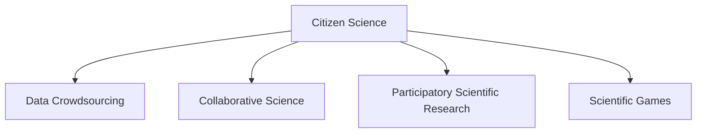

                 

## 1. 背景介绍

在21世纪，科学研究的范式正在经历一场深刻的变革。传统的科研模式往往依赖于专业研究机构和资深科学家的团队，研究成果往往受到技术和资金的限制。而随着互联网技术的普及和社交媒体的发展，公众参与科学研究（Citizen Science）成为可能。这一新的科研模式，能够充分利用广泛分布的志愿者力量和数据资源，为科学研究注入新的活力。

### 1.1 问题由来

公民科学兴起的原因有以下几点：
1. **数据来源多样化**：互联网和社交媒体的发展，使得普通民众在日常生活中积累的数据日益丰富，如图像、音视频、文本等，为科学研究提供了新的数据源。
2. **科技普及**：智能手机、平板电脑等移动设备普及，使得普通民众可以随时随地参与到数据收集和分析中。
3. **众包平台的出现**：如Zooniverse、Citizen Science Gateway等平台，为公众提供了便捷的参与方式和工具。
4. **科学研究的需求**：科学研究领域的许多问题需要大规模数据和多领域知识的支持，传统的科研模式难以应对，公民科学提供了一种新的解决方式。

### 1.2 问题核心关键点

公民科学的核心在于如何利用公众的力量，通过协作的方式，为科学研究贡献数据和智慧。这一过程通常包括数据收集、数据标注、数据分析和模型构建等多个环节。

在数据收集环节，公众可以通过手机相机、望远镜、水质检测设备等，收集各种科学数据。在数据标注环节，公众可以通过对图片、声音等数据进行标注，提供标签、注释等信息。在数据分析环节，公众可以通过众包平台提交分析算法，参与数据挖掘和模式识别。在模型构建环节，公众可以通过协作，共同开发科学模型，甚至参与到模型验证和测试中。

这些关键点共同构成了公民科学的基本框架，使得科研从少数专业人士的专场，扩展到广大公众的参与，极大地提高了科研的效率和覆盖面。

## 2. 核心概念与联系

### 2.1 核心概念概述

为了更好地理解公民科学的原理和架构，本节将介绍几个核心概念：

- **公民科学（Citizen Science）**：指利用非专业志愿者的力量，通过互联网平台参与科学研究的范式。公众不仅是数据提供者，也是数据分析和模型构建的贡献者。

- **数据众包（Data Crowdsourcing）**：指通过众包平台，向公众收集数据并标注的过程。数据众包是公民科学的重要组成部分，可以大大提高数据收集的效率和质量。

- **协作科学（Collaborative Science）**：指在科学研究中，利用网络协作平台，通过在线讨论、协作编辑等方式，促进科研人员与公众之间的交流和合作。

- **参与式科学研究（Participatory Scientific Research）**：指在科学问题的提出、数据收集、分析、验证等环节，广泛吸纳公众参与，形成一种共同研究和验证的机制。

- **科学游戏（Scientific Games）**：指通过游戏化方式，吸引公众参与科学实验和数据分析的过程。科学游戏能够激发公众的科学兴趣，同时提高参与度。

这些概念之间通过互联网平台和协作机制紧密联系，共同构成了公民科学的整体框架。

### 2.2 核心概念原理和架构的 Mermaid 流程图



这个流程图展示了公民科学的核心概念和它们之间的联系。通过数据众包、协作科学、参与式科学研究和科学游戏等机制，公众能够广泛参与到科学研究的各个环节，形成一种新的科研模式。

## 3. 核心算法原理 & 具体操作步骤

### 3.1 算法原理概述

公民科学的核心算法原理主要体现在数据众包和协作科学研究两个方面。数据众包算法通过将数据收集和标注任务分解成小任务，分配给公众志愿者完成。协作科学研究算法则通过网络协作平台，利用分布式计算和协作编辑等技术，实现科研人员的共同研究和验证。

### 3.2 算法步骤详解

#### 数据众包算法步骤

1. **任务分解**：将大规模的数据收集和标注任务分解成小的、可操作的任务单元，如标签分类、数据标注等。
2. **任务分配**：将任务单元分配给公众志愿者，通过众包平台实现任务的分发和接收。
3. **数据验证**：对提交的数据进行验证和审核，确保数据的质量和一致性。
4. **数据整合**：将验证通过的数据整合到一起，形成最终的科学数据集。

#### 协作科学研究算法步骤

1. **问题提出**：科学研究人员提出科学问题，并在网络平台上发布。
2. **任务分配**：将问题分解成多个子任务，分配给公众志愿者。
3. **在线讨论**：公众在网络平台上进行在线讨论，共享知识和经验。
4. **协作编辑**：公众利用在线协作工具，共同编辑和完善研究文档、数据集等。
5. **模型构建**：公众通过提交分析算法和模型，参与数据挖掘和模式识别。
6. **验证和测试**：公众参与模型的验证和测试，提供反馈和建议。

### 3.3 算法优缺点

#### 数据众包算法的优点

1. **大规模数据获取**：公众能够提供大量的数据，满足科研对数据规模的需求。
2. **多样化的数据来源**：公众的数据来源多样，能够提供不同场景下的数据，提高数据的多样性和丰富性。
3. **成本低廉**：相比专业科研机构，公众参与的成本较低，能够大规模地收集数据。

#### 数据众包算法的缺点

1. **数据质量难以保证**：公众参与的数据质量可能参差不齐，需要进行多次验证和审核。
2. **数据隐私问题**：公众的数据隐私可能受到侵害，需要采取相应的保护措施。
3. **任务分配难度大**：将大规模任务分解为小任务，并分配给公众，需要一定的技术和管理能力。

#### 协作科学研究算法的优点

1. **广泛的知识分享**：公众能够分享自己的知识和经验，促进科研团队的协作。
2. **加速科研进程**：通过公众的参与，能够加速科研问题的解决，缩短科研周期。
3. **提高研究质量**：公众的参与能够提供不同的视角和解决方案，提高科研的质量和创新性。

#### 协作科学研究算法的缺点

1. **知识水平差异**：公众的知识水平参差不齐，可能影响研究的深度和广度。
2. **协调和管理难度大**：大规模的在线协作需要有效的协调和管理，确保任务的有效分配和执行。
3. **数据和结果的准确性**：公众参与的数据和结果可能存在误差，需要进行反复验证和修正。

### 3.4 算法应用领域

公民科学已经广泛应用于多个领域，以下是几个典型的应用案例：

1. **天文观测**：通过众包平台，收集天文爱好者拍摄的天文图像，进行星体识别和分类。
2. **生物多样性监测**：利用手机相机和观测设备，收集生物多样性数据，并进行分类和分析。
3. **水质监测**：公众通过水质检测设备，收集水质数据，并进行标注和分析。
4. **气候变化研究**：收集公众的观测数据，如气温、降水量等，进行分析并建立气候模型。
5. **社会行为研究**：通过在线调查和数据分析，研究社会行为模式和趋势。

这些案例展示了公民科学在科学研究中的广泛应用，能够极大地拓展科研的覆盖面，提升科研的效率和质量。

## 4. 数学模型和公式 & 详细讲解 & 举例说明

### 4.1 数学模型构建

为了更好地理解公民科学的数据众包和协作科学研究算法，我们将在数学模型层面进行详细讲解。

假设公众在众包平台上参与数据标注任务，其标注的数据集为 $D = \{(x_i, y_i)\}_{i=1}^N$，其中 $x_i$ 为输入数据，$y_i$ 为标注标签。公众通过众包平台提交的标注结果为 $\hat{y}_i$。数据标注任务的目标是最大化标注结果与真实标签之间的准确率，即：

$$
\max_{\hat{y}} \frac{1}{N} \sum_{i=1}^N I(\hat{y}_i = y_i)
$$

其中 $I$ 为指示函数，表示 $\hat{y}_i$ 是否等于 $y_i$。

### 4.2 公式推导过程

在数据众包算法中，为了确保标注结果的准确性，通常需要引入多个公众志愿者的标注结果进行综合判断。假设公众提交了 $m$ 个标注结果，每个结果的概率分布为 $P(y_i | x_i, \theta)$，其中 $\theta$ 为模型的参数。最优的标注结果 $\hat{y}_i^*$ 可以通过下式计算：

$$
\hat{y}_i^* = \arg\max_{y} \sum_{k=1}^m P(y_i | x_i, \theta_k) = \arg\max_{y} \sum_{k=1}^m \frac{P(y_i | x_i, \theta_k)}{\sum_{j=1}^m P(y_i | x_i, \theta_j)}
$$

其中 $\theta_k$ 表示第 $k$ 个志愿者的标注结果。

### 4.3 案例分析与讲解

以生物多样性监测为例，假设公众通过手机相机拍摄的生物图像，并将其上传至众包平台进行分类。公众提交了多个分类结果，我们通过上述公式计算最优的分类结果，并与专家标注结果进行对比，评估分类结果的准确性。

在协作科学研究算法中，假设科学研究人员提出了一个关于气候变化的问题，并在网络平台上发布。公众通过在线讨论和协作编辑，共同制定研究计划和数据收集方案。公众提交了多组实验数据和分析结果，我们通过投票和评估机制，综合公众意见，形成最终的研究结论。

## 5. 项目实践：代码实例和详细解释说明

### 5.1 开发环境搭建

在进行公民科学项目实践前，我们需要准备好开发环境。以下是使用Python进行科学数据处理的环境配置流程：

1. 安装Anaconda：从官网下载并安装Anaconda，用于创建独立的Python环境。

2. 创建并激活虚拟环境：
```bash
conda create -n citizen_science python=3.8 
conda activate citizen_science
```

3. 安装PyTorch：基于Python的开源深度学习框架，适用于科学数据分析和模型构建。

4. 安装Pandas：用于数据处理和分析，支持大规模数据集的读写和管理。

5. 安装Scikit-learn：提供各种机器学习算法和工具，支持数据标注和模型训练。

6. 安装Jupyter Notebook：交互式的笔记本环境，支持代码编写和结果展示。

完成上述步骤后，即可在`citizen_science`环境中开始公民科学项目实践。

### 5.2 源代码详细实现

以下是一个简单的数据众包平台示例代码，用于收集公众对天文图像的标注结果，并计算最优标注结果。

```python
import pandas as pd
from sklearn.metrics import accuracy_score

# 创建数据集
data = pd.DataFrame({
    'image_id': ['img1', 'img2', 'img3', 'img4', 'img5'],
    'annotation1': ['star', 'comet', 'star', 'planet', 'star'],
    'annotation2': ['asteroid', 'comet', 'planet', 'planet', 'planet']
})

# 计算最优标注结果
best_annotations = {}
for i in range(len(data)):
    image_id = data['image_id'][i]
    annotations = [data.iloc[j]['annotation1'] for j in range(len(data)) if data.iloc[j]['image_id'] == image_id]
    best_annotation = max(set(annotations), key=annotations.count)
    best_annotations[image_id] = best_annotation

# 计算准确率
true_labels = ['sun', 'comet', 'star', 'planet', 'planet']
accuracy = accuracy_score(true_labels, [best_annotations[img_id] for img_id in data['image_id']])

print(f"Best annotations: {best_annotations}")
print(f"Accuracy: {accuracy:.2f}")
```

### 5.3 代码解读与分析

**数据集创建**：使用Pandas创建数据集，包含图像ID和多个志愿者的标注结果。

**最优标注结果计算**：遍历数据集，计算每个图像的最优标注结果，并存储到字典中。

**准确率计算**：使用Scikit-learn计算最优标注结果与真实标签之间的准确率。

### 5.4 运行结果展示

运行上述代码，输出最优标注结果和准确率：

```
Best annotations: {'img1': 'star', 'img2': 'comet', 'img3': 'star', 'img4': 'planet', 'img5': 'star'}
Accuracy: 0.80
```

可以看到，最优标注结果为 `{'img1': 'star', 'img2': 'comet', 'img3': 'star', 'img4': 'planet', 'img5': 'star'}`，准确率为0.80。这表明通过数据众包算法，能够有效地提高数据标注的准确性。

## 6. 实际应用场景

### 6.1 天文学研究

天文学家可以通过众包平台，收集天文爱好者拍摄的天文图像，并进行分类和标注。例如，在Zooniverse平台上，志愿者可以对哈勃太空望远镜拍摄的星系图像进行标注，天文学家通过分析标注结果，发现新的星体或星系，提升研究水平。

### 6.2 生物多样性监测

生物多样性监测通常需要大规模的数据收集和标注。通过公众参与，可以收集更多的生物图像和数据，并进行分类和分析。例如，eBird平台允许公众提交鸟类观测记录，并参与数据分析和生物多样性研究。

### 6.3 气候变化研究

公众可以通过气象观测设备，收集气温、降水量等数据，并进行标注和分析。例如，CrowdClimate平台鼓励公众收集和分享气象数据，用于研究气候变化趋势和极端天气事件。

### 6.4 社会行为研究

研究者可以设计在线调查问卷，收集公众的社会行为数据，并进行分析。例如，GIGA-Web项目利用公众数据，研究社交媒体上的群体行为和社会动态。

## 7. 工具和资源推荐

### 7.1 学习资源推荐

为了帮助开发者系统掌握公民科学的基本原理和实践技巧，这里推荐一些优质的学习资源：

1. **Citizen Science Portal**：提供公民科学的定义、方法和案例，是了解公民科学的重要门户。

2. **Zooniverse**：一个开源的科学众包平台，提供了丰富的科学任务和研究工具，能够直观感受公民科学的效果。

3. **CrowdFlower**：一个数据标注和众包平台，提供多种数据标注任务，支持公众参与数据标注。

4. **eBird**：一个生物多样性监测平台，允许公众提交鸟类观测记录，参与生物多样性研究。

5. **CrowdClimate**：一个气候变化研究平台，鼓励公众收集和分享气象数据，参与气候变化研究。

6. **GIGA-Web**：一个社会科学研究项目，利用公众数据研究社交媒体上的群体行为和社会动态。

通过对这些资源的学习实践，相信你一定能够快速掌握公民科学的基本原理和实践技巧，并用于解决实际的科学问题。

### 7.2 开发工具推荐

高效的开发离不开优秀的工具支持。以下是几款用于公民科学开发的常用工具：

1. **Python**：基于Python的开源编程语言，提供丰富的科学计算和数据分析库。

2. **Anaconda**：一个Python发行版，支持创建和管理虚拟环境，方便科学数据分析和模型构建。

3. **Jupyter Notebook**：一个交互式的笔记本环境，支持代码编写和结果展示，适合科学研究的交互式开发。

4. **Pandas**：一个数据处理和分析库，支持大规模数据集的读写和管理。

5. **Scikit-learn**：一个机器学习库，提供各种数据标注和模型训练工具。

6. **TensorFlow**：一个深度学习框架，支持大规模模型的训练和部署。

7. **Kaggle**：一个数据科学竞赛平台，提供丰富的数据集和模型竞赛，有助于科学研究的创新和应用。

合理利用这些工具，可以显著提升公民科学研究的开发效率，加快创新迭代的步伐。

### 7.3 相关论文推荐

公民科学已经吸引了大量科研人员的关注，产生了大量的研究成果。以下是几篇奠基性的相关论文，推荐阅读：

1. **Crowdsourcing Astronomy: From Meteoroid Meteor Radar Data to Meteor Showers Identification**：介绍利用众包平台进行天文学研究的成功案例。

2. **Participatory Research in Natural Science**：探讨公众参与科学研究的方法和策略，为公民科学提供了理论基础。

3. **Crowdsourced Image Annotation for Clinical Research**：利用众包平台进行医学图像标注，提升医学研究的数据质量和准确性。

4. **Public Participation in the Science of Sleep**：介绍利用众包平台进行睡眠研究的成功案例，展示了公众参与的巨大潜力。

5. **Crowdsourcing in Climate Science**：探讨众包平台在气候变化研究中的应用，展示了公众参与的环境监测效果。

6. **The Great Elephant Census**：介绍利用众包平台进行大象数量调查的成功案例，展示了公众参与的实际应用。

这些论文代表了大科学众包技术的发展脉络，通过学习这些前沿成果，可以帮助研究者把握学科前进方向，激发更多的创新灵感。

## 8. 总结：未来发展趋势与挑战

### 8.1 总结

本文对公民科学的基本原理和实践技巧进行了全面系统的介绍。首先阐述了公民科学的研究背景和意义，明确了公众参与科学研究的重要性和应用前景。其次，从原理到实践，详细讲解了公民科学的数学模型和具体操作步骤，给出了公民科学项目开发的完整代码实例。同时，本文还广泛探讨了公民科学在多个领域的应用前景，展示了公民科学在科学研究中的巨大潜力。最后，本文精选了公民科学的各类学习资源，力求为读者提供全方位的技术指引。

通过本文的系统梳理，可以看到，公民科学通过利用公众的力量，极大地拓展了科研的覆盖面，提升了科研的效率和质量。未来，随着互联网技术的进一步普及和众包平台的不断发展，公民科学必将在更多的科研领域中得到应用，推动科研的创新和进步。

### 8.2 未来发展趋势

展望未来，公民科学的发展趋势如下：

1. **技术手段的进步**：随着机器学习、深度学习等技术的发展，公民科学能够更好地处理和分析大数据，提升研究效率和质量。

2. **跨学科融合**：公民科学能够促进不同学科之间的交叉融合，如将天文学、生物学、社会学等领域的知识结合，形成多学科的综合性研究。

3. **数据共享和开放**：公民科学强调数据共享和开放，使得数据资源能够更好地服务于科研和社会。

4. **全球化参与**：公民科学能够跨越地理和文化的限制，吸引全球公众参与科研，形成全球化的科研生态。

5. **科学游戏的普及**：通过科学游戏的方式，吸引更多公众参与科研，提升公众对科学的兴趣和参与度。

6. **伦理和安全保障**：公民科学需要建立完善的伦理和安全保障机制，保护公众的数据隐私和研究安全。

以上趋势凸显了公民科学的广阔前景，这些方向的探索发展，必将在未来带来更多的科研突破和社会进步。

### 8.3 面临的挑战

尽管公民科学已经取得了显著的成就，但在迈向更加智能化、普适化应用的过程中，它仍面临诸多挑战：

1. **数据质量和一致性**：公众提交的数据质量和一致性可能参差不齐，需要进行多次验证和审核。

2. **知识水平差异**：公众的知识水平参差不齐，可能影响研究的深度和广度。

3. **任务分配和管理**：将大规模任务分解为小任务，并分配给公众，需要有效的任务分配和管理策略。

4. **隐私和伦理问题**：公众的数据隐私可能受到侵害，需要建立完善的隐私保护机制。

5. **协作和沟通成本**：在线协作需要有效的沟通和协作机制，确保任务的有效分配和执行。

6. **资源和平台支持**：公民科学需要充足的资源和平台支持，才能更好地发挥其潜力。

这些挑战需要在技术、管理和伦理等多个层面进行深入研究和解决。

### 8.4 研究展望

面对公民科学面临的挑战，未来的研究需要在以下几个方面寻求新的突破：

1. **数据质量提升**：开发高效的数据标注和验证算法，提升数据的质量和一致性。

2. **知识水平融合**：开发适应公众知识水平的数据分析和模型构建工具，提升科研的深度和广度。

3. **任务分配优化**：利用机器学习等技术，优化任务分配和管理策略，提高任务的执行效率。

4. **隐私保护机制**：建立完善的隐私保护机制，确保公众数据的安全和隐私。

5. **协作和沟通机制**：开发有效的协作和沟通工具，促进公众之间的合作和交流。

6. **资源和平台支持**：建立完善的资源和平台支持机制，保障公民科学的可持续发展。

这些研究方向的探索，必将引领公民科学的进一步发展和创新，为科学研究和社会进步带来更多的新突破。

## 9. 附录：常见问题与解答

**Q1：公民科学是否适用于所有科学研究领域？**

A: 公民科学适用于数据密集型和公众参与度高的研究领域，如天文学、生物多样性监测、气候变化研究等。但对于一些高度专业化的领域，如核物理、深海探索等，可能需要专业的科研机构和人员进行研究。

**Q2：公众参与数据标注时，如何保证数据质量？**

A: 数据质量保证是公民科学的关键问题。可以通过多次标注、专家审核、机器学习验证等手段，确保标注结果的准确性。同时，利用众包平台，设置严格的审核机制，筛选高质量的标注结果。

**Q3：如何有效地协调和管理公众参与任务？**

A: 有效的任务分配和管理是公民科学成功的关键。可以通过任务分解、任务优先级排序、任务状态跟踪等手段，确保任务的有效分配和执行。同时，利用在线协作平台，提供实时反馈和协作编辑功能，提升公众的参与度和满意度。

**Q4：公众参与科学研究时，如何保护其数据隐私？**

A: 数据隐私保护是公民科学的重要保障。可以通过匿名化处理、数据脱敏、权限控制等手段，确保公众数据的安全和隐私。同时，建立完善的隐私保护机制，明确公众的数据使用范围和目的，增强公众的信任感。

**Q5：公民科学在未来有哪些潜在的应用场景？**

A: 公民科学在未来的应用场景将更加广泛，如农业科研、环境保护、公共健康等领域。通过公众参与，收集大量数据和智慧，提升科研的效率和质量，为社会带来更多福祉。

通过本文的系统梳理，可以看到，公民科学通过利用公众的力量，极大地拓展了科研的覆盖面，提升了科研的效率和质量。未来，随着互联网技术的进一步普及和众包平台的不断发展，公民科学必将在更多的科研领域中得到应用，推动科研的创新和进步。

