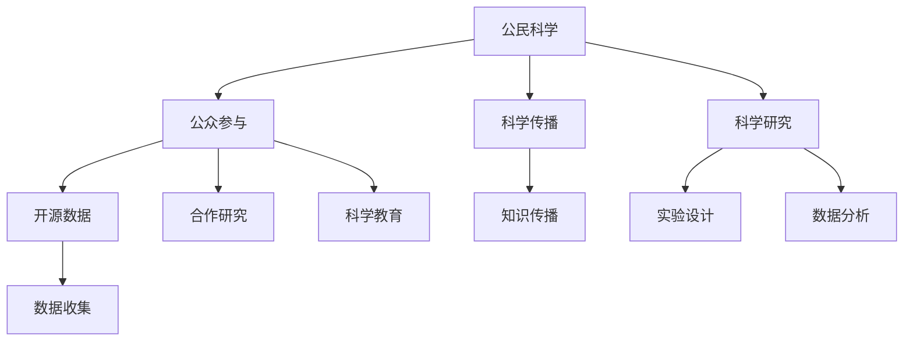

                 

# 公民科学：公众参与科学研究的新途径

> 关键词：
1. 公民科学
2. 公众参与
3. 科学传播
4. 科学研究
5. 开源数据
6. 合作研究
7. 科学教育

## 1. 背景介绍

在当今信息时代，科学研究已经不再局限于专业实验室，而是扩展到了更广阔的公共领域。公民科学（Citizen Science），即公众参与科学研究（Publicly Involved Scientific Research），正成为推动科学发展的重要力量。这一新兴科学范式利用大众的参与和贡献，不仅极大地推动了科学研究的广度和深度，也增强了公众对科学的理解和兴趣。

### 1.1 公民科学的起源与发展

公民科学的概念最早可以追溯到20世纪初的欧洲，当时的社区观察和数据收集活动便是最早的公民科学实践之一。现代公民科学的发展源于信息技术、互联网和社交媒体的普及，使得公众参与科研成为可能。21世纪以来，公民科学在全球范围内迅速兴起，成为科学界和公众共同关注的热点。

### 1.2 公民科学的广泛应用

目前，公民科学已经应用于多个领域，包括天文学、生物学、气候科学、环境监测、生态学、生物多样性保护等。例如，Zooniverse平台利用大众参与的“众包计算”（Crowdsourcing）和“众包数据标注”（Crowdsourced Data Labeling），帮助科学家分析大量天文图像和生物学样本，显著提升了科研效率和数据质量。

### 1.3 公民科学的优势与挑战

公民科学的优势包括：
1. **广泛的数据来源**：利用公众的观测和数据，收集到海量的数据资源，弥补传统科研方法的局限。
2. **多样化的知识背景**：公众参与者来自各行各业，提供多样化的视角和问题解决思路。
3. **增强公众参与感**：通过实际参与科研活动，提升公众对科学的兴趣和理解。

但公民科学也面临一些挑战：
1. **数据质量控制**：参与者的数据质量参差不齐，需要建立有效的数据筛选机制。
2. **科学培训与教育**：公众科学参与者通常缺乏专业的科学知识，需要提供科学培训。
3. **技术门槛**：部分公民科学项目需要较高的技术门槛，门槛较高的项目难以吸引更多公众参与。

## 2. 核心概念与联系

### 2.1 核心概念概述

为了更好地理解公民科学及其在科学研究中的应用，本节将介绍几个关键概念及其相互联系：

- **公民科学**：指公众参与科学研究的活动，利用公众的力量进行数据收集、实验设计和数据分析，提升科学研究的广度和深度。
- **公众参与**：指公众通过各种方式，如观测、数据收集、实验设计、数据分析等，参与到科学研究中来。
- **科学传播**：指通过多种媒介，如网络、媒体、会议等，向公众传递科学知识和研究成果。
- **科学研究**：指系统地探索自然现象、验证假设、发现新知识的过程。
- **开源数据**：指公开可访问、免费使用的数据资源，供公众参与和科学研究人员使用。
- **合作研究**：指科研人员与公众合作，共同进行科学研究和数据收集。
- **科学教育**：指通过多种形式的教育活动，提升公众的科学素养和知识水平。

这些概念相互关联，共同构成了公民科学的基本框架。通过这些概念，我们可以更好地理解公民科学在科学研究和公共领域的应用，以及其潜在的价值和挑战。

### 2.2 核心概念原理和架构的 Mermaid 流程图



这个流程图展示了公民科学的核心概念及其相互联系。公众参与是公民科学的核心，通过数据收集、实验设计、数据分析等活动，公众与科研人员合作，提升科学研究的深度和广度。科学传播、科学研究和科学教育相互支持，共同推动公民科学的健康发展。开源数据和合作研究为公众参与提供了重要的基础和保障。

## 3. 核心算法原理 & 具体操作步骤

### 3.1 算法原理概述

公民科学的数据收集和分析方法，主要基于统计学和机器学习的原理。利用公众参与的数据，通过统计学模型或机器学习算法，发现规律、验证假设、做出预测。

核心算法原理包括：
1. **数据预处理**：对收集的数据进行清洗、去重、补缺等预处理操作。
2. **统计模型**：利用统计学模型，如回归分析、假设检验、聚类分析等，分析数据规律和趋势。
3. **机器学习**：利用机器学习算法，如分类、回归、聚类、降维等，构建模型，进行预测和分类。

### 3.2 算法步骤详解

公民科学的算法步骤通常包括以下几个关键环节：

1. **数据收集**：
   - 设计数据收集方案，明确数据来源、采集方法和存储方式。
   - 利用调查问卷、众包平台、传感器等手段，收集数据。

2. **数据清洗**：
   - 对收集的数据进行预处理，如去重、补缺、格式转换等。
   - 使用数据清洗工具，如Python的pandas库，对数据进行清洗和整理。

3. **数据建模**：
   - 选择合适的统计模型或机器学习算法，进行模型构建。
   - 使用Python的scikit-learn库，实现回归、分类、聚类等模型。

4. **模型验证**：
   - 将数据集分为训练集和测试集，评估模型性能。
   - 使用交叉验证、混淆矩阵、ROC曲线等指标，评估模型效果。

5. **结果解释**：
   - 将模型结果可视化，生成图表和报告，解释分析结果。
   - 通过图表和报告，向公众和科研人员展示分析结果。

### 3.3 算法优缺点

公民科学的算法优点包括：
1. **数据量庞大**：利用公众参与的数据，收集到海量的数据资源，弥补传统科研方法的局限。
2. **算法灵活**：可以灵活应用各种统计学和机器学习算法，发现数据中的规律和趋势。
3. **多学科融合**：结合多学科的视角和方法，提升科学研究的深度和广度。

公民科学的算法缺点包括：
1. **数据质量参差不齐**：公众参与者的数据质量参差不齐，需要建立有效的数据筛选机制。
2. **算法复杂性高**：部分算法需要较高的技术门槛，门槛较高的项目难以吸引更多公众参与。
3. **结果解释困难**：复杂的算法结果可能难以解释，公众难以理解。

### 3.4 算法应用领域

公民科学算法在多个领域得到了广泛应用，包括：

1. **天文学**：利用公众观测的星表数据，通过统计分析和机器学习，发现恒星、行星等天体。
2. **生物学**：通过众包数据标注和图像识别，分析生物多样性、生态系统变化等。
3. **环境监测**：利用传感器和众包数据，监测大气污染、水质变化等。
4. **气候科学**：利用公众采集的气象数据，分析气候变化趋势和极端天气事件。
5. **医学研究**：通过患者调查和数据收集，研究疾病的流行趋势和治疗方法。

## 4. 数学模型和公式 & 详细讲解 & 举例说明

### 4.1 数学模型构建

公民科学的数学模型构建，通常包括以下几个步骤：

1. **数据收集**：通过问卷调查、众包平台等方式，收集数据。
2. **数据清洗**：去除重复、异常值，处理缺失数据。
3. **数据预处理**：进行归一化、标准化等处理，保证数据的一致性。
4. **模型选择**：选择合适的统计模型或机器学习算法。
5. **模型训练**：使用训练集数据，训练模型参数。
6. **模型验证**：使用测试集数据，验证模型效果。
7. **结果解释**：将模型结果可视化，解释分析结果。

### 4.2 公式推导过程

以回归分析为例，展示公民科学中常用的统计模型公式推导过程。

假设有一组数据集 $(x_i, y_i)$，其中 $x_i$ 为自变量，$y_i$ 为因变量，$i=1,2,\dots,n$。回归模型的目标是最小化残差平方和（Residual Sum of Squares, RSS）：

$$
RSS = \sum_{i=1}^n (y_i - \hat{y}_i)^2
$$

其中 $\hat{y}_i$ 为模型预测值。

线性回归模型为：

$$
\hat{y}_i = \alpha + \beta x_i
$$

其中 $\alpha$ 为截距，$\beta$ 为斜率。

通过最小二乘法（Ordinary Least Squares, OLS）求解模型参数 $\alpha$ 和 $\beta$，使得 RSS 最小化：

$$
\alpha, \beta = \mathop{\arg\min}_{\alpha, \beta} \sum_{i=1}^n (y_i - \alpha - \beta x_i)^2
$$

求导并令导数等于零，得：

$$
\alpha = \frac{\sum_{i=1}^n y_i - \beta \sum_{i=1}^n x_i}{n}
$$
$$
\beta = \frac{\sum_{i=1}^n (x_i - \bar{x})(y_i - \bar{y})}{\sum_{i=1}^n (x_i - \bar{x})^2}
$$

其中 $\bar{x}$ 和 $\bar{y}$ 分别为 $x$ 和 $y$ 的均值。

### 4.3 案例分析与讲解

以Zooniverse平台上的“GLOBE at Home”项目为例，展示如何利用公民科学进行环境监测和气候研究。

“GLOBE at Home”项目利用众包平台，让公众参与到全球气候变化观测中。参与者通过观测和拍摄天空中的云团，提交数据给科研人员，用于分析大气中的水汽、二氧化碳等气体浓度。

具体步骤如下：
1. **数据收集**：参与者使用智能手机或相机，拍摄天空中的云团照片。
2. **数据清洗**：通过平台上传数据，去除重复、模糊等低质量数据。
3. **数据预处理**：对图片进行预处理，如去色、灰度化等。
4. **模型选择**：使用机器学习算法，如随机森林、支持向量机等，分析云团图像中的气体浓度。
5. **模型训练**：使用历史数据，训练模型参数。
6. **模型验证**：使用测试集数据，验证模型效果。
7. **结果解释**：生成云团图像和气体浓度变化图表，向公众和科研人员展示分析结果。

## 5. 项目实践：代码实例和详细解释说明

### 5.1 开发环境搭建

要进行公民科学项目的数据分析和建模，需要搭建相应的开发环境。以下是一些常用的开发工具和环境配置：

1. **Python环境配置**：
   - 安装Anaconda或Miniconda，创建虚拟环境。
   - 安装必要的Python库，如pandas、numpy、scikit-learn等。
   - 配置数据管理和存储工具，如Amazon S3、Google Cloud Storage等。

2. **数据收集工具**：
   - 设计数据收集方案，选择合适的数据收集工具，如问卷调查工具、众包平台、传感器等。
   - 配置数据上传和存储方式，确保数据的可靠性和安全性。

### 5.2 源代码详细实现

以线性回归模型为例，展示Python代码实现步骤。

```python
import pandas as pd
from sklearn.linear_model import LinearRegression

# 读取数据集
data = pd.read_csv('data.csv')

# 数据预处理
data['x'] = data['x'] - data['x'].mean()
data['y'] = data['y'] - data['y'].mean()

# 训练模型
model = LinearRegression()
model.fit(data[['x']], data['y'])

# 预测和验证
test_data = pd.read_csv('test_data.csv')
test_data['x'] = test_data['x'] - test_data['x'].mean()
y_pred = model.predict(test_data[['x']])
print('RSS:', sum((test_data['y'] - y_pred)**2))

# 结果可视化
import matplotlib.pyplot as plt
plt.scatter(data['x'], data['y'], label='Data')
plt.plot(data['x'], model.predict(data[['x']]), label='Model')
plt.legend()
plt.show()
```

### 5.3 代码解读与分析

上述代码实现了一个简单的线性回归模型，主要步骤如下：

1. **数据读取和预处理**：
   - 使用pandas库读取数据集，进行归一化处理，使得数据更易于模型训练。
2. **模型训练**：
   - 使用scikit-learn库中的LinearRegression模型，进行线性回归模型训练。
3. **模型验证和预测**：
   - 使用测试集数据进行模型验证，计算残差平方和（RSS），评估模型效果。
   - 使用模型进行预测，并可视化结果。

### 5.4 运行结果展示

运行上述代码，可以得到以下结果：

- 训练模型后，计算得到的RSS值，用于评估模型拟合效果。
- 生成可视化图表，展示模型预测结果和真实数据对比。

## 6. 实际应用场景

### 6.1 环境监测

环境监测是公民科学的重要应用场景之一。通过公众参与的众包平台，收集全球各地的环境数据，如大气污染、水质变化等，对环境变化进行实时监测和预警。

以“GLOBE at Home”项目为例，利用公众观测和提交的数据，分析大气中的水汽、二氧化碳等气体浓度，评估全球气候变化趋势。

### 6.2 生物多样性保护

生物多样性保护是公民科学的另一个重要应用领域。通过众包平台，收集公众在自然环境中的观测数据，如鸟类、昆虫、植物等物种的数量和分布情况，研究生物多样性变化趋势。

以“BioBlitz”项目为例，利用公众参与的数据，研究城市和农村地区的生物多样性变化，提出保护措施和建议。

### 6.3 公共卫生

公共卫生是公民科学在健康领域的重要应用之一。通过公众参与的数据收集和分析，研究疾病的流行趋势、传播规律等，为公共卫生决策提供科学依据。

以“FluSurvNet”项目为例，利用公众参与的数据，分析流感病毒的传播趋势和风险因素，预测流感爆发的时间和地点，提前采取防控措施。

## 7. 工具和资源推荐

### 7.1 学习资源推荐

为了帮助公众参与科学研究的实践者掌握必要的科学知识和技能，这里推荐一些优质的学习资源：

1. **Coursera《数据科学导论》课程**：由Johns Hopkins大学开设，提供数据科学基础知识和实践技能的系统学习。
2. **edX《科学传播与公共参与》课程**：由MIT和Harvard大学联合开设，涵盖科学传播和公众参与的基本理论和实践技能。
3. **Khan Academy《统计学基础》课程**：提供统计学基础知识和常用统计方法的详细讲解。
4. **SciTools《数据科学工具和技巧》教程**：由科学工具社区SciTools提供，涵盖数据收集、处理和分析的实用技巧和工具推荐。
5. **GitHub上的开源科学项目**：如Zooniverse平台，提供大量公民科学项目和数据集，供公众学习和参与。

通过对这些学习资源的利用，可以系统掌握公民科学的基本概念和技能，为实际参与和实践提供坚实基础。

### 7.2 开发工具推荐

高效的工具是进行公民科学数据分析和建模的重要保障。以下是一些常用的开发工具和环境：

1. **Jupyter Notebook**：轻量级的数据分析和可视化工具，支持Python、R等多种编程语言。
2. **Google Colab**：基于Google Cloud的云服务环境，免费提供GPU、TPU等高性能计算资源，支持大规模数据处理。
3. **Amazon S3**：云端数据存储和管理平台，支持大规模数据上传和访问，保障数据的安全性和可靠性。
4. **Docker和Kubernetes**：容器化和容器编排工具，支持大规模分布式计算和数据分析。

合理利用这些工具，可以显著提升公民科学数据分析和建模的效率和质量。

### 7.3 相关论文推荐

公民科学的研究涉及多个学科和领域，以下推荐几篇有代表性的论文，供读者参考：

1. **“Citizen Science” in Science and Technology Studies**：Gillian Hadfield和Alan留着的作品，探讨了公民科学在科学研究和公众参与中的作用和影响。
2. **“Crowdsourcing for Science: Mapping the Environmental Phenomena with Mobile Volunteers”**：Bruce Walker和Glen Stace的作品，展示了移动设备在环境监测中的应用和潜力。
3. **“Crowdsourced Science”**：Ellen de Alba的作品，讨论了公众参与科学研究的机制和挑战。
4. **“Citizen Science Projects: A Survey of the State of the Art”**：Robin Wainwright和Liz Zheng的作品，总结了公民科学项目的类型、数据和分析方法。

## 8. 总结：未来发展趋势与挑战

### 8.1 未来发展趋势

展望未来，公民科学的发展趋势如下：

1. **技术进步**：随着大数据、人工智能等技术的发展，公民科学的数据处理和分析能力将进一步提升，提供更精准、更高效的研究工具。
2. **平台多样化**：将涌现更多众包平台和数据共享平台，提供更加多样化的数据采集和分析方法。
3. **全球合作**：全球范围内的公民科学项目将更加紧密合作，共享数据和研究成果，提升全球科研水平。
4. **公众参与深化**：通过科学教育和培训，公众对科学的理解和参与将更加深入，形成更加广泛的科学共识。

### 8.2 面临的挑战

公民科学在发展过程中也面临诸多挑战：

1. **数据质量**：公众参与的数据质量参差不齐，需要建立有效的数据筛选和校验机制。
2. **算法复杂性**：部分算法需要较高的技术门槛，门槛较高的项目难以吸引更多公众参与。
3. **结果解释**：复杂的算法结果可能难以解释，公众难以理解。
4. **公众参与度**：部分公众对科学缺乏兴趣和了解，难以形成广泛参与。

### 8.3 研究展望

为了应对这些挑战，未来的研究可以从以下几个方面进行：

1. **数据质量控制**：开发有效的数据筛选和校验算法，确保数据质量。
2. **算法简化**：开发更加易用、易理解的算法和工具，降低技术门槛。
3. **结果解释**：开发更加直观、易懂的可视化工具和报告，增强结果的可解释性。
4. **科学教育和培训**：通过多种形式的教育活动，提升公众的科学素养和参与度。

## 9. 附录：常见问题与解答

### 附录

**Q1：公众参与的数据质量如何保证？**

A: 为了保证公众参与的数据质量，可以采取以下措施：
1. **数据筛选和校验**：使用数据清洗工具，如Python的pandas库，去除重复、异常值，处理缺失数据。
2. **培训和指导**：对公众参与者进行科学培训，提供详细的数据采集和分析指导。
3. **算法优化**：使用机器学习算法，自动筛选和校验数据，确保数据的可靠性和准确性。

**Q2：如何提高公众参与的积极性？**

A: 提高公众参与的积极性，可以从以下几个方面入手：
1. **兴趣激发**：通过科学教育和科普活动，激发公众对科学的兴趣。
2. **激励机制**：设计合理的激励机制，如奖励、认证等，激励公众参与。
3. **平台优化**：优化众包平台的用户界面和功能，提升用户体验。

**Q3：如何应对算法复杂性问题？**

A: 应对算法复杂性问题，可以采取以下措施：
1. **算法简化**：开发更加易用、易理解的算法和工具，降低技术门槛。
2. **分阶段学习**：设计分阶段的科学教育和培训课程，逐步引导公众掌握复杂的算法和工具。
3. **社区协作**：鼓励社区协作，通过经验交流和互助，提升公众的算法理解和应用能力。

**Q4：如何增强结果的可解释性？**

A: 增强结果的可解释性，可以采取以下措施：
1. **可视化工具**：开发更加直观、易懂的可视化工具，帮助公众理解分析结果。
2. **结果报告**：编写详细的结果报告，解释模型和算法的基本原理和分析过程。
3. **公众反馈**：鼓励公众反馈意见，改进结果解释方式，增强结果的可理解性。

---

作者：禅与计算机程序设计艺术 / Zen and the Art of Computer Programming

