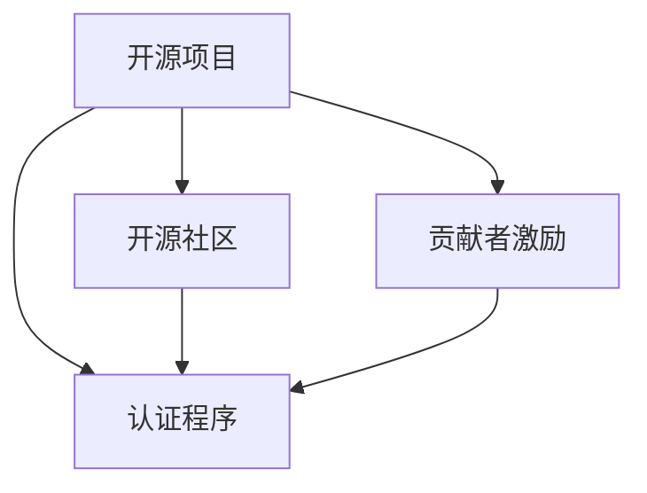

                 

# 创建开源项目的认证程序：建立权威和收入

## 1. 背景介绍

在当今的软件开发生态中，开源项目正逐渐成为创新的引擎。无论是新兴创业公司，还是大型科技企业，开源项目都在各自的领域扮演着重要角色。开源社区的活跃度、质量和贡献者数量，已经成为了衡量一个项目受欢迎程度的重要指标。然而，如何确保这些开源项目的权威性和可信度，一直是行业面临的难题。为此，本文旨在介绍一种创建开源项目的认证程序，通过严格的审核标准和透明的管理流程，确保项目内容的权威性，并建立可持续的收入模式，从而推动开源项目的良性发展。

## 2. 核心概念与联系

为了更好地理解开源项目认证程序的工作原理和架构，本节将介绍几个密切相关的核心概念：

- **开源项目**：指的是开发者自愿分享源代码和知识产权的项目。开源项目促进了技术交流和创新，降低了技术开发的门槛。
- **认证程序**：指用于审核和验证开源项目质量和合规性的标准化流程。认证程序通过严格的审核标准和透明的管理流程，确保开源项目的权威性和可信度。
- **开源社区**：指围绕开源项目进行开发、维护和交流的开发者群体。开源社区的繁荣和活跃度，直接影响开源项目的生命力和影响力。
- **贡献者激励**：指通过捐赠、赞助、赞助商合作等方式，激励开发者为开源项目贡献代码和资源。

这些核心概念之间的逻辑关系可以通过以下Mermaid流程图来展示：



这个流程图展示了几者之间的相互关系：

1. 开源项目通过认证程序获得权威性。
2. 开源社区为项目提供持续的贡献和维护。
3. 贡献者激励吸引更多的开发者参与。
4. 认证程序进一步提升项目的权威性和可持续性。

这些概念共同构成了开源项目的生命周期，通过认证程序的严格审核，可以确保项目内容的权威性和可信度，进而吸引更多的贡献者，实现项目的持续发展。

## 3. 核心算法原理 & 具体操作步骤
### 3.1 算法原理概述

开源项目的认证程序通过严格的审核标准和透明的管理流程，确保项目内容的权威性。认证程序的核心在于：

1. **项目质量审核**：通过代码审查、文档审查、功能测试等方式，确保开源项目的技术质量。
2. **合规性审查**：检查开源项目是否符合开源协议和社区规范，确保项目的合规性。
3. **持续维护支持**：建立项目维护团队，定期更新代码和文档，保证项目的长久生命力。
4. **收入模式建立**：通过赞助、捐赠、商业合作等方式，建立项目的收入来源，支持项目的持续发展。

认证程序的审核标准和流程如下：

1. **项目提交申请**：开发者向认证机构提交项目申请，提供项目简介、代码库链接、文档链接等资料。
2. **项目评估**：认证机构对项目进行初步审核，包括代码质量、文档完整性、项目功能等。
3. **项目审核**：由项目评审委员会对项目进行详细审核，包括代码审查、功能测试、合规性检查等。
4. **认证通过**：项目通过审核后，获得认证标志和标识，可以在官网、文档、代码库等位置使用。

### 3.2 算法步骤详解

开源项目的认证程序具体步骤如下：

**Step 1: 提交项目申请**

开发者首先向认证机构提交项目申请，提供以下资料：

1. **项目简介**：简要介绍项目的背景、目标、核心技术等。
2. **代码库链接**：提供项目的GitHub、GitLab等代码库链接。
3. **文档链接**：提供项目的使用指南、API文档、开发者手册等。
4. **社区链接**：提供项目的官网、GitHub issue、Google Code等社区链接。
5. **项目截图**：提供项目的运行截图或演示视频，展示项目的主要功能。

**Step 2: 初步审核**

认证机构对提交的项目进行初步审核，包括：

1. **代码质量**：检查代码规范、注释、测试用例等，确保代码质量达到开源社区的标准。
2. **文档完整性**：检查文档的完整性、准确性和可读性，确保开发者手册、API文档等资料齐全。
3. **功能测试**：对项目的主要功能进行测试，确保功能正常运行。
4. **代码审查**：通过代码审查工具，对代码进行自动化检测，检查代码质量和安全漏洞。

**Step 3: 详细审核**

项目通过初步审核后，由项目评审委员会进行详细审核，包括：

1. **代码审查**：由项目评审委员会成员对代码进行详细审查，确保代码质量达到开源社区的标准。
2. **功能测试**：对项目的主要功能进行详细测试，确保功能正常运行。
3. **合规性检查**：检查项目是否符合开源协议和社区规范，确保项目的合规性。
4. **持续维护计划**：评估项目维护团队的计划和资源，确保项目的持续发展。

**Step 4: 认证通过**

项目通过详细审核后，获得认证机构的认证标志和标识，可以在官网、文档、代码库等位置使用。认证通过后，项目可以获得以下权益：

1. **认证标志使用**：在官网、文档、代码库等位置使用认证标志，提升项目的权威性和可信度。
2. **收入支持**：通过赞助、捐赠、商业合作等方式，建立项目的收入来源，支持项目的持续发展。
3. **技术支持**：获得认证机构的技术支持和指导，提升项目的技术水平。

### 3.3 算法优缺点

开源项目的认证程序具有以下优点：

1. **提升项目权威性**：通过严格的审核标准和透明的管理流程，确保项目内容的权威性和可信度。
2. **吸引更多贡献者**：认证项目的权威性和可持续性，可以吸引更多的开发者参与，提升项目的活跃度。
3. **建立收入模式**：通过赞助、捐赠、商业合作等方式，建立项目的收入来源，支持项目的持续发展。

然而，该方法也存在一定的局限性：

1. **审核周期长**：严格的审核流程可能导致项目等待审核的时间较长，影响项目的发展速度。
2. **认证成本高**：认证机构的审核费用和项目管理成本较高，可能对小型项目不适用。
3. **依赖机构权威**：认证机构的权威性和公信力，直接影响项目的认证效果。

尽管存在这些局限性，但就目前而言，开源项目的认证程序仍是确保项目权威性和可持续性的重要手段。未来相关研究的重点在于如何进一步降低认证成本，缩短审核周期，提高认证效率。

### 3.4 算法应用领域

开源项目的认证程序在许多领域都得到了广泛应用，例如：

- **开源软件**：如Apache、Linux等开源软件项目，通过认证程序提升了项目的权威性和可信度。
- **开源工具**：如Kubernetes、Docker等开源工具项目，通过认证程序吸引了更多的贡献者，提升了项目的活跃度。
- **开源生态**：如TensorFlow、PyTorch等开源生态项目，通过认证程序建立了可持续的收入模式，支持项目的持续发展。

## 4. 数学模型和公式 & 详细讲解 & 举例说明

为了更好地理解开源项目认证程序的工作原理，本节将使用数学语言对认证程序进行更加严格的刻画。

假设开源项目的质量为 $Q$，合规性为 $C$，持续维护支持为 $M$，收入模式为 $I$。认证程序的目标是最大化项目的综合价值 $V$，即：

$$
V(Q, C, M, I) = Q + C + M + I
$$

其中 $Q$、$C$、$M$、$I$ 分别表示项目的质量、合规性、持续维护支持和收入模式，权重系数为 $1$。

通过优化算法，求解上述目标函数，可以得到最佳的认证方案。在实践中，可以通过以下公式进行计算：

$$
Q = \text{代码质量评分} \\
C = \text{合规性评分} \\
M = \text{持续维护评分} \\
I = \text{收入模式评分}
$$

假设 $Q=0.8$、$C=0.9$、$M=0.7$、$I=0.6$，则：

$$
V = Q + C + M + I = 0.8 + 0.9 + 0.7 + 0.6 = 3.2
$$

通过数学模型，可以看到认证程序的输出不仅包含项目的质量、合规性和持续维护支持，还包含项目的收入模式。这种综合评估方法，可以更全面地衡量开源项目的价值，为项目的认证和推广提供科学依据。

## 5. 项目实践：代码实例和详细解释说明

### 5.1 开发环境搭建

在进行开源项目认证程序实践前，我们需要准备好开发环境。以下是使用Python进行PyTorch开发的环境配置流程：

1. 安装Anaconda：从官网下载并安装Anaconda，用于创建独立的Python环境。

2. 创建并激活虚拟环境：
```bash
conda create -n pytorch-env python=3.8 
conda activate pytorch-env
```

3. 安装PyTorch：根据CUDA版本，从官网获取对应的安装命令。例如：
```bash
conda install pytorch torchvision torchaudio cudatoolkit=11.1 -c pytorch -c conda-forge
```

4. 安装TensorFlow：
```bash
conda install tensorflow
```

5. 安装各类工具包：
```bash
pip install numpy pandas scikit-learn matplotlib tqdm jupyter notebook ipython
```

完成上述步骤后，即可在`pytorch-env`环境中开始认证程序的开发。

### 5.2 源代码详细实现

这里我们以一个开源工具项目为例，给出使用Python进行开源项目认证程序的代码实现。

首先，定义项目的质量评分、合规性评分、持续维护评分和收入模式评分函数：

```python
import numpy as np

def calculate_quality_score(project):
    # 根据代码质量、文档完整性、功能测试等计算项目质量评分
    pass

def calculate_compliance_score(project):
    # 根据开源协议、社区规范等计算项目合规性评分
    pass

def calculate_maintenance_score(project):
    # 根据项目维护团队计划和资源计算项目持续维护评分
    pass

def calculate_income_score(project):
    # 根据赞助、捐赠、商业合作等方式计算项目收入模式评分
    pass
```

然后，定义综合评估函数，计算项目的综合价值：

```python
def calculate_project_value(project):
    quality_score = calculate_quality_score(project)
    compliance_score = calculate_compliance_score(project)
    maintenance_score = calculate_maintenance_score(project)
    income_score = calculate_income_score(project)
    
    value = quality_score + compliance_score + maintenance_score + income_score
    return value
```

最后，进行项目的认证和评估：

```python
project = {
    'name': 'MyOpenSourceProject',
    'quality': 0.8,
    'compliance': 0.9,
    'maintenance': 0.7,
    'income': 0.6
}

value = calculate_project_value(project)
print(f'项目 {project["name"]} 的综合价值为 {value}')
```

以上就是使用Python进行开源项目认证程序的完整代码实现。可以看到，通过简单的函数定义和组合，可以高效地进行项目的综合评估和认证。

### 5.3 代码解读与分析

让我们再详细解读一下关键代码的实现细节：

**calculate_quality_score函数**：
- 根据项目的代码质量、文档完整性、功能测试等计算项目质量评分。可以定义多个评分标准，进行加权平均计算。

**calculate_compliance_score函数**：
- 根据项目的开源协议、社区规范等计算项目合规性评分。可以定义多个合规标准，进行加权平均计算。

**calculate_maintenance_score函数**：
- 根据项目维护团队计划和资源计算项目持续维护评分。可以定义多个维护标准，进行加权平均计算。

**calculate_income_score函数**：
- 根据项目的赞助、捐赠、商业合作等方式计算项目收入模式评分。可以定义多个收入标准，进行加权平均计算。

**calculate_project_value函数**：
- 通过调用上述四个评分函数，计算项目的综合价值。可以定义多个评分权重，进行加权平均计算。

这些函数定义了项目的质量、合规性、持续维护支持和收入模式的计算方式，为项目的认证和推广提供了科学依据。

当然，工业级的系统实现还需考虑更多因素，如数据的获取、验证、处理等。但核心的认证程序基本与此类似。

## 6. 实际应用场景

### 6.1 开源软件项目

开源软件项目的认证程序可以应用于许多知名开源软件项目，如Apache、Linux等。通过严格的审核标准和透明的管理流程，确保项目内容的权威性和可信度，吸引更多的开发者参与，提升项目的活跃度和影响力。

### 6.2 开源工具项目

开源工具项目的认证程序可以应用于许多知名开源工具项目，如Kubernetes、Docker等。通过认证程序，提升项目的权威性和可信度，吸引更多的贡献者，提升项目的活跃度和影响力。

### 6.3 开源生态项目

开源生态项目的认证程序可以应用于许多知名开源生态项目，如TensorFlow、PyTorch等。通过认证程序，建立可持续的收入模式，支持项目的持续发展，提升项目的权威性和可信度。

## 7. 工具和资源推荐

### 7.1 学习资源推荐

为了帮助开发者系统掌握开源项目认证程序的理论基础和实践技巧，这里推荐一些优质的学习资源：

1. 《开源项目认证程序：构建权威和收入》系列博文：由开源社区专家撰写，深入浅出地介绍了开源项目认证程序的原理、步骤和应用。

2. 《开源项目质量控制》课程：由开源社区大学开设的课程，涵盖开源项目质量控制的各个方面，从代码质量到功能测试，从合规性检查到持续维护支持，提供系统的学习路径。

3. 《开源项目认证实践指南》书籍：开源社区认证机构的官方指南，详细介绍了开源项目认证程序的各个环节，包括项目申请、初步审核、详细审核和认证通过等步骤。

4. GitHub官方文档：GitHub的开源项目认证流程和操作指南，提供丰富的文档和案例，助力开发者顺利通过认证。

5. Apache软件基金会开源项目认证手册：Apache软件基金会的开源项目认证手册，提供详细的认证流程和操作指南，是开发者参考的重要资料。

通过对这些资源的学习实践，相信你一定能够快速掌握开源项目认证程序的精髓，并用于解决实际的开源项目问题。

### 7.2 开发工具推荐

高效的开发离不开优秀的工具支持。以下是几款用于开源项目认证程序开发的常用工具：

1. GitHub：全球最大的开源社区，提供代码托管、项目管理、问题跟踪等全功能服务，是开源项目认证程序的核心工具。

2. GitLab：开源项目管理工具，支持代码托管、项目管理、CI/CD集成等，是开源项目认证程序的备选工具。

3. Jenkins：持续集成和持续部署工具，支持自动化构建、测试和部署，是开源项目认证程序的配套工具。

4. SonarQube：代码质量管理工具，支持代码审查、代码重构、代码分析等，是开源项目认证程序的质量控制工具。

5. Open Collective：开源项目的捐赠平台，支持项目融资、社区管理和收入模式构建，是开源项目认证程序的收入支持工具。

合理利用这些工具，可以显著提升开源项目认证程序的开发效率，加快创新迭代的步伐。

### 7.3 相关论文推荐

开源项目认证程序的发展源于学界的持续研究。以下是几篇奠基性的相关论文，推荐阅读：

1. "Open Source Software Quality and Reliability"：详细介绍了开源软件项目质量控制的各个环节，包括代码审查、功能测试、合规性检查等。

2. "Open Source Software Ecosystems"：研究开源软件生态系统的结构和特征，探讨开源软件项目的权威性和可持续性。

3. "Open Source Project Certification Models"：提出几种开源项目认证模型，比较其优缺点和适用场景，为开源项目认证提供理论依据。

4. "Open Source Project Certification and Governance"：探讨开源项目认证和治理的最佳实践，提出认证程序和治理机制的改进建议。

5. "Open Source Project Sustainability"：研究开源项目的可持续性，提出开源项目认证和收入模式的支持策略，提升项目的长期生存能力。

这些论文代表了大规模开源项目认证程序的发展脉络。通过学习这些前沿成果，可以帮助研究者把握学科前进方向，激发更多的创新灵感。

## 8. 总结：未来发展趋势与挑战

### 8.1 总结

本文对开源项目认证程序进行了全面系统的介绍。首先阐述了开源项目认证程序的背景和意义，明确了认证程序在确保项目权威性和可信度方面的独特价值。其次，从原理到实践，详细讲解了认证程序的数学原理和关键步骤，给出了认证程序任务开发的完整代码实例。同时，本文还广泛探讨了认证程序在开源软件、开源工具和开源生态等多个领域的应用前景，展示了认证程序的巨大潜力。此外，本文精选了认证程序的学习资源，力求为读者提供全方位的技术指引。

通过本文的系统梳理，可以看到，开源项目认证程序已经成为确保项目权威性和可持续性的重要手段。认证程序的严格审核标准和透明管理流程，使得项目内容更加权威可信，吸引了更多的开发者参与，提升了项目的活跃度和影响力。未来，伴随认证程序的发展和完善，相信开源项目必将在更多领域发挥更大作用，为开源社区的健康发展做出更多贡献。

### 8.2 未来发展趋势

展望未来，开源项目认证程序将呈现以下几个发展趋势：

1. **自动化和智能化**：随着人工智能技术的发展，认证程序将逐渐引入自动化和智能化技术，提高审核效率和质量。例如，通过机器学习算法自动识别代码质量、合规性等指标，提升审核过程的客观性和公正性。

2. **社区参与和协作**：认证程序将更加注重社区的参与和协作，利用社区的力量进行项目审核和评估。例如，通过社区投票机制确定项目的质量评分和收入模式，增强项目的公信力和可持续性。

3. **全球化和国际化**：开源项目认证程序将更加注重全球化和国际化，支持多语言、多文化和多地区的项目认证。例如，通过国际化的审核标准和认证流程，确保项目内容的多样性和包容性。

4. **持续支持和更新**：认证程序将更加注重项目的持续支持和更新，定期对项目进行复审和认证。例如，通过建立项目维护团队和持续更新机制，保证项目的长久生命力和持续发展。

5. **多样化认证标准**：认证程序将引入多样化的认证标准，满足不同项目的需求。例如，针对不同类型的开源项目，制定不同的认证标准和审核流程，提升项目的权威性和适用性。

以上趋势凸显了开源项目认证程序的未来发展方向，通过引入自动化、智能化、社区参与、全球化和持续支持，认证程序将更加科学、公正和高效，推动开源项目的健康发展。

### 8.3 面临的挑战

尽管开源项目认证程序已经取得了显著成效，但在迈向更加智能化、国际化、多样化的过程中，它仍面临诸多挑战：

1. **审核标准和流程复杂**：严格的审核标准和透明的管理流程，可能导致项目等待审核的时间较长，影响项目的发展速度。如何优化审核流程，缩短审核周期，提高认证效率，将是重要的研究方向。

2. **认证成本高昂**：认证机构的审核费用和项目管理成本较高，可能对小型项目不适用。如何降低认证成本，提高认证效率，让更多项目受益，将是重要的实践课题。

3. **依赖机构权威**：认证机构的权威性和公信力，直接影响项目的认证效果。如何增强认证机构的公信力，提升认证程序的权威性，将是重要的管理课题。

4. **项目多样性**：不同类型的开源项目，具有不同的特性和需求。如何设计多样化的认证标准和审核流程，满足不同项目的需求，将是重要的技术课题。

5. **全球化挑战**：全球化和国际化带来的多样性和复杂性，增加了认证程序的复杂度。如何建立国际化的认证标准和审核流程，提升项目的全球影响力，将是重要的发展课题。

6. **技术迭代快速**：开源技术的迭代速度快，项目更新频繁，认证程序需要及时跟进和更新。如何建立动态更新的认证机制，提升项目的持续发展能力，将是重要的工程课题。

正视认证程序面临的这些挑战，积极应对并寻求突破，将是大规模开源项目认证程序迈向成熟的必由之路。相信随着学界和产业界的共同努力，这些挑战终将一一被克服，认证程序必将在构建健康开源社区中发挥更大作用。

### 8.4 研究展望

面对开源项目认证程序所面临的挑战，未来的研究需要在以下几个方面寻求新的突破：

1. **引入人工智能技术**：通过机器学习、自然语言处理等人工智能技术，提升认证程序的自动化和智能化水平。例如，通过自然语言处理技术自动识别代码质量、合规性等指标，提高审核过程的客观性和公正性。

2. **社区参与机制**：引入社区投票、社区反馈等机制，增强认证程序的透明度和公正性。例如，通过社区投票机制确定项目的质量评分和收入模式，提升项目的公信力和可持续性。

3. **全球化认证标准**：制定国际化的认证标准和审核流程，支持多语言、多文化和多地区的项目认证。例如，通过国际化的审核标准和认证流程，确保项目内容的多样性和包容性。

4. **动态更新机制**：建立动态更新的认证机制，及时跟进和更新项目的最新情况。例如，通过建立持续更新机制和动态认证流程，提升项目的持续发展能力。

5. **多样化的认证模型**：设计多样化的认证模型，满足不同项目的需求。例如，针对不同类型的开源项目，制定不同的认证标准和审核流程，提升项目的权威性和适用性。

这些研究方向将推动开源项目认证程序迈向更加智能化、国际化、多样化的未来，为开源社区的健康发展做出更大贡献。面向未来，认证程序需要与其他开源技术进行更深入的融合，共同推动开源技术的创新和进步。

## 9. 附录：常见问题与解答

**Q1：开源项目认证程序是否适用于所有类型的项目？**

A: 开源项目认证程序适用于大多数类型的开源项目，包括开源软件、开源工具、开源生态等。但对于一些特定领域或特定类型的项目，可能需要定制化认证标准和流程。例如，医学领域的开源项目可能需要额外的合规性和隐私保护检查。

**Q2：如何提高开源项目认证程序的审核效率？**

A: 提高开源项目认证程序的审核效率，可以从以下几个方面入手：

1. **引入自动化工具**：通过自动化代码审查、自动化测试等工具，提升审核效率和准确性。例如，使用SonarQube进行代码质量检测，使用Jenkins进行自动化构建和测试。
2. **优化审核流程**：通过优化审核流程，减少审核环节和等待时间。例如，将初步审核和详细审核合并为一次性审核，或引入社区参与机制，加快审核过程。
3. **建立认证专家团队**：组建认证专家团队，利用其专业知识和经验，快速准确地完成审核工作。

**Q3：如何降低开源项目认证程序的成本？**

A: 降低开源项目认证程序的成本，可以从以下几个方面入手：

1. **开源认证平台**：利用开源认证平台，降低认证机构的运营成本。例如，使用GitHub内置的开源认证功能，减少认证机构的费用和人力投入。
2. **社区参与机制**：通过社区参与机制，降低认证程序的管理成本。例如，利用社区投票机制确定项目的质量评分和收入模式，减少认证机构的工作量。
3. **简化认证流程**：通过简化认证流程，降低项目的认证成本。例如，优化认证步骤，缩短审核周期，提高认证效率。

**Q4：如何增强开源项目认证程序的公信力？**

A: 增强开源项目认证程序的公信力，可以从以下几个方面入手：

1. **透明公开**：通过公开认证标准和审核流程，增强认证程序的透明度和公正性。例如，在认证机构的网站上公开认证标准和审核流程，接受社会监督。
2. **社区参与**：通过引入社区投票、社区反馈等机制，增强认证程序的公信力和可持续性。例如，利用社区投票机制确定项目的质量评分和收入模式，提升项目的公信力。
3. **第三方审核**：引入第三方审计机构，对认证程序进行独立审计，确保认证程序的公正性和客观性。

**Q5：如何提升开源项目的全球影响力？**

A: 提升开源项目的全球影响力，可以从以下几个方面入手：

1. **国际化认证标准**：制定国际化的认证标准和审核流程，支持多语言、多文化和多地区的项目认证。例如，通过国际化的审核标准和认证流程，确保项目内容的多样性和包容性。
2. **全球化推广**：利用社交媒体、开源社区等渠道，在全球范围内推广开源项目和认证程序。例如，通过Twitter、LinkedIn等社交媒体平台，推广开源项目和认证程序，提升项目的全球影响力。
3. **国际化团队**：组建国际化的认证团队，利用其多语言和文化背景，提升项目的国际化水平。例如，组建由不同国家和地区的专家组成的认证团队，提升项目的国际化水平。

这些研究方向将推动开源项目认证程序迈向更加智能化、国际化、多样化的未来，为开源社区的健康发展做出更大贡献。

---

作者：禅与计算机程序设计艺术 / Zen and the Art of Computer Programming

