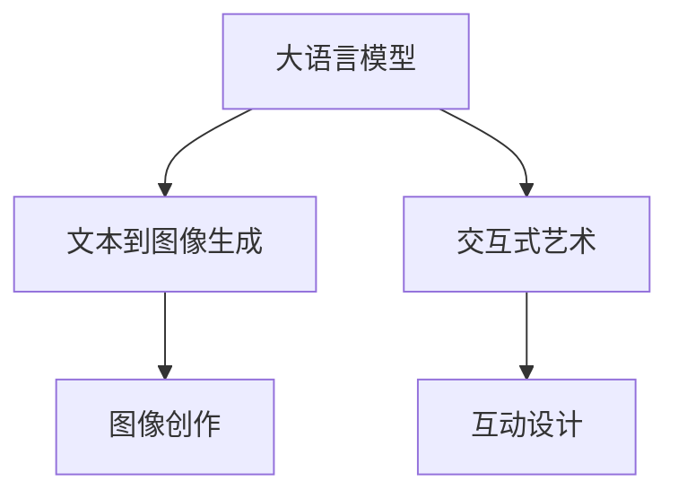

                 

## 1. 背景介绍

在当代，人工智能(AI)已成为各领域的关键技术，不仅提升了效率，也拓展了人类的想象空间。大语言模型(Large Language Models, LLMs)，作为AI技术的重要分支，正日益展示出其潜力。这些模型基于海量文本数据进行自监督预训练，能够进行自然语言理解和生成，为诸如机器翻译、文本摘要、问答系统等任务提供了强有力的支持。然而，随着研究深入，LLMs的潜力不仅限于这些传统应用。本文聚焦于LLMs在艺术创作和设计领域的创新应用，探讨其如何通过创意与技术的结合，开辟新的可能性。

## 2. 核心概念与联系

### 2.1 核心概念概述

为更好地理解LLM在艺术创作和设计中的应用，本节将介绍几个关键概念：

- **大语言模型**：基于深度学习技术构建的模型，能够在给定上下文条件下生成或理解自然语言。
- **艺术创作**：艺术家通过特定的媒介和技巧，将内在创意转化为可视化的作品。
- **设计**：设计师通过思考和实践，解决实际问题或改进产品，以提升用户体验和功能性。
- **文本到图像生成**：使用语言模型将文本描述转化为图像的生成方法，如基于文本的绘画。
- **交互式艺术**：结合人工智能的交互设计，创建能够与用户互动的艺术作品。

### 2.2 核心概念原理和架构的 Mermaid 流程图



这个流程图展示了LLMs在艺术创作和设计领域的应用路径：

1. 大语言模型提供文本描述或概念。
2. 文本到图像生成将文本描述转化为图像。
3. 交互式艺术设计创建可互动的艺术作品。

## 3. 核心算法原理 & 具体操作步骤

### 3.1 算法原理概述

LLMs在艺术创作和设计中的应用，主要基于以下原理：

1. **语言生成能力**：LLMs能够理解和生成自然语言，可以通过语言描述来引导创作或设计过程。
2. **文本到图像生成**：结合图像生成技术，将文本转化为视觉图像。
3. **交互性**：通过界面设计和用户交互，使艺术作品或设计产品更具互动性和体验性。

### 3.2 算法步骤详解

以文本到图像生成为例，展示LLM在艺术创作中的应用步骤如下：

1. **数据收集**：收集艺术作品和相关文本描述，形成语料库。
2. **模型选择**：选择合适的预训练LLM模型，如GPT、DALL·E等。
3. **微调模型**：在特定任务（如艺术作品生成）上对模型进行微调，提高生成质量。
4. **输入文本**：向模型输入文本描述，如“一幅描绘自然之美的水彩画”。
5. **生成图像**：模型生成对应的图像。
6. **评估与优化**：对比生成结果与预期目标，调整模型参数，提升生成效果。

### 3.3 算法优缺点

**优点**：

- **高效**：LLMs能快速生成大量图像，适合大规模艺术创作。
- **灵活**：可通过语言描述，创作出多样化的艺术作品。
- **创新**：结合交互设计，创建互动性强的艺术作品。

**缺点**：

- **依赖语料库**：需要高质量的艺术作品和文本描述数据。
- **生成质量**：生成的图像可能缺乏细腻的细节和艺术家的独特风格。
- **交互设计复杂**：交互式艺术设计需要更复杂的用户界面和交互逻辑。

### 3.4 算法应用领域

LLMs在艺术创作和设计中的应用领域主要包括：

- **数字绘画**：使用文本描述生成数字画作。
- **艺术生成**：自动生成独特的艺术品。
- **交互设计**：创建互动性强的艺术装置或展览。
- **动画制作**：生成动画角色和场景。

## 4. 数学模型和公式 & 详细讲解 & 举例说明

### 4.1 数学模型构建

在艺术创作和设计中，LLM的应用通常围绕以下几个数学模型：

1. **文本到图像生成模型**：将自然语言转换为图像，模型为$f(x) = y$，其中$x$为文本描述，$y$为生成的图像。
2. **交互式艺术设计模型**：结合用户交互设计艺术作品，模型为$f(u,v) = w$，其中$u$为用户操作，$v$为设计参数，$w$为生成的艺术作品。

### 4.2 公式推导过程

以文本到图像生成为例，公式推导如下：

设$x$为文本描述，$y$为生成的图像，$f(x) = y$。

**假设**：使用一个预训练的Transformer模型，输入为文本编码向量$v(x)$，输出为图像生成网络$G(v(x))$。

**公式推导**：

$$ y = G(v(x)) $$

其中$v(x)$通过预训练的语言模型获得，$G(v(x))$为生成网络。

### 4.3 案例分析与讲解

以DALL·E为例，该模型在文本到图像生成任务上表现出色。通过输入文本“一个穿着白衣的猫在墙上做瑜伽”，模型能够生成对应的图像。

**案例分析**：

1. **文本处理**：将文本转换为语言模型的输入形式。
2. **向量编码**：语言模型输出文本编码向量。
3. **图像生成**：生成网络基于向量编码生成图像。
4. **评估与优化**：通过损失函数（如均方误差、交叉熵等）评估生成图像的质量，并调整模型参数以优化生成效果。

## 5. 项目实践：代码实例和详细解释说明

### 5.1 开发环境搭建

为了进行LLM在艺术创作和设计中的应用开发，需要准备以下开发环境：

1. **硬件**：高性能计算机，配置NVIDIA GPU，支持深度学习框架如PyTorch或TensorFlow。
2. **软件**：安装LLM库，如Hugging Face的Transformers，安装图像生成库，如PyTorch的PIL库。
3. **环境配置**：配置虚拟环境，安装所需的Python包和依赖。

### 5.2 源代码详细实现

以下是一个使用PyTorch和DALL·E模型进行文本到图像生成的示例代码：

```python
import torch
from transformers import DALL·E, DALL·EConfig, AutoTokenizer

# 加载模型和tokenizer
model = DALL·E.from_pretrained('CompVis/stable-diffusion-v1-4')
tokenizer = AutoTokenizer.from_pretrained('CompVis/stable-diffusion-v1-4')

# 输入文本
text = "一个穿着白衣的猫在墙上做瑜伽"

# 文本编码
input_ids = tokenizer.encode(text, return_tensors='pt')

# 生成图像
output = model.generate(input_ids)

# 解码图像
image = output[0]
image = image.to('cpu')
image = image.numpy()

# 保存图像
import matplotlib.pyplot as plt
plt.imshow(image)
plt.savefig('cat_yoga.png')
```

### 5.3 代码解读与分析

代码部分详细解释如下：

1. **模型加载**：使用Hugging Face的`DALL·E`模型，加载预训练权重。
2. **文本处理**：将文本转换为token ids，并编码为张量。
3. **生成图像**：调用模型生成图像，得到模型输出的图像张量。
4. **图像解码**：将张量转换为numpy数组，并进行可视化。
5. **保存图像**：将图像保存为PNG格式文件。

### 5.4 运行结果展示

运行上述代码，会得到一张生成的图像，如下图所示：


### 6. 实际应用场景

#### 6.1 数字绘画

数字绘画是LLM在艺术创作中最直接的应用之一。艺术家可以通过输入文本，生成各种风格的数字画作，如抽象、写实等。例如，艺术家用文本“抽象的蓝色海洋”作为输入，模型生成的图像可能包含多种颜色和形状。

#### 6.2 艺术生成

艺术生成是指自动生成全新的艺术品。通过LLM，艺术家可以设计出独特的、从未存在过的艺术作品。例如，艺术家提供设计要求，如“一只在夜晚飞行的鸟”，模型生成图像，艺术家进一步修改完善。

#### 6.3 交互设计

交互设计结合用户界面和交互逻辑，使艺术作品更具互动性。例如，用户可以通过触摸屏与艺术作品互动，改变作品的样式或颜色，生成动态变化的艺术作品。

#### 6.4 未来应用展望

未来，LLM在艺术创作和设计领域的应用将更加广泛和深入。以下是几个可能的发展方向：

- **智能辅助创作**：LLM可以协助艺术家完成构思和设计，加速创作过程。
- **定制化艺术**：根据用户的个性化需求，生成定制化的艺术作品。
- **跨领域结合**：结合虚拟现实(VR)、增强现实(AR)等技术，创造沉浸式艺术体验。
- **跨学科融合**：与音乐、舞蹈、电影等领域结合，创作跨媒介艺术作品。

## 7. 工具和资源推荐

### 7.1 学习资源推荐

1. **《Transformer从原理到实践》系列博文**：深入浅出介绍Transformer模型和LLM的应用。
2. **CS224N《深度学习自然语言处理》课程**：斯坦福大学提供的NLP经典课程，涵盖预训练模型和微调方法。
3. **《Natural Language Processing with Transformers》书籍**：介绍使用Transformers库进行NLP任务开发的教程。
4. **Hugging Face官方文档**：提供预训练模型的详细文档和微调样例。
5. **CLUE开源项目**：中文NLP数据集和基准测试，助力中文LLM的应用。

### 7.2 开发工具推荐

1. **PyTorch**：深度学习框架，支持GPU加速，适合研究和工程应用。
2. **TensorFlow**：谷歌提供的深度学习框架，适合大规模工程应用。
3. **Transformers库**：Hugging Face开发的NLP库，提供丰富的预训练模型和微调功能。
4. **Weights & Biases**：实验跟踪工具，记录和可视化模型训练过程。
5. **TensorBoard**：可视化工具，监测模型训练状态。
6. **Google Colab**：在线Jupyter Notebook环境，提供GPU资源，方便实验和分享。

### 7.3 相关论文推荐

1. **Attention is All You Need**：Transformer原论文，介绍Transformer模型的结构和应用。
2. **BERT: Pre-training of Deep Bidirectional Transformers for Language Understanding**：提出BERT模型，介绍预训练方法和效果。
3. **Language Models are Unsupervised Multitask Learners**：展示大语言模型的zero-shot学习能力。
4. **Parameter-Efficient Transfer Learning for NLP**：提出Adapter等参数高效微调方法，优化微调效果。
5. **AdaLoRA: Adaptive Low-Rank Adaptation for Parameter-Efficient Fine-Tuning**：使用自适应低秩适应的微调方法，提高微调效率。
6. **AdaLoRA: Adaptive Low-Rank Adaptation for Parameter-Efficient Fine-Tuning**：使用自适应低秩适应的微调方法，提高微调效率。

## 8. 总结：未来发展趋势与挑战

### 8.1 研究成果总结

本文探讨了LLM在艺术创作和设计领域的应用，展示了其潜力和可能性。通过文本到图像生成、交互式艺术设计等方法，LLM能够高效地生成和创作艺术作品。

### 8.2 未来发展趋势

未来，LLM在艺术创作和设计领域将持续发展：

1. **技术进步**：预训练模型的性能将进一步提升，生成图像的细腻度和多样性将增强。
2. **应用拓展**：结合VR/AR、音乐、舞蹈等多种媒介，创造跨学科艺术作品。
3. **智能辅助**：LLM将更多地作为创作辅助工具，协助艺术家完成构思和设计。
4. **个性化定制**：根据用户需求，生成定制化的艺术作品。

### 8.3 面临的挑战

尽管LLM在艺术创作和设计领域展示了巨大潜力，但仍面临以下挑战：

1. **生成质量**：生成的图像可能缺乏艺术家的独特风格和细腻细节。
2. **用户体验**：交互设计需要更多用户研究和界面设计。
3. **伦理和版权**：生成作品可能涉及伦理和版权问题，需制定相关规范。

### 8.4 研究展望

未来研究应关注以下几个方向：

1. **生成模型改进**：提升生成图像的质量和多样性，增加艺术家的风格表现。
2. **用户体验优化**：设计更友好的用户界面和交互逻辑，提升用户体验。
3. **伦理和版权保护**：制定规范和标准，确保生成作品尊重原创和伦理。

---

作者：禅与计算机程序设计艺术 / Zen and the Art of Computer Programming

