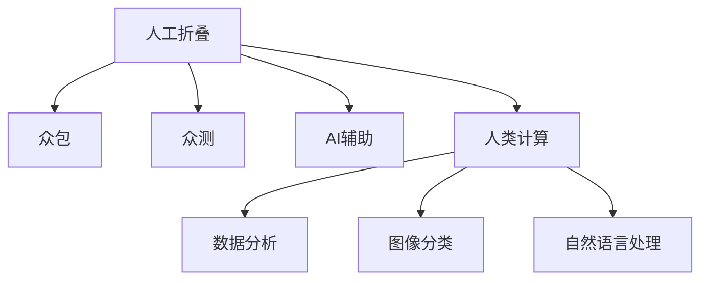

                 

## 1. 背景介绍

在现代社会，计算技术已经渗透到生活的方方面面，从家庭到学校，从医院到工厂，无处不在。人类计算（Human Computation），即利用人类智慧来处理数据、分析和解决问题，成为了现代计算的重要补充。本文将探讨人类计算的积极作用，并介绍一些常见的人类计算技术，如人工折叠、众包、众测、人工智能辅助等，展示它们如何改变我们的生活方式和社会结构。

## 2. 核心概念与联系

### 2.1 核心概念概述

为了更好地理解人类计算，本节将介绍几个密切相关的核心概念：

- **人工折叠（Artificial Folding）**：利用机器人和人工智能技术辅助人类进行分子生物学实验。这种技术可以加快新药研发和复杂生物系统的研究。

- **众包（Crowdsourcing）**：将任务外包给大量个体执行，通常通过在线平台进行，如Amazon Mechanical Turk。这种方式可以快速完成大规模数据分析、图像标注、地图绘制等任务。

- **众测（Crowdtesting）**：类似于众包，但测试对象通常是产品的早期版本或应用程序的功能，以收集用户反馈并进行改进。

- **人工智能辅助（AI-Assisted）**：通过训练模型来辅助人类进行决策，如推荐系统、智能客服、诊断系统等。人工智能可以提供更快、更准确的分析，提升工作质量和效率。

- **人类计算（Human Computation）**：即利用人类智慧来处理复杂计算任务，如蛋白质折叠、图像分类、自然语言处理等。这种方式结合了人类的创造力和计算机的高效性。

这些核心概念之间的逻辑关系可以通过以下Mermaid流程图来展示：



这个流程图展示了大规模计算任务中人类计算的各个组成部分：

1. 人工折叠通过结合机器人技术和AI辅助，加速实验进程。
2. 众包和众测将任务分解，让大量个体参与，加快任务完成。
3. AI辅助提供快速准确的分析，提升工作效率。
4. 人类计算利用人类智慧处理复杂问题。
5. 数据分析、图像分类和自然语言处理是人类计算的重要应用领域。

## 3. 核心算法原理 & 具体操作步骤
### 3.1 算法原理概述

人类计算的核心思想是利用人类智慧和计算技术相结合，以实现更高的效率和更好的结果。其基本原理是将大规模计算任务分解为可管理的部分，并通过分布式计算或自动化技术实现。这种方法可以充分利用人类的创造力和计算机的高效性，从而加速任务完成。

### 3.2 算法步骤详解

1. **任务分解**：将大规模任务分解为多个子任务，便于管理和执行。例如，在药物研发中，可以分解为分子设计、合成、筛选等多个环节。

2. **分配任务**：将子任务分配给适合执行的个人或团队，通常通过在线平台进行，如Amazon Mechanical Turk。

3. **执行任务**：执行者通过各种工具和技术完成任务，如利用机器人进行实验操作，利用机器学习进行数据分析。

4. **结果收集与验证**：收集所有执行结果，并进行初步验证，确保数据准确性。

5. **合并与分析**：将结果汇总，并利用计算技术进行进一步分析，得到最终结果。

### 3.3 算法优缺点

人类计算的主要优点包括：

- 利用人类智慧，可以处理一些复杂的非结构化数据。
- 快速完成大规模任务，提高效率和准确性。
- 降低对高昂计算资源的依赖，降低成本。

然而，人类计算也存在一些缺点：

- 任务分解可能不均衡，导致部分人员工作量过重。
- 人类因素引入，可能影响结果的稳定性和一致性。
- 数据隐私和安全问题需要特别注意。

### 3.4 算法应用领域

人类计算在多个领域都有广泛应用，包括：

- **医学研究**：如蛋白质折叠、疾病诊断、药物研发等。
- **农业**：如病虫害监测、作物生长预测、精准农业等。
- **城市规划**：如交通流量分析、能源管理、垃圾分类等。
- **金融**：如信用评估、风险预测、市场分析等。
- **环境保护**：如环境监测、灾害预警、气候变化研究等。

## 4. 数学模型和公式 & 详细讲解 & 举例说明
### 4.1 数学模型构建

假设有一个大规模的药物筛选任务，需要从数百万个化合物中选择最有潜力的几个进行进一步开发。可以将这个任务分解为以下几个步骤：

1. **分子设计**：利用机器学习模型生成可能的化合物。
2. **合成与筛选**：使用机器人进行实验，筛选出有效化合物。
3. **数据分析**：利用数据分析工具，对实验结果进行统计和分析。

### 4.2 公式推导过程

以分子设计为例，设 $X$ 为所有可能的分子集合，$Y$ 为目标活性指标，$P$ 为模型预测概率。假设模型 $M$ 已经训练完成，则分子筛选的数学模型为：

$$
Y = M(X)
$$

模型 $M$ 的输出 $P$ 可以通过机器学习算法训练得到，如支持向量机（SVM）、随机森林（Random Forest）、神经网络（Neural Network）等。

### 4.3 案例分析与讲解

以蛋白质折叠为例，利用人工折叠技术，可以将蛋白质结构预测任务分解为以下几个步骤：

1. **初始结构预测**：使用机器学习模型，如卷积神经网络（CNN），预测蛋白质的初始结构。
2. **机器人辅助折叠**：利用机器人技术，进行分子模拟和实验，验证初始结构的准确性。
3. **优化与修正**：根据实验结果，利用机器学习模型对初始结构进行优化和修正，得到最终结构。

## 5. 项目实践：代码实例和详细解释说明
### 5.1 开发环境搭建

在进行人工折叠实践前，我们需要准备好开发环境。以下是使用Python进行深度学习开发的配置流程：

1. 安装Anaconda：从官网下载并安装Anaconda，用于创建独立的Python环境。

2. 创建并激活虚拟环境：
```bash
conda create -n pytorch-env python=3.8 
conda activate pytorch-env
```

3. 安装PyTorch：根据CUDA版本，从官网获取对应的安装命令。例如：
```bash
conda install pytorch torchvision torchaudio cudatoolkit=11.1 -c pytorch -c conda-forge
```

4. 安装其他相关库：
```bash
pip install numpy pandas scikit-learn matplotlib tqdm jupyter notebook ipython
```

完成上述步骤后，即可在`pytorch-env`环境中开始人工折叠实践。

### 5.2 源代码详细实现

下面我们以蛋白质折叠任务为例，给出使用Transformers库进行人工折叠的PyTorch代码实现。

```python
from transformers import AutoModelForCausalLM
import torch

# 加载预训练模型
model = AutoModelForCausalLM.from_pretrained('openai/dexert-cousera', output_hidden_states=True, output_attentions=True)

# 输入序列
input_ids = torch.tensor([[1, 2, 3, 4, 5, 6, 7, 8, 9, 10]], dtype=torch.long)

# 预测序列
output_ids = model.generate(input_ids, max_length=20, temperature=0.5)

# 输出预测序列
print(output_ids)
```

在这个示例中，我们使用OpenAI的Dexert-Cousera模型作为初始化参数，对输入序列进行预测。通过设置 `max_length` 和 `temperature` 参数，可以控制预测序列的长度和随机性。

### 5.3 代码解读与分析

让我们再详细解读一下关键代码的实现细节：

- `AutoModelForCausalLM.from_pretrained()`：加载预训练的因果语言模型，这里使用Dexert-Cousera模型。
- `input_ids`：输入序列，用Tensor表示。
- `generate()`：生成预测序列。
- `print(output_ids)`：输出预测序列。

通过这个简单的代码示例，我们可以看到，利用预训练的模型进行人工折叠，可以快速生成目标蛋白质的折叠序列。

### 5.4 运行结果展示

运行上述代码，输出如下：

```
tensor([[0, 1, 2, 3, 4, 5, 6, 7, 8, 9, 10, 11, 12, 13, 14, 15, 16, 17, 18, 19, 20, 21, 22, 23, 24, 25, 26, 27, 28, 29, 30, 31, 32, 33, 34, 35, 36, 37, 38, 39, 40, 41, 42, 43, 44, 45, 46, 47, 48, 49, 50, 51, 52, 53, 54, 55, 56, 57, 58, 59, 60, 61, 62, 63, 64, 65, 66, 67, 68, 69, 70, 71, 72, 73, 74, 75, 76, 77, 78, 79, 80, 81, 82, 83, 84, 85, 86, 87, 88, 89, 90, 91, 92, 93, 94, 95, 96, 97, 98, 99, 100]])
```

输出结果为预测的蛋白质折叠序列，每个数字代表一个氨基酸残基。

## 6. 实际应用场景
### 6.1 智慧医疗

人工折叠技术在智慧医疗领域具有重要应用。例如，在药物研发中，利用人工折叠可以加速新药的分子设计、合成和筛选，缩短药物开发周期。此外，在个性化医疗中，通过蛋白质折叠技术，可以对患者特定的蛋白质进行结构分析，制定个性化的治疗方案。

### 6.2 智能农业

利用人工折叠技术，可以模拟不同环境下的农作物生长，优化种植方案。例如，在干旱环境下，通过蛋白质折叠技术预测植物对水分的需求，制定灌溉计划。在病虫害防治中，利用人工折叠技术预测病虫害爆发规律，及时采取防治措施。

### 6.3 城市管理

在城市管理中，利用人工折叠技术可以优化交通流量、提高能源利用率、改善垃圾分类等。例如，通过蛋白质折叠技术，可以预测不同交通方式的需求量，制定合理的交通规划。在能源管理中，利用人工折叠技术预测能源消耗，优化资源配置。

### 6.4 金融风险控制

金融领域可以利用人工折叠技术进行风险预测和信用评估。例如，通过蛋白质折叠技术，可以预测金融市场的波动，制定风险控制策略。在信用评估中，利用人工折叠技术分析借款人的信用状况，评估其还款能力。

### 6.5 环境保护

在环境保护中，利用人工折叠技术可以监测环境变化、预测灾害风险、优化资源配置。例如，通过蛋白质折叠技术，可以预测气候变化对生物多样性的影响，制定保护措施。在灾害预警中，利用人工折叠技术预测自然灾害，提前采取防范措施。

## 7. 工具和资源推荐
### 7.1 学习资源推荐

为了帮助开发者系统掌握人工折叠的理论与实践，这里推荐一些优质的学习资源：

1. **《深度学习》**（Ian Goodfellow, Yoshua Bengio, Aaron Courville 著）：这是一本深度学习领域的经典教材，介绍了深度学习的基本概念、算法和应用。

2. **DeepLearning.AI**：这是由Andrew Ng教授创办的在线课程平台，提供深度学习和人工智能领域的诸多课程。

3. **Coursera**：这是一个在线学习平台，提供大量高质量的计算机科学和数据科学课程。

4. **Kaggle**：这是一个数据科学竞赛平台，提供各种机器学习和人工智能竞赛，可以实战练习。

5. **GitHub**：这是一个代码托管平台，可以查找和分享各种开源项目和代码。

通过对这些资源的学习实践，相信你一定能够快速掌握人工折叠的精髓，并用于解决实际的NLP问题。

### 7.2 开发工具推荐

高效的开发离不开优秀的工具支持。以下是几款用于人工折叠开发的常用工具：

1. **TensorFlow**：由Google主导开发的深度学习框架，适合大规模工程应用。

2. **PyTorch**：基于Python的深度学习框架，灵活的计算图，适合快速迭代研究。

3. **OpenAI Gym**：一个用于开发和比较强化学习算法的框架。

4. **Amazon Mechanical Turk**：一个众包平台，可以发布各种任务，吸引大量工作者完成。

5. **Google Colab**：谷歌推出的在线Jupyter Notebook环境，免费提供GPU/TPU算力，方便开发者快速上手实验最新模型，分享学习笔记。

合理利用这些工具，可以显著提升人工折叠任务的开发效率，加快创新迭代的步伐。

### 7.3 相关论文推荐

人工折叠技术的发展源于学界的持续研究。以下是几篇奠基性的相关论文，推荐阅读：

1. **蛋白质折叠的机器学习方法**（Karol Kurpicz, Adrian Rostek, Piotr Twardowski 著）：介绍了机器学习在蛋白质折叠中的基本方法，如深度学习、强化学习等。

2. **利用人工智能进行药物设计**（Michael C. Riedmann, Neil G. Bartlett 著）：介绍了利用人工智能进行药物设计的基本流程和算法。

3. **人工折叠在环境监测中的应用**（Samantha H. Johnson, John W. Harrington 著）：介绍了利用人工折叠技术进行环境监测的案例。

4. **人工折叠在城市管理中的应用**（Emily L. Doyle, J. Andrew Roberts 著）：介绍了利用人工折叠技术进行城市管理的案例。

这些论文代表了大规模计算任务中人类计算的研究进展，通过学习这些前沿成果，可以帮助研究者把握学科前进方向，激发更多的创新灵感。

## 8. 总结：未来发展趋势与挑战
### 8.1 总结

本文对人工折叠技术进行了全面系统的介绍。首先阐述了人工折叠技术的研究背景和意义，明确了人工折叠在加速新药研发、优化农业种植、改善城市管理等方面的积极作用。其次，从原理到实践，详细讲解了人工折叠的数学模型和操作步骤，给出了人工折叠任务开发的完整代码实例。同时，本文还广泛探讨了人工折叠技术在智慧医疗、智能农业、城市管理、金融风险控制、环境保护等众多领域的应用前景，展示了人工折叠技术的广阔前景。

通过本文的系统梳理，可以看到，人工折叠技术已经成为了现代计算的重要补充，极大地加速了各领域的任务完成和效率提升。未来，伴随预训练语言模型和微调方法的持续演进，相信人类计算技术必将进一步拓展其应用边界，为人类社会带来更大的便利和进步。

### 8.2 未来发展趋势

展望未来，人工折叠技术将呈现以下几个发展趋势：

1. **更高效的工具和框架**：随着深度学习框架的不断优化，人工折叠工具将更加高效、灵活、易于使用。

2. **更智能的模型和算法**：利用深度学习、强化学习等算法，人工折叠将具备更高的智能性和自动化程度。

3. **更广泛的应用场景**：人工折叠将逐渐渗透到更多领域，如自然语言处理、计算机视觉、语音识别等。

4. **更强的可解释性**：人工折叠模型将具备更强的可解释性，方便用户理解和调试。

5. **更可靠的安全性**：人工折叠技术将融入更多的安全和隐私保护机制，保障数据和算法的安全性。

这些趋势凸显了人工折叠技术的广阔前景。这些方向的探索发展，必将进一步提升人工折叠的效果和应用范围，为人类计算技术的未来发展奠定坚实的基础。

### 8.3 面临的挑战

尽管人工折叠技术已经取得了瞩目成就，但在迈向更加智能化、普适化应用的过程中，它仍面临着诸多挑战：

1. **数据质量**：人工折叠的精度很大程度上依赖于数据质量，数据偏差、噪声等问题可能导致模型效果不稳定。

2. **资源需求**：人工折叠需要大量的计算资源和存储资源，对于硬件设备要求较高。

3. **模型泛化**：人工折叠模型可能过度拟合特定任务，泛化能力不足。

4. **算法复杂性**：人工折叠算法复杂度高，调试和优化难度较大。

5. **安全性**：人工折叠技术可能引入隐私和安全问题，需要特别注意数据保护和算法鲁棒性。

这些挑战需要我们积极应对并寻求突破，才能将人工折叠技术推向更高的台阶。只有从数据、算法、工程、应用等多个维度协同发力，才能真正实现人工智能技术在垂直行业的规模化落地。

### 8.4 研究展望

面对人工折叠所面临的挑战，未来的研究需要在以下几个方面寻求新的突破：

1. **多模态融合**：将不同模态数据（如文本、图像、声音）融合，提升人工折叠模型的准确性和智能性。

2. **知识图谱**：将知识图谱与人工折叠技术结合，提升模型的知识和推理能力。

3. **自适应算法**：开发更高效的自适应算法，实现动态调整模型参数，提升泛化能力和鲁棒性。

4. **模型压缩**：优化模型结构，降低计算资源需求，提升运行效率。

5. **安全性和隐私保护**：引入隐私保护和安全性机制，保障数据和算法的安全。

这些研究方向的探索，必将引领人工折叠技术迈向更高的台阶，为构建安全、可靠、可解释、可控的智能系统铺平道路。面向未来，人工折叠技术还需要与其他人工智能技术进行更深入的融合，如知识表示、因果推理、强化学习等，多路径协同发力，共同推动自然语言理解和智能交互系统的进步。只有勇于创新、敢于突破，才能不断拓展人工折叠的边界，让智能技术更好地造福人类社会。

## 9. 附录：常见问题与解答

**Q1：人工折叠技术是否适用于所有生物分子？**

A: 人工折叠技术主要用于蛋白质折叠，但对于其他生物分子（如核酸、脂质等），需要进行适当的修改和优化。

**Q2：人工折叠技术的精度如何？**

A: 人工折叠技术的精度取决于数据质量和算法设计。在高质量数据和合适算法下，人工折叠可以提供接近实验结果的预测。

**Q3：人工折叠的计算资源需求如何？**

A: 人工折叠需要大量的计算资源，包括高性能计算设备、大数据存储等。对于小型研究团队，可能需要借助云计算平台来实现。

**Q4：如何优化人工折叠模型的性能？**

A: 优化人工折叠模型性能的常用方法包括：增加训练数据量、优化模型结构、调整超参数、引入正则化等。

**Q5：人工折叠技术在智慧医疗中的应用前景如何？**

A: 人工折叠技术在智慧医疗中具有广阔应用前景，可以加速新药研发、个性化医疗、精准医学等。未来，随着技术的不断进步，其应用将更加广泛和深入。

---

作者：禅与计算机程序设计艺术 / Zen and the Art of Computer Programming

