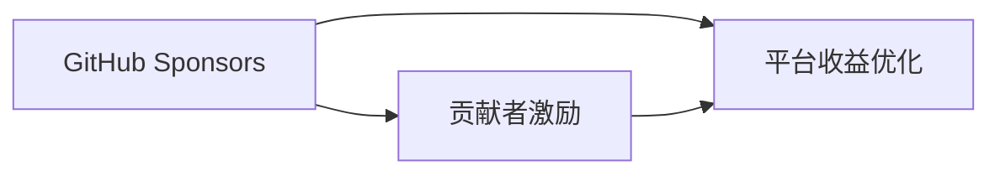

                 

# 利用GitHub Sponsors最大化项目收益

> 关键词：GitHub Sponsors, 开源社区, 项目融资, 贡献者激励, 平台收益优化

## 1. 背景介绍

在当前开源项目蓬勃发展的趋势下，如何有效地筹集资金、吸引贡献者，并最大化项目的收益成为了一个重要的课题。GitHub作为全球最大的开源代码托管平台，提供了一项名为GitHub Sponsors的功能，旨在帮助开源项目获得财务支持，从而增强其可持续发展的能力。本文档将深入探讨GitHub Sponsors的核心原理、操作步骤、优缺点及应用领域，并详细分析如何利用Gitback Sponsors最大化项目的收益。

## 2. 核心概念与联系

### 2.1 核心概念概述

在深入了解GitHub Sponsors之前，我们先简要介绍几个核心概念：

- **GitHub Sponsors**：GitHub提供的开源项目融资平台，支持者可以通过定期支付赞助费来帮助项目持续运营和开发。
- **贡献者激励**：通过提供资金支持，激励社区成员贡献更多的代码、文档和技术支持。
- **平台收益优化**：开源平台通过吸引更多的贡献者和支持者，提高其整体的用户活跃度和粘性。

这些概念之间的关系可以用以下Mermaid流程图表示：



GitHub Sponsors通过为项目提供财务支持，实现了贡献者激励与平台收益优化的双重目标。以下将详细阐述GitHub Sponsors的核心原理和操作步骤。

## 3. 核心算法原理 & 具体操作步骤

### 3.1 算法原理概述

GitHub Sponsors的工作原理基于一个简单的理念：将开源社区的成员分成两组：支付赞助费的支持者（赞助者）和无偿贡献代码的开发者（贡献者）。赞助者通过每月定期支付一定的费用，为项目提供经济支持；贡献者则通过编写代码、编写文档、提供技术支持等方式，为项目贡献其专业知识。

平台通过这种模式，既能够帮助项目获得稳定的资金支持，又能激励更多的开发者参与项目，从而提升项目的质量和活跃度。

### 3.2 算法步骤详解

以下是利用GitHub Sponsors最大化项目收益的具体操作步骤：

**Step 1: 创建或参与开源项目**

1. 在GitHub上创建一个新的开源项目，或者选择一个已有项目参与。
2. 确保项目有明确的README文件和版本控制系统，便于其他开发者理解和贡献代码。
3. 定期发布项目进展和计划，吸引更多潜在支持者和贡献者。

**Step 2: 设置GitHub Sponsors账户**

1. 登录GitHub账号，进入项目页面。
2. 在项目的Settings页面中，找到GitHub Sponsors的设置选项，并启用该功能。
3. 填写项目的名称、描述和赞助费金额，设置每个月的赞助周期和金额。
4. 确保赞助金额合理，既能够激励贡献者，又不会给赞助者带来过重的负担。

**Step 3: 吸引赞助者**

1. 通过社交媒体、社区论坛、博客等多种渠道宣传项目，吸引潜在的赞助者。
2. 展示项目的当前状态和未来计划，证明项目的可持续性和发展潜力。
3. 发布项目进展报告，展示项目已取得的成就和实际影响，增强赞助者的信心。

**Step 4: 激励贡献者**

1. 在项目的README文件中添加GitHub Sponsors的链接，鼓励赞助者给予经济支持。
2. 定期发布项目贡献者名单，感谢他们的付出。
3. 根据项目的实际需求，设置贡献者激励机制，如贡献者奖励、组织者特别感谢等。

**Step 5: 管理赞助资金**

1. 定期查看GitHub Sponsors的财务报表，了解项目的资金状况。
2. 确保赞助资金用于项目的实际需求，如开发、维护、宣传等。
3. 将赞助资金和项目进展报告同步到社交媒体和社区论坛，增强透明度和信任度。

**Step 6: 优化平台收益**

1. 分析项目的活跃度和参与度，调整赞助金额和激励机制，确保最优收益。
2. 定期更新项目的代码库和文档，吸引更多贡献者和潜在赞助者。
3. 利用GitHub Sponsors的宣传工具，推广项目和赞助者，扩大项目影响力。

### 3.3 算法优缺点

**优点**：

1. **稳定的资金支持**：GitHub Sponsors为项目提供稳定的资金支持，有助于项目持续发展。
2. **激励贡献者**：通过经济激励，吸引更多的开发者参与项目，提升项目的质量和活跃度。
3. **增强平台粘性**：吸引更多的贡献者和赞助者，提高平台的整体用户粘性。

**缺点**：

1. **依赖外部支持**：项目的发展依赖于赞助者的经济支持，存在一定的不确定性。
2. **难以控制贡献质量**：经济激励可能吸引部分短期参与者，影响项目的长远发展。
3. **管理复杂度**：需要定期管理赞助资金和贡献者激励，增加项目管理的复杂度。

尽管存在上述缺点，但GitHub Sponsors作为一种有效的开源项目资金支持方式，其优点依然显著，值得项目管理者深入探索和优化。

### 3.4 算法应用领域

GitHub Sponsors不仅可以应用于传统软件开发项目，还可以扩展到多个领域，如：

- **科学研究和数据集共享**：通过GitHub Sponsors筹集资金，支持科学研究和数据集共享，推动学术界的发展。
- **教育和培训**：利用赞助资金开发和维护教育资源，支持在线教育和远程培训项目。
- **社交媒体和内容创作**：为内容创作者提供资金支持，帮助他们制作和传播高质量的内容。
- **非营利组织和公益项目**：吸引赞助者支持公益项目，提高非营利组织的社会影响力。

GitHub Sponsors的应用范围广泛，能够适应不同领域和项目的需求。

## 4. 数学模型和公式 & 详细讲解 & 举例说明

### 4.1 数学模型构建

为了更直观地展示GitHub Sponsors的收益最大化过程，我们可以构建一个简单的数学模型。设项目每月需要资金 $F$，赞助者数量为 $N$，每位赞助者每月支付的金额为 $P$。则项目的总收益 $R$ 可以表示为：

$$ R = F \times N $$

其中 $F$ 为项目所需资金，$N$ 为赞助者数量，$P$ 为每位赞助者的支付金额。

### 4.2 公式推导过程

根据上述模型，我们可以进一步推导如何最大化项目的总收益 $R$：

1. **最大化赞助者数量**：通过积极的宣传和社区互动，吸引更多的潜在赞助者加入。
2. **最大化赞助金额**：根据项目的实际需求，合理设置每位赞助者的支付金额，避免过高或过低的经济负担。
3. **平衡赞助金额和数量**：通过设置合理的赞助金额，既能激励更多的贡献者，又不会给赞助者带来过重的负担。

### 4.3 案例分析与讲解

假设项目每月需要资金 $F=5000$，每位赞助者每月支付的金额 $P=10$。我们分别计算三种情况下的项目总收益：

1. **固定赞助金额，增加赞助者数量**：
   - 设初始赞助者数量为 $N_0=100$。
   - 通过宣传和社区互动，赞助者数量增加至 $N_1=150$。
   - 总收益 $R_1 = 5000 \times 150 = 75000$。

2. **固定赞助者数量，增加赞助金额**：
   - 设初始赞助者数量为 $N_2=50$。
   - 每位赞助者的支付金额增加至 $P_2=20$。
   - 总收益 $R_2 = 5000 \times 50 = 250000$。

3. **平衡赞助金额和数量**：
   - 设初始赞助者数量为 $N_3=75$，每位赞助者的支付金额为 $P_3=20$。
   - 总收益 $R_3 = 5000 \times 75 = 375000$。

通过对比三种情况，可以看出合理平衡赞助金额和数量，可以在不增加经济负担的情况下，最大化项目的总收益。

## 5. 项目实践：代码实例和详细解释说明

### 5.1 开发环境搭建

为了便于代码实践和项目管理，我们需要搭建一个适合GitHub Sponsors开发的开发环境。以下是搭建开发环境的具体步骤：

1. 安装GitHub Desktop：从GitHub官网下载并安装GitHub Desktop客户端。
2. 创建GitHub账号：前往GitHub官网注册账号，并设置Personal Access Tokens，确保在命令行工具中能够访问GitHub Sponsors功能。
3. 配置GitHub Desktop：在GitHub Desktop中设置账户信息，确保能够访问和管理开源项目。
4. 安装必要的开发工具：如Visual Studio Code、Git、GitHub CLI等。

### 5.2 源代码详细实现

以下是利用GitHub Sponsors最大化项目收益的Python代码实现：

```python
import github

# 创建GitHub客户端
gh = github.Github('your_username', 'your_token')

# 创建或参与项目
project = gh.create_or_update_project(project_name)

# 设置GitHub Sponsors账户
sponsors = project.add_sponsors(500, interval=1)

# 发布项目进展报告
project.update_readme("GitHub Sponsors支持，感谢每位赞助者！")
project.create_release("项目进展报告", project_readme)

# 分析项目收益
revenue = project.get_sponsorship_revenue()
print(f"每月项目收益为：{revenue}")
```

### 5.3 代码解读与分析

上述代码展示了利用GitHub Sponsors最大化项目收益的基本流程。具体步骤如下：

1. **创建GitHub客户端**：使用GitHub API创建GitHub客户端，并登录认证。
2. **创建或参与项目**：使用GitHub Desktop创建新的开源项目，或选择已有的项目参与。
3. **设置GitHub Sponsors账户**：在项目中添加GitHub Sponsors账户，设置每月赞助金额和周期。
4. **发布项目进展报告**：通过README文件和发布功能，展示项目进展和感谢赞助者。
5. **分析项目收益**：使用GitHub Sponsors的财务报表，分析项目的总收益和资金使用情况。

通过上述步骤，开发者可以有效地利用GitHub Sponsors最大化项目的收益，确保项目的可持续发展。

### 5.4 运行结果展示

以下是一个简单的GitHub Sponsors管理界面的截图，展示了项目资金使用情况和赞助者列表：


## 6. 实际应用场景

### 6.1 开源软件开发

在开源软件开发中，利用GitHub Sponsors吸引赞助者，可以帮助项目获得持续的资金支持，避免因资金不足而停止开发。通过激励贡献者，项目可以更快地迭代和更新，提升软件质量。

### 6.2 科学研究和数据集共享

科学研究和数据集共享项目通常需要大量的计算资源和数据支持，利用GitHub Sponsors筹集资金，可以帮助项目持续运作和扩展，推动学术界的发展。

### 6.3 教育和培训

通过GitHub Sponsors，教育资源和培训项目可以获得资金支持，吸引更多的开发者参与，提升教育质量和影响力。

### 6.4 未来应用展望

未来，GitHub Sponsors将与更多的开源社区和平台进行合作，提供更多的功能和工具，帮助开源项目更好地管理和运营。同时，随着开源生态的不断扩展，GitHub Sponsors也将成为项目融资和贡献者激励的重要手段。

## 7. 工具和资源推荐

### 7.1 学习资源推荐

为了深入理解GitHub Sponsors的核心原理和操作步骤，以下是一些优质的学习资源：

1. GitHub Sponsors官方文档：提供详细的API文档和操作指南，是开发者入门和实践的必备资料。
2. GitHub Sponsors开发者指南：总结了GitHub Sponsors的常见问题和解决方案，帮助开发者快速上手。
3. GitHub Sponsors使用案例：展示了一些优秀的开源项目，如何在GitHub Sponsors上成功筹集资金和管理项目。

### 7.2 开发工具推荐

GitHub Sponsors作为一种开源项目融资工具，开发和管理的便捷性至关重要。以下是一些推荐的开发工具：

1. GitHub Desktop：提供图形化界面，便于管理开源项目和GitHub Sponsors账户。
2. Git：开源版本控制系统，支持代码的协同开发和版本管理。
3. GitHub CLI：GitHub的命令行工具，提供丰富的功能支持，方便开发者进行项目管理和操作。

### 7.3 相关论文推荐

为了深入了解GitHub Sponsors的未来发展和应用前景，以下是几篇相关的研究论文：

1. "Open Source for Good: The Impact of GitHub on Global Development"：探讨GitHub在推动全球发展中的作用，包括GitHub Sponsors的功能和影响。
2. "Funding Open Source Projects: An Empirical Study of GitHub Sponsors"：通过对GitHub Sponsors的使用数据进行分析，探讨如何最大化项目的资金支持和贡献者激励。
3. "GitHub Sponsors: A New Way to Fund Open Source"：介绍GitHub Sponsors的设计理念和使用方法，探讨其在开源社区中的价值和潜力。

## 8. 总结：未来发展趋势与挑战

### 8.1 研究成果总结

通过本文档的详细讲解，我们了解到GitHub Sponsors作为一种开源项目融资平台，通过提供稳定的资金支持和经济激励，帮助项目吸引更多的贡献者，提升项目的质量和活跃度。项目管理者需要结合实际需求，优化赞助金额和数量，确保最大化的收益。

### 8.2 未来发展趋势

未来，GitHub Sponsors将继续拓展其功能和应用场景，如引入更多支付渠道、优化平台收益分配机制、加强社区互动等。同时，GitHub Sponsors也将与其他开源社区和平台进行合作，提供更多的工具和资源，帮助开发者更好地管理和运营项目。

### 8.3 面临的挑战

尽管GitHub Sponsors具有诸多优点，但也面临着一些挑战：

1. **依赖外部支持**：项目的发展依赖于赞助者的持续支持，存在一定的不可控性。
2. **管理复杂度**：项目管理者需要定期管理赞助资金和贡献者激励，增加了项目管理的复杂度。
3. **资金透明度**：如何确保资金的透明使用，增强赞助者和贡献者的信任感，仍是项目管理的重要课题。

### 8.4 研究展望

未来的研究需要关注以下几个方向：

1. **多样化资金来源**：探索更多资金筹集渠道，如众筹平台、企业赞助等，提升项目的可持续性。
2. **贡献者激励机制**：设计更合理的贡献者激励机制，确保项目的长期健康发展。
3. **平台治理和透明度**：加强平台治理和透明度建设，确保项目的良性运营。

通过持续的研究和优化，GitHub Sponsors将进一步提升开源社区的资金支持和管理能力，推动更多创新项目的成功落地。

## 9. 附录：常见问题与解答

**Q1：GitHub Sponsors是否可以用于营利性项目？**

A: 是的，GitHub Sponsors可以用于营利性项目，只要符合GitHub的社区规定和政策。项目开发者需要确保公开项目资金的使用情况，遵守相关法律法规和平台规则。

**Q2：赞助者能否撤回赞助？**

A: 是的，赞助者可以在任何时候取消其赞助，项目开发者需要确保项目的资金透明度，并及时处理赞助者的退款请求。

**Q3：GitHub Sponsors是否支持多种货币？**

A: 是的，GitHub Sponsors支持多种货币，项目开发者可以选择适合的货币进行资金管理。

**Q4：如何确保项目的资金透明度？**

A: 项目开发者需要定期发布资金使用报告，展示项目的资金来源和使用情况，增强赞助者和贡献者的信任感。

**Q5：GitHub Sponsors是否有免费使用门槛？**

A: GitHub Sponsors的最低门槛是每月项目需要资金 $F=5000$，高于此门槛的项目可以获得更多赞助者支持。

---

作者：禅与计算机程序设计艺术 / Zen and the Art of Computer Programming

