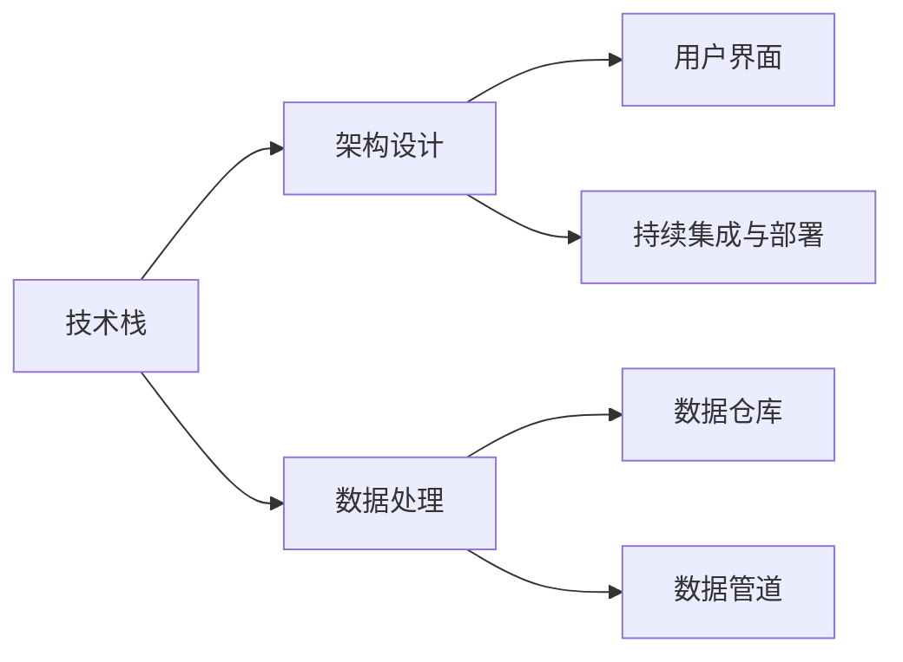

                 

## 1. 背景介绍

在数字经济的浪潮中，技术驱动型创业项目已不再是一个新鲜事物。作为数字产品的开发者，我们不仅需要具备强大的技术实力，更要理解如何将技术转化为商业价值，推动创新。本文将从技术能力提升的角度，探讨如何构建高性能、高可用的数字产品，并分析其技术实现的关键要素。

### 1.1 问题由来

技术能力的提升是数字化转型成功与否的关键因素。随着云计算、大数据、人工智能等技术的不断进步，技术已成为数字企业竞争力的重要支撑。但技术的不断革新也带来了新的挑战：如何更高效地整合、运用现有技术，提升产品性能和用户体验，成为我们面临的主要难题。

### 1.2 问题核心关键点

构建高性能数字产品，需要关注以下几个核心关键点：
- 技术栈选择与优化：不同技术栈具备不同的优势和限制，选择适合自己业务需求的技术栈，并进行优化。
- 架构设计：合理的架构设计能够提升系统的可扩展性、可维护性，确保系统稳定性。
- 高效数据处理：数据的清洗、存储、查询、分析等环节对性能的影响巨大，需要精心设计数据处理流程。
- 用户界面设计：界面设计的用户体验直接影响到产品是否能够被用户接受和持续使用。
- 持续优化与迭代：产品上线后需要不断收集反馈，进行持续优化与迭代。

## 2. 核心概念与联系

### 2.1 核心概念概述

为更好地理解构建高性能数字产品的过程，本节将介绍几个密切相关的核心概念：

- **技术栈（Stack）**：指用于开发和运维数字产品的技术工具、框架和库的集合。如前端使用的React、Vue，后端使用的Node.js、Django，数据库使用的MySQL、MongoDB等。
- **架构设计（Architecture）**：指如何将不同的技术栈和组件进行合理布局，构建一个稳定、可扩展、可维护的系统。如微服务架构、Serverless架构等。
- **数据处理（Data Processing）**：指如何高效、准确地对数据进行处理，以提升系统的响应速度和数据分析能力。如数据清洗、数据仓库、数据管道等。
- **用户界面（User Interface, UI）**：指数字产品与用户交互的界面设计，需考虑用户体验、易用性、可访问性等因素。如移动端、Web端、桌面端等。
- **持续集成与部署（CI/CD）**：指通过自动化手段，持续集成代码变更并自动部署至生产环境，提升开发效率和系统稳定性。

这些核心概念之间的逻辑关系可以通过以下Mermaid流程图来展示：



这个流程图展示了我的技术栈选择与优化、架构设计、数据处理、用户界面设计、持续集成与部署等关键技术环节之间的关系：

1. 技术栈的合理选择是构建高性能数字产品的基础。
2. 架构设计确保系统的可扩展性和可维护性。
3. 高效的数据处理提升系统的响应速度和数据分析能力。
4. 良好的用户界面设计，提升用户体验。
5. 持续集成与部署，提升开发效率和系统稳定性。

## 3. 核心算法原理 & 具体操作步骤

### 3.1 算法原理概述

构建高性能数字产品，其核心在于技术栈的合理选择与优化、架构设计、高效的数据处理、良好的用户界面设计、持续集成与部署。以下将分别介绍这些核心要素的算法原理与具体操作步骤。

### 3.2 算法步骤详解

#### 3.2.1 技术栈选择与优化

技术栈的选择需要根据具体业务需求、团队技术栈、市场趋势等多方面因素综合考虑。以下是一些常用技术栈的特点及适用场景：

- **前端**：React、Vue、Angular等JavaScript框架，适用于构建Web、移动端应用程序。
- **后端**：Node.js、Django、Spring等服务器端技术，适用于构建API接口、Web应用、企业级服务。
- **数据库**：MySQL、MongoDB、Redis等，适用于不同场景的数据存储与查询。
- **云计算**：AWS、Azure、阿里云等，提供弹性计算、存储、网络等资源。

选择技术栈后，还需进行优化，提升系统性能：
- **前端优化**：代码压缩、懒加载、使用CDN等。
- **后端优化**：异步处理、缓存、数据库索引优化等。
- **数据库优化**：表结构设计、索引优化、查询优化等。

#### 3.2.2 架构设计

架构设计是构建高性能数字产品的关键环节。合理的架构设计能够提升系统的可扩展性、可维护性和稳定性。以下是一些常用的架构设计模式：

- **微服务架构**：将系统拆分为多个小型服务，每个服务独立运行，互不依赖。适用于大型分布式系统。
- **Serverless架构**：按需使用云服务资源，降低运维成本，提升资源利用率。适用于按需调用、高并发的应用。
- **分布式架构**：通过多台机器进行负载均衡，提升系统吞吐量和可用性。适用于高流量、高可用性的应用。

架构设计需注意以下几点：
- **模块化**：将系统划分为多个独立模块，降低耦合度。
- **解耦**：服务间解耦，避免单点故障。
- **可扩展性**：系统需具备良好可扩展性，支持未来业务增长。
- **高可用性**：设计冗余机制，保证系统可用性。

#### 3.2.3 高效数据处理

数据处理是高性能数字产品的核心环节。以下是一些常用的数据处理技术：

- **数据清洗**：去除脏数据、空值，提升数据质量。
- **数据仓库**：使用如Hadoop、Spark等技术，构建集中存储、可分析的数据仓库。
- **数据管道**：使用如Apache Kafka、AWS Data Pipeline等技术，构建高效的数据传输管道。

数据处理需注意以下几点：
- **数据一致性**：保证数据的完整性和一致性，避免数据丢失、重复。
- **数据安全性**：采取加密、访问控制等措施，保护数据安全。
- **数据实时性**：提升数据的实时处理能力，快速响应业务需求。

#### 3.2.4 用户界面设计

用户界面设计是提升用户体验的重要手段。以下是一些常用的界面设计技术：

- **响应式设计**：使用CSS3、Bootstrap等技术，实现跨设备适配。
- **前端框架**：使用如React、Vue、Angular等框架，提升开发效率和用户体验。
- **界面元素优化**：优化字体、按钮、图片等界面元素，提升视觉体验。

界面设计需注意以下几点：
- **易用性**：界面需直观易用，减少用户操作难度。
- **可访问性**：保证界面对各类用户的可访问性，包括残障用户。
- **性能优化**：提升页面加载速度和响应速度，避免用户等待。

#### 3.2.5 持续集成与部署

持续集成与部署是提升开发效率和系统稳定性的重要手段。以下是一些常用的CI/CD工具：

- **持续集成工具**：Jenkins、GitLab CI、Travis CI等，实现代码变更自动构建、测试。
- **持续部署工具**：Jenkins、GitLab CI、Docker等，实现代码变更自动部署。
- **配置管理工具**：Ansible、Puppet、Chef等，实现系统配置自动化。

CI/CD需注意以下几点：
- **自动化测试**：自动化测试提升代码质量，减少人工干预。
- **版本管理**：使用如Git、SVN等版本控制工具，管理代码变更。
- **环境管理**：使用容器化技术，如Docker、Kubernetes等，管理开发、测试、生产环境。

## 4. 数学模型和公式 & 详细讲解 & 举例说明

### 4.1 数学模型构建

为更好地理解高效数据处理和用户界面设计的数学模型，本节将介绍几个密切相关的数学模型：

- **数据处理模型**：描述数据清洗、数据存储、数据查询等环节的数学模型。如SQL查询模型、MapReduce模型等。
- **用户界面设计模型**：描述用户界面元素、交互、布局等设计元素的数学模型。如页面布局模型、响应式设计模型等。

### 4.2 公式推导过程

#### 4.2.1 数据处理模型公式推导

假设我们有n条数据，每条数据包含m个特征，数据清洗后得到的数据集D，我们需要设计一个数据处理模型对数据进行清洗和存储。

**数据清洗模型**：
- **数据去重**：删除重复数据。
- **数据清洗**：去除缺失值、异常值。

**数据存储模型**：
- **关系型数据库存储**：使用如MySQL、SQLite等关系型数据库，存储结构化数据。
- **非关系型数据库存储**：使用如MongoDB、Redis等非关系型数据库，存储非结构化数据。

**数据查询模型**：
- **SQL查询**：使用如SELECT、JOIN、GROUP BY等SQL语句，进行复杂查询。
- **分布式查询**：使用如Apache Spark、Hadoop等技术，进行分布式查询。

#### 4.2.2 用户界面设计模型公式推导

假设我们有一个Web页面，页面包含多个组件，每个组件的尺寸、位置、交互行为等属性不同。

**界面布局模型**：
- **响应式布局**：使用CSS Grid、Flexbox等技术，实现页面自适应布局。
- **栅格布局**：使用Bootstrap等技术，实现栅格布局。

**界面元素模型**：
- **字体模型**：使用如Font Awesome、Google Fonts等技术，实现字体设计。
- **按钮模型**：使用如Material UI、Bootstrap等技术，实现按钮设计。
- **图片模型**：使用如ImageMagick、Pillow等技术，实现图片处理。

**交互行为模型**：
- **事件处理模型**：使用如addEventListener、handleClick等技术，实现事件处理。
- **动画模型**：使用如CSS3动画、JavaScript动画等技术，实现页面动画效果。

### 4.3 案例分析与讲解

#### 4.3.1 数据处理模型案例分析

以电商平台订单数据处理为例，展示数据清洗、存储、查询的完整流程。

**数据清洗**：
- **去重**：去重ID字段，删除重复订单。
- **清洗**：去除空值、异常值，保证数据完整性。

**数据存储**：
- **关系型数据库存储**：使用MySQL存储订单信息、用户信息等结构化数据。
- **非关系型数据库存储**：使用Redis存储订单状态、用户行为等非结构化数据。

**数据查询**：
- **SQL查询**：使用SELECT语句，查询订单信息、用户信息等数据。
- **分布式查询**：使用Spark进行复杂查询，提升查询效率。

#### 4.3.2 用户界面设计模型案例分析

以电商APP为例，展示界面布局、组件设计、交互行为等完整流程。

**界面布局**：
- **响应式布局**：使用CSS Grid实现页面自适应布局。
- **栅格布局**：使用Bootstrap实现栅格布局，保证页面一致性。

**界面元素设计**：
- **字体设计**：使用Google Fonts设计页面字体。
- **按钮设计**：使用Material UI设计按钮，提升点击响应速度。
- **图片处理**：使用Pillow处理图片，提升加载速度。

**交互行为设计**：
- **事件处理**：使用addEventListener实现按钮点击事件处理。
- **动画效果**：使用CSS3动画实现页面过渡效果，提升用户体验。

## 5. 项目实践：代码实例和详细解释说明

### 5.1 开发环境搭建

在进行项目实践前，我们需要准备好开发环境。以下是使用Python进行Django开发的环境配置流程：

1. 安装Anaconda：从官网下载并安装Anaconda，用于创建独立的Python环境。

2. 创建并激活虚拟环境：
```bash
conda create -n django-env python=3.8 
conda activate django-env
```

3. 安装Django：根据CUDA版本，从官网获取对应的安装命令。例如：
```bash
pip install django
```

4. 安装Django REST framework：
```bash
pip install djangorestframework
```

5. 安装各类工具包：
```bash
pip install numpy pandas scikit-learn matplotlib tqdm jupyter notebook ipython
```

完成上述步骤后，即可在`django-env`环境中开始项目开发。

### 5.2 源代码详细实现

下面我们以电商订单管理系统的开发为例，给出使用Django框架进行项目开发的PyTorch代码实现。

**1. 创建Django项目和应用**：
```bash
django-admin startproject order management
cd order management
```

**2. 创建订单应用**：
```bash
python manage.py startapp orders
```

**3. 定义模型**：
```python
from django.db import models
from django.contrib.auth.models import User

class Order(models.Model):
    user = models.ForeignKey(User, on_delete=models.CASCADE)
    product = models.CharField(max_length=100)
    amount = models.DecimalField(max_digits=10, decimal_places=2)
    status = models.CharField(max_length=20)
    created_at = models.DateTimeField(auto_now_add=True)
    updated_at = models.DateTimeField(auto_now=True)

class OrderItem(models.Model):
    order = models.ForeignKey(Order, on_delete=models.CASCADE)
    product = models.CharField(max_length=100)
    quantity = models.IntegerField()
    price = models.DecimalField(max_digits=10, decimal_places=2)
    created_at = models.DateTimeField(auto_now_add=True)
    updated_at = models.DateTimeField(auto_now=True)
```

**4. 定义视图**：
```python
from django.shortcuts import render
from rest_framework.views import APIView
from rest_framework.response import Response
from .models import Order, OrderItem

class OrderList(APIView):
    def get(self, request):
        orders = Order.objects.all()
        return Response(orders)

class OrderDetail(APIView):
    def get(self, request, pk):
        order = Order.objects.get(id=pk)
        return Response(order)
```

**5. 定义序列化器**：
```python
from rest_framework import serializers
from .models import Order, OrderItem

class OrderItemSerializer(serializers.ModelSerializer):
    class Meta:
        model = OrderItem
        fields = ('product', 'quantity', 'price', 'created_at', 'updated_at')

class OrderSerializer(serializers.ModelSerializer):
    items = OrderItemSerializer(many=True)

    class Meta:
        model = Order
        fields = ('user', 'product', 'amount', 'status', 'created_at', 'updated_at', 'items')
```

**6. 定义URL路由**：
```python
from django.urls import path
from .views import OrderList, OrderDetail

urlpatterns = [
    path('orders/', OrderList.as_view()),
    path('orders/<int:pk>/', OrderDetail.as_view()),
]
```

**7. 定义视图函数**：
```python
from django.shortcuts import render
from rest_framework.views import APIView
from rest_framework.response import Response
from .models import Order, OrderItem

class OrderList(APIView):
    def get(self, request):
        orders = Order.objects.all()
        return Response(orders)

class OrderDetail(APIView):
    def get(self, request, pk):
        order = Order.objects.get(id=pk)
        return Response(order)
```

**8. 启动Django服务**：
```bash
python manage.py runserver
```

以上是一个简单的Django项目开发流程，包括了项目创建、模型定义、视图定义、序列化器定义、URL路由定义、视图函数定义等关键步骤。通过Django框架，可以轻松实现RESTful API接口，提升Web应用程序开发效率。

### 5.3 代码解读与分析

让我们再详细解读一下关键代码的实现细节：

**1. 模型定义**：
- 使用Django ORM定义了订单和订单项模型，包括用户、产品、数量、金额、状态等属性。

**2. 视图定义**：
- 使用Django REST framework定义了订单列表和订单详情视图，通过get方法获取订单信息。

**3. 序列化器定义**：
- 使用Django REST framework定义了订单项和订单序列化器，方便API返回的数据序列化。

**4. URL路由定义**：
- 使用Django定义了订单列表和订单详情的URL路由，方便API访问。

**5. 视图函数定义**：
- 使用Django定义了订单列表和订单详情的视图函数，通过get方法获取订单信息。

**6. 启动Django服务**：
- 使用Django的开发服务器启动API接口服务，方便测试和调试。

### 5.4 运行结果展示

在Django服务启动后，可以通过浏览器访问`http://localhost:8000/orders/`来查看订单列表，点击某个订单ID，访问`http://localhost:8000/orders/<id>/`来查看订单详情。

## 6. 实际应用场景

### 6.1 电商平台

基于Django开发电商平台的订单管理系统，可以实现对订单数据的清洗、存储、查询和分析。通过RESTful API接口，可以快速获取订单信息、生成订单报表、统计订单数据等。

### 6.2 在线教育平台

基于Django开发在线教育平台的课程管理与销售系统，可以实现对课程数据、订单数据、用户行为数据的清洗、存储、查询和分析。通过RESTful API接口，可以快速获取课程信息、生成报表、统计销售数据等。

### 6.3 在线旅游平台

基于Django开发在线旅游平台的订单管理与用户行为分析系统，可以实现对订单数据、用户行为数据的清洗、存储、查询和分析。通过RESTful API接口，可以快速获取订单信息、生成报表、统计用户行为等。

### 6.4 未来应用展望

随着技术的不断发展，Django框架将提供更多的功能和工具，支持更多最新的技术栈和架构设计，满足更高性能和更高效的需求。同时，更多开发者将基于Django框架，开发出更丰富、更优质的数字产品，推动数字化转型加速前行。

## 7. 工具和资源推荐

### 7.1 学习资源推荐

为了帮助开发者掌握Django框架的使用方法，这里推荐一些优质的学习资源：

1. **Django官方文档**：Django官方文档，提供了完整的框架介绍、开发教程、API参考等，是Django开发者必备的学习资料。
2. **《Django实战》（Chinese）**：杜波等著，系统介绍了Django框架的使用方法和实战案例，适合初学者入门。
3. **《Flask Web开发实战》（Chinese）**：黄欣宇著，介绍了Flask框架的使用方法和实战案例，适合有Django基础的学习者。
4. **《RESTful API设计与开发》（Chinese）**：阮一峰著，介绍了RESTful API的设计原则和开发方法，适合开发API接口的开发者。
5. **Django Girls**：Django官方社区推出的在线课程，适合入门级的Django开发者学习。

通过对这些资源的学习实践，相信你一定能够快速掌握Django框架的使用方法，并用于解决实际的开发问题。

### 7.2 开发工具推荐

高效的开发离不开优秀的工具支持。以下是几款用于Django开发常用的工具：

1. **Django IDE**：PyCharm、Visual Studio Code等IDE，提供了丰富的Django插件和调试功能，提升开发效率。
2. **版本控制工具**：Git、SVN等版本控制工具，用于管理代码变更，便于团队协作开发。
3. **测试框架**：pytest、unittest等测试框架，用于编写单元测试、集成测试，提升代码质量。
4. **部署工具**：Docker、Ansible等部署工具，用于快速部署Django应用，提升系统稳定性。
5. **性能优化工具**：New Relic、Sentry等性能优化工具，用于监控系统性能，提升用户体验。

合理利用这些工具，可以显著提升Django开发效率和系统稳定性，推动数字化项目顺利上线。

### 7.3 相关论文推荐

Django框架的发展源于学界的持续研究。以下是几篇奠基性的相关论文，推荐阅读：

1. **《Django: A High-Level Python Web Framework》**：Django官方论文，介绍了Django框架的设计理念和实现方法，是了解Django的必读论文。
2. **《Django ORM: A Brief Introduction》**：Django官方文档，介绍了Django ORM的使用方法和最佳实践，适合了解Django ORM的使用。
3. **《Django REST framework》**：Django REST framework官方文档，介绍了RESTful API的设计方法和开发技巧，适合开发RESTful API接口的开发者。
4. **《Django Project Design Patterns》**：Google工程师Yuval Horovitz的博客，介绍了Django项目的设计模式和最佳实践，适合有Django开发经验的学习者。
5. **《A Survey of RESTful API Design Patterns》**：王聪、张建兵等著，介绍了RESTful API的设计模式和优化方法，适合开发RESTful API接口的开发者。

这些论文代表了大规模语言模型微调技术的发展脉络。通过学习这些前沿成果，可以帮助研究者把握学科前进方向，激发更多的创新灵感。

## 8. 总结：未来发展趋势与挑战

### 8.1 总结

本文对基于技术能力构建高性能数字产品的过程进行了全面系统的介绍。首先阐述了技术栈选择与优化、架构设计、高效数据处理、良好用户界面设计、持续集成与部署等核心技术环节，明确了构建高性能数字产品所需的关键要素。其次，从原理到实践，详细讲解了技术栈选择与优化、架构设计、高效数据处理、用户界面设计、持续集成与部署等关键技术环节的算法原理与具体操作步骤，给出了Django框架的完整代码实例。同时，本文还广泛探讨了技术栈选择与优化、架构设计、高效数据处理、用户界面设计、持续集成与部署等技术环节在电商平台、在线教育平台、在线旅游平台等多个行业领域的应用前景，展示了Django框架的广阔应用空间。最后，本文精选了技术栈选择与优化、架构设计、高效数据处理、用户界面设计、持续集成与部署等技术环节的学习资源、开发工具、相关论文推荐，力求为读者提供全方位的技术指引。

通过本文的系统梳理，可以看到，基于技术能力构建高性能数字产品是数字化转型的关键因素。这些核心技术环节的不断优化与迭代，将推动数字产品不断提升性能和用户体验，加速数字化转型的进程。未来，随着技术的不断进步，Django框架和各类技术工具将不断更新迭代，为开发者提供更高效、更强大的开发平台，推动更多优秀数字产品的诞生。

### 8.2 未来发展趋势

展望未来，基于技术能力构建高性能数字产品将呈现以下几个发展趋势：

1. **技术栈多样化**：随着新技术的不断涌现，技术栈将更加多样化，开发者可以灵活选择适合自己业务需求的技术栈。
2. **架构设计复杂化**：随着业务需求的变化，架构设计将更加复杂，如微服务、Serverless等架构将被广泛应用。
3. **数据处理实时化**：随着业务需求的提升，数据处理将更加实时化，如流计算、实时数据仓库等技术将被广泛应用。
4. **用户界面智能化**：随着AI技术的发展，用户界面将更加智能化，如聊天机器人、智能推荐等技术将被广泛应用。
5. **持续集成自动化**：随着持续集成与部署技术的发展，自动化水平将不断提升，如自动化测试、CI/CD流水线等技术将被广泛应用。

这些趋势将推动数字化产品不断提升性能和用户体验，加速数字化转型的进程。

### 8.3 面临的挑战

尽管Django框架在构建高性能数字产品方面具备诸多优势，但在应用过程中也面临诸多挑战：

1. **性能瓶颈**：随着业务需求的提升，Django框架在处理大规模数据和复杂业务时可能会遇到性能瓶颈，需要优化性能。
2. **安全性**：随着Django框架的广泛应用，安全漏洞和攻击手段也不断增加，需加强安全防护。
3. **扩展性**：随着业务需求的复杂化和变化，Django框架需不断优化扩展性，支持更多的业务场景。
4. **开发难度**：Django框架的学习曲线较陡峭，需要一定的开发经验和技术积累。
5. **资源消耗**：Django框架在运行时可能会消耗较多的系统资源，需优化资源使用。

正视Django框架面临的这些挑战，积极应对并寻求突破，将有助于Django框架不断优化和提升，为开发者提供更高效、更强大的开发平台，推动更多优秀数字产品的诞生。

### 8.4 研究展望

面对Django框架面临的这些挑战，未来的研究需要在以下几个方面寻求新的突破：

1. **性能优化**：优化Django框架的性能，提升其在处理大规模数据和复杂业务时的能力。
2. **安全防护**：加强Django框架的安全防护，防止安全漏洞和攻击。
3. **扩展性优化**：优化Django框架的扩展性，支持更多的业务场景。
4. **开发难度降低**：降低Django框架的学习曲线，提升开发效率和用户友好度。
5. **资源消耗优化**：优化Django框架的资源使用，提升系统稳定性。

这些研究方向的探索，必将引领Django框架不断优化和提升，为开发者提供更高效、更强大的开发平台，推动更多优秀数字产品的诞生。面向未来，Django框架和各类技术工具将不断更新迭代，为开发者提供更高效、更强大的开发平台，推动更多优秀数字产品的诞生。

## 9. 附录：常见问题与解答

**Q1：Django框架的优势是什么？**

A: Django框架具备以下优势：
- **高效开发**：提供了丰富的开发工具和库，提升开发效率。
- **安全性高**：具备良好的安全防护机制，防止安全漏洞和攻击。
- **社区活跃**：拥有庞大的用户和开发者社区，资源丰富。
- **功能全面**：具备丰富的功能模块，支持多种业务场景。

**Q2：Django框架的缺点是什么？**

A: Django框架也有一些缺点：
- **学习曲线陡峭**：需要一定的开发经验和技术积累。
- **性能瓶颈**：在处理大规模数据和复杂业务时可能会遇到性能瓶颈。
- **扩展性有限**：在处理大规模和复杂业务时，扩展性可能不足。
- **资源消耗高**：在运行时可能会消耗较多的系统资源。

**Q3：如何使用Django框架构建高性能数字产品？**

A: 使用Django框架构建高性能数字产品，需注意以下几点：
- **选择合适的技术栈**：选择适合自己业务需求的技术栈，并进行优化。
- **优化性能**：优化Django框架的性能，提升其在处理大规模数据和复杂业务时的能力。
- **加强安全防护**：加强Django框架的安全防护，防止安全漏洞和攻击。
- **优化扩展性**：优化Django框架的扩展性，支持更多的业务场景。
- **降低开发难度**：降低Django框架的学习曲线，提升开发效率和用户友好度。
- **优化资源使用**：优化Django框架的资源使用，提升系统稳定性。

这些优化措施将有助于Django框架在构建高性能数字产品方面发挥更大的作用。

---

作者：禅与计算机程序设计艺术 / Zen and the Art of Computer Programming

