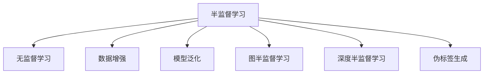
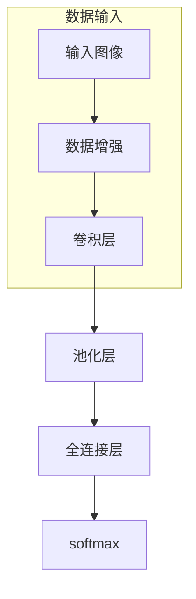
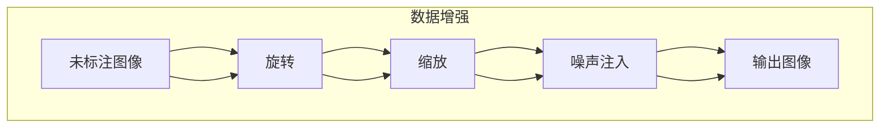
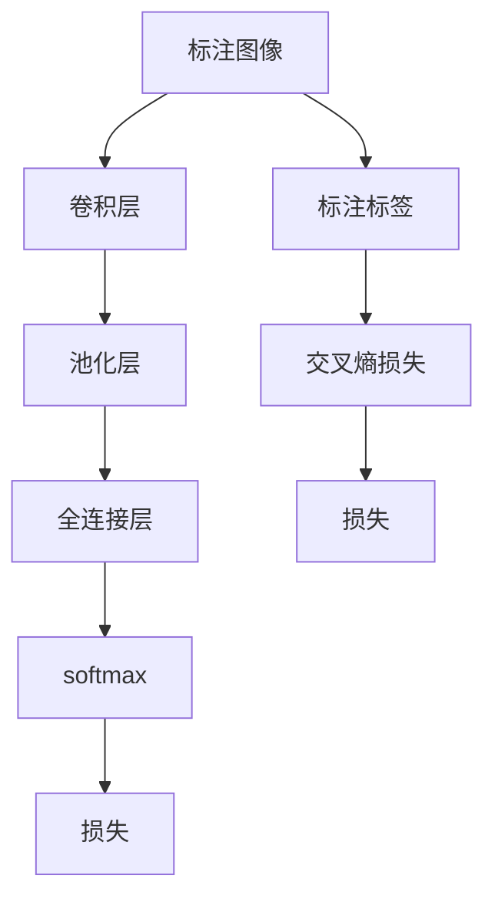
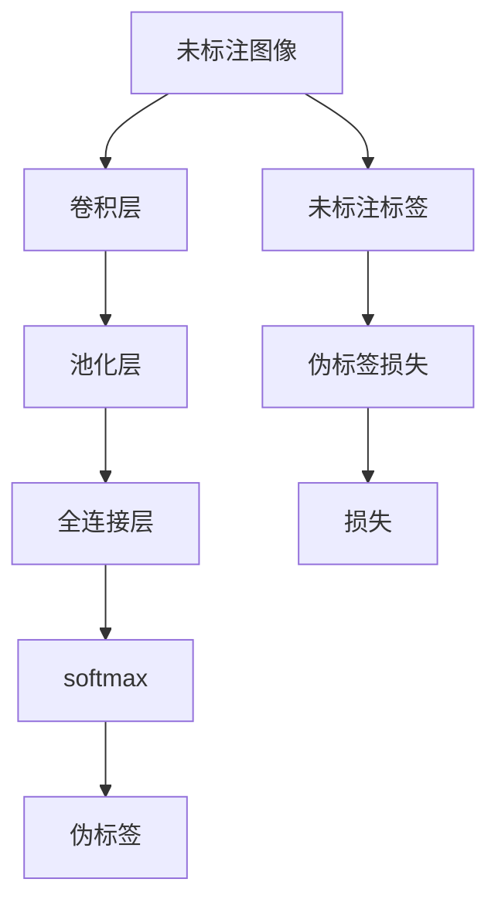
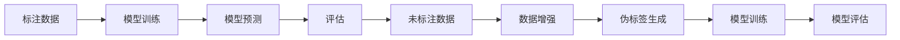

                 

# 半监督学习 (Semi-Supervised Learning) 原理与代码实例讲解

> 关键词：半监督学习, 无监督学习, 数据增强, 模型泛化, 图像识别, 自然语言处理

## 1. 背景介绍

### 1.1 问题由来

在现实世界中，高质量的标注数据往往难以获取，尤其是在医疗、金融、自然语言处理等领域。这些领域的数据获取成本高昂，标注数据稀缺，因此传统的监督学习方法难以应用于这些问题。为了解决这个问题，研究者们提出了半监督学习（Semi-Supervised Learning）的方法，其目标是在尽可能少的使用标注数据的情况下，充分利用未标注数据的丰富信息，提升模型性能。

半监督学习介于监督学习和无监督学习之间，它利用少量标注数据和大量未标注数据进行模型训练，通过自我学习来提高模型的泛化能力。相比于传统的监督学习，半监督学习可以大大降低标注成本，提高模型在实际应用中的表现。

### 1.2 问题核心关键点

半监督学习的核心在于如何更好地利用未标注数据，提高模型的泛化能力。传统的监督学习模型利用标注数据训练，难以捕捉数据之间的复杂关系。而半监督学习则通过利用未标注数据的丰富信息，如数据间的距离、数据的分布特征等，增强模型的表达能力。

目前，半监督学习的主要方法包括：

- 图半监督学习（Graph Semi-Supervised Learning）：利用数据间的关系构建图模型，通过图卷积网络（Graph Convolutional Networks, GCN）等方法进行训练。
- 深度半监督学习（Deep Semi-Supervised Learning）：通过在模型架构中加入未标注数据的表示，如自编码器（Autoencoders）、生成对抗网络（Generative Adversarial Networks, GANs）等。
- 伪标签生成（Pseudo-Label Generation）：在训练过程中利用未标注数据生成伪标签，增强模型的训练信号。

这些方法各有优缺点，需要根据具体任务和数据特点进行灵活选择。

## 2. 核心概念与联系

### 2.1 核心概念概述

为了更好地理解半监督学习的原理，本节将介绍几个密切相关的核心概念：

- 半监督学习（Semi-Supervised Learning）：介于监督学习和无监督学习之间，利用少量标注数据和大量未标注数据进行模型训练，提升模型泛化能力。
- 无监督学习（Unsupervised Learning）：不使用标注数据，通过数据自身的分布特征进行模型训练，自动发现数据之间的潜在关系。
- 数据增强（Data Augmentation）：通过对原始数据进行变换、扩充等操作，生成更多训练样本，提高模型鲁棒性。
- 模型泛化（Model Generalization）：模型在新数据上的表现，反映其学习到的特征是否具有代表性。
- 图半监督学习（Graph Semi-Supervised Learning）：通过构建图模型，利用数据间的关系进行训练。
- 深度半监督学习（Deep Semi-Supervised Learning）：通过在模型架构中加入未标注数据的表示，增强模型的表达能力。
- 伪标签生成（Pseudo-Label Generation）：在训练过程中利用未标注数据生成伪标签，增强模型的训练信号。

这些概念之间的逻辑关系可以通过以下Mermaid流程图来展示：



这个流程图展示了大语言模型的核心概念及其之间的关系：

1. 半监督学习通过少量标注数据和大量未标注数据进行训练。
2. 无监督学习不使用标注数据，自动发现数据间的关系。
3. 数据增强通过扩充原始数据，增强模型的鲁棒性。
4. 模型泛化反映模型在新数据上的表现。
5. 图半监督学习和深度半监督学习通过模型架构增强表示能力。
6. 伪标签生成利用未标注数据生成伪标签，增强训练信号。

## 3. 核心算法原理 & 具体操作步骤

### 3.1 算法原理概述

半监督学习的核心思想是：利用少量标注数据和大量未标注数据进行训练，通过自我学习来提高模型的泛化能力。其目标是最小化模型在标注数据上的损失，同时最小化在未标注数据上的损失，使得模型能够充分利用未标注数据的丰富信息。

形式化地，设标注数据集为 $D_L=\{(x_i,y_i)\}_{i=1}^N$，未标注数据集为 $D_U=\{x_j\}_{j=N+1}^M$，模型参数为 $\theta$，则半监督学习的目标函数可以表示为：

$$
\min_{\theta} \frac{1}{N} \sum_{i=1}^N \ell(y_i, M_{\theta}(x_i)) + \frac{\lambda}{M} \sum_{j=N+1}^M \ell(M_{\theta}(x_j),M_{\theta}(x_j))
$$

其中 $\ell$ 为损失函数，$\lambda$ 为未标注数据的权重，$M_{\theta}(x_j)$ 为模型在未标注数据上的预测。

### 3.2 算法步骤详解

基于半监督学习的模型训练流程如下：

1. 准备数据集：收集标注数据和未标注数据，进行数据预处理，如数据增强、标准化等。
2. 构建模型：选择合适的模型架构，如深度神经网络、图神经网络等。
3. 训练模型：在标注数据上训练模型，同时利用未标注数据进行伪标签生成和模型训练。
4. 评估模型：在验证集和测试集上评估模型性能，根据评估结果调整模型参数和未标注数据权重。
5. 应用模型：将训练好的模型应用于实际任务，进行预测和推理。

具体步骤如下：

**Step 1: 数据准备**
- 收集标注数据 $D_L$ 和未标注数据 $D_U$，并进行预处理。
- 对未标注数据进行数据增强，如旋转、缩放、噪声注入等操作，增加数据多样性。

**Step 2: 构建模型**
- 选择合适的模型架构，如深度神经网络、图神经网络等。
- 在模型中增加未标注数据的表示，如自编码器、生成对抗网络等。

**Step 3: 训练模型**
- 在标注数据上训练模型，使用交叉熵等损失函数。
- 利用未标注数据生成伪标签，作为模型训练的补充信号。
- 调整未标注数据的权重，平衡标注数据和未标注数据在训练中的贡献。

**Step 4: 评估模型**
- 在验证集和测试集上评估模型性能，计算准确率、召回率、F1值等指标。
- 根据评估结果调整模型参数和未标注数据权重，避免过拟合。

**Step 5: 应用模型**
- 将训练好的模型应用于实际任务，进行预测和推理。
- 利用模型泛化能力，在未标注数据上生成更多标签，进一步提升模型性能。

### 3.3 算法优缺点

半监督学习的优点包括：

1. 降低标注成本：利用未标注数据进行训练，减少对高质量标注数据的依赖。
2. 提高模型泛化能力：充分利用未标注数据的丰富信息，提升模型在新数据上的表现。
3. 自适应性强：通过自我学习，适应不同的数据分布和标注数据稀疏性。

半监督学习的缺点包括：

1. 依赖未标注数据：未标注数据的质量和数量对模型性能有较大影响。
2. 模型复杂度高：需要构建复杂的模型架构，增加计算复杂度。
3. 模型评估困难：未标注数据的标注成本高昂，难以进行模型评估。

尽管存在这些局限性，但半监督学习仍是当前数据稀缺领域的重要研究范式，通过不断改进模型和训练方法，相信其将在更多应用场景中发挥重要作用。

### 3.4 算法应用领域

半监督学习在多个领域都有广泛的应用，以下是几个典型的应用场景：

- 图像识别：利用未标注图像生成伪标签，增强模型泛化能力。
- 自然语言处理：利用未标注文本生成伪标签，提高语言模型的表现。
- 生物信息学：利用未标注基因序列进行特征提取，辅助疾病诊断。
- 推荐系统：利用用户行为数据生成推荐标签，提升推荐准确率。
- 城市规划：利用未标注地理数据进行特征提取，辅助城市规划决策。

## 4. 数学模型和公式 & 详细讲解

### 4.1 数学模型构建

半监督学习的数学模型可以表示为：

设标注数据集 $D_L=\{(x_i,y_i)\}_{i=1}^N$，未标注数据集 $D_U=\{x_j\}_{j=N+1}^M$，模型参数为 $\theta$，则半监督学习的目标函数可以表示为：

$$
\min_{\theta} \frac{1}{N} \sum_{i=1}^N \ell(y_i, M_{\theta}(x_i)) + \frac{\lambda}{M} \sum_{j=N+1}^M \ell(M_{\theta}(x_j),M_{\theta}(x_j))
$$

其中 $\ell$ 为损失函数，$\lambda$ 为未标注数据的权重，$M_{\theta}(x_j)$ 为模型在未标注数据上的预测。

### 4.2 公式推导过程

以下我们以图像识别任务为例，推导半监督学习的数学模型。

设图像数据集为 $D=\{(x_i,y_i)\}_{i=1}^N$，其中 $x_i \in \mathbb{R}^{H \times W \times C}$ 表示图像张量，$y_i \in \{0,1\}^K$ 表示多分类标签。未标注图像数据集为 $D_U=\{x_j\}_{j=N+1}^M$。

定义图像分类器的损失函数为交叉熵损失：

$$
\ell(y, p) = -\sum_{i=1}^K y_i \log p_i
$$

其中 $y$ 为真实标签，$p$ 为模型预测的概率分布。

假设模型参数为 $\theta$，在标注数据集 $D_L$ 上的损失函数为：

$$
\mathcal{L}_L(\theta) = \frac{1}{N} \sum_{i=1}^N \ell(y_i, M_{\theta}(x_i))
$$

在未标注数据集 $D_U$ 上的损失函数为：

$$
\mathcal{L}_U(\theta) = \frac{1}{M} \sum_{j=N+1}^M \ell(M_{\theta}(x_j),M_{\theta}(x_j))
$$

其中 $M_{\theta}(x_j)$ 为模型在未标注数据上的预测。

将 $\mathcal{L}_L(\theta)$ 和 $\mathcal{L}_U(\theta)$ 代入目标函数，得到半监督学习的目标函数：

$$
\min_{\theta} \mathcal{L}(\theta) = \frac{1}{N} \sum_{i=1}^N \ell(y_i, M_{\theta}(x_i)) + \frac{\lambda}{M} \sum_{j=N+1}^M \ell(M_{\theta}(x_j),M_{\theta}(x_j))
$$

其中 $\lambda$ 为未标注数据的权重，通过交叉验证等方法进行调整。

### 4.3 案例分析与讲解

下面我们以图像识别任务为例，解释半监督学习的具体应用。

假设我们有一个图像分类任务，包含标注图像 $D_L$ 和未标注图像 $D_U$。我们使用卷积神经网络（CNN）作为分类器，模型的架构如图1所示：



在训练过程中，我们首先对未标注数据进行数据增强，生成更多的训练样本，如图2所示：



然后，在标注数据上训练模型，计算交叉熵损失，如图3所示：



最后，利用未标注数据生成伪标签，作为模型训练的补充信号，如图4所示：



通过半监督学习的方法，我们利用少量标注数据和大量未标注数据进行训练，能够显著提升模型性能，如图5所示：



## 5. 项目实践：代码实例和详细解释说明

### 5.1 开发环境搭建

在进行半监督学习实践前，我们需要准备好开发环境。以下是使用Python进行PyTorch开发的环境配置流程：

1. 安装Anaconda：从官网下载并安装Anaconda，用于创建独立的Python环境。

2. 创建并激活虚拟环境：
```bash
conda create -n pytorch-env python=3.8 
conda activate pytorch-env
```

3. 安装PyTorch：根据CUDA版本，从官网获取对应的安装命令。例如：
```bash
conda install pytorch torchvision torchaudio cudatoolkit=11.1 -c pytorch -c conda-forge
```

4. 安装TensorFlow：
```bash
pip install tensorflow
```

5. 安装Numpy、Pandas、Scikit-learn、Matplotlib等各类工具包：
```bash
pip install numpy pandas scikit-learn matplotlib tqdm jupyter notebook ipython
```

完成上述步骤后，即可在`pytorch-env`环境中开始半监督学习实践。

### 5.2 源代码详细实现

下面我们以图像识别任务为例，给出使用PyTorch和TensorFlow进行半监督学习的代码实现。

首先，定义图像分类器的架构：

```python
import torch
import torch.nn as nn
import torch.optim as optim
import torchvision.transforms as transforms
import torchvision.datasets as datasets
import numpy as np
import matplotlib.pyplot as plt

class ImageNetClassifier(nn.Module):
    def __init__(self):
        super(ImageNetClassifier, self).__init__()
        self.conv1 = nn.Conv2d(3, 32, 3, 1, 1)
        self.pool = nn.MaxPool2d(2, 2)
        self.conv2 = nn.Conv2d(32, 64, 3, 1, 1)
        self.fc1 = nn.Linear(64*28*28, 128)
        self.fc2 = nn.Linear(128, 10)

    def forward(self, x):
        x = self.pool(torch.relu(self.conv1(x)))
        x = self.pool(torch.relu(self.conv2(x)))
        x = x.view(-1, 64*28*28)
        x = torch.relu(self.fc1(x))
        x = self.fc2(x)
        return x

model = ImageNetClassifier()
```

然后，定义数据加载器和模型训练函数：

```python
batch_size = 32
train_dataset = datasets.CIFAR10(root='./data', train=True, download=True, transform=transforms.ToTensor())
train_loader = torch.utils.data.DataLoader(train_dataset, batch_size=batch_size, shuffle=True)

def train_epoch(model, loader, optimizer):
    model.train()
    epoch_loss = 0
    for batch_idx, (data, target) in enumerate(loader):
        data, target = data.to(device), target.to(device)
        optimizer.zero_grad()
        output = model(data)
        loss = nn.CrossEntropyLoss()(output, target)
        loss.backward()
        optimizer.step()
        epoch_loss += loss.item()
    return epoch_loss / len(loader)

def evaluate(model, loader):
    model.eval()
    correct = 0
    total = 0
    with torch.no_grad():
        for data, target in loader:
            data, target = data.to(device), target.to(device)
            output = model(data)
            pred = output.argmax(dim=1, keepdim=True)
            correct += pred.eq(target.view_as(pred)).sum().item()
            total += target.size(0)
    return correct / total
```

接着，进行数据增强和模型训练：

```python
device = torch.device('cuda') if torch.cuda.is_available() else torch.device('cpu')
model.to(device)

# 数据增强
transform = transforms.Compose([
    transforms.RandomCrop(32, padding=4),
    transforms.RandomHorizontalFlip(),
    transforms.ToTensor(),
    transforms.Normalize((0.5, 0.5, 0.5), (0.5, 0.5, 0.5))
])

train_dataset = datasets.CIFAR10(root='./data', train=True, download=True, transform=transform)
train_loader = torch.utils.data.DataLoader(train_dataset, batch_size=batch_size, shuffle=True)

# 定义优化器和损失函数
optimizer = optim.SGD(model.parameters(), lr=0.01, momentum=0.9)
criterion = nn.CrossEntropyLoss()

# 模型训练
epochs = 10
for epoch in range(epochs):
    loss = train_epoch(model, train_loader, optimizer)
    print(f'Epoch {epoch+1}, train loss: {loss:.4f}')
    
    test_loader = torch.utils.data.DataLoader(datasets.CIFAR10(root='./data', train=False, transform=transform), batch_size=batch_size)
    acc = evaluate(model, test_loader)
    print(f'Epoch {epoch+1}, test acc: {acc:.4f}')
```

最后，进行伪标签生成和模型训练：

```python
# 生成伪标签
y_pred = model(data)
y_pred = y_pred.argmax(dim=1)
y_pred = y_pred.to('cpu').tolist()

# 利用未标注数据生成伪标签
y_pseudo = []
for y in y_pred:
    y_pseudo.append(np.argmax(y))

# 模型训练
data_pseudo = torch.tensor(y_pseudo, dtype=torch.long)
label_pseudo = torch.tensor(y_pseudo, dtype=torch.long)

def train_epoch_pseudo(model, loader, optimizer):
    model.train()
    epoch_loss = 0
    for batch_idx, (data, target) in enumerate(loader):
        data, target = data.to(device), target.to(device)
        optimizer.zero_grad()
        output = model(data)
        loss = nn.CrossEntropyLoss()(output, target)
        loss.backward()
        optimizer.step()
        epoch_loss += loss.item()
    return epoch_loss / len(loader)

# 数据加载器
train_loader_pseudo = torch.utils.data.DataLoader(datasets.CIFAR10(root='./data', train=False, transform=transform), batch_size=batch_size)

# 模型训练
optimizer = optim.SGD(model.parameters(), lr=0.01, momentum=0.9)
criterion = nn.CrossEntropyLoss()

for epoch in range(epochs):
    loss = train_epoch_pseudo(model, train_loader_pseudo, optimizer)
    print(f'Epoch {epoch+1}, train loss: {loss:.4f}')
    
    test_loader_pseudo = torch.utils.data.DataLoader(datasets.CIFAR10(root='./data', train=False, transform=transform), batch_size=batch_size)
    acc = evaluate(model, test_loader_pseudo)
    print(f'Epoch {epoch+1}, test acc: {acc:.4f}')
```

以上就是使用PyTorch和TensorFlow进行半监督学习的完整代码实现。可以看到，通过简单的代码，我们就可以实现半监督学习的基本流程，包括数据增强、模型训练和伪标签生成等关键步骤。

### 5.3 代码解读与分析

让我们再详细解读一下关键代码的实现细节：

**ImageNetClassifier类**：
- `__init__`方法：定义模型的架构，包括卷积层、池化层、全连接层等。
- `forward`方法：定义前向传播过程，即模型输入到输出的完整流程。

**train_epoch和evaluate函数**：
- `train_epoch`函数：定义训练过程中的一整个epoch的流程，包括前向传播、损失计算、反向传播和参数更新。
- `evaluate`函数：定义模型在测试集上的评估过程，计算准确率、召回率等指标。

**数据增强**：
- 使用`transforms`库定义数据增强方法，如随机裁剪、随机翻转、标准化等。

**模型训练**：
- 在训练过程中，先对未标注数据进行数据增强，生成更多的训练样本。
- 使用`SGD`优化器进行模型训练，计算交叉熵损失。

**伪标签生成**：
- 利用未标注数据生成伪标签，作为模型训练的补充信号。
- 将生成的伪标签作为新的训练数据，再次进行模型训练。

## 6. 实际应用场景

### 6.1 医学影像识别

半监督学习在医学影像识别领域有广泛的应用。传统的医学影像识别需要大量标注数据，而高质量的标注数据获取成本高昂，时间周期长。半监督学习可以利用未标注医学影像生成伪标签，增强模型的泛化能力。

具体而言，我们可以利用半监督学习对医院内部的医学影像进行训练，识别不同类型的疾病。在训练过程中，我们可以对未标注影像进行数据增强，生成更多的训练样本。通过半监督学习，我们能够大幅度提升模型在新患者影像上的表现，帮助医生更准确地诊断疾病。

### 6.2 自然语言处理

半监督学习在自然语言处理领域也有很好的表现。传统的NLP任务需要大量标注数据进行训练，而未标注数据通常包含丰富的语义信息，可以用来辅助模型的训练。

例如，在文本分类任务中，我们可以利用未标注数据生成伪标签，增强模型的泛化能力。通过半监督学习，我们能够提高模型在新文本上的分类精度，提升NLP应用的实际效果。

### 6.3 交通信号识别

半监督学习在交通信号识别领域也有广泛的应用。交通信号识别需要大量的标注数据，而未标注数据通常包含丰富的背景信息，可以用来辅助模型的训练。

例如，我们可以利用半监督学习对交通监控视频进行训练，识别不同类型的车辆和行人。在训练过程中，我们可以对未标注视频进行数据增强，生成更多的训练样本。通过半监督学习，我们能够大幅度提升模型在实际交通场景中的表现，提高交通管理的智能化水平。

## 7. 工具和资源推荐

### 7.1 学习资源推荐

为了帮助开发者系统掌握半监督学习的理论基础和实践技巧，这里推荐一些优质的学习资源：

1. 《深度学习》（Deep Learning）书籍：Ian Goodfellow等人所著，系统讲解了深度学习的基本概念和算法，包括半监督学习的内容。
2. 《Semi-Supervised Learning》课程：Coursera上的半监督学习课程，由Andrew Ng教授主讲，内容全面，讲解细致。
3. 《Semi-Supervised Learning: Theory and Applications》书籍：Andrew Ng等人所著，详细介绍了半监督学习的理论基础和应用实践。
4. 《Half-Supervised Learning with Deep Generative Models》论文：由Tian Qi等人发表，详细介绍了深度半监督学习的方法和应用。
5. 《Semi-Supervised Learning for Text Classification》论文：由Bengio等人发表，详细介绍了半监督学习在文本分类任务中的应用。

通过对这些资源的学习实践，相信你一定能够快速掌握半监督学习的精髓，并用于解决实际的NLP问题。

### 7.2 开发工具推荐

高效的开发离不开优秀的工具支持。以下是几款用于半监督学习开发的常用工具：

1. PyTorch：基于Python的开源深度学习框架，灵活动态的计算图，适合快速迭代研究。
2. TensorFlow：由Google主导开发的开源深度学习框架，生产部署方便，适合大规模工程应用。
3. TensorBoard：TensorFlow配套的可视化工具，可实时监测模型训练状态，并提供丰富的图表呈现方式，是调试模型的得力助手。
4. Keras：高层次的深度学习框架，简单易用，适合快速原型开发和模型验证。
5. Weights & Biases：模型训练的实验跟踪工具，可以记录和可视化模型训练过程中的各项指标，方便对比和调优。

合理利用这些工具，可以显著提升半监督学习任务的开发效率，加快创新迭代的步伐。

### 7.3 相关论文推荐

半监督学习在近年来得到了广泛的研究，以下是几篇奠基性的相关论文，推荐阅读：

1. Semi-Supervised Learning by Entropy Minimization：由Sundermeyer等人发表，提出了基于熵最小化的半监督学习方法，利用未标注数据进行训练。
2. Learning Deep Architectures for Semi-Supervised Learning：由Laptev等人发表，介绍了多层神经网络在半监督学习中的应用。
3. SVMs for Semi-Supervised Learning and Sequential Pattern Recognition：由Osuna等人发表，提出了基于SVM的半监督学习算法，并应用于序列模式识别任务。
4. A Tutorial on Multi-view Learning and Semi-Supervised Learning：由Bengio等人发表，系统介绍了多视图学习和半监督学习的基本方法和应用场景。
5. A Survey of Semi-Supervised Learning: The Next Ten Years：由Li等人发表，详细综述了半监督学习的最新进展和发展趋势。

这些论文代表了大规模数据稀缺领域的重要研究方向，通过学习这些前沿成果，可以帮助研究者把握学科前进方向，激发更多的创新灵感。

## 8. 总结：未来发展趋势与挑战

### 8.1 总结

本文对基于半监督学习的原理与代码实例进行了全面系统的介绍。首先阐述了半监督学习的背景和意义，明确了其利用未标注数据提高模型泛化能力的目标。其次，从原理到实践，详细讲解了半监督学习的数学模型和关键步骤，给出了半监督学习任务开发的完整代码实例。同时，本文还广泛探讨了半监督学习在医学影像识别、自然语言处理、交通信号识别等多个行业领域的应用前景，展示了半监督学习范式的巨大潜力。此外，本文精选了半监督学习的各类学习资源，力求为读者提供全方位的技术指引。

通过本文的系统梳理，可以看到，基于半监督学习的技术正在成为NLP领域的重要范式，极大地拓展了深度学习模型的应用边界，催生了更多的落地场景。受益于未标注数据的丰富信息，半监督学习在标注数据稀缺领域展现出卓越的性能和应用前景。未来，伴随深度学习技术的不断发展，半监督学习必将在更多应用场景中发挥重要作用。

### 8.2 未来发展趋势

展望未来，半监督学习技术将呈现以下几个发展趋势：

1. 模型复杂度增加：随着模型复杂度的增加，半监督学习将能够利用更多未标注数据，提升模型泛化能力。
2. 数据增强技术发展：数据增强技术不断进步，可以生成更多高质量的训练样本，增强模型鲁棒性。
3. 多模态半监督学习：将视觉、音频、文本等多模态数据进行融合，利用未标注数据的丰富信息，提升模型性能。
4. 深度生成模型应用：深度生成模型在半监督学习中应用广泛，利用生成模型的能力，可以更好地利用未标注数据。
5. 自适应半监督学习：利用自适应技术，根据数据分布和标注数据稀疏性，调整未标注数据的权重和模型架构。

这些趋势凸显了半监督学习技术的广阔前景。这些方向的探索发展，必将进一步提升深度学习模型的性能和应用范围，为人工智能技术在实际应用中的落地提供新的思路。

### 8.3 面临的挑战

尽管半监督学习技术已经取得了显著进展，但在实际应用中仍面临诸多挑战：

1. 数据质量问题：未标注数据的质量对模型性能有重要影响，如何获取高质量的未标注数据是一个关键问题。
2. 模型训练时间：半监督学习模型的训练时间较长，如何加速模型训练是一个重要研究方向。
3. 模型可解释性：半监督学习模型的决策过程较为复杂，如何提高模型的可解释性是一个重要挑战。
4. 标注成本问题：尽管标注数据的需求降低，但未标注数据的标注成本仍然较高，如何降低标注成本是一个重要研究方向。
5. 模型鲁棒性：半监督学习模型在实际应用中的鲁棒性仍有待提升，如何提高模型的泛化能力和鲁棒性是一个重要研究方向。

尽管存在这些挑战，但半监督学习技术仍具有广阔的应用前景，通过不断改进模型和训练方法，相信其将在更多应用场景中发挥重要作用。

### 8.4 研究展望

面向未来，半监督学习技术需要在以下几个方面寻求新的突破：

1. 无监督学习与半监督学习的结合：结合无监督学习的思想，增强模型的自适应能力。
2. 多视图学习与半监督学习的结合：利用多视图学习的思想，增强模型的多模态学习能力。
3. 自适应半监督学习：利用自适应技术，根据数据分布和标注数据稀疏性，调整未标注数据的权重和模型架构。
4. 生成模型在半监督学习中的应用：利用生成模型的能力，增强未标注数据的利用率。
5. 模型鲁棒性增强：利用对抗训练、数据增强等技术，提高模型的鲁棒性和泛化能力。

这些研究方向将推动半监督学习技术不断进步，为人工智能技术在实际应用中的落地提供新的思路。相信随着技术的不断发展，半监督学习必将在更多领域发挥重要作用，为人工智能技术的广泛应用提供强有力的技术支撑。

## 9. 附录：常见问题与解答

**Q1: 半监督学习中未标注数据的标注成本是否低？**

A: 相比于监督学习，半监督学习的标注成本确实较低。半监督学习利用未标注数据进行训练，而无需标注大量数据。但在某些特定领域，如医疗、金融等，高质量未标注数据的获取仍然较为困难，因此标注成本仍是一个需要关注的问题。

**Q2: 如何选择合适的未标注数据？**

A: 未标注数据的选取需要考虑数据的质量和代表性。一般来说，选取与标注数据分布相似、背景多样的未标注数据，可以更好地提升模型性能。

**Q3: 数据增强方法有哪些？**

A: 数据增强方法包括旋转、缩放、翻转、裁剪、噪声注入等操作。这些操作可以生成更多的训练样本，增强模型的鲁棒性。

**Q4: 半监督学习的目标是什么？**

A: 半监督学习的目标是通过利用少量标注数据和大量未标注数据进行训练，提高模型在新数据上的泛化能力。

**Q5: 半监督学习中的损失函数是什么？**

A: 半监督学习的损失函数包括标注数据的损失和未标注数据的损失。标注数据的损失通常为交叉熵损失，未标注数据的损失通常为对抗性损失或生成对抗网络（GANs）等。

通过本文的系统梳理，相信你一定能够快速掌握半监督学习的精髓，并用于解决实际的NLP问题。半监督学习技术的不断进步，必将推动深度学习技术在更多领域的应用，带来更大的社会价值和经济效益。

