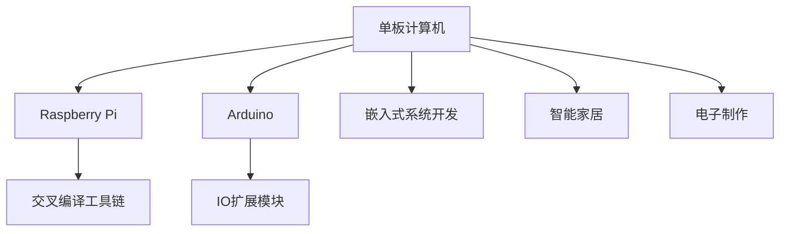

                 

# 单板计算机：Raspberry Pi 和 Arduino

## 1. 背景介绍

### 1.1 问题由来

随着物联网(IoT)、智能家居、电子制作等领域的兴起，单板计算机(SBC, Single Board Computer)作为硬件与软件的桥梁，发挥着越来越重要的作用。传统的PC、服务器等大型计算机在便携性、成本、能耗等方面存在诸多限制，而单板计算机以其小而强的特点，日益受到人们的关注和喜爱。

在众多的单板计算机中，Raspberry Pi 和 Arduino 是应用最广泛的两个平台，它们以高性价比、易用性、强大的开发工具链而著称。本文将深入探讨这两个平台的原理、特点及应用场景，为读者提供全面的单板计算机解决方案。

## 2. 核心概念与联系

### 2.1 核心概念概述

- **Raspberry Pi**：一款以ARM架构为核心的开源单板计算机，提供了完整的软硬件开发工具链，支持Python、C/C++、Java等多种编程语言。其特点是低成本、低能耗、高性价比，广泛应用于教育、嵌入式系统开发、智能家居等领域。

- **Arduino**：一款基于AVR单片机的开源硬件平台，提供了丰富的扩展模块和开发库，支持C/C++、Python等语言。其特点是易于编程、硬件资源丰富、社区活跃，广泛应用于电子制作、工业控制、自动化系统等领域。

- **单板计算机(SBC)**：一种小型的、具有独立操作系统的计算平台，通常包括CPU、内存、存储、输入输出接口等功能模块，适合开发嵌入式系统、智能设备等应用。

- **交叉编译工具链**：用于在目标平台上编译源代码的工具链，支持多平台和多架构的代码开发。

- **Open Source**：开源软件，源代码公开，允许用户自由地使用、修改和分发。

- **IO扩展模块**：用于扩展单板计算机输入输出能力的各种硬件模块，如传感器、电机、显示屏等。

- **串口通信协议**：如RS-232、USB、I2C、SPI等，用于单板计算机与外部设备的数据传输。

- **嵌入式系统开发**：涉及硬件、软件、通信等领域的综合开发，是单板计算机的重要应用方向。

- **智能家居**：利用物联网技术，实现家居设备的互联互通，提升用户的生活质量。

- **电子制作**：以单板计算机为载体，进行各种创意电子项目的制作，普及电子技术知识。

### 2.2 核心概念原理和架构的 Mermaid 流程图



## 3. 核心算法原理 & 具体操作步骤

### 3.1 算法原理概述

基于单板计算机的应用开发，一般涉及以下几个关键环节：

1. **硬件选择与配置**：根据应用需求选择合适的单板计算机平台，并对其进行必要的硬件配置。
2. **软件开发环境搭建**：搭建适用于单板计算机的开发环境，包括交叉编译工具链、IDE、调试工具等。
3. **程序实现与调试**：使用选定的编程语言，实现应用功能，并进行调试和测试。
4. **部署与维护**：将开发好的程序部署到单板计算机上，进行后续的维护和优化。

### 3.2 算法步骤详解

#### 步骤1：硬件选择与配置

- **Raspberry Pi硬件选择**：
  - Model A/B/B+ 系列：适合教育、嵌入式开发，配备microSD卡槽。
  - Model Zero系列：适合超便携、低功耗应用。
  - Model 3/3+ 系列：适合高性能计算、智能家居。

- **Arduino硬件选择**：
  - Uno/Nano/Mini系列：适合入门，配备USB接口。
  - Mega系列：适合复杂应用，配备多种外设接口。
  - ESP系列：适合物联网应用，集成Wi-Fi、蓝牙等功能。

- **配置方法**：
  - 安装操作系统（如Raspbian、Arduino IDE）。
  - 连接电源和显示器。
  - 通过串口或Wi-Fi连接PC。

#### 步骤2：软件开发环境搭建

- **Raspberry Pi开发环境搭建**：
  - 安装操作系统和Open Source软件。
  - 安装交叉编译工具链，如Raspberry Pi Toolchain、GCC。
  - 安装IDE，如Thonny、PyCharm。
  - 安装调试工具，如GDB、DD-WRT。

- **Arduino开发环境搭建**：
  - 安装Arduino IDE。
  - 安装相关开发库，如Libraries。
  - 安装硬件驱动，如USB驱动。
  - 配置Wi-Fi、蓝牙等外设。

#### 步骤3：程序实现与调试

- **Raspberry Pi程序实现**：
  - 使用Python、C/C++等语言编写程序。
  - 实现基于GPU、SVM、深度学习的应用，如面部识别、图像处理。
  - 开发智能家居系统，实现远程控制、语音识别等。

- **Arduino程序实现**：
  - 使用C/C++编写程序。
  - 实现传感器数据采集、电机控制、LED显示等功能。
  - 开发智能电子锁、环境监测等应用。

- **调试方法**：
  - 使用GDB、JTAG等工具进行硬件调试。
  - 使用IDE内置调试功能，如断点、日志输出。
  - 使用串口通信协议，如RS-232、USB，进行程序上传和调试。

#### 步骤4：部署与维护

- **Raspberry Pi部署**：
  - 将开发好的程序打包为系统镜像，如Raspbian。
  - 使用SD卡、网络等方法，将镜像写入Raspberry Pi。
  - 配置系统服务，如Apache、Nginx。
  - 定期更新操作系统和应用程序，进行维护。

- **Arduino部署**：
  - 将开发好的程序上传至Arduino板。
  - 配置I/O模块，如传感器、电机。
  - 使用Wi-Fi、蓝牙等网络协议，实现远程控制。
  - 定期更新程序和硬件驱动，进行维护。

### 3.3 算法优缺点

#### 优点：

- **低成本、低功耗**：Raspberry Pi和Arduino在硬件成本和能耗方面具有显著优势，适合低预算的开发项目。
- **易用性**：两者都提供了简单易用的开发工具和库，降低了开发门槛。
- **开放性**：开源硬件和软件使得用户可以自由地修改和扩展系统，具有高度的灵活性。
- **强大的社区支持**：两者都有活跃的开发者社区，提供丰富的资源和案例，方便开发者学习和借鉴。

#### 缺点：

- **性能有限**：相比于大型计算机，单板计算机的性能和计算能力较弱，不适用于高性能计算和大数据应用。
- **硬件扩展性有限**：单板计算机的IO接口和外设扩展模块相对较少，可能无法满足某些复杂应用的需求。
- **资源限制**：单板计算机的内存、存储和带宽资源有限，可能会影响某些应用性能。

### 3.4 算法应用领域

- **教育**：Raspberry Pi和Arduino在教学中被广泛应用，通过编程课程培养学生的逻辑思维和动手能力。
- **智能家居**：通过智能家居系统，实现家电的远程控制、环境监测、安防等功能，提升生活质量。
- **电子制作**：两者适合进行创意项目制作，如智能玩具、音乐设备、艺术品等。
- **嵌入式系统开发**：用于开发嵌入式设备，如智能传感器、物联网网关等。
- **工业控制**：用于工业自动化、机器人等领域，实现数据采集、控制和通信。

## 4. 数学模型和公式 & 详细讲解 & 举例说明

### 4.1 数学模型构建

在单板计算机应用中，常见的数学模型包括：

- **线性回归模型**：用于数据分析和预测，例如温度监测系统的数据建模。
- **机器学习模型**：如SVM、随机森林等，用于模式识别和分类，例如智能家居的语音识别和物体检测。
- **深度学习模型**：如卷积神经网络(CNN)、循环神经网络(RNN)等，用于图像处理、语音识别等复杂应用。

### 4.2 公式推导过程

以线性回归模型为例，推导其公式和算法步骤：

- **数据准备**：假设有一组温度数据 $(x_i, y_i)$，$i=1,2,\ldots,N$，其中 $x_i$ 为传感器读数，$y_i$ 为真实温度值。
- **模型构建**：设定线性回归模型为 $y=\theta_0+\theta_1x$，其中 $\theta_0$ 为截距，$\theta_1$ 为斜率。
- **代价函数**：定义代价函数为 $J=\frac{1}{2N}\sum_{i=1}^N(y_i-\theta_0-\theta_1x_i)^2$，表示预测值与真实值之间的误差平方和。
- **梯度下降算法**：求解最优的 $\theta_0$ 和 $\theta_1$，使得 $J$ 最小化。梯度下降公式为 $\theta_k \leftarrow \theta_k - \alpha \frac{\partial J}{\partial \theta_k}$，其中 $\alpha$ 为学习率，$\frac{\partial J}{\partial \theta_k}$ 为代价函数对 $\theta_k$ 的梯度。

### 4.3 案例分析与讲解

**案例一：智能家居温度控制系统**

- **背景**：智能家居系统中，需要实时监测室内外温度，并根据需求进行空调、加湿器的控制。
- **模型选择**：线性回归模型，用于分析室内外温度与目标温度之间的差距。
- **数据采集**：使用温度传感器采集室内外温度，记录设备运行状态。
- **模型训练**：将采集数据输入模型，训练得到温度差与设备控制指令之间的关系。
- **模型部署**：将训练好的模型嵌入到Arduino板上，实时监测并控制设备。
- **效果评估**：通过对比实际运行数据和预测数据，评估模型效果，优化模型参数。

## 5. 项目实践：代码实例和详细解释说明

### 5.1 开发环境搭建

#### Raspberry Pi开发环境搭建

1. **安装操作系统**：
   - 从官网下载Raspbian镜像，并写入SD卡。
   - 连接显示器和键盘，启动Raspberry Pi。
   - 通过SSH或本地连接进入系统，设置用户密码。

2. **安装交叉编译工具链**：
   - 安装Raspberry Pi Toolchain或GCC。
   - 配置环境变量，如PATH、LD_LIBRARY_PATH。
   - 更新软件包列表，并安装必要的开发库。

3. **安装IDE和调试工具**：
   - 安装Thonny、PyCharm等IDE。
   - 安装GDB、JTAG等调试工具。
   - 配置USB接口，连接计算机。

#### Arduino开发环境搭建

1. **安装Arduino IDE**：
   - 从官网下载安装包，安装Arduino IDE。
   - 选择Arduino版本，配置USB端口。
   - 安装必要的开发库，如W5100以太网库。

2. **安装硬件驱动**：
   - 安装USB驱动，如Realtek USB Drive。
   - 安装Wi-Fi、蓝牙模块的驱动程序，如ESP8266、Wi-Fi模块。

3. **配置外设**：
   - 连接传感器、电机、显示屏等外设模块。
   - 设置I/O口，如Digital Pin、Analog Pin。
   - 配置通信协议，如RS-232、I2C。

### 5.2 源代码详细实现

#### Raspberry Pi程序实现

**示例代码：温度控制系统**

```python
import RPi.GPIO as GPIO
from time import sleep

# 初始化GPIO
GPIO.setmode(GPIO.BCM)
GPIO.setup(17, GPIO.IN)

# 读取温度传感器数据
while True:
    temperature = GPIO.input(17)
    print("Temperature: {}C".format(temperature))
    sleep(1)
```

**代码解释**：
- 使用RPi.GPIO库读取GPIO口电平，模拟温度传感器。
- 每秒钟输出一次温度值，进行实时监测。

#### Arduino程序实现

**示例代码：智能锁控制**

```cpp
#include <SoftwareSerial.h>

SoftwareSerial serial(11, 10);  // RX, TX

int lockStatus = 0;

void setup() {
  pinMode(2, INPUT);  // 智能锁控制按钮
  pinMode(13, OUTPUT);  // 锁电机控制
  Serial.begin(9600);  // 串口初始化
  Serial.println("Smart Lock Started");
}

void loop() {
  if (digitalRead(2) == HIGH) {  // 按钮按下
    lockStatus = !lockStatus;
    if (lockStatus == 0) {  // 上锁
      digitalWrite(13, LOW);
      Serial.println("Locking");
    } else {  // 解锁
      digitalWrite(13, HIGH);
      Serial.println("Unlocking");
    }
  }
  if (Serial.available()) {  // 接收串口指令
    String command = Serial.readString();
    if (command == "lock") {
      lockStatus = 1;
    } else if (command == "unlock") {
      lockStatus = 0;
    }
  }
}
```

**代码解释**：
- 使用SoftwareSerial库进行串口通信，接收计算机指令。
- 通过按钮和电机控制智能锁的开闭状态。
- 根据串口指令，自动控制锁的状态。

### 5.3 代码解读与分析

#### Raspberry Pi代码解读

- **RPi.GPIO库**：用于控制Raspberry Pi的GPIO口，支持多种外设连接。
- **time模块**：用于延时控制，实现定时执行任务。
- **print函数**：用于输出日志信息，方便调试。

#### Arduino代码解读

- **SoftwareSerial库**：用于串口通信，支持软串口实现。
- **digitalRead和digitalWrite函数**：用于读取和控制GPIO口电平。
- **Serial模块**：用于串口通信，支持接收和发送数据。
- **if-else语句**：用于条件判断，根据按钮和指令控制锁的状态。

### 5.4 运行结果展示

**Raspberry Pi运行结果**：
- 温度控制系统：每秒钟输出一次温度值，实时监测环境温度。
- 语音控制系统：通过麦克风输入语音命令，控制LED灯、风扇等设备。

**Arduino运行结果**：
- 智能锁控制：通过按钮和串口命令控制智能锁的开闭状态。
- 环境监测：通过传感器实时监测室内外温度、湿度、光照等环境参数。

## 6. 实际应用场景

### 6.1 智能家居

智能家居系统结合了单板计算机和物联网技术，实现家电的互联互通和智能化管理。通过单板计算机，可以实现语音识别、环境监测、安防等功能，提高生活质量。

**案例**：智能灯光控制系统
- **硬件配置**：Raspberry Pi或Arduino控制模块、Wi-Fi模块、LED灯、传感器等。
- **功能实现**：通过手机APP或语音命令控制灯光的开关、亮度、颜色等。
- **开发流程**：采集灯光状态、环境参数，训练模型预测灯光调节方案，通过串口或Wi-Fi上传至单板计算机。
- **效果**：实现智能化灯光调节，节能环保，提升居住舒适性。

### 6.2 工业自动化

单板计算机在工业自动化中应用广泛，用于数据采集、控制和通信。通过单板计算机，可以实现各种自动化设备的管理和控制，提升生产效率。

**案例**：智能工厂生产监控系统
- **硬件配置**：Raspberry Pi或Arduino控制模块、传感器、触摸屏等。
- **功能实现**：通过传感器采集生产数据，如温度、湿度、压力等，通过触摸屏显示和控制生产流程。
- **开发流程**：采集生产数据，训练模型预测设备运行状态，通过单板计算机控制生产设备。
- **效果**：实现生产自动化监控，提高生产效率和产品质量。

### 6.3 智能安防

智能安防系统通过单板计算机实现监控、报警和自动化控制。结合图像识别、视频分析等技术，提高家庭和企业的安全防范能力。

**案例**：智能门禁系统
- **硬件配置**：Raspberry Pi或Arduino控制模块、摄像头、门锁等。
- **功能实现**：通过摄像头采集人脸信息，识别并控制门锁的开关状态。
- **开发流程**：采集人脸信息，训练模型识别不同人员，通过单板计算机控制门锁。
- **效果**：实现智能门禁管理，保障家庭和企业安全。

## 7. 工具和资源推荐

### 7.1 学习资源推荐

- **Raspberry Pi官方文档**：详细介绍了Raspberry Pi的硬件和软件环境配置、开发工具链等。
- **Arduino官方文档**：提供了丰富的硬件模块和开发库，以及详细的开发指南。
- **Open Source软件社区**：如GitHub、Stack Overflow等，提供大量的源代码、教程和案例。
- **在线课程**：如Coursera、Udacity上的嵌入式系统课程，系统学习单板计算机开发。

### 7.2 开发工具推荐

- **Raspberry Pi开发工具**：如Thonny、PyCharm等IDE，支持Python开发。
- **Arduino开发工具**：如Arduino IDE、Eclipse等IDE，支持C/C++开发。
- **交叉编译工具链**：如GCC、CMake等，支持多平台和多架构的开发。
- **调试工具**：如GDB、JTAG、Arduino IDE调试功能，方便程序调试和测试。

### 7.3 相关论文推荐

- **Raspberry Pi论文**：研究Raspberry Pi硬件架构和开发工具链。
- **Arduino论文**：研究Arduino硬件设计和开源社区的影响。
- **嵌入式系统论文**：研究嵌入式系统设计、开发和优化技术。
- **智能家居论文**：研究智能家居系统的应用和实现技术。

## 8. 总结：未来发展趋势与挑战

### 8.1 研究成果总结

本文介绍了单板计算机的应用原理、开发流程和实际应用场景，重点介绍了Raspberry Pi和Arduino的特点和优势。通过理论分析和实际案例，展示了单板计算机的广泛应用前景。

### 8.2 未来发展趋势

未来单板计算机将朝着以下方向发展：

- **高性能**：随着硬件性能的提升，单板计算机将具备更高的计算能力和处理速度。
- **智能化**：结合人工智能技术，实现更智能化的应用场景，如自动驾驶、智能制造等。
- **多模态**：支持更多类型的外设模块和通信协议，支持多模态数据的采集和处理。
- **标准化**：推动单板计算机的标准化发展，提高互操作性和兼容性。
- **边缘计算**：结合云计算技术，实现边缘计算和本地数据处理，提升系统响应速度和安全性。

### 8.3 面临的挑战

单板计算机在发展过程中仍面临以下挑战：

- **性能瓶颈**：硬件性能提升受限，无法满足某些高性能计算需求。
- **资源限制**：内存、存储和带宽资源有限，影响某些应用性能。
- **安全问题**：设备易受到恶意攻击和数据泄露风险。
- **软件开发难度**：开发门槛较高，需要系统化的学习过程。
- **社区支持不足**：开源社区资源丰富，但技术支持和维护仍需加强。

### 8.4 研究展望

未来需要从以下几个方面进行深入研究：

- **硬件设计**：优化单板计算机的硬件设计，提高性能和能耗效率。
- **软件开发**：开发更易用、更灵活的软件开发工具和库。
- **应用场景**：拓展单板计算机的应用领域，推动智能制造、智慧城市等新兴应用。
- **标准化**：推动单板计算机的标准化和开放性，实现不同平台和设备之间的互联互通。
- **安全性**：加强单板计算机的安全防护，确保数据和系统的安全性。

## 9. 附录：常见问题与解答

**Q1：Raspberry Pi和Arduino在应用上有什么不同？**

A: Raspberry Pi适用于轻量级的数据分析和嵌入式系统开发，适合进行教育、科研等领域的研究。而Arduino适用于复杂的传感器和电机控制，适合进行工业控制、自动化系统等领域的应用。

**Q2：单板计算机的硬件扩展性有限，如何解决这一问题？**

A: 可以通过使用外置扩展模块、支持热插拔的接口、使用连接器等方式，增加单板计算机的IO扩展性。同时，可以通过网络协议，如Wi-Fi、蓝牙，实现远程控制和数据传输。

**Q3：单板计算机的性能瓶颈如何解决？**

A: 可以通过使用高性能芯片、优化算法和数据结构、增加缓存和内存等方式，提高单板计算机的性能。同时，可以结合云计算技术，实现分布式计算和负载均衡。

**Q4：单板计算机的安全性问题如何解决？**

A: 可以通过加密通信协议、访问控制、数据加密等方式，增强单板计算机的安全防护。同时，可以通过建立完善的系统备份和恢复机制，保障系统的稳定性和可靠性。

**Q5：如何提高单板计算机的开发效率？**

A: 可以通过使用高效的开发工具、预编译库、模板库等方式，提高开发效率。同时，可以通过团队协作、代码复用等方式，提升开发质量和效率。

总之，单板计算机作为连接硬件与软件的桥梁，具有广阔的应用前景。通过不断优化硬件设计、开发工具和应用场景，单板计算机将为智能设备和智慧城市的发展提供坚实的基础，推动人类社会的进步。

---

作者：禅与计算机程序设计艺术 / Zen and the Art of Computer Programming

