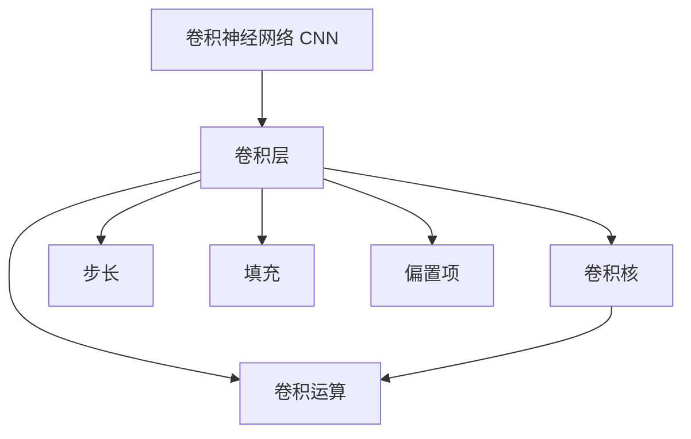

                 

# 卷积层 (Convolutional Layer) 原理与代码实例讲解

卷积神经网络 (Convolutional Neural Network, CNN) 是深度学习中最为成功和广泛应用的一类模型。卷积层作为卷积神经网络中的核心层之一，负责从输入数据中提取局部特征。本文将从原理、算法、代码实例等多个角度，全面介绍卷积层的核心知识。

## 1. 背景介绍

### 1.1 问题由来
卷积神经网络因其在图像处理、语音识别等领域的卓越性能，逐渐成为计算机视觉、自然语言处理等诸多领域的主流模型。卷积层的引入极大地提升了神经网络的表示能力，使得模型能够高效处理局部结构化的数据。

近年来，随着大规模深度学习框架的兴起，卷积层的实现已经高度模块化和封装化，开发者仅需关注关键算法细节即可快速构建和训练模型。然而，对于深度学习爱好者和研究者而言，理解卷积层的原理和算法仍然是必要的。

### 1.2 问题核心关键点
卷积层主要解决的是局部特征提取问题。通过卷积运算，卷积层能够从输入数据中提取出具有局部特征的信息，并通过不同的卷积核和超参数设计，适应不同尺度和结构的数据。

卷积层分为空洞卷积、可分离卷积、双边卷积、分组卷积等多种形式，这些不同类型卷积的操作方式和应用场景各不相同。本文将重点介绍最基本的2D卷积层，其他类型的卷积层将在后续的章节中详细介绍。

## 2. 核心概念与联系

### 2.1 核心概念概述

为更好地理解卷积层的核心概念，本节将介绍几个密切相关的核心概念：

- 卷积神经网络 (Convolutional Neural Network, CNN)：以卷积层为核心层，用于图像处理、视频分析、语音识别等领域的深度学习模型。
- 卷积层 (Convolutional Layer)：网络层级中的关键组件，用于提取局部特征。
- 卷积核 (Convolutional Kernel)：卷积层中的可训练权重，用于控制卷积操作的局部性与尺度。
- 滤波器 (Filter)：卷积核的另一个叫法，通常用于指代卷积操作中应用的线性滤波器。
- 卷积运算 (Convolution)：卷积层中的主要操作，通过卷积核在输入数据上滑动进行特征提取。
- 步长 (Stride)：卷积运算中卷积核的移动步长，影响特征提取的尺度。
- 填充 (Padding)：在输入数据四周添加边缘填充，用于控制输出特征图的大小。
- 偏置项 (Bias)：卷积层的可训练参数，用于增加输出特征的自由度。

这些核心概念之间的逻辑关系可以通过以下Mermaid流程图来展示：



这个流程图展示了几何核心概念及其之间的关系：

1. 卷积神经网络通过卷积层提取局部特征。
2. 卷积层通过卷积核进行卷积运算，提取局部信息。
3. 卷积核与输入数据之间的移动步长由步长决定。
4. 输入数据四周的填充影响输出特征图的大小。
5. 卷积层的偏置项用于增加输出特征的自由度。

这些概念共同构成了卷积层的基本工作机制，使得卷积神经网络能够高效地处理局部结构化的数据。

## 3. 核心算法原理 & 具体操作步骤

### 3.1 算法原理概述

卷积层的核心操作是卷积运算，其本质是一个线性变换过程，通过卷积核与输入数据的卷积运算，提取局部特征。卷积运算的数学表达式为：

$$
C(x) = \sum_{i,j} w_{i,j}x_{i,j}
$$

其中，$x$ 表示输入数据，$w$ 表示卷积核，$C$ 表示卷积运算的结果。

卷积运算通过滑动卷积核对输入数据进行局部特征提取，每次滑动一步称为卷积核的步长。在滑动过程中，为了保持输出特征图的大小不变，通常需要在输入数据四周添加填充。填充的大小由卷积核的大小和步长决定。

卷积层的输入输出关系可以表示为：

$$
H(x) = \sigma \left(\sum_k f_k * x_k \right)
$$

其中，$H(x)$ 表示卷积层的输出，$f_k$ 表示卷积核，$x_k$ 表示输入数据的不同特征通道，$\sigma$ 表示非线性激活函数。

### 3.2 算法步骤详解

卷积层的操作可以分为以下几个关键步骤：

**Step 1: 数据准备**

- 输入数据 $x$ 通常表示为矩阵形式，每通道对应一个矩阵。
- 卷积核 $w$ 同样表示为矩阵形式，每通道对应一个矩阵。

**Step 2: 卷积运算**

- 在输入数据的每一通道上，进行逐元素的卷积运算。
- 对于每个位置，将卷积核与输入数据的对应区域进行乘法运算，并将结果累加。
- 通过滑动卷积核，逐步遍历输入数据的每一区域，输出特征图 $H(x)$。

**Step 3: 应用非线性激活函数**

- 通常使用ReLU或Sigmoid等非线性激活函数，增加特征的表达能力。

**Step 4: 模型参数更新**

- 通过反向传播算法，更新卷积核 $w$ 的权重。

### 3.3 算法优缺点

卷积层具有以下优点：

- 局部连接：卷积核只与输入数据局部区域进行连接，减少了参数量和计算量。
- 参数共享：同一卷积核在输入数据的不同区域使用，减少了训练样本的要求。
- 平移不变性：卷积运算具有平移不变性，同一卷积核在不同位置提取的特征具有相似的语义。

卷积层同样存在一些缺点：

- 局部连接：可能会限制模型的表达能力，难以捕捉全局信息。
- 参数共享：可能会降低模型的泛化能力，不同位置的特征表示存在偏差。
- 过拟合风险：在输入数据较少时，容易发生过拟合。

### 3.4 算法应用领域

卷积层在计算机视觉、自然语言处理等领域得到了广泛应用，典型应用场景包括：

- 图像分类：通过卷积层提取图像局部特征，再进行全连接层进行分类。
- 目标检测：在卷积层提取特征的同时，通过RoI池化或ROIAlign等方式提取感兴趣区域特征。
- 语义分割：使用卷积层提取图像的语义信息，再进行全连接层进行像素级别的分类。
- 文本分类：将文本数据转换为图像形式，通过卷积层提取特征，再进行全连接层进行分类。
- 语音识别：使用卷积层提取音频信号的时频特征，再进行全连接层进行语音识别。

除了上述经典任务外，卷积层还被创新性地应用于视频分析、动作识别、图像生成等场景，为计算机视觉技术带来了新的突破。

## 4. 数学模型和公式 & 详细讲解 & 举例说明

### 4.1 数学模型构建

卷积层的数学模型通常分为卷积层和激活函数两个部分。本节将分别介绍卷积层的数学模型和激活函数的数学表达式。

卷积层的输入 $x$ 表示为三维矩阵 $x \in \mathbb{R}^{N \times H \times W}$，其中 $N$ 表示通道数，$H$ 和 $W$ 表示输入的宽和高。卷积核 $w$ 表示为三维矩阵 $w \in \mathbb{R}^{C \times K \times K}$，其中 $C$ 表示卷积核的通道数，$K \times K$ 表示卷积核的尺寸。

卷积层的输出 $H$ 表示为三维矩阵 $H \in \mathbb{R}^{N \times H' \times W'}$，其中 $H'$ 和 $W'$ 表示输出特征图的大小。

卷积层的输入输出关系可以表示为：

$$
H(x) = \sigma \left(\sum_k f_k * x_k \right)
$$

其中，$f_k$ 表示卷积核，$x_k$ 表示输入数据的不同特征通道，$\sigma$ 表示非线性激活函数。

### 4.2 公式推导过程

假设输入数据 $x$ 为三维矩阵 $x \in \mathbb{R}^{N \times H \times W}$，卷积核 $w$ 为三维矩阵 $w \in \mathbb{R}^{C \times K \times K}$，激活函数为 $\sigma$。卷积层的输出 $H$ 为三维矩阵 $H \in \mathbb{R}^{N' \times H' \times W'}$，其中 $N'$ 表示输出特征图的通道数，$H'$ 和 $W'$ 表示输出特征图的大小。

卷积运算的数学表达式为：

$$
H_{i,j} = \sum_{k=1}^K \sum_{h=0}^{H-K+1} \sum_{w=0}^{W-K+1} w_{k,h,w}x_{i-h,j-w}
$$

其中，$H_{i,j}$ 表示输出特征图的第 $i$ 行第 $j$ 列的元素，$w_{k,h,w}$ 表示卷积核的第 $k$ 个元素在输入数据中的位置，$x_{i-h,j-w}$ 表示输入数据的第 $i-h$ 行第 $j-w$ 列的元素。

应用非线性激活函数后的输出为：

$$
H(x) = \sigma \left(\sum_k f_k * x_k \right)
$$

其中，$\sigma$ 表示非线性激活函数，$f_k$ 表示卷积核。

### 4.3 案例分析与讲解

假设输入数据 $x$ 为二维矩阵 $x \in \mathbb{R}^{N \times H \times W}$，卷积核 $w$ 为二维矩阵 $w \in \mathbb{R}^{C \times K \times K}$，激活函数为ReLU。

输入数据为 $3 \times 3 \times 1$ 的彩色图像，卷积核为 $1 \times 2 \times 2$，步长为 $1$，无填充。

计算卷积运算的过程如下：

1. 初始化输出特征图 $H$ 为 $1 \times 1 \times 1$ 的矩阵。
2. 对于输出特征图的第一行第一列元素 $H_{0,0}$，进行卷积运算，得到 $H_{0,0} = \sum_{k=1}^K w_{k,0,0} x_{0-k,0-w}$，其中 $K=2$。
3. 对于输出特征图的第二行第一列元素 $H_{1,0}$，进行卷积运算，得到 $H_{1,0} = \sum_{k=1}^K w_{k,1,0} x_{1-k,0-w}$，其中 $K=2$。
4. 重复上述过程，完成整个输出特征图的卷积运算。

最终，输出特征图 $H$ 为 $1 \times 1 \times 1$ 的矩阵，表示卷积运算的结果。

## 5. 项目实践：代码实例和详细解释说明

### 5.1 开发环境搭建

在进行卷积层实践前，我们需要准备好开发环境。以下是使用Python进行TensorFlow开发的环境配置流程：

1. 安装Anaconda：从官网下载并安装Anaconda，用于创建独立的Python环境。

2. 创建并激活虚拟环境：
```bash
conda create -n tensorflow-env python=3.8 
conda activate tensorflow-env
```

3. 安装TensorFlow：根据CUDA版本，从官网获取对应的安装命令。例如：
```bash
conda install tensorflow -c tensorflow -c conda-forge
```

4. 安装各类工具包：
```bash
pip install numpy pandas scikit-learn matplotlib tqdm jupyter notebook ipython
```

完成上述步骤后，即可在`tensorflow-env`环境中开始卷积层的实践。

### 5.2 源代码详细实现

下面我们以二维卷积为例，给出使用TensorFlow实现卷积层的完整代码实现。

```python
import tensorflow as tf
from tensorflow.keras.layers import Conv2D

# 定义卷积层
conv_layer = Conv2D(32, (3, 3), activation='relu', padding='same')

# 加载输入数据
x = tf.random.normal([1, 28, 28, 1])

# 执行卷积操作
conv_result = conv_layer(x)

# 打印卷积结果
print(conv_result.shape)
```

以上代码展示了使用TensorFlow的Conv2D层实现二维卷积的基本过程。首先，我们定义了一个卷积层，指定了卷积核大小、通道数、激活函数和填充方式。然后，加载输入数据 $x$，其中第一维表示样本数，第二三维表示输入数据的宽和高，第四维表示通道数。最后，执行卷积操作，并打印卷积结果。

### 5.3 代码解读与分析

让我们再详细解读一下关键代码的实现细节：

**Conv2D层定义**：
- 使用TensorFlow的Conv2D层定义卷积层，其中参数含义如下：
  - 32：卷积核的通道数。
  - (3, 3)：卷积核的尺寸。
  - activation='relu'：激活函数为ReLU。
  - padding='same'：填充方式为'same'，输出特征图大小与输入特征图大小相同。

**输入数据加载**：
- 使用TensorFlow的random_normal函数生成随机输入数据，其中参数含义如下：
  - [1, 28, 28, 1]：输入数据的形状，表示样本数为1，宽和高为28，通道数为1。

**卷积操作执行**：
- 将输入数据 $x$ 作为卷积层的输入，执行卷积操作。
- 卷积操作会返回一个新的Tensor，表示卷积结果。

**卷积结果打印**：
- 打印卷积结果的形状，可以看到输出特征图的形状为 $[1, 28, 28, 32]$，即样本数仍为1，宽和高仍为28，通道数变为32。

## 6. 实际应用场景

### 6.1 图像分类

卷积层在图像分类任务中具有重要的作用。通过卷积层提取图像的局部特征，经过全连接层进行分类，可以实现高精度的图像分类。

在实践中，可以将图像数据作为输入数据 $x$，卷积层提取局部特征，最后通过全连接层进行分类。常见的卷积网络结构包括LeNet、AlexNet、VGG、ResNet等，其中卷积层起到了关键作用。

### 6.2 目标检测

目标检测任务需要在图像中检测和定位特定物体。卷积层可以用于提取感兴趣区域的特征，通过RoI池化或ROIAlign等方式进行特征映射，再进行分类和回归操作。

在实践中，可以通过ROI池化层将感兴趣区域转换为固定大小的特征图，再通过全连接层进行分类和回归。著名的目标检测算法如Faster R-CNN、YOLO等，都大量使用了卷积层和ROI池化层。

### 6.3 语义分割

语义分割任务需要将图像像素级别的语义信息进行分类。卷积层可以用于提取图像的局部特征，经过上采样层进行像素级别的分类。

在实践中，可以使用上采样层将卷积层提取的特征图进行上采样，生成高分辨率的特征图，再通过全连接层进行像素级别的分类。著名的语义分割算法如FCN、U-Net等，都大量使用了卷积层和上采样层。

### 6.4 未来应用展望

随着深度学习技术的不断发展，卷积层的应用将更加广泛。未来，卷积层有望在以下领域得到更深入的应用：

1. 视频分析：卷积层可以用于提取视频帧的局部特征，通过时间维度上的卷积操作，实现视频分类和动作识别等任务。
2. 语音识别：卷积层可以用于提取音频信号的时频特征，通过时间维度上的卷积操作，实现语音识别和语音生成等任务。
3. 自然语言处理：卷积层可以用于提取文本的局部特征，通过时间维度上的卷积操作，实现文本分类和情感分析等任务。
4. 医学影像分析：卷积层可以用于提取医学影像的局部特征，通过空间维度上的卷积操作，实现病变检测和影像分割等任务。
5. 机器人感知：卷积层可以用于提取机器人传感器数据的局部特征，通过空间和时序维度上的卷积操作，实现目标检测和行为规划等任务。

总之，卷积层作为卷积神经网络的核心组件，将在未来众多领域得到更广泛的应用，为计算机视觉、自然语言处理、机器人感知等技术的发展提供强大的支持。

## 7. 工具和资源推荐

### 7.1 学习资源推荐

为了帮助开发者系统掌握卷积层的理论基础和实践技巧，这里推荐一些优质的学习资源：

1. 《深度学习》课程（斯坦福大学）：斯坦福大学开设的深度学习课程，涵盖卷积神经网络的基本概念和应用场景。

2. 《CS231n: 卷积神经网络课程》：斯坦福大学计算机视觉课程，详细讲解了卷积神经网络的设计和训练方法。

3. 《Python深度学习》书籍：用Python实现深度学习的入门书籍，包含卷积神经网络的代码实现和案例分析。

4. TensorFlow官方文档：TensorFlow的官方文档，提供了丰富的卷积神经网络API和示例代码，是学习卷积层的重要参考资料。

5. Keras官方文档：Keras的官方文档，提供了简单易用的卷积神经网络API，适合初学者快速上手。

6. PyTorch官方文档：PyTorch的官方文档，提供了卷积神经网络的API和示例代码，是研究卷积层的重要工具。

通过对这些资源的学习实践，相信你一定能够快速掌握卷积层的精髓，并用于解决实际的计算机视觉问题。

### 7.2 开发工具推荐

高效的开发离不开优秀的工具支持。以下是几款用于卷积神经网络开发的常用工具：

1. TensorFlow：由Google主导开发的开源深度学习框架，生产部署方便，适合大规模工程应用。提供了丰富的卷积神经网络API。

2. Keras：基于TensorFlow的高层API，简单易用，适合快速原型设计和模型部署。

3. PyTorch：Facebook开发的深度学习框架，灵活高效，适合研究和实验。提供了丰富的卷积神经网络API和工具。

4. MXNet：由亚马逊主导开发的深度学习框架，支持多种编程语言，适合大规模分布式训练。

5. Caffe：由加州大学伯克利分校开发的深度学习框架，高效轻量，适合图像处理和计算机视觉任务。

6. MXNet：由亚马逊主导开发的深度学习框架，支持多种编程语言，适合大规模分布式训练。

合理利用这些工具，可以显著提升卷积神经网络开发和训练的效率，加快模型迭代的步伐。

### 7.3 相关论文推荐

卷积层的核心研究起源于深度学习领域，以下是几篇奠基性的相关论文，推荐阅读：

1. LeNet-5：1998年，Yann LeCun等人提出的卷积神经网络经典架构，开启了卷积神经网络的应用浪潮。

2. AlexNet：2012年，Alex Krizhevsky等人提出的卷积神经网络架构，在ImageNet图像识别竞赛中取得突破性成绩。

3. VGG：2014年，Karen Simonyan等人提出的卷积神经网络架构，使用小尺寸卷积核和多层卷积结构，实现了高精度图像分类。

4. ResNet：2015年，Kaiming He等人提出的残差网络架构，通过残差连接解决了深度网络退化问题，实现了更深的卷积神经网络。

5. DenseNet：2017年，Gao Huang等人提出的密集连接网络架构，通过密集连接提高了特征重用效率，实现了高效率高精度的卷积神经网络。

这些论文代表了大规模卷积神经网络的研究历程，通过学习这些前沿成果，可以帮助研究者把握学科前进方向，激发更多的创新灵感。

## 8. 总结：未来发展趋势与挑战

### 8.1 总结

本文对卷积层的核心知识进行了全面系统的介绍。首先阐述了卷积层的背景和重要性，明确了卷积层在卷积神经网络中的核心地位和作用。其次，从原理到实践，详细讲解了卷积层的数学模型、实现方法和关键步骤，给出了卷积层的代码实例。同时，本文还广泛探讨了卷积层在图像分类、目标检测、语义分割等多个领域的应用前景，展示了卷积层的强大潜力。此外，本文精选了卷积层的各类学习资源，力求为读者提供全方位的技术指引。

通过本文的系统梳理，可以看到，卷积层作为卷积神经网络的核心组件，已经在诸多领域得到了广泛应用，显著提升了计算机视觉任务的性能。未来，伴随深度学习技术的持续演进，卷积层还将不断拓展应用范围，带来更多创新突破。

### 8.2 未来发展趋势

展望未来，卷积层的技术发展将呈现以下几个趋势：

1. 多尺度卷积：通过多尺度卷积操作，适应不同尺度的特征提取需求。多尺度卷积将进一步提升卷积神经网络的表达能力和泛化能力。

2. 空洞卷积：空洞卷积通过增加卷积核的跨度，增加特征提取的视野，适用于长距离特征提取。

3. 可分离卷积：可分离卷积通过将卷积操作分为两个独立的步骤，降低计算量和参数量，适用于计算资源受限的场景。

4. 自注意力机制：通过引入自注意力机制，增强卷积神经网络的特征表达能力，提升模型的性能和泛化能力。

5. 混合卷积：混合卷积通过结合不同类型的卷积操作，适应不同应用场景的需求，如空间卷积和点卷积。

6. 跨模态融合：通过将卷积神经网络与其他模型（如循环神经网络）进行融合，实现跨模态特征提取，提升模型的性能和应用范围。

这些趋势凸显了卷积层在深度学习技术中的重要地位，将进一步推动计算机视觉技术的发展，带来更多的创新突破。

### 8.3 面临的挑战

尽管卷积层已经取得了显著的成果，但在迈向更加智能化、普适化应用的过程中，仍面临诸多挑战：

1. 训练数据需求高：卷积神经网络的训练通常需要大量标注数据，数据采集和标注成本较高。如何提高数据利用效率，降低标注成本，是未来研究的重要方向。

2. 模型结构复杂：卷积神经网络的结构设计复杂，难以优化和调试。如何设计更高效、更灵活的卷积神经网络结构，降低模型的训练和推理成本，是未来的研究重点。

3. 可解释性不足：卷积神经网络的决策过程难以解释，难以发现模型内部的特征表示和推理逻辑。如何增强模型的可解释性，提升用户的信任度和接受度，是未来的研究方向。

4. 泛化能力有待提高：卷积神经网络通常在数据分布一致时表现良好，但在数据分布变化较大的场景下，泛化性能可能不佳。如何提高卷积神经网络的泛化能力，提升模型的稳健性，是未来的重要课题。

5. 计算资源消耗大：卷积神经网络的计算量较大，需要高性能计算设备支持。如何降低计算资源消耗，实现更轻量级的模型部署，是未来的研究方向。

6. 数据隐私问题：卷积神经网络在处理图像和视频数据时，涉及到隐私和版权问题。如何保护用户数据隐私，确保数据使用的合法性，是未来的研究重点。

这些挑战需要我们在算法、模型、训练、部署等各个环节进行综合优化，才能真正实现卷积神经网络的规模化应用。

### 8.4 研究展望

面对卷积神经网络所面临的挑战，未来的研究需要在以下几个方面寻求新的突破：

1. 数据高效利用：通过数据增强、迁移学习等技术，提高数据利用效率，降低标注成本。

2. 模型结构简化：通过模型压缩、剪枝等技术，降低计算资源消耗，提升模型的训练和推理速度。

3. 增强模型可解释性：通过可解释性学习、因果推理等技术，提升模型的可解释性和用户信任度。

4. 提高模型泛化能力：通过对抗训练、自适应学习等技术，提升模型的泛化能力和稳健性。

5. 轻量化模型设计：通过模型压缩、量化等技术，实现轻量化模型设计，提升模型的部署效率。

6. 数据隐私保护：通过差分隐私、联邦学习等技术，保护用户数据隐私，确保数据使用的合法性。

这些研究方向的探索，必将引领卷积神经网络技术迈向更高的台阶，为计算机视觉和深度学习技术的发展提供新的动力。

## 9. 附录：常见问题与解答

**Q1：卷积层与全连接层的主要区别是什么？**

A: 卷积层和全连接层是神经网络中的两种基本层类型，它们在功能和应用场景上存在显著差异：

1. 连接方式：卷积层只与局部输入数据连接，而全连接层与所有输入数据连接。
2. 参数共享：卷积层中的每个卷积核对整个输入数据进行相同的卷积运算，而全连接层的每个神经元只与前一层的每个神经元相连，参数量较大。
3. 局部特征提取：卷积层通过卷积运算提取输入数据的局部特征，而全连接层通过线性变换对整个输入数据进行编码。
4. 计算复杂度：卷积层的计算复杂度通常低于全连接层，适合处理局部结构化的数据。

总之，卷积层通过局部特征提取，提高了神经网络的表达能力和泛化能力，适用于图像、语音等局部结构化数据的处理。

**Q2：卷积层中的填充 (Padding) 有什么作用？**

A: 卷积层中的填充 (Padding) 主要起到两个作用：

1. 保持输出特征图大小：填充可以通过在输入数据四周添加边缘填充，保持输出特征图的大小与输入特征图大小相同，避免输出特征图变小。

2. 控制输出特征图大小：填充可以通过控制填充的大小，调整输出特征图的大小，使其符合模型需求。

例如，在输入数据为 $28 \times 28$，卷积核为 $3 \times 3$，步长为 $1$ 的卷积操作中，如果不加填充，输出特征图的大小为 $26 \times 26$。通过在输入数据四周添加填充，可以使输出特征图的大小变为 $28 \times 28$，与输入特征图大小相同。

**Q3：卷积层的步长 (Stride) 有什么作用？**

A: 卷积层的步长 (Stride) 主要起到两个作用：

1. 控制特征提取的尺度：步长可以通过控制卷积核的移动步长，影响特征提取的尺度。步长越大，特征提取的尺度越大，输出特征图的大小越小。

2. 降低计算量和参数量：步长可以通过增加卷积核的移动步长，降低特征提取的计算量和模型参数量，提升模型的训练和推理效率。

例如，在输入数据为 $28 \times 28$，卷积核为 $3 \times 3$，步长为 $2$ 的卷积操作中，输出特征图的大小为 $14 \times 14$。与步长为 $1$ 相比，特征提取的尺度加倍，输出特征图的大小减半，计算量和参数量降低了一半。

**Q4：卷积层的激活函数 (Activation Function) 有什么作用？**

A: 卷积层的激活函数 (Activation Function) 主要起到两个作用：

1. 增加非线性表达能力：激活函数通过引入非线性变换，增加卷积神经网络的表达能力，使其能够适应更复杂的输入数据和任务需求。

2. 抑制梯度消失：激活函数通过非线性变换，避免梯度消失问题，加速模型的训练过程。

例如，在卷积层中引入ReLU激活函数，可以将负值映射为0，增强模型的非线性表达能力，避免梯度消失问题。

**Q5：卷积层中的卷积核 (Convolution Kernel) 有什么作用？**

A: 卷积层的卷积核 (Convolution Kernel) 主要起到两个作用：

1. 提取局部特征：卷积核通过滑动在输入数据上进行卷积运算，提取局部特征。卷积核的大小和数量决定了特征提取的局部性和多样性。

2. 学习过滤信息：卷积核通过学习输入数据中的有用信息，滤除噪声和干扰，提取对任务有帮助的特征。

例如，在卷积层中使用卷积核提取图像的局部特征，每个卷积核学习到不同的特征模式，通过堆叠多个卷积核，可以提取丰富的特征信息，提升模型的性能和泛化能力。

---

作者：禅与计算机程序设计艺术 / Zen and the Art of Computer Programming

