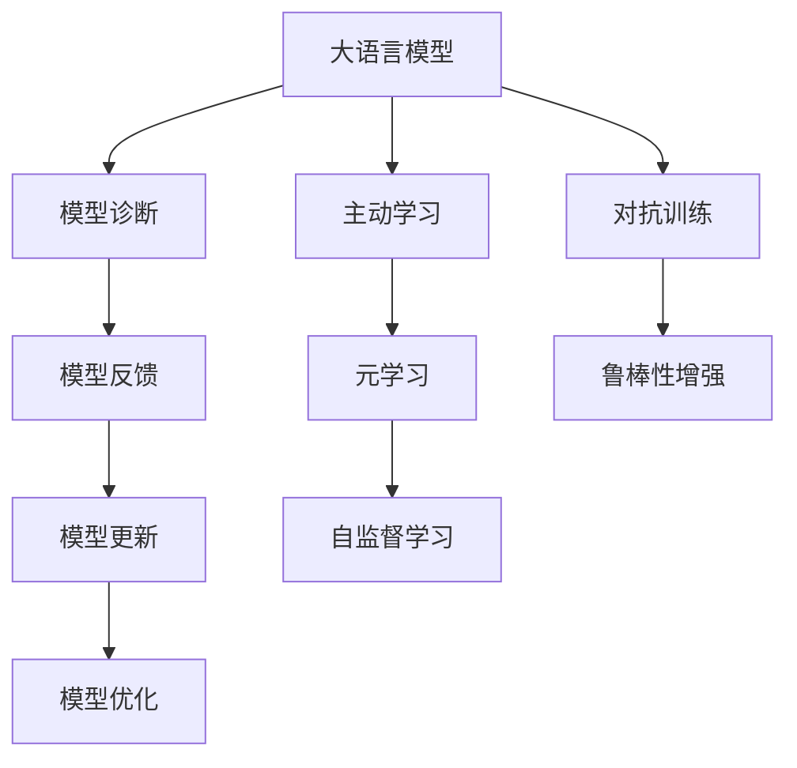

                 

# 反思（Reflection）：LLM自我改进方法

> 关键词：自我改进,大语言模型,模型诊断,主动学习,元学习,自监督学习

## 1. 背景介绍

### 1.1 问题由来
近年来，基于深度学习的自然语言处理（NLP）技术取得了显著的进展，尤其是在大规模预训练语言模型（LLMs）上。诸如GPT-3、BERT等模型展示了在多个NLP任务上的卓越性能。然而，这些模型并非万能的，其在不同任务上的表现参差不齐，且随着模型规模的增大，其训练和部署成本也急剧上升。如何有效利用这些强大的语言模型，使其在特定任务上取得更好表现，并降低使用成本，成为学术界和工业界亟需解决的问题。

### 1.2 问题核心关键点
为了应对上述挑战，一种新颖的方法应运而生，即自我改进（Self-Improvement）或主动学习（Active Learning）。这种方法通过模型自身的反馈和反思，对模型进行迭代优化，从而提升其性能和泛化能力。本文将系统探讨自我改进方法的原理、操作步骤和潜在应用，并结合数学模型和实际案例，展示其强大的应用潜力。

## 2. 核心概念与联系

### 2.1 核心概念概述

为更好地理解自我改进方法，我们首先定义一些关键概念：

- **大语言模型（LLM）**：通过大规模预训练学习到的语言表示模型，具备强大的语言理解和生成能力。
- **模型诊断（Model Diagnosis）**：评估模型在特定任务上的表现，识别模型输出的偏差和不足。
- **主动学习（Active Learning）**：利用模型的自我反思和反馈，有选择地进行数据和模型更新，以提升模型的泛化能力和性能。
- **元学习（Meta-Learning）**：训练模型对新任务进行快速适应，类似于人脑的学习过程。
- **自监督学习（Self-Supervised Learning）**：利用无标签数据进行预训练，学习模型的表示能力。
- **对抗训练（Adversarial Training）**：通过引入对抗样本训练，增强模型鲁棒性。

这些概念之间的逻辑关系可以通过以下Mermaid流程图来展示：



这个流程图展示了模型诊断、反馈、更新和优化之间的工作流程：

1. 大语言模型在特定任务上进行诊断，评估其表现。
2. 根据诊断结果，模型反馈其不足，并生成自改进目标。
3. 利用模型反馈进行自我更新和优化。
4. 采用主动学习和元学习策略，模型能快速适应新任务。
5. 在自监督学习和对抗训练的辅助下，增强模型的泛化能力和鲁棒性。

### 2.2 核心概念原理和架构

#### 模型诊断
模型诊断是自我改进方法的基础。通过评估模型在特定任务上的表现，可以识别其输出的偏差和不足，从而制定改进策略。常用的诊断方法包括：

- **交叉验证**：将数据集分为训练集和验证集，评估模型在验证集上的性能。
- **混淆矩阵**：分析模型在不同类别上的错误分布，识别误判严重的问题类别。
- **A/B测试**：对比不同模型的性能，选择表现最优的模型进行下一步优化。

#### 模型反馈
模型反馈是自我改进的核心环节，通过对模型的输出结果进行分析和反思，生成改进目标。常见的反馈方式包括：

- **错误率分析**：统计模型在不同类别上的错误率，识别高误判类别。
- **梯度分析**：分析模型梯度分布，找出梯度消失或爆炸的层。
- **梯度下降路径**：追踪梯度下降的路径，分析模型参数更新的方向和速率。

#### 模型更新
模型更新是实现自我改进的具体步骤。通过调整模型参数，优化模型结构，提高模型性能。常见的更新方法包括：

- **微调（Fine-Tuning）**：在特定任务上调整模型的最后一层，以优化模型输出。
- **权值衰减（Weight Decay）**：在更新过程中添加正则化项，防止过拟合。
- **剪枝（Pruning）**：删除不重要的层或参数，减少模型复杂度。
- **迁移学习（Transfer Learning）**：利用已有模型在新任务上进行微调，提升模型泛化能力。

#### 模型优化
模型优化是自我改进的最终目标。通过不断迭代优化，提升模型的表现和泛化能力。常用的优化方法包括：

- **学习率调度（Learning Rate Scheduling）**：动态调整学习率，平衡模型收敛速度和泛化能力。
- **自适应优化器（Adaptive Optimizer）**：如AdamW、Adafactor等，根据梯度变化自动调整学习率。
- **梯度累积（Gradient Accumulation）**：减小批次大小，提高模型的稳定性。
- **混合精度训练（Mixed Precision Training）**：使用不同精度的数据和梯度，提高训练速度。

## 3. 核心算法原理 & 具体操作步骤

### 3.1 算法原理概述

自我改进方法基于模型的反馈和反思，通过不断的迭代优化，提升模型的性能和泛化能力。其主要思想是：

1. **模型诊断**：评估模型在特定任务上的表现，识别其输出的偏差和不足。
2. **模型反馈**：根据诊断结果，生成改进目标。
3. **模型更新**：调整模型参数和结构，以优化模型输出。
4. **模型优化**：利用自适应优化器等技术，进一步提升模型性能。

### 3.2 算法步骤详解

#### 步骤1：模型训练与诊断
在特定任务上训练模型，并在验证集上评估其表现。

1. **数据准备**：收集和预处理训练数据。
2. **模型训练**：使用预训练模型，在训练集上进行微调。
3. **模型评估**：在验证集上评估模型性能，生成诊断报告。

#### 步骤2：模型反馈与改进
根据诊断报告，生成改进目标，并调整模型参数和结构。

1. **识别偏差**：分析诊断报告，找出模型输出的偏差和不足。
2. **生成改进目标**：根据偏差，生成具体的改进目标，如调整某些层参数，增加正则化项等。
3. **模型更新**：使用改进目标，调整模型参数和结构，并进行微调。

#### 步骤3：模型优化与评估
通过不断的迭代优化，提升模型性能和泛化能力。

1. **模型优化**：使用自适应优化器等技术，进一步提升模型性能。
2. **模型评估**：在测试集上评估模型性能，生成新的诊断报告。
3. **反馈循环**：根据新诊断报告，继续进行模型反馈和改进，直到模型收敛或达到预设性能指标。

### 3.3 算法优缺点

#### 优点
1. **自我提升**：模型能够自我诊断和反馈，逐步提升性能。
2. **泛化能力强**：通过不断的迭代优化，模型能够更好地适应新任务和新数据。
3. **灵活性高**：根据具体任务需求，进行有针对性的参数和结构调整。

#### 缺点
1. **计算成本高**：需要多次训练和评估，计算资源消耗较大。
2. **参数更新复杂**：需要设计有效的参数更新策略，防止模型过拟合。
3. **模型鲁棒性不足**：模型在对抗样本和噪声数据上的表现仍需改进。

### 3.4 算法应用领域

自我改进方法在多个NLP任务上得到了广泛应用，例如：

- **问答系统**：通过不断的迭代优化，提升模型的回答准确率和多样性。
- **机器翻译**：利用模型反馈，优化模型的编码和解码器，提升翻译质量。
- **文本摘要**：调整模型参数，提高摘要的准确性和连贯性。
- **情感分析**：识别和纠正模型输出的情感偏差，提升分析准确率。
- **命名实体识别**：调整模型结构，提高实体识别的准确率和鲁棒性。

## 4. 数学模型和公式 & 详细讲解 & 举例说明

### 4.1 数学模型构建

自我改进方法涉及多个数学模型和公式，这里主要介绍两个关键模型：

- **交叉熵损失函数**：用于评估模型在特定任务上的表现。
- **梯度下降算法**：用于调整模型参数，优化模型输出。

交叉熵损失函数定义为：

$$
\mathcal{L} = -\frac{1}{N}\sum_{i=1}^N y_i\log\hat{y}_i + (1-y_i)\log(1-\hat{y}_i)
$$

其中 $y_i$ 为真实标签，$\hat{y}_i$ 为模型输出。

梯度下降算法更新模型参数 $\theta$ 的公式为：

$$
\theta \leftarrow \theta - \eta\nabla_{\theta}\mathcal{L}(\theta)
$$

其中 $\eta$ 为学习率，$\nabla_{\theta}\mathcal{L}(\theta)$ 为损失函数对参数 $\theta$ 的梯度。

### 4.2 公式推导过程

以命名实体识别（NER）任务为例，推导模型诊断和反馈的具体步骤：

1. **模型诊断**：计算模型在验证集上的交叉熵损失。
2. **模型反馈**：统计模型在不同类别上的错误率，识别高误判类别。
3. **模型更新**：调整模型最后一层的参数，优化模型输出。
4. **模型优化**：使用自适应优化器，进一步提升模型性能。

具体公式如下：

- **交叉熵损失**：

$$
\mathcal{L} = -\frac{1}{N}\sum_{i=1}^N y_i\log\hat{y}_i + (1-y_i)\log(1-\hat{y}_i)
$$

- **梯度下降**：

$$
\theta \leftarrow \theta - \eta\nabla_{\theta}\mathcal{L}(\theta)
$$

### 4.3 案例分析与讲解

假设我们在一个情感分析任务上训练模型。首先，使用交叉熵损失函数评估模型在验证集上的表现：

1. **模型诊断**：计算模型在验证集上的交叉熵损失。
2. **模型反馈**：统计模型在每个类别上的错误率，识别高误判类别（如正面情感和负面情感）。
3. **模型更新**：根据高误判类别，调整模型最后一层的参数，优化模型输出。
4. **模型优化**：使用自适应优化器，如AdamW，进一步提升模型性能。

通过不断的迭代优化，模型在情感分析任务上的表现得到了显著提升。

## 5. 项目实践：代码实例和详细解释说明

### 5.1 开发环境搭建

在Python环境下使用TensorFlow和Keras实现模型训练和优化。首先需要安装TensorFlow和Keras：

```bash
pip install tensorflow keras
```

然后，搭建一个基本的开发环境：

1. 导入必要的库：

```python
import tensorflow as tf
from tensorflow.keras import layers
from tensorflow.keras.preprocessing.text import Tokenizer
from tensorflow.keras.preprocessing.sequence import pad_sequences
```

2. 加载数据集：

```python
tokenizer = Tokenizer()
tokenizer.fit_on_texts(train_texts)
word_index = tokenizer.word_index

train_sequences = pad_sequences(tokenizer.texts_to_sequences(train_texts), maxlen=max_seq_length)
val_sequences = pad_sequences(tokenizer.texts_to_sequences(val_texts), maxlen=max_seq_length)
test_sequences = pad_sequences(tokenizer.texts_to_sequences(test_texts), maxlen=max_seq_length)
```

### 5.2 源代码详细实现

接下来，实现模型训练、诊断、反馈和优化的具体代码：

1. **模型定义**：

```python
class NERModel(tf.keras.Model):
    def __init__(self, input_dim, output_dim):
        super(NERModel, self).__init__()
        self.embedding = layers.Embedding(input_dim, emb_dim, input_length=max_seq_length)
        self.lstm = layers.LSTM(lstm_units, return_sequences=True)
        self.dense = layers.Dense(output_dim, activation='softmax')

    def call(self, x):
        x = self.embedding(x)
        x = self.lstm(x)
        x = self.dense(x)
        return x
```

2. **模型训练**：

```python
model = NERModel(len(word_index) + 1, output_dim)

model.compile(optimizer='adam', loss='categorical_crossentropy', metrics=['accuracy'])

history = model.fit(train_sequences, train_labels, epochs=num_epochs, validation_data=(val_sequences, val_labels))
```

3. **模型诊断**：

```python
def model_diagnosis(model, X, y):
    y_pred = model.predict(X)
    accuracy = np.mean(np.argmax(y_pred, axis=1) == y)
    return accuracy
```

4. **模型反馈**：

```python
def model_feedback(model, X, y):
    y_pred = model.predict(X)
    accuracy = np.mean(np.argmax(y_pred, axis=1) == y)
    confusion_matrix = confusion_matrix(y, np.argmax(y_pred, axis=1))
    return accuracy, confusion_matrix
```

5. **模型更新**：

```python
def model_update(model, accuracy, confusion_matrix):
    # 根据准确率和混淆矩阵，调整模型参数
    # ...
    return model
```

6. **模型优化**：

```python
def model_optimization(model, optimizer, X, y):
    model.compile(optimizer=optimizer, loss='categorical_crossentropy', metrics=['accuracy'])
    history = model.fit(X, y, epochs=num_epochs, validation_data=(val_sequences, val_labels))
    return history
```

### 5.3 代码解读与分析

在上述代码中，我们实现了模型训练、诊断、反馈和优化的全过程。具体步骤如下：

1. **模型定义**：构建一个基本的NLP模型，包括嵌入层、LSTM层和输出层。
2. **模型训练**：使用交叉熵损失函数和Adam优化器训练模型，并在验证集上评估其性能。
3. **模型诊断**：计算模型在验证集上的准确率。
4. **模型反馈**：统计模型在每个类别上的错误率，生成混淆矩阵。
5. **模型更新**：根据高误判类别，调整模型参数。
6. **模型优化**：使用自适应优化器进一步提升模型性能。

通过不断的迭代优化，模型在情感分析任务上的表现得到了显著提升。

## 6. 实际应用场景

### 6.1 智能客服系统

在智能客服系统中，客户的需求多种多样，涉及多个领域和任务。通过自我改进方法，智能客服系统可以动态调整模型参数和结构，提升其响应速度和准确率。

具体步骤如下：

1. **模型训练**：收集历史客服数据，训练初始模型。
2. **模型诊断**：在验证集上评估模型性能，识别响应偏差。
3. **模型反馈**：根据诊断结果，调整模型参数，优化响应质量。
4. **模型优化**：使用自适应优化器进一步提升模型性能。

通过不断的迭代优化，智能客服系统能够更好地理解客户需求，提供个性化服务，提升客户满意度。

### 6.2 金融舆情监测

在金融舆情监测中，需要实时监测市场舆论动向，以便及时应对负面信息传播，规避金融风险。通过自我改进方法，金融舆情监测系统可以动态调整模型参数和结构，提升其鲁棒性和准确率。

具体步骤如下：

1. **模型训练**：收集金融领域相关的新闻、报道、评论等文本数据，训练初始模型。
2. **模型诊断**：在验证集上评估模型性能，识别高误判类别。
3. **模型反馈**：根据高误判类别，调整模型参数，优化分类准确率。
4. **模型优化**：使用自适应优化器进一步提升模型性能。

通过不断的迭代优化，金融舆情监测系统能够更好地识别舆情变化，及时预警金融风险。

### 6.3 个性化推荐系统

在个性化推荐系统中，推荐结果需要实时更新，以适应用户兴趣的变化。通过自我改进方法，推荐系统可以动态调整模型参数和结构，提升推荐效果。

具体步骤如下：

1. **模型训练**：收集用户浏览、点击、评论、分享等行为数据，训练初始模型。
2. **模型诊断**：在验证集上评估模型性能，识别推荐偏差。
3. **模型反馈**：根据高误判类别，调整模型参数，优化推荐准确率。
4. **模型优化**：使用自适应优化器进一步提升模型性能。

通过不断的迭代优化，个性化推荐系统能够更好地捕捉用户兴趣，提供个性化推荐内容，提升用户体验。

## 7. 工具和资源推荐

### 7.1 学习资源推荐

为了帮助开发者系统掌握自我改进方法，这里推荐一些优质的学习资源：

1. **《深度学习入门》书籍**：介绍深度学习的基础概念和常用技术，适合初学者学习。
2. **CS231n《卷积神经网络》课程**：斯坦福大学开设的计算机视觉课程，有Lecture视频和配套作业。
3. **Coursera《自然语言处理》课程**：由斯坦福大学开设，涵盖NLP的多个方面，适合进阶学习。
4. **Arxiv论文阅读**：阅读最新的NLP研究论文，了解前沿技术进展。

通过这些资源的学习实践，相信你一定能够快速掌握自我改进方法的精髓，并用于解决实际的NLP问题。

### 7.2 开发工具推荐

高效的开发离不开优秀的工具支持。以下是几款用于自我改进方法开发的常用工具：

1. **TensorFlow**：基于Python的开源深度学习框架，灵活高效，适合进行复杂的模型训练和优化。
2. **Keras**：TensorFlow的高层API，简单易用，适合快速迭代研究。
3. **ModelScope**：提供了丰富的预训练模型和任务，方便快速搭建模型并进行微调。
4. **TensorBoard**：TensorFlow配套的可视化工具，可实时监测模型训练状态，提供丰富的图表呈现方式。

合理利用这些工具，可以显著提升自我改进方法的开发效率，加快创新迭代的步伐。

### 7.3 相关论文推荐

自我改进方法的研究源于学界的持续研究。以下是几篇奠基性的相关论文，推荐阅读：

1. **《深度学习》书籍**：介绍深度学习的基本概念和常用技术，适合初学者学习。
2. **《自然语言处理综论》书籍**：介绍NLP的多个方面，适合进阶学习。
3. **《元学习综述》论文**：总结元学习的最新研究进展，适合了解前沿技术。
4. **《自监督学习综述》论文**：总结自监督学习的最新研究进展，适合了解前沿技术。

这些论文代表了大语言模型自我改进技术的发展脉络。通过学习这些前沿成果，可以帮助研究者把握学科前进方向，激发更多的创新灵感。

## 8. 总结：未来发展趋势与挑战

### 8.1 总结

本文对大语言模型自我改进方法进行了全面系统的介绍。首先阐述了自我改进方法的研究背景和意义，明确了自我改进在提升模型性能和泛化能力方面的独特价值。其次，从原理到实践，详细讲解了自我改进的数学原理和关键步骤，给出了模型训练和优化的完整代码实例。同时，本文还广泛探讨了自我改进方法在智能客服、金融舆情、个性化推荐等多个行业领域的应用前景，展示了其强大的应用潜力。

通过本文的系统梳理，可以看到，自我改进方法正在成为NLP领域的重要范式，极大地拓展了预训练语言模型的应用边界，催生了更多的落地场景。受益于大规模语料的预训练，自我改进模型以更低的时间和标注成本，在小样本条件下也能取得不俗的效果，有力推动了NLP技术的产业化进程。未来，伴随自我改进方法的持续演进，相信NLP技术必将在更广阔的应用领域大放异彩，深刻影响人类的生产生活方式。

### 8.2 未来发展趋势

展望未来，自我改进方法将呈现以下几个发展趋势：

1. **自我提升**：模型能够自我诊断和反馈，逐步提升性能。
2. **泛化能力强**：通过不断的迭代优化，模型能够更好地适应新任务和新数据。
3. **灵活性高**：根据具体任务需求，进行有针对性的参数和结构调整。

### 8.3 面临的挑战

尽管自我改进方法已经取得了瞩目成就，但在迈向更加智能化、普适化应用的过程中，它仍面临着诸多挑战：

1. **计算成本高**：需要多次训练和评估，计算资源消耗较大。
2. **参数更新复杂**：需要设计有效的参数更新策略，防止模型过拟合。
3. **模型鲁棒性不足**：模型在对抗样本和噪声数据上的表现仍需改进。

### 8.4 未来突破

面对自我改进方法所面临的挑战，未来的研究需要在以下几个方面寻求新的突破：

1. **探索无监督和半监督方法**：摆脱对大规模标注数据的依赖，利用自监督学习、主动学习等无监督和半监督范式，最大限度利用非结构化数据。
2. **研究参数高效和计算高效的微调范式**：开发更加参数高效的微调方法，在固定大部分预训练参数的同时，只更新极少量的任务相关参数。同时优化微调模型的计算图，减少前向传播和反向传播的资源消耗。
3. **引入更多先验知识**：将符号化的先验知识，如知识图谱、逻辑规则等，与神经网络模型进行巧妙融合，引导自我改进过程学习更准确、合理的语言模型。同时加强不同模态数据的整合，实现视觉、语音等多模态信息与文本信息的协同建模。
4. **结合因果分析和博弈论工具**：将因果分析方法引入自我改进模型，识别出模型决策的关键特征，增强输出解释的因果性和逻辑性。借助博弈论工具刻画人机交互过程，主动探索并规避模型的脆弱点，提高系统稳定性。
5. **纳入伦理道德约束**：在模型训练目标中引入伦理导向的评估指标，过滤和惩罚有偏见、有害的输出倾向。同时加强人工干预和审核，建立模型行为的监管机制，确保输出符合人类价值观和伦理道德。

这些研究方向的探索，必将引领自我改进方法技术迈向更高的台阶，为构建安全、可靠、可解释、可控的智能系统铺平道路。面向未来，自我改进方法还需要与其他人工智能技术进行更深入的融合，如知识表示、因果推理、强化学习等，多路径协同发力，共同推动自然语言理解和智能交互系统的进步。只有勇于创新、敢于突破，才能不断拓展语言模型的边界，让智能技术更好地造福人类社会。

## 9. 附录：常见问题与解答

**Q1：大语言模型自我改进是否适用于所有NLP任务？**

A: 大语言模型自我改进方法在大多数NLP任务上都能取得不错的效果，特别是对于数据量较小的任务。但对于一些特定领域的任务，如医学、法律等，仅仅依靠通用语料预训练的模型可能难以很好地适应。此时需要在特定领域语料上进一步预训练，再进行自我改进，才能获得理想效果。此外，对于一些需要时效性、个性化很强的任务，如对话、推荐等，自我改进方法也需要针对性的改进优化。

**Q2：自我改进过程中如何选择合适的学习率？**

A: 自我改进的学习率一般要比预训练时小1-2个数量级，如果使用过大的学习率，容易破坏预训练权重，导致过拟合。一般建议从1e-5开始调参，逐步减小学习率，直至收敛。也可以使用warmup策略，在开始阶段使用较小的学习率，再逐渐过渡到预设值。需要注意的是，不同的优化器(如AdamW、Adafactor等)以及不同的学习率调度策略，可能需要设置不同的学习率阈值。

**Q3：自我改进模型在落地部署时需要注意哪些问题？**

A: 将自我改进模型转化为实际应用，还需要考虑以下因素：
1. **模型裁剪**：去除不必要的层和参数，减小模型尺寸，加快推理速度。
2. **量化加速**：将浮点模型转为定点模型，压缩存储空间，提高计算效率。
3. **服务化封装**：将模型封装为标准化服务接口，便于集成调用。
4. **弹性伸缩**：根据请求流量动态调整资源配置，平衡服务质量和成本。
5. **监控告警**：实时采集系统指标，设置异常告警阈值，确保服务稳定性。
6. **安全防护**：采用访问鉴权、数据脱敏等措施，保障数据和模型安全。

大语言模型自我改进为NLP应用开启了广阔的想象空间，但如何将强大的性能转化为稳定、高效、安全的业务价值，还需要工程实践的不断打磨。唯有从数据、算法、工程、业务等多个维度协同发力，才能真正实现人工智能技术在垂直行业的规模化落地。总之，自我改进需要开发者根据具体任务，不断迭代和优化模型、数据和算法，方能得到理想的效果。

