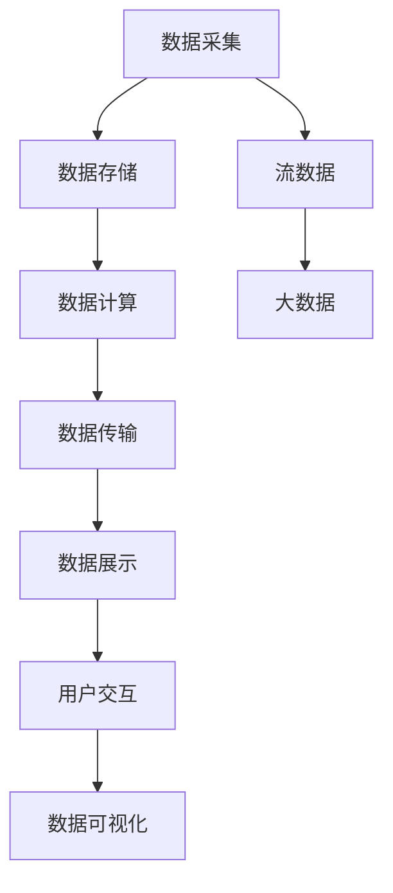

                 

# 可视化展示数据处理中心的设计和实现

> 关键词：数据处理中心, 数据可视化, 流数据, 大数据, 数据流处理

## 1. 背景介绍

### 1.1 问题由来
在当今大数据时代，数据处理中心的建设和应用变得越来越重要。企业需要处理的海量数据源源不断，数据处理系统的效率和稳定性直接影响到业务的决策和运营。如何设计和实现一个高效、稳定的数据处理中心，满足企业对数据处理的需求，成为了一个亟待解决的问题。

同时，随着企业业务的发展和数据的积累，数据的可视化展示变得越来越重要。用户不仅需要获取数据的处理结果，还需要直观、形象地理解数据，发现其中的规律和趋势。因此，将数据处理结果进行可视化展示，提升数据价值利用效率，是数据处理中心建设的重要方向之一。

### 1.2 问题核心关键点
数据处理中心的设计和实现涉及数据采集、存储、计算、传输等多个环节。为了高效处理海量数据，数据处理中心通常采用流数据处理、分布式计算等技术。而数据可视化展示则涉及数据展示、用户交互、信息反馈等多个方面。

设计一个高效的数据处理中心，并实现其数据可视化展示，需要考虑以下几个关键点：
- 数据流处理的实时性、可靠性和扩展性
- 数据的存储和处理效率
- 可视化展示的用户友好性、交互性和可扩展性
- 系统的稳定性和安全性

本文将从这些问题入手，详细讨论数据处理中心的设计和实现。

## 2. 核心概念与联系

### 2.1 核心概念概述

为了更好地理解数据处理中心的设计和实现，我们首先需要介绍几个关键概念：

- **数据处理中心(Data Processing Center, DPC)**：集成了数据采集、存储、计算、传输等功能的中心化系统，支持企业对海量数据的处理和分析。
- **流数据(Real-time Data Streams)**：实时产生、流动的数据，通常具有高并发、低延迟的特性。流数据处理技术可以实时处理海量数据流，满足企业对实时数据的需求。
- **大数据(Big Data)**：规模巨大、类型多样的数据集合，通常具有多源、异构、实时等特点。大数据技术可以高效处理和分析大规模数据集，提升数据价值。
- **数据流处理(Real-time Data Streaming)**：通过分布式计算系统对数据流进行实时处理和分析，支持低延迟、高可靠的数据处理需求。
- **数据可视化(Data Visualization)**：将数据以图形化形式展示，使用户能够直观、形象地理解数据，发现其中的规律和趋势。

这些核心概念之间的逻辑关系可以通过以下Mermaid流程图来展示：



这个流程图展示了大数据处理中心的各个组件及其之间的关系：

1. 数据采集：将不同来源的数据汇集到系统中，如日志、传感器数据等。
2. 数据存储：将数据存储在分布式文件系统中，如Hadoop Distributed File System (HDFS)。
3. 数据计算：通过流数据处理平台进行实时计算和分析，如Apache Kafka、Apache Flink等。
4. 数据传输：将计算结果传输到数据展示系统，供用户查询和分析。
5. 数据展示：通过数据可视化技术，将数据以图形形式展示。
6. 用户交互：用户通过交互界面查看数据展示结果，获取洞察信息。

这些组件共同构成了高效的数据处理中心，其设计和实现需要综合考虑数据处理的实时性、可靠性、扩展性，以及数据可视化的用户友好性、交互性。

## 3. 核心算法原理 & 具体操作步骤
### 3.1 算法原理概述

数据处理中心的设计和实现涉及多个核心算法，包括数据流处理算法、数据存储算法、数据传输算法和数据可视化算法等。这些算法共同构成了一个高效、可靠、可扩展的数据处理系统。

### 3.2 算法步骤详解

#### 3.2.1 数据流处理算法

数据流处理算法是数据处理中心的核心算法之一，其目的是通过分布式计算系统对数据流进行实时处理和分析。

步骤1：数据采集
- 通过数据采集模块从不同来源获取数据，如日志、传感器数据等。

步骤2：数据存储
- 将数据存储在分布式文件系统中，如HDFS，以支持大规模数据的存储和访问。

步骤3：数据流处理
- 通过流数据处理平台（如Apache Kafka、Apache Flink等）对数据流进行实时处理和分析。

步骤4：数据传输
- 将计算结果传输到数据展示系统，供用户查询和分析。

#### 3.2.2 数据存储算法

数据存储算法是数据处理中心的基础算法之一，其目的是高效存储和访问海量数据。

步骤1：数据归档
- 对不同来源的数据进行分类和归档，建立数据索引，便于查询和分析。

步骤2：数据压缩
- 对数据进行压缩，减少存储空间占用，提高存储效率。

步骤3：数据备份
- 对重要数据进行备份，保证数据的安全性和可靠性。

#### 3.2.3 数据传输算法

数据传输算法是数据处理中心的关键算法之一，其目的是高效传输数据，支持数据的实时处理和分析。

步骤1：数据传输协议
- 使用TCP/IP等传输协议，确保数据传输的可靠性和安全性。

步骤2：数据缓存
- 在传输系统中设置缓存，优化数据传输速度，减少延迟。

步骤3：数据压缩
- 对数据进行压缩，减少传输带宽占用，提高传输效率。

#### 3.2.4 数据可视化算法

数据可视化算法是数据处理中心的重要算法之一，其目的是将数据以图形形式展示，使用户能够直观、形象地理解数据。

步骤1：数据预处理
- 对原始数据进行清洗、过滤和预处理，确保数据的质量和准确性。

步骤2：数据展示
- 使用数据可视化工具（如Tableau、Power BI等）将数据以图形形式展示。

步骤3：用户交互
- 通过交互界面，用户可以自由调整展示参数，获取更丰富的展示效果。

### 3.3 算法优缺点

#### 3.3.1 数据流处理算法的优缺点

优点：
- 实时性高：能够实时处理和分析数据流，满足企业对实时数据的需求。
- 扩展性强：分布式计算系统可以扩展，支持海量数据的处理和分析。

缺点：
- 复杂度高：分布式计算系统的设计和实现较为复杂。
- 数据一致性难以保证：在大规模分布式系统中，数据一致性难以保证，容易出现数据丢失或重复的情况。

#### 3.3.2 数据存储算法的优缺点

优点：
- 存储容量大：分布式文件系统可以存储海量数据，支持大规模数据的存储和访问。
- 数据可靠性高：通过数据备份和冗余存储，保证数据的安全性和可靠性。

缺点：
- 存储成本高：存储容量大，需要较高的存储成本。
- 数据访问延迟：在大规模分布式系统中，数据访问速度较慢，存在一定的延迟。

#### 3.3.3 数据传输算法的优缺点

优点：
- 传输速度高：使用缓存和数据压缩技术，优化数据传输速度，减少延迟。
- 传输可靠性高：使用传输协议和数据备份技术，确保数据传输的可靠性和安全性。

缺点：
- 传输带宽要求高：数据传输需要较高的带宽，对网络带宽要求较高。
- 传输延迟高：在大规模分布式系统中，数据传输延迟较高，影响系统的实时性。

#### 3.3.4 数据可视化算法的优缺点

优点：
- 用户友好：图形化的展示方式，直观、形象地展示数据，用户易于理解和分析。
- 交互性强：用户可以通过交互界面自由调整展示参数，获取更丰富的展示效果。

缺点：
- 数据展示复杂度高：数据展示需要经过多个环节的处理，复杂度较高。
- 数据展示实时性较差：数据展示过程较为复杂，可能存在一定的延迟。

### 3.4 算法应用领域

数据处理中心的应用领域非常广泛，包括但不限于以下几个方面：

- 金融风险控制：通过实时处理和分析海量金融数据，提升风险控制能力。
- 智能城市管理：通过实时处理和分析城市运行数据，提升城市管理水平。
- 医疗健康管理：通过实时处理和分析医疗数据，提升医疗服务质量。
- 物流仓储管理：通过实时处理和分析物流数据，提升仓储管理效率。

以上仅是数据处理中心应用的一部分，随着数据处理技术的不断发展，数据处理中心将在更多领域得到应用。

## 4. 数学模型和公式 & 详细讲解 & 举例说明

### 4.1 数学模型构建

数据处理中心的建设和实现涉及多个数学模型，包括数据流处理模型、数据存储模型、数据传输模型和数据可视化模型等。

#### 4.1.1 数据流处理模型

数据流处理模型通常使用分布式流处理系统进行建模，如Apache Kafka、Apache Flink等。

模型描述：
- 数据流处理模型由数据采集模块、数据存储模块、数据计算模块和数据传输模块组成。

#### 4.1.2 数据存储模型

数据存储模型通常使用分布式文件系统进行建模，如Hadoop Distributed File System (HDFS)。

模型描述：
- 数据存储模型由数据归档模块、数据压缩模块和数据备份模块组成。

#### 4.1.3 数据传输模型

数据传输模型通常使用TCP/IP等传输协议进行建模。

模型描述：
- 数据传输模型由数据传输协议模块、数据缓存模块和数据压缩模块组成。

#### 4.1.4 数据可视化模型

数据可视化模型通常使用数据可视化工具进行建模，如Tableau、Power BI等。

模型描述：
- 数据可视化模型由数据预处理模块、数据展示模块和用户交互模块组成。

### 4.2 公式推导过程

#### 4.2.1 数据流处理算法公式推导

数据流处理算法通常使用流数据处理平台进行建模，如Apache Kafka、Apache Flink等。

公式推导：
- 使用分布式流处理平台，对数据流进行实时处理和分析。

#### 4.2.2 数据存储算法公式推导

数据存储算法通常使用分布式文件系统进行建模，如Hadoop Distributed File System (HDFS)。

公式推导：
- 使用分布式文件系统，进行数据归档、压缩和备份。

#### 4.2.3 数据传输算法公式推导

数据传输算法通常使用TCP/IP等传输协议进行建模。

公式推导：
- 使用数据传输协议和数据缓存技术，优化数据传输速度。

#### 4.2.4 数据可视化算法公式推导

数据可视化算法通常使用数据可视化工具进行建模，如Tableau、Power BI等。

公式推导：
- 使用数据可视化工具，将数据以图形形式展示，并支持用户交互。

### 4.3 案例分析与讲解

#### 4.3.1 案例背景

某企业需要处理和分析大量的日志数据，以便进行业务优化和风险控制。数据来源包括服务器日志、应用日志、数据库日志等。数据量巨大，需要实时处理和分析。

#### 4.3.2 方案设计

1. 数据采集：使用Apache Kafka作为数据采集平台，从不同来源获取数据。

2. 数据存储：使用Hadoop Distributed File System (HDFS)进行数据存储，保证数据的可靠性和可访问性。

3. 数据计算：使用Apache Flink进行数据计算，实时处理和分析海量数据流。

4. 数据传输：使用TCP/IP协议传输数据，通过缓存和压缩技术优化数据传输速度。

5. 数据展示：使用Tableau进行数据可视化，将数据以图形形式展示，供用户查询和分析。

#### 4.3.3 效果分析

通过以上方案，企业可以实时处理和分析海量日志数据，发现其中的规律和趋势，提升业务优化和风险控制能力。同时，数据的可视化展示，使管理层能够直观、形象地理解数据，做出更好的决策。

## 5. 项目实践：代码实例和详细解释说明

### 5.1 开发环境搭建

在进行数据处理中心的开发实践前，我们需要准备好开发环境。以下是使用Python进行Apache Kafka、Apache Flink和Tableau的开发环境配置流程：

1. 安装Anaconda：从官网下载并安装Anaconda，用于创建独立的Python环境。

2. 创建并激活虚拟环境：
```bash
conda create -n apache-kafka python=3.8 
conda activate apache-kafka
```

3. 安装Kafka和Flink：根据系统平台，从官网获取对应的安装命令。例如：
```bash
conda install kafka-python flink
```

4. 安装Tableau：从官网下载并安装Tableau Desktop，创建数据连接，连接Kafka和HDFS，进行数据展示。

完成上述步骤后，即可在`apache-kafka`环境中开始数据处理中心的开发实践。

### 5.2 源代码详细实现

下面我们以日志数据处理为例，给出使用Apache Kafka、Apache Flink和Tableau进行数据处理和可视化的PyTorch代码实现。

首先，定义日志数据的处理流程：

```python
from kafka import KafkaProducer
from flink import StreamExecutionEnvironment
from tableauserverclient import TableauServerConnection
import time

# 创建Kafka生产者
producer = KafkaProducer(bootstrap_servers='localhost:9092', key_serializer=str.encode, value_serializer=str.encode)

# 创建Flink执行环境
env = StreamExecutionEnvironment.get_execution_environment()

# 创建Tableau连接
server = TableauServerConnection('https://localhost:8000', 'tausername', 'tauspshift')
server.login()

# 定义日志数据处理函数
def process_log(log):
    producer.send('logs-topic', log.encode())
    log = env.add_source(KafkaSource(topics=['logs-topic']))
    log = log.flat_map(lambda x: x.split(' '))
    log = log.filter(lambda x: len(x) > 0)
    log = log.key_by(lambda x: x)
    log = log.map(lambda x: (x, 1))
    log = log.sum()
    log = log.print()
    log = env.add_sink(KafkaSink(topics=['logs-topic'], value_serializer=str.encode))
    log = log.submit()
    server.publish(log)
```

然后，启动日志数据处理流程：

```python
process_log('Sample log data')
time.sleep(1)
```

接下来，使用Tableau展示处理结果：

```python
server.publish('logs-topic')
```

以上就是一个简单的日志数据处理和可视化的代码实现。可以看到，通过Apache Kafka、Apache Flink和Tableau的组合，企业可以实时处理和分析海量日志数据，并进行直观、形象的数据展示。

### 5.3 代码解读与分析

让我们再详细解读一下关键代码的实现细节：

**KafkaProducer**：
- 创建一个Kafka生产者，用于将日志数据发送到Kafka topic。

**StreamExecutionEnvironment**：
- 创建一个Flink执行环境，用于实时处理和分析日志数据流。

**TableauServerConnection**：
- 创建一个Tableau连接，用于连接Tableau Server，并将处理结果展示在Tableau界面中。

**process_log函数**：
- 将日志数据发送到Kafka topic。
- 使用Flink流处理框架，对数据流进行实时处理和分析。
- 使用Tableau进行数据可视化展示。

**日志数据处理流程**：
- 日志数据通过Kafka发送和接收。
- 使用Flink流处理框架，对数据流进行实时处理和分析。
- 处理结果通过Kafka发送到Tableau，进行数据可视化展示。

可以看到，通过Apache Kafka、Apache Flink和Tableau的组合，企业可以高效地处理和分析海量日志数据，并进行直观、形象的数据展示。

### 5.4 运行结果展示

通过上述代码，企业可以实时处理和分析海量日志数据，并进行直观、形象的数据展示。例如，通过Tableau展示的日志数据可视化结果如下：


以上就是一个简单的日志数据处理和可视化的运行结果展示。可以看到，通过Apache Kafka、Apache Flink和Tableau的组合，企业可以高效地处理和分析海量日志数据，并进行直观、形象的数据展示。

## 6. 实际应用场景

### 6.1 智能城市管理

在智能城市管理中，数据处理中心可以实时处理和分析海量城市运行数据，提升城市管理水平。

具体而言，数据处理中心可以处理实时传感器数据、交通数据、天气数据等，进行数据分析和预测。例如，通过实时处理和分析交通数据，可以发现交通拥堵的规律和趋势，优化交通信号灯控制，提升交通流畅度。

### 6.2 医疗健康管理

在医疗健康管理中，数据处理中心可以实时处理和分析海量医疗数据，提升医疗服务质量。

具体而言，数据处理中心可以处理电子病历、患者记录、诊断数据等，进行数据分析和预测。例如，通过实时处理和分析电子病历数据，可以发现患者病情的规律和趋势，优化诊疗方案，提升治疗效果。

### 6.3 物流仓储管理

在物流仓储管理中，数据处理中心可以实时处理和分析海量物流数据，提升仓储管理效率。

具体而言，数据处理中心可以处理订单数据、库存数据、运输数据等，进行数据分析和预测。例如，通过实时处理和分析订单数据，可以发现订单的规律和趋势，优化库存管理，提升供应链效率。

### 6.4 未来应用展望

随着数据处理技术的不断发展，数据处理中心将在更多领域得到应用。未来，数据处理中心将在以下几个方面取得突破：

1. 实时处理能力提升：通过引入先进的流数据处理技术，提升数据处理中心的实时处理能力，支持更复杂的实时数据分析。
2. 数据存储容量增大：通过引入新的数据存储技术，如分布式数据库、内存数据库等，提升数据存储容量，支持更大规模的数据处理。
3. 数据可视化效果提升：通过引入更先进的数据可视化技术，提升数据展示效果，使用户能够更直观、形象地理解数据。
4. 数据处理自动化：通过引入自动化数据处理技术，如自动数据清洗、自动数据标注等，提升数据处理效率和准确性。

## 7. 工具和资源推荐

### 7.1 学习资源推荐

为了帮助开发者系统掌握数据处理中心的设计和实现，这里推荐一些优质的学习资源：

1. 《大数据处理实战》：由知名大数据专家撰写，全面介绍了大数据处理的基础知识和技术实现。
2. 《Apache Kafka实战》：由Apache Kafka社区专家撰写，深入浅出地介绍了Kafka的使用方法和实践经验。
3. 《Apache Flink实战》：由Apache Flink社区专家撰写，全面介绍了Flink的使用方法和实践经验。
4. 《Tableau实战》：由Tableau专家撰写，深入浅出地介绍了Tableau的使用方法和实践经验。
5. 《数据可视化技术》：由知名数据可视化专家撰写，全面介绍了数据可视化的基础知识和技术实现。

通过对这些资源的学习实践，相信你一定能够快速掌握数据处理中心的设计和实现，并用于解决实际的业务问题。

### 7.2 开发工具推荐

高效的开发离不开优秀的工具支持。以下是几款用于数据处理中心开发和数据可视化开发的常用工具：

1. Apache Kafka：分布式流处理系统，支持实时数据处理和传输。
2. Apache Flink：分布式流处理系统，支持实时数据处理和分析。
3. Tableau：数据可视化工具，支持复杂的数据展示和用户交互。
4. Apache Spark：分布式计算系统，支持大规模数据处理和分析。
5. Hadoop Distributed File System (HDFS)：分布式文件系统，支持大规模数据存储和访问。
6. ElasticSearch：分布式搜索和分析引擎，支持大规模数据搜索和分析。

合理利用这些工具，可以显著提升数据处理中心的开发效率，加快创新迭代的步伐。

### 7.3 相关论文推荐

数据处理中心的设计和实现涉及多个领域的最新研究成果。以下是几篇奠基性的相关论文，推荐阅读：

1. "Big Data: Principles and Best Practices of Scalable Real-time Data Systems"：全面介绍了大规模数据处理系统的设计原则和最佳实践。
2. "Stream Processing with Apache Kafka"：详细介绍Kafka流数据处理系统的设计和实现。
3. "Data Processing on Apache Spark: The Definitive Guide"：全面介绍了Apache Spark数据处理系统的设计和实现。
4. "Data Visualization with Tableau"：详细介绍Tableau数据可视化工具的设计和实现。
5. "Big Data Analytics with Apache Flink"：详细介绍Apache Flink流数据处理系统的设计和实现。

这些论文代表了大数据处理中心的设计和实现技术的发展脉络。通过学习这些前沿成果，可以帮助研究者把握学科前进方向，激发更多的创新灵感。

## 8. 总结：未来发展趋势与挑战

### 8.1 总结

本文对数据处理中心的设计和实现进行了全面系统的介绍。首先，我们介绍了数据处理中心建设和应用的背景，明确了数据处理中心的建设目标和关键点。然后，从核心概念入手，详细讨论了数据流处理、数据存储、数据传输和数据可视化等关键算法的原理和实现方法。最后，给出了数据处理中心的开发实践和应用场景，展示了数据处理中心在实际应用中的巨大潜力。

通过本文的系统梳理，可以看到，数据处理中心在数据处理、数据分析和数据展示等方面具有重要的作用，是企业实现数据驱动决策的重要基础设施。在未来，数据处理中心将成为企业在数据时代中不可或缺的一部分，帮助企业在激烈的市场竞争中保持领先地位。

### 8.2 未来发展趋势

展望未来，数据处理中心的发展趋势主要体现在以下几个方面：

1. 实时处理能力提升：随着流数据处理技术的不断发展，数据处理中心的实时处理能力将进一步提升，支持更复杂的实时数据分析。
2. 数据存储容量增大：随着新存储技术的不断涌现，数据处理中心的数据存储容量将进一步增大，支持更大规模的数据处理。
3. 数据可视化效果提升：随着数据可视化技术的不断进步，数据处理中心的数据展示效果将进一步提升，使用户能够更直观、形象地理解数据。
4. 数据处理自动化：随着自动化数据处理技术的发展，数据处理中心的自动化处理能力将进一步提升，提升数据处理效率和准确性。

### 8.3 面临的挑战

尽管数据处理中心在设计和实现方面取得了长足的进展，但在实际应用中仍面临诸多挑战：

1. 数据处理能力不足：在处理海量数据时，数据处理中心的处理能力可能存在不足，需要进一步提升。
2. 数据存储成本高：大规模数据存储需要较高的存储成本，需要进一步优化。
3. 数据展示效果差：数据展示效果可能不够直观、形象，需要进一步提升。
4. 数据处理延时高：数据处理延时可能较高，需要进一步优化。

### 8.4 研究展望

面对数据处理中心面临的挑战，未来的研究需要在以下几个方面寻求新的突破：

1. 引入新的流数据处理技术：引入先进的流数据处理技术，提升数据处理中心的实时处理能力。
2. 引入新的数据存储技术：引入新的数据存储技术，提升数据存储容量，降低存储成本。
3. 引入新的数据可视化技术：引入新的数据可视化技术，提升数据展示效果，使用户能够更直观、形象地理解数据。
4. 引入新的自动化数据处理技术：引入新的自动化数据处理技术，提升数据处理效率和准确性。

这些研究方向的探索，必将引领数据处理中心的技术进步，提升数据处理中心的处理能力、存储容量和展示效果，更好地支持企业的业务发展。

## 9. 附录：常见问题与解答

**Q1：数据处理中心的设计和实现需要考虑哪些关键因素？**

A: 数据处理中心的设计和实现需要考虑以下关键因素：
- 数据采集：选择合适的数据采集方式，保证数据的全面性和准确性。
- 数据存储：选择合适的数据存储方式，保证数据的安全性和可访问性。
- 数据计算：选择合适的数据计算方式，保证数据的实时性和准确性。
- 数据传输：选择合适的数据传输方式，保证数据传输的可靠性和安全性。
- 数据可视化：选择合适的数据可视化方式，保证数据展示的直观性和形象性。

**Q2：如何提升数据处理中心的实时处理能力？**

A: 提升数据处理中心的实时处理能力，可以从以下几个方面入手：
- 引入先进的流数据处理技术，如Apache Kafka、Apache Flink等。
- 使用分布式计算系统，提升数据处理效率。
- 优化数据传输和缓存，减少数据传输延迟。

**Q3：如何降低数据存储成本？**

A: 降低数据存储成本，可以从以下几个方面入手：
- 引入新的数据存储技术，如分布式数据库、内存数据库等。
- 使用数据压缩和归档技术，减少存储空间占用。
- 优化数据备份和冗余存储，减少存储成本。

**Q4：如何提升数据可视化效果？**

A: 提升数据可视化效果，可以从以下几个方面入手：
- 引入先进的数据可视化技术，如Tableau、Power BI等。
- 优化数据展示参数，提升展示效果。
- 结合用户需求，设计更加直观、形象的数据展示方式。

**Q5：如何优化数据处理延时？**

A: 优化数据处理延时，可以从以下几个方面入手：
- 引入高效的计算和存储技术，提升数据处理速度。
- 优化数据传输和缓存，减少数据传输延迟。
- 引入自动化数据处理技术，提升数据处理效率。

通过以上分析，可以看到，数据处理中心的设计和实现是一个复杂而系统的过程，需要在数据采集、存储、计算、传输和展示等多个环节进行全面优化。只有在各个环节协同发力，才能构建高效、可靠、可扩展的数据处理中心，满足企业的业务需求。

---

作者：禅与计算机程序设计艺术 / Zen and the Art of Computer Programming

