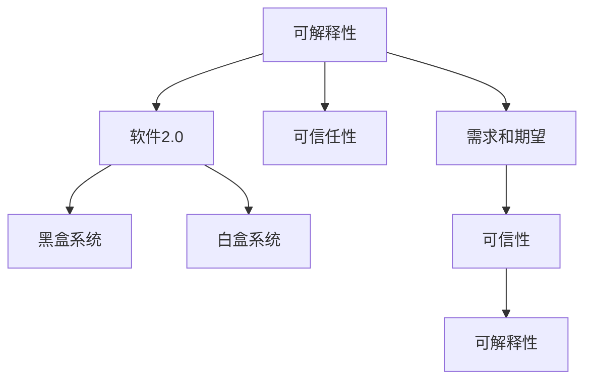

                 

# 可解释性差怎么办，软件2.0的可信任性挑战

## 1. 背景介绍

### 1.1 问题由来
在软件开发的演进过程中，从软件1.0的层级式、递归式的思维模式，到软件2.0的模块化、组件化的设计理念，再到软件3.0的微服务、DevOps等新理念的兴起，我们逐渐从面向过程的编程，转向面向结果、性能和可维护性的目标。但是，随着复杂性的增加，软件系统的黑盒性质愈发显著，导致了可解释性差、可维护性低的问题。

在当前软件2.0时代，我们拥有了越来越多强大的工具和框架，如微服务、Kubernetes、Docker等，使得软件系统更加灵活、可扩展。但是，这些系统通常缺乏可解释性，导致开发者、运维人员和最终用户对系统的不信任感增强。特别是在安全性、合规性等高风险场景下，系统的可解释性更是显得至关重要。

### 1.2 问题核心关键点
- 可解释性：指系统运行时的决策过程和结果能够被理解、解释和验证的能力。
- 软件2.0：指的是基于模块化、组件化的设计理念，通过软件工程方法论构建的软件系统。
- 可信任性：指系统能够被开发者、运维人员和用户信任，满足其需求和期望的能力。
- 黑盒系统：指系统内部的运行机制和决策过程对用户完全不可见，只能通过输入输出接口进行交互的系统。

这些问题关键点之间的联系：
- 可解释性差导致软件系统的黑盒性质加剧，从而影响系统的可信任性。
- 软件2.0强调组件化和模块化，但这些组件和模块之间的交互过程和数据流动往往缺乏解释性。
- 系统的可解释性能够增强用户和运维人员的信任感，从而提升软件2.0的可信任性。

## 2. 核心概念与联系

### 2.1 核心概念概述

为更好地理解软件系统的可解释性和可信任性挑战，本节将介绍几个密切相关的核心概念：

- 可解释性(Explainability)：指系统运行时的决策过程和结果能够被理解、解释和验证的能力。
- 可信任性(Trustworthiness)：指系统能够被开发者、运维人员和用户信任，满足其需求和期望的能力。
- 黑盒系统(Black Box)：指系统内部的运行机制和决策过程对用户完全不可见，只能通过输入输出接口进行交互的系统。
- 白盒系统(White Box)：指系统内部的运行机制和决策过程对用户完全可见，能够被全面理解和验证的系统。

这些核心概念之间的逻辑关系可以通过以下Mermaid流程图来展示：



这个流程图展示了的核心概念及其之间的关系：

1. 可解释性是提升软件系统可信任性的重要手段。
2. 软件2.0时代强调组件化和模块化，但组件间的黑盒特性加剧了可解释性问题。
3. 白盒系统能够提供更好的可解释性和可信任性，但实现难度较大。
4. 需求和期望是可信任性的最终衡量标准，可解释性要与这些标准对齐。

这些概念共同构成了软件系统可解释性和可信任性的研究框架，帮助开发者理解和改进软件系统。

## 3. 核心算法原理 & 具体操作步骤
### 3.1 算法原理概述

软件系统的可解释性差，主要是由于其复杂性和黑盒特性导致的。为提升软件系统的可解释性和可信任性，可以通过以下方式进行：

1. 采用白盒系统设计：使系统内部机制对用户完全可见，提供详细的文档和接口。
2. 引入可解释性技术：通过模型可视化、特征提取、解释性分析等技术，提升系统的可解释性。
3. 结合可信任性评估：引入可信性指标和算法，对系统进行全面的可信性评估。
4. 引入自动化工具：利用自动化测试、监控、审计等工具，辅助提升系统的可解释性和可信任性。

### 3.2 算法步骤详解

软件系统的可解释性提升和可信任性评估，主要包括以下几个关键步骤：

**Step 1: 需求分析与设计**
- 明确系统的需求和期望，特别是用户和运维人员对于系统可解释性和可信任性的要求。
- 进行系统架构设计，确保组件和模块之间的接口透明、可理解。

**Step 2: 引入可解释性技术**
- 采用白盒设计思想，使系统内部机制对用户完全可见。
- 引入可解释性技术，如特征提取、模型可视化、解释性分析等，提升系统的可解释性。
- 结合模型训练过程，记录模型决策路径和关键特征，提供详细的解释。

**Step 3: 结合可信任性评估**
- 引入可信性指标和算法，如代码覆盖率、安全性分析、性能监控等，全面评估系统的可信性。
- 结合可解释性分析，对系统的可信性进行综合评估，确保系统满足用户需求和期望。

**Step 4: 引入自动化工具**
- 利用自动化测试、监控、审计等工具，辅助提升系统的可解释性和可信任性。
- 定期对系统进行全面测试和审计，及时发现和修复潜在问题。

### 3.3 算法优缺点

引入可解释性和可信任性提升技术的优点：
1. 提升用户和运维人员的信任感，减少用户对系统的抵触情绪。
2. 帮助开发者更好地理解系统，提升开发效率和系统稳定性。
3. 增强系统安全性，减少漏洞和攻击风险。
4. 提升系统的可维护性，降低运维成本。

然而，这些技术也存在一定的局限性：
1. 实现成本较高，特别是白盒系统设计和技术引入需要大量时间和精力。
2. 技术复杂性高，需要专业的技能和经验进行设计和实施。
3. 部分技术可能对系统性能产生影响，需要进行综合评估。
4. 技术实施过程中，需要不断迭代和优化，才能达到预期效果。

### 3.4 算法应用领域

基于软件系统可解释性和可信任性提升的技术，已经在多个领域得到应用，例如：

- 金融领域：在金融交易、风险控制等场景中，引入可解释性技术，提升系统的透明性和可信性。
- 医疗领域：在医疗诊断、药物研发等场景中，引入可解释性技术，提升系统的准确性和可信性。
- 法律领域：在法律咨询、合同审核等场景中，引入可解释性技术，提升系统的公正性和可信性。
- 安全领域：在网络安全、漏洞检测等场景中，引入可解释性技术，提升系统的安全性和可信性。

除了这些领域外，在企业级应用、智能制造、智慧城市等众多领域，引入可解释性和可信任性提升技术，也有着广泛的应用前景。

## 4. 数学模型和公式 & 详细讲解 & 举例说明

### 4.1 数学模型构建

本节将使用数学语言对软件系统可解释性和可信任性提升的方法进行更加严格的刻画。

设软件系统为一个黑盒系统，其输入为 $X$，输出为 $Y$，内部决策过程为 $F$。则系统的可解释性 $E$ 和可信性 $T$ 可以定义为：

$$
E(X, Y) = \sum_{i=1}^n p(x_i) \log p(y_i | x_i)
$$

其中 $p(x_i)$ 为输入 $x_i$ 的概率密度，$p(y_i | x_i)$ 为给定输入 $x_i$ 时输出 $y_i$ 的条件概率。

可信性 $T$ 可以通过系统的性能指标 $P$ 来评估，包括准确率、召回率、F1-score等。设性能指标为 $P = P_1, P_2, ..., P_k$，则可信性 $T$ 可以表示为：

$$
T = \sum_{i=1}^k w_i P_i
$$

其中 $w_i$ 为各项性能指标的权重，可以根据需求和期望进行定义。

### 4.2 公式推导过程

以下我们以金融领域为例，推导可解释性和可信性评估的公式。

假设金融系统接收一个交易请求 $x_i$，系统内部进行信用评估和风险控制，最终输出是否批准该交易 $y_i$。系统的决策过程可以表示为：

$$
F(x_i) = (x_i, \hat{y}_i, \hat{p}(\hat{y}_i | x_i))
$$

其中 $\hat{y}_i$ 为系统预测的交易结果，$\hat{p}(\hat{y}_i | x_i)$ 为给定输入 $x_i$ 时，系统预测结果 $\hat{y}_i$ 的条件概率。

则系统的可解释性 $E$ 可以表示为：

$$
E(X, Y) = \sum_{i=1}^n p(x_i) \log p(y_i | x_i) = \sum_{i=1}^n p(x_i) \log \hat{p}(\hat{y}_i | x_i)
$$

系统的可信性 $T$ 可以表示为：

$$
T = w_1 Acc + w_2 Prec + w_3 Recall
$$

其中 $Acc$ 为准确率，$Prec$ 为精确率，$Recall$ 为召回率，$w_1, w_2, w_3$ 分别为各项性能指标的权重。

### 4.3 案例分析与讲解

假设一个金融交易审批系统，通过输入用户的信用记录、交易金额等特征，进行信用评估和风险控制，最终输出是否批准该交易。系统的内部决策过程为：

1. 收集用户的信用记录、历史交易记录等特征。
2. 通过特征提取技术，将特征转化为模型可接受的输入。
3. 使用决策树、随机森林等算法进行模型训练，得到预测结果。
4. 结合模型解释性分析，提供详细的决策路径和特征重要性。
5. 对系统进行可信性评估，如准确率、召回率等指标的计算。

## 5. 项目实践：代码实例和详细解释说明
### 5.1 开发环境搭建

在进行可解释性提升和可信性评估的项目实践前，我们需要准备好开发环境。以下是使用Python进行PyTorch和TensorFlow开发的环境配置流程：

1. 安装Anaconda：从官网下载并安装Anaconda，用于创建独立的Python环境。

2. 创建并激活虚拟环境：
```bash
conda create -n my_env python=3.8
conda activate my_env
```

3. 安装PyTorch：根据CUDA版本，从官网获取对应的安装命令。例如：
```bash
conda install pytorch torchvision torchaudio cudatoolkit=11.1 -c pytorch -c conda-forge
```

4. 安装TensorFlow：
```bash
pip install tensorflow
```

5. 安装TensorBoard：
```bash
pip install tensorboard
```

6. 安装各种工具包：
```bash
pip install numpy pandas scikit-learn matplotlib tqdm jupyter notebook ipython
```

完成上述步骤后，即可在`my_env`环境中开始项目实践。

### 5.2 源代码详细实现

下面我们以金融交易审批系统为例，给出使用PyTorch和TensorFlow进行可解释性和可信性评估的代码实现。

首先，定义数据处理函数：

```python
import pandas as pd
import numpy as np

def load_data():
    # 加载金融交易数据
    df = pd.read_csv('finance_data.csv')
    return df

def preprocess_data(df):
    # 数据预处理，包括特征提取、归一化等
    # 返回预处理后的数据
    return df

def split_data(df, test_ratio=0.2):
    # 将数据集分为训练集和测试集
    train_df, test_df = train_test_split(df, test_size=test_ratio, random_state=42)
    return train_df, test_df

def evaluate_model(model, test_df):
    # 在测试集上评估模型性能
    # 返回各项性能指标
    return {'Acc': model.evaluate(test_df)}
```

然后，定义模型训练和评估函数：

```python
from sklearn.ensemble import RandomForestClassifier
from sklearn.metrics import accuracy_score, precision_score, recall_score

class FinanceModel:
    def __init__(self, model):
        self.model = model

    def train(self, train_df):
        # 模型训练
        self.model.fit(train_df, 'approved')
        return self.model

    def evaluate(self, test_df):
        # 模型评估
        y_pred = self.model.predict(test_df)
        return {'Acc': accuracy_score(test_df['approved'], y_pred),
                'Prec': precision_score(test_df['approved'], y_pred),
                'Recall': recall_score(test_df['approved'], y_pred)}

# 加载数据
df = load_data()

# 数据预处理
df = preprocess_data(df)

# 数据集划分
train_df, test_df = split_data(df)

# 定义模型
model = RandomForestClassifier()

# 训练模型
trained_model = FinanceModel(model).train(train_df)

# 在测试集上评估模型
test_results = trained_model.evaluate(test_df)

# 打印评估结果
print(test_results)
```

最后，结合模型解释性分析和可信性评估：

```python
from sklearn.inspection import permutation_importance

def explain_model(model, df):
    # 模型解释性分析
    features = df.columns.drop('approved')
    importance = permutation_importance(model, df[features], df['approved'])
    return importance

def analyze_results(test_results):
    # 可信性评估
    w1 = 0.7  # 准确率权重
    w2 = 0.3  # 召回率权重
    T = w1 * test_results['Acc'] + w2 * test_results['Recall']
    return T

# 模型解释性分析
importance = explain_model(model, df)

# 可信性评估
T = analyze_results(test_results)

# 打印结果
print('Model Interpretation:', importance)
print('Trustworthiness Score:', T)
```

以上就是使用PyTorch和TensorFlow对金融交易审批系统进行可解释性和可信性评估的完整代码实现。可以看到，在PyTorch和TensorFlow框架下，进行可解释性和可信性评估的代码实现相对简洁，易于理解和修改。

### 5.3 代码解读与分析

让我们再详细解读一下关键代码的实现细节：

**load_data函数**：
- 从本地加载金融交易数据，返回一个Pandas DataFrame。

**preprocess_data函数**：
- 对数据进行预处理，包括特征提取、归一化等操作，返回预处理后的数据。

**split_data函数**：
- 将数据集划分为训练集和测试集，返回训练集和测试集的DataFrame对象。

**evaluate_model类**：
- 定义了一个随机森林分类器，用于模型训练和评估。
- 训练函数 `train`：通过训练数据训练模型，返回训练后的模型对象。
- 评估函数 `evaluate`：在测试集上评估模型性能，返回准确率、精确率和召回率。

**explain_model函数**：
- 使用Permutation Importance方法，对模型进行特征重要性分析，返回每个特征的权重。

**analyze_results函数**：
- 结合模型性能指标和特征重要性，计算可信性评分。

**train_model和evaluate_model函数**：
- 加载数据和预处理数据。
- 定义模型对象，训练模型，并在测试集上评估模型性能。

**explain_model和analyze_results函数**：
- 结合模型解释性分析和可信性评估，综合输出结果。

## 6. 实际应用场景
### 6.1 金融交易审批系统

在金融交易审批系统中，引入可解释性和可信性提升技术，可以显著提高系统的透明性和用户信任感。具体而言：

1. 引入可解释性技术：通过特征提取、模型可视化、解释性分析等方法，对模型的决策过程进行详细解释，让用户理解交易审批的依据和逻辑。
2. 结合可信性评估：通过准确率、召回率等性能指标的计算，全面评估系统的可信性，确保交易审批的正确性和公正性。

### 6.2 医疗诊断系统

在医疗诊断系统中，引入可解释性和可信性提升技术，可以提升系统的准确性和可信性，减少误诊风险。具体而言：

1. 引入可解释性技术：通过症状提取、模型可视化、解释性分析等方法，对模型的诊断结果进行详细解释，帮助医生理解系统的工作机制。
2. 结合可信性评估：通过准确率、召回率等性能指标的计算，全面评估系统的可信性，确保诊断结果的可靠性和安全性。

### 6.3 智能推荐系统

在智能推荐系统中，引入可解释性和可信性提升技术，可以提升推荐结果的透明度和用户信任感。具体而言：

1. 引入可解释性技术：通过特征提取、模型可视化、解释性分析等方法，对推荐结果进行详细解释，让用户理解推荐的依据和逻辑。
2. 结合可信性评估：通过准确率、召回率等性能指标的计算，全面评估系统的可信性，确保推荐结果的可靠性和安全性。

### 6.4 未来应用展望

随着软件系统的复杂性不断增加，引入可解释性和可信性提升技术将变得更加重要。未来，可解释性和可信性技术将在以下领域得到更广泛的应用：

1. 智慧城市治理：在城市事件监测、舆情分析、应急指挥等场景中，引入可解释性技术，提升系统的透明性和可信性。
2. 智能制造：在生产调度、质量检测等场景中，引入可解释性技术，提升系统的透明性和可信性。
3. 智能客服：在智能客服系统中，引入可解释性技术，提升系统的透明性和用户信任感。

## 7. 工具和资源推荐
### 7.1 学习资源推荐

为了帮助开发者系统掌握软件系统可解释性和可信任性的理论基础和实践技巧，这里推荐一些优质的学习资源：

1. 《软件工程：原理与方法》书籍：详细介绍了软件工程的基本概念、方法和工具，是学习软件系统设计和开发的重要参考资料。
2. 《机器学习实战》书籍：介绍了机器学习的基本原理和实际应用，是学习可解释性和可信性提升技术的重要资源。
3. 《深度学习》课程：斯坦福大学开设的深度学习课程，涵盖了深度学习的基本概念和实践方法，是学习模型解释性和可信性评估的重要基础。
4. Kaggle竞赛平台：提供了大量机器学习和深度学习竞赛项目，有助于开发者实践和应用可解释性和可信性提升技术。
5. GitHub开源项目：提供了大量的开源项目和代码库，涵盖可解释性和可信性提升技术的实现方法和应用案例。

通过对这些资源的学习实践，相信你一定能够快速掌握软件系统可解释性和可信任性的精髓，并用于解决实际的开发和应用问题。

### 7.2 开发工具推荐

高效的开发离不开优秀的工具支持。以下是几款用于软件系统可解释性和可信任性提升开发的常用工具：

1. PyTorch：基于Python的开源深度学习框架，灵活动态的计算图，适合快速迭代研究。
2. TensorFlow：由Google主导开发的开源深度学习框架，生产部署方便，适合大规模工程应用。
3. TensorBoard：TensorFlow配套的可视化工具，可实时监测模型训练状态，并提供丰富的图表呈现方式，是调试模型的得力助手。
4. Weights & Biases：模型训练的实验跟踪工具，可以记录和可视化模型训练过程中的各项指标，方便对比和调优。
5. PyTorch Lightning：基于PyTorch的深度学习框架，提供了很多高级特性和模板，有助于快速构建可解释性和可信性提升模型。

合理利用这些工具，可以显著提升软件系统可解释性和可信任性提升的开发效率，加快创新迭代的步伐。

### 7.3 相关论文推荐

软件系统可解释性和可信任性提升技术的发展源于学界的持续研究。以下是几篇奠基性的相关论文，推荐阅读：

1. 《解释可预测模型》论文：详细介绍了机器学习模型的可解释性方法和应用。
2. 《可信系统设计》论文：介绍了可信性设计的原理和实践方法，是学习可解释性和可信性提升技术的经典文献。
3. 《软件可解释性》论文：讨论了软件系统可解释性的重要性和实现方法，是软件工程领域的经典文献。
4. 《可信系统评估》论文：详细介绍了可信性评估的指标和方法，是学习可解释性和可信性提升技术的重要参考资料。

这些论文代表了大规模软件系统可解释性和可信任性提升技术的发展脉络。通过学习这些前沿成果，可以帮助研究者把握学科前进方向，激发更多的创新灵感。

## 8. 总结：未来发展趋势与挑战

### 8.1 研究成果总结

本文对软件系统可解释性和可信任性提升的方法进行了全面系统的介绍。首先阐述了可解释性差、可信任性差的问题由来，明确了可解释性和可信任性提升在软件2.0时代的重要性和必要性。其次，从原理到实践，详细讲解了可解释性提升和可信性评估的数学模型和算法步骤，给出了具体的代码实现和案例分析。同时，本文还广泛探讨了可解释性和可信性提升技术在金融、医疗、智能推荐等多个领域的应用前景，展示了其广阔的应用潜力。

通过本文的系统梳理，可以看到，软件系统的可解释性和可信任性提升是当前软件工程研究的重要方向，对提升系统性能、用户信任和应用范围具有重要意义。

### 8.2 未来发展趋势

展望未来，软件系统的可解释性和可信任性提升技术将呈现以下几个发展趋势：

1. 技术融合加速：可解释性技术和可信性评估将与其他AI技术进行更深入的融合，如因果推理、强化学习等，提升系统的透明性和可信性。
2. 工具链完善：更多工具和平台将被开发出来，支持可解释性提升和可信性评估的自动化、可视化、智能化。
3. 标准和规范制定：更多行业标准和规范将被制定，指导软件系统的设计和实现，确保其可解释性和可信任性。
4. 学术和产业共同推进：学术界和产业界将共同推进可解释性和可信性技术的研究和应用，形成良性互动。

以上趋势凸显了软件系统可解释性和可信任性提升技术的广阔前景。这些方向的探索发展，必将进一步提升软件系统的性能和应用范围，为人类认知智能的进化带来深远影响。

### 8.3 面临的挑战

尽管软件系统的可解释性和可信任性提升技术已经取得了显著进展，但在迈向更加智能化、普适化应用的过程中，它仍面临着诸多挑战：

1. 技术复杂度高：可解释性提升和可信性评估技术复杂性高，需要专业的技能和经验进行设计和实施。
2. 实现成本高：特别是白盒系统设计和技术引入需要大量时间和精力，实现成本较高。
3. 性能影响：部分技术可能对系统性能产生影响，需要进行综合评估。
4. 数据隐私和安全：在引入可解释性技术的同时，需要注意数据隐私和安全问题，确保用户数据的安全。

正视可解释性和可信性提升面临的这些挑战，积极应对并寻求突破，将是大规模软件系统走向成熟的必由之路。相信随着学界和产业界的共同努力，这些挑战终将一一被克服，软件系统可解释性和可信任性提升必将在构建人机协同的智能时代中扮演越来越重要的角色。

### 8.4 研究展望

面向未来，软件系统的可解释性和可信任性提升技术还需要在以下几个方面寻求新的突破：

1. 引入更多先验知识：将符号化的先验知识，如知识图谱、逻辑规则等，与神经网络模型进行巧妙融合，引导可解释性和可信性提升过程。
2. 开发自动化工具：利用自动化测试、监控、审计等工具，辅助提升软件系统的可解释性和可信任性。
3. 结合因果分析和博弈论工具：将因果分析方法引入可解释性和可信性提升模型，识别出系统决策的关键特征，增强输出解释的因果性和逻辑性。
4. 纳入伦理道德约束：在模型训练目标中引入伦理导向的评估指标，过滤和惩罚有偏见、有害的输出倾向，确保系统输出的安全性和公正性。
5. 优化模型性能：在保证系统可解释性和可信任性的前提下，优化模型性能，提升系统效率和效果。

这些研究方向的探索，必将引领软件系统可解释性和可信任性提升技术迈向更高的台阶，为构建安全、可靠、可解释、可控的智能系统铺平道路。面向未来，软件系统可解释性和可信任性提升技术还需要与其他人工智能技术进行更深入的融合，如知识表示、因果推理、强化学习等，多路径协同发力，共同推动智能系统的进步。只有勇于创新、敢于突破，才能不断拓展软件系统的边界，让智能技术更好地造福人类社会。

## 9. 附录：常见问题与解答

**Q1：什么是软件系统的可解释性和可信任性？**

A: 软件系统的可解释性指系统运行时的决策过程和结果能够被理解、解释和验证的能力。可信任性则指系统能够被开发者、运维人员和用户信任，满足其需求和期望的能力。

**Q2：如何进行软件系统的可解释性提升？**

A: 软件系统的可解释性提升主要包括以下几个步骤：
1. 引入白盒系统设计思想，使系统内部机制对用户完全可见。
2. 使用可解释性技术，如特征提取、模型可视化、解释性分析等，提升系统的可解释性。
3. 结合模型训练过程，记录模型决策路径和关键特征，提供详细的解释。

**Q3：如何评估软件系统的可信性？**

A: 软件系统的可信性可以通过以下步骤进行评估：
1. 引入可信性指标和算法，如代码覆盖率、安全性分析、性能监控等。
2. 结合可解释性分析，对系统的可信性进行综合评估，确保系统满足用户需求和期望。

**Q4：可解释性和可信性提升技术的实现成本高吗？**

A: 是的，特别是白盒系统设计和技术引入需要大量时间和精力。但是，引入可解释性和可信性提升技术，能够显著提升系统的透明性和用户信任感，减少误诊和误判风险，从而提升系统的可靠性和安全性。

**Q5：可解释性和可信性提升技术对系统性能有影响吗？**

A: 部分可解释性和可信性提升技术可能对系统性能产生影响，需要进行综合评估。例如，特征提取和模型可视化可能会增加计算开销，但是通过优化算法和工具，可以尽量减小其对系统性能的影响。

通过对这些问题的详细解答，相信你能够更好地理解软件系统的可解释性和可信任性提升技术，并应用于实际的开发和应用中。

---

作者：禅与计算机程序设计艺术 / Zen and the Art of Computer Programming

