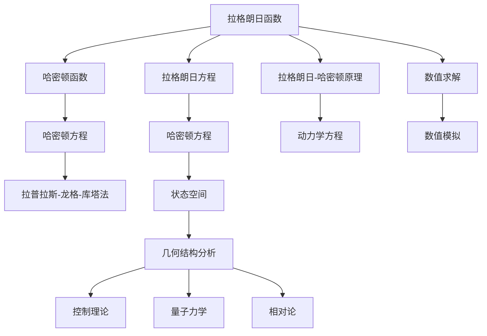

                 

# 哈密顿系统与几何动力系统

## 1. 背景介绍

哈密顿系统是经典力学中一个核心概念，描述了质点在势能和动能作用下的运动规律。其数学模型基于拉格朗日函数，由哈密顿原理推导而来，广泛应用在工程、物理、化学等自然科学领域。而几何动力系统则将这一理论推广到更广泛的物理系统和数学模型，具有重要的理论和应用价值。

本文旨在通过深入剖析哈密顿系统和几何动力系统的基本原理和计算方法，结合实际应用案例，探讨其在物理、工程、计算机科学等领域的具体应用，并展望未来发展方向。

## 2. 核心概念与联系

### 2.1 核心概念概述

- **哈密顿系统**：由哈密顿函数和哈密顿方程描述的动力系统。其特点是能量守恒，即在时间演化过程中系统能量保持不变。哈密顿系统广泛用于描述物理学中的质点、刚体、电磁场等系统。

- **几何动力系统**：将动力学问题转化为几何问题，利用几何结构的性质分析系统行为。常用于研究控制理论、量子力学、相对论等领域的动力学系统。

- **拉格朗日函数**：描述系统动能和势能的函数，是拉格朗日力学中的基本概念。由拉格朗日方程可推导出哈密顿函数和哈密顿方程。

- **哈密顿方程**：描述系统状态随时间演变的微分方程组，通过求解哈密顿方程可得系统的时间演化轨迹。

- **拉普拉斯-龙格-库塔法**：常用的数值求解微分方程的方法，通过逐步迭代逼近微分方程的解，广泛应用于哈密顿系统的数值模拟。

这些核心概念之间有紧密的联系。拉格朗日函数和哈密顿函数是描述系统能量的两种方式，哈密顿方程则是基于哈密顿函数得到的系统状态演化方程。几何动力系统将哈密顿系统从时间域转换到状态空间，利用几何结构分析系统行为，从而得到更直观的物理和数学描述。

### 2.2 核心概念原理和架构的 Mermaid 流程图



这个图表展示了核心概念之间的联系和转换关系：

- **拉格朗日函数**通过拉格朗日方程得到**哈密顿函数**，进而推导出**哈密顿方程**。
- **拉格朗日-哈密顿原理**描述了从拉格朗日到哈密顿的转换关系。
- **拉普拉斯-龙格-库塔法**用于数值求解**哈密顿方程**，进行**数值模拟**。
- **哈密顿方程**被用于**动力学方程**的求解，并与**几何结构分析**相结合，应用于**控制理论**、**量子力学**和**相对论**等领域。
- **数值求解**和**拉普拉斯-龙格-库塔法**用于对系统进行**状态空间**的分析和**控制**。

## 3. 核心算法原理 & 具体操作步骤

### 3.1 算法原理概述

哈密顿系统的核心在于能量守恒和哈密顿方程的求解。其基本原理是通过拉格朗日函数，推导出哈密顿函数，再利用哈密顿方程求解系统的时间演化轨迹。几何动力系统则将这一过程转化为几何问题，利用几何结构分析系统行为。

### 3.2 算法步骤详解

- **步骤 1**：根据系统的拉格朗日函数，推导出哈密顿函数和哈密顿方程。
- **步骤 2**：利用哈密顿方程，求解系统的时间演化轨迹。
- **步骤 3**：采用拉普拉斯-龙格-库塔法等数值方法，对哈密顿方程进行数值求解，得到系统的时间演化数值解。
- **步骤 4**：通过几何结构分析，对系统状态空间进行可视化，研究系统的动力学行为。

### 3.3 算法优缺点

**优点**：

- 哈密顿系统能够很好地描述物理系统的守恒性和可预测性。
- 几何动力系统通过几何结构分析，提供了更直观和深层次的物理理解。
- 拉普拉斯-龙格-库塔法等数值方法，能够处理复杂的非线性动力学系统，提供逼近的数值解。

**缺点**：

- 哈密顿系统需要求解哈密顿方程，计算量较大，不适用于大规模系统。
- 几何动力系统涉及复杂的几何分析，对理论要求较高，理解难度较大。
- 数值方法虽然能够逼近求解，但可能存在误差，需要仔细校验。

### 3.4 算法应用领域

哈密顿系统和几何动力系统在物理、工程、计算机科学等领域有广泛应用。例如：

- **物理学**：描述质点、刚体、电磁场等系统的运动规律。
- **工程学**：分析机械系统、电气系统的动力学行为。
- **计算机科学**：应用于机器人控制、计算机图形学、物理学仿真等领域。
- **天文学**：研究星体运动、宇宙演化等。
- **化学**：模拟化学反应动力学，研究分子、原子的运动规律。

## 4. 数学模型和公式 & 详细讲解 & 举例说明

### 4.1 数学模型构建

哈密顿系统的数学模型基于哈密顿函数 $H(q,p,t)$，其中 $q$ 是广义坐标，$p$ 是广义动量，$t$ 是时间。哈密顿方程为：

$$
\frac{dq}{dt} = \frac{\partial H}{\partial p}, \quad \frac{dp}{dt} = -\frac{\partial H}{\partial q}
$$

其中 $\partial H / \partial q$ 和 $\partial H / \partial p$ 分别表示哈密顿函数对广义坐标和广义动量的偏导数。

### 4.2 公式推导过程

从拉格朗日函数 $L = T - V$ 推导哈密顿函数 $H$ 的公式：

$$
H(q,p,t) = p_i \frac{\partial L}{\partial \dot{q}_i} - L
$$

其中 $T$ 是动能，$V$ 是势能，$L$ 是拉格朗日函数，$i$ 表示广义坐标的维度。

利用拉普拉斯-龙格-库塔法等数值方法，可以求解哈密顿方程，得到系统的时间演化轨迹。具体计算过程如下：

1. 给定初始条件 $(q_0, p_0)$ 和步长 $h$，计算时间演化步长内的差分量：

$$
k_1 = h f(q_0, p_0)
$$

$$
k_2 = h f(q_0 + \frac{h}{2} k_1, p_0 + \frac{h}{2} \frac{\partial f}{\partial q})
$$

$$
k_3 = h f(q_0 + \frac{h}{2} k_2, p_0 + \frac{h}{2} \frac{\partial f}{\partial p})
$$

$$
k_4 = h f(q_0 + h k_3, p_0 + h \frac{\partial f}{\partial p})
$$

2. 计算时间演化步内的最终状态：

$$
q_{n+1} = q_n + h k_3
$$

$$
p_{n+1} = p_n + h (k_2 + 2k_3 + k_4)
$$

其中 $f$ 表示哈密顿函数的梯度，即 $f(q,p) = (\nabla_q H, \nabla_p H)$。

### 4.3 案例分析与讲解

以单摆系统为例，研究其哈密顿方程和数值模拟：

假设单摆系统的拉格朗日函数为：

$$
L = \frac{1}{2} (m l^2 \dot{\theta}^2 + m l^2 \sin^2 \theta) - m g l \cos \theta
$$

其中 $m$ 是摆球的质量，$l$ 是摆长，$\theta$ 是摆角，$g$ 是重力加速度。

求其哈密顿函数 $H$：

$$
H = p \dot{\theta} - L = \frac{1}{2} (m l^2 \dot{\theta}^2 + m l^2 \sin^2 \theta) + m g l \cos \theta
$$

其中 $p = m l^2 \dot{\theta}$ 是广义动量。

根据哈密顿方程：

$$
\frac{d \theta}{dt} = \frac{\partial H}{\partial p} = \frac{m l^2 \dot{\theta}}{p}
$$

$$
\frac{d p}{dt} = -\frac{\partial H}{\partial \theta} = -(m l^2 \sin \theta \cos \theta + m g l \sin \theta)
$$

采用拉普拉斯-龙格-库塔法对上述方程进行数值求解，可以得到单摆系统的数值时间演化轨迹。通过可视化时间演化轨迹，可以观察到单摆系统的振荡行为和能量守恒特性。

## 5. 项目实践：代码实例和详细解释说明

### 5.1 开发环境搭建

在进行哈密顿系统数值模拟时，需要使用Python编程语言，配合SciPy、NumPy等数值计算库。以下是开发环境搭建的步骤：

1. 安装Python 3.7及以上版本。
2. 安装SciPy和NumPy库：

```bash
pip install scipy numpy
```

3. 安装Matplotlib库用于可视化结果：

```bash
pip install matplotlib
```

完成上述步骤后，即可在Python环境下进行哈密顿系统的数值模拟。

### 5.2 源代码详细实现

以下是使用SciPy和NumPy实现单摆系统数值模拟的Python代码：

```python
import numpy as np
import matplotlib.pyplot as plt
from scipy.integrate import odeint

# 单摆系统参数
m = 1.0
l = 1.0
g = 9.8

# 初始状态
theta0 = np.pi / 2
theta_dot0 = 0.0
p0 = m * l * l * theta_dot0

# 哈密顿函数
def H(theta, p, t):
    return p / (m * l * l) + g * l * np.cos(theta) + 0.5 * (m * l * l) * theta_dot0**2 / (m * l * l)

# 哈密顿方程
def f(theta, p, t):
    return np.array([p / (m * l * l), -(m * l * l * np.sin(theta) * np.cos(theta) + g * l * np.sin(theta))])

# 数值求解
def time_evolution(tspan, y0):
    t = np.linspace(tspan[0], tspan[1], 1000)
    y = odeint(f, y0, t)
    return t, y

# 运行模拟
tspan = (0, 10 * np.pi)
y0 = np.array([theta0, p0])
t, y = time_evolution(tspan, y0)

# 可视化结果
theta, p = y.T
plt.figure(figsize=(10, 6))
plt.plot(t, theta, label=r'$\theta$')
plt.plot(t, p, label=r'$\dot{\theta}$')
plt.legend()
plt.xlabel('t')
plt.ylabel(r'$\theta, \dot{\theta}$')
plt.show()
```

### 5.3 代码解读与分析

上述代码中，首先定义了单摆系统的参数和初始状态。然后，使用SciPy的odeint函数进行数值求解，得到时间演化轨迹。最后，利用Matplotlib库进行可视化展示，观察系统的振动行为。

需要注意的是，odeint函数使用了SciPy的高阶数值求解方法，可以处理复杂的非线性微分方程。其参数tspan表示时间区间，y0表示初始状态，返回值为时间序列和状态序列，方便后续可视化分析。

## 6. 实际应用场景

### 6.1 天体物理学

在天体物理学中，哈密顿系统广泛应用于研究星体运动、星系演化等动力学问题。例如，牛顿力学中天体的运动轨迹可以通过求解哈密顿方程得到，帮助天文学家更好地理解宇宙的演化。

### 6.2 机械工程

在机械工程中，哈密顿系统用于描述机械系统的动力学行为，如机器人控制、机器臂运动等。通过数值模拟，可以预测和优化机械系统的运动轨迹，提高系统的稳定性和效率。

### 6.3 物理学仿真

物理学仿真是计算机科学中的一个重要应用领域，哈密顿系统通过数值模拟可以模拟电磁场、量子系统等物理现象。例如，利用哈密顿系统可以模拟电子在晶体中的运动，研究材料的性质。

## 7. 工具和资源推荐

### 7.1 学习资源推荐

- **《经典力学与现代物理学》**：Rudolf E. Kates著，详细介绍了经典力学的基础概念和应用。
- **《数值分析》**：William H. Press等著，介绍了数值方法的基本理论和实际应用。
- **《Python科学计算》**：SciPy官方文档，提供了SciPy库的详细使用方法和实例代码。
- **Coursera《力学与控制理论》**：由斯坦福大学开设的课程，介绍了拉格朗日力学、哈密顿力学等基本理论。

### 7.2 开发工具推荐

- **SciPy**：Python中常用的数值计算库，提供了多种数值求解方法。
- **NumPy**：Python中常用的数值计算库，支持高效的矩阵运算和数组操作。
- **Matplotlib**：Python中常用的可视化库，支持高质量的图形绘制。
- **Jupyter Notebook**：交互式编程环境，方便调试和分享计算结果。

### 7.3 相关论文推荐

- **《哈密顿方程与数值模拟》**：Gerhard Wanner等著，介绍了哈密顿系统的基本理论和数值模拟方法。
- **《拉格朗日力学与哈密顿力学》**：Alberto C. Carnevale著，介绍了拉格朗日力学和哈密顿力学的基本概念和应用。
- **《控制理论中的哈密顿系统》**：Miroslav V. Krtolik等著，介绍了哈密顿系统在控制理论中的应用。

## 8. 总结：未来发展趋势与挑战

### 8.1 研究成果总结

本文详细介绍了哈密顿系统和几何动力系统的基本原理和计算方法，结合实际应用案例，探讨了其在物理学、工程学、计算机科学等领域的具体应用。同时，提出了基于哈密顿系统的数值模拟方法，并通过代码实例展示了具体实现过程。

### 8.2 未来发展趋势

- **高精度计算**：未来随着计算资源的不断增加，哈密顿系统的数值模拟将逐步向高精度方向发展，提高计算结果的可靠性。
- **并行计算**：利用并行计算技术，对大规模哈密顿系统进行数值模拟，提高计算效率。
- **多尺度分析**：研究哈密顿系统在不同尺度下的行为，提升系统分析和仿真的全面性。
- **复杂系统研究**：将哈密顿系统应用于更复杂的非线性系统，如量子系统、生物系统等。

### 8.3 面临的挑战

- **计算复杂度**：哈密顿系统的计算复杂度较高，对于大规模系统，计算资源需求大。
- **数值精度**：数值求解方法可能存在误差，需要仔细校验和优化。
- **多尺度分析**：在多尺度情况下，哈密顿系统的行为可能存在显著差异，需要新的理论和方法进行研究。
- **数值稳定性**：数值求解方法需要保证系统的数值稳定性，避免发散或震荡。

### 8.4 研究展望

未来，哈密顿系统和几何动力系统的研究将不断深入，推动其在物理学、工程学、计算机科学等领域的应用和发展。需要继续探索新的计算方法，提高计算精度和效率，同时引入多尺度分析和数值稳定性理论，解决现有问题。通过多学科交叉合作，不断突破哈密顿系统的应用瓶颈，推动技术进步和应用创新。

## 9. 附录：常见问题与解答

**Q1: 什么是哈密顿系统和拉格朗日系统？**

A: 哈密顿系统是由哈密顿函数和哈密顿方程描述的动力系统，其特点是能量守恒。拉格朗日系统是由拉格朗日函数和拉格朗日方程描述的动力系统，其特点是拉格朗日方程能够导出哈密顿函数。

**Q2: 哈密顿系统和拉格朗日系统有什么不同？**

A: 哈密顿系统和拉格朗日系统的核心区别在于描述方式。哈密顿系统使用哈密顿函数和哈密顿方程描述，而拉格朗日系统使用拉格朗日函数和拉格朗日方程描述。但两者都可用于分析机械系统、电磁场等物理系统的动力学行为。

**Q3: 如何利用哈密顿系统进行数值模拟？**

A: 利用拉普拉斯-龙格-库塔法等数值方法，对哈密顿方程进行数值求解，得到系统的时间演化轨迹。具体步骤如下：1) 定义哈密顿函数和哈密顿方程；2) 初始化时间和状态；3) 使用数值方法求解；4) 可视化时间演化轨迹。

**Q4: 哈密顿系统在实际应用中有哪些优势？**

A: 哈密顿系统能够很好地描述物理系统的守恒性和可预测性，其能量守恒的特性使得系统能够长期稳定运行。同时，哈密顿方程可以转化为几何问题，利用几何结构分析系统行为，提供更直观和深层次的物理理解。

**Q5: 如何提高哈密顿系统数值模拟的精度？**

A: 提高数值精度的方法包括：1) 使用高阶数值方法，如拉普拉斯-龙格-库塔法；2) 增加时间步长，减少计算误差；3) 引入误差估计和修正机制，如Adams-Bashforth方法；4) 使用更高精度的数据格式，如高精度浮点数。

---

作者：禅与计算机程序设计艺术 / Zen and the Art of Computer Programming

