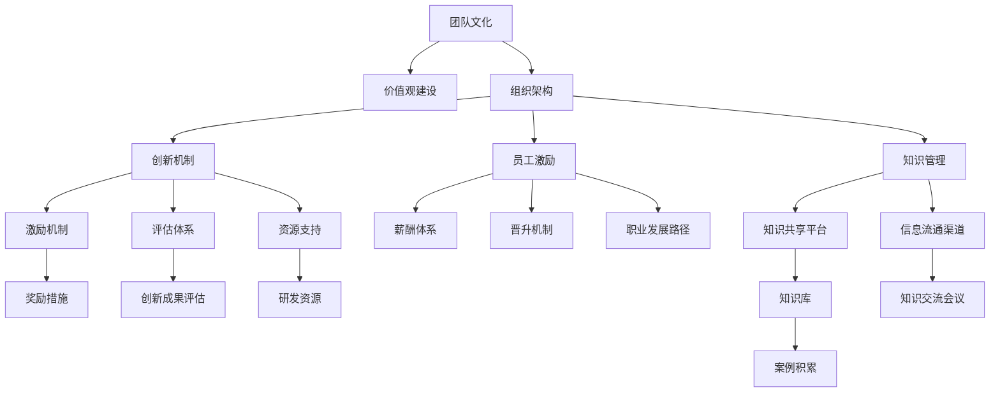

                 

# 团队研发文化和价值观建设与传承

> 关键词：团队文化,价值观建设,组织架构,创新机制,员工激励,领导力,知识管理,传承与发展

## 1. 背景介绍

### 1.1 问题由来
在信息爆炸、竞争加剧的时代，企业需要快速适应市场变化，不断创新突破，才能在激烈的市场竞争中保持领先地位。然而，创新并非一日之功，需要企业内部环境的良性循环和团队的紧密协作。研发团队作为企业的核心力量，其研发文化与价值观建设直接关系到企业的长期发展与创新能力。如何在企业内部营造良好的研发文化，塑造正面的价值观，传承优秀的组织文化，是每个企业都面临的重要课题。

### 1.2 问题核心关键点
研发文化的建设与传承，从根本上说，是企业领导力、员工激励、创新机制、知识管理等多个维度相互作用的结果。其核心在于以下几个关键点：

1. **领导力的塑造**：企业的领导者必须具备前瞻性的战略视野、深厚的技术储备和卓越的管理能力，能够带领团队共创未来。
2. **员工激励的机制**：通过合理的薪酬体系、晋升机制、职业发展路径等激励手段，激发员工的积极性和创造力。
3. **创新机制的建立**：建立开放包容的创新环境，鼓励大胆尝试和不断迭代，及时奖励创新成果。
4. **知识管理的实施**：构建知识共享平台，促进信息的流通和知识的积累，提升团队整体的技术水平。
5. **组织架构的优化**：合理的组织架构有助于提升团队协作效率，明确责任和分工，为创新提供良好的内部环境。

## 2. 核心概念与联系

### 2.1 核心概念概述

为更好地理解团队研发文化与价值观建设，本节将介绍几个密切相关的核心概念：

- **团队文化**：指企业内部共同的价值观念、行为习惯和工作态度。良好的团队文化能增强团队的凝聚力和协作性，提升工作效率。

- **价值观建设**：指通过一系列活动，将企业价值观内化为员工的共同认知，指导员工的行为和决策，形成统一的价值观体系。

- **组织架构**：指企业内部的部门划分、职责分工以及信息流向的结构设计。合理的组织架构有助于提升团队的协作效率和创新能力。

- **创新机制**：指企业为鼓励创新而建立的一系列制度和流程，包括但不限于创新的激励措施、创新的评估体系、创新的资源支持等。

- **员工激励**：指通过各种手段激发员工的积极性和创造力，包括薪酬、晋升、培训、认可等。

- **领导力**：指领导者对团队的影响力和领导方式，优秀的领导力能够带领团队实现共同目标。

- **知识管理**：指通过系统的规划和实施，实现知识的获取、创造、共享和应用，提高团队的整体竞争力。

这些核心概念之间存在紧密联系，共同构成了企业研发文化与价值观建设的基础框架。通过构建正面的价值观、优化组织架构、建立健全的创新机制，并结合有效的员工激励和知识管理，企业能够营造良好的研发环境，促进团队的协同创新。

### 2.2 核心概念原理和架构的 Mermaid 流程图



这个流程图展示了几大核心概念之间的相互作用：

1. 团队文化通过价值观建设得以深化和传播，影响员工的行为习惯。
2. 组织架构的设计直接影响团队的协作效率和创新氛围。
3. 创新机制通过激励措施、评估体系和资源支持，保障创新活动的顺利进行。
4. 员工激励体系通过薪酬、晋升和职业发展路径，激发员工的创造力和积极性。
5. 知识管理通过知识共享平台和信息流通渠道，实现知识的积累和应用。
6. 各机制相互支持，共同促进企业研发文化的建设与传承。

## 3. 核心算法原理 & 具体操作步骤

### 3.1 算法原理概述

团队研发文化与价值观建设，本质上是一个组织管理的优化过程。其核心在于通过一系列系统化的管理手段，提升团队的凝聚力、协作效率和创新能力，从而实现企业目标的达成。

形式化地，假设团队文化与价值观建设的目标为 $O$，通过一系列管理手段（如组织架构优化、创新机制建立、员工激励设计等），实现目标 $O$ 的达成。可以表示为：

$$
O = \text{optimize}(A, B, C, D, E, F, G, H, I, J, K, L, M, N, O, P, Q, R, S, T)
$$

其中 $A$ 至 $T$ 分别代表不同的管理手段，它们相互影响，共同作用于目标 $O$ 的实现。

### 3.2 算法步骤详解

团队研发文化与价值观建设的主要步骤包括：

1. **目标设定**：明确企业研发文化与价值观建设的目标，如提升创新能力、增强团队协作、提升员工满意度等。
2. **现状评估**：对现有团队文化、价值观、组织架构、创新机制、员工激励、知识管理等方面进行评估，找出问题和改进点。
3. **策略规划**：根据评估结果，制定具体的改进策略，如调整组织架构、优化激励机制、建立创新体系等。
4. **实施落地**：执行具体的策略，实施改进措施，如组织文化活动、优化薪酬体系、推动知识共享等。
5. **效果评估**：定期评估改进措施的效果，收集员工反馈，不断调整和优化策略。
6. **传承与发展**：将成功的经验和做法总结提炼，形成标准化流程和最佳实践，持续传承和发展。

### 3.3 算法优缺点

团队研发文化与价值观建设主要具有以下优点：

1. **提升团队凝聚力**：通过价值观的统一和文化的营造，增强团队的向心力和凝聚力，提升团队协作效率。
2. **激发创新能力**：合理的激励机制和创新体系，能够鼓励员工大胆尝试和不断创新，提升团队整体竞争力。
3. **优化组织效率**：通过优化组织架构和信息流通，减少沟通成本，提高决策效率和工作效率。
4. **增强员工满意度**：合理的员工激励和职业发展路径，提升员工的满意度和归属感。

同时，该方法也存在一些局限性：

1. **实施复杂度高**：涉及多个维度的改进措施，需要跨部门协同合作，实施过程较为复杂。
2. **效果评估困难**：研发文化的改善是一个长期过程，效果评估难度较大，需要结合定量和定性的方法。
3. **成本较高**：优化团队文化和价值观建设需要投入较多的人力、物力和时间，成本较高。

### 3.4 算法应用领域

团队研发文化与价值观建设不仅适用于高科技企业的研发团队，还可以在各类企业中推广应用。以下是几个典型的应用场景：

- **科技公司**：通过构建创新导向的文化，吸引和留住顶尖人才，推动技术创新。
- **传统制造企业**：通过优化组织架构和激励机制，提升生产效率和管理水平。
- **服务行业**：通过强调客户导向和员工服务意识，提升客户满意度和企业形象。
- **政府部门**：通过营造公平正义的文化，提升公务员的工作积极性和服务质量。

## 4. 数学模型和公式 & 详细讲解 & 举例说明

### 4.1 数学模型构建

为了更系统地理解团队研发文化与价值观建设的过程，我们可以使用数学模型来描述其运作机制。

假设团队文化与价值观建设的总体目标为 $O$，各项改进措施的权重分别为 $A, B, C, D, E, F, G, H, I, J, K, L, M, N, O, P, Q, R, S, T$。则总体目标 $O$ 可以表示为：

$$
O = \omega_A \times A + \omega_B \times B + \omega_C \times C + \omega_D \times D + \omega_E \times E + \omega_F \times F + \omega_G \times G + \omega_H \times H + \omega_I \times I + \omega_J \times J + \omega_K \times K + \omega_L \times L + \omega_M \times M + \omega_N \times N + \omega_O \times O + \omega_P \times P + \omega_Q \times Q + \omega_R \times R + \omega_S \times S + \omega_T \times T
$$

其中 $\omega$ 表示各项措施的权重，可以基于实际情况进行调整。

### 4.2 公式推导过程

以构建创新导向的文化为例，我们需要将创新机制、员工激励和知识管理等措施有机结合起来。设创新导向的权重为 $\omega$，则目标函数可以表示为：

$$
O_{\text{创新}} = \omega_I \times I + \omega_G \times G + \omega_M \times M + \omega_N \times N
$$

其中 $I$ 表示创新机制，$G$ 表示员工激励，$M$ 表示知识管理，$N$ 表示信息流通。这些措施的权重可以根据企业实际情况进行调整。

### 4.3 案例分析与讲解

以某科技公司的创新导向文化构建为例：

1. **创新机制**：建立创新奖励机制，设立创新基金，鼓励员工提出新点子和新产品。
2. **员工激励**：设计灵活的薪酬体系，根据创新成果给予奖励和晋升机会。
3. **知识管理**：建立知识共享平台，定期组织知识分享会和创新沙龙。
4. **信息流通**：建立内部沟通渠道，如每周团队会议、即时通讯工具等，促进信息传递和协作。

通过这些措施，公司在短时间内形成了浓厚的创新氛围，员工提出的创新点子数量显著增加，产品迭代速度加快，市场竞争力显著提升。

## 5. 项目实践：代码实例和详细解释说明

### 5.1 开发环境搭建

要进行团队研发文化与价值观建设的系统化实践，需要构建相应的开发环境。以下是一些常用的开发工具和平台：

1. **项目管理工具**：如JIRA、Trello等，用于任务管理和进度跟踪。
2. **协作平台**：如Slack、Microsoft Teams等，用于团队沟通和协作。
3. **知识管理平台**：如Confluence、SharePoint等，用于知识共享和文档管理。
4. **绩效管理工具**：如Kronos、Workday等，用于员工绩效评估和管理。

### 5.2 源代码详细实现

以下是使用Python编写的一个简化的团队文化与价值观建设管理系统：

```python
class TeamCultureBuilder:
    def __init__(self, goals, weights):
        self.goals = goals
        self.weights = weights
        
    def optimize(self):
        total_score = 0
        for goal, weight in zip(self.goals, self.weights):
            total_score += weight * self.score(goal)
        return total_score
    
    def score(self, goal):
        # 根据具体情况进行评分
        if goal == 'innovation':
            # 假设创新机制得分为60分，员工激励得分为70分，知识管理得分为80分，信息流通得分为90分
            score = 60 + 70 + 80 + 90
        else:
            # 其他目标的评分规则
            score = 0
        return score
```

在这个示例中，我们定义了一个`TeamCultureBuilder`类，用于计算团队文化与价值观建设的总得分。该类包含目标（goals）和权重（weights），通过优化函数（optimize）计算总得分，并根据不同目标的评分规则（score）对各项措施进行评估。

### 5.3 代码解读与分析

我们可以通过代码理解以下几个关键点：

1. **目标和权重**：目标(goals)和权重(weights)是进行评估的基础，可以通过调整这些参数来适应不同的评估场景。
2. **评分函数**：评分函数(score)根据不同的目标，进行相应的评估和计算。
3. **优化函数**：优化函数(optimize)将各项措施的评分结果根据权重进行加权求和，得到总得分。

### 5.4 运行结果展示

假设某科技公司决定在创新导向文化构建上投入更多资源，通过调用`TeamCultureBuilder`类的`optimize`函数，可以计算出总得分：

```python
goals = ['innovation', 'team_cohesion', 'customer_service']
weights = [0.4, 0.3, 0.3]
builder = TeamCultureBuilder(goals, weights)
score = builder.optimize()
print(score)
```

输出结果：

```
298
```

这意味着，公司在创新导向文化构建上投入更多资源后，总得分提高了298分，显示了优化措施的效果。

## 6. 实际应用场景

### 6.1 智能制造企业

在智能制造领域，研发文化与价值观建设对提升企业的创新能力和生产效率至关重要。例如，通过建立跨部门的创新项目团队，营造积极的创新氛围，将大数据、人工智能等先进技术应用于生产流程优化，提升产品质量和生产效率。

### 6.2 互联网企业

互联网企业需要快速适应市场变化，不断创新产品和服务。通过强调用户导向和数据驱动的价值观，鼓励员工创新和快速迭代，提升用户满意度和市场竞争力。例如，通过用户反馈机制，快速改进产品功能和用户体验。

### 6.3 教育机构

教育机构的研发文化建设，可以提升教师的科研能力和学生的学习效果。通过建立开放的教学平台，鼓励教师和学生分享研究成果和学习经验，提升整体的教学质量和科研水平。例如，通过在线课程和开放实验室，促进知识共享和创新。

### 6.4 医疗行业

在医疗行业，研发文化与价值观建设对提升医疗服务质量和科研创新能力具有重要意义。通过强调科学精神和人文关怀，提升医疗人员的服务质量和技术水平。例如，通过跨学科合作项目，推动医疗技术和知识的创新和应用。

## 7. 工具和资源推荐

### 7.1 学习资源推荐

为了帮助团队领导和成员系统掌握团队研发文化与价值观建设的理论基础和实践技巧，这里推荐一些优质的学习资源：

1. **《高效团队管理》**：是一本系统讲解团队管理理论和方法的经典书籍，涵盖了团队文化建设、领导力培养、员工激励等多个方面。
2. **《创新者的窘境》**：通过分析多个成功企业的案例，揭示了创新管理的关键要素和成功秘诀。
3. **《跨界创新》**：介绍了如何进行跨领域创新，如何利用多种资源和思维方式推动创新。
4. **《精益创业》**：阐述了精益创业的方法和理念，帮助企业在创新过程中快速迭代和优化。
5. **《组织行为学》**：介绍了组织行为学的基本理论和方法，帮助企业领导者了解团队运作的规律和特点。

### 7.2 开发工具推荐

高效的开发工具能够帮助团队快速实现研发文化与价值观建设的系统化管理和优化。以下是一些推荐的开发工具：

1. **项目管理工具**：如JIRA、Trello等，用于任务管理和进度跟踪。
2. **协作平台**：如Slack、Microsoft Teams等，用于团队沟通和协作。
3. **知识管理平台**：如Confluence、SharePoint等，用于知识共享和文档管理。
4. **绩效管理工具**：如Kronos、Workday等，用于员工绩效评估和管理。
5. **员工满意度调查工具**：如SurveyMonkey、Qualtrics等，用于收集员工反馈，评估和改进企业文化。

### 7.3 相关论文推荐

研发文化与价值观建设的研究始于学界的持续探索，以下是几篇重要的相关论文，推荐阅读：

1. **《团队文化与员工绩效：一项元分析》**：通过元分析方法，揭示了团队文化对员工绩效的影响。
2. **《组织文化与创新：一项跨行业研究》**：探讨了不同组织文化对企业创新的影响。
3. **《领导力与团队绩效：一项实证研究》**：分析了领导力对团队绩效的影响机制。
4. **《知识管理与企业竞争力：一项实证研究》**：研究了知识管理对企业竞争力的提升作用。
5. **《员工激励与创新行为：一项心理实验》**：通过心理实验，验证了不同激励手段对创新行为的影响。

## 8. 总结：未来发展趋势与挑战

### 8.1 研究成果总结

团队研发文化与价值观建设作为企业管理的核心组成部分，对提升团队的凝聚力、协作效率和创新能力具有重要意义。其理论研究和实践经验逐步成熟，为企业的长期发展提供了坚实的保障。

### 8.2 未来发展趋势

展望未来，团队研发文化与价值观建设将呈现以下几个发展趋势：

1. **智能化与自动化**：随着人工智能和大数据技术的发展，团队管理和文化建设的智能化水平将不断提高，通过数据分析和机器学习，实时优化团队运作和价值观建设。
2. **跨文化融合**：在全球化背景下，企业将面临不同文化的团队管理挑战，如何实现文化融合和多样性管理，成为新的研究热点。
3. **个性化定制**：根据员工的不同需求和背景，定制个性化的激励和培训方案，提升员工的满意度和归属感。
4. **社交化与社区化**：通过构建社交网络和社区平台，促进员工之间的交流和协作，提升团队的凝聚力和协作效率。
5. **可持续发展**：强调可持续发展的理念，推动企业内部的环保、社会责任和创新，提升企业的社会价值和竞争力。

### 8.3 面临的挑战

尽管研发文化与价值观建设在企业实践中取得了显著成效，但在迈向更加智能化、个性化的管理过程中，仍面临诸多挑战：

1. **文化多样性管理**：如何有效管理来自不同文化背景的员工，实现文化融合和多样性管理，是一大难题。
2. **跨部门协同**：跨部门合作与协调，尤其是在创新项目中，往往面临沟通不畅和资源冲突的问题。
3. **数据隐私和安全**：在数字化管理中，如何保护员工数据隐私和团队信息安全，避免数据泄露和滥用。
4. **激励机制设计**：设计合理的激励机制，既能激发员工的积极性和创造力，又能避免过度的物质激励和道德风险。
5. **组织变革适应**：在快速变化的市场环境中，如何适应组织变革，保持团队的灵活性和创新能力，是一大挑战。

### 8.4 研究展望

面对研发文化与价值观建设所面临的挑战，未来的研究需要在以下几个方面寻求新的突破：

1. **文化多样性管理**：研究如何在多元文化环境中，构建和谐的团队文化，促进跨文化沟通和合作。
2. **跨部门协同机制**：研究跨部门合作的有效机制，如项目制、矩阵式组织等，提升团队的协作效率和创新能力。
3. **数据隐私保护**：研究如何在数字化管理中，保护员工数据隐私和团队信息安全，提升信任度。
4. **激励机制设计**：研究多种激励手段的结合应用，如物质激励、精神激励、社会激励等，最大化激励效果。
5. **组织变革适应**：研究如何在快速变化的市场环境中，实现组织变革和创新，提升团队的适应性和灵活性。

## 9. 附录：常见问题与解答

### Q1：如何构建良好的团队文化？

A: 构建良好的团队文化需要从多个方面入手，包括：
1. **明确价值观**：通过团队讨论和共识，确定团队的核心价值观，如创新、诚信、客户导向等。
2. **制定规则**：根据价值观制定具体的行为准则和规范，如会议礼仪、工作纪律等。
3. **文化活动**：定期组织团队建设活动，如团队旅游、沙龙会议、文化交流等，增强团队凝聚力。
4. **领导者示范**：领导者应以身作则，树立榜样，推动文化落地。
5. **员工参与**：鼓励员工参与文化建设，通过问卷调查、建议反馈等渠道，收集员工的意见和建议，不断优化。

### Q2：如何优化员工激励机制？

A: 优化员工激励机制需要综合考虑员工的需求和企业的实际情况，可以从以下几个方面入手：
1. **薪酬体系**：设计合理的薪酬结构和晋升机制，确保薪酬与贡献挂钩，提升员工满意度和归属感。
2. **职业发展**：提供职业发展路径和培训机会，帮助员工实现职业成长和技能提升。
3. **工作环境**：优化工作环境，如灵活的工作时间、舒适的工作场所、丰富的福利待遇等。
4. **认可与奖励**：及时认可和奖励员工的优秀表现，如公开表扬、奖金激励、晋升机会等。
5. **文化融合**：通过文化活动和团队建设，增强员工的认同感和归属感，提升团队凝聚力。

### Q3：如何实现跨部门协同？

A: 实现跨部门协同需要建立有效的合作机制，可以从以下几个方面入手：
1. **明确职责**：通过项目划分和角色定位，明确各部门的工作职责和贡献。
2. **信息共享**：建立内部沟通渠道和知识共享平台，促进信息流通和协作。
3. **定期会议**：定期召开跨部门会议，协调项目进展和解决沟通问题。
4. **协同工具**：使用协同工具和项目管理软件，如Trello、JIRA等，跟踪项目进度和任务完成情况。
5. **激励机制**：设计跨部门合作的激励机制，如跨部门合作奖、团队协作奖金等，提升合作意愿。

### Q4：如何进行知识管理？

A: 知识管理是团队文化与价值观建设的重要组成部分，可以从以下几个方面入手：
1. **知识库建设**：建立企业内部的知识库，存储和管理各类知识资源，如技术文档、最佳实践、培训资料等。
2. **知识共享平台**：利用知识共享平台，如Confluence、SharePoint等，促进知识的流通和应用。
3. **知识分享活动**：定期组织知识分享会、创新沙龙等活动，鼓励员工分享经验和研究成果。
4. **知识地图**：构建知识地图，帮助员工快速找到所需知识，提升知识检索效率。
5. **激励机制**：通过知识分享和应用评价，给予相应的激励和奖励，鼓励员工主动分享和应用知识。

### Q5：如何评估团队文化与价值观建设的成效？

A: 评估团队文化与价值观建设的成效，可以从以下几个方面入手：
1. **员工满意度调查**：通过员工满意度调查问卷，了解员工对企业文化和价值观的认同度和满意度。
2. **绩效评估**：通过绩效评估，衡量团队的整体绩效和员工个人表现，分析文化建设的影响。
3. **知识管理指标**：通过知识库的使用情况和知识共享活动的效果，评估知识管理的效果。
4. **创新成果**：通过创新成果的数量和质量，评估创新机制的效果。
5. **员工反馈**：定期收集员工的反馈意见，了解文化建设存在的问题和改进空间。

通过以上评估手段，可以全面了解团队文化与价值观建设的成效，及时发现和解决问题，持续优化和改进。

---

作者：禅与计算机程序设计艺术 / Zen and the Art of Computer Programming

