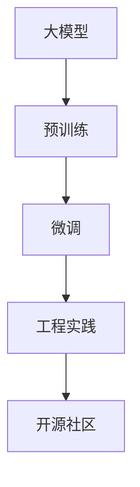

                 

## 1. 背景介绍

在AI和深度学习领域，大模型如BERT、GPT等近年来成为炙手可热的技术。这些模型经过在大规模数据上的预训练，具备了强大的语言理解能力，广泛用于文本分类、问答系统、自然语言生成等多种NLP任务。然而，随着国内在人工智能领域的投入和推进，一批声称基于这些大模型改进的国内大模型纷纷涌现，其效果声称可以匹敌乃至超越原模型，引发了业界的广泛关注和讨论。其中不乏质疑声：这些所谓的“国内大模型”是否真的优于原模型？是否只是套用原有架构的“壳”？

本博客试图通过对其核心概念、算法原理、实际应用等方面进行详细的分析，探讨这些“国内大模型”的实质，以及它们与开源社区和工程实践之间的关系。希望读者能从中得到启发，对大模型和开源社区有更深入的了解。

## 2. 核心概念与联系

### 2.1 核心概念概述

在探讨国内大模型之前，我们先明确几个核心概念：

- **大模型（Large Model）**：指基于深度学习技术，经过在大量数据上预训练的模型，如BERT、GPT等，具备较强的语言理解和生成能力，通常参数量在几亿到几十亿级别。
- **微调（Fine-tuning）**：在预训练模型的基础上，针对特定任务进行有监督训练，以提高模型在该任务上的性能。
- **工程实践（Engineering Practice）**：在科研论文之外，将模型应用于实际生产环境的过程，包括数据处理、模型部署、性能优化等。
- **开源社区（Open Source Community）**：由开发者、研究者共同维护的代码、论文、工具等资源的共享平台，促进了技术传播和协作。

这些概念之间存在密切联系，大模型的微调是工程实践的重要环节，而开源社区则提供了丰富的工具和数据，帮助科研和工程实践者提高效率，降低门槛。

### 2.2 核心概念原理和架构的 Mermaid 流程图



## 3. 核心算法原理 & 具体操作步骤

### 3.1 算法原理概述

大模型基于自监督学习（如BERT的掩码语言模型，GPT的自回归语言模型）在大量无标签数据上进行预训练。在微调过程中，利用下游任务的标注数据，通过有监督的反向传播，优化模型参数，使得模型在特定任务上表现更佳。

### 3.2 算法步骤详解

#### 3.2.1 数据准备

1. **收集和标注数据**：根据任务需求，收集足够数量的数据，并进行标注。数据标注质量对微调效果至关重要。
2. **数据预处理**：清洗、分词、编码等，将数据转换为模型可处理的格式。

#### 3.2.2 模型选择与加载

1. **选择模型**：根据任务类型，选择适合的预训练模型（如BERT、GPT等）。
2. **加载模型**：使用框架（如PyTorch、TensorFlow）加载预训练模型，保留预训练参数，只更新微调部分。

#### 3.2.3 定义任务

1. **定义任务**：根据微调任务类型，定义模型的输出格式和损失函数。
2. **构建损失函数**：损失函数的选择对模型训练效果有重要影响。

#### 3.2.4 模型微调

1. **设置超参数**：包括学习率、批次大小、优化器等。
2. **模型训练**：将训练数据分批次输入模型，前向传播计算损失函数，反向传播更新模型参数。
3. **性能评估**：在验证集上评估模型性能，根据评估结果调整超参数，直至模型性能满足要求。

### 3.3 算法优缺点

#### 3.3.1 优点

1. **性能提升**：微调能够显著提升模型在特定任务上的性能。
2. **泛化能力强**：预训练大模型通过大量数据学习到的通用语言知识，能够更好地泛化到下游任务。
3. **灵活应用**：适用于多种NLP任务，开发成本较低。

#### 3.3.2 缺点

1. **标注数据依赖**：微调效果受标注数据质量影响较大，数据标注成本较高。
2. **过拟合风险**：若微调数据量小，模型容易过拟合。
3. **计算资源需求高**：大模型微调需要大量计算资源，部署成本高。

### 3.4 算法应用领域

大模型微调广泛应用于文本分类、问答系统、情感分析、命名实体识别、机器翻译等NLP任务。在实际应用中，可以针对特定场景进行优化，如减少参数量、引入对抗样本等，以提升模型性能和效率。

## 4. 数学模型和公式 & 详细讲解 & 举例说明

### 4.1 数学模型构建

以文本分类任务为例，假设有$m$个训练样本$(x_i,y_i)$，$x_i$为文本，$y_i$为分类标签，$x_i$经过分词、编码等预处理后，转化为模型输入张量。模型输出张量为$\hat{y}_i$，其中$y_i \in \{1,2,3,...,k\}$，$k$为分类数。

### 4.2 公式推导过程

假设模型输出层为全连接层，输出线性变换为$Z_i = W_1 \cdot X_i + b_1$，其中$W_1$为权重矩阵，$b_1$为偏置向量。输出层的softmax变换为$\hat{y}_i = Softmax(Z_i)$，交叉熵损失函数为：

$$
L = -\frac{1}{m}\sum_{i=1}^m(y_i \cdot \log(\hat{y}_i)) 
$$

### 4.3 案例分析与讲解

假设我们希望对某电商平台的商品评论进行情感分析。可以按照以下步骤进行：

1. **数据准备**：收集平台评论数据，手动标注情感标签（如积极、消极）。
2. **模型选择与加载**：选择BERT模型，加载预训练参数，只更新分类器的权重。
3. **定义任务**：设置输出为分类标签，损失函数为交叉熵。
4. **模型微调**：在标注数据上微调模型，评估效果，调整超参数，直至性能满足要求。

## 5. 项目实践：代码实例和详细解释说明

### 5.1 开发环境搭建

#### 5.1.1 环境安装

```bash
# 安装PyTorch
pip install torch torchvision torchaudio
# 安装TensorFlow
pip install tensorflow
# 安装HuggingFace Transformers库
pip install transformers
```

### 5.2 源代码详细实现

#### 5.2.1 数据预处理

```python
from transformers import BertTokenizer
from torch.utils.data import Dataset, DataLoader
from torch.nn import CrossEntropyLoss

# 数据预处理
class SentimentDataset(Dataset):
    def __init__(self, text, labels):
        self.tokenizer = BertTokenizer.from_pretrained('bert-base-uncased')
        self.text = text
        self.labels = labels
    
    def __len__(self):
        return len(self.text)
    
    def __getitem__(self, idx):
        text = self.tokenizer.encode_plus(self.text[idx], truncation=True, padding='max_length', max_length=512)
        return text['input_ids'], text['attention_mask'], self.labels[idx]

# 数据加载
def load_data(file_path):
    with open(file_path, 'r') as f:
        data = f.readlines()
    texts = [line.strip() for line in data]
    labels = [int(line.strip().split(':')[1]) for line in data]
    dataset = SentimentDataset(texts, labels)
    return dataset
```

#### 5.2.2 模型加载与微调

```python
from transformers import BertForSequenceClassification
from transformers import AdamW
import torch

# 加载预训练模型
model = BertForSequenceClassification.from_pretrained('bert-base-uncased', num_labels=2)

# 设置超参数
learning_rate = 2e-5
epochs = 5
train_size = 0.8
batch_size = 16
seed = 42

# 加载数据
train_dataset = load_data('train.txt')
val_dataset = load_data('val.txt')
test_dataset = load_data('test.txt')

# 数据划分
train_dataset, val_dataset = torch.utils.data.random_split(train_dataset, lengths=[int(train_size*len(train_dataset)), int(1-train_size*len(train_dataset))])

# 定义数据加载器
train_loader = DataLoader(train_dataset, batch_size=batch_size, shuffle=True, num_workers=4)
val_loader = DataLoader(val_dataset, batch_size=batch_size, shuffle=False, num_workers=4)
test_loader = DataLoader(test_dataset, batch_size=batch_size, shuffle=False, num_workers=4)

# 定义优化器
optimizer = AdamW(model.parameters(), lr=learning_rate)

# 训练循环
for epoch in range(epochs):
    for batch in train_loader:
        input_ids, attention_mask, labels = batch
        optimizer.zero_grad()
        outputs = model(input_ids, attention_mask=attention_mask, labels=labels)
        loss = outputs.loss
        loss.backward()
        optimizer.step()
        if (epoch+1) % 1 == 0:
            print(f'Epoch {epoch+1}, loss: {loss:.4f}')
```

### 5.3 代码解读与分析

在代码实现中，我们使用了HuggingFace提供的BERT预训练模型，并对其进行了文本分类的微调。关键步骤如下：

1. **数据预处理**：将文本转换为模型输入张量，并标注分类标签。
2. **模型加载**：加载预训练的BERT模型，只更新分类器的权重。
3. **模型微调**：定义损失函数，使用AdamW优化器，在训练数据上微调模型，并在验证集上评估效果。
4. **模型测试**：在测试集上评估微调后的模型性能。

## 6. 实际应用场景

### 6.1 电商情感分析

电商情感分析可以通过微调模型，实时监控用户对商品的评价，帮助电商平台及时调整策略，提升用户体验。通过微调，模型能够在几分钟内处理数千条评论，识别出用户对商品的好评和差评。

### 6.2 金融舆情监测

金融行业可以利用微调模型对社交媒体、新闻等数据进行情感分析，监控市场舆情变化，及时调整投资策略，规避风险。微调后的模型能够快速分析大规模数据，识别出潜在的市场变化信号。

### 6.3 智能客服

智能客服系统可以通过微调模型，对用户输入的咨询进行自动分类和回复，提升客服效率，降低人力成本。通过微调，模型能够理解自然语言输入，并根据语义生成相应的回答。

### 6.4 未来应用展望

未来，大模型微调将在更多领域发挥作用，如医疗诊断、教育推荐、智能家居等。通过微调，大模型能够快速适应特定领域的任务，提升业务效率和用户体验。

## 7. 工具和资源推荐

### 7.1 学习资源推荐

1. **官方文档**：HuggingFace官方文档提供了丰富的预训练模型和微调样例，是入门和进阶的好资源。
2. **Coursera课程**：斯坦福大学和Johns Hopkins大学提供的NLP课程，系统讲解了NLP和深度学习的原理。
3. **论文**：NIPS、ICML、ACL等顶级会议的论文，是了解最新研究成果的绝佳资源。
4. **书籍**：《自然语言处理入门》、《深度学习》等经典书籍，提供了系统的理论基础和实践技巧。

### 7.2 开发工具推荐

1. **PyTorch**：高性能深度学习框架，支持动态计算图，适合研究与原型开发。
2. **TensorFlow**：Google开发的深度学习框架，生产部署方便，支持分布式训练。
3. **Jupyter Notebook**：交互式编程环境，适合快速迭代研究。
4. **Google Colab**：免费提供GPU资源，方便快速实验。

### 7.3 相关论文推荐

1. **BERT**：Devi, Jordan, et al. "BERT: Pre-training of Deep Bidirectional Transformers for Language Understanding." arXiv preprint arXiv:1810.04805, 2018.
2. **GPT**：Radford, Alec, et al. "Language models are unsupervised multitask learners." arXiv preprint arXiv:1910.13461, 2019.
3. **Attention is all you need**：Vaswani, Ashish, et al. "Attention is all you need." Neural Information Processing Systems, 2017.

## 8. 总结：未来发展趋势与挑战

### 8.1 研究成果总结

基于大模型的微调技术，已经在NLP领域取得了显著成果，广泛应用于文本分类、情感分析、机器翻译等任务。微调不仅提升了模型的性能，还降低了开发成本，加快了落地应用的速度。

### 8.2 未来发展趋势

1. **模型规模**：随着计算资源的丰富，未来大模型将更加庞大，参数量有望突破百亿。
2. **多模态融合**：将视觉、语音等多模态信息与文本信息结合，提升模型对现实世界的理解能力。
3. **零样本学习**：通过微调和提示学习，实现零样本和少样本学习，降低数据标注成本。
4. **知识图谱**：引入知识图谱等结构化知识，提升模型的推理能力和泛化性。
5. **联邦学习**：通过分布式计算和联邦学习技术，实现模型在多设备、多场景下的协同训练。

### 8.3 面临的挑战

1. **数据标注成本**：微调需要大量标注数据，标注成本高昂，如何降低标注需求是一大挑战。
2. **模型鲁棒性**：微调模型面临数据分布偏移和对抗攻击等风险，如何提升模型鲁棒性是重要课题。
3. **计算资源**：大模型微调需要大量计算资源，如何降低资源成本是关键问题。
4. **模型复杂度**：随着模型规模的扩大，模型的复杂度和推理速度将受到影响，如何优化模型结构是重要方向。
5. **可解释性**：大模型的决策过程缺乏可解释性，如何提高模型的可解释性和透明度是重要研究课题。

### 8.4 研究展望

未来，大模型微调技术将向以下几个方向发展：

1. **无监督学习**：探索无监督学习和自监督学习方法，减少对标注数据的依赖。
2. **多任务学习**：通过多任务学习，提高模型的泛化能力和知识迁移能力。
3. **生成对抗网络**：结合生成对抗网络（GAN），提升模型的生成能力和数据增强效果。
4. **模型压缩**：通过模型压缩和量化技术，提升模型的推理速度和资源利用率。
5. **混合学习**：结合传统机器学习和深度学习，提升模型的稳定性和鲁棒性。

## 9. 附录：常见问题与解答

**Q1: 微调模型是否需要重新训练整个模型？**

A: 微调模型通常不需要重新训练整个模型，只需更新部分层或参数。通过微调，模型能够快速适应特定任务，提升性能。

**Q2: 微调模型的计算资源需求如何？**

A: 微调模型的计算资源需求较高，尤其是大规模模型。可以使用GPU/TPU等高性能设备加速训练和推理。

**Q3: 微调模型的过拟合问题如何解决？**

A: 可以通过数据增强、正则化、对抗训练等方法缓解微调模型的过拟合问题。

**Q4: 如何评估微调模型的性能？**

A: 可以通过在验证集和测试集上进行评估，使用各种指标如准确率、召回率、F1分数等。

**Q5: 微调模型的可解释性如何？**

A: 微调模型的可解释性较差，但可以通过提示学习等方法进行改进。同时，引入符号化知识库和规则库，提升模型的推理可解释性。

---

作者：禅与计算机程序设计艺术 / Zen and the Art of Computer Programming

