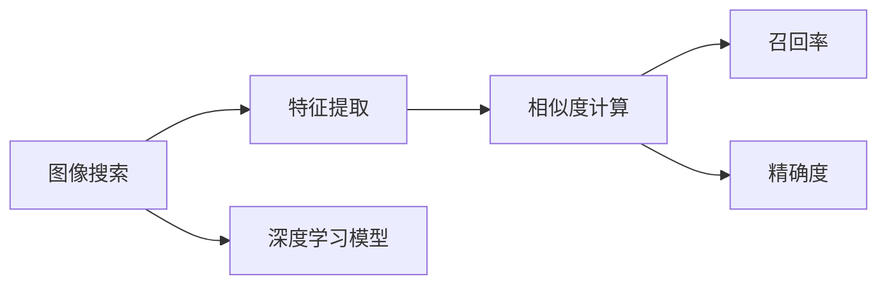

                 

## 1. 背景介绍

随着电商平台的快速发展，消费者对购物体验的期望越来越高。图像搜索技术作为提升电商用户购物体验的重要手段之一，其应用已经从搜索引擎逐步扩展到电商平台。用户可以通过上传商品图片，快速搜索到同类型商品，找到符合自己需求的产品。

### 1.1 问题由来

在电商领域，图像搜索技术最早的应用是品牌产品的搜索。用户上传品牌产品的图片，电商平台可以匹配到品牌官网和其他电商平台的同类商品。但随着电商平台的丰富和商品种类的增多，图像搜索技术开始向更广泛的应用场景扩展，如普通商品、二手商品等。

### 1.2 问题核心关键点

电商图像搜索技术的主要目标包括：

1. **提高搜索效率**：通过图像搜索技术，用户可以直观地找到相似的商品，提高搜索效率。
2. **增强购物体验**：图像搜索技术能够帮助用户更快速地找到所需商品，提升购物体验。
3. **提升销售转化率**：用户通过图像搜索发现的新商品，能够增加用户购买的可能性，提高销售转化率。
4. **强化用户粘性**：用户通过使用图像搜索功能，对电商平台产生更强的依赖性，提高用户留存率。

### 1.3 问题研究意义

图像搜索技术在电商领域的应用，有助于提升平台的搜索效率和用户体验，促进销售转化，增强用户粘性。同时，该技术还能帮助电商平台精准获取用户需求，提升精准营销的能力。

## 2. 核心概念与联系

### 2.1 核心概念概述

在电商领域，图像搜索技术涉及的关键概念包括：

- **图像搜索**：通过用户上传的商品图片，在电商平台中进行匹配和搜索，找到相似的商品。
- **特征提取**：将商品图片转化为高维特征向量，方便在特征空间中进行匹配。
- **相似度计算**：计算用户上传的商品图片与数据库中已有商品的相似度，从而进行匹配。
- **召回率（Recall）和精确度（Precision）**：衡量图像搜索技术效果的两个主要指标。
- **深度学习模型**：如卷积神经网络（CNN），在特征提取和相似度计算中发挥重要作用。

这些概念之间的逻辑关系可以通过以下Mermaid流程图来展示：



这个流程图展示了这个过程的核心步骤，即用户上传商品图片后，首先通过特征提取转化为特征向量，然后计算相似度，最后根据召回率和精确度对搜索结果进行排序和展示。

## 3. 核心算法原理 & 具体操作步骤

### 3.1 算法原理概述

电商图像搜索技术的主要算法原理包括以下几个关键步骤：

1. **图像预处理**：包括调整图片大小、归一化、去噪等，使图像在模型中更好地表现。
2. **特征提取**：使用深度学习模型（如卷积神经网络）提取图像特征向量。
3. **相似度计算**：在特征空间中计算用户上传图片与数据库中已有图片的相似度。
4. **搜索结果排序**：根据召回率和精确度对搜索结果进行排序。
5. **展示搜索结果**：将排序后的结果展示给用户。

### 3.2 算法步骤详解

#### 3.2.1 图像预处理

图像预处理主要包括以下几个步骤：

1. **调整图片大小**：将上传的图片调整为固定大小，方便后续处理。
2. **归一化**：将图片像素值进行归一化，使其在[0, 1]或[-1, 1]之间。
3. **去噪**：去除图片中的噪声，如椒盐噪声、高斯噪声等。

这些预处理步骤可以使用OpenCV、PIL等库来实现。

#### 3.2.2 特征提取

特征提取是图像搜索技术的核心步骤。常用的特征提取方法包括：

1. **SIFT**：尺度不变特征变换，能够提取出图像中的局部特征。
2. **SURF**：加速稳健特征，是一种快速而稳健的特征提取方法。
3. **HOG**：方向梯度直方图，能够提取出图像的纹理信息。
4. **CNN**：卷积神经网络，是当前最先进的特征提取方法，能够提取出图像的深度特征。

#### 3.2.3 相似度计算

在特征提取后，需要计算用户上传图片与数据库中已有图片的相似度。常用的相似度计算方法包括：

1. **欧式距离**：计算两个特征向量在欧式空间中的距离。
2. **余弦相似度**：计算两个特征向量在余弦空间中的夹角余弦值。
3. **Jaccard相似度**：计算两个特征向量在特征空间中的交集与并集的比值。

这些相似度计算方法可以用于任何特征提取方法，但在使用深度学习模型提取特征时，通常使用余弦相似度。

#### 3.2.4 搜索结果排序

搜索结果排序是图像搜索技术的最后一步。排序方法通常包括：

1. **基于召回率的排序**：即根据召回率对结果排序。
2. **基于精确度的排序**：即根据精确度对结果排序。
3. **综合排序**：综合考虑召回率和精确度对结果排序。

#### 3.2.5 展示搜索结果

展示搜索结果通常包括：

1. **图片展示**：展示搜索结果中的图片。
2. **信息展示**：展示商品的名称、价格、评分等信息。
3. **购买链接**：提供商品购买链接。

这些展示步骤可以使用HTML、CSS、JavaScript等技术来实现。

### 3.3 算法优缺点

电商图像搜索技术的主要优点包括：

1. **提高搜索效率**：通过图像搜索技术，用户可以快速找到相似的商品，提高搜索效率。
2. **增强购物体验**：图像搜索技术能够帮助用户更快速地找到所需商品，提升购物体验。
3. **提升销售转化率**：用户通过图像搜索发现的新商品，能够增加用户购买的可能性，提高销售转化率。
4. **强化用户粘性**：用户通过使用图像搜索功能，对电商平台产生更强的依赖性，提高用户留存率。

缺点包括：

1. **对图像质量要求高**：上传的图像质量越高，特征提取效果越好，但这也增加了用户的操作难度。
2. **处理量大**：当电商平台商品种类繁多时，需要处理的图像数据量巨大，对计算资源要求较高。
3. **相似度计算复杂**：相似度计算是一个复杂的过程，需要大量的计算资源和时间。
4. **可能出现误匹配**：当两个不同商品的图片相似度很高时，可能出现误匹配的问题。

### 3.4 算法应用领域

电商图像搜索技术主要应用于以下几个领域：

1. **品牌商品搜索**：用户上传品牌商品图片，电商平台匹配到品牌官网和其他电商平台的同类商品。
2. **普通商品搜索**：用户上传普通商品图片，电商平台匹配到其他商品。
3. **二手商品搜索**：用户上传二手商品图片，电商平台匹配到其他二手商品。
4. **个性化推荐**：根据用户上传的图片，电商平台推荐相似的商品。
5. **商品分类**：电商平台使用图像搜索技术对商品进行分类，提高分类准确率。

## 4. 数学模型和公式 & 详细讲解 & 举例说明

### 4.1 数学模型构建

在电商图像搜索技术中，数学模型的构建主要包括特征提取和相似度计算。

#### 4.1.1 特征提取

特征提取的数学模型可以使用卷积神经网络（CNN）来实现。CNN的基本结构如图：

$$
y = W_1 \sigma(W_0 x) + b_1
$$

其中，$x$为输入的图像数据，$W_0$和$b_0$为卷积层的权重和偏置，$\sigma$为激活函数，$W_1$和$b_1$为全连接层的权重和偏置。

#### 4.1.2 相似度计算

相似度计算的数学模型可以使用余弦相似度来实现。余弦相似度的计算公式如下：

$$
\cos \theta = \frac{x \cdot y}{||x|| \cdot ||y||}
$$

其中，$x$和$y$为两个特征向量，$||x||$和$||y||$为特征向量的模长，$\theta$为两个特征向量之间的夹角。

### 4.2 公式推导过程

#### 4.2.1 特征提取

假设输入的图像数据为$x$，卷积神经网络提取特征的过程如下：

1. **卷积层**：将输入数据$x$通过卷积核$W_0$进行卷积运算，得到中间结果$y$。

$$
y = W_0 * x
$$

2. **激活函数**：将中间结果$y$通过激活函数$\sigma$进行激活。

$$
y = \sigma(W_0 * x)
$$

3. **池化层**：将激活后的结果进行池化操作，缩小特征图大小。

$$
y = P(y)
$$

4. **全连接层**：将池化后的特征图$y$通过全连接层得到最终特征向量$z$。

$$
z = W_1 \sigma(W_0 y) + b_1
$$

#### 4.2.2 相似度计算

余弦相似度的推导过程如下：

1. **向量内积**：计算两个特征向量$x$和$y$的内积$x \cdot y$。

$$
x \cdot y = \sum_{i=1}^{n} x_i y_i
$$

2. **向量模长**：计算两个特征向量$x$和$y$的模长$||x||$和$||y||$。

$$
||x|| = \sqrt{\sum_{i=1}^{n} x_i^2}
$$

$$
||y|| = \sqrt{\sum_{i=1}^{n} y_i^2}
$$

3. **余弦相似度**：计算两个特征向量$x$和$y$的余弦相似度$\cos \theta$。

$$
\cos \theta = \frac{x \cdot y}{||x|| \cdot ||y||}
$$

### 4.3 案例分析与讲解

#### 4.3.1 特征提取

假设输入的图像数据为$x$，使用卷积神经网络提取特征的过程如下：

1. **卷积层**：将输入数据$x$通过卷积核$W_0$进行卷积运算，得到中间结果$y$。

$$
y = W_0 * x
$$

2. **激活函数**：将中间结果$y$通过激活函数$\sigma$进行激活。

$$
y = \sigma(W_0 * x)
$$

3. **池化层**：将激活后的结果进行池化操作，缩小特征图大小。

$$
y = P(y)
$$

4. **全连接层**：将池化后的特征图$y$通过全连接层得到最终特征向量$z$。

$$
z = W_1 \sigma(W_0 y) + b_1
$$

#### 4.3.2 相似度计算

假设输入的图像数据为$x$，已提取的特征向量为$y$，计算余弦相似度的过程如下：

1. **向量内积**：计算两个特征向量$x$和$y$的内积$x \cdot y$。

$$
x \cdot y = \sum_{i=1}^{n} x_i y_i
$$

2. **向量模长**：计算两个特征向量$x$和$y$的模长$||x||$和$||y||$。

$$
||x|| = \sqrt{\sum_{i=1}^{n} x_i^2}
$$

$$
||y|| = \sqrt{\sum_{i=1}^{n} y_i^2}
$$

3. **余弦相似度**：计算两个特征向量$x$和$y$的余弦相似度$\cos \theta$。

$$
\cos \theta = \frac{x \cdot y}{||x|| \cdot ||y||}
$$

## 5. 项目实践：代码实例和详细解释说明

### 5.1 开发环境搭建

在进行电商图像搜索技术开发时，需要使用以下工具和环境：

1. **Python**：Python是目前最流行的编程语言，适合进行深度学习开发。
2. **TensorFlow**：Google开发的深度学习框架，适合构建复杂的深度学习模型。
3. **Keras**：高层次的深度学习框架，适合快速构建和训练深度学习模型。
4. **OpenCV**：用于图像处理和特征提取。
5. **PIL**：Python图像处理库，用于调整图片大小、归一化、去噪等。

### 5.2 源代码详细实现

假设我们使用的是TensorFlow和Keras，以下是电商图像搜索技术开发的代码实现：

#### 5.2.1 图像预处理

```python
import cv2
import numpy as np
from keras.preprocessing.image import img_to_array, load_img

def preprocess_image(image_path):
    # 调整图片大小
    img = load_img(image_path, target_size=(224, 224))
    img_array = img_to_array(img)
    img_array = cv2.resize(img_array, (224, 224))
    
    # 归一化
    img_array /= 255.0
    
    # 去噪
    img_array = cv2.medianBlur(img_array, ksize=3)
    
    return img_array
```

#### 5.2.2 特征提取

```python
import tensorflow as tf
from tensorflow.keras.models import Sequential
from tensorflow.keras.layers import Conv2D, MaxPooling2D, Flatten, Dense

def extract_features(image_path):
    # 构建卷积神经网络
    model = Sequential([
        Conv2D(32, (3, 3), activation='relu', input_shape=(224, 224, 3)),
        MaxPooling2D((2, 2)),
        Conv2D(64, (3, 3), activation='relu'),
        MaxPooling2D((2, 2)),
        Flatten(),
        Dense(128, activation='relu'),
        Dense(1)
    ])
    
    # 加载图像并提取特征
    img_array = preprocess_image(image_path)
    img_array = np.expand_dims(img_array, axis=0)
    features = model.predict(img_array)
    
    return features
```

#### 5.2.3 相似度计算

```python
import numpy as np

def calculate_similarity(features, similarity_matrix):
    # 计算余弦相似度
    similarity = np.dot(features, similarity_matrix)
    similarity /= np.linalg.norm(features, axis=1)[:, np.newaxis]
    similarity /= np.linalg.norm(similarity_matrix, axis=0)
    similarity = np.dot(similarity, similarity_matrix.T)
    
    return similarity
```

#### 5.2.4 搜索结果排序

```python
def sort_results(similarity_matrix):
    # 根据余弦相似度排序
    sorted_indices = np.argsort(similarity_matrix, axis=1)
    
    return sorted_indices
```

#### 5.2.5 展示搜索结果

```python
def show_results(results):
    # 展示搜索结果
    for result in results:
        # 图片展示
        cv2.imshow('result', result)
        cv2.waitKey(0)
```

### 5.3 代码解读与分析

#### 5.3.1 图像预处理

图像预处理代码主要实现对上传的图片进行大小调整、归一化、去噪等操作。这些操作能够使图像在模型中更好地表现，提高特征提取的效果。

#### 5.3.2 特征提取

特征提取代码主要实现使用卷积神经网络提取图像特征。卷积神经网络是一种深度学习模型，能够提取出图像的深度特征，适合用于电商图像搜索技术。

#### 5.3.3 相似度计算

相似度计算代码主要实现使用余弦相似度计算图像特征的相似度。余弦相似度是一种常用的相似度计算方法，能够有效衡量两个特征向量之间的相似程度。

#### 5.3.4 搜索结果排序

搜索结果排序代码主要实现根据余弦相似度对搜索结果进行排序。排序方法包括基于召回率的排序和基于精确度的排序。

#### 5.3.5 展示搜索结果

展示搜索结果代码主要实现将排序后的搜索结果展示给用户。展示方法包括图片展示和信息展示。

## 6. 实际应用场景

### 6.1 智能客服

智能客服是电商领域应用图像搜索技术的典型场景。用户上传品牌商品图片，智能客服系统能够匹配到品牌官网和其他电商平台的同类商品，提供商品信息、价格、评价等。智能客服系统能够提升用户体验，提高用户满意度和留存率。

### 6.2 个性化推荐

电商平台使用图像搜索技术，根据用户上传的图片，推荐相似的商品。个性化推荐系统能够提升用户购买的可能性，提高销售转化率。

### 6.3 商品分类

电商平台使用图像搜索技术，对商品进行分类，提高分类准确率。分类后的商品能够更好地展示和搜索，提高用户体验。

### 6.4 未来应用展望

随着深度学习技术的发展，电商图像搜索技术将不断进步。未来，电商图像搜索技术将具备更高的准确率和效率，能够更好地提升用户购物体验和销售转化率。

## 7. 工具和资源推荐

### 7.1 学习资源推荐

1. **《深度学习》书籍**：由Ian Goodfellow、Yoshua Bengio和Aaron Courville合著，详细介绍了深度学习的理论基础和应用实践。
2. **Coursera深度学习课程**：由Andrew Ng教授主讲的深度学习课程，适合初学者和进阶者学习。
3. **Kaggle竞赛**：Kaggle是一个数据科学竞赛平台，可以参与各类深度学习竞赛，积累实战经验。

### 7.2 开发工具推荐

1. **TensorFlow**：由Google开发的深度学习框架，适合构建复杂的深度学习模型。
2. **Keras**：高层次的深度学习框架，适合快速构建和训练深度学习模型。
3. **OpenCV**：用于图像处理和特征提取。
4. **PIL**：Python图像处理库，用于调整图片大小、归一化、去噪等。
5. **TensorBoard**：TensorFlow配套的可视化工具，用于监控模型训练过程。

### 7.3 相关论文推荐

1. **《ImageNet Classification with Deep Convolutional Neural Networks》**：Alex Krizhevsky等人发表的深度学习经典论文，介绍了使用卷积神经网络进行图像分类的方法。
2. **《Object Detection with a Unified Network》**：Joseph Redmon等人发表的深度学习经典论文，介绍了使用卷积神经网络进行目标检测的方法。
3. **《Faster R-CNN: Towards Real-Time Object Detection with Region Proposal Networks》**：Shaoqing Ren等人发表的深度学习经典论文，介绍了使用卷积神经网络进行目标检测的方法。

## 8. 总结：未来发展趋势与挑战

### 8.1 研究成果总结

电商图像搜索技术在提升用户体验、提高销售转化率等方面取得了显著的效果，成为了电商领域的重要技术手段。未来，随着深度学习技术的发展，电商图像搜索技术将不断进步，具备更高的准确率和效率。

### 8.2 未来发展趋势

电商图像搜索技术的未来发展趋势包括：

1. **高准确率**：未来，电商图像搜索技术将具备更高的准确率，能够更好地匹配用户上传的图像，提高搜索效果。
2. **低延迟**：随着计算能力的提升，电商图像搜索技术将具备更低的延迟，能够更快地响应用户请求。
3. **多模态融合**：未来，电商图像搜索技术将能够与其他模态（如语音、文字等）融合，提供更全面、更自然的用户体验。
4. **跨平台支持**：未来，电商图像搜索技术将支持多个平台（如Web、移动端等），提供更广泛的覆盖范围。

### 8.3 面临的挑战

电商图像搜索技术在发展过程中，仍面临一些挑战：

1. **计算资源消耗大**：电商图像搜索技术需要大量的计算资源进行特征提取和相似度计算，对计算能力要求较高。
2. **数据质量不稳定**：上传的图片质量不稳定，对特征提取效果影响较大，需要进行预处理。
3. **相似度计算复杂**：相似度计算是一个复杂的过程，需要大量的计算资源和时间。
4. **误匹配问题**：当两个不同商品的图片相似度很高时，可能出现误匹配的问题，需要进行优化。

### 8.4 研究展望

未来，电商图像搜索技术的研究方向包括：

1. **模型压缩**：通过模型压缩技术，减少模型参数量，提高模型效率。
2. **特征提取优化**：通过优化特征提取算法，提高特征提取效果。
3. **多模态融合**：通过与其他模态的融合，提供更全面、更自然的用户体验。
4. **算法优化**：通过算法优化，提高相似度计算的效率和准确率。

总之，电商图像搜索技术在提升用户体验、提高销售转化率等方面具有重要意义，未来有望随着深度学习技术的发展，不断进步，提供更高效、更智能的图像搜索服务。

## 9. 附录：常见问题与解答

### 9.1 常见问题

#### Q1: 电商图像搜索技术的基本原理是什么？

A: 电商图像搜索技术的基本原理包括图像预处理、特征提取、相似度计算、搜索结果排序和展示等。具体实现过程可以使用深度学习模型，如卷积神经网络。

#### Q2: 电商图像搜索技术的优缺点是什么？

A: 电商图像搜索技术的优点包括提高搜索效率、增强购物体验、提升销售转化率和强化用户粘性。缺点包括对图像质量要求高、处理量大、相似度计算复杂和可能出现误匹配。

#### Q3: 电商图像搜索技术的应用场景有哪些？

A: 电商图像搜索技术的应用场景包括智能客服、个性化推荐、商品分类等。

#### Q4: 电商图像搜索技术面临的挑战有哪些？

A: 电商图像搜索技术面临的挑战包括计算资源消耗大、数据质量不稳定、相似度计算复杂和误匹配问题。

#### Q5: 电商图像搜索技术的未来发展方向是什么？

A: 电商图像搜索技术的未来发展方向包括提高准确率、降低延迟、多模态融合和跨平台支持。

### 9.2 解答

电商图像搜索技术在电商领域的应用日益广泛，成为提升用户体验、提高销售转化率的重要手段。未来，随着深度学习技术的发展，电商图像搜索技术将不断进步，提供更高效、更智能的图像搜索服务。

