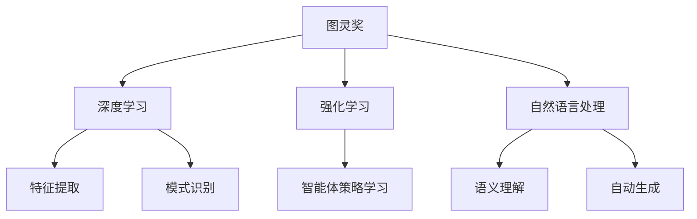

                 

# 图灵奖与AI算法的突破

## 1. 背景介绍

图灵奖（Turing Award），又称为“计算机界的诺贝尔奖”，是计算机科学界最负盛名的奖项，旨在奖励对计算机科学和工程技术做出重大贡献的科学家和工程师。自1966年设立以来，图灵奖已经颁发了数十位杰出代表，其中很多人对现代人工智能（AI）算法的突破和发展做出了重要贡献。

本文旨在探讨图灵奖得主在AI算法领域的突破及其对未来发展的启示。我们将从图灵奖的历史回顾、近年获奖者的成就、以及这些成就对AI算法的突破和应用影响等多个方面进行深入分析。

## 2. 核心概念与联系

### 2.1 核心概念概述

要理解图灵奖与AI算法之间的联系，首先需要明确几个核心概念：

- **图灵奖**：计算机科学界的最高荣誉，旨在奖励对计算机科学和工程技术做出杰出贡献的个人。
- **AI算法**：实现人工智能的关键工具，包括机器学习、深度学习、自然语言处理、计算机视觉等领域的算法。
- **深度学习**：AI算法中最重要的分支之一，通过神经网络模拟人脑的计算过程，实现高效的特征提取和复杂模式识别。
- **强化学习**：通过试错反馈机制，使智能体学习最优策略，广泛用于机器人控制、游戏AI等领域。
- **自然语言处理**：使计算机能够理解和生成自然语言，是实现智能交互的基础。

这些概念之间的联系可以通过以下Mermaid流程图来展示：



该流程图展示了图灵奖与AI算法的联系和各自的主要研究方向。

## 3. 核心算法原理 & 具体操作步骤

### 3.1 算法原理概述

图灵奖得主在AI算法领域的突破，主要集中在以下几个方面：

- **深度学习的突破**：如深度信念网络（DBN）、卷积神经网络（CNN）、递归神经网络（RNN）等。
- **强化学习的创新**：如蒙特卡罗树搜索（MCTS）、Q-learning、策略梯度等。
- **自然语言处理的进展**：如语义角色标注、机器翻译、情感分析等。

这些突破通过数学模型和算法实现，将复杂的任务转化为计算机可以处理的形式。

### 3.2 算法步骤详解

以深度学习为例，其核心步骤包括：

1. **模型设计**：选择合适的神经网络结构，如全连接层、卷积层、循环层等。
2. **参数初始化**：通过随机初始化或预训练模型来设定网络参数的初始值。
3. **前向传播**：输入数据通过网络计算得到预测结果。
4. **损失函数计算**：计算预测结果与真实标签之间的差异。
5. **反向传播**：通过梯度下降等优化算法更新网络参数。
6. **训练与测试**：通过多次迭代训练，并在测试集上评估模型性能。

### 3.3 算法优缺点

深度学习的优点包括：
- **自适应性强**：可以处理各种复杂模式，具有很强的泛化能力。
- **无需手工特征工程**：通过大量数据自适应学习特征表示。
- **高效并行计算**：适合分布式计算，计算速度较快。

缺点包括：
- **模型复杂度高**：需要大量计算资源和数据。
- **过拟合风险高**：需要合理的正则化和数据增强策略。
- **可解释性差**：难以理解模型内部决策过程。

### 3.4 算法应用领域

深度学习被广泛应用于计算机视觉、语音识别、自然语言处理等多个领域。

- **计算机视觉**：如物体识别、人脸识别、图像生成等。
- **语音识别**：如语音转文本、文本转语音等。
- **自然语言处理**：如机器翻译、情感分析、问答系统等。

## 4. 数学模型和公式 & 详细讲解 & 举例说明

### 4.1 数学模型构建

以卷积神经网络（CNN）为例，其基本模型包括卷积层、池化层和全连接层。

- **卷积层**：通过卷积操作提取特征图。
- **池化层**：通过下采样减少特征图大小，提升计算效率。
- **全连接层**：将特征图转换为输出结果。

### 4.2 公式推导过程

以CNN中卷积层的公式推导为例：

$$
f(x_i) = \sum_k w_k \phi(x_i * k)
$$

其中 $x_i$ 为输入数据，$k$ 为卷积核，$w_k$ 为权重参数，$\phi$ 为激活函数。

### 4.3 案例分析与讲解

以图像分类为例，CNN通过多层卷积和池化操作，提取图像特征，并通过全连接层进行分类。以下是CNN在图像分类中的核心公式：

$$
f(x) = \sigma(W^T \sigma(A^T x))
$$

其中 $x$ 为输入图像，$W$ 为全连接层的权重矩阵，$A$ 为卷积层的权重矩阵，$\sigma$ 为激活函数（如ReLU）。

## 5. 项目实践：代码实例和详细解释说明

### 5.1 开发环境搭建

在进行深度学习项目时，需要使用Python语言和TensorFlow、Keras等深度学习框架。以下是在Ubuntu 20.04系统上搭建开发环境的步骤：

1. 安装Python 3.8：
```bash
sudo apt-get update
sudo apt-get install python3.8
```

2. 安装pip和virtualenv：
```bash
sudo apt-get install python3-pip python3-venv
```

3. 创建虚拟环境：
```bash
python3 -m venv myenv
source myenv/bin/activate
```

4. 安装TensorFlow和Keras：
```bash
pip install tensorflow==2.6.0 keras
```

### 5.2 源代码详细实现

以下是一个简单的图像分类项目，使用CNN实现：

```python
import tensorflow as tf
from tensorflow import keras

# 加载数据集
(x_train, y_train), (x_test, y_test) = keras.datasets.cifar10.load_data()

# 数据预处理
x_train = x_train.astype('float32') / 255.0
x_test = x_test.astype('float32') / 255.0

# 定义模型
model = keras.Sequential([
    keras.layers.Conv2D(32, (3, 3), activation='relu', input_shape=(32, 32, 3)),
    keras.layers.MaxPooling2D((2, 2)),
    keras.layers.Conv2D(64, (3, 3), activation='relu'),
    keras.layers.MaxPooling2D((2, 2)),
    keras.layers.Conv2D(64, (3, 3), activation='relu'),
    keras.layers.Flatten(),
    keras.layers.Dense(64, activation='relu'),
    keras.layers.Dense(10, activation='softmax')
])

# 编译模型
model.compile(optimizer='adam',
              loss='sparse_categorical_crossentropy',
              metrics=['accuracy'])

# 训练模型
model.fit(x_train, y_train, epochs=10, validation_data=(x_test, y_test))

# 评估模型
model.evaluate(x_test, y_test)
```

### 5.3 代码解读与分析

以上代码实现了CNN模型对CIFAR-10数据集的图像分类任务。通过定义卷积层、池化层和全连接层，CNN可以自动提取图像特征并进行分类。使用`compile`方法编译模型，`fit`方法训练模型，`evaluate`方法评估模型性能。

## 6. 实际应用场景

### 6.1 计算机视觉

深度学习在计算机视觉领域取得了巨大成功，如图像分类、目标检测、图像生成等。例如，Google的Inception网络在ImageNet竞赛中获得了冠军，突破了之前的人脸识别和物体识别技术。

### 6.2 语音识别

深度学习在语音识别领域也取得了显著突破，如Google的WaveNet、Amazon的Alexa等。通过端到端的深度学习模型，语音识别系统可以实现高效准确的语音转文本功能。

### 6.3 自然语言处理

自然语言处理是AI算法的另一重要领域，包括机器翻译、情感分析、问答系统等。Google的Transformer模型在这些任务上取得了巨大成功，大幅提升了自然语言处理的效果。

### 6.4 未来应用展望

未来，深度学习将进一步突破，包括更多的神经网络结构、更高效的学习算法、更丰富的数据集等。深度学习的应用场景也将进一步拓展，如智能家居、自动驾驶、医疗诊断等。

## 7. 工具和资源推荐

### 7.1 学习资源推荐

以下是推荐的深度学习学习资源：

- **《深度学习》（Ian Goodfellow）**：深度学习领域的经典教材，详细介绍了深度学习的理论基础和实践技巧。
- **DeepLearning.ai课程**：由Andrew Ng教授主讲的深度学习课程，覆盖了深度学习的基本概念和算法。
- **Kaggle竞赛**：参与Kaggle比赛，可以获得大量实际项目经验，提升算法实践能力。

### 7.2 开发工具推荐

以下是推荐的深度学习开发工具：

- **TensorFlow**：由Google开发的深度学习框架，支持分布式计算和高效的模型训练。
- **PyTorch**：由Facebook开发的深度学习框架，具有灵活的动态图计算功能。
- **Jupyter Notebook**：免费的交互式编程环境，支持多种编程语言和库。

### 7.3 相关论文推荐

以下是推荐的深度学习相关论文：

- **ImageNet Classification with Deep Convolutional Neural Networks**：AlexNet论文，提出深度卷积神经网络（CNN），推动了计算机视觉领域的突破。
- **Efficient Backprop**：反向传播算法论文，为深度学习模型的训练提供了重要的理论基础。
- **A Tutorial on Deep Learning**：深度学习领域的经典教程，介绍了深度学习的基本概念和算法。

## 8. 总结：未来发展趋势与挑战

### 8.1 研究成果总结

图灵奖得主在深度学习领域的突破，为现代AI算法的发展奠定了坚实基础。这些突破包括深度学习模型的设计、优化算法、应用场景等多个方面，推动了计算机视觉、语音识别、自然语言处理等领域的快速发展。

### 8.2 未来发展趋势

未来，深度学习将向更高效、更普适、更智能的方向发展：

- **高效计算**：通过更高效的计算图、更优化的模型结构，提升深度学习的计算效率。
- **通用模型**：通过更通用的模型架构，提升深度学习的泛化能力，应对更多的应用场景。
- **智能算法**：通过更智能的学习算法，提升深度学习的自我适应能力，实现更好的任务性能。

### 8.3 面临的挑战

深度学习的发展也面临诸多挑战：

- **计算资源瓶颈**：深度学习模型的计算需求极高，需要高性能的计算资源。
- **数据标注成本**：深度学习模型需要大量的标注数据，标注成本较高。
- **模型可解释性**：深度学习模型往往难以解释其内部决策过程，需要进一步提升模型可解释性。

### 8.4 研究展望

未来，深度学习的研究方向将包括：

- **模型压缩与优化**：通过模型压缩、量化加速等技术，提升深度学习的计算效率和存储效率。
- **多模态融合**：将视觉、语音、文本等多种模态的信息进行融合，提升深度学习模型的性能。
- **自监督学习**：通过无监督或半监督学习方式，减少对标注数据的依赖，提升模型的泛化能力。

总之，深度学习技术在AI算法领域的发展，不仅推动了计算机视觉、语音识别、自然语言处理等领域的突破，也为未来的智能系统开发提供了重要工具。图灵奖得主在这方面的贡献，将引领深度学习技术不断突破，推动AI算法向更加高效、智能、普适的方向发展。

## 9. 附录：常见问题与解答

**Q1: 什么是深度学习？**

A: 深度学习是一种基于神经网络的学习方法，通过多层次的特征提取和抽象，实现对复杂模式的高效识别和处理。

**Q2: 深度学习和机器学习的区别是什么？**

A: 机器学习是深度学习的一种特殊形式，深度学习是机器学习的高级形式。深度学习通过多层次的神经网络，可以实现更复杂的特征提取和模式识别。

**Q3: 深度学习在实际应用中有什么挑战？**

A: 深度学习面临的主要挑战包括计算资源瓶颈、数据标注成本、模型可解释性等。需要采用模型压缩、自监督学习等方法，解决这些问题。

**Q4: 未来深度学习的发展趋势是什么？**

A: 未来深度学习将向更高效、更普适、更智能的方向发展。包括更高效的计算图、更通用的模型架构、更智能的学习算法等。

**Q5: 如何提升深度学习模型的可解释性？**

A: 提升深度学习模型的可解释性，可以通过模型压缩、可视化工具等方法，直观地理解模型的内部结构和决策过程。

---

作者：禅与计算机程序设计艺术 / Zen and the Art of Computer Programming

