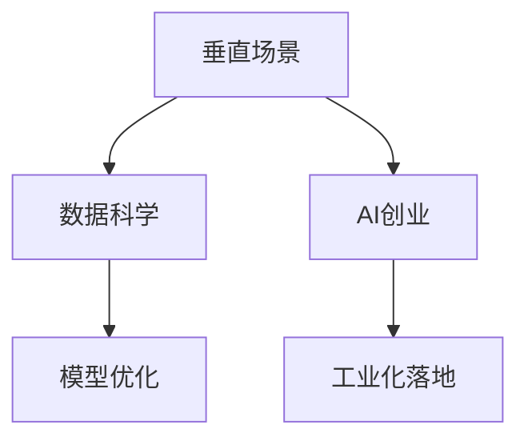

                 

## 1. 背景介绍

### 1.1 问题由来

随着人工智能（AI）技术的飞速发展，AI创业成为推动科技创新和经济发展的重要引擎。AI创业的领域范围不断扩大，涵盖了从金融、医疗、制造到教育、娱乐等各个行业。垂直场景与AI创业的结合，不仅可以满足特定行业的需求，还能提升业务效率，创新商业模式，甚至驱动行业变革。然而，AI创业过程中也面临着诸多挑战，包括技术选型、数据获取、模型部署等。本文将从垂直场景与AI创业的结合、AI创业的技术选型与模型优化，以及AI创业在行业落地中的应用三个方面进行探讨。

### 1.2 问题核心关键点

AI创业与垂直场景的结合，需要综合考虑数据可用性、业务需求、技术适应性等多方面因素。核心关键点包括：
- 数据质量与可获得性：确保获取到高质量、代表性强的数据。
- 业务需求与技术匹配：选择最适合业务需求的技术方案。
- 模型性能与落地效果：评估模型在实际应用中的效果和表现。
- 数据隐私与伦理合规：确保数据处理和使用符合隐私保护和伦理法规。

## 2. 核心概念与联系

### 2.1 核心概念概述

为更好地理解垂直场景与AI创业的结合，本节将介绍几个密切相关的核心概念：

- 垂直场景：指特定行业、特定领域的业务需求和应用场景。例如，医疗领域的疾病诊断、金融领域的风险评估、零售领域的商品推荐等。
- AI创业：指利用AI技术创新商业模式、提升业务效率的创业行为。
- 数据科学：通过数据获取、清洗、分析和建模等技术手段，提取有价值的信息和知识，支持AI创业的决策和执行。
- 模型优化：通过算法改进、参数调整等技术手段，提升AI模型的性能和泛化能力。
- 工业化落地：将AI模型应用于实际业务场景，实现商业价值和经济效益。

这些核心概念之间的逻辑关系可以通过以下Mermaid流程图来展示：



这个流程图展示了大语言模型的核心概念及其之间的关系：

1. 垂直场景需要通过数据科学获取高质量的数据，并进行数据预处理和特征工程。
2. AI创业需要选择合适的技术方案，并对模型进行优化以提升性能。
3. 工业化落地将优化后的模型应用于实际业务场景，实现商业价值。

这些概念共同构成了垂直场景与AI创业的合作框架，使其能够针对特定行业需求，提升业务效率，创新商业模式，加速行业转型升级。

## 3. 核心算法原理 & 具体操作步骤
### 3.1 算法原理概述

垂直场景与AI创业的结合，本质上是一种数据驱动的业务创新和优化过程。其核心思想是通过数据科学和AI技术，提升业务流程的自动化、智能化水平，从而提升效率、降低成本、增加收益。

形式化地，假设存在一个特定的垂直场景S，其业务数据集为D，目标为T，AI创业的目标为I。模型优化和工业化落地的过程可以表示为：

$$
I = F(T, S, D, \theta)
$$

其中 $F$ 表示模型优化和工业化落地的函数，$\theta$ 表示模型的参数。

通过数据科学获取到高质量的数据 $D$，并进行特征工程，将其作为模型的输入。模型优化过程通过选择和调整合适的算法和参数，使模型能够准确地预测目标 $T$。最后，通过工业化落地将优化后的模型应用到垂直场景 $S$ 中，实现商业价值 $I$。

### 3.2 算法步骤详解

垂直场景与AI创业的结合，主要包括以下几个关键步骤：

**Step 1: 数据获取与预处理**
- 收集垂直场景S相关的业务数据D，确保数据的质量和代表性。
- 对数据进行清洗、去重、降噪等预处理，提取有用的特征。
- 划分数据集为训练集、验证集和测试集，用于模型训练、调优和评估。

**Step 2: 选择和设计模型**
- 根据垂直场景的需求和数据特点，选择合适的AI算法，如决策树、随机森林、深度学习等。
- 设计模型的架构和参数，确保其能够适应特定的业务需求。

**Step 3: 模型训练与调优**
- 使用训练集D对模型进行训练，不断调整参数和算法，优化模型的性能。
- 在验证集上评估模型的泛化能力和鲁棒性，防止过拟合。
- 应用正则化技术、交叉验证等手段，进一步提高模型性能。

**Step 4: 模型评估与部署**
- 在测试集上对模型进行全面评估，验证其预测准确率和鲁棒性。
- 将优化后的模型部署到实际业务场景中，进行工业化落地。
- 监控模型表现，及时进行更新和优化。

### 3.3 算法优缺点

垂直场景与AI创业的结合，具有以下优点：
1. 高效提升业务效率：通过自动化、智能化的技术手段，优化业务流程，提升效率。
2. 降低成本，增加收益：减少人工操作，提高资源利用率，降低成本。
3. 创新商业模型：通过数据分析和算法优化，发现新的业务机会和商业模式。
4. 提升决策科学性：基于数据驱动的决策，提升业务决策的科学性和准确性。

同时，该方法也存在一定的局限性：
1. 数据依赖性强：模型优化和工业化落地的效果很大程度上依赖于数据的质量和代表性。
2. 技术门槛高：需要具备数据科学和AI技术的专业知识，普通创业者难以独立实现。
3. 风险控制难：AI模型可能存在预测偏差，无法完全消除业务风险。
4. 难以衡量ROI：AI创业的效果和收益，难以量化和评估，存在不确定性。

尽管存在这些局限性，但就目前而言，基于垂直场景与AI创业的结合，已经成为推动AI技术落地应用的重要方式。未来相关研究的重点在于如何进一步降低技术门槛，提高模型的泛化能力和鲁棒性，同时兼顾风险控制和收益评估，促进AI创业的可持续发展。

### 3.4 算法应用领域

垂直场景与AI创业的结合，在多个行业领域得到了广泛应用，包括但不限于：

- 医疗健康：通过AI技术优化疾病诊断、治疗方案选择、药物研发等医疗流程，提升医疗服务质量。
- 金融服务：利用AI技术进行风险评估、信用评分、智能投顾等，提升金融服务的效率和精准度。
- 制造业：应用AI技术进行质量检测、设备预测性维护、供应链优化等，降低生产成本，提升效率。
- 零售电商：使用AI技术进行客户推荐、库存管理、营销策略优化等，提升销售业绩，改善客户体验。
- 教育培训：通过AI技术进行个性化学习推荐、作业批改、学习行为分析等，提升教育效果。
- 智能交通：利用AI技术进行交通流量预测、智能调度、安全预警等，提升交通管理水平。
- 智慧农业：应用AI技术进行气象预测、作物监测、自动化作业等，提高农业生产效率。

除了上述这些经典领域外，AI创业还在能源、环保、城市管理等多个领域产生了深刻影响。随着AI技术的不断发展，基于垂直场景与AI创业的结合，必将在更多行业和场景中得到应用，驱动各行业的数字化转型。

## 4. 数学模型和公式 & 详细讲解  
### 4.1 数学模型构建

基于垂直场景与AI创业的结合，可以通过构建数学模型来描述这一过程。

假设存在一个二分类任务，数据集为 $D=\{(x_i, y_i)\}_{i=1}^N$，其中 $x_i \in \mathcal{X}$ 为输入特征，$y_i \in \{0,1\}$ 为输出标签。模型的目标是最小化损失函数 $L$，使得模型能够准确预测输出标签。

常见的损失函数包括交叉熵损失（Cross-Entropy Loss）和均方误差损失（Mean Squared Error Loss）。以交叉熵损失为例，损失函数 $L$ 可以表示为：

$$
L(y_i, \hat{y_i}) = -y_i \log \hat{y_i} - (1-y_i) \log (1-\hat{y_i})
$$

其中 $\hat{y_i}$ 为模型对输入特征 $x_i$ 的预测输出。

### 4.2 公式推导过程

在垂直场景与AI创业的结合过程中，常见的算法包括决策树、随机森林、梯度提升（Gradient Boosting）和深度学习（Deep Learning）。这里以梯度提升算法为例，进行公式推导。

梯度提升算法的核心思想是通过迭代优化，构建一系列弱学习器（Weak Learners），每个弱学习器只针对上一步误差较大的部分进行修正，最终得到强学习器（Strong Learner）。假设 $f_t(x)$ 为第 $t$ 个弱学习器，$h(x)$ 为强学习器。则梯度提升算法的优化目标为：

$$
h(x) = \sum_{t=1}^T f_t(x)
$$

其中 $T$ 为迭代次数，$f_t(x)$ 为第 $t$ 个弱学习器。

具体实现过程中，每个弱学习器 $f_t(x)$ 可以表示为：

$$
f_t(x) = \nabla_{\theta}L(y, \hat{y}) + \lambda \nabla_{\theta}||w||^2
$$

其中 $\theta$ 为模型参数，$\lambda$ 为正则化系数，$w$ 为模型权重。

### 4.3 案例分析与讲解

以金融风险评估为例，对垂直场景与AI创业的结合进行详细讲解。

假设金融机构希望构建一个基于历史贷款数据的风险评估模型。首先，通过数据科学获取到贷款数据集 $D=\{(x_i, y_i)\}_{i=1}^N$，其中 $x_i$ 包括贷款申请人的个人信息、贷款金额、还款记录等特征，$y_i$ 为是否违约的标签。

然后，选择梯度提升算法作为模型优化方法。通过对数据集进行特征工程，提取有用的特征，划分为训练集、验证集和测试集。在训练集上应用梯度提升算法，逐步优化模型参数，得到最终的强学习器 $h(x)$。

最后，将优化后的模型部署到实际业务场景中，进行风险评估和决策支持。在模型应用过程中，需要持续监控模型性能，及时更新和优化模型，确保其能够适应业务需求的变化。

## 5. 项目实践：代码实例和详细解释说明
### 5.1 开发环境搭建

在进行垂直场景与AI创业的结合实践前，我们需要准备好开发环境。以下是使用Python进行Scikit-learn开发的环境配置流程：

1. 安装Anaconda：从官网下载并安装Anaconda，用于创建独立的Python环境。

2. 创建并激活虚拟环境：
```bash
conda create -n myenv python=3.8 
conda activate myenv
```

3. 安装Scikit-learn和其他必要的库：
```bash
conda install scikit-learn pandas numpy matplotlib seaborn
```

完成上述步骤后，即可在`myenv`环境中开始实践。

### 5.2 源代码详细实现

这里我们以金融风险评估为例，给出使用Scikit-learn进行梯度提升算法优化的Python代码实现。

首先，定义数据处理函数：

```python
import pandas as pd
from sklearn.model_selection import train_test_split

def load_data(file_path):
    df = pd.read_csv(file_path)
    return df
```

然后，进行数据预处理：

```python
def preprocess_data(df):
    # 数据清洗
    df = df.dropna()
    
    # 特征工程
    df['loan_amt'] = df['loan_amt'].astype(float)
    df['dti'] = df['dti'].astype(float)
    df['loan_term'] = df['loan_term'].astype(float)
    
    # 数据标准化
    df = (df - df.mean()) / df.std()
    
    return df
```

接着，进行模型训练和评估：

```python
from sklearn.ensemble import GradientBoostingClassifier
from sklearn.metrics import accuracy_score

def train_model(X, y, n_estimators=100):
    X_train, X_test, y_train, y_test = train_test_split(X, y, test_size=0.2, random_state=42)
    model = GradientBoostingClassifier(n_estimators=n_estimators)
    model.fit(X_train, y_train)
    y_pred = model.predict(X_test)
    accuracy = accuracy_score(y_test, y_pred)
    return accuracy
```

最后，启动训练流程并在测试集上评估：

```python
data = load_data('loan_data.csv')
df = preprocess_data(data)

X = df.drop('y', axis=1)
y = df['y']

accuracy = train_model(X, y)
print(f'Accuracy: {accuracy:.3f}')
```

以上就是使用Scikit-learn进行金融风险评估的完整代码实现。可以看到，Scikit-learn提供了丰富的机器学习算法和数据处理工具，使得模型优化和工业化落地变得简单易行。

### 5.3 代码解读与分析

让我们再详细解读一下关键代码的实现细节：

**load_data函数**：
- 定义数据加载函数，从指定的CSV文件中读取数据，并返回Pandas DataFrame格式。

**preprocess_data函数**：
- 对数据进行清洗，删除缺失值。
- 对数值型特征进行归一化处理，确保其具有相同的尺度。
- 特征工程，提取有用的特征，如贷款金额、债务收入比等。

**train_model函数**：
- 使用Scikit-learn的GradientBoostingClassifier进行模型训练，设置迭代次数为100。
- 在训练集上拟合模型，并使用测试集进行预测。
- 计算模型的准确率，并返回结果。

**训练流程**：
- 加载数据，并进行预处理。
- 调用train_model函数，训练模型并计算准确率。
- 输出模型准确率，供进一步评估和优化。

## 6. 实际应用场景
### 6.1 金融风控

基于垂直场景与AI创业的结合，金融风险评估模型已经在各大银行和金融机构得到了广泛应用。传统金融风控主要依赖人工审核和经验判断，存在主观性强、效率低等问题。通过AI技术构建的风险评估模型，能够自动判断贷款申请人的风险等级，快速做出决策，提升风控效率和精准度。

在技术实现上，可以收集银行的贷款历史数据，将贷款申请人的个人信息、还款记录等作为特征，构建金融风险评估模型。通过模型训练和调优，使得模型能够准确预测贷款申请人的违约概率。在模型应用过程中，可以通过不断更新训练数据和模型参数，提升模型泛化能力和鲁棒性。

### 6.2 智能客服

AI创业与垂直场景的结合，还可以应用于智能客服系统的构建。传统客服系统依赖人工客服，高峰期响应速度慢，效率低，客户满意度差。通过AI技术构建的智能客服系统，可以24小时不间断服务，快速响应客户咨询，提升客户满意度。

在技术实现上，可以收集企业的历史客服对话记录，将问题和最佳答复构建成监督数据，在此基础上对预训练语言模型进行微调。微调后的语言模型能够自动理解用户意图，匹配最合适的答案模板进行回复。对于客户提出的新问题，还可以接入检索系统实时搜索相关内容，动态组织生成回答。如此构建的智能客服系统，能够显著提升客户咨询体验和问题解决效率。

### 6.3 零售推荐

基于垂直场景与AI创业的结合，智能推荐系统已经在电商和零售行业得到了广泛应用。传统推荐系统主要依赖用户历史行为数据进行物品推荐，无法深入理解用户兴趣偏好。通过AI技术构建的智能推荐系统，能够从用户浏览、点击、评论等行为中提取有用的特征，预测用户的兴趣和偏好，进行个性化推荐。

在技术实现上，可以收集用户的历史行为数据，将物品标题、描述等文本内容作为特征，构建智能推荐模型。通过模型训练和调优，使得模型能够从文本内容中准确把握用户的兴趣点。在推荐过程中，可以结合用户实时行为数据，动态调整推荐策略，提升推荐效果。

### 6.4 未来应用展望

随着垂直场景与AI创业的结合不断发展，未来将在更多领域产生深远影响：

- 智慧医疗：通过AI技术优化疾病诊断、治疗方案选择、药物研发等医疗流程，提升医疗服务质量。
- 智能制造：应用AI技术进行质量检测、设备预测性维护、供应链优化等，降低生产成本，提升效率。
- 智慧交通：利用AI技术进行交通流量预测、智能调度、安全预警等，提升交通管理水平。
- 智慧城市：通过AI技术进行城市事件监测、舆情分析、应急指挥等，提升城市管理水平。
- 智慧农业：应用AI技术进行气象预测、作物监测、自动化作业等，提高农业生产效率。
- 智能教育：通过AI技术进行个性化学习推荐、作业批改、学习行为分析等，提升教育效果。

此外，在企业生产、社会治理、文娱传媒等众多领域，基于垂直场景与AI创业的结合，也将不断涌现，为传统行业数字化转型升级提供新的技术路径。

## 7. 工具和资源推荐
### 7.1 学习资源推荐

为了帮助开发者系统掌握垂直场景与AI创业的结合，这里推荐一些优质的学习资源：

1. 《Python机器学习》：Scikit-learn的官方文档，详细介绍了机器学习算法的实现和应用，适合初学者入门。
2. 《深度学习》（Ian Goodfellow等著）：深度学习领域的经典教材，深入浅出地讲解了深度学习的基本原理和算法。
3. Kaggle：全球知名的数据科学竞赛平台，提供丰富的数据集和竞赛机会，帮助开发者提升实战能力。
4. Coursera和edX：提供大量免费的在线课程，涵盖机器学习、深度学习、自然语言处理等多个领域。
5. GitHub：提供丰富的开源项目和代码库，供开发者参考和学习。

通过对这些资源的学习实践，相信你一定能够快速掌握垂直场景与AI创业的结合方法，并用于解决实际的业务问题。

### 7.2 开发工具推荐

高效的开发离不开优秀的工具支持。以下是几款用于垂直场景与AI创业结合开发的常用工具：

1. Scikit-learn：Python的机器学习库，提供丰富的算法和数据处理工具，支持多种模型优化方法。
2. TensorFlow和PyTorch：深度学习框架，支持复杂的神经网络模型和分布式训练。
3. Jupyter Notebook：交互式笔记本，方便开发者进行数据探索、模型训练和结果展示。
4. H2O.ai：开源的机器学习平台，支持分布式训练和模型部署。
5. RapidMiner：商业化的数据科学平台，提供可视化的数据探索和模型构建工具。

合理利用这些工具，可以显著提升垂直场景与AI创业的结合开发效率，加快创新迭代的步伐。

### 7.3 相关论文推荐

垂直场景与AI创业的结合，在近年来受到了学界和业界的广泛关注。以下是几篇奠基性的相关论文，推荐阅读：

1. "A Survey of Machine Learning Techniques for Financial Applications"（机器学习在金融领域的应用综述）：综述了金融领域常用的机器学习算法和技术。
2. "Deep Learning for Recommender Systems"（深度学习在推荐系统中的应用）：介绍了深度学习在推荐系统中的应用和效果。
3. "An Overview of Deep Learning for Finance"（深度学习在金融领域的应用概述）：介绍了深度学习在金融领域的应用场景和技术方法。
4. "Adaptive Learning in Healthcare"（医疗领域的自适应学习）：介绍了自适应学习在医疗领域的应用和效果。
5. "Machine Learning for Smart Traffic Management"（机器学习在智能交通中的应用）：介绍了机器学习在智能交通中的应用和效果。

这些论文代表了大语言模型微调技术的发展脉络。通过学习这些前沿成果，可以帮助研究者把握学科前进方向，激发更多的创新灵感。

## 8. 总结：未来发展趋势与挑战

### 8.1 总结

本文对垂直场景与AI创业的结合方法进行了全面系统的介绍。首先阐述了垂直场景与AI创业的结合在推动业务创新和优化中的重要作用，明确了技术选型、模型优化和工业化落地等关键步骤。其次，从原理到实践，详细讲解了垂直场景与AI创业的结合的数学模型和算法优化过程，给出了实际业务场景的代码实例。最后，探讨了垂直场景与AI创业的结合在多个行业领域的应用前景，并展望了未来发展趋势和面临的挑战。

通过本文的系统梳理，可以看到，垂直场景与AI创业的结合已成为推动AI技术落地应用的重要方式，极大地提升了各行业的业务效率和智能化水平。未来，伴随AI技术的不断发展，基于垂直场景与AI创业的结合，必将在更多行业和场景中得到应用，推动AI技术的广泛应用和行业转型升级。

### 8.2 未来发展趋势

展望未来，垂直场景与AI创业的结合将呈现以下几个发展趋势：

1. 数据驱动的决策：AI技术将更加深入地融入业务决策中，提升决策的科学性和精准性。
2. 实时化的应用：通过AI技术实现业务流程的实时化，提升服务效率和用户体验。
3. 跨领域的协同：AI技术与物联网、大数据、区块链等技术的深度融合，推动跨领域协同创新。
4. 人机协作的增强：AI技术与人类工作方式的协同融合，提升人机协作效率和效果。
5. 个性化服务的普及：基于AI技术，实现个性化推荐、智能客服、精准营销等服务，提升用户体验。
6. 智能化的流程优化：通过AI技术优化业务流程，降低成本，提升效率。
7. 多模态数据的整合：结合文本、图像、语音等多种模态数据，提升AI模型的感知能力和决策效果。

这些趋势凸显了垂直场景与AI创业结合的广阔前景。这些方向的探索发展，必将进一步提升AI创业的效果和应用范围，为各行业的数字化转型升级提供新的技术路径。

### 8.3 面临的挑战

尽管垂直场景与AI创业的结合已经取得了瞩目成就，但在迈向更加智能化、普适化应用的过程中，它仍面临着诸多挑战：

1. 数据质量与可获得性：高质量、代表性强的数据获取成本高，数据缺失、噪声等问题难以避免。
2. 技术门槛高：需要具备数据科学和AI技术的专业知识，普通创业者难以独立实现。
3. 模型复杂度：大规模神经网络模型对计算资源要求高，训练和推理效率低。
4. 模型鲁棒性：AI模型可能存在预测偏差，无法完全消除业务风险。
5. 可解释性：AI模型的决策过程难以解释，难以进行人工干预和审查。
6. 伦理与安全：AI模型可能存在偏见、歧视等问题，需保障数据和模型的伦理与安全。
7. 持续迭代：AI模型需不断更新和优化，以适应业务需求的变化。

尽管存在这些挑战，但通过技术创新和协同合作，垂直场景与AI创业的结合必将在更多行业和场景中得到应用，推动AI技术的广泛应用和行业转型升级。

### 8.4 研究展望

面对垂直场景与AI创业结合所面临的种种挑战，未来的研究需要在以下几个方面寻求新的突破：

1. 提升数据质量：通过数据采集、清洗和增强等技术手段，提升数据的质量和代表性。
2. 降低技术门槛：开发更易用、更高效的工具和平台，降低AI创业的技术门槛。
3. 优化模型结构：研究更加高效、更加轻量级的模型结构，提升模型的训练和推理效率。
4. 增强模型鲁棒性：引入更多的正则化技术和对抗训练方法，增强模型的泛化能力和鲁棒性。
5. 提高可解释性：通过模型解释、可视化等技术手段，提高模型的可解释性和透明度。
6. 保障数据伦理与安全：引入数据隐私保护和模型公平性等技术手段，保障数据和模型的伦理与安全。
7. 推动持续迭代：建立持续更新和优化机制，确保模型能够不断适应业务需求的变化。

这些研究方向的探索，必将引领垂直场景与AI创业结合技术迈向更高的台阶，为构建更加智能、高效、安全的业务系统提供新的技术路径。

## 9. 附录：常见问题与解答

**Q1：垂直场景与AI创业结合的效果如何评估？**

A: 垂直场景与AI创业结合的效果评估可以从多个维度进行，包括：
1. 业务效率提升：评估AI技术对业务流程的影响，如提升效率、降低成本、提高准确性等。
2. 用户体验改善：评估AI技术对用户体验的影响，如提升服务质量、增加用户满意度等。
3. 业务收益增加：评估AI技术对业务收益的影响，如增加收入、提升转化率等。
4. 模型性能：通过各种评估指标（如准确率、召回率、F1分数等）评估模型的性能。
5. 业务风险控制：评估AI技术对业务风险的影响，如降低风险、避免误判等。

综合评估这些指标，可以全面了解垂直场景与AI创业结合的效果。

**Q2：如何选择适合垂直场景的AI技术？**

A: 选择适合垂直场景的AI技术，需要考虑以下因素：
1. 业务需求：根据业务需求选择合适的算法和技术，如分类、回归、聚类等。
2. 数据特点：根据数据类型和分布选择合适的算法，如结构化数据、非结构化数据、时间序列数据等。
3. 模型复杂度：根据模型复杂度和训练资源选择合适的算法，如线性模型、深度学习模型等。
4. 实时性要求：根据实时性要求选择合适的算法，如批处理、流处理等。
5. 可解释性需求：根据可解释性需求选择合适的算法，如决策树、规则引擎等。

综合考虑这些因素，可以更好地选择适合的AI技术，确保模型能够适应业务需求。

**Q3：如何在垂直场景中有效利用数据？**

A: 在垂直场景中有效利用数据，需要遵循以下步骤：
1. 数据收集：从不同渠道收集业务数据，确保数据的质量和代表性。
2. 数据清洗：对数据进行清洗、去重、降噪等处理，确保数据的准确性和一致性。
3. 数据标注：对数据进行标注，生成监督数据集。
4. 特征工程：对数据进行特征提取和选择，确保特征的有效性和完备性。
5. 数据划分：将数据划分为训练集、验证集和测试集，确保模型训练和评估的公平性和可靠性。

通过这些步骤，可以确保数据的高质量和高可用性，提升模型的性能和效果。

**Q4：如何处理数据隐私和伦理问题？**

A: 处理数据隐私和伦理问题，需要遵循以下原则：
1. 数据匿名化：对数据进行匿名化处理，保护个人隐私。
2. 数据加密：对数据进行加密处理，防止数据泄露。
3. 数据共享：建立数据共享机制，确保数据的合法性和安全性。
4. 数据审计：对数据使用过程进行审计，确保数据使用的合法性和合规性。
5. 数据公平性：避免数据偏见，确保模型的公平性和公正性。

通过这些措施，可以确保数据隐私和伦理问题的处理符合相关法律法规和行业标准。

**Q5：如何持续改进模型？**

A: 持续改进模型，需要遵循以下步骤：
1. 数据更新：定期更新数据集，确保模型能够适应数据分布的变化。
2. 模型调优：根据业务需求和数据变化，对模型进行调优和优化。
3. 模型迭代：定期迭代模型，确保模型的性能和效果。
4. 反馈机制：建立反馈机制，及时收集用户反馈，调整模型策略。
5. 技术创新：引入新技术和新算法，提升模型的性能和效果。

通过这些步骤，可以确保模型能够持续改进和优化，满足业务需求的变化。

---

作者：禅与计算机程序设计艺术 / Zen and the Art of Computer Programming

