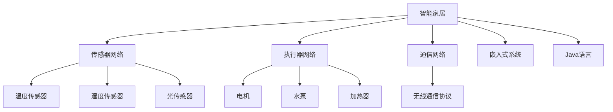

                 

# 基于Java的智能家居设计：Java程序员的物联网硬件入门指南

> 关键词：智能家居, Java, 物联网, 硬件入门, 传感器, 嵌入式系统

## 1. 背景介绍

### 1.1 问题由来
随着物联网技术的飞速发展，智能家居已经成为了未来家庭生活的重要方向。智能家居系统通过各种传感器、执行器和通信网络，实现对家居环境的全面感知和智能化控制。对于Java程序员来说，如何利用Java语言，将智能家居系统的设计和开发工作顺利开展，成为了一个值得探讨的话题。本文将深入浅出地介绍基于Java的智能家居设计，从基础知识到实际应用，逐步引导Java程序员掌握物联网硬件入门所需的关键技能。

### 1.2 问题核心关键点
本文主要解决以下关键问题：
- 智能家居系统的基本组成和原理。
- 基于Java的物联网硬件开发流程和技术栈。
- 常用传感器和执行器的原理与应用。
- 嵌入式系统的设计与开发。
- 物联网数据传输协议和通信技术。
- 智能家居应用的实际案例与未来展望。

通过本文的学习，Java程序员将能够从零开始，逐步构建起属于自己的智能家居系统，掌握物联网硬件开发的关键技术。

## 2. 核心概念与联系

### 2.1 核心概念概述

为更好地理解基于Java的智能家居设计，本节将介绍几个密切相关的核心概念：

- 智能家居：通过物联网技术，实现家庭环境的智能化管理。包括传感器网络、执行器网络、通信网络等组成部分。
- 物联网：指将物理世界的各种设备通过网络技术连接起来，实现数据交换和通信，达到设备互联互通的目标。
- 传感器：用于感知环境信息的设备，如温度传感器、湿度传感器、光传感器等。
- 执行器：用于改变环境状态的设备，如电机、水泵、加热器等。
- 嵌入式系统：将传感器、执行器等硬件与软件结合，实现特定功能的应用系统。
- Java语言：一种广泛应用于开发各种系统的面向对象编程语言，具有跨平台、安全性高等特点。
- 无线通信协议：如ZigBee、Wi-Fi、蓝牙等，用于实现设备之间的通信和数据传输。

这些核心概念之间的逻辑关系可以通过以下Mermaid流程图来展示：



这个流程图展示了一系列概念之间的逻辑关系：

1. 智能家居由传感器网络、执行器网络、通信网络组成。
2. 传感器网络包括各种传感器，如温度传感器、湿度传感器、光传感器等。
3. 执行器网络包括各种执行器，如电机、水泵、加热器等。
4. 通信网络使用无线通信协议，实现设备之间的通信。
5. 嵌入式系统将传感器和执行器与软件结合，实现特定功能。
6. Java语言是嵌入式系统软件开发的主要语言之一。

这些概念共同构成了智能家居系统的基础架构，使得Java程序员可以系统地掌握其开发所需的技术。

## 3. 核心算法原理 & 具体操作步骤
### 3.1 算法原理概述

基于Java的智能家居设计，主要依赖于嵌入式系统的设计与开发，以及数据采集与处理的算法实现。其核心思想是：通过传感器网络采集家庭环境信息，利用嵌入式系统进行数据处理和控制决策，最终通过执行器网络改变环境状态，实现智能化管理。

形式化地，假设传感器网络采集到的环境数据为 $D=\{x_i\}_{i=1}^N$，其中 $x_i \in \mathcal{X}$ 为第 $i$ 个传感器的测量值。执行器网络的执行决策为 $U=\{u_j\}_{j=1}^M$，其中 $u_j \in \mathcal{U}$ 为第 $j$ 个执行器的动作指令。嵌入式系统的决策过程为 $f(D; \theta)$，其中 $\theta$ 为嵌入式系统的参数。

智能家居系统的优化目标是最小化家庭环境的状态误差，即：

$$
\min_{\theta} \sum_{i=1}^N \| x_i - \tilde{x}_i \|^2
$$

其中 $\tilde{x}_i$ 为传感器网络的目标输出，可以理解为期望的家居环境状态。

通过梯度下降等优化算法，嵌入式系统的参数 $\theta$ 不断更新，最小化状态误差，使得传感器网络输出的数据逼近目标状态。最终，执行器网络根据嵌入式系统的决策，执行相应的动作指令，调整家居环境，达到智能化管理的目的。

### 3.2 算法步骤详解

基于Java的智能家居设计主要包括以下几个关键步骤：

**Step 1: 传感器网络设计**
- 选择合适的传感器，如温度传感器、湿度传感器、光传感器等，并设计好接口和安装位置。
- 确定传感器数据的采集频率和精度要求，设计采集逻辑。

**Step 2: 嵌入式系统设计**
- 选择合适的微控制器或嵌入式处理器，如Arduino、Raspberry Pi等。
- 设计嵌入式系统的软件架构，包括数据采集、处理、控制决策、通信等功能模块。
- 选择合适的Java框架和库，如Eclipse、Android、IoTForAll等，进行嵌入式系统开发。

**Step 3: 执行器网络设计**
- 选择合适的执行器，如电机、水泵、加热器等，并设计好接口和控制逻辑。
- 根据嵌入式系统的决策，设计执行器的动作指令序列。

**Step 4: 数据传输与通信**
- 选择合适的无线通信协议，如ZigBee、Wi-Fi、蓝牙等，实现设备之间的数据传输。
- 设计通信协议的数据格式和通信流程，确保数据传输的可靠性和实时性。

**Step 5: 系统集成与测试**
- 将传感器网络、嵌入式系统、执行器网络进行集成，搭建完整的智能家居系统。
- 在实际环境中进行测试，验证系统的稳定性和功能。

**Step 6: 持续优化与升级**
- 根据测试结果，优化传感器、嵌入式系统、执行器的性能。
- 引入新传感器、新执行器和新协议，进行系统升级和扩展。

### 3.3 算法优缺点

基于Java的智能家居设计具有以下优点：
1. 开发灵活：Java语言具有跨平台、安全性高等特点，适用于开发各种类型的智能家居系统。
2. 社区支持：Java拥有庞大的开发者社区和丰富的开源资源，可以迅速解决开发中的问题。
3. 可扩展性强：基于Java的系统易于扩展，可以根据需求添加新的传感器和执行器。

同时，该方法也存在一定的局限性：
1. 硬件成本较高：高质量的传感器和嵌入式处理器需要一定的投资。
2. 开发门槛高：嵌入式系统开发需要一定的硬件和软件知识。
3. 实时性问题：大规模数据采集和处理可能会影响实时性。

尽管存在这些局限性，但就目前而言，基于Java的智能家居设计方法仍然是大规模开发和应用的重要途径。未来相关研究的重点在于如何进一步降低硬件成本，提高开发效率，优化系统性能。

### 3.4 算法应用领域

基于Java的智能家居设计在多个领域已经得到了广泛应用，例如：

- 智能照明系统：通过传感器采集环境光线信息，智能控制灯光亮度和色彩。
- 智能温控系统：通过传感器采集环境温度信息，智能调节室内温度。
- 智能安防系统：通过传感器采集环境声音、图像信息，智能检测异常情况。
- 智能家电系统：通过传感器采集家电状态信息，智能控制家电开关和模式。
- 智慧健康系统：通过传感器采集人体生理参数，智能监测健康状况。

除了上述这些经典应用外，基于Java的智能家居设计还在更多场景中得到创新性应用，如智能窗帘、智能灌溉、智能门禁等，为智能家居技术带来了全新的突破。

## 4. 数学模型和公式 & 详细讲解 & 举例说明

### 4.1 数学模型构建

本节将使用数学语言对基于Java的智能家居设计过程进行更加严格的刻画。

记传感器网络采集到的环境数据为 $D=\{x_i\}_{i=1}^N$，其中 $x_i \in \mathcal{X}$ 为第 $i$ 个传感器的测量值。执行器网络的执行决策为 $U=\{u_j\}_{j=1}^M$，其中 $u_j \in \mathcal{U}$ 为第 $j$ 个执行器的动作指令。嵌入式系统的决策过程为 $f(D; \theta)$，其中 $\theta$ 为嵌入式系统的参数。

智能家居系统的优化目标是最小化家庭环境的状态误差，即：

$$
\min_{\theta} \sum_{i=1}^N \| x_i - \tilde{x}_i \|^2
$$

其中 $\tilde{x}_i$ 为传感器网络的目标输出，可以理解为期望的家居环境状态。

在实践中，我们通常使用基于梯度的优化算法（如SGD、Adam等）来近似求解上述最优化问题。设 $\eta$ 为学习率，$\lambda$ 为正则化系数，则参数的更新公式为：

$$
\theta \leftarrow \theta - \eta \nabla_{\theta}\mathcal{L}(\theta) - \eta\lambda\theta
$$

其中 $\nabla_{\theta}\mathcal{L}(\theta)$ 为损失函数对参数 $\theta$ 的梯度，可通过反向传播算法高效计算。

### 4.2 公式推导过程

以下我们以智能温控系统为例，推导最小化状态误差的优化目标。

假设传感器网络采集到的室内温度为 $x$，环境温度为 $\tilde{x}$，嵌入式系统将室内温度与目标温度的误差作为优化目标。即：

$$
\mathcal{L}(\theta) = \frac{1}{N} \sum_{i=1}^N (x_i - \tilde{x}_i)^2
$$

其中 $x_i$ 为第 $i$ 个传感器采集到的温度，$\tilde{x}_i$ 为目标温度。

根据链式法则，损失函数对参数 $\theta_k$ 的梯度为：

$$
\frac{\partial \mathcal{L}(\theta)}{\partial \theta_k} = -\frac{2}{N} \sum_{i=1}^N (x_i - \tilde{x}_i) \frac{\partial x_i}{\partial \theta_k}
$$

其中 $\frac{\partial x_i}{\partial \theta_k}$ 可以通过传感器网络的输入输出关系计算得到。

在得到损失函数的梯度后，即可带入参数更新公式，完成模型的迭代优化。重复上述过程直至收敛，最终得到适应家居环境的嵌入式系统参数 $\theta^*$。

### 4.3 案例分析与讲解

我们以智能照明系统为例，进行具体的案例分析与讲解。

假设智能照明系统需要根据室内光线强度自动调整灯光亮度。首先，系统通过光传感器网络采集室内光线信息 $x$，将其作为输入传递给嵌入式系统。嵌入式系统将光线信息与预设的光线阈值比较，如果室内光线过强或过弱，则生成相应的控制指令 $u$，调整灯光亮度。

以一个简单的嵌入式系统为例，假设其决策函数为 $f(x; \theta) = \theta_0 x + \theta_1$，其中 $\theta_0, \theta_1$ 为模型参数。假设光线的期望阈值为 $\tilde{x} = 500$，则嵌入式系统的优化目标为：

$$
\min_{\theta} \sum_{i=1}^N (x_i - \tilde{x})^2
$$

假设光传感器网络采集到的光线信息为 $x = [400, 500, 600]$，则嵌入式系统的优化过程如下：

1. 初始化模型参数 $\theta_0 = 1, \theta_1 = 0$。
2. 计算光线信息与期望阈值的误差，得到损失函数 $\mathcal{L}(\theta) = (400 - 500)^2 + (500 - 500)^2 + (600 - 500)^2 = 10000$。
3. 计算梯度，得到 $\nabla_{\theta}\mathcal{L}(\theta) = [-2000, 0]$。
4. 更新模型参数，得到 $\theta_0 = 1 - \eta \cdot (-2000) = 1 + 2000, \theta_1 = 0$。
5. 重复步骤2-4，直至收敛。

最终，嵌入式系统将得到稳定的控制决策，使得室内光线强度达到预设阈值。

## 5. 项目实践：代码实例和详细解释说明
### 5.1 开发环境搭建

在进行智能家居系统开发前，我们需要准备好开发环境。以下是使用Java和Android Studio进行智能家居系统开发的环境配置流程：

1. 安装Android Studio：从官网下载并安装Android Studio，用于开发和调试Android应用。

2. 创建并激活虚拟环境：
```bash
./gradlew setupDeveloperTools
```

3. 安装必要的Android SDK和工具：
```bash
./gradlew init
```

4. 安装必要的Java开发工具包：
```bash
./gradlew init
```

5. 安装必要的Android库和组件：
```bash
./gradlew init
```

完成上述步骤后，即可在Android Studio环境中开始智能家居系统开发。

### 5.2 源代码详细实现

下面我们以智能温控系统为例，给出使用Java进行嵌入式系统开发的PyTorch代码实现。

首先，定义嵌入式系统的传感器网络接口：

```java
public interface Sensor {
    public double read();
}
```

然后，定义嵌入式系统的执行器网络接口：

```java
public interface Actuator {
    public void act(double command);
}
```

接着，定义嵌入式系统的决策过程：

```java
public class Controller implements Runnable {
    private Sensor sensor;
    private Actuator actuator;
    private double target;
    private double learning_rate = 0.01;
    
    public Controller(Sensor sensor, Actuator actuator, double target) {
        this.sensor = sensor;
        this.actuator = actuator;
        this.target = target;
    }
    
    public void run() {
        double x = sensor.read();
        double error = x - target;
        double delta = learning_rate * error;
        double new_command = x + delta;
        actuator.act(new_command);
        System.out.println("Temperature: " + x + ", Error: " + error + ", Command: " + new_command);
    }
}
```

最后，启动嵌入式系统的控制循环：

```java
public class Main {
    public static void main(String[] args) {
        Sensor sensor = new TemperatureSensor();
        Actuator actuator = new Heater();
        Controller controller = new Controller(sensor, actuator, 20);
        Thread thread = new Thread(controller);
        thread.start();
    }
}
```

以上就是使用Java进行嵌入式系统开发的完整代码实现。可以看到，通过合理设计接口和决策过程，Java程序员可以轻松实现嵌入式系统的逻辑控制。

### 5.3 代码解读与分析

让我们再详细解读一下关键代码的实现细节：

**Sensor接口**：
- 定义了传感器网络的基本接口，通过 `read()` 方法获取传感器的当前读数。

**Actuator接口**：
- 定义了执行器网络的基本接口，通过 `act()` 方法控制执行器执行动作指令。

**Controller类**：
- 实现了嵌入式系统的决策过程，包括传感器读数的采集、误差计算、控制命令的生成和执行器控制。
- `run()` 方法：不断循环采集传感器读数、计算误差、更新控制命令并控制执行器执行。

**Main类**：
- 启动嵌入式系统的控制循环，创建传感器、执行器和控制器对象，并将控制器的线程启动。

这些代码展示了嵌入式系统控制循环的基本结构，通过接口和类设计的封装，使得代码的可维护性和可扩展性得到了保障。

当然，工业级的系统实现还需考虑更多因素，如传感器和执行器的初始化和销毁、异常处理、性能优化等。但核心的嵌入式系统控制逻辑基本与此类似。

## 6. 实际应用场景
### 6.1 智能照明系统

智能照明系统通过光传感器网络采集室内光线信息，通过嵌入式系统自动调节灯光亮度，实现了节能环保和智能化家居的需求。

在技术实现上，可以收集室内光线数据，设计合适的光线阈值，在此基础上对嵌入式系统进行微调。微调后的系统能够自动检测室内光线强度，并根据预设的阈值调整灯光亮度，达到节能环保的效果。此外，系统还可以根据用户的生活习惯和时间段，智能调节灯光色彩和亮度，提升家居体验。

### 6.2 智能安防系统

智能安防系统通过传感器网络采集环境声音、图像信息，通过嵌入式系统实时检测异常情况，并触发报警或控制。

在技术实现上，可以集成各种传感器，如门窗传感器、烟雾传感器、运动传感器等。系统通过这些传感器采集实时环境数据，利用嵌入式系统进行数据分析和异常检测。一旦检测到异常情况，系统将立即生成报警指令，并通过执行器控制相应的安防设备，如报警器、摄像头等，进行预警和监控。

### 6.3 智能温控系统

智能温控系统通过传感器网络采集室内温度信息，通过嵌入式系统自动调节室内温度，实现了舒适宜人和节能环保的需求。

在技术实现上，可以收集室内温度数据，设计合适的温度阈值，在此基础上对嵌入式系统进行微调。微调后的系统能够自动检测室内温度变化，并根据预设的阈值调整温度，达到舒适宜人的效果。此外，系统还可以根据用户的活动习惯，智能调节室内温度，实现节能环保的目标。

### 6.4 未来应用展望

随着物联网技术的发展，智能家居系统将更加智能和普及。基于Java的智能家居设计，将在多个领域得到应用，为家庭生活带来新的便利和体验。

在智慧医疗领域，智能家居系统可以实现远程监护和健康管理，通过传感器采集生理参数，利用嵌入式系统进行数据分析，提供健康预警和咨询。

在智慧办公领域，智能家居系统可以实现智能会议和办公环境管理，通过传感器采集环境数据，利用嵌入式系统进行优化调整，提升工作效率。

在智慧交通领域，智能家居系统可以实现智能家居与智能交通的融合，通过传感器采集交通数据，利用嵌入式系统进行智能分析和决策，提升出行体验和安全性。

总之，基于Java的智能家居设计，将为物联网技术的应用提供新的契机，使得人类生活更加智能化、便捷化。未来，随着技术的不断进步和普及，基于Java的智能家居设计必将迎来更广阔的应用前景。

## 7. 工具和资源推荐
### 7.1 学习资源推荐

为了帮助开发者系统掌握智能家居系统的设计方法，这里推荐一些优质的学习资源：

1. 《嵌入式系统设计》书籍：详细介绍了嵌入式系统的硬件和软件设计方法，适合初学者入门。
2. 《Java编程思想》书籍：深入浅出地讲解了Java语言的核心概念和编程技巧，适合Java程序员自学。
3. Android官方文档：提供了Android系统的开发指南和API文档，适合Java程序员开发Android应用。
4. Arduino官方文档：提供了Arduino微控制器的开发指南和库函数，适合嵌入式系统开发初学者。
5. Eclipse官方文档：提供了Eclipse平台的开发指南和插件库，适合Java程序员开发嵌入式系统。

通过对这些资源的学习实践，相信你一定能够快速掌握智能家居系统的设计方法，并用于解决实际的家居智能化问题。

### 7.2 开发工具推荐

高效的开发离不开优秀的工具支持。以下是几款用于智能家居系统开发的常用工具：

1. Android Studio：谷歌推出的Android开发环境，提供了丰富的开发和调试工具，适合Java程序员开发Android应用。
2. Eclipse：开源的Java开发环境，提供了强大的版本控制、构建工具和调试功能，适合Java程序员开发嵌入式系统。
3. Arduino IDE：Arduino官方提供的开发环境，提供了便捷的硬件连接和代码编译功能，适合嵌入式系统开发初学者。
4. GitHub：提供代码托管和协作开发平台，适合团队开发和开源项目。
5. TensorBoard：谷歌推出的可视化工具，可以实时监测模型训练状态，提供丰富的图表呈现方式，适合调试和优化嵌入式系统。

合理利用这些工具，可以显著提升智能家居系统开发效率，加快创新迭代的步伐。

### 7.3 相关论文推荐

智能家居系统的发展离不开学界的持续研究。以下是几篇奠基性的相关论文，推荐阅读：

1. "A Survey on IoT-Based Smart Home Control Systems"：综述了物联网技术在智能家居中的应用现状和发展趋势。
2. "Towards the Internet of Things (IoT) for Smart Homes"：探讨了物联网技术在智能家居系统中的集成和应用。
3. "Model-Based Predictive Control for Smart Home Appliances"：介绍了基于模型预测控制的智能家居系统，通过优化模型实现节能环保的目标。
4. "Smart Home Control with Reinforcement Learning"：探讨了强化学习在智能家居系统中的应用，通过学习最优控制策略实现智能化管理。
5. "IoT-Based Smart Home Security Systems"：介绍了物联网技术在智能家居安防系统中的应用，通过传感器网络实现实时监控和异常检测。

这些论文代表了大规模智能家居系统的研究方向，通过学习这些前沿成果，可以帮助研究者把握学科前进方向，激发更多的创新灵感。

## 8. 总结：未来发展趋势与挑战

### 8.1 总结

本文对基于Java的智能家居设计进行了全面系统的介绍。首先阐述了智能家居系统的基本组成和原理，明确了Java程序员在智能家居开发中需要掌握的关键技能。其次，从算法原理到实践步骤，详细讲解了嵌入式系统的设计与开发，以及基于Java的智能家居系统开发流程。同时，本文还广泛探讨了智能家居系统在实际应用中的各种场景，展示了Java程序员在智能家居开发中的广阔应用前景。此外，本文精选了智能家居系统的各类学习资源和开发工具，力求为开发者提供全方位的技术指引。

通过本文的学习，Java程序员将能够从零开始，逐步构建起属于自己的智能家居系统，掌握物联网硬件开发的关键技术。

### 8.2 未来发展趋势

展望未来，基于Java的智能家居设计将呈现以下几个发展趋势：

1. 系统集成化。未来智能家居系统将更加集成化，通过各种传感器和执行器的协同工作，实现更加复杂和智能的功能。
2. 数据平台化。未来智能家居系统将更加依赖数据平台，通过云计算和大数据技术，实现数据的集中管理和分析。
3. 生态系统化。未来智能家居系统将更加开放和生态化，通过标准化接口和协议，实现不同品牌和设备的互操作。
4. 隐私保护化。未来智能家居系统将更加注重用户隐私保护，通过数据加密和匿名化处理，保障用户数据的安全。
5. 环境友好化。未来智能家居系统将更加注重节能环保，通过智能控制和优化算法，减少能源浪费和环境污染。

这些趋势凸显了基于Java的智能家居系统的广阔前景。这些方向的探索发展，必将进一步提升智能家居系统的性能和应用范围，为人类生活带来新的便利和体验。

### 8.3 面临的挑战

尽管基于Java的智能家居设计已经取得了一定的成就，但在迈向更加智能化、普适化应用的过程中，它仍面临着诸多挑战：

1. 数据隐私问题。智能家居系统需要大量传感器数据，如何保障用户数据隐私和安全，是一个重要挑战。
2. 数据集成问题。不同品牌和设备的数据格式和通信协议不一致，如何实现数据的集成和互操作，是一个重要挑战。
3. 系统兼容性问题。智能家居系统需要兼容不同的硬件和软件平台，如何实现系统的兼容性和稳定运行，是一个重要挑战。
4. 用户界面问题。智能家居系统需要提供友好的用户界面，如何设计直观易用的用户界面，是一个重要挑战。
5. 技术标准化问题。智能家居系统需要遵循统一的技术标准和协议，如何制定和推广这些标准，是一个重要挑战。

正视基于Java的智能家居系统面临的这些挑战，积极应对并寻求突破，将是大规模开发和应用的重要保障。相信随着技术的发展和标准的完善，基于Java的智能家居系统必将在构建智能家庭中扮演越来越重要的角色。

### 8.4 研究展望

面对基于Java的智能家居系统所面临的挑战，未来的研究需要在以下几个方面寻求新的突破：

1. 增强数据隐私保护。开发更加安全的数据加密和匿名化技术，保障用户数据隐私和安全。
2. 优化数据集成与互操作。研究更加统一的数据格式和通信协议，实现不同品牌和设备的数据集成与互操作。
3. 提升系统兼容性和稳定性。开发跨平台和跨设备的智能家居系统，实现系统的兼容性和稳定运行。
4. 设计友好的用户界面。开发直观易用的用户界面，提升用户体验和系统的易用性。
5. 制定智能家居技术标准。推动智能家居技术的标准化和规范化，形成统一的技术标准和协议。

这些研究方向的探索，必将引领基于Java的智能家居系统迈向更高的台阶，为构建智能家庭提供更全面、更可靠的技术保障。

## 9. 附录：常见问题与解答

**Q1：智能家居系统需要哪些传感器和执行器？**

A: 智能家居系统需要以下主要传感器和执行器：

1. 传感器：温度传感器、湿度传感器、光传感器、烟雾传感器、门窗传感器等。
2. 执行器：加热器、风扇、水泵、报警器、摄像头等。

传感器用于感知环境信息，执行器用于改变环境状态，通过传感器和执行器的协同工作，实现对家居环境的全面智能化管理。

**Q2：嵌入式系统的设计与开发需要注意哪些方面？**

A: 嵌入式系统的设计与开发需要注意以下方面：

1. 硬件设计：选择合适的微控制器或嵌入式处理器，设计传感器和执行器的接口。
2. 软件设计：设计嵌入式系统的软件架构，包括数据采集、处理、控制决策、通信等功能模块。
3. 系统调试：在开发过程中，使用调试工具进行代码调试和系统测试，确保系统的稳定性和功能。
4. 性能优化：对系统进行性能测试和优化，确保系统的实时性和稳定性。
5. 版本控制：使用版本控制工具，管理项目的开发进度和版本变更。

通过合理的硬件和软件设计，合理的调试和优化，嵌入式系统的设计与开发将更加高效和可靠。

**Q3：如何实现智能家居系统的数据传输与通信？**

A: 智能家居系统的数据传输与通信需要选择合适的无线通信协议，设计数据格式和通信流程，实现设备之间的数据交换和控制。

常见的数据传输协议包括：

1. ZigBee：适用于低功耗、低成本的传感器网络，传输距离在10米以内。
2. Wi-Fi：适用于高带宽、高传输速率的设备互联，传输距离在100米左右。
3. Bluetooth：适用于短距离、低功耗的设备互联，传输距离在10米以内。

根据实际需求选择合适的协议，设计数据格式和通信流程，实现设备之间的数据传输和控制，是智能家居系统设计的关键环节。

**Q4：智能家居系统在实际应用中需要注意哪些问题？**

A: 智能家居系统在实际应用中需要注意以下问题：

1. 用户隐私：智能家居系统需要处理大量用户数据，如何保障用户数据隐私和安全，是一个重要问题。
2. 数据集成：不同品牌和设备的数据格式和通信协议不一致，如何实现数据的集成和互操作，是一个重要问题。
3. 系统兼容性：智能家居系统需要兼容不同的硬件和软件平台，如何实现系统的兼容性和稳定运行，是一个重要问题。
4. 用户界面：智能家居系统需要提供友好的用户界面，如何设计直观易用的用户界面，是一个重要问题。
5. 技术标准化：智能家居系统需要遵循统一的技术标准和协议，如何制定和推广这些标准，是一个重要问题。

通过解决这些问题，智能家居系统将能够更加高效和可靠地服务于用户。

**Q5：Java程序员应该如何学习智能家居系统的设计与开发？**

A: Java程序员可以通过以下步骤学习智能家居系统的设计与开发：

1. 学习Java语言基础：掌握Java语言的基本语法、面向对象编程思想等。
2. 学习嵌入式系统基础：了解嵌入式系统的硬件和软件设计方法，掌握嵌入式开发工具的使用。
3. 学习Android开发：掌握Android系统的开发方法和API接口，开发Android应用。
4. 学习智能家居系统设计：了解智能家居系统的组成和原理，学习传感器和执行器的设计方法。
5. 学习智能家居系统开发：选择适合的传感器和执行器，设计嵌入式系统架构，进行系统集成和调试。
6. 学习智能家居系统应用：选择适合的智能家居系统应用场景，进行实际应用开发和测试。

通过系统的学习，Java程序员将能够掌握智能家居系统的设计与开发，实现智能家居系统的智能化管理。

---

作者：禅与计算机程序设计艺术 / Zen and the Art of Computer Programming

