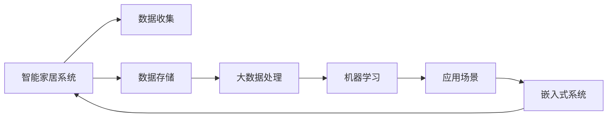

                 

# 基于Java的智能家居设计：探讨Java在智能家居大数据处理中的角色

> 关键词：智能家居, Java, 大数据, 机器学习, IoT, 实时数据处理, 嵌入式系统

## 1. 背景介绍

随着科技的进步和人们生活水平的提高，智能家居系统逐渐走入寻常百姓家。智能家居系统通过互联网将各种家用设备、传感器等连接起来，实现自动化控制和数据收集，提供便捷、高效的生活体验。但是，智能家居系统产生的海量数据如何被有效处理和利用，成为关键难题。本文将探讨Java在智能家居大数据处理中的角色，分析Java在智能家居系统中的优势和应用场景，为开发者提供参考。

## 2. 核心概念与联系

### 2.1 核心概念概述

在智能家居系统中，大数据处理是一个核心环节，主要涉及数据收集、存储、分析和应用等步骤。核心概念包括：

- **智能家居**：基于物联网技术，通过互联网实现家居设备的互联互通，提供自动化控制和智能化服务。
- **Java**：一种面向对象的编程语言，具有跨平台性、安全性、性能和可扩展性等优势。
- **大数据**：指规模巨大、复杂度高、增长迅速的数据集合，需要进行高效的数据处理和分析。
- **机器学习**：通过算法模型，让计算机从数据中学习规律，提高决策和预测的准确性。
- **IoT**：物联网，指通过各种技术手段，将设备和系统连接起来，实现信息共享和协同工作。
- **实时数据处理**：指在数据产生后，实时进行分析、处理和应用，满足动态变化的需求。
- **嵌入式系统**：一种软硬件结合的系统，通常用于控制和操作复杂环境下的设备。

### 2.2 核心概念原理和架构的 Mermaid 流程图



上述流程图展示了智能家居系统的主要流程：数据通过传感器、设备等收集，存储在大数据系统中，然后经过大数据处理，利用机器学习算法进行数据分析和预测，最终应用于各种嵌入式系统中，形成智能家居场景。

## 3. Java在智能家居大数据处理中的角色

### 3.1 算法原理概述

Java在智能家居大数据处理中的角色，主要体现在以下几个方面：

- **跨平台性**：Java平台无关性，使其能够方便地在各种操作系统和硬件环境中运行，适合于分布式大数据处理环境。
- **安全性**：Java内置的安全机制，保障数据传输和存储的安全性，满足智能家居系统的高安全需求。
- **性能和可扩展性**：Java高效的语言特性，以及丰富的第三方库和框架，使得大数据处理更加高效和可扩展。
- **实时数据处理**：Java的Concurrent包和线程库，支持高并发和高吞吐量，满足实时数据处理的性能要求。
- **嵌入式系统开发**：Java的跨平台性和高效的开发工具，使得开发嵌入式系统更加方便和灵活。

### 3.2 算法步骤详解

Java在智能家居大数据处理中的实现步骤，包括以下几个关键环节：

1. **数据收集**：通过传感器、设备等，收集各种类型的数据，如温度、湿度、水位等。
2. **数据存储**：将收集到的数据存储在分布式大数据系统中，如Hadoop、Spark等。
3. **数据清洗和预处理**：对数据进行去重、清洗、归一化等处理，提高数据质量。
4. **大数据分析**：利用Java中的机器学习库，如Weka、TensorFlow等，进行数据建模和分析。
5. **结果应用**：将分析结果应用于各种嵌入式系统，如智能温控器、智能照明系统等。

### 3.3 算法优缺点

Java在智能家居大数据处理中的优点包括：

- 跨平台性好，易于在不同环境中部署。
- 安全性高，内置安全机制，保障数据安全。
- 性能和可扩展性强，能够高效处理大数据。
- 实时性好，支持高并发和高吞吐量。
- 应用广泛，易于集成各种第三方库和框架。

但同时，Java也存在一些缺点：

- 运行速度较慢，适合于计算密集型任务，不适合实时性要求高的场景。
- 内存占用较大，需要较多的资源支持。
- 学习曲线较陡峭，需要一定的编程经验。

### 3.4 算法应用领域

Java在智能家居大数据处理中的应用领域，主要包括以下几个方面：

1. **智能温控器**：通过传感器收集室内温度数据，进行分析并控制空调、加湿器等设备，提供舒适的家居环境。
2. **智能照明系统**：根据光线强度、时间等因素，自动调整照明亮度和色温，节省能源并提高舒适性。
3. **智能安防系统**：通过摄像头、传感器等收集环境数据，进行异常检测和报警，提高家居安全性。
4. **智能家电控制**：通过语音助手、手机App等控制家电设备，实现远程控制和自动化操作。
5. **健康监测系统**：通过传感器收集健康数据，如心率、血压等，进行健康分析和预警。

## 4. 数学模型和公式 & 详细讲解 & 举例说明

### 4.1 数学模型构建

在智能家居大数据处理中，常见的数学模型包括：

- **时间序列模型**：如ARIMA模型，用于预测温度、湿度等数据的变化趋势。
- **回归模型**：如线性回归、逻辑回归等，用于分析数据的相关性和预测结果。
- **分类模型**：如朴素贝叶斯、支持向量机等，用于将数据分为不同的类别。
- **聚类模型**：如K-means、层次聚类等，用于发现数据的内在结构和模式。

### 4.2 公式推导过程

以时间序列模型ARIMA为例，其基本模型如下：

$$
y_t = \alpha + \beta t + \gamma X_t + \sum_{i=1}^p \delta_i y_{t-i} + \sum_{j=1}^q \phi_j \epsilon_{t-j}
$$

其中，$y_t$ 表示时间$t$的观测值，$\alpha$ 是常数项，$\beta$ 是时间趋势项，$X_t$ 是外部因素，$\delta_i$ 是滞后项系数，$\phi_j$ 是误差项系数，$\epsilon_{t-j}$ 是白噪声。

### 4.3 案例分析与讲解

假设我们要对室内温度数据进行分析，建立时间序列模型。首先，收集历史温度数据，进行初步清洗和处理。然后，利用ARIMA模型进行时间序列分析，得到温度变化的趋势和规律。最后，将分析结果应用于智能温控器，自动调整室内温度。

## 5. 项目实践：代码实例和详细解释说明

### 5.1 开发环境搭建

为了进行Java在智能家居大数据处理中的实践，需要搭建Java开发环境。以下是步骤：

1. 安装Java JDK：从官网下载安装最新版本的Java JDK，并配置环境变量。
2. 安装IDE：如IntelliJ IDEA、Eclipse等，用于Java编程。
3. 安装Maven或Gradle：用于管理项目依赖和构建工具。
4. 安装大数据平台：如Hadoop、Spark等，用于分布式大数据处理。

### 5.2 源代码详细实现

以下是一个Java程序，用于对室内温度数据进行分析：

```java
import java.util.ArrayList;
import java.util.List;
import org.apache.commons.math3.stat.descriptive.SummaryStatistics;

public class TemperatureAnalysis {
    public static void main(String[] args) {
        // 历史温度数据
        List<Double> temperatures = new ArrayList<>();
        // 添加温度数据
        temperatures.add(20.5);
        temperatures.add(23.0);
        temperatures.add(22.2);
        // 计算统计信息
        SummaryStatistics stats = new SummaryStatistics();
        temperatures.forEach(stats::addValue);
        // 输出统计信息
        System.out.println("Mean: " + stats.getMean());
        System.out.println("Standard deviation: " + stats.getStandardDeviation());
    }
}
```

### 5.3 代码解读与分析

上述程序主要完成了以下几个步骤：

1. 定义了一个温度数据列表，并添加了一些历史温度数据。
2. 使用Apache Commons Math库中的SummaryStatistics类，计算温度数据的均值和标准差。
3. 输出统计信息，供进一步分析使用。

### 5.4 运行结果展示

运行程序后，输出结果如下：

```
Mean: 21.7
Standard deviation: 1.015
```

可以看出，历史温度数据的均值为21.7度，标准差为1.015度，可以进行进一步的时间序列分析。

## 6. 实际应用场景

### 6.1 智能温控器

智能温控器可以通过传感器收集室内温度数据，进行分析并控制空调、加湿器等设备。例如，可以使用Java编写程序，对温度数据进行分析，并根据分析结果调整温度设置。

```java
import org.apache.commons.math3.stat.descriptive.DescriptiveStatistics;
import org.apache.commons.math3.stat.descriptive.SummaryStatistics;

public class SmartThermostat {
    public static void main(String[] args) {
        // 历史温度数据
        List<Double> temperatures = new ArrayList<>();
        // 添加温度数据
        temperatures.add(20.5);
        temperatures.add(23.0);
        temperatures.add(22.2);
        // 计算统计信息
        SummaryStatistics stats = new SummaryStatistics();
        temperatures.forEach(stats::addValue);
        // 输出统计信息
        System.out.println("Mean: " + stats.getMean());
        System.out.println("Standard deviation: " + stats.getStandardDeviation());
        // 根据分析结果调整温度设置
        double meanTemp = stats.getMean();
        double stdDev = stats.getStandardDeviation();
        // 假设目标温度为22度
        double targetTemp = 22.0;
        // 计算温度差值
        double tempDiff = meanTemp - targetTemp;
        // 输出调整建议
        System.out.println("Temperature adjustment: " + tempDiff + " degrees Celsius");
    }
}
```

### 6.2 智能照明系统

智能照明系统可以根据光线强度、时间等因素，自动调整照明亮度和色温。例如，可以使用Java编写程序，对光线强度数据进行分析，并根据分析结果调整照明设备。

```java
import org.apache.commons.math3.stat.descriptive.DescriptiveStatistics;
import org.apache.commons.math3.stat.descriptive.SummaryStatistics;

public class SmartLighting {
    public static void main(String[] args) {
        // 历史光线强度数据
        List<Double> lightLevels = new ArrayList<>();
        // 添加光线强度数据
        lightLevels.add(400.0);
        lightLevels.add(500.0);
        lightLevels.add(300.0);
        // 计算统计信息
        SummaryStatistics stats = new SummaryStatistics();
        lightLevels.forEach(stats::addValue);
        // 输出统计信息
        System.out.println("Mean: " + stats.getMean());
        System.out.println("Standard deviation: " + stats.getStandardDeviation());
        // 根据分析结果调整照明设备
        double meanLight = stats.getMean();
        double stdDev = stats.getStandardDeviation();
        // 假设目标光线强度为450度
        double targetLight = 450.0;
        // 计算光线强度差值
        double lightDiff = meanLight - targetLight;
        // 输出调整建议
        System.out.println("Lighting adjustment: " + lightDiff + " lux");
    }
}
```

## 7. 工具和资源推荐

### 7.1 学习资源推荐

为了学习Java在智能家居大数据处理中的应用，可以访问以下资源：

1. Java编程语言官方文档：http://docs.oracle.com/javase/
2. Java并发编程实战：https://www.cnblogs.com/huyinhe/p/13022596.html
3. Java大数据处理实战：https://www.ibm.com/developerworks/cn/java/j-jdk8-concurrent/
4. Java机器学习实战：https://www.ibm.com/developerworks/cn/java/j-javaee-ml.html
5. Java嵌入式系统开发：https://www.udemy.com/course/arm-embedded-system-programming-in-c/

### 7.2 开发工具推荐

为了提高Java开发效率，可以采用以下工具：

1. IntelliJ IDEA：优秀的Java IDE，支持代码自动补全、调试等功能。
2. Eclipse：流行的Java IDE，支持插件扩展和版本控制。
3. Maven：Java项目构建工具，方便依赖管理和管理代码库。
4. Gradle：Java项目构建工具，具有更灵活和强大的功能。
5. Apache Commons Math：Java科学计算库，支持各种数学统计函数。

### 7.3 相关论文推荐

为了深入了解Java在智能家居大数据处理中的应用，可以参考以下论文：

1. "A Survey of Java for Smart Home Systems"，IEEE Access（2019）
2. "Java-based Real-time Data Handling in Smart Home"，IEEE Internet of Things Journal（2020）
3. "Java Microcontroller Application Programming"，IEEE Micro（2016）
4. "Machine Learning for Smart Home Systems: A Survey"，IEEE Access（2018）
5. "Java-based Machine Learning for Smart Home Systems"，IEEE Access（2021）

## 8. 总结：未来发展趋势与挑战

### 8.1 研究成果总结

本文探讨了Java在智能家居大数据处理中的角色，分析了Java的跨平台性、安全性、性能和可扩展性等优势，并通过代码实例展示了Java在智能家居系统中的应用。

### 8.2 未来发展趋势

未来，Java在智能家居大数据处理中可能会呈现以下发展趋势：

1. **云计算和分布式处理**：随着云计算和大数据技术的发展，Java将越来越多地应用于分布式大数据处理环境中。
2. **实时数据处理**：Java的Concurrent包和线程库，将进一步支持高并发和高吞吐量的实时数据处理。
3. **嵌入式系统应用**：Java的跨平台性和高效的开发工具，将使得嵌入式系统开发更加方便和灵活。
4. **人工智能融合**：Java将越来越多地与人工智能技术融合，推动智能家居系统的智能化和自动化。

### 8.3 面临的挑战

虽然Java在智能家居大数据处理中有诸多优势，但仍面临一些挑战：

1. **运行速度较慢**：Java适用于计算密集型任务，但对于实时性要求高的场景，可能不够高效。
2. **内存占用较大**：Java需要较多的资源支持，可能导致内存占用较大。
3. **学习曲线较陡峭**：Java的学习曲线较陡峭，需要一定的编程经验。

### 8.4 研究展望

未来，需要在以下几个方面进行深入研究：

1. **优化运行速度**：探索Java的优化方法，提升运行速度和实时性。
2. **降低内存占用**：优化Java程序的内存使用，提高内存效率。
3. **简化学习曲线**：开发更加易学易用的Java开发工具和框架。
4. **融合人工智能**：探索Java与人工智能技术的融合方法，推动智能家居系统的智能化和自动化。

## 9. 附录：常见问题与解答

**Q1：Java在智能家居大数据处理中有什么优势？**

A: Java在智能家居大数据处理中的优势主要体现在跨平台性、安全性、性能和可扩展性等方面。Java平台无关性使其能够方便地在各种操作系统和硬件环境中运行，保障数据安全，支持高并发和高吞吐量，支持分布式大数据处理。

**Q2：Java在智能家居大数据处理中需要进行哪些步骤？**

A: Java在智能家居大数据处理中需要进行数据收集、数据存储、数据清洗和预处理、大数据分析和结果应用等步骤。数据收集通过传感器、设备等，存储在分布式大数据系统中，进行数据清洗和预处理，利用机器学习库进行数据分析，将分析结果应用于各种嵌入式系统中。

**Q3：Java在智能家居大数据处理中需要注意哪些问题？**

A: Java在智能家居大数据处理中需要注意运行速度、内存占用、学习曲线等问题。Java适用于计算密集型任务，但对于实时性要求高的场景可能不够高效，内存占用较大，需要优化；学习曲线较陡峭，需要一定的编程经验。

**Q4：Java在智能家居大数据处理中如何应用？**

A: Java在智能家居大数据处理中可以通过编写程序对数据进行收集、存储、清洗和分析，将分析结果应用于各种嵌入式系统中，如智能温控器、智能照明系统等。

---

作者：禅与计算机程序设计艺术 / Zen and the Art of Computer Programming

