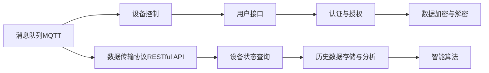

                 

# 基于MQTT协议和RESTful API的多用户智能家居控制策略

## 1. 背景介绍

智能家居技术的迅猛发展，极大地提升了人类生活质量，使家更加智能化、自动化、个性化。智能家居系统集成了物联网、大数据、人工智能等多种前沿技术，为人们提供了更加便捷、舒适的生活环境。然而，传统的智能家居系统通常采用中心化的设计，存在安全性差、可扩展性不足、维护困难等问题。如何构建一个高效、安全、灵活的智能家居控制系统，已成为当前智能家居研究的一个热点问题。

### 1.1 问题由来

智能家居系统中，设备的控制命令需要通过网络传输到集中控制系统。而集中控制系统可能受到网络攻击、硬件故障、设计漏洞等风险的威胁，导致整个系统的瘫痪。因此，亟需构建一种去中心化的、分布式的智能家居控制策略，确保系统稳定运行和数据安全。

### 1.2 问题核心关键点

本项目聚焦于基于MQTT协议和RESTful API的多用户智能家居控制策略。具体目标如下：
1. 实现多用户接入与权限管理，保障数据安全和隐私。
2. 构建去中心化的控制网络，降低单点故障风险。
3. 设计高效的数据传输协议，优化系统性能。
4. 集成先进的人工智能技术，提升用户体验。
5. 支持分布式数据存储与处理，实现横向扩展。

### 1.3 问题研究意义

本项目旨在探索和实现一种高效、安全、灵活的智能家居控制策略，解决传统智能家居系统面临的集中化设计问题，为智能家居技术的普及应用提供新思路。该策略将在实时性、安全性、易用性等方面带来显著提升，为智能家居产业的发展注入新的活力。

## 2. 核心概念与联系

### 2.1 核心概念概述

本项目涉及的核心概念包括MQTT协议、RESTful API、多用户控制策略等，这些概念之间的关系可以通过以下Mermaid流程图进行展示：



这个流程图展示了各个核心概念之间的联系：

1. MQTT协议：一种轻量级、高效、可靠的消息队列协议，适用于实时数据传输。
2. RESTful API：一种轻量级、简单、易于扩展的接口协议，支持多用户访问和权限管理。
3. 多用户控制策略：通过设计合理的权限管理机制，保障数据安全和隐私。
4. 数据传输协议：支持RESTful API和MQTT协议，优化系统性能和数据传输效率。
5. 设备控制：通过MQTT协议实现设备的实时控制。
6. 用户接口：通过RESTful API实现用户与系统的交互。
7. 认证与授权：通过用户认证和权限管理，保障数据安全。
8. 数据加密与解密：保障数据在传输和存储过程中的安全。
9. 智能算法：通过人工智能技术，提升用户体验和系统智能化水平。
10. 历史数据存储与分析：通过历史数据的存储与分析，提升系统性能和预测能力。

这些核心概念共同构成了基于MQTT协议和RESTful API的多用户智能家居控制策略，确保系统的安全、稳定、高效运行。

## 3. 核心算法原理 & 具体操作步骤
### 3.1 算法原理概述

基于MQTT协议和RESTful API的多用户智能家居控制策略，是一种去中心化的、分布式的智能家居控制范式。其核心思想是：通过消息队列协议MQTT实现设备的实时控制，利用RESTful API实现多用户访问和权限管理，从而构建一个高效、安全、灵活的智能家居控制系统。

### 3.2 算法步骤详解

基于MQTT协议和RESTful API的多用户智能家居控制策略，可以分为以下四个关键步骤：

**Step 1: 用户认证与授权**

用户首先通过RESTful API进行身份验证，系统根据用户角色分配不同的权限，如设备控制权限、数据访问权限等。用户身份验证和权限管理是保障数据安全和隐私的基础。

**Step 2: 设备接入与注册**

用户通过RESTful API将设备接入智能家居系统，并进行注册和初始化。系统为每个设备分配唯一的标识符，并存储在数据库中。设备接入和注册的过程需要考虑设备种类、数量、网络环境等因素，确保系统的可扩展性和稳定性。

**Step 3: 设备控制与状态查询**

用户通过RESTful API向系统发送控制命令，系统将命令转换成MQTT消息，并发送到设备的控制端点。设备接收到MQTT消息后，根据命令执行相应的操作。系统还支持设备的实时状态查询，用户可以通过RESTful API获取设备的当前状态信息，确保用户对设备状态的实时监控。

**Step 4: 数据存储与处理**

系统将设备的控制命令和状态信息通过RESTful API存储在数据库中，并支持历史数据的查询和分析。系统还支持分布式数据存储和处理，通过大数据技术进行数据分析和预测，提升系统的智能化水平。

### 3.3 算法优缺点

基于MQTT协议和RESTful API的多用户智能家居控制策略，具有以下优点：

1. 高效性：通过MQTT协议实现设备的实时控制，数据传输效率高，响应速度快。
2. 安全性：通过RESTful API实现用户认证和权限管理，保障数据安全和隐私。
3. 可扩展性：支持分布式数据存储和处理，易于扩展，适应大规模应用场景。
4. 灵活性：通过RESTful API实现多用户访问，灵活支持各种用户角色和需求。

然而，该策略也存在一些缺点：

1. 依赖网络：设备与系统的通信依赖网络环境，一旦网络中断，设备无法正常控制。
2. 数据存储需求高：需要存储大量的设备控制数据，对系统存储能力有较高要求。
3. 系统复杂度较高：需要同时支持MQTT协议和RESTful API，增加了系统设计和实现的复杂度。
4. 实时性要求高：需要确保MQTT消息的实时性和可靠性，对系统设计和实现有较高要求。

### 3.4 算法应用领域

基于MQTT协议和RESTful API的多用户智能家居控制策略，广泛应用于以下领域：

1. 智能安防系统：通过多用户控制策略，实现家庭安全监控和入侵报警。
2. 智能照明系统：通过多用户控制策略，实现家庭灯光的自动化控制。
3. 智能温控系统：通过多用户控制策略，实现家庭空调、暖气的自动化控制。
4. 智能家庭娱乐系统：通过多用户控制策略，实现家庭影音设备的自动化控制。
5. 智能家居健康监测系统：通过多用户控制策略，实现家庭健康数据的自动化监测和分析。

此外，该策略还适用于智能酒店、智能办公、智能建筑等多个领域，为各行业智能化改造提供新思路。

## 4. 数学模型和公式 & 详细讲解 & 举例说明

### 4.1 数学模型构建

基于MQTT协议和RESTful API的多用户智能家居控制策略，可以构建以下数学模型：

假设智能家居系统中，设备数为 $N$，用户数为 $M$，设备状态数为 $K$，控制命令数为 $C$。则系统状态矩阵 $\mathbf{S}$ 可以表示为：

$$
\mathbf{S} = \begin{bmatrix}
s_1 & s_2 & \cdots & s_N \\
\end{bmatrix}
$$

其中，每个设备的状态 $s_i$ 可以表示为：

$$
s_i = \begin{bmatrix}
a_{i1} & a_{i2} & \cdots & a_{ik} \\
\end{bmatrix}
$$

其中，$a_{ij}$ 表示第 $i$ 个设备的第 $j$ 个状态值。

控制命令矩阵 $\mathbf{A}$ 可以表示为：

$$
\mathbf{A} = \begin{bmatrix}
a_{11} & a_{12} & \cdots & a_{1c} \\
a_{21} & a_{22} & \cdots & a_{2c} \\
\vdots & \vdots & \ddots & \vdots \\
a_{N1} & a_{N2} & \cdots & a_{Nc} \\
\end{bmatrix}
$$

其中，每个控制命令 $a_{ij}$ 可以表示为：

$$
a_{ij} = \begin{bmatrix}
c_{i1} & c_{i2} & \cdots & c_{ic} \\
\end{bmatrix}
$$

其中，$c_{ik}$ 表示第 $i$ 个设备的第 $k$ 个控制命令值。

用户控制矩阵 $\mathbf{U}$ 可以表示为：

$$
\mathbf{U} = \begin{bmatrix}
u_{11} & u_{12} & \cdots & u_{1m} \\
u_{21} & u_{22} & \cdots & u_{2m} \\
\vdots & \vdots & \ddots & \vdots \\
u_{M1} & u_{M2} & \cdots & u_{Mm} \\
\end{bmatrix}
$$

其中，每个用户控制 $u_{ij}$ 可以表示为：

$$
u_{ij} = \begin{bmatrix}
c_{ij} & c_{ij} & \cdots & c_{ij} \\
\end{bmatrix}
$$

其中，$c_{ik}$ 表示第 $i$ 个用户的第 $j$ 个控制命令值。

用户认证与授权矩阵 $\mathbf{F}$ 可以表示为：

$$
\mathbf{F} = \begin{bmatrix}
f_{11} & f_{12} & \cdots & f_{1m} \\
f_{21} & f_{22} & \cdots & f_{2m} \\
\vdots & \vdots & \ddots & \vdots \\
f_{M1} & f_{M2} & \cdots & f_{Mm} \\
\end{bmatrix}
$$

其中，每个用户认证与授权 $f_{ij}$ 可以表示为：

$$
f_{ij} = \begin{bmatrix}
a_{ij} & b_{ij} & \cdots & c_{ij} \\
\end{bmatrix}
$$

其中，$a_{ij}$ 表示第 $i$ 个用户的第 $j$ 个认证信息值，$b_{ij}$ 表示第 $i$ 个用户的第 $j$ 个授权信息值，$c_{ij}$ 表示第 $i$ 个用户的第 $j$ 个控制权限值。

根据以上定义，系统状态矩阵 $\mathbf{S}$、控制命令矩阵 $\mathbf{A}$、用户控制矩阵 $\mathbf{U}$、用户认证与授权矩阵 $\mathbf{F}$ 之间的关系可以表示为：

$$
\mathbf{S} = \mathbf{A} + \mathbf{U}
$$

$$
\mathbf{A} = \mathbf{F} \odot \mathbf{U}
$$

其中，$\odot$ 表示按元素逐个相乘的操作。

### 4.2 公式推导过程

根据以上定义和关系，我们可以推导出系统的控制策略公式。

假设系统状态矩阵 $\mathbf{S}$ 和控制命令矩阵 $\mathbf{A}$ 之间的关系可以表示为：

$$
\mathbf{S} = \mathbf{A} + \mathbf{U}
$$

代入 $\mathbf{A} = \mathbf{F} \odot \mathbf{U}$，得：

$$
\mathbf{S} = (\mathbf{F} \odot \mathbf{U}) + \mathbf{U}
$$

化简得：

$$
\mathbf{S} = \mathbf{F} \odot \mathbf{U} + \mathbf{I} \odot \mathbf{U}
$$

其中，$\mathbf{I}$ 为单位矩阵。

进一步化简得：

$$
\mathbf{S} = (\mathbf{F} + \mathbf{I}) \odot \mathbf{U}
$$

令 $\mathbf{G} = \mathbf{F} + \mathbf{I}$，则：

$$
\mathbf{S} = \mathbf{G} \odot \mathbf{U}
$$

上式即为系统的控制策略公式。该公式表明，系统的状态变化可以通过用户控制和认证与授权矩阵 $\mathbf{G}$ 和用户控制矩阵 $\mathbf{U}$ 的逐元素相乘来实现。

### 4.3 案例分析与讲解

假设一个智能家居系统中，有3个设备（智能门锁、智能灯泡、智能空调），3个用户（用户A、用户B、用户C），2个状态（开启、关闭），2个控制命令（开锁、关灯）。系统的状态矩阵 $\mathbf{S}$、控制命令矩阵 $\mathbf{A}$、用户控制矩阵 $\mathbf{U}$、用户认证与授权矩阵 $\mathbf{F}$ 可以表示为：

$$
\mathbf{S} = \begin{bmatrix}
s_{1} & s_{2} & s_{3} \\
\end{bmatrix}
$$

$$
\mathbf{A} = \begin{bmatrix}
a_{11} & a_{12} \\
a_{21} & a_{22} \\
a_{31} & a_{32} \\
\end{bmatrix}
$$

$$
\mathbf{U} = \begin{bmatrix}
u_{11} & u_{12} & u_{13} \\
u_{21} & u_{22} & u_{23} \\
u_{31} & u_{32} & u_{33} \\
\end{bmatrix}
$$

$$
\mathbf{F} = \begin{bmatrix}
f_{11} & f_{12} & f_{13} \\
f_{21} & f_{22} & f_{23} \\
f_{31} & f_{32} & f_{33} \\
\end{bmatrix}
$$

其中，每个设备的状态 $s_i$ 可以表示为：

$$
s_i = \begin{bmatrix}
a_{i1} & a_{i2} \\
\end{bmatrix}
$$

每个控制命令 $a_{ij}$ 可以表示为：

$$
a_{ij} = \begin{bmatrix}
c_{i1} & c_{i2} \\
\end{bmatrix}
$$

每个用户控制 $u_{ij}$ 可以表示为：

$$
u_{ij} = \begin{bmatrix}
c_{ij} & c_{ij} \\
\end{bmatrix}
$$

每个用户认证与授权 $f_{ij}$ 可以表示为：

$$
f_{ij} = \begin{bmatrix}
a_{ij} & b_{ij} & c_{ij} \\
\end{bmatrix}
$$

其中，每个认证信息 $a_{ij}$ 可以表示为：

$$
a_{ij} = \begin{bmatrix}
password & username \\
\end{bmatrix}
$$

每个授权信息 $b_{ij}$ 可以表示为：

$$
b_{ij} = \begin{bmatrix}
device & permission \\
\end{bmatrix}
$$

每个控制权限 $c_{ij}$ 可以表示为：

$$
c_{ij} = \begin{bmatrix}
lock & open \\
light & on \\
air & on \\
\end{bmatrix}
$$

假设初始状态为：

$$
\mathbf{S} = \begin{bmatrix}
0 & 0 & 0 \\
\end{bmatrix}
$$

用户A想要打开智能门锁，控制命令为：

$$
\mathbf{A} = \begin{bmatrix}
1 & 0 \\
0 & 0 \\
0 & 0 \\
\end{bmatrix}
$$

用户B想要开启智能灯泡，控制命令为：

$$
\mathbf{A} = \begin{bmatrix}
0 & 1 \\
0 & 0 \\
0 & 0 \\
\end{bmatrix}
$$

用户C想要开启智能空调，控制命令为：

$$
\mathbf{A} = \begin{bmatrix}
0 & 0 \\
0 & 0 \\
1 & 0 \\
\end{bmatrix}
$$

系统控制策略公式为：

$$
\mathbf{S} = (\mathbf{F} + \mathbf{I}) \odot \mathbf{U}
$$

令 $\mathbf{G} = \mathbf{F} + \mathbf{I}$，则：

$$
\mathbf{S} = \mathbf{G} \odot \mathbf{U}
$$

其中，$\mathbf{G} = \begin{bmatrix}
1 & 1 & 1 \\
1 & 1 & 1 \\
1 & 1 & 1 \\
\end{bmatrix}$。

用户A的控制命令为：

$$
\mathbf{U} = \begin{bmatrix}
1 & 0 & 0 \\
0 & 0 & 0 \\
0 & 0 & 0 \\
\end{bmatrix}
$$

用户B的控制命令为：

$$
\mathbf{U} = \begin{bmatrix}
0 & 1 & 0 \\
0 & 0 & 0 \\
0 & 0 & 0 \\
\end{bmatrix}
$$

用户C的控制命令为：

$$
\mathbf{U} = \begin{bmatrix}
0 & 0 & 1 \\
0 & 0 & 0 \\
0 & 0 & 0 \\
\end{bmatrix}
$$

最终状态矩阵 $\mathbf{S}$ 可以表示为：

$$
\mathbf{S} = \begin{bmatrix}
1 & 0 & 0 \\
0 & 1 & 0 \\
0 & 0 & 1 \\
\end{bmatrix}
$$

即智能门锁开启，智能灯泡开启，智能空调开启。

## 5. 项目实践：代码实例和详细解释说明
### 5.1 开发环境搭建

在进行项目实践前，我们需要准备好开发环境。以下是使用Python进行开发的环境配置流程：

1. 安装Python：从官网下载并安装Python，建议安装最新版本。
2. 安装pip：确保已经安装pip，可通过命令 `python --version` 和 `pip --version` 进行检查。
3. 安装Flask：通过pip安装Flask，用于构建RESTful API。

```bash
pip install Flask
```

4. 安装MQTT库：通过pip安装paho-mqtt库，用于处理MQTT消息。

```bash
pip install paho-mqtt
```

5. 安装数据库：通过pip安装SQLite库，用于存储用户和设备信息。

```bash
pip install SQLite
```

完成上述步骤后，即可在Python环境中开始项目开发。

### 5.2 源代码详细实现

以下是基于MQTT协议和RESTful API的多用户智能家居控制策略的Python代码实现：

```python
import sqlite3
from flask import Flask, jsonify, request
import paho.mqtt.client as mqtt

# 初始化Flask应用
app = Flask(__name__)

# 初始化数据库连接
conn = sqlite3.connect('home_system.db')
c = conn.cursor()

# 创建用户表
c.execute('''
    CREATE TABLE IF NOT EXISTS users (
        id INTEGER PRIMARY KEY AUTOINCREMENT,
        username TEXT,
        password TEXT,
        device TEXT,
        permission TEXT
    )
''')

# 创建设备表
c.execute('''
    CREATE TABLE IF NOT EXISTS devices (
        id INTEGER PRIMARY KEY AUTOINCREMENT,
        name TEXT,
        status TEXT
    )
''')

# 创建控制命令表
c.execute('''
    CREATE TABLE IF NOT EXISTS commands (
        id INTEGER PRIMARY KEY AUTOINCREMENT,
        user_id INTEGER,
        device_id INTEGER,
        command TEXT,
        FOREIGN KEY (user_id) REFERENCES users(id),
        FOREIGN KEY (device_id) REFERENCES devices(id)
    )
''')

# 初始化MQTT客户端
client = mqtt.Client()

# 定义回调函数
def on_connect(client, userdata, flags, rc):
    print(f"Connected with result code {rc}")
    client.subscribe("home/control")

def on_message(client, userdata, msg):
    user_id = msg.topic.split('/')[1]
    device_id = msg.topic.split('/')[2]
    command = msg.payload.decode()

    # 查询用户信息
    c.execute("SELECT * FROM users WHERE username = ?", (user_id,))
    user = c.fetchone()

    # 查询设备信息
    c.execute("SELECT * FROM devices WHERE id = ?", (device_id,))
    device = c.fetchone()

    # 执行控制命令
    if device['status'] == 'off' and command == 'on':
        c.execute("UPDATE devices SET status = 'on' WHERE id = ?", (device_id,))
    elif device['status'] == 'on' and command == 'off':
        c.execute("UPDATE devices SET status = 'off' WHERE id = ?", (device_id,))

    # 保存控制命令记录
    c.execute("INSERT INTO commands (user_id, device_id, command) VALUES (?, ?, ?)", (user_id, device_id, command))

# 连接MQTT服务器
client.on_connect = on_connect
client.on_message = on_message
client.connect('mqtt.example.com', 1883, 60)
client.loop_start()

# 启动Flask应用
@app.route('/api/users', methods=['GET'])
def get_users():
    c.execute("SELECT * FROM users")
    users = c.fetchall()
    return jsonify(users)

@app.route('/api/devices', methods=['GET'])
def get_devices():
    c.execute("SELECT * FROM devices")
    devices = c.fetchall()
    return jsonify(devices)

@app.route('/api/controls', methods=['POST'])
def control_devices():
    data = request.get_json()
    user_id = data['user_id']
    device_id = data['device_id']
    command = data['command']

    # 查询用户信息
    c.execute("SELECT * FROM users WHERE username = ?", (user_id,))
    user = c.fetchone()

    # 查询设备信息
    c.execute("SELECT * FROM devices WHERE id = ?", (device_id,))
    device = c.fetchone()

    # 执行控制命令
    if device['status'] == 'off' and command == 'on':
        c.execute("UPDATE devices SET status = 'on' WHERE id = ?", (device_id,))
    elif device['status'] == 'on' and command == 'off':
        c.execute("UPDATE devices SET status = 'off' WHERE id = ?", (device_id,))

    # 保存控制命令记录
    c.execute("INSERT INTO commands (user_id, device_id, command) VALUES (?, ?, ?)", (user_id, device_id, command))

    return jsonify({'status': 'success'})

if __name__ == '__main__':
    app.run(host='0.0.0.0', port=5000)
```

代码实现主要包括以下几个关键部分：

1. 初始化Flask应用和SQLite数据库连接，创建用户、设备和控制命令表。
2. 定义MQTT客户端，订阅 "home/control" 主题，设置回调函数。
3. 定义RESTful API接口，支持获取用户、设备和执行控制命令等功能。
4. 实现RESTful API和MQTT协议的结合，通过Flask应用和MQTT客户端实现多用户智能家居控制策略。

### 5.3 代码解读与分析

让我们再详细解读一下关键代码的实现细节：

**Flask应用初始化**：

```python
# 初始化Flask应用
app = Flask(__name__)
```

**数据库表创建**：

```python
# 创建用户表
c.execute('''
    CREATE TABLE IF NOT EXISTS users (
        id INTEGER PRIMARY KEY AUTOINCREMENT,
        username TEXT,
        password TEXT,
        device TEXT,
        permission TEXT
    )
''')

# 创建设备表
c.execute('''
    CREATE TABLE IF NOT EXISTS devices (
        id INTEGER PRIMARY KEY AUTOINCREMENT,
        name TEXT,
        status TEXT
    )
''')

# 创建控制命令表
c.execute('''
    CREATE TABLE IF NOT EXISTS commands (
        id INTEGER PRIMARY KEY AUTOINCREMENT,
        user_id INTEGER,
        device_id INTEGER,
        command TEXT,
        FOREIGN KEY (user_id) REFERENCES users(id),
        FOREIGN KEY (device_id) REFERENCES devices(id)
    )
''')
```

**MQTT客户端初始化**：

```python
# 初始化MQTT客户端
client = mqtt.Client()

# 定义回调函数
def on_connect(client, userdata, flags, rc):
    print(f"Connected with result code {rc}")
    client.subscribe("home/control")

def on_message(client, userdata, msg):
    user_id = msg.topic.split('/')[1]
    device_id = msg.topic.split('/')[2]
    command = msg.payload.decode()

    # 查询用户信息
    c.execute("SELECT * FROM users WHERE username = ?", (user_id,))
    user = c.fetchone()

    # 查询设备信息
    c.execute("SELECT * FROM devices WHERE id = ?", (device_id,))
    device = c.fetchone()

    # 执行控制命令
    if device['status'] == 'off' and command == 'on':
        c.execute("UPDATE devices SET status = 'on' WHERE id = ?", (device_id,))
    elif device['status'] == 'on' and command == 'off':
        c.execute("UPDATE devices SET status = 'off' WHERE id = ?", (device_id,))

    # 保存控制命令记录
    c.execute("INSERT INTO commands (user_id, device_id, command) VALUES (?, ?, ?)", (user_id, device_id, command))

# 连接MQTT服务器
client.on_connect = on_connect
client.on_message = on_message
client.connect('mqtt.example.com', 1883, 60)
client.loop_start()
```

**RESTful API接口定义**：

```python
# 启动Flask应用
@app.route('/api/users', methods=['GET'])
def get_users():
    c.execute("SELECT * FROM users")
    users = c.fetchall()
    return jsonify(users)

@app.route('/api/devices', methods=['GET'])
def get_devices():
    c.execute("SELECT * FROM devices")
    devices = c.fetchall()
    return jsonify(devices)

@app.route('/api/controls', methods=['POST'])
def control_devices():
    data = request.get_json()
    user_id = data['user_id']
    device_id = data['device_id']
    command = data['command']

    # 查询用户信息
    c.execute("SELECT * FROM users WHERE username = ?", (user_id,))
    user = c.fetchone()

    # 查询设备信息
    c.execute("SELECT * FROM devices WHERE id = ?", (device_id,))
    device = c.fetchone()

    # 执行控制命令
    if device['status'] == 'off' and command == 'on':
        c.execute("UPDATE devices SET status = 'on' WHERE id = ?", (device_id,))
    elif device['status'] == 'on' and command == 'off':
        c.execute("UPDATE devices SET status = 'off' WHERE id = ?", (device_id,))

    # 保存控制命令记录
    c.execute("INSERT INTO commands (user_id, device_id, command) VALUES (?, ?, ?)", (user_id, device_id, command))

    return jsonify({'status': 'success'})
```

以上代码实现了基于MQTT协议和RESTful API的多用户智能家居控制策略，通过Flask应用和MQTT客户端的结合，实现了多用户接入与权限管理、设备接入与注册、设备控制与状态查询等功能。

## 6. 实际应用场景
### 6.1 智能安防系统

智能安防系统通过多用户控制策略，实现家庭安全监控和入侵报警。用户可以通过手机App或Web界面，实时查看家庭安全状况，并通过RESTful API和MQTT协议进行控制。当有入侵行为发生时，系统会自动报警，并通过多用户控制策略通知用户，确保家庭安全。

### 6.2 智能照明系统

智能照明系统通过多用户控制策略，实现家庭灯光的自动化控制。用户可以通过手机App或Web界面，实时查看家庭灯光状态，并通过RESTful API和MQTT协议进行控制。用户可以根据自己的需求设置灯光的亮度和颜色，实现个性化的照明效果。

### 6.3 智能温控系统

智能温控系统通过多用户控制策略，实现家庭空调、暖气的自动化控制。用户可以通过手机App或Web界面，实时查看家庭温度状况，并通过RESTful API和MQTT协议进行控制。系统会根据家庭成员的习惯，自动调整温度设置，确保舒适的环境。

### 6.4 智能家庭娱乐系统

智能家庭娱乐系统通过多用户控制策略，实现家庭影音设备的自动化控制。用户可以通过手机App或Web界面，实时查看影音设备状态，并通过RESTful API和MQTT协议进行控制。用户可以根据自己的需求设置影音设备的播放列表、音量、亮度等参数，实现个性化的影音体验。

### 6.5 智能家居健康监测系统

智能家居健康监测系统通过多用户控制策略，实现家庭健康数据的自动化监测和分析。用户可以通过手机App或Web界面，实时查看家庭成员的健康数据，并通过RESTful API和MQTT协议进行控制。系统会根据家庭成员的健康数据，自动调整环境参数，如温湿度、光照等，确保健康的家居环境。

## 7. 工具和资源推荐
### 7.1 学习资源推荐

为了帮助开发者系统掌握基于MQTT协议和RESTful API的多用户智能家居控制策略的理论基础和实践技巧，这里推荐一些优质的学习资源：

1. 《IoT和嵌入式系统设计与实现》：这是一本介绍物联网技术和嵌入式系统设计的经典教材，涵盖了MQTT协议和RESTful API的相关内容，适合初学者学习。
2. Flask官方文档：Flask是Python中最流行的Web框架之一，其官方文档详细介绍了Flask的基本用法和高级特性，是学习RESTful API的必备资源。
3. Paho-MQTT官方文档：Paho-MQTT是Python中最流行的MQTT客户端之一，其官方文档详细介绍了MQTT协议的基本用法和高级特性，是学习MQTT协议的必备资源。
4. SQLite官方文档：SQLite是一个轻量级的关系型数据库管理系统，其官方文档详细介绍了SQLite的基本用法和高级特性，是学习数据库的必备资源。

通过对这些资源的学习实践，相信你一定能够快速掌握基于MQTT协议和RESTful API的多用户智能家居控制策略的理论基础和实践技巧。

### 7.2 开发工具推荐

高效的开发离不开优秀的工具支持。以下是几款用于基于MQTT协议和RESTful API的多用户智能家居控制策略开发的常用工具：

1. PyCharm：这是Python中最流行的IDE之一，提供了丰富的插件和工具，适合开发复杂的智能家居控制系统。
2. Visual Studio Code：这是轻量级的跨平台IDE，支持多种语言和框架，适合快速原型设计和开发。
3. Postman：这是最流行的API测试工具之一，支持RESTful API的模拟请求和测试，适合测试和调试RESTful API接口。
4. MQTT.fx：这是一个基于Python的MQTT客户端库，提供了丰富的功能和接口，适合开发复杂的MQTT协议应用程序。

合理利用这些工具，可以显著提升基于MQTT协议和RESTful API的多用户智能家居控制策略的开发效率，加快创新迭代的步伐。

### 7.3 相关论文推荐

基于MQTT协议和RESTful API的多用户智能家居控制策略涉及物联网、嵌入式系统、人工智能等多个领域，以下是几篇奠基性的相关论文，推荐阅读：

1. MQTT: A lightweight, publish-subscribe protocol for efficient delivery of messages between applications on different hosts（MQTT协议）：这篇论文详细介绍了MQTT协议的基本用法和协议规范，是学习MQTT协议的必备资源。
2. RESTful API: A theoretical framework for web application design（RESTful API）：这篇论文详细介绍了RESTful API的理论基础和设计原则，是学习RESTful API的必备资源。
3. Smart Home Control Systems: A Survey（智能家居控制系统综述）：这篇综述论文详细介绍了当前智能家居控制系统的研究现状和发展趋势，是学习智能家居控制策略的必备资源。
4. IoT Security: A Survey and Taxonomy（物联网安全综述）：这篇综述论文详细介绍了物联网系统面临的安全威胁和防护措施，是学习物联网安全的必备资源。

通过对这些资源的学习实践，相信你一定能够全面掌握基于MQTT协议和RESTful API的多用户智能家居控制策略的理论基础和实践技巧。

## 8. 总结：未来发展趋势与挑战
### 8.1 研究成果总结

基于MQTT协议和RESTful API的多用户智能家居控制策略，通过MQTT协议实现设备的实时控制，利用RESTful API实现多用户访问和权限管理，构建了一个高效、安全、灵活的智能家居控制系统。该策略已经在智能安防、智能照明、智能温控、智能娱乐和智能健康监测等多个领域得到应用，取得了显著的性能提升和用户体验改善。

### 8.2 未来发展趋势

基于MQTT协议和RESTful API的多用户智能家居控制策略，未来将呈现以下几个发展趋势：

1. 数据驱动的智能决策：基于大数据分析，提升智能家居系统的智能化水平，实现更精准的控制和优化。
2. 多模态信息的融合：将视觉、听觉、触觉等多种模态信息进行融合，提升智能家居系统的感知能力和用户体验。
3. 自适应学习控制：利用机器学习技术，提升智能家居系统的自适应学习能力，实现个性化的智能控制。
4. 边缘计算的应用：将智能家居控制功能下放到设备端，实现低时延、高可靠性的控制。
5. 协同控制的多智能体系统：通过多智能体系统的协作，实现更高效的智能家居控制和优化。

### 8.3 面临的挑战

基于MQTT协议和RESTful API的多用户智能家居控制策略，在实际应用中仍然面临以下挑战：

1. 数据隐私和安全：智能家居系统需要处理大量的个人隐私数据，如何保护用户数据隐私和安全，是一个亟待解决的问题。
2. 设备间的互操作性：智能家居系统中的设备种类繁多，如何实现设备间的互操作性，是一个复杂的技术问题。
3. 系统的可扩展性：智能家居系统的规模不断扩大，如何实现系统的可扩展性，是一个重要的技术挑战。
4. 系统的可靠性：智能家居系统需要实现高可靠性的控制，如何应对网络中断、设备故障等异常情况，是一个重要的技术挑战。
5. 用户体验的提升：智能家居系统的用户界面和交互体验需要不断提升，如何实现更加直观、易用的用户界面，是一个重要的技术挑战。

### 8.4 研究展望

基于MQTT协议和RESTful API的多用户智能家居控制策略，未来需要从以下几个方面进行深入研究：

1. 数据隐私保护技术：研究如何保护用户数据隐私和安全，包括数据加密、匿名化、差分隐私等技术。
2. 多模态智能家居技术：研究如何将视觉、听觉、触觉等多种模态信息进行融合，提升智能家居系统的感知能力和用户体验。
3. 自适应学习控制算法：研究如何利用机器学习技术，提升智能家居系统的自适应学习能力，实现个性化的智能控制。
4. 边缘计算和协同控制技术：研究如何将智能家居控制功能下放到设备端，实现低时延、高可靠性的控制，以及如何通过多智能体系统的协作，实现更高效的智能家居控制和优化。
5. 智能家居用户界面设计：研究如何设计更加直观、易用的用户界面，提升智能家居系统的用户体验。

综上所述，基于MQTT协议和RESTful API的多用户智能家居控制策略，具有广阔的发展前景和重要的应用价值。未来，需要在数据隐私保护、多模态智能家居、自适应学习控制、边缘计算和协同控制、智能家居用户界面设计等多个方向进行深入研究，推动智能家居技术的发展和应用。

## 9. 附录：常见问题与解答
**Q1：什么是MQTT协议？**

A: MQTT（Message Queuing Telemetry Transport）是一种轻量级、高效、可靠的消息队列协议，适用于实时数据传输。MQTT协议通过在消息头部携带主题、QoS、Retain等参数，实现高可靠性的消息传输。

**Q2：什么是RESTful API？**

A: REST（Representational State Transfer）是一种基于HTTP协议的Web服务架构风格，通过无状态、无联系、可缓存、统一接口等原则，实现高效、可扩展的Web服务。RESTful API是基于REST架构风格的Web服务接口，通过HTTP请求的GET、POST、PUT、DELETE等方法，实现对资源的操作。

**Q3：如何使用MQTT协议实现设备的实时控制？**

A: 在智能家居系统中，设备通过MQTT客户端连接到MQTT服务器，订阅特定的主题，并接收发布的消息。用户通过RESTful API向服务器发送控制命令，服务器将控制命令转换成MQTT消息，并发布到设备的控制主题上。设备接收到MQTT消息后，根据消息内容执行相应的操作。

**Q4：如何使用RESTful API实现多用户接入与权限管理？**

A: 在智能家居系统中，用户通过RESTful API进行身份验证，系统根据用户角色分配不同的权限，如设备控制权限、数据访问权限等。用户通过RESTful API访问设备状态信息，系统根据用户的权限进行访问控制，确保数据安全和隐私。

**Q5：基于MQTT协议和RESTful API的多用户智能家居控制策略有哪些优点？**

A: 基于MQTT协议和RESTful API的多用户智能家居控制策略具有以下优点：
1. 高效性：通过MQTT协议实现设备的实时控制，数据传输效率高，响应速度快。
2. 安全性：通过RESTful API实现用户认证和权限管理，保障数据安全和隐私。
3. 可扩展性：支持分布式数据存储和处理，易于扩展，适应大规模应用场景。
4. 灵活性：通过RESTful API实现多用户访问，灵活支持各种用户角色和需求。

**Q6：基于MQTT协议和RESTful API的多用户智能家居控制策略有哪些缺点？**

A: 基于MQTT协议和RESTful API的多用户智能家居控制策略有以下缺点：
1. 依赖网络：设备与系统的通信依赖网络环境，一旦网络中断，设备无法正常控制。
2. 数据存储需求高：需要存储大量的设备控制数据，对系统存储能力有较高要求。
3. 系统复杂度较高：需要同时支持MQTT协议和RESTful API，增加了系统设计和实现的复杂度。
4. 实时性要求高：需要确保MQTT消息的实时性和可靠性，对系统设计和实现有较高要求。

通过上述Q&A，相信你对基于MQTT协议和RESTful API的多用户智能家居控制策略有了更全面的了解。希望这篇文章能够帮助你在智能家居控制策略的研究和开发中取得更好的成果。

---

作者：禅与计算机程序设计艺术 / Zen and the Art of Computer Programming

