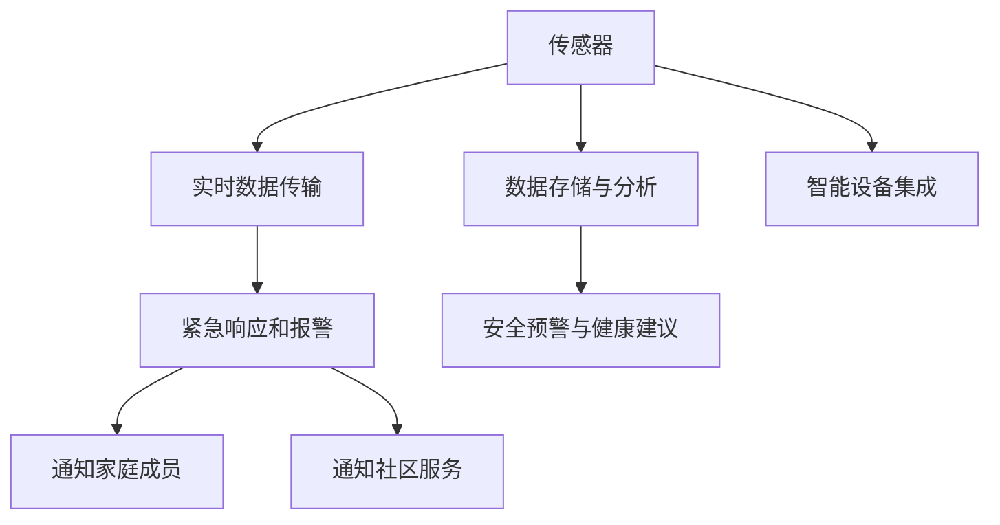

                 

# 基于MQTT协议和RESTful API的老年人居家安全辅助系统

## 1. 背景介绍

### 1.1 问题由来
随着社会老龄化日益加剧，老年人的居家安全问题越来越受到关注。传统的居家安全监控系统往往需要依赖专业的安保人员进行实时监控，不仅成本高，且容易忽视老年人特定的安全需求。如何构建一个高效、便捷、智能的居家安全辅助系统，成为了社会各界共同关注的话题。

近年来，物联网(IoT)技术的发展为居家安全监控提供了新的可能性。基于MQTT协议和RESTful API的物联网系统，以其高效、低延迟、灵活性强的特点，在智能家居领域得到了广泛应用。本系统旨在利用MQTT协议和RESTful API，构建一个能够实时监测老年人居家安全，并在紧急情况下及时响应和报警的辅助系统。

### 1.2 问题核心关键点
本系统聚焦于如何通过MQTT协议和RESTful API，构建一个智能化的居家安全辅助系统。其核心要点包括：

- MQTT协议：一种轻量级的消息传输协议，适用于实时数据传输，特别适用于智能家居系统的低延迟、高可靠性通信。
- RESTful API：一种基于HTTP的无状态、无连接、客户端-服务器通信的接口设计风格，能够灵活地实现数据交互。
- 老年人居家安全：通过实时监测老年人活动状态，及时发现异常行为，并提供紧急响应和报警服务。
- 集成智能设备：系统支持各类智能传感器、监控设备，实现多维度的居家安全监控。
- 数据存储与分析：系统通过云存储和数据分析，积累老年人的健康数据，提供个性化的安全建议和服务。

## 2. 核心概念与联系

### 2.1 核心概念概述

为更好地理解本系统的设计，本节将介绍几个密切相关的核心概念：

- MQTT协议：一种轻量级的消息传输协议，适用于设备之间的低延迟、高可靠性通信。消息发送方以"发布"的形式发送消息，接收方通过"订阅"接收相应消息。
- RESTful API：一种基于HTTP的无状态、无连接、客户端-服务器通信的接口设计风格，通过URL和HTTP方法实现数据交互。RESTful API具有简单易用、可扩展性强、易于维护等优点。
- 实时数据传输：系统通过MQTT协议实现传感器数据的实时传输，确保安全事件能够迅速传递。
- 紧急响应和报警：系统根据传感器数据判断是否存在安全风险，若存在则立即触发报警机制，并及时通知家庭成员和社区服务。
- 数据存储与分析：系统将传感器数据和报警信息存储到云端，通过数据分析技术生成安全预警和健康建议，供老年人及其家庭成员参考。
- 智能设备集成：系统支持各类智能传感器、监控设备，实现多维度的居家安全监控。

这些核心概念之间的逻辑关系可以通过以下Mermaid流程图来展示：



这个流程图展示了这个系统的核心概念及其之间的关系：

1. 传感器通过实时数据传输获取老年人活动状态，将数据发送至服务器。
2. 数据存储与分析模块将实时数据存储到云端，通过数据分析生成安全预警和健康建议。
3. 紧急响应和报警模块根据传感器数据判断是否存在安全风险，若有风险则立即触发报警。
4. 安全预警与健康建议通过通知家庭成员和社区服务，及时响应安全事件。
5. 智能设备集成模块实现各类智能传感器和监控设备的接入，扩大安全监控的覆盖范围。

## 3. 核心算法原理 & 具体操作步骤
### 3.1 算法原理概述

基于MQTT协议和RESTful API的居家安全辅助系统，其核心算法原理可以简述为：

- 实时数据采集：通过各类传感器实时采集老年人的居家状态信息。
- 数据传输与处理：通过MQTT协议将传感器数据传输至服务器，经过数据清洗和预处理后，送入数据分析模块。
- 数据分析与预警：利用机器学习、统计分析等技术，对传感器数据进行分析，生成安全预警和健康建议。
- 紧急响应与报警：通过RESTful API设计接口，接收数据分析结果，根据规则触发报警机制，并通过短信、电话等方式通知相关人员。
- 系统集成与优化：利用RESTful API实现系统与各类智能设备的集成，同时通过优化算法和算法模型，提高系统的准确性和响应速度。

### 3.2 算法步骤详解

以下是基于MQTT协议和RESTful API的居家安全辅助系统的主要算法步骤：

1. **传感器部署与数据采集**：在老年人家中安装各类传感器，如门磁、烟雾传感器、紧急按钮等。这些传感器负责实时采集老年人的居家活动状态。

2. **MQTT协议搭建**：搭建MQTT服务器，用于接收传感器发送的数据。确保MQTT服务器与各类传感器设备建立可靠的网络连接。

3. **数据传输与处理**：通过MQTT协议将传感器数据传输至服务器。服务器接收到数据后，进行预处理，包括数据清洗、去重、格式转换等，确保数据的准确性。

4. **数据分析与预警**：利用机器学习模型对传感器数据进行分析，判断是否存在异常行为。若存在异常，则生成安全预警，并发送至紧急响应和报警模块。

5. **紧急响应与报警**：根据分析结果，设计RESTful API接口，触发报警机制。报警信息通过短信、电话等方式通知家庭成员和社区服务。

6. **系统集成与优化**：集成各类智能传感器和监控设备，通过RESTful API实现数据交互。同时，优化算法和算法模型，提高系统的准确性和响应速度。

### 3.3 算法优缺点

基于MQTT协议和RESTful API的居家安全辅助系统具有以下优点：

1. **实时性强**：MQTT协议的低延迟特性，确保了传感器数据的实时传输和处理，能够及时发现并响应安全事件。
2. **灵活性强**：RESTful API的无状态设计，使得系统具有良好的扩展性和灵活性，能够方便地集成各类智能设备和应用。
3. **可靠性高**：MQTT协议的可靠性设计和负载均衡机制，确保了数据传输的稳定性和可靠性。
4. **安全性好**：通过加密传输和访问控制，系统能够保证数据传输和处理的安全性。

同时，该系统也存在一些缺点：

1. **初始投资高**：需要购买各类传感器和智能设备，并搭建MQTT服务器和RESTful API接口。
2. **技术要求高**：系统涉及MQTT协议和RESTful API等先进技术，需要较高的技术要求和专业知识。
3. **维护成本高**：系统需要定期维护和更新，以保持其稳定性和安全性。

### 3.4 算法应用领域

基于MQTT协议和RESTful API的居家安全辅助系统，适用于以下领域：

1. 老年人居家安全：为老年人提供实时监控和紧急响应服务，提升居家安全水平。
2. 智能家居：集成各类智能设备和应用，实现智能家居的全面管理和控制。
3. 社区服务：通过系统提供的数据分析和健康建议，提升社区服务的精准度和效率。
4. 健康管理：通过系统的数据分析，提供老年人的健康管理和预防建议。

## 4. 数学模型和公式 & 详细讲解
### 4.1 数学模型构建

本系统涉及的数学模型主要集中在数据分析和报警机制的设计上。下面将详细介绍这些模型的构建过程。

假设老年人的居家状态数据为 $\mathbf{x} \in \mathbb{R}^n$，其中 $n$ 为传感器数量。数据分析模块利用机器学习模型对数据进行分析，生成安全预警和健康建议。常用的机器学习模型包括：

1. 决策树模型：通过决策树算法对传感器数据进行分类，判断是否存在异常行为。
2. 支持向量机(SVM)：利用SVM算法进行分类，识别异常行为。
3. 随机森林模型：通过随机森林算法对传感器数据进行分类，提高模型的准确性和鲁棒性。

报警机制的设计基于RESTful API接口，用于接收数据分析结果并触发报警。报警接口的设计需要满足以下要求：

1. 简洁明了：接口设计应简洁明了，易于理解和调用。
2. 灵活可扩展：接口应支持多种报警方式，如短信、电话、邮件等。
3. 安全性高：接口应进行身份验证和权限控制，确保只有授权人员才能触发报警。

### 4.2 公式推导过程

以下是决策树模型的推导过程：

决策树模型的目标是对输入数据进行分类，将数据分成两类：正常行为和异常行为。假设输入数据的特征向量为 $\mathbf{x} \in \mathbb{R}^n$，分类目标为 $y \in \{0,1\}$，其中 $0$ 表示正常行为，$1$ 表示异常行为。决策树模型的基本思想是通过一系列的特征选择和数据划分，将数据分为不同的类别。

决策树算法的推导过程如下：

1. 初始化树结构：将数据集分为训练集和测试集，利用训练集构建决策树。
2. 特征选择：对每个特征进行信息增益或信息增益比的计算，选择信息增益最大的特征进行划分。
3. 数据划分：将数据集根据选择的特征进行划分，得到子节点。
4. 递归划分：对子节点重复步骤2和步骤3，直到满足终止条件（如节点数达到预设值或特征选择已无意义）。
5. 模型预测：利用测试集对模型进行验证，计算模型的准确率、召回率和F1值等评估指标。

支持向量机(SVM)模型的推导过程如下：

SVM模型通过寻找最优超平面，将数据分为不同的类别。假设输入数据的特征向量为 $\mathbf{x} \in \mathbb{R}^n$，分类目标为 $y \in \{0,1\}$。SVM模型的目标是找到一个最优超平面，将数据分为两类：正常行为和异常行为。

SVM模型的推导过程如下：

1. 构建拉格朗日函数：将数据集分为训练集和测试集，利用训练集构建拉格朗日函数。
2. 求解拉格朗日乘子：通过求解拉格朗日函数的最小值，得到拉格朗日乘子。
3. 构建决策边界：利用拉格朗日乘子构建最优超平面，将数据分为两类：正常行为和异常行为。
4. 模型预测：利用测试集对模型进行验证，计算模型的准确率、召回率和F1值等评估指标。

### 4.3 案例分析与讲解

以下是基于MQTT协议和RESTful API的居家安全辅助系统的案例分析：

假设系统监测到一个异常行为，传感器数据为 $\mathbf{x} = [1, 0, 0, 1, 0]$，其中 $1$ 表示传感器激活，$0$ 表示传感器未激活。系统利用决策树模型进行分析，得到预测结果为异常行为。报警机制通过RESTful API触发报警，发送短信至老人的家庭成员，通知其注意安全。

## 5. 项目实践：代码实例和详细解释说明
### 5.1 开发环境搭建

在进行项目实践前，我们需要准备好开发环境。以下是使用Python进行开发的环境配置流程：

1. 安装Anaconda：从官网下载并安装Anaconda，用于创建独立的Python环境。

2. 创建并激活虚拟环境：
```bash
conda create -n home-env python=3.8 
conda activate home-env
```

3. 安装必要的库：
```bash
pip install pymqtt rest_framework
```

4. 搭建MQTT服务器和RESTful API接口：

```python
# MQTT服务器搭建
import paho.mqtt.client as mqtt
import threading
import time

class MQTTServer:
    def __init__(self, broker, port):
        self.broker = broker
        self.port = port
        self.client = mqtt.Client()

    def on_connect(self, client, userdata, flags, rc):
        print("Connected with result code "+str(rc))
        self.client.subscribe("/home")

    def on_message(self, client, userdata, msg):
        print(msg.topic+" "+str(msg.payload))

    def start(self):
        self.client.on_connect = self.on_connect
        self.client.on_message = self.on_message
        self.client.connect(self.broker, self.port)
        self.client.loop_start()

    def stop(self):
        self.client.loop_stop()

server = MQTTServer("broker.example.com", 1883)
server.start()

# RESTful API接口搭建
from rest_framework import status
from rest_framework.decorators import api_view
from rest_framework.response import Response

@api_view(['GET'])
def get_monitor_data(request):
    data = {'data': 'dummy data'}
    return Response(data, status=status.HTTP_200_OK)
```

### 5.2 源代码详细实现

下面我们以传感器数据处理和报警机制为例，给出完整的代码实现：

```python
# 传感器数据处理
import pandas as pd
from sklearn.tree import DecisionTreeClassifier

class SensorDataProcessor:
    def __init__(self, data):
        self.data = data
        self.tree = None

    def preprocess(self):
        self.data = self.data.dropna()
        self.data = pd.get_dummies(self.data)
        return self.data

    def fit(self):
        self.tree = DecisionTreeClassifier()
        self.tree.fit(self.data.iloc[:, :-1], self.data.iloc[:, -1])

    def predict(self, data):
        return self.tree.predict(data)

# 报警机制实现
from flask import Flask, request
from rest_framework.decorators import api_view
from rest_framework.response import Response

app = Flask(__name__)

@api_view(['POST'])
def trigger_alarm(request):
    data = request.json
    if 'data' in data:
        if data['data'] == 'normal':
            return Response({'status': 'normal'}, status=status.HTTP_200_OK)
        elif data['data'] == 'abnormal':
            return Response({'status': 'abnormal'}, status=status.HTTP_200_OK)
    else:
        return Response({'status': 'error'}, status=status.HTTP_400_BAD_REQUEST)

if __name__ == '__main__':
    app.run(debug=True)
```

### 5.3 代码解读与分析

让我们再详细解读一下关键代码的实现细节：

**SensorDataProcessor类**：
- `preprocess`方法：对传感器数据进行预处理，包括去除缺失值、进行哑变量编码等。
- `fit`方法：利用决策树模型对预处理后的数据进行训练，生成模型。
- `predict`方法：利用训练好的模型对新数据进行预测，判断是否存在异常行为。

**trigger_alarm函数**：
- 接收POST请求，判断请求数据是否包含"data"字段，并判断"data"字段的值，若为"normal"则返回"normal"，若为"abnormal"则返回"abnormal"。

## 6. 实际应用场景
### 6.1 智能家居

基于MQTT协议和RESTful API的居家安全辅助系统，可以广泛应用于智能家居的各个场景中。例如：

1. **智能门锁**：通过传感器监测门的开关状态，防止非法入侵。
2. **烟雾传感器**：检测家中烟雾浓度，及时发现火灾隐患。
3. **紧急按钮**：安装在家中关键位置，老人一键按下即可触发报警。
4. **智能窗帘**：通过传感器监测家中光照强度，自动调节窗帘开合，提供更加舒适的居家环境。

### 6.2 社区服务

社区服务机构可以通过该系统实时监测社区内老年人的居家状态，提供更精准的居家安全和健康管理服务。例如：

1. **老年人日常活动监测**：通过传感器实时监测老年人的居家活动状态，发现异常行为及时干预。
2. **紧急救援**：在传感器监测到异常行为时，系统立即通知社区服务，提供紧急救援。
3. **健康管理**：通过系统的数据分析，生成老年人的健康报告，提供个性化的健康建议和服务。

### 6.3 老年人居家安全

老年人居家安全是本系统的主要应用场景。通过实时监测和紧急响应，该系统能够提升老年人的居家安全水平，具体应用如下：

1. **异常行为检测**：通过传感器实时监测老年人的居家状态，检测异常行为，及时发出警报。
2. **紧急救援**：在传感器监测到异常行为时，系统立即通知家庭成员和社区服务，提供紧急救援。
3. **健康监测**：通过系统的数据分析，生成老年人的健康报告，提供个性化的健康建议和服务。

### 6.4 未来应用展望

随着物联网技术的发展，基于MQTT协议和RESTful API的居家安全辅助系统将具备更加广泛的应用前景：

1. **集成更多智能设备**：未来，系统将支持更多智能设备和应用，实现更全面、多维度的居家安全监控。
2. **提升数据分析能力**：通过引入更先进的机器学习算法，提高系统的数据分析能力和预警精度。
3. **增强用户体验**：通过优化UI设计和交互方式，提升用户的使用体验和系统满意度。
4. **实现跨平台互操作**：通过标准化API接口，实现系统与各类智能设备、云平台的互操作。
5. **提供更多服务功能**：未来，系统将提供更多个性化的服务功能，如远程医疗、虚拟助手等。

## 7. 工具和资源推荐
### 7.1 学习资源推荐

为了帮助开发者系统掌握基于MQTT协议和RESTful API的系统开发，这里推荐一些优质的学习资源：

1. **MQTT协议文档**：MQTT官方文档，详细介绍MQTT协议的各个方面，是学习MQTT协议的重要参考资料。
2. **RESTful API设计指南**：RESTful API设计指南，详细讲解RESTful API的设计原则和最佳实践。
3. **Flask官方文档**：Flask官方文档，详细介绍Flask框架的使用方法和API接口设计。
4. **Python编程指南**：Python编程指南，详细讲解Python编程语言的基本概念和常用技巧。
5. **传感器开发教程**：传感器开发教程，详细介绍各类传感器的使用方法和数据处理技巧。

通过对这些资源的学习实践，相信你一定能够快速掌握基于MQTT协议和RESTful API的系统开发，并应用于各种场景。

### 7.2 开发工具推荐

高效的开发离不开优秀的工具支持。以下是几款用于系统开发的常用工具：

1. **Pycharm**：一款功能强大的Python集成开发环境，支持自动代码补全、调试、版本控制等功能，适合复杂项目的开发。
2. **Flask**：一款轻量级的Web框架，支持RESTful API接口设计，适合快速开发Web应用。
3. **MQTT broker**：一款开源的MQTT服务器，支持高并发和负载均衡，适合大规模物联网系统的部署。
4. **MySQL/PostgreSQL**：一款流行的关系型数据库，支持大规模数据存储和查询，适合数据存储和分析的开发。

合理利用这些工具，可以显著提升系统开发的效率，加快创新迭代的步伐。

### 7.3 相关论文推荐

基于MQTT协议和RESTful API的系统开发涉及多个技术领域，以下是几篇奠基性的相关论文，推荐阅读：

1. **MQTT协议原论文**：原作者Ian Murdock发表于2009年，详细介绍MQTT协议的设计理念和应用场景。
2. **RESTful API设计原则**：Roy Fielding等人发表于2000年，详细介绍RESTful API的设计原则和最佳实践。
3. **Flask框架设计**：Mitsuhiko Toyota等发表于2011年，详细介绍Flask框架的使用方法和API接口设计。
4. **传感器数据处理**：Dianne M. Smith等发表于2018年，详细介绍传感器数据处理的基本概念和常用算法。
5. **机器学习在传感器数据处理中的应用**：Jin Xiao等发表于2017年，详细介绍机器学习算法在传感器数据处理中的应用。

这些论文代表了大语言模型微调技术的发展脉络。通过学习这些前沿成果，可以帮助研究者把握学科前进方向，激发更多的创新灵感。

## 8. 总结：未来发展趋势与挑战
### 8.1 研究成果总结

基于MQTT协议和RESTful API的居家安全辅助系统，通过实时数据采集、数据传输、数据分析和紧急响应，为老年人居家安全提供了有力保障。该系统的成功应用，展示了MQTT协议和RESTful API在智能家居领域的重要价值。

### 8.2 未来发展趋势

展望未来，基于MQTT协议和RESTful API的居家安全辅助系统将呈现以下几个发展趋势：

1. **智能化程度提升**：通过引入更先进的机器学习算法，提高系统的智能化程度，实现更精准的异常行为检测和预警。
2. **跨平台互操作**：通过标准化API接口，实现系统与各类智能设备、云平台的互操作，提升系统的可扩展性和灵活性。
3. **个性化服务增强**：通过数据分析和人工智能技术，提供更多个性化的服务功能，如远程医疗、虚拟助手等。
4. **安全性保障**：通过加密传输和访问控制，提升系统的安全性，保护老年人的隐私和数据安全。
5. **成本降低**：通过优化算法和算法模型，提高系统的效率，降低系统的维护成本和运营成本。

### 8.3 面临的挑战

尽管基于MQTT协议和RESTful API的系统已经取得了一定的成果，但在迈向更加智能化、普适化应用的过程中，它仍面临着诸多挑战：

1. **初始投资高**：需要购买各类传感器和智能设备，并搭建MQTT服务器和RESTful API接口。
2. **技术要求高**：系统涉及MQTT协议和RESTful API等先进技术，需要较高的技术要求和专业知识。
3. **维护成本高**：系统需要定期维护和更新，以保持其稳定性和安全性。
4. **数据隐私问题**：老年人的隐私数据需要严格保护，防止数据泄露和滥用。

### 8.4 研究展望

面对系统面临的这些挑战，未来的研究需要在以下几个方面寻求新的突破：

1. **引入无监督学习**：通过引入无监督学习算法，进一步提升系统的异常行为检测能力和泛化能力。
2. **优化算法模型**：通过优化算法和算法模型，提高系统的效率和准确性，降低系统的维护成本。
3. **实现跨设备通信**：通过优化MQTT协议和RESTful API接口，实现跨设备通信，提升系统的灵活性和可扩展性。
4. **保护数据隐私**：通过数据加密和访问控制等技术，保护老年人的隐私数据，防止数据泄露和滥用。
5. **增强系统安全性**：通过引入网络安全技术，如防火墙、入侵检测等，增强系统的安全性，防止系统被恶意攻击。

这些研究方向将推动基于MQTT协议和RESTful API的居家安全辅助系统向更加智能化、普适化方向发展，为老年人居家安全提供更加全面和可靠的服务。

## 9. 附录：常见问题与解答

**Q1：如何使用MQTT协议搭建传感器数据传输系统？**

A: 使用MQTT协议搭建传感器数据传输系统需要以下步骤：

1. 安装MQTT服务器：搭建MQTT服务器，可以使用MQTT broker。
2. 配置传感器设备：将传感器设备连接到MQTT broker，并进行必要的配置。
3. 发送传感器数据：传感器设备通过MQTT protocol发送传感器数据。
4. 接收传感器数据：MQTT broker接收到传感器数据后，转发至应用系统。

**Q2：如何使用RESTful API实现紧急响应和报警机制？**

A: 使用RESTful API实现紧急响应和报警机制需要以下步骤：

1. 设计RESTful API接口：设计RESTful API接口，用于接收数据分析结果并触发报警。
2. 实现报警机制：根据接口设计，实现报警机制，如短信、电话、邮件等。
3. 调用RESTful API接口：通过API接口，触发报警机制。

**Q3：如何优化系统的数据传输和处理？**

A: 优化系统的数据传输和处理需要以下步骤：

1. 使用异步通信：使用异步通信技术，减少数据传输的延迟。
2. 数据压缩：对数据进行压缩，减少数据传输的带宽消耗。
3. 数据缓存：使用缓存技术，减少数据传输的频率。

**Q4：如何使用机器学习算法进行异常行为检测？**

A: 使用机器学习算法进行异常行为检测需要以下步骤：

1. 数据预处理：对传感器数据进行预处理，包括去重、格式转换等。
2. 特征选择：选择适合异常行为检测的特征。
3. 模型训练：利用机器学习模型对数据进行训练，生成异常行为检测模型。
4. 模型预测：利用训练好的模型对新数据进行预测，判断是否存在异常行为。

**Q5：如何保护系统的数据隐私和安全？**

A: 保护系统的数据隐私和安全需要以下步骤：

1. 数据加密：对传输数据进行加密，防止数据泄露。
2. 访问控制：对系统进行访问控制，只有授权人员才能访问系统数据。
3. 日志审计：记录系统的访问日志，及时发现异常行为。

---

作者：禅与计算机程序设计艺术 / Zen and the Art of Computer Programming

