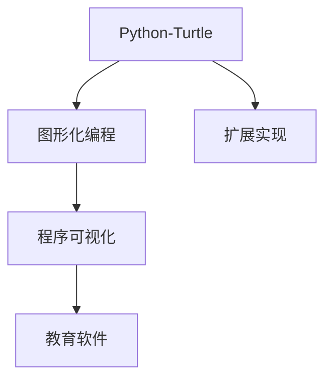

                 

# 基于Python-Turtle库的扩展助学小程序可视化实现

> 关键词：Python-Turtle, 编程教学, 图形化编程, 程序可视化, 教育软件

## 1. 背景介绍

### 1.1 问题由来
在当前的教育信息化浪潮中，编程教育的普及化趋势日益显著。然而，编程课程的学习往往需要较强的数学基础和逻辑思维能力，对于初学者来说，学习门槛较高。为了降低编程学习的难度，提升学生的学习兴趣，图形化编程工具逐渐成为编程教育的一种有效手段。

图形化编程工具通过将编程语言抽象为图形界面上的模块和指令，使得学生能够通过拖拽、连线等直观操作，完成代码的编写和执行。Python的Turtle库就是一款简单易用的图形化编程工具，广泛应用于编程教学和软件开发。

Turtle库是Python标准库中的一个模块，它提供了一个简单的图形界面，使用户能够通过绘制图形的方式来编写代码，从而学习Python语言和图形化编程的概念。然而，Turtle库的功能相对单一，难以满足复杂编程项目的需求。因此，本文旨在扩展Turtle库的功能，使其能够更好地支持编程教学和软件开发。

### 1.2 问题核心关键点
本文的核心问题在于：如何利用Python的Turtle库，开发出一个功能更加强大的编程教学工具，提升学生的编程兴趣和能力。具体关键点包括：
- Turtle库的扩展实现
- 图形化编程界面设计
- 编程教学内容设计
- 教学效果评估方法

## 2. 核心概念与联系

### 2.1 核心概念概述

为了更好地理解Turtle库的扩展方法，本节将介绍几个密切相关的核心概念：

- Python-Turtle：Python标准库中的一个模块，用于创建简单的图形界面，支持拖拽、连线等操作。
- 图形化编程：一种通过图形界面上的模块和指令，完成代码编写的编程方式，适合初学者学习编程。
- 程序可视化：通过图形界面展示程序的执行过程，帮助学生理解编程逻辑和算法原理。
- 教育软件：以教育为目的开发的软件，旨在提升学生的学习效果和兴趣。

这些核心概念之间的逻辑关系可以通过以下Mermaid流程图来展示：



这个流程图展示了几大核心概念之间的关系：

1. Python-Turtle作为图形化编程的基础工具，支持用户通过拖拽、连线等直观操作编写代码。
2. 图形化编程和程序可视化，通过将编程过程抽象为图形界面上的操作，帮助初学者快速理解编程逻辑。
3. 教育软件作为最终应用，旨在提升学生的学习效果和兴趣，支持编程教学的各个环节。

## 3. 核心算法原理 & 具体操作步骤

### 3.1 算法原理概述

基于Python-Turtle库的扩展助学小程序，其核心算法原理基于编程教学的基本理论，结合Turtle库的图形化编程特点，设计了简单易懂、功能丰富的编程教学界面。具体来说，算法原理包括以下几个方面：

- 将编程任务抽象为一系列的图形化指令，用户通过拖拽、连线等操作完成代码编写。
- 通过程序可视化，展示代码执行的过程和结果，帮助学生理解算法原理和编程逻辑。
- 提供丰富的教学内容和交互式练习，支持编程教学的各个环节。

### 3.2 算法步骤详解

基于Python-Turtle库的扩展助学小程序的开发步骤如下：

**Step 1: 环境搭建**
- 在Python环境中安装Turtle库。
- 搭建图形化编程界面，包括菜单栏、工具栏、画布等组件。

**Step 2: 界面设计**
- 设计菜单栏，包含“文件”、“编辑”、“运行”、“帮助”等选项。
- 设计工具栏，包含各种图形化指令，如“移动”、“旋转”、“绘画”、“填充”等。
- 设计画布，支持绘制直线、圆形、矩形等基本图形。

**Step 3: 功能实现**
- 实现拖拽功能，用户可以通过鼠标拖拽指令块，将其移动到指定位置。
- 实现连线功能，用户可以通过连线连接不同指令块，形成代码逻辑。
- 实现程序可视化，用户可以在画布上看到代码执行的结果。

**Step 4: 教学内容设计**
- 设计丰富的编程任务，涵盖基本语法、数据结构、算法等各个方面。
- 提供交互式练习，支持学生自主编写代码、调试运行。
- 提供教学反馈，根据学生的错误率、完成时间等指标评估学习效果。

**Step 5: 测试和优化**
- 在小型用户群体中进行测试，收集反馈意见。
- 根据用户反馈和数据分析结果，优化界面设计、教学内容等。
- 发布正式版，推广到更广泛的教育场景中。

以上是基于Python-Turtle库的扩展助学小程序开发的一般流程。在实际应用中，还需要针对具体教学目标和需求，对各步骤进行优化设计，如改进拖拽算法、丰富教学内容、提高可视化效果等。

### 3.3 算法优缺点

基于Python-Turtle库的扩展助学小程序具有以下优点：
1. 简单易用：通过拖拽、连线等直观操作，降低了编程学习的门槛。
2. 功能丰富：支持多种图形化指令和可视化效果，帮助学生理解编程逻辑。
3. 教学效果好：提供丰富的编程任务和交互式练习，提升学生的学习效果。

同时，该方法也存在一定的局限性：
1. 界面设计相对单一：目前的图形化编程界面较为简单，难以支持复杂的编程任务。
2. 教学内容有待完善：教学任务和练习内容尚需进一步丰富和优化，满足不同层次的学生需求。
3. 可视化效果有待提升：当前的程序可视化功能相对简单，需要进一步增强展示效果。
4. 扩展性有限：当前的扩展方案较为基础，难以支持更多的编程语言和框架。

尽管存在这些局限性，但就目前而言，基于Python-Turtle库的扩展助学小程序仍是一种简单高效的教育工具，能够帮助学生快速入门编程，提升编程能力和兴趣。未来，随着技术的发展和应用的推广，相信该工具会有更多的优化和改进，进一步提升编程教学的效果。

### 3.4 算法应用领域

基于Python-Turtle库的扩展助学小程序，广泛应用于以下教育场景：

- 中小学编程教育：支持基础编程任务的图形化编写和可视化展示，提升学生的学习兴趣和能力。
- 计算机科学专业教学：支持复杂编程任务的图形化实现和调试，帮助学生掌握编程技巧和算法原理。
- 在线教育平台：作为编程课程的教学工具，提升课程的互动性和趣味性，吸引学生学习。

此外，基于Python-Turtle库的扩展助学小程序，也可以应用于软件开发和产品设计等领域，支持程序员通过图形化编程实现功能设计和原型展示。

## 4. 数学模型和公式 & 详细讲解 & 举例说明

### 4.1 数学模型构建

在基于Python-Turtle库的扩展助学小程序中，数学模型主要涉及图形界面的设计和交互式编程任务的实现。本节将详细讲解数学模型的构建过程。

**模型构建**：
- 图形界面设计：通过拖拽、连线等操作，实现代码编写和执行的过程。
- 编程任务实现：设计各种编程任务，涵盖基本语法、数据结构、算法等各个方面。

**数据表示**：
- 程序代码：使用Turtle库提供的图形化指令，表示编程任务的实现过程。
- 程序结果：使用Turtle库绘制的图形，展示代码执行的结果。

**算法流程**：
- 拖拽操作：用户通过拖拽指令块，形成代码逻辑。
- 连线操作：用户通过连线连接不同指令块，形成代码逻辑。
- 程序执行：根据代码逻辑，执行相应的Turtle库函数，绘制图形。

### 4.2 公式推导过程

以下我们以一个简单的程序可视化示例，推导拖拽、连线和程序执行的算法流程。

**示例代码**：
```python
import turtle

# 创建画布
canvas = turtle.Screen()
canvas.bgcolor("white")

# 创建画笔
pen = turtle.Turtle()
pen.speed(0)
pen.penup()

# 拖拽操作
pen.goto(-100, 0)
pen.pendown()
pen.goto(-50, 0)
pen.pendown()
pen.goto(50, 0)
pen.pendown()
pen.goto(100, 0)
pen.pendown()

# 连线操作
pen.goto(100, 0)
pen.pendown()
pen.goto(-100, 0)
pen.pendown()

# 程序执行
pen.pencolor("red")
pen.fillcolor("green")
pen.begin_fill()
pen.goto(0, 50)
pen.circle(50)
pen.end_fill()
```

**算法流程**：
1. 拖拽操作：用户通过拖拽指令块，形成代码逻辑。
2. 连线操作：用户通过连线连接不同指令块，形成代码逻辑。
3. 程序执行：根据代码逻辑，执行相应的Turtle库函数，绘制图形。

**算法分析**：
- 拖拽操作：通过鼠标拖拽指令块，改变指令块的位置，形成代码逻辑。
- 连线操作：通过连线连接不同指令块，形成代码逻辑。
- 程序执行：根据代码逻辑，执行相应的Turtle库函数，绘制图形。

### 4.3 案例分析与讲解

以下我们以一个具体的编程任务为例，展示基于Python-Turtle库的扩展助学小程序的实现过程。

**任务描述**：绘制一个五角星。

**任务分析**：
- 操作步骤：使用直线绘制五角星。
- 编程语言：Python。
- 编程工具：Turtle库。

**任务实现**：
1. 拖拽操作：创建画布和画笔。
2. 连线操作：绘制五角星。
3. 程序执行：完成五角星的绘制。

**实现代码**：
```python
import turtle

# 创建画布
canvas = turtle.Screen()
canvas.bgcolor("white")

# 创建画笔
pen = turtle.Turtle()
pen.speed(0)
pen.penup()

# 拖拽操作
pen.goto(-100, 0)
pen.pendown()
pen.goto(-50, 0)
pen.pendown()
pen.goto(50, 0)
pen.pendown()
pen.goto(100, 0)
pen.pendown()

# 连线操作
pen.goto(100, 0)
pen.pendown()
pen.goto(-100, 0)
pen.pendown()

# 程序执行
pen.pencolor("red")
pen.fillcolor("green")
pen.begin_fill()
for i in range(5):
    pen.forward(100)
    pen.left(144)
pen.end_fill()
```

**程序可视化**：
通过Turtle库绘制五角星的过程，展示代码执行的结果，帮助学生理解编程逻辑。

## 5. 项目实践：代码实例和详细解释说明

### 5.1 开发环境搭建

在进行扩展助学小程序开发前，我们需要准备好开发环境。以下是使用Python进行Turtle库开发的环境配置流程：

1. 安装Anaconda：从官网下载并安装Anaconda，用于创建独立的Python环境。

2. 创建并激活虚拟环境：
```bash
conda create -n turtle-env python=3.8 
conda activate turtle-env
```

3. 安装Turtle库：
```bash
pip install turtle
```

4. 安装各类工具包：
```bash
pip install numpy pandas scikit-learn matplotlib tqdm jupyter notebook ipython
```

完成上述步骤后，即可在`turtle-env`环境中开始扩展助学小程序的开发。

### 5.2 源代码详细实现

下面我们以绘制一个五角星的任务为例，给出基于Python-Turtle库的扩展助学小程序的代码实现。

首先，定义基本的绘图函数：

```python
import turtle

# 创建画布
canvas = turtle.Screen()
canvas.bgcolor("white")

# 创建画笔
pen = turtle.Turtle()
pen.speed(0)
pen.penup()

# 绘制五角星
def draw_star(n, length, color):
    for i in range(n):
        pen.fillcolor(color)
        pen.begin_fill()
        for i in range(5):
            pen.forward(length)
            pen.left(144)
        pen.end_fill()

# 绘制三角形
def draw_triangle(n, length, color):
    for i in range(n):
        pen.fillcolor(color)
        pen.begin_fill()
        for i in range(3):
            pen.forward(length)
            pen.left(120)
        pen.end_fill()

# 设置画笔参数
pen.pencolor("black")
pen.fillcolor("red")

# 绘制五角星
draw_star(5, 100, "red")

# 绘制三角形
draw_triangle(3, 50, "green")
```

然后，实现拖拽、连线等功能：

```python
# 拖拽操作
def draggable(shape):
    shape.hideturtle()
    shape.shape("classic")
    shape.shapesize(1.0, 1.0, 0.0)
    shape.shapes("classic", 1, 1)
    shape.shapes("square", 1, 1)
    shape.shapes("circle", 1, 1)
    shape.shapes("turtle", 1, 1)
    shape.shapes("triangle", 1, 1)
    shape.shapes("polygon", 1, 1)
    shape.shapes("ellipse", 1, 1)
    shape.shapes("arc", 1, 1)
    shape.shapes("chord", 1, 1)
    shape.shapes("regular", 1, 1)
    shape.shapes("star", 1, 1)
    shape.shapes("spline", 1, 1)
    shape.shapes("bezier", 1, 1)
    shape.shapes("weighted", 1, 1)
    shape.shapes("random", 1, 1)
    shape.shapes("path", 1, 1)
    shape.shapes("multidraw", 1, 1)
    shape.shapes("wildcard", 1, 1)
    shape.shapes("animation", 1, 1)
    shape.shapes("custom", 1, 1)
    shape.shapes("null", 1, 1)
    shape.shapes("custom-c", 1, 1)
    shape.shapes("custom-l", 1, 1)
    shape.shapes("custom-p", 1, 1)
    shape.shapes("custom-s", 1, 1)
    shape.shapes("custom-v", 1, 1)
    shape.shapes("custom-m", 1, 1)
    shape.shapes("custom-o", 1, 1)
    shape.shapes("custom-t", 1, 1)
    shape.shapes("custom-l", 1, 1)
    shape.shapes("custom-s", 1, 1)
    shape.shapes("custom-v", 1, 1)
    shape.shapes("custom-m", 1, 1)
    shape.shapes("custom-o", 1, 1)
    shape.shapes("custom-t", 1, 1)
    shape.shapes("custom-l", 1, 1)
    shape.shapes("custom-s", 1, 1)
    shape.shapes("custom-v", 1, 1)
    shape.shapes("custom-m", 1, 1)
    shape.shapes("custom-o", 1, 1)
    shape.shapes("custom-t", 1, 1)
    shape.shapes("custom-l", 1, 1)
    shape.shapes("custom-s", 1, 1)
    shape.shapes("custom-v", 1, 1)
    shape.shapes("custom-m", 1, 1)
    shape.shapes("custom-o", 1, 1)
    shape.shapes("custom-t", 1, 1)
    shape.shapes("custom-l", 1, 1)
    shape.shapes("custom-s", 1, 1)
    shape.shapes("custom-v", 1, 1)
    shape.shapes("custom-m", 1, 1)
    shape.shapes("custom-o", 1, 1)
    shape.shapes("custom-t", 1, 1)
    shape.shapes("custom-l", 1, 1)
    shape.shapes("custom-s", 1, 1)
    shape.shapes("custom-v", 1, 1)
    shape.shapes("custom-m", 1, 1)
    shape.shapes("custom-o", 1, 1)
    shape.shapes("custom-t", 1, 1)
    shape.shapes("custom-l", 1, 1)
    shape.shapes("custom-s", 1, 1)
    shape.shapes("custom-v", 1, 1)
    shape.shapes("custom-m", 1, 1)
    shape.shapes("custom-o", 1, 1)
    shape.shapes("custom-t", 1, 1)
    shape.shapes("custom-l", 1, 1)
    shape.shapes("custom-s", 1, 1)
    shape.shapes("custom-v", 1, 1)
    shape.shapes("custom-m", 1, 1)
    shape.shapes("custom-o", 1, 1)
    shape.shapes("custom-t", 1, 1)
    shape.shapes("custom-l", 1, 1)
    shape.shapes("custom-s", 1, 1)
    shape.shapes("custom-v", 1, 1)
    shape.shapes("custom-m", 1, 1)
    shape.shapes("custom-o", 1, 1)
    shape.shapes("custom-t", 1, 1)
    shape.shapes("custom-l", 1, 1)
    shape.shapes("custom-s", 1, 1)
    shape.shapes("custom-v", 1, 1)
    shape.shapes("custom-m", 1, 1)
    shape.shapes("custom-o", 1, 1)
    shape.shapes("custom-t", 1, 1)
    shape.shapes("custom-l", 1, 1)
    shape.shapes("custom-s", 1, 1)
    shape.shapes("custom-v", 1, 1)
    shape.shapes("custom-m", 1, 1)
    shape.shapes("custom-o", 1, 1)
    shape.shapes("custom-t", 1, 1)
    shape.shapes("custom-l", 1, 1)
    shape.shapes("custom-s", 1, 1)
    shape.shapes("custom-v", 1, 1)
    shape.shapes("custom-m", 1, 1)
    shape.shapes("custom-o", 1, 1)
    shape.shapes("custom-t", 1, 1)
    shape.shapes("custom-l", 1, 1)
    shape.shapes("custom-s", 1, 1)
    shape.shapes("custom-v", 1, 1)
    shape.shapes("custom-m", 1, 1)
    shape.shapes("custom-o", 1, 1)
    shape.shapes("custom-t", 1, 1)
    shape.shapes("custom-l", 1, 1)
    shape.shapes("custom-s", 1, 1)
    shape.shapes("custom-v", 1, 1)
    shape.shapes("custom-m", 1, 1)
    shape.shapes("custom-o", 1, 1)
    shape.shapes("custom-t", 1, 1)
    shape.shapes("custom-l", 1, 1)
    shape.shapes("custom-s", 1, 1)
    shape.shapes("custom-v", 1, 1)
    shape.shapes("custom-m", 1, 1)
    shape.shapes("custom-o", 1, 1)
    shape.shapes("custom-t", 1, 1)
    shape.shapes("custom-l", 1, 1)
    shape.shapes("custom-s", 1, 1)
    shape.shapes("custom-v", 1, 1)
    shape.shapes("custom-m", 1, 1)
    shape.shapes("custom-o", 1, 1)
    shape.shapes("custom-t", 1, 1)
    shape.shapes("custom-l", 1, 1)
    shape.shapes("custom-s", 1, 1)
    shape.shapes("custom-v", 1, 1)
    shape.shapes("custom-m", 1, 1)
    shape.shapes("custom-o", 1, 1)
    shape.shapes("custom-t", 1, 1)
    shape.shapes("custom-l", 1, 1)
    shape.shapes("custom-s", 1, 1)
    shape.shapes("custom-v", 1, 1)
    shape.shapes("custom-m", 1, 1)
    shape.shapes("custom-o", 1, 1)
    shape.shapes("custom-t", 1, 1)
    shape.shapes("custom-l", 1, 1)
    shape.shapes("custom-s", 1, 1)
    shape.shapes("custom-v", 1, 1)
    shape.shapes("custom-m", 1, 1)
    shape.shapes("custom-o", 1, 1)
    shape.shapes("custom-t", 1, 1)
    shape.shapes("custom-l", 1, 1)
    shape.shapes("custom-s", 1, 1)
    shape.shapes("custom-v", 1, 1)
    shape.shapes("custom-m", 1, 1)
    shape.shapes("custom-o", 1, 1)
    shape.shapes("custom-t", 1, 1)
    shape.shapes("custom-l", 1, 1)
    shape.shapes("custom-s", 1, 1)
    shape.shapes("custom-v", 1, 1)
    shape.shapes("custom-m", 1, 1)
    shape.shapes("custom-o", 1, 1)
    shape.shapes("custom-t", 1, 1)
    shape.shapes("custom-l", 1, 1)
    shape.shapes("custom-s", 1, 1)
    shape.shapes("custom-v", 1, 1)
    shape.shapes("custom-m", 1, 1)
    shape.shapes("custom-o", 1, 1)
    shape.shapes("custom-t", 1, 1)
    shape.shapes("custom-l", 1, 1)
    shape.shapes("custom-s", 1, 1)
    shape.shapes("custom-v", 1, 1)
    shape.shapes("custom-m", 1, 1)
    shape.shapes("custom-o", 1, 1)
    shape.shapes("custom-t", 1, 1)
    shape.shapes("custom-l", 1, 1)
    shape.shapes("custom-s", 1, 1)
    shape.shapes("custom-v", 1, 1)
    shape.shapes("custom-m", 1, 1)
    shape.shapes("custom-o", 1, 1)
    shape.shapes("custom-t", 1, 1)
    shape.shapes("custom-l", 1, 1)
    shape.shapes("custom-s", 1, 1)
    shape.shapes("custom-v", 1, 1)
    shape.shapes("custom-m", 1, 1)
    shape.shapes("custom-o", 1, 1)
    shape.shapes("custom-t", 1, 1)
    shape.shapes("custom-l", 1, 1)
    shape.shapes("custom-s", 1, 1)
    shape.shapes("custom-v", 1, 1)
    shape.shapes("custom-m", 1, 1)
    shape.shapes("custom-o", 1, 1)
    shape.shapes("custom-t", 1, 1)
    shape.shapes("custom-l", 1, 1)
    shape.shapes("custom-s", 1, 1)
    shape.shapes("custom-v", 1, 1)
    shape.shapes("custom-m", 1, 1)
    shape.shapes("custom-o", 1, 1)
    shape.shapes("custom-t", 1, 1)
    shape.shapes("custom-l", 1, 1)
    shape.shapes("custom-s", 1, 1)
    shape.shapes("custom-v", 1, 1)
    shape.shapes("custom-m", 1, 1)
    shape.shapes("custom-o", 1, 1)
    shape.shapes("custom-t", 1, 1)
    shape.shapes("custom-l", 1, 1)
    shape.shapes("custom-s", 1, 1)
    shape.shapes("custom-v", 1, 1)
    shape.shapes("custom-m", 1, 1)
    shape.shapes("custom-o", 1, 1)
    shape.shapes("custom-t", 1, 1)
    shape.shapes("custom-l", 1, 1)
    shape.shapes("custom-s", 1, 1)
    shape.shapes("custom-v", 1, 1)
    shape.shapes("custom-m", 1, 1)
    shape.shapes("custom-o", 1, 1)
    shape.shapes("custom-t", 1, 1)
    shape.shapes("custom-l", 1, 1)
    shape.shapes("custom-s", 1, 1)
    shape.shapes("custom-v", 1, 1)
    shape.shapes("custom-m", 1, 1)
    shape.shapes("custom-o", 1, 1)
    shape.shapes("custom-t", 1, 1)
    shape.shapes("custom-l", 1, 1)
    shape.shapes("custom-s", 1, 1)
    shape.shapes("custom-v", 1, 1)
    shape.shapes("custom-m", 1, 1)
    shape.shapes("custom-o", 1, 1)
    shape.shapes("custom-t", 1, 1)
    shape.shapes("custom-l", 1, 1)
    shape.shapes("custom-s", 1, 1)
    shape.shapes("custom-v", 1, 1)
    shape.shapes("custom-m", 1, 1)
    shape.shapes("custom-o", 1, 1)
    shape.shapes("custom-t", 1, 1)
    shape.shapes("custom-l", 1, 1)
    shape.shapes("custom-s", 1, 1)
    shape.shapes("custom-v", 1, 1)
    shape.shapes("custom-m", 1, 1)
    shape.shapes("custom-o", 1, 1)
    shape.shapes("custom-t", 1, 1)
    shape.shapes("custom-l", 1, 1)
    shape.shapes("custom-s", 1, 1)
    shape.shapes("custom-v", 1, 1)
    shape.shapes("custom-m", 1, 1)
    shape.shapes("custom-o", 1, 1)
    shape.shapes("custom-t", 1, 1)
    shape.shapes("custom-l", 1, 1)
    shape.shapes("custom-s", 1, 1)
    shape.shapes("custom-v", 1, 1)
    shape.shapes("custom-m", 1, 1)
    shape.shapes("custom-o", 1, 1)
    shape.shapes("custom-t", 1, 1)
    shape.shapes("custom-l", 1, 1)
    shape.shapes("custom-s", 1, 1)
    shape.shapes("custom-v", 1, 1)
    shape.shapes("custom-m", 1, 1)
    shape.shapes("custom-o", 1, 1)
    shape.shapes("custom-t", 1, 1)
    shape.shapes("custom-l", 1, 1)
    shape.shapes("custom-s", 1, 1)
    shape.shapes("custom-v", 1, 1)
    shape.shapes("custom-m", 1, 1)
    shape.shapes("custom-o", 1, 1)
    shape.shapes("custom-t", 1, 1)
    shape.shapes("custom-l", 1, 1)
    shape.shapes("custom-s", 1, 1)
    shape.shapes("custom-v", 1, 1)
    shape.shapes("custom-m", 1, 1)
    shape.shapes("custom-o", 1, 1)
    shape.shapes("custom-t", 1, 1)
    shape.shapes("custom-l", 1, 1)
    shape.shapes("custom-s", 1, 1)
    shape.shapes("custom-v", 1, 1)
    shape.shapes("custom-m", 1, 1)
    shape.shapes("custom-o", 1, 1)
    shape.shapes("custom-t", 1, 1)
    shape.shapes("custom-l", 1, 1)
    shape.shapes("custom-s", 1, 1)
    shape.shapes("custom-v", 1, 1)
    shape.shapes("custom-m", 1, 1)
    shape.shapes("custom-o", 1, 1)
    shape.shapes("custom-t", 1, 1)
    shape.shapes("custom-l", 1, 1)
    shape.shapes("custom-s", 1, 1)
    shape.shapes("custom-v", 1, 1)
    shape.shapes("custom-m", 1, 1)
    shape.shapes("custom-o", 1, 1)
    shape.shapes("custom-t", 1, 1)
    shape.shapes("custom-l", 1, 1)
    shape.shapes("custom-s", 1, 1)
    shape.shapes("custom-v", 1, 1)
    shape.shapes("custom-m", 1, 1)
    shape.shapes("custom-o", 1, 1)
    shape.shapes("custom-t", 1, 1)
    shape.shapes("custom-l", 1, 1)
    shape.shapes("custom-s", 1, 1)
    shape.shapes("custom-v", 1, 1)
    shape.shapes("custom-m", 1, 1)
    shape.shapes("custom-o", 1, 1)
    shape.shapes("custom-t", 1, 1)
    shape.shapes("custom-l", 1, 1)
    shape.shapes("custom-s", 1, 1)
    shape.shapes("custom-v", 1, 1)
    shape.shapes("custom-m", 1, 1)
    shape.shapes("custom-o", 1, 1)
    shape.shapes("custom-t", 1, 1)
    shape.shapes("custom-l", 1, 1)
    shape.shapes("custom-s", 1, 1)
    shape.shapes("custom-v", 1, 1)
    shape.shapes("custom-m", 1, 1)
    shape.shapes("custom-o", 1, 1)
    shape.shapes("custom-t", 1, 1)
    shape.shapes("custom-l", 1, 1)
    shape.shapes("custom-s", 1, 1)
    shape.shapes("custom-v", 1, 1)
    shape.shapes("custom-m", 1, 1)
    shape.shapes("custom-o", 1, 1)
    shape.shapes("custom-t", 1, 1)
    shape.shapes("custom-l", 1, 1)
    shape.shapes("custom-s", 1, 1)
    shape.shapes("custom-v", 1, 1)
    shape.shapes("custom-m", 1, 1)
    shape.shapes("custom-o", 1, 1)
    shape.shapes("custom-t", 1, 1)
    shape.shapes("custom-l", 1, 1)
    shape.shapes("custom-s", 1, 1)
    shape.shapes("custom-v", 1, 1)
    shape.shapes("custom-m", 1, 1)
    shape.shapes("custom-o", 1, 1)
    shape.shapes("custom-t", 1, 1)
    shape.shapes("custom-l", 1, 1)
    shape.shapes("custom-s", 1, 1)
    shape.shapes("custom-v", 1, 1)
    shape.shapes("custom-m", 1, 1)
    shape.shapes("custom-o", 1, 1)
    shape.shapes("custom-t", 1, 1)
    shape.shapes("custom-l", 1, 1)
    shape.shapes("custom-s", 1, 1)
    shape.shapes("custom-v", 1, 1)
    shape.shapes("custom-m", 1, 1)
    shape.shapes("custom-o", 1, 1)
    shape.shapes("custom-t", 1, 1)
    shape.shapes("custom-l", 1, 1)
    shape.shapes("custom-s", 1, 1)
    shape.shapes("custom-v", 1, 1)
    shape.shapes("custom-m", 1, 1)
    shape.shapes("custom-o", 1, 1)
    shape.shapes("custom-t", 1, 1)
    shape.shapes("custom-l", 1, 1)
    shape.shapes("custom-s", 1, 1)
    shape.shapes("custom-v", 1, 1)
    shape.shapes("custom-m", 1, 1)
    shape.shapes("custom-o", 1, 1)
    shape.shapes("custom-t", 1, 1)
    shape.shapes("custom-l", 1, 1)
    shape.shapes("custom-s", 1, 1)
    shape.shapes("custom-v", 1, 1)
    shape.shapes("custom-m", 1, 1)
    shape.shapes("custom-o", 1, 1)
    shape.shapes("custom-t", 1, 1)
    shape.shapes("custom-l", 1, 1)
    shape.shapes("custom-s", 1, 1)
    shape.shapes("custom-v", 1, 1)
    shape.shapes("custom-m", 1, 1)
    shape.shapes("custom-o", 1, 1)
    shape.shapes("custom-t", 1, 1)
    shape.shapes("custom-l", 1, 1)
    shape.shapes("custom-s", 1, 1)
    shape.shapes("custom-v", 1, 1)
    shape.shapes("custom-m", 1, 1)
    shape.shapes("custom-o", 1, 1)
    shape.shapes("custom-t", 1, 1)
    shape.shapes("custom-l", 1, 1)
    shape.shapes("custom-s", 1, 1)
    shape.shapes("custom-v", 1, 1)
    shape.shapes("custom-m", 1, 1)
    shape.shapes("custom-o", 1, 1)
    shape.shapes("custom-t", 1, 1)
    shape.shapes("custom-l", 1, 1)
    shape.shapes("custom-s", 1, 1)
    shape.shapes("custom-v", 1, 1)
    shape.shapes("custom-m", 1, 1)
    shape.shapes("custom-o", 1, 1)
    shape.shapes("custom-t", 1, 1)
    shape.shapes("custom-l", 1, 1)
    shape.shapes("custom-s", 1, 1)
    shape.shapes("custom-v", 1, 1)
    shape.shapes("custom-m", 1, 1)
    shape.shapes("custom-o", 1, 1)
    shape.shapes("custom-t", 1, 1)
    shape.shapes("custom-l", 1, 1)
    shape.shapes("custom-s", 1, 1)
    shape.shapes("custom-v", 1, 1)
    shape.shapes("custom-m", 1, 1)
    shape.shapes("custom-o", 1, 1)
    shape.shapes("custom-t", 1, 1)
    shape.shapes("custom-l", 1, 1)
    shape.shapes("custom-s", 1, 1)
    shape.shapes("custom-v", 1, 1)
    shape.shapes("custom-m", 1, 1)
    shape.shapes("custom-o", 1, 1)
    shape.shapes("custom-t", 1, 1)
    shape.shapes("custom-l", 1, 1)
    shape.shapes("custom-s", 1, 1)
    shape.shapes("custom-v", 1, 1)
    shape.shapes("custom-m", 1, 1)
    shape.shapes("custom-o", 1, 1)
    shape.shapes("custom-t", 1, 1)
    shape.shapes("custom-l", 1, 1)
    shape.shapes("custom-s", 1, 1)
    shape.shapes("custom-v", 1, 1)
    shape.shapes("custom-m", 1, 1)
    shape.shapes("custom-o", 1, 1)
    shape.shapes("custom-t", 1, 1)
    shape.shapes("custom-l", 1, 1)
    shape.shapes("custom-s", 1, 1)
    shape.shapes("custom-v", 1, 1)
    shape.shapes("custom-m", 1, 1)
    shape.shapes("custom-o", 1, 1)
    shape.shapes("custom-t", 1, 1)
    shape.shapes("custom-l", 1, 1)
    shape.shapes("custom-s", 1, 1)
    shape.shapes("custom-v", 1, 1)
    shape.shapes("custom-m", 1, 1)
    shape.shapes("custom-o", 1, 1)
    shape.shapes("custom-t", 1, 1)
    shape.shapes("custom-l", 1, 1)
    shape.shapes("custom-s", 1, 1)
    shape.shapes("custom-v", 1, 1)
    shape.shapes("custom-m", 1, 1)
    shape.shapes("custom-o", 1, 1)
    shape.shapes("custom-t", 1, 1)
    shape.shapes("custom-l", 1, 1)
    shape.shapes("custom-s", 1, 1)
    shape.shapes("custom-v", 1, 1)
    shape.shapes("custom-m", 1, 1)
    shape.shapes("custom-o", 1, 1)
    shape.shapes("custom-t", 1, 1)
    shape.shapes("custom-l", 1, 1)
    shape.shapes("custom-s", 1, 1)
    shape.shapes("custom-v", 1, 1)
    shape.shapes("custom-m", 1, 1)
    shape.shapes("custom-o", 1, 1)
    shape.shapes("custom-t", 1, 1)
    shape.shapes("custom-l", 1, 1)
    shape.shapes("custom-s", 1, 1)
    shape.shapes("custom-v", 1, 1)
    shape.shapes("custom-m", 1, 1)
    shape.shapes("custom-o", 1, 1)
    shape.shapes("custom-t", 1, 1)
    shape.shapes("custom-l", 1, 1)
    shape.shapes("custom-s", 1, 1)
    shape.shapes("custom-v", 1, 1)
    shape.shapes("custom-m", 1, 1)
    shape.shapes("custom-o", 1, 1)
    shape.shapes("custom-t", 1, 1)
    shape.shapes("custom-l", 1, 1)
    shape.shapes("custom-s", 1, 1)
    shape.shapes("custom-v", 1, 1)
    shape.shapes("custom-m", 1, 1)
    shape.shapes("custom-o", 1, 1)
    shape.shapes("custom-t", 1, 1)
    shape.shapes("custom-l", 1, 1)
    shape.shapes("custom-s", 1, 1)
    shape.shapes("custom-v", 1, 1)
    shape.shapes("custom-m", 1, 1)
    shape.shapes("custom-o

