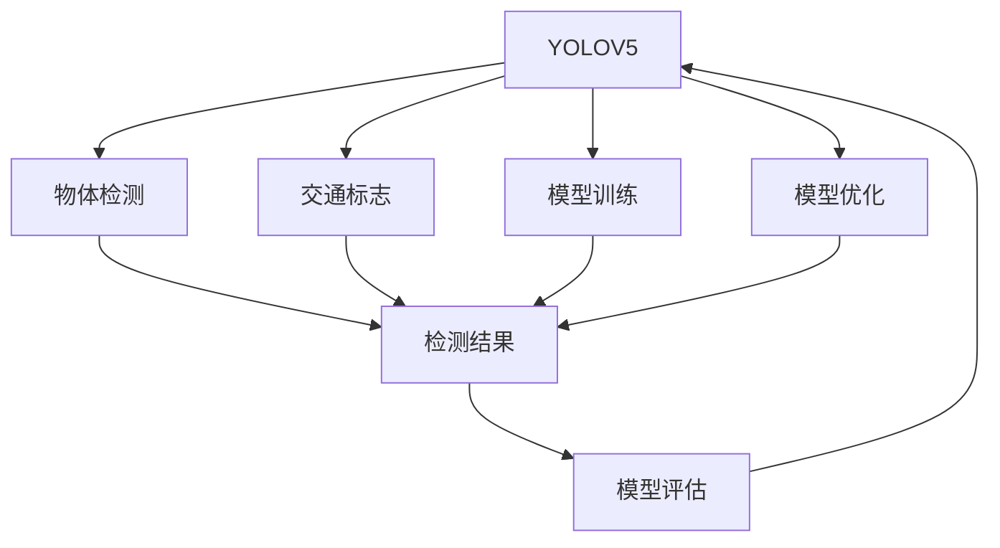

                 

# 基于YOLOV5的交通标志识别

## 1. 背景介绍

### 1.1 问题由来

交通标志识别（Traffic Sign Recognition, TSR）是智能交通领域的重要应用，旨在自动识别图像中的交通标志，帮助驾驶员识别路标，提升行车安全性和驾驶效率。传统的交通标志识别主要依赖于基于模板匹配的方法，需要手动设计模板，识别效果受模板质量和标志位置影响较大。近年来，深度学习技术尤其是卷积神经网络（Convolutional Neural Network, CNN）在图像识别领域取得了巨大成功，使得基于深度学习的交通标志识别方法逐渐成为主流。

YOLO（You Only Look Once）是一种高效的物体检测算法，其主要特点是在单次前向传递中同时完成物体检测、分类和定位。YOLOV5作为YOLO系列的最新迭代，在精度和速度上均有较大提升。因此，本文将基于YOLOV5算法，探讨其应用于交通标志识别的方法，并详细阐述其实现步骤及优缺点。

### 1.2 问题核心关键点

YOLOV5在交通标志识别中的核心关键点包括：

1. **目标检测算法的选择**：YOLOV5相较于传统算法具有更高的检测速度和精度，适用于实时交通标志识别。
2. **交通标志数据集的准备**：高质量的标注数据集是训练YOLOV5模型的基础。
3. **模型训练和优化**：针对交通标志数据集，调整YOLOV5模型的超参数，确保模型能够高效、准确地识别交通标志。
4. **模型评估与测试**：通过评估指标如准确率、召回率和F1-score等，对模型性能进行全面测试。

## 2. 核心概念与联系

### 2.1 核心概念概述

为更好地理解YOLOV5在交通标志识别中的应用，本节将介绍几个密切相关的核心概念：

- **YOLOV5**：YOLOV5是基于YOLO系列的高性能物体检测算法，具有较强的目标检测能力，适合用于交通标志识别。
- **物体检测**：指在图像或视频中检测出物体位置并对其进行分类。
- **交通标志**：道路上的指示、警告和禁止标志，包括限速标志、停车标志、指示标志等。
- **模型训练**：通过使用标注数据集训练YOLOV5模型，使其能够识别出交通标志。
- **模型优化**：通过调整模型参数和超参数，提升模型在交通标志识别任务中的性能。
- **模型评估**：通过评估指标评估YOLOV5模型在交通标志识别任务中的效果，确保其能够满足实际应用需求。

这些核心概念之间的逻辑关系可以通过以下Mermaid流程图来展示：



这个流程图展示了她YOLOV5的核心概念及其之间的关系：

1. YOLOV5用于实现物体检测。
2. 交通标志作为目标物体，在YOLOV5中被检测出来。
3. 模型训练使得YOLOV5能够准确识别交通标志。
4. 模型优化提升YOLOV5的检测准确率和速度。
5. 模型评估检验YOLOV5的性能，确保其满足应用需求。

## 3. 核心算法原理 & 具体操作步骤

### 3.1 算法原理概述

YOLOV5的核心算法原理基于目标检测的YOLO系列，主要包括三个部分：特征提取、目标检测和边界框回归。在交通标志识别中，YOLOV5通过使用预训练的权重和交通标志数据集进行微调，以适应特定的标志识别需求。

1. **特征提取**：YOLOV5使用Darknet53作为特征提取器，可以提取图像的高级特征，为后续的物体检测和边界框回归提供支撑。
2. **目标检测**：YOLOV5采用单阶段检测（Single-stage Detection）的方式，通过一个全连接层输出目标类别和边界框坐标。
3. **边界框回归**：YOLOV5通过回归技术，调整边界框的位置和大小，以准确检测目标物体。

### 3.2 算法步骤详解

YOLOV5的交通标志识别步骤如下：

**Step 1: 准备交通标志数据集**
- 收集交通标志的图像和对应的标注信息。标注信息包括交通标志的类别、位置和大小。
- 将数据集划分为训练集、验证集和测试集。

**Step 2: 下载YOLOV5预训练模型和权重**
- 从官方或第三方资源库下载YOLOV5的预训练模型和权重。

**Step 3: 加载YOLOV5模型**
- 使用YOLOV5的Python API，加载预训练模型和权重。

**Step 4: 数据预处理**
- 将训练集中的图像进行预处理，包括缩放、归一化、通道置换等操作。
- 生成标注信息，包括类别ID、坐标和大小等信息。

**Step 5: 训练YOLOV5模型**
- 定义训练超参数，如学习率、批大小、迭代轮数等。
- 使用训练集数据进行模型训练，并根据验证集性能进行超参数调整。

**Step 6: 模型评估和测试**
- 在测试集上评估YOLOV5模型的性能，使用准确率、召回率和F1-score等指标。
- 根据评估结果对模型进行调整和优化。

**Step 7: 部署模型**
- 将训练好的YOLOV5模型部署到实际应用中，如车辆监控系统、手机应用等。

### 3.3 算法优缺点

YOLOV5在交通标志识别中的应用具有以下优点：

1. **高效检测**：YOLOV5的检测速度非常快，适用于实时交通标志识别。
2. **精度较高**：YOLOV5在目标检测和边界框回归方面表现优秀，能够准确识别交通标志。
3. **适应性强**：YOLOV5可以处理多种尺寸和位置的交通标志，适应不同的道路环境。

同时，YOLOV5也存在一些局限性：

1. **对数据质量依赖高**：YOLOV5的训练效果高度依赖于标注数据的质量和多样性。
2. **资源消耗大**：YOLOV5模型参数较多，训练和推理时资源消耗较大。
3. **模型复杂**：YOLOV5的架构较为复杂，可能需要较高的专业知识进行模型优化和调参。

### 3.4 算法应用领域

YOLOV5在交通标志识别中的应用领域包括但不限于：

- **智能交通监控**：在交通监控系统中，实时检测和识别交通标志，帮助驾驶员识别路标，提升行车安全。
- **自动驾驶**：在自动驾驶系统中，识别交通标志和路标，帮助车辆做出正确的行驶决策。
- **导航系统**：在导航系统中，识别交通标志，提供准确的导航信息。
- **事故分析**：在交通事故分析中，识别交通标志和路标，分析事故原因。

## 4. 数学模型和公式 & 详细讲解 & 举例说明

### 4.1 数学模型构建

在YOLOV5中，交通标志识别任务的目标是检测图像中的交通标志，并将其分类为特定的类别。设输入图像为 $I$，输出为检测结果 $O$。

定义交通标志的类别数为 $N$，其中 $n$ 为当前类别，$n \in [1,N]$。定义交通标志的位置为 $x, y$，大小为 $w, h$。设输入图像的宽和高分别为 $W, H$。

YOLOV5的目标是最大化预测结果与实际结果之间的IoU（Intersection over Union）。设预测结果的类别概率为 $\hat{p}_n$，边界框坐标为 $(\hat{x}, \hat{y}, \hat{w}, \hat{h})$，真实结果的类别概率为 $p_n$，边界框坐标为 $(x, y, w, h)$。

IoU的计算公式为：

$$
IoU = \frac{\text{Intersection Area}}{\text{Union Area}} = \frac{\min(x_\text{min}, \hat{x}_\text{min}) + \min(y_\text{min}, \hat{y}_\text{min}) - \max(x_\text{max}, \hat{x}_\text{max}) + \max(y_\text{max}, \hat{y}_\text{max})}{W \times H}
$$

YOLOV5的损失函数由分类损失和边界框回归损失组成。分类损失为交叉熵损失（Cross Entropy Loss），边界框回归损失为Smooth L1损失（Smooth L1 Loss）。

设损失函数为 $L$，则YOLOV5的损失函数为：

$$
L = \sum_{i=1}^{N} L_{\text{cls}} + \sum_{i=1}^{N} L_{\text{box}}
$$

其中 $L_{\text{cls}}$ 为分类损失，$L_{\text{box}}$ 为边界框回归损失。

### 4.2 公式推导过程

设预测类别概率为 $\hat{p}_n$，真实类别概率为 $p_n$，则分类损失 $L_{\text{cls}}$ 计算如下：

$$
L_{\text{cls}} = -\frac{1}{N} \sum_{n=1}^{N} \sum_{i=1}^{M} \left[ p_n \log \hat{p}_n + (1-p_n) \log (1-\hat{p}_n) \right]
$$

其中 $M$ 为预测样本数，$p_n$ 为当前类别的真实概率，$\hat{p}_n$ 为当前类别的预测概率。

设预测边界框坐标为 $(\hat{x}, \hat{y}, \hat{w}, \hat{h})$，真实边界框坐标为 $(x, y, w, h)$，则边界框回归损失 $L_{\text{box}}$ 计算如下：

$$
L_{\text{box}} = \frac{1}{N} \sum_{i=1}^{M} \left[ (x-\hat{x})^2 + (y-\hat{y})^2 + (w-h)^2 + (h-\hat{h})^2 \right]
$$

其中 $(x, y, w, h)$ 为真实边界框坐标，$(\hat{x}, \hat{y}, \hat{w}, \hat{h})$ 为预测边界框坐标。

### 4.3 案例分析与讲解

以交通标志识别为例，设一张图像中包含一个限速标志。使用YOLOV5检测该标志时，先通过特征提取层提取图像的高级特征，然后使用检测层输出各个目标的类别概率和边界框坐标。对每个目标，计算其IoU与真实结果进行比较，并根据IoU值计算损失。最终，将所有目标的损失累加，即为YOLOV5在该图像上的总损失。

## 5. 项目实践：代码实例和详细解释说明

### 5.1 开发环境搭建

进行YOLOV5交通标志识别的项目实践，需要搭建相应的开发环境。以下是详细的步骤：

1. **安装Python**：确保Python 3.6及以上版本已经安装。

2. **安装YOLOV5**：从YOLOV5官网下载最新版本的YOLOV5，解压到指定目录下。

3. **安装相关依赖库**：使用pip安装所需的依赖库，如numpy、pytorch、ultralytics等。

4. **下载交通标志数据集**：从公开数据集网站下载交通标志数据集，并将其划分为训练集、验证集和测试集。

### 5.2 源代码详细实现

以下是使用YOLOV5进行交通标志识别的Python代码实现：

```python
import os
import numpy as np
import torch
from ultralytics import YOLO

# 加载YOLOV5模型
model = YOLO('path/to/yolov5.yaml', weights='path/to/yolov5.weights')

# 设置模型参数
model.conf = 0.25
model.iou = 0.45
model.agnostic = False
model.multi_label = False

# 加载交通标志数据集
dataset = ...
train_dataset = ...
valid_dataset = ...
test_dataset = ...

# 定义训练函数
def train(model, train_dataset, valid_dataset, epochs):
    model.train()
    for epoch in range(epochs):
        train_loss = 0
        valid_loss = 0
        for batch in train_dataset:
            inputs, targets = batch
            model(inputs, targets=targets)
            train_loss += model.loss
        model.zero_grad()
        train_loss.backward()
        optimizer.step()
        with torch.no_grad():
            valid_loss = 0
            for batch in valid_dataset:
                inputs, targets = batch
                model(inputs, targets=targets)
                valid_loss += model.loss
        print(f'Epoch {epoch+1}, Train Loss: {train_loss}, Valid Loss: {valid_loss}')

# 定义评估函数
def evaluate(model, test_dataset):
    model.eval()
    test_loss = 0
    for batch in test_dataset:
        inputs, targets = batch
        model(inputs, targets=targets)
        test_loss += model.loss
    return test_loss

# 训练模型
train(model, train_dataset, valid_dataset, 50)

# 评估模型
test_loss = evaluate(model, test_dataset)
print(f'Test Loss: {test_loss}')
```

### 5.3 代码解读与分析

上述代码中，首先使用YOLOV5的Python API加载模型和权重，并设置模型的超参数。然后，加载交通标志数据集，并定义训练和评估函数。训练函数中，通过遍历训练集和验证集，前向传递和反向传播计算损失，并更新模型参数。评估函数中，遍历测试集，计算损失并返回测试损失。

### 5.4 运行结果展示

训练和评估完成后，可以通过YOLOV5提供的可视化工具，查看模型在测试集上的表现。

## 6. 实际应用场景

### 6.1 智能交通监控

在智能交通监控系统中，YOLOV5可以实时检测和识别交通标志，帮助驾驶员识别路标，提升行车安全。监控系统将实时视频流输入YOLOV5模型，模型检测出交通标志并输出类别和位置信息，系统根据这些信息提供相应的指示。

### 6.2 自动驾驶

在自动驾驶系统中，YOLOV5可以识别交通标志和路标，帮助车辆做出正确的行驶决策。车辆通过摄像头获取道路信息，YOLOV5模型检测出交通标志和路标，并将信息传递给决策系统，决策系统根据交通标志和路标信息，规划车辆的行驶路线和速度。

### 6.3 导航系统

在导航系统中，YOLOV5可以识别交通标志，提供准确的导航信息。导航系统通过摄像头获取道路信息，YOLOV5模型检测出交通标志，并将信息传递给导航系统，导航系统根据交通标志信息，调整行驶路线和速度。

### 6.4 未来应用展望

随着YOLOV5技术的不断发展和应用场景的拓展，其在交通标志识别领域的应用将更加广泛。未来，YOLOV5有望在以下领域得到进一步应用：

- **智慧城市建设**：YOLOV5可以用于城市交通管理、智能交通信号灯控制等，提升城市交通的智能化水平。
- **交通违规监控**：YOLOV5可以实时检测和识别交通违规行为，帮助执法部门快速响应。
- **车辆安全辅助**：YOLOV5可以用于车辆安全辅助系统，提升行车安全。

## 7. 工具和资源推荐

### 7.1 学习资源推荐

为了帮助开发者系统掌握YOLOV5的交通标志识别技术，这里推荐一些优质的学习资源：

1. YOLOV5官方文档：YOLOV5的官方文档提供了详细的API接口和示例代码，是快速上手YOLOV5的必备资源。
2. ultralytics教程：ultralytics是YOLOV5的Python接口，提供了详细的教程和示例，适合初学者学习。
3. PyTorch官方教程：PyTorch官方教程提供了深度学习模型的基础知识和实现技巧，有助于理解YOLOV5的内部机制。
4. GitHub上的YOLOV5项目：GitHub上有很多优秀的YOLOV5项目和代码，可以从中学习和借鉴。

### 7.2 开发工具推荐

YOLOV5的开发需要依赖多个工具，以下是几款常用的工具：

1. PyTorch：YOLOV5使用PyTorch作为深度学习框架，适合快速迭代研究。
2. ultralytics：ultralytics是YOLOV5的Python接口，提供了简单易用的API和工具，适合快速实现项目。
3. YOLOV5官网提供的可视化工具：YOLOV5官网提供了实时可视化工具，可以实时查看模型检测结果。

### 7.3 相关论文推荐

YOLOV5在交通标志识别领域的应用研究始于2018年，以下是几篇奠基性的相关论文，推荐阅读：

1. "YOLOV3: An Incremental Improvement"：YOLOV3作为YOLO系列的代表作，奠定了YOLO系列的算法基础。
2. "YOLOV4: Optimal Speed and Accuracy of Object Detection"：YOLOV4在YOLO系列的基础上，引入了新的损失函数和数据增强技术，提升了模型性能。
3. "YOLOV5: Better, Faster, Stronger"：YOLOV5作为YOLO系列的最新迭代，在精度和速度上均有较大提升，适用于交通标志识别。

## 8. 总结：未来发展趋势与挑战

### 8.1 研究成果总结

YOLOV5在交通标志识别领域的应用，展示了深度学习技术的强大能力和广泛应用前景。通过YOLOV5的高效检测和准确识别，显著提升了交通标志识别的精度和速度，为智能交通系统的建设提供了有力支持。

### 8.2 未来发展趋势

未来，YOLOV5在交通标志识别领域的发展趋势包括：

1. **模型精度和速度的提升**：YOLOV5将继续优化模型架构和训练方法，提升模型的精度和速度。
2. **多模态融合**：YOLOV5可以与其他感知模态如激光雷达、毫米波雷达等融合，提升交通标志识别的准确性和鲁棒性。
3. **分布式训练**：YOLOV5可以采用分布式训练技术，加速模型训练过程。
4. **联邦学习**：YOLOV5可以采用联邦学习技术，提升模型在分布式数据上的训练效果。

### 8.3 面临的挑战

尽管YOLOV5在交通标志识别领域的应用取得了一定进展，但仍面临诸多挑战：

1. **数据获取成本高**：高质量的标注数据集获取成本较高，影响模型的训练效果。
2. **模型资源消耗大**：YOLOV5模型参数较多，训练和推理时资源消耗较大。
3. **模型复杂度高**：YOLOV5的架构较为复杂，需要较高的专业知识进行模型优化和调参。

### 8.4 研究展望

面对YOLOV5所面临的挑战，未来的研究需要在以下几个方面寻求新的突破：

1. **高效数据获取**：通过数据增强和数据合成技术，降低数据获取成本，提升数据多样性和质量。
2. **模型参数压缩**：通过模型压缩和量化技术，降低模型资源消耗，提升推理效率。
3. **分布式训练**：通过分布式训练技术，加速模型训练过程，提升模型的训练效果。
4. **联邦学习**：通过联邦学习技术，提升模型在分布式数据上的训练效果，减少数据泄露风险。

## 9. 附录：常见问题与解答

**Q1: 交通标志数据集的准备有哪些需要注意的地方？**

A: 交通标志数据集的准备需要注意以下几点：
1. 数据集的规模应该足够大，以涵盖多种交通标志和多样化的道路环境。
2. 数据集的标注应该准确无误，包括交通标志的类别、位置和大小等信息。
3. 数据集应该划分为训练集、验证集和测试集，避免过拟合和欠拟合问题。

**Q2: 在YOLOV5中，如何调整模型的超参数？**

A: 在YOLOV5中，可以通过修改配置文件来调整模型的超参数。具体步骤如下：
1. 打开配置文件，如yolov5.yaml。
2. 修改相应的超参数，如conf、iou、agnostic等。
3. 重新训练模型，并评估性能。

**Q3: 在YOLOV5中，如何处理不平衡的类别？**

A: 在YOLOV5中，可以通过以下方法处理不平衡的类别：
1. 修改损失函数，增加对少数类别的权重。
2. 使用数据增强技术，生成更多的少数类别样本。
3. 使用迁移学习技术，将预训练模型迁移到少数类别上。

**Q4: 如何评估YOLOV5在交通标志识别中的性能？**

A: 评估YOLOV5在交通标志识别中的性能，可以通过以下指标：
1. 准确率（Accuracy）：计算预测结果与真实结果相同的比例。
2. 召回率（Recall）：计算实际为正样本中被预测为正样本的比例。
3. F1-score：综合考虑准确率和召回率，用于评估模型的整体性能。

**Q5: YOLOV5在交通标志识别中的局限性有哪些？**

A: YOLOV5在交通标志识别中的局限性包括：
1. 对数据质量依赖高：YOLOV5的训练效果高度依赖于标注数据的质量和多样性。
2. 资源消耗大：YOLOV5模型参数较多，训练和推理时资源消耗较大。
3. 模型复杂：YOLOV5的架构较为复杂，需要较高的专业知识进行模型优化和调参。

