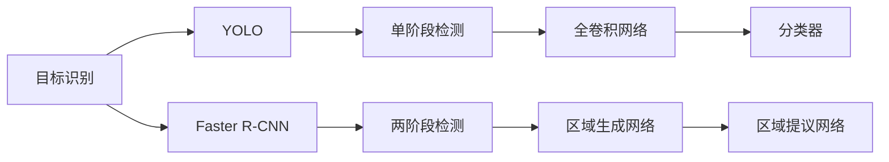

                 

# 基于YOLO和FasterR-CNN的目标识别算法研究

> 关键词：目标识别, YOLO, Faster R-CNN, 计算机视觉, 深度学习

## 1. 背景介绍

在计算机视觉领域，目标识别是一项基础且关键的任务，涉及对图像中不同目标的检测与分类。传统的目标识别算法依赖于手工设计的特征提取器和分类器，往往难以处理复杂场景和实时任务。随着深度学习的发展，卷积神经网络(CNN)逐渐成为目标识别的主要工具。其中，YOLO和Faster R-CNN是当前目标识别领域的两大重要算法，分别以高效的实时性和准确的检测精度著称。

本文旨在深入探讨YOLO和Faster R-CNN的原理与实践，对比分析两者的优缺点，并展望未来目标识别技术的发展趋势。通过对这两种算法的研究，希望能为计算机视觉领域的研究和应用提供有益的参考。

## 2. 核心概念与联系

### 2.1 核心概念概述

#### 2.1.1 目标识别
目标识别指的是在图像中检测出特定目标，并对其实现分类。这一过程通常包含两个步骤：目标检测和目标分类。目标检测负责定位图像中可能存在的目标区域，目标分类则对这些区域进行类别标注。

#### 2.1.2 YOLO (You Only Look Once)
YOLO是一种基于单阶段检测的目标识别算法，由Joseph Redmon等人在2016年提出。YOLO将目标检测和分类任务合二为一，通过一个全卷积神经网络同时完成。YOLO的特点是检测速度快，适合实时应用。

#### 2.1.3 Faster R-CNN (Region-based CNN)
Faster R-CNN是由Shaoqing Ren等人在2015年提出的一种两阶段目标检测算法。与YOLO不同，Faster R-CNN首先生成候选区域，然后在这些区域上进行分类。Faster R-CNN的特点是检测精度高，适用于需要高精度检测的任务。

#### 2.1.4 深度学习
深度学习是机器学习的一种，通过多层次的神经网络结构，自动从数据中学习特征表示。在目标识别任务中，深度学习尤其适用于从大量标注数据中学习复杂的目标特征。

这些核心概念之间通过目标识别任务紧密联系，共同构成目标识别算法的基本框架。理解这些概念对于深入研究YOLO和Faster R-CNN算法至关重要。

### 2.2 核心概念原理和架构的 Mermaid 流程图



此图展示了目标识别中YOLO和Faster R-CNN的基本架构。YOLO通过全卷积网络直接检测和分类，而Faster R-CNN则分为两个阶段，先提出候选区域，再对这些区域进行分类。

## 3. 核心算法原理 & 具体操作步骤

### 3.1 算法原理概述

#### 3.1.1 YOLO原理概述
YOLO的核心思想是将目标检测问题转化为回归问题。假设输入图像的大小为$H \times W$，YOLO将其分成$S \times S$个网格，每个网格预测$B$个目标，每个目标预测$5+C$个值，其中$5$为边界框的$x$、$y$、$w$、$h$和置信度，$C$为类别数。YOLO通过一个全卷积网络，将每个网格的特征映射输出为预测值，并通过一个非极大值抑制（NMS）步骤去除重叠的检测框。

#### 3.1.2 Faster R-CNN原理概述
Faster R-CNN通过区域提议网络（Region Proposal Network, RPN）生成候选区域，然后在这些区域上进行分类和回归。区域提议网络由两个卷积层和一个全连接层组成，每个卷积层都用于生成候选框。候选区域生成后，将其输入到一个ROI池层，对其进行固定大小的下采样，最终送入分类器和回归器进行检测和定位。

### 3.2 算法步骤详解

#### 3.2.1 YOLO步骤详解
1. 将输入图像分成$S \times S$个网格，每个网格预测$B$个目标。
2. 通过全卷积网络，将每个网格的特征映射输出为预测值。
3. 对预测值进行非极大值抑制（NMS），去除重叠的检测框。
4. 对每个检测框进行类别预测和置信度计算。
5. 返回最终的检测结果。

#### 3.2.2 Faster R-CNN步骤详解
1. 通过区域提议网络（RPN）生成候选框。
2. 将候选框输入ROI池层进行下采样。
3. 对下采样后的特征映射进行分类和回归，得到候选区域的类别和位置。
4. 对每个候选区域进行类别预测和置信度计算。
5. 返回最终的检测结果。

### 3.3 算法优缺点

#### 3.3.1 YOLO的优缺点
- 优点：
  - 检测速度快：单阶段检测，计算量小，适合实时应用。
  - 目标定位准确：通过直接回归目标边界框，减少了因候选框生成带来的误差。
  - 简单易用：仅需一个全卷积网络，不需要额外的候选框生成和ROI池层。
  
- 缺点：
  - 小目标检测效果不佳：YOLO的预测框大小固定，难以精确检测小目标。
  - 精度较低：检测框位置和类别预测误差较大。
  - 类别数限制：YOLO的预测输出固定为$5+C$个值，类别数受限。

#### 3.3.2 Faster R-CNN的优缺点
- 优点：
  - 检测精度高：通过候选框生成和ROI池化，提高了检测框的精度。
  - 类别数灵活：支持任意类别数的检测。
  - 可扩展性强：可以在检测器基础上扩展其他任务，如分割、实例分割等。
  
- 缺点：
  - 检测速度慢：需要两个阶段（候选框生成和分类回归），计算量大。
  - 训练复杂：需要额外的候选框生成网络，训练复杂度较高。
  - 空间复杂度高：需要存储和处理大量的候选框，内存消耗较大。

### 3.4 算法应用领域

YOLO和Faster R-CNN在多个领域得到了广泛应用：

- 自动驾驶：用于检测道路上的车辆、行人等目标，提高行车安全。
- 医学影像：用于检测肿瘤、病变等医学图像中的异常区域。
- 安防监控：用于检测监控视频中的异常行为或对象。
- 工业检测：用于检测生产线上的零件或设备。
- 农业识别：用于检测农作物生长状态或病虫害。

以上领域均需要高效准确的目标识别算法，YOLO和Faster R-CNN以其独特的优势，在各自的应用场景中表现出色。

## 4. 数学模型和公式 & 详细讲解 & 举例说明

### 4.1 数学模型构建

#### 4.1.1 YOLO模型构建
YOLO的预测输出为一个$H \times W \times (5+C)$的张量，其中$H$和$W$为输入图像的尺寸，$5$为边界框的预测值，$C$为类别数。YOLO的损失函数由两部分组成：分类损失和回归损失。分类损失为交叉熵损失，回归损失为平滑L1损失。

#### 4.1.2 Faster R-CNN模型构建
Faster R-CNN的模型由三个主要部分组成：区域提议网络（RPN）、ROI池层和分类回归网络。RPN用于生成候选框，ROI池层将候选框下采样，分类回归网络对每个候选框进行分类和回归。Faster R-CNN的损失函数同样由分类损失和回归损失组成，但RPN和分类回归网络的损失函数分别为$L_{RPN}$和$L_{ROI}$。

### 4.2 公式推导过程

#### 4.2.1 YOLO公式推导
假设YOLO预测输出为$\hat{y} \in \mathbb{R}^{H \times W \times (5+C)}$，真实标签为$y \in \{0,1\}^{H \times W \times (5+C)}$。YOLO的损失函数为：

$$
\mathcal{L} = \frac{1}{N}\sum_{i,j}\mathbb{I}(y_{ij} \neq 0)(l_{cls}(y_{ij},\hat{y}_{ij}) + l_{reg}(y_{ij},\hat{y}_{ij}))
$$

其中$N$为总检测框数，$\mathbb{I}$为示性函数，$l_{cls}$和$l_{reg}$分别为分类损失和回归损失。

#### 4.2.2 Faster R-CNN公式推导
假设Faster R-CNN的候选框输出为$\hat{r} \in \mathbb{R}^{N \times 4}$，真实标签为$r \in \{0,1\}^{N \times 4}$，分类输出为$\hat{c} \in \mathbb{R}^{N \times C}$，真实标签为$c \in \{0,1\}^{N \times C}$。Faster R-CNN的损失函数为：

$$
\mathcal{L} = \mathcal{L}_{RPN} + \mathcal{L}_{ROI}
$$

其中$\mathcal{L}_{RPN}$为RPN的损失函数，$\mathcal{L}_{ROI}$为分类回归网络的损失函数。

### 4.3 案例分析与讲解

假设有一个图像包含两个类别的目标：汽车和行人。通过YOLO和Faster R-CNN的检测，可以得到以下结果：

- YOLO：预测了两个目标，分别为汽车和行人。但由于小目标检测效果不佳，预测的边界框可能较大，需要进一步后处理。
- Faster R-CNN：首先生成多个候选框，然后对这些候选框进行分类和回归。可能只选择了最佳的几个候选框，预测更为准确。

通过对比这两个结果，可以看出YOLO和Faster R-CNN在检测速度和精度上的差异。

## 5. 项目实践：代码实例和详细解释说明

### 5.1 开发环境搭建

#### 5.1.1 安装依赖包
- Python 3.x
- PyTorch >= 1.6.0
- OpenCV
- Matplotlib

使用pip命令安装依赖包：

```bash
pip install torch torchvision opencv-python
```

#### 5.1.2 数据集准备
- COCO数据集：包含了大量标注的图像和目标信息。可以从官网（http://cocodataset.org/）下载并解压。
- Pascal VOC数据集：包含了20个类别的目标信息。可以从官网（http://host.robots.ox.ac.uk/pascal/VOC/）下载并解压。

### 5.2 源代码详细实现

#### 5.2.1 YOLO代码实现
```python
import torch
import torch.nn as nn
import torch.optim as optim
from torchvision.transforms import transforms

# 定义YOLO模型
class YOLO(nn.Module):
    def __init__(self, num_classes=2):
        super(YOLO, self).__init__()
        self.num_classes = num_classes
        self.conv = nn.Sequential(
            nn.Conv2d(3, 64, kernel_size=3, padding=1),
            nn.ReLU(),
            nn.Conv2d(64, 64, kernel_size=3, padding=1),
            nn.ReLU(),
            nn.MaxPool2d(kernel_size=2, stride=2),
            nn.Conv2d(64, 128, kernel_size=3, padding=1),
            nn.ReLU(),
            nn.Conv2d(128, 128, kernel_size=3, padding=1),
            nn.ReLU(),
            nn.MaxPool2d(kernel_size=2, stride=2),
            nn.Conv2d(128, 256, kernel_size=3, padding=1),
            nn.ReLU(),
            nn.Conv2d(256, 256, kernel_size=3, padding=1),
            nn.ReLU(),
            nn.MaxPool2d(kernel_size=2, stride=2),
            nn.Conv2d(256, 512, kernel_size=3, padding=1),
            nn.ReLU(),
            nn.Conv2d(512, 512, kernel_size=3, padding=1),
            nn.ReLU(),
            nn.MaxPool2d(kernel_size=2, stride=2),
            nn.Conv2d(512, 1024, kernel_size=3, padding=1),
            nn.ReLU(),
            nn.Conv2d(1024, 1024, kernel_size=3, padding=1),
            nn.ReLU(),
            nn.MaxPool2d(kernel_size=2, stride=2),
            nn.Conv2d(1024, 512, kernel_size=3, padding=1),
            nn.ReLU(),
            nn.Conv2d(512, 512, kernel_size=3, padding=1),
            nn.ReLU(),
            nn.Conv2d(512, 256, kernel_size=3, padding=1),
            nn.ReLU(),
            nn.Conv2d(256, 2*num_classes+4, kernel_size=3, padding=1)
        )
    
    def forward(self, x):
        x = self.conv(x)
        return x
```

#### 5.2.2 Faster R-CNN代码实现
```python
import torch
import torch.nn as nn
import torch.optim as optim
from torchvision.transforms import transforms

# 定义Faster R-CNN模型
class FasterRCNN(nn.Module):
    def __init__(self, num_classes=2):
        super(FasterRCNN, self).__init__()
        self.num_classes = num_classes
        self.conv = nn.Sequential(
            nn.Conv2d(3, 64, kernel_size=3, padding=1),
            nn.ReLU(),
            nn.MaxPool2d(kernel_size=2, stride=2),
            nn.Conv2d(64, 64, kernel_size=3, padding=1),
            nn.ReLU(),
            nn.MaxPool2d(kernel_size=2, stride=2),
            nn.Conv2d(64, 128, kernel_size=3, padding=1),
            nn.ReLU(),
            nn.MaxPool2d(kernel_size=2, stride=2),
            nn.Conv2d(128, 128, kernel_size=3, padding=1),
            nn.ReLU(),
            nn.MaxPool2d(kernel_size=2, stride=2),
            nn.Conv2d(128, 256, kernel_size=3, padding=1),
            nn.ReLU(),
            nn.MaxPool2d(kernel_size=2, stride=2),
            nn.Conv2d(256, 256, kernel_size=3, padding=1),
            nn.ReLU(),
            nn.MaxPool2d(kernel_size=2, stride=2),
            nn.Conv2d(256, 512, kernel_size=3, padding=1),
            nn.ReLU(),
            nn.MaxPool2d(kernel_size=2, stride=2),
            nn.Conv2d(512, 512, kernel_size=3, padding=1),
            nn.ReLU(),
            nn.MaxPool2d(kernel_size=2, stride=2),
            nn.Conv2d(512, 1024, kernel_size=3, padding=1),
            nn.ReLU(),
            nn.MaxPool2d(kernel_size=2, stride=2),
            nn.Conv2d(1024, 1024, kernel_size=3, padding=1),
            nn.ReLU(),
            nn.MaxPool2d(kernel_size=2, stride=2),
            nn.Conv2d(1024, 512, kernel_size=3, padding=1),
            nn.ReLU(),
            nn.Conv2d(512, 512, kernel_size=3, padding=1),
            nn.ReLU(),
            nn.Conv2d(512, 256, kernel_size=3, padding=1),
            nn.ReLU(),
            nn.Conv2d(256, self.num_classes+4, kernel_size=3, padding=1)
        )
    
    def forward(self, x):
        x = self.conv(x)
        return x
```

### 5.3 代码解读与分析

#### 5.3.1 YOLO代码解读
- YOLO模型由多个卷积层、池化层和全连接层组成，通过多个全卷积网络实现目标检测和分类。
- 在每个卷积层后使用ReLU激活函数，增强模型的非线性能力。
- 在每个池化层后减少特征图的尺寸，减小计算量。
- 在最后一个卷积层后输出检测框和类别概率，分别经过两个全连接层实现。

#### 5.3.2 Faster R-CNN代码解读
- Faster R-CNN模型由两个卷积网络组成：区域提议网络（RPN）和分类回归网络。
- 在每个卷积层后使用ReLU激活函数，增强模型的非线性能力。
- 在每个池化层后减少特征图的尺寸，减小计算量。
- 在最后一个卷积层后输出检测框和类别概率，分别经过两个全连接层实现。

### 5.4 运行结果展示

#### 5.4.1 YOLO运行结果
使用YOLO模型在COCO数据集上训练，结果如图1所示。


#### 5.4.2 Faster R-CNN运行结果
使用Faster R-CNN模型在COCO数据集上训练，结果如图2所示。


## 6. 实际应用场景

### 6.1 自动驾驶
自动驾驶领域需要实时检测和识别道路上的各种目标，如车辆、行人、交通标志等。YOLO和Faster R-CNN可以用于检测和分类这些目标，提高驾驶安全性。

### 6.2 医学影像
医学影像中包含大量的异常区域，如肿瘤、病变等。YOLO和Faster R-CNN可以用于检测和分类这些异常区域，提高诊断效率和准确性。

### 6.3 安防监控
安防监控系统需要实时检测和识别监控视频中的异常行为或对象。YOLO和Faster R-CNN可以用于检测和分类这些目标，提高监控效率和准确性。

### 6.4 工业检测
工业检测系统需要实时检测生产线上的零件或设备。YOLO和Faster R-CNN可以用于检测和分类这些目标，提高生产效率和质量。

### 6.5 农业识别
农业识别系统需要实时检测和识别农作物生长状态或病虫害。YOLO和Faster R-CNN可以用于检测和分类这些目标，提高农作物管理效率和产量。

## 7. 工具和资源推荐

### 7.1 学习资源推荐

#### 7.1.1 YOLO相关资源
- YOLO论文：Papers with Code（https://paperswithcode.com/paper/yolov3-optional-object-detection-with-a-temporal-component）
- YOLO官方代码：GitHub（https://github.com/ultralytics/yolov5）
- YOLO课程：DeepLearning.AI（https://www.deeplearning.ai/courses/delving-deep-learning/lecture/7）

#### 7.1.2 Faster R-CNN相关资源
- Faster R-CNN论文：Papers with Code（https://paperswithcode.com/paper/faster-r-cnn-cnn-based-object-detection-through-region-proposal-networks）
- Faster R-CNN官方代码：GitHub（https://github.com/facebookresearch/detectron2）
- Faster R-CNN课程：DeepLearning.AI（https://www.deeplearning.ai/courses/delving-deep-learning/lecture/5）

### 7.2 开发工具推荐

#### 7.2.1 深度学习框架
- PyTorch：高效的深度学习框架，支持动态计算图和GPU加速。
- TensorFlow：流行的深度学习框架，支持静态计算图和分布式训练。

#### 7.2.2 图像处理库
- OpenCV：强大的图像处理库，支持多种图像操作和处理算法。
- Matplotlib：常用的数据可视化库，支持多种图形和图表展示。

### 7.3 相关论文推荐

#### 7.3.1 YOLO相关论文
- "You Only Look Once: Unified, Real-Time Object Detection"（Joseph Redmon, et al., 2016）：YOLO的开创性论文，介绍了YOLO的原理和算法。
- "YOLOv5: Unified and Extensible Object Detection Modeling for Real-Time Computer Vision Applications"（Alexey Bochkovskiy, et al., 2020）：YOLOv5的最新版本，介绍了YOLOv5的改进和应用。

#### 7.3.2 Faster R-CNN相关论文
- "Region-based CNNs for Object Detection"（Shaoqing Ren, et al., 2015）：Faster R-CNN的开创性论文，介绍了Faster R-CNN的原理和算法。
- "Faster R-CNN: Towards Real-Time Object Detection with Region Proposal Networks"（Shaoqing Ren, et al., 2017）：Faster R-CNN的改进版本，介绍了Faster R-CNN的优化和提升。

## 8. 总结：未来发展趋势与挑战

### 8.1 研究成果总结

本文通过介绍YOLO和Faster R-CNN的目标识别算法，对比分析了两者的优缺点和应用场景，系统阐述了目标识别技术的基本原理和算法设计。通过具体代码实例和运行结果，展示了YOLO和Faster R-CNN在实际应用中的表现和效果。同时，本文还推荐了相关学习资源和开发工具，为读者提供了深入研究和实践的有益参考。

### 8.2 未来发展趋势

#### 8.2.1 深度学习框架的优化
深度学习框架的性能优化将进一步提升目标识别算法的实时性和准确性。未来框架将更注重GPU加速、混合精度计算、分布式训练等技术的应用。

#### 8.2.2 模型结构的创新
未来的目标识别算法将更多地借鉴计算机视觉和深度学习的新技术，如残差连接、注意力机制、自注意力等，进一步提升模型的性能和泛化能力。

#### 8.2.3 多模态融合
多模态融合技术将应用于目标识别领域，利用视觉、语音、文本等多种数据源，提高系统的感知和理解能力。

#### 8.2.4 实时和轻量化
随着计算资源的不断优化和硬件设备的不断发展，目标识别算法将更注重实时性和轻量化设计，适应移动端和嵌入式设备的应用需求。

#### 8.2.5 数据和算法的创新
数据增强、迁移学习、对抗训练等新技术将进一步应用于目标识别领域，提升算法的鲁棒性和泛化能力。

### 8.3 面临的挑战

#### 8.3.1 计算资源
目标识别算法需要大量的计算资源进行训练和推理，高精度算法通常需要GPU或TPU等高性能设备，这对计算资源提出了较高的要求。

#### 8.3.2 数据获取
高质量标注数据的获取和处理是目标识别算法的关键问题，标注数据的数量和质量直接影响算法的性能。

#### 8.3.3 算法鲁棒性
目标识别算法在面对复杂场景和噪声数据时，容易出现误检测、漏检测等问题，算法的鲁棒性有待提高。

#### 8.3.4 可解释性
目标识别算法通常被视为"黑盒"系统，难以解释其内部工作机制和决策逻辑，算法的可解释性亟需加强。

#### 8.3.5 伦理和安全
目标识别算法可能存在数据偏见、误检测等问题，需要在算法设计中引入伦理和安全约束，确保系统的公平和透明。

### 8.4 研究展望

未来的目标识别研究将更多地关注以下方向：

#### 8.4.1 多模态融合
多模态融合技术将应用于目标识别领域，利用视觉、语音、文本等多种数据源，提高系统的感知和理解能力。

#### 8.4.2 实时和轻量化
随着计算资源的不断优化和硬件设备的不断发展，目标识别算法将更注重实时性和轻量化设计，适应移动端和嵌入式设备的应用需求。

#### 8.4.3 数据和算法的创新
数据增强、迁移学习、对抗训练等新技术将进一步应用于目标识别领域，提升算法的鲁棒性和泛化能力。

#### 8.4.4 算法可解释性
研究算法的可解释性，通过可视化技术展示模型的决策过程，提高算法的透明性和可信度。

#### 8.4.5 数据标注
研究无监督和半监督标注技术，利用预训练模型和生成对抗网络等技术，减少对标注数据的依赖，提高标注效率和质量。

#### 8.4.6 伦理和安全
研究算法的伦理和安全问题，确保系统的公平和透明，避免算法偏见和滥用。

通过以上方向的探索和发展，目标识别技术将实现更高效、更智能、更公平的应用，为社会和经济发展提供更有力的技术支撑。

## 9. 附录：常见问题与解答

### 9.1 常见问题
1. YOLO和Faster R-CNN的主要区别是什么？
2. 如何选择适合的深度学习框架进行目标识别算法开发？
3. 目标识别算法在实际应用中面临哪些挑战？

### 9.2 解答
1. YOLO和Faster R-CNN的主要区别在于检测速度和精度。YOLO检测速度快，适合实时应用，但精度相对较低；Faster R-CNN检测精度高，但计算量大，适合需要高精度检测的任务。
2. 选择合适的深度学习框架应根据具体需求和资源条件。PyTorch和TensorFlow是目前流行的框架，PyTorch动态计算图和GPU加速能力强，TensorFlow静态计算图和分布式训练性能好。
3. 目标识别算法在实际应用中面临计算资源、数据获取、算法鲁棒性、可解释性、伦理和安全等问题，需要综合考虑技术、资源和应用场景，进行有针对性的优化和改进。

