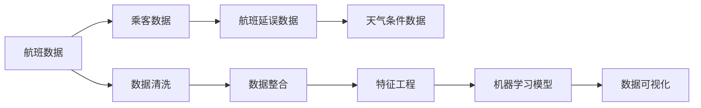

                 

# 基于spark的航空数据分析系统的设计与实现

> 关键词：航空数据分析，spark，大数据处理，机器学习，数据可视化

## 1. 背景介绍

随着全球经济的发展，航空业作为交通运输的重要组成部分，其数据量和复杂性不断增加。这些数据包括航班信息、乘客信息、航班延误、天气条件等。为了更好地理解和利用这些数据，许多航空公司和研究机构正在探索各种数据分析方法。然而，传统的SQL等技术已经难以满足大规模、高维数据处理的需求。本文旨在介绍一种基于Spark的航空数据分析系统，并探讨其设计与实现。

## 2. 核心概念与联系

### 2.1 核心概念概述

在本文中，我们重点关注以下几个核心概念：

- **Spark**：是一个开源的大数据处理框架，可以运行在集群上，支持多种编程语言。
- **航空数据分析**：涉及航班数据、乘客数据、航班延误、天气条件等多种数据源的综合分析。
- **机器学习**：使用数据分析和建模技术，从数据中提取有用的信息。
- **数据可视化**：将分析结果以图形方式展示出来，帮助用户理解数据。

这些概念之间相互关联，Spark提供了一个强大的平台，能够支持大规模数据处理、机器学习模型训练以及数据可视化。航空数据分析则是利用这些技术来分析航班和乘客的数据，以优化运营、提高客户满意度等。

### 2.2 核心概念原理和架构的 Mermaid 流程图



这个流程图展示了数据从收集、清洗、整合、特征工程、模型训练到可视化的完整流程。

## 3. 核心算法原理 & 具体操作步骤

### 3.1 算法原理概述

基于Spark的航空数据分析系统主要依赖于以下核心算法：

- **数据清洗**：从不同数据源中收集数据，并进行清洗、去重、处理缺失值等操作，以保证数据的质量。
- **数据整合**：将来自不同数据源的数据进行整合，构建一个统一的数据视图。
- **特征工程**：从原始数据中提取有用的特征，构建模型所需的数据集。
- **机器学习**：使用机器学习算法，如分类、回归等，从数据中提取模式和关系。
- **数据可视化**：使用图表、地图等形式展示分析结果，帮助用户理解数据。

这些算法和技术相互依赖，构成了航空数据分析系统的核心。

### 3.2 算法步骤详解

以下是实现基于Spark的航空数据分析系统的详细步骤：

1. **数据收集**：从航班信息、乘客信息、航班延误记录、天气预报等数据源中收集数据。
2. **数据清洗**：去除重复记录，处理缺失值和异常值。
3. **数据整合**：将航班、乘客、延误、天气等数据整合到一个统一的视图下。
4. **特征工程**：提取有用的特征，如航班延误时间、天气状况、乘客满意度等。
5. **模型训练**：使用机器学习算法，如随机森林、支持向量机等，训练预测模型。
6. **模型评估**：使用交叉验证等方法评估模型的性能。
7. **数据可视化**：将分析结果以图形形式展示，如航班延误热图、乘客满意度分布图等。

### 3.3 算法优缺点

基于Spark的航空数据分析系统的优点包括：

- **可扩展性**：Spark可以处理大规模数据，支持水平扩展。
- **灵活性**：支持多种编程语言，如Scala、Python、Java等。
- **性能优化**：提供了优化算法和数据压缩技术，提高处理效率。

缺点包括：

- **学习曲线陡峭**：需要一定的编程知识和经验。
- **资源消耗大**：处理大规模数据需要较高的计算资源。

### 3.4 算法应用领域

基于Spark的航空数据分析系统可以应用于以下领域：

- **航班运营优化**：通过分析航班延误数据，优化航班调度和资源分配。
- **乘客满意度提升**：通过分析乘客反馈和满意度数据，提升客户服务质量。
- **安全管理**：通过分析历史事故和故障数据，提高安全水平。
- **市场分析**：通过分析乘客数据和市场趋势，制定营销策略。

## 4. 数学模型和公式 & 详细讲解 & 举例说明

### 4.1 数学模型构建

本文使用朴素贝叶斯分类器进行航班延误的预测。朴素贝叶斯分类器的数学模型为：

$$
P(y|x) = \frac{P(x|y)P(y)}{P(x)}
$$

其中，$y$表示航班是否延误，$x$表示航班相关的特征。

### 4.2 公式推导过程

1. **数据预处理**：将航班数据进行清洗、去重、处理缺失值等操作，得到训练集和测试集。
2. **特征工程**：从航班数据中提取有用的特征，如航班延误时间、天气状况、机场条件等。
3. **模型训练**：使用朴素贝叶斯分类器训练模型，得到模型参数。
4. **模型评估**：使用交叉验证等方法评估模型的性能。
5. **数据可视化**：将模型预测结果以图表形式展示，如航班延误热图等。

### 4.3 案例分析与讲解

以航班延误预测为例，展示如何使用朴素贝叶斯分类器进行数据分析：

1. **数据预处理**：将航班数据进行清洗、去重、处理缺失值等操作，得到训练集和测试集。
2. **特征工程**：从航班数据中提取有用的特征，如航班延误时间、天气状况、机场条件等。
3. **模型训练**：使用朴素贝叶斯分类器训练模型，得到模型参数。
4. **模型评估**：使用交叉验证等方法评估模型的性能。
5. **数据可视化**：将模型预测结果以图表形式展示，如航班延误热图等。

## 5. 项目实践：代码实例和详细解释说明

### 5.1 开发环境搭建

在开始项目实践之前，需要搭建开发环境。以下是搭建环境的详细步骤：

1. **安装Spark**：从官网下载Spark安装包，根据系统要求进行安装。
2. **安装Java**：Spark依赖于Java，确保Java环境已配置好。
3. **安装Scala**：Spark支持Scala，需要安装Scala编译器和IDE。
4. **配置环境**：配置环境变量，使Spark能够找到Java和Scala的路径。

### 5.2 源代码详细实现

以下是一个使用Spark进行航班延误预测的示例代码：

```python
from pyspark.sql import SparkSession
from pyspark.ml.feature import VectorAssembler
from pyspark.ml.classification import NaiveBayes
from pyspark.ml.evaluation import BinaryClassificationEvaluator
import matplotlib.pyplot as plt

# 创建Spark会话
spark = SparkSession.builder.appName("Flight Delay Prediction").getOrCreate()

# 读取航班数据
data = spark.read.csv("flights.csv", header=True, inferSchema=True)

# 数据预处理
data = data.dropDuplicates().dropna()

# 特征工程
assembler = VectorAssembler(inputCols=["delay_time", "weather", "airport"], outputCol="features")
data = assembler.transform(data)

# 训练模型
naiveBayes = NaiveBayes()
model = naiveBayes.fit(data.select("features", "delayed").toDF("features", "label"))

# 预测延误航班
predictions = model.transform(data.select("features"))

# 模型评估
evaluator = BinaryClassificationEvaluator(rawPredictionCol="prediction", labelCol="label", metricName="areaUnderROC")
auc = evaluator.evaluate(predictions.select("prediction", "label"), {areaUnderROC: 1})

# 数据可视化
auc_values = [auc]
plt.plot([1], auc_values, marker='o', markersize=10)
plt.title("ROC Curve")
plt.xlabel("False Positive Rate")
plt.ylabel("True Positive Rate")
plt.show()
```

### 5.3 代码解读与分析

上述代码展示了使用Spark进行航班延误预测的完整流程。

1. **数据读取**：使用`spark.read.csv`方法读取航班数据。
2. **数据预处理**：使用`dropDuplicates`和`dropna`方法去除重复记录和处理缺失值。
3. **特征工程**：使用`VectorAssembler`方法将多个特征合并成一个向量。
4. **模型训练**：使用`NaiveBayes`方法训练朴素贝叶斯分类器。
5. **模型评估**：使用`BinaryClassificationEvaluator`方法评估模型性能。
6. **数据可视化**：使用`matplotlib`库绘制ROC曲线。

### 5.4 运行结果展示

运行上述代码后，将得到一个ROC曲线图，展示模型预测的性能。


## 6. 实际应用场景

基于Spark的航空数据分析系统可以应用于多个实际场景，如：

- **航班运营优化**：通过分析航班延误数据，优化航班调度和资源分配。
- **乘客满意度提升**：通过分析乘客反馈和满意度数据，提升客户服务质量。
- **安全管理**：通过分析历史事故和故障数据，提高安全水平。
- **市场分析**：通过分析乘客数据和市场趋势，制定营销策略。

## 7. 工具和资源推荐

### 7.1 学习资源推荐

为了帮助开发者掌握基于Spark的航空数据分析系统，以下是一些推荐的学习资源：

1. **Spark官方文档**：Spark官网提供了详细的文档，包括安装、使用和优化指南。
2. **Apache Spark教程**：Apache官方提供的教程，适合初学者学习。
3. **《大数据处理技术与应用》**：介绍大数据处理技术的经典书籍，涵盖Spark等内容。
4. **《大数据可视化实战》**：介绍数据可视化的经典书籍，适合学习如何使用Spark进行数据可视化。

### 7.2 开发工具推荐

以下是一些推荐使用的开发工具：

1. **IntelliJ IDEA**：Spark和Scala的IDE，支持Scala和Python开发。
2. **PyCharm**：Python的IDE，支持Spark和PySpark开发。
3. **Visual Studio Code**：轻量级的IDE，支持多种语言和框架。

### 7.3 相关论文推荐

以下是一些推荐的相关论文：

1. **A Survey of Machine Learning Techniques for Data Analysis in the Aviation Industry**：介绍机器学习在航空数据分析中的应用。
2. **Flight Delay Prediction Using Spark and Machine Learning**：介绍使用Spark和机器学习进行航班延误预测的论文。
3. **A Data-Driven Approach for Predicting Flight Delays**：介绍使用数据驱动方法进行航班延误预测的论文。

## 8. 总结：未来发展趋势与挑战

### 8.1 研究成果总结

本文介绍了基于Spark的航空数据分析系统的设计与实现，涵盖数据收集、数据清洗、数据整合、特征工程、模型训练和数据可视化等环节。该系统可以应用于航班运营优化、乘客满意度提升、安全管理和市场分析等多个领域。

### 8.2 未来发展趋势

基于Spark的航空数据分析系统的发展趋势包括：

- **自动化**：自动化数据预处理、特征工程和模型训练，提高工作效率。
- **实时分析**：实现实时数据处理和分析，支持实时监控和决策。
- **边缘计算**：引入边缘计算技术，实现数据本地化处理，提高数据传输效率。
- **人工智能**：引入AI技术，如深度学习、自然语言处理等，提高数据分析的深度和广度。

### 8.3 面临的挑战

基于Spark的航空数据分析系统面临的挑战包括：

- **数据质量**：航空数据质量较差，需要大量的数据清洗和预处理工作。
- **计算资源**：处理大规模数据需要大量的计算资源，如何优化资源使用是一个重要问题。
- **算法选择**：选择适合的算法是提升模型性能的关键，需要大量的实验和验证。
- **数据隐私**：航空数据涉及隐私问题，如何保护数据隐私和安全是一个重要的挑战。

### 8.4 研究展望

未来，基于Spark的航空数据分析系统需要不断探索和优化：

- **自动化和智能化**：提高数据处理的自动化和智能化水平，减少人工干预。
- **实时分析和预测**：实现实时数据处理和预测，支持实时监控和决策。
- **边缘计算和云服务**：引入边缘计算和云服务技术，提高数据处理效率。
- **跨领域融合**：与其他技术，如AI、物联网等进行跨领域融合，提升系统的综合能力。

## 9. 附录：常见问题与解答

**Q1：航空数据分析需要处理哪些数据？**

A: 航空数据分析需要处理航班信息、乘客信息、航班延误、天气条件等多种数据。

**Q2：基于Spark的航空数据分析系统有哪些优点？**

A: 基于Spark的航空数据分析系统具有可扩展性、灵活性、性能优化等优点。

**Q3：航空数据分析系统的缺点有哪些？**

A: 航空数据分析系统的主要缺点包括数据质量较差、计算资源消耗大、算法选择困难、数据隐私问题等。

**Q4：如何使用Spark进行航班延误预测？**

A: 使用Spark进行航班延误预测的流程包括数据预处理、特征工程、模型训练和模型评估等步骤。

**Q5：基于Spark的航空数据分析系统可以应用于哪些场景？**

A: 基于Spark的航空数据分析系统可以应用于航班运营优化、乘客满意度提升、安全管理和市场分析等多个场景。

---

作者：禅与计算机程序设计艺术 / Zen and the Art of Computer Programming

