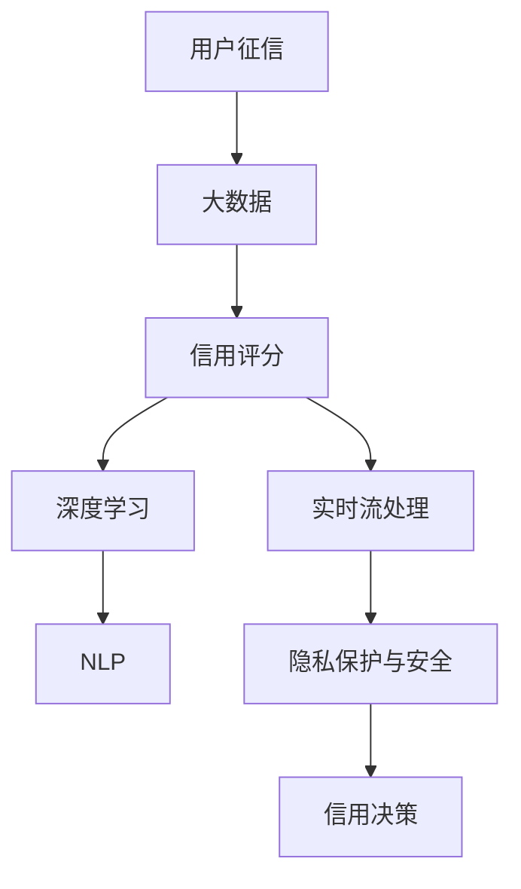

                 

# 基于大数据下用户征信问题分析与研究

> 关键词：用户征信、大数据、信用评分、风险控制、机器学习

## 1. 背景介绍

### 1.1 问题由来
在当今数字化时代，信用体系已经成为社会经济活动的基础设施之一。在金融借贷、信用评估、风险管理等领域，用户征信数据扮演着至关重要的角色。然而，随着数据量的指数级增长，用户征信问题也变得越来越复杂。

具体来说，用户征信问题主要体现在以下几个方面：
- **数据量和质量**：用户征信数据往往包含海量的文本、行为、社交等异构数据，且数据质量参差不齐，噪音干扰严重。
- **隐私和合规**：用户征信涉及个人隐私，需要遵守严格的隐私保护法规，如GDPR等。
- **实时性和动态性**：用户行为和交易数据实时产生，需要及时更新信用评分模型。
- **多维度融合**：传统的信用评分模型往往单一维度评估，难以全面刻画用户风险，需要进行多维度融合。

面对这些挑战，研究者们开始探索基于大数据的用户征信方法，希望通过深度学习、自然语言处理等先进技术，建立更加全面、准确的信用评估体系。

### 1.2 问题核心关键点
大数据背景下的用户征信问题，核心在于如何利用海量异构数据，高效构建信用评分模型，并在实时场景下动态更新风险评估。具体来说：
- **数据融合与特征工程**：如何高效处理、融合和提取多维度用户数据，构建完备的特征向量。
- **深度学习与模型优化**：如何设计适合用户征信任务的深度学习模型，并通过正则化、对抗训练等手段优化模型。
- **实时数据流处理**：如何高效处理实时数据流，实现信用评分模型的动态更新。
- **隐私保护与安全**：如何在保障用户隐私的前提下，安全地存储和处理用户数据。

这些关键问题亟待研究和突破，以构建稳定、可靠的信用评分系统。

## 2. 核心概念与联系

### 2.1 核心概念概述

为更好地理解基于大数据的用户征信问题，本节将介绍几个密切相关的核心概念：

- **用户征信**：通过对用户历史行为、社交数据、交易记录等进行综合分析，评估用户的信用风险，为用户提供授信额度或风险管理策略。

- **大数据**：指传统数据处理方式难以处理的数据集合，通常包括海量、高速、多样、复杂的数据。

- **信用评分**：通过量化用户的信用行为，构建数学模型，预测用户未来信用风险，用于信用决策和风险管理。

- **深度学习**：一种基于神经网络的机器学习范式，通过多层次特征学习，实现更加复杂的模式识别和预测任务。

- **自然语言处理(NLP)**：利用计算方法处理、分析和生成自然语言，广泛应用于文本分类、情感分析、问答系统等任务。

- **实时流处理**：一种能够处理连续到达的数据流、及时响应事件的技术，常用于实时数据分析和决策。

- **隐私保护与安全**：指在数据处理和分析过程中，保障用户隐私信息不被泄露的技术手段，如差分隐私、联邦学习等。

这些核心概念之间的逻辑关系可以通过以下Mermaid流程图来展示：



这个流程图展示了用户征信的主要过程和技术栈：

1. 通过大数据收集用户行为数据。
2. 使用信用评分模型评估用户信用风险。
3. 引入深度学习模型进行特征提取和模式识别。
4. 应用NLP技术处理文本数据，提取关键特征。
5. 通过实时流处理技术动态更新信用评分。
6. 采用隐私保护与安全技术保障用户数据安全。
7. 基于综合评估结果，进行信用决策。

这些概念共同构成了基于大数据的用户征信框架，为构建高效的信用评估体系提供了理论基础。

## 3. 核心算法原理 & 具体操作步骤
### 3.1 算法原理概述

基于大数据的用户征信方法，核心在于利用机器学习和大数据技术，高效处理和融合海量用户数据，构建全面、准确的用户信用评分模型。其主要步骤如下：

1. **数据预处理**：清洗、去噪、归一化处理用户行为数据，构建特征向量。
2. **特征工程**：设计特征选择、融合、降维等方法，提取关键特征。
3. **模型构建**：选择合适的机器学习模型，如线性回归、随机森林、神经网络等，进行模型训练。
4. **模型评估**：在验证集上评估模型性能，选择最优模型。
5. **模型部署**：将模型部署到生产环境，实时处理新数据，动态更新信用评分。

### 3.2 算法步骤详解

以下详细介绍基于大数据的用户征信算法步骤：

**Step 1: 数据预处理**

用户征信数据通常包含多种类型的数据，如交易记录、社交网络、信用历史等。预处理步骤包括：

- **数据清洗**：去除缺失值、异常值等无效数据。
- **数据归一化**：将不同规模的数据转换为标准范围，如标准化、归一化等。
- **数据变换**：对文本数据进行分词、词向量化等处理。

**Step 2: 特征工程**

特征工程是构建信用评分模型的关键步骤。其目标是从原始数据中提取有意义的特征，并进行特征选择、融合和降维等操作。常见的特征工程方法包括：

- **特征选择**：选择与信用评分高度相关的特征，如Gini系数、卡方检验等。
- **特征融合**：将不同数据源的特征进行融合，如拼接、平均、加权平均等。
- **特征降维**：对高维特征进行降维处理，减少计算量和噪音干扰，如主成分分析(PCA)、线性判别分析(LDA)等。

**Step 3: 模型构建**

选择合适的机器学习模型进行训练。常用的信用评分模型包括：

- **线性回归模型**：基于用户历史行为数据，构建线性评分模型。
- **随机森林模型**：通过决策树集成，构建非线性评分模型。
- **神经网络模型**：利用深度学习技术，构建多层感知器模型，提取复杂特征。

**Step 4: 模型评估**

在验证集上评估模型性能，选择最优模型。常用的评估指标包括：

- **准确率**：分类正确的样本比例。
- **召回率**：真正样本被正确预测的比例。
- **F1分数**：综合准确率和召回率的指标。
- **AUC-ROC曲线**：评估模型预测性能的曲线。

**Step 5: 模型部署**

将模型部署到生产环境，实时处理新数据，动态更新信用评分。常用的部署技术包括：

- **容器化**：将模型封装为容器镜像，方便部署和管理。
- **微服务架构**：将模型服务化，实现高可用和灵活扩展。
- **实时数据流处理**：使用流处理框架，如Apache Kafka、Apache Flink等，处理实时数据流。

### 3.3 算法优缺点

基于大数据的用户征信方法，具有以下优点：

- **高准确性**：通过深度学习和大数据技术，可以构建更加全面、准确的信用评分模型。
- **实时性**：利用实时流处理技术，可以动态更新信用评分，及时响应用户行为变化。
- **可扩展性**：通过分布式计算和微服务架构，可以处理海量用户数据，实现大规模部署。

但同时，该方法也存在一些局限性：

- **数据隐私**：在处理用户数据时，需要严格遵守隐私保护法规，保护用户隐私。
- **模型复杂度**：深度学习模型较为复杂，需要较大的计算资源和数据量。
- **特征工程**：特征工程工作量较大，需要经验丰富的数据科学家参与。
- **模型解释性**：深度学习模型通常黑盒处理，难以解释其内部决策逻辑。

### 3.4 算法应用领域

基于大数据的用户征信方法，在金融、电商、社交等领域得到了广泛应用：

- **金融领域**：用于评估贷款申请人的信用风险，决定是否发放贷款和授信额度。
- **电商领域**：根据用户历史购物行为和评价，进行个性化推荐和信用评分。
- **社交领域**：分析用户社交行为，进行好友推荐和信用评估。

## 4. 数学模型和公式 & 详细讲解 & 举例说明

### 4.1 数学模型构建

基于大数据的用户征信模型，通常采用线性回归、随机森林、神经网络等机器学习模型。以线性回归模型为例，其数学模型构建如下：

设输入特征向量为 $\mathbf{x}=(x_1, x_2, \dots, x_n)^T$，输出为目标变量 $y$。线性回归模型的数学模型为：

$$
y = \mathbf{w}^T\mathbf{x} + b
$$

其中 $\mathbf{w}$ 为权重向量，$b$ 为偏置项。

### 4.2 公式推导过程

在线性回归模型中，需要最小化预测值与真实值之间的平方误差：

$$
\mathcal{L}(\mathbf{w}, b) = \frac{1}{2N}\sum_{i=1}^N (y_i - \mathbf{w}^T\mathbf{x}_i - b)^2
$$

通过梯度下降等优化算法，求解最小化损失函数：

$$
\nabla_{\mathbf{w}, b}\mathcal{L}(\mathbf{w}, b) = 0
$$

得到最优的权重向量 $\mathbf{w}^*$ 和偏置项 $b^*$。

### 4.3 案例分析与讲解

以贷款申请人信用评分模型为例，其特征向量可能包括：

- **历史还款记录**：表示申请人的还款行为，如按时还款次数、逾期次数等。
- **收入水平**：表示申请人的收入状况，如月收入、年收入等。
- **社会关系**：表示申请人的社交网络信息，如朋友数量、社交活跃度等。

通过上述特征，构建线性回归模型：

$$
y = \mathbf{w}^T\mathbf{x} + b
$$

其中 $\mathbf{x}$ 为特征向量，$y$ 为目标变量（信用评分）。

## 5. 项目实践：代码实例和详细解释说明

### 5.1 开发环境搭建

在进行用户征信项目实践前，我们需要准备好开发环境。以下是使用Python进行Scikit-learn开发的环境配置流程：

1. 安装Anaconda：从官网下载并安装Anaconda，用于创建独立的Python环境。

2. 创建并激活虚拟环境：
```bash
conda create -n credit-env python=3.8 
conda activate credit-env
```

3. 安装Scikit-learn：从官网获取对应的安装命令。例如：
```bash
conda install scikit-learn 
```

4. 安装各类工具包：
```bash
pip install pandas numpy joblib sklearn matplotlib tqdm jupyter notebook ipython
```

完成上述步骤后，即可在`credit-env`环境中开始用户征信实践。

### 5.2 源代码详细实现

这里我们以贷款申请人信用评分模型为例，给出使用Scikit-learn进行线性回归模型的PyTorch代码实现。

首先，定义模型训练函数：

```python
from sklearn.linear_model import LinearRegression
from sklearn.metrics import mean_squared_error, r2_score

def train_model(X_train, y_train):
    model = LinearRegression()
    model.fit(X_train, y_train)
    y_pred = model.predict(X_train)
    mse = mean_squared_error(y_train, y_pred)
    r2 = r2_score(y_train, y_pred)
    return model, mse, r2
```

然后，定义模型评估函数：

```python
def evaluate_model(model, X_test, y_test):
    y_pred = model.predict(X_test)
    mse = mean_squared_error(y_test, y_pred)
    r2 = r2_score(y_test, y_pred)
    return mse, r2
```

接着，启动模型训练流程：

```python
import pandas as pd
from sklearn.model_selection import train_test_split
from sklearn.preprocessing import StandardScaler

# 加载数据集
data = pd.read_csv('credit_data.csv')

# 特征工程
X = data[['income', 'loan_amount', 'repayment_history', 'loan_term', 'installment_ratio', 'social_relation']]
y = data['default']

# 数据预处理
scaler = StandardScaler()
X = scaler.fit_transform(X)

# 划分训练集和测试集
X_train, X_test, y_train, y_test = train_test_split(X, y, test_size=0.2, random_state=42)

# 模型训练
model, mse_train, r2_train = train_model(X_train, y_train)
print(f'Training MSE: {mse_train:.3f}, R^2: {r2_train:.3f}')

# 模型评估
mse_test, r2_test = evaluate_model(model, X_test, y_test)
print(f'Testing MSE: {mse_test:.3f}, R^2: {r2_test:.3f}')
```

以上就是使用Scikit-learn对贷款申请人信用评分模型进行线性回归的完整代码实现。可以看到，利用Scikit-learn可以很方便地实现线性回归模型的训练和评估。

### 5.3 代码解读与分析

让我们再详细解读一下关键代码的实现细节：

**数据预处理**：
- 使用Pandas库加载数据集。
- 对特征进行工程处理，如删除无关特征、标准化等。
- 使用StandardScaler进行特征缩放。

**模型训练**：
- 使用LinearRegression模型进行训练。
- 计算训练集的均方误差和决定系数，评估模型性能。
- 将模型返回，方便后续使用。

**模型评估**：
- 使用训练好的模型，对测试集进行预测。
- 计算测试集的均方误差和决定系数，评估模型泛化性能。
- 将评估结果返回。

通过上述代码，展示了使用Scikit-learn实现信用评分模型的全过程。开发者可以将更多精力放在特征工程和模型调参上，而不必过多关注底层的实现细节。

## 6. 实际应用场景

### 6.1 智能贷款审批

基于用户征信的深度学习模型，可以广泛应用于智能贷款审批系统中。传统贷款审批流程繁琐、耗时长，且难以全面评估申请人的信用风险。使用微调后的模型，可以自动进行贷款审批，大幅提升审批效率和准确性。

在技术实现上，可以收集申请人的历史交易记录、社交网络信息等，构建多维度特征向量，对申请人的信用风险进行综合评估。对于高风险申请人，系统自动拒贷并给出拒绝原因。对于低风险申请人，系统自动发放贷款并给出授信额度。

### 6.2 个性化推荐系统

用户的购物行为和评分数据，包含海量的文本、行为、社交等信息。通过深度学习和大数据分析，可以构建个性化推荐系统，为用户推荐符合其兴趣和偏好的商品。

在实现上，可以使用用户评分数据和行为数据，构建多维度特征向量，训练深度学习模型，如协同过滤、基于内容的推荐等。模型可以动态更新，及时反映用户行为变化，提供精准的个性化推荐。

### 6.3 风控预警系统

传统的风险管理依赖于人工审核，效率低、成本高。基于用户征信的数据驱动风控预警系统，可以实时监测用户行为，识别潜在风险，及时预警。

在实现上，可以使用用户行为数据、交易记录等，训练深度学习模型，如异常检测模型、行为异常检测等。模型可以实时处理数据流，动态更新风险评估，提供预警提示。

### 6.4 未来应用展望

随着深度学习和大数据技术的不断发展，基于用户征信的机器学习模型将更加广泛应用。未来，该技术有望在以下领域得到更深入的应用：

- **金融保险**：用于个人和企业信用评估、风险管理、保险定价等。
- **电商零售**：用于用户画像、个性化推荐、欺诈检测等。
- **社交媒体**：用于用户行为分析、广告投放、社区管理等。
- **智能家居**：用于家庭安全监控、设备管理、智能推荐等。

大数据背景下的用户征信技术，必将为社会经济带来深刻的变革，促进各行业的数字化转型。

## 7. 工具和资源推荐

### 7.1 学习资源推荐

为了帮助开发者系统掌握基于大数据的用户征信技术，这里推荐一些优质的学习资源：

1. 《Python机器学习》系列书籍：全面介绍了机器学习的基本概念和实用技术，包括线性回归、决策树、神经网络等。
2. 《深度学习》课程：由斯坦福大学开设的深度学习课程，涵盖深度学习的基本原理和经典模型，适合初学者和进阶者。
3. 《大数据技术与应用》课程：介绍大数据的核心技术和应用场景，包括数据处理、存储、分析等。
4. 《自然语言处理综述》论文：综述了NLP领域的关键技术和应用，介绍了文本分类、情感分析、问答系统等任务。
5. 《Apache Kafka实战》书籍：介绍Apache Kafka的使用和实战技巧，适合大数据流处理技术的学习者。

通过对这些资源的学习实践，相信你一定能够快速掌握基于大数据的用户征信技术的精髓，并用于解决实际的信用评估问题。

### 7.2 开发工具推荐

高效的开发离不开优秀的工具支持。以下是几款用于用户征信开发的常用工具：

1. Python：Python是数据科学和机器学习领域的通用语言，支持丰富的科学计算和数据分析库。
2. Scikit-learn：一个强大的机器学习库，提供了各种机器学习算法和工具，适合快速原型开发。
3. TensorFlow和PyTorch：先进的深度学习框架，支持分布式计算和大规模模型训练。
4. Apache Kafka：高性能的分布式流处理平台，支持实时数据流处理和消费。
5. Apache Spark：一个通用的分布式计算框架，支持大规模数据处理和机器学习任务。

合理利用这些工具，可以显著提升用户征信项目的开发效率，加快创新迭代的步伐。

### 7.3 相关论文推荐

用户征信领域的研究受到广泛关注，以下是几篇奠基性的相关论文，推荐阅读：

1. "Credit Scoring and the Application of Machine Learning"（信用评分和机器学习的应用）：介绍了信用评分的历史和现状，并讨论了机器学习在信用评分中的应用。
2. "A Survey of Machine Learning Techniques for Credit Scoring"（信用评分中的机器学习技术综述）：综述了各种机器学习技术在信用评分中的应用，包括线性回归、随机森林、神经网络等。
3. "Federated Learning for Credit Scoring: A Survey"（联邦学习在信用评分中的应用综述）：综述了联邦学习技术在信用评分中的应用，强调了隐私保护和安全性的重要性。
4. "Credit Scoring with Deep Learning: A Review"（深度学习在信用评分中的应用综述）：综述了深度学习技术在信用评分中的应用，包括卷积神经网络、循环神经网络等。
5. "Credit Scoring Using Natural Language Processing"（基于自然语言处理的信用评分）：讨论了NLP技术在信用评分中的应用，如何利用文本数据提取关键特征。

这些论文代表了大数据背景下的用户征信技术的发展脉络。通过学习这些前沿成果，可以帮助研究者把握学科前进方向，激发更多的创新灵感。

## 8. 总结：未来发展趋势与挑战

### 8.1 总结

本文对基于大数据的用户征信问题进行了全面系统的介绍。首先阐述了用户征信数据的特点和处理难点，明确了基于大数据的信用评分模型的重要性。其次，从原理到实践，详细讲解了信用评分模型的构建过程和关键步骤，给出了信用评分模型的完整代码实例。同时，本文还广泛探讨了信用评分模型在金融、电商、社交等领域的应用前景，展示了基于大数据的信用评分技术的巨大潜力。最后，本文精选了相关资源和工具，力求为读者提供全方位的技术指引。

通过本文的系统梳理，可以看到，基于大数据的信用评分方法正在成为金融等领域的重要范式，极大地提升了信用评估的准确性和效率。未来，伴随深度学习和大数据技术的不断演进，基于信用评分模型必将在更多领域得到应用，为经济社会发展带来新的动力。

### 8.2 未来发展趋势

展望未来，基于大数据的用户征信技术将呈现以下几个发展趋势：

1. **数据规模和维度**：随着大数据技术的普及，用户征信数据将进一步扩大，涵盖更多维度、更多类型的信息。

2. **模型复杂度和深度**：深度学习模型将更广泛应用，模型复杂度和深度将进一步提升，以实现更加准确的信用评估。

3. **实时性和动态性**：基于流处理技术的实时信用评分系统将更加普及，及时响应用户行为变化。

4. **隐私保护和安全**：隐私保护和安全技术将得到进一步加强，保障用户数据的安全和隐私。

5. **多模态融合**：多模态融合技术将进一步发展，综合利用文本、行为、社交等多源信息，提高信用评估的全面性和准确性。

6. **跨领域应用**：信用评分模型将拓展到更多领域，如电商、社交、智能家居等，促进各行业的数字化转型。

这些趋势凸显了基于大数据的用户征信技术的广阔前景。这些方向的探索发展，必将进一步提升信用评分模型的性能和应用范围，为构建安全、可靠、可解释、可控的信用评估体系铺平道路。

### 8.3 面临的挑战

尽管基于大数据的用户征信技术已经取得了显著成就，但在迈向更加智能化、普适化应用的过程中，它仍面临诸多挑战：

1. **数据隐私和安全**：用户征信涉及个人隐私，需要严格遵守隐私保护法规，保护用户数据安全。

2. **数据质量和特征工程**：用户征信数据质量和特征工程工作量较大，需要经验丰富的数据科学家参与。

3. **模型复杂度和计算资源**：深度学习模型较为复杂，需要较大的计算资源和数据量，部署和维护成本较高。

4. **模型解释性和可解释性**：深度学习模型通常黑盒处理，难以解释其内部决策逻辑，需要提高模型解释性。

5. **跨领域应用和标准化**：信用评分模型在不同领域的泛化性能有待提升，需要制定统一的行业标准。

这些挑战亟待研究和突破，以构建稳定、可靠的信用评分系统。

### 8.4 研究展望

面对用户征信技术所面临的种种挑战，未来的研究需要在以下几个方面寻求新的突破：

1. **数据隐私保护**：开发更加高效的隐私保护技术，如差分隐私、联邦学习等，保护用户数据安全。

2. **特征工程优化**：通过自动化特征工程技术，提高特征选择、融合和降维的效率，降低人工干预工作量。

3. **模型压缩与优化**：开发更加高效的模型压缩与优化技术，提高模型推理效率，降低计算资源需求。

4. **模型解释性增强**：引入可解释性技术，如LIME、SHAP等，提高模型解释性，增强用户信任。

5. **跨领域模型融合**：通过跨领域模型融合技术，提升模型在不同领域的泛化性能，实现标准化应用。

这些研究方向将引领基于大数据的用户征信技术走向成熟，为构建安全、可靠、可解释、可控的信用评估体系提供坚实基础。

## 9. 附录：常见问题与解答

**Q1：用户征信数据如何进行数据清洗和预处理？**

A: 用户征信数据通常包含缺失值、异常值、重复值等噪音干扰，需要进行清洗和预处理。具体步骤如下：

1. **缺失值处理**：删除或填补缺失值，如使用均值填补、KNN填补等。
2. **异常值检测**：使用统计方法或机器学习算法，检测和处理异常值，如Z-score、IQR等。
3. **归一化处理**：将不同规模的数据转换为标准范围，如标准化、归一化等。
4. **数据变换**：对文本数据进行分词、词向量化等处理。

这些预处理步骤可以有效地提高数据质量，降低噪音干扰，为后续的特征工程和模型训练提供更好的数据基础。

**Q2：用户征信模型的特征工程如何进行？**

A: 特征工程是构建信用评分模型的关键步骤。其目标是从原始数据中提取有意义的特征，并进行特征选择、融合、降维等操作。具体步骤如下：

1. **特征选择**：选择与信用评分高度相关的特征，如Gini系数、卡方检验等。
2. **特征融合**：将不同数据源的特征进行融合，如拼接、平均、加权平均等。
3. **特征降维**：对高维特征进行降维处理，减少计算量和噪音干扰，如主成分分析(PCA)、线性判别分析(LDA)等。

通过特征工程，可以从原始数据中提取更加全面和准确的特征，提高信用评分模型的预测性能。

**Q3：用户征信模型如何评估和选择？**

A: 用户征信模型的评估和选择需要结合业务需求和模型性能进行综合考量。常用的评估指标包括：

1. **准确率**：分类正确的样本比例。
2. **召回率**：真正样本被正确预测的比例。
3. **F1分数**：综合准确率和召回率的指标。
4. **AUC-ROC曲线**：评估模型预测性能的曲线。

在选择模型时，需要综合考虑模型的准确率、召回率、F1分数、AUC-ROC等指标，选择最适合业务的模型。

**Q4：用户征信模型如何部署和维护？**

A: 用户征信模型在生产环境中需要高效部署和维护。常用的部署技术包括：

1. **模型封装**：将模型封装为容器镜像，方便部署和管理。
2. **微服务架构**：将模型服务化，实现高可用和灵活扩展。
3. **实时数据流处理**：使用流处理框架，如Apache Kafka、Apache Flink等，处理实时数据流。

通过这些部署技术，可以确保用户征信模型的稳定性和实时性，实现高效的生产化应用。

**Q5：用户征信模型如何保护隐私和数据安全？**

A: 在处理用户征信数据时，需要严格遵守隐私保护法规，保护用户数据安全。常用的隐私保护技术包括：

1. **差分隐私**：通过添加噪声，保护用户数据隐私，防止数据泄露。
2. **联邦学习**：在分布式环境中，不共享原始数据，只共享模型参数，保护用户数据隐私。
3. **加密技术**：采用加密技术，保护数据传输和存储的安全性。

通过这些隐私保护技术，可以确保用户征信模型的合规性和安全性，保障用户数据安全。

---

作者：禅与计算机程序设计艺术 / Zen and the Art of Computer Programming

