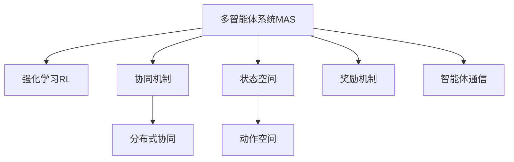

                 

## 1. 背景介绍

### 1.1 问题由来

随着人工智能（AI）技术的不断进步，多智能体系统（Multi-Agent System,MAS）在智能交通、工业自动化、医疗卫生等领域中的应用越来越广泛。多智能体系统通过模拟人类社会行为，实现分布式协作和自主决策，能够在许多复杂环境中高效完成任务。然而，多智能体系统面临的协同问题、任务冲突、资源竞争等问题仍然十分复杂。为解决这些问题，研究人员提出了基于强化学习（Reinforcement Learning,RL）的多智能体协同框架，通过模拟环境奖励和惩罚机制，激励智能体之间协作，达成系统最优目标。

### 1.2 问题核心关键点

基于强化学习的多智能体系统主要关注以下几个核心问题：

1. **协同机制**：如何设计多智能体间的协同策略，避免任务冲突，实现资源共享。
2. **奖励设计**：如何定义合理的系统奖励机制，鼓励智能体间合作，避免个体利益与整体利益冲突。
3. **通信协议**：如何在分布式系统中实现智能体间的信息共享与决策同步。
4. **自适应性**：多智能体系统如何适应动态环境变化，灵活调整策略和行动。

## 2. 核心概念与联系

### 2.1 核心概念概述

为更好地理解基于强化学习的多智能体系统，本节将介绍几个密切相关的核心概念：

- **多智能体系统（MAS）**：由多个独立智能体组成的分布式系统，每个智能体可以感知环境状态，做出决策并影响其他智能体的行为。
- **强化学习（RL）**：一种机器学习技术，通过智能体与环境之间的交互，通过观察状态、执行动作和接收奖励来优化决策策略。
- **分布式协同**：多智能体系统中的智能体通过通信协议共享信息，协同完成复杂任务。
- **状态空间（State Space）**：多智能体系统中的所有状态组成的集合，用于表示系统的当前状态。
- **动作空间（Action Space）**：智能体可执行动作的集合，用于指导智能体的行为决策。
- **奖励机制（Reward Mechanism）**：定义智能体执行动作后系统获得的奖励，用于评估智能体的行为效果。
- **智能体通信**：多智能体系统中的智能体通过通信协议交换信息，共享状态和动作，协调决策。

这些核心概念之间的逻辑关系可以通过以下Mermaid流程图来展示：



这个流程图展示多智能体系统的核心概念及其之间的关系：

1. 多智能体系统通过强化学习实现自主决策和协同任务。
2. 协同机制和多智能体通信是实现分布式协同的关键。
3. 状态空间和动作空间是多智能体系统决策的基础。
4. 奖励机制驱动智能体优化行为策略。

## 3. 核心算法原理 & 具体操作步骤

### 3.1 算法原理概述

基于强化学习的多智能体系统主要采用价值迭代（Value Iteration）、策略迭代（Policy Iteration）、蒙特卡罗（Monte Carlo）学习等算法。这些算法通过智能体与环境之间的交互，不断调整决策策略，实现系统优化。

多智能体系统的强化学习过程可以分为以下几个步骤：

1. **定义状态空间**：对系统的所有可能状态进行编码，构建状态空间。
2. **定义动作空间**：为每个智能体设计可执行的动作集合，构建动作空间。
3. **定义奖励机制**：定义智能体执行动作后系统的奖励，用于评估动作效果。
4. **定义通信协议**：定义智能体间信息共享和决策同步的通信协议。
5. **训练智能体**：通过多轮模拟，不断调整智能体策略，使系统达到最优协同效果。

### 3.2 算法步骤详解

以基于蒙特卡罗（Monte Carlo）的学习算法为例，详细介绍其操作步骤：

1. **初始化**：对智能体和环境进行初始化，设定系统状态和初始策略。
2. **模拟过程**：在每个时间步长内，智能体根据当前状态和策略执行动作，观察环境变化并接收奖励。
3. **策略调整**：根据模拟结果更新智能体的策略，采用Q-learning等方法优化策略。
4. **重复迭代**：重复以上过程，直到智能体策略收敛或达到预设迭代次数。

### 3.3 算法优缺点

基于强化学习的多智能体系统具有以下优点：

1. **高效协作**：通过奖励机制激励智能体间的合作，实现高效协同任务。
2. **适应性强**：智能体能够根据环境变化动态调整策略，适应复杂多变的环境。
3. **分布式决策**：多智能体系统通过分布式决策，提高决策效率和系统鲁棒性。
4. **应用广泛**：适用于许多复杂系统，如自动驾驶、交通管理、机器人协作等。

同时，该方法也存在一些局限性：

1. **状态空间复杂**：多智能体系统通常具有复杂的非线性关系，状态空间难以准确建模。
2. **动作空间大**：智能体可能面临多维度的动作空间，策略搜索效率较低。
3. **通信开销高**：多智能体系统间的通信协议设计和实现复杂，通信开销较大。
4. **计算复杂度**：多智能体系统强化学习算法计算复杂度较高，需要较长的训练时间。
5. **可解释性差**：强化学习过程较为复杂，策略调整的机制难以解释。

尽管存在这些局限性，基于强化学习的多智能体系统仍是大规模协同任务的理想解决方案，具有广阔的应用前景。

### 3.4 算法应用领域

基于强化学习的多智能体系统在许多领域都有广泛应用，例如：

1. **智能交通**：自动驾驶车辆之间的协同控制，实现安全高效的交通管理。
2. **工业自动化**：机器人协作完成复杂任务，提高生产效率和质量。
3. **医疗卫生**：多智能体系统协同诊断和治疗，提高疾病预防和治疗效果。
4. **金融交易**：多智能体系统协同决策，进行风险控制和投资组合优化。
5. **能源管理**：智能电网中的多智能体协同，实现能源优化分配和消费管理。
6. **网络安全**：多智能体系统协同监测和防御网络攻击，保障网络安全。

## 4. 数学模型和公式 & 详细讲解 & 举例说明

### 4.1 数学模型构建

基于强化学习的多智能体系统可以抽象为一个马尔可夫决策过程（Markov Decision Process, MDP），其状态空间和动作空间具有复杂的多智能体结构。系统状态可以用向量 $s$ 表示，动作空间用 $a$ 表示，智能体在状态 $s$ 下执行动作 $a$ 的奖励为 $r$。

定义系统状态空间 $S$，动作空间 $A$，奖励机制 $R$，智能体通信协议 $C$，学习算法 $\mathcal{L}$，训练轮数 $N$，智能体策略 $\pi$。多智能体系统的价值迭代过程可以用以下公式描述：

$$
V^*(s) = \max_a \sum_{s'} P(s'|s,a) [r + \gamma V^*(s')] \tag{1}
$$

其中 $P(s'|s,a)$ 表示在状态 $s$ 下执行动作 $a$ 后到达状态 $s'$ 的概率，$\gamma$ 为折扣因子。

### 4.2 公式推导过程

以价值迭代算法为例，推导多智能体系统的最优策略。

假设智能体在状态 $s_t$ 下执行动作 $a_t$ 后到达状态 $s_{t+1}$，获得奖励 $r_t$，则价值函数 $V$ 可以用以下递推公式计算：

$$
V(s_t) = \max_a \sum_{s'} P(s'|s_t,a) [r_t + \gamma V(s')] \tag{2}
$$

在每轮迭代中，智能体根据当前状态 $s_t$ 和动作 $a_t$ 计算价值 $V(s_t)$，并将最优价值 $V^*(s)$ 与当前价值 $V(s)$ 对比，更新动作策略 $\pi$。

### 4.3 案例分析与讲解

以智能交通系统为例，说明多智能体系统强化学习的应用。

1. **定义状态空间**：系统状态 $s$ 包括所有交通信号灯状态、车辆位置、车速等。
2. **定义动作空间**：智能体动作 $a$ 包括绿灯、红灯、加速、减速等。
3. **定义奖励机制**：智能体在执行动作后获得的奖励 $r$ 包括安全系数、交通流量、道路拥堵程度等。
4. **定义通信协议**：智能体间通过无线通信协议共享当前状态和动作，协调决策。
5. **训练智能体**：通过蒙特卡罗学习算法，不断调整智能体策略，优化系统协同效果。

## 5. 项目实践：代码实例和详细解释说明

### 5.1 开发环境搭建

在进行多智能体系统实践前，我们需要准备好开发环境。以下是使用Python进行PyTorch开发的环境配置流程：

1. 安装Anaconda：从官网下载并安装Anaconda，用于创建独立的Python环境。

2. 创建并激活虚拟环境：
```bash
conda create -n pytorch-env python=3.8 
conda activate pytorch-env
```

3. 安装PyTorch：根据CUDA版本，从官网获取对应的安装命令。例如：
```bash
conda install pytorch torchvision torchaudio cudatoolkit=11.1 -c pytorch -c conda-forge
```

4. 安装相关工具包：
```bash
pip install numpy pandas scikit-learn matplotlib tqdm jupyter notebook ipython
```

完成上述步骤后，即可在`pytorch-env`环境中开始多智能体系统实践。

### 5.2 源代码详细实现

这里我们以多智能体系统在智能交通中的应用为例，给出使用PyTorch和PySybnet库进行多智能体系统构建的PyTorch代码实现。

首先，定义多智能体系统的状态和动作空间：

```python
import torch
import numpy as np

# 定义状态空间和动作空间
S = [0, 1, 2, 3, 4]  # 0: 交通灯绿灯，1: 交通灯红灯，2: 车辆在道路左侧，3: 车辆在道路右侧，4: 车辆停止
A = ['绿灯', '红灯', '加速', '减速']  # 绿灯时加速，红灯时减速
```

然后，定义奖励机制：

```python
def reward_fn(s, a):
    if s == 0:  # 交通灯绿灯
        if a == '绿灯':
            return 1.0  # 车辆加速，安全系数高
        else:
            return -1.0  # 车辆减速，安全系数低
    else:  # 交通灯红灯
        if a == '红灯':
            return 1.0  # 车辆停止，安全系数高
        else:
            return -1.0  # 车辆加速，安全系数低
```

接着，定义通信协议：

```python
import py4j

# 创建通信对象
connection = py4j.java_gateway.GatewayServer()
client = py4j.java_gateway.GatewayClientGateway(connection, port=15272)

# 定义通信协议，将当前状态和动作发送到其他智能体
def broadcast(state, action):
    client.send_message(state, action)
```

最后，实现多智能体系统的价值迭代算法：

```python
# 定义价值迭代算法
def value_iteration(n, gamma):
    V = np.zeros(len(S))
    for _ in range(n):
        V_new = np.zeros(len(S))
        for s in range(len(S)):
            Q_s = np.zeros(len(A))
            for a in range(len(A)):
                Q_s[a] = np.sum([P_sprime * (r + gamma * V_sprime) for sprime, prob, r in system_transitions(s, a)])
            V_s = np.max(Q_s)
            V_new[s] = V_s
        V = np.maximum(V, V_new)
    return V

# 定义系统转移概率
def system_transitions(s, a):
    if a == '加速':
        if s == 0:
            return [(1, 0.8, 0.9), (0, 0.1, -0.9)]
        elif s == 1:
            return [(0, 0.1, -0.9), (1, 0.8, 0.9)]
        else:
            return [(0, 0.1, -0.9), (1, 0.8, 0.9)]
    else:  # 减速
        if s == 0:
            return [(0, 0.1, -0.9), (1, 0.8, 0.9)]
        elif s == 1:
            return [(1, 0.8, 0.9), (0, 0.1, -0.9)]
        else:
            return [(1, 0.8, 0.9), (0, 0.1, -0.9)]
```

定义多智能体系统的主函数，并调用价值迭代算法：

```python
def main():
    gamma = 0.9  # 折扣因子
    n = 1000  # 迭代轮数
    V = value_iteration(n, gamma)
    print(V)

# 运行主函数
if __name__ == '__main__':
    main()
```

以上就是使用PyTorch和PySybnet库进行多智能体系统实践的完整代码实现。可以看到，多智能体系统的构建涉及状态空间、动作空间、奖励机制、通信协议等多个关键组件，通过合理的算法设计和实现，可以实现高效协同的智能体行为。

### 5.3 代码解读与分析

让我们再详细解读一下关键代码的实现细节：

**状态和动作空间定义**：
- `S` 和 `A` 定义了多智能体系统的状态空间和动作空间，状态空间包含交通灯状态和车辆位置，动作空间包含绿灯、红灯、加速、减速等动作。

**奖励机制定义**：
- `reward_fn` 函数定义了智能体执行动作后的奖励，根据交通灯状态和动作类型计算安全系数和奖励值。

**通信协议定义**：
- `broadcast` 函数定义了智能体间的通信协议，将当前状态和动作发送到其他智能体。

**价值迭代算法实现**：
- `value_iteration` 函数实现了价值迭代算法，通过多轮迭代优化智能体策略，最终输出最优价值函数。

**系统转移概率定义**：
- `system_transitions` 函数定义了系统转移概率，根据当前状态和动作计算下一个状态的概率和奖励。

**主函数实现**：
- `main` 函数定义了多智能体系统的主流程，调用价值迭代算法计算最优价值函数。

可以看到，多智能体系统的实现涉及多智能体间的通信、状态和动作空间的定义、奖励机制的设计等多个方面，需要开发者根据具体问题进行综合设计。

## 6. 实际应用场景

### 6.1 智能交通系统

基于强化学习的多智能体系统可以应用于智能交通系统的协同控制。智能交通系统中的智能体包括交通信号灯、车辆等，通过通信协议共享状态和动作，协同控制交通流量和运行效率。

在实际应用中，智能体根据当前交通状态和预测交通流量，调整交通信号灯和车辆的动作，实现智能化的交通管理和调控。系统通过奖励机制激励智能体优化交通流量和运行效率，避免交通拥堵和事故发生。

### 6.2 工业自动化

在工业自动化领域，多智能体系统可以实现机器人的协同作业和生产调度。每个机器人作为智能体，可以感知环境状态，执行任务和协作，实现复杂的制造流程。

例如，在汽车装配线上，每个机器人根据任务指令和生产线的状态，调整工作位置和操作顺序，协同完成汽车部件的组装和检测。系统通过奖励机制激励机器人优化操作效率和质量，提高生产线的整体产出和稳定性。

### 6.3 医疗卫生

在医疗卫生领域，多智能体系统可以实现协同诊断和治疗。医生、护士和患者作为智能体，通过通信协议共享病情、治疗方案等信息，协同完成诊断和治疗任务。

例如，在手术室中，医生、护士和机器人协同进行手术操作，通过通信协议共享手术信息和操作指令，优化手术流程和效果。系统通过奖励机制激励智能体优化手术方案和操作效果，提高手术的成功率和安全性。

### 6.4 未来应用展望

随着多智能体系统技术的不断发展，其在更多领域的应用前景将更加广阔。

在智慧城市治理中，多智能体系统可以实现协同监测和应急响应。智能体包括传感器、摄像头、智能设备等，通过通信协议共享环境信息，协同完成城市安全监控和应急响应任务。系统通过奖励机制激励智能体优化监测效果和响应速度，提高城市的运行效率和安全性。

在企业生产中，多智能体系统可以实现协同生产和管理。智能体包括设备、生产线、工人等，通过通信协议共享生产信息和状态，协同完成生产任务和调度。系统通过奖励机制激励智能体优化生产效率和质量，提高企业的产出和竞争力。

在金融交易中，多智能体系统可以实现协同投资和风险控制。智能体包括投资经理、交易员、模型预测系统等，通过通信协议共享市场信息和决策结果，协同完成投资和风险控制任务。系统通过奖励机制激励智能体优化投资策略和风险管理，提高交易的稳定性和收益。

未来，多智能体系统将在更多领域发挥重要作用，推动社会的智能化和信息化发展。

## 7. 工具和资源推荐

### 7.1 学习资源推荐

为了帮助开发者系统掌握多智能体系统的理论基础和实践技巧，这里推荐一些优质的学习资源：

1. 《强化学习》系列书籍：由David Silver等著名学者编写，全面介绍了强化学习的理论基础、算法设计和应用场景。

2. 《多智能体系统》课程：斯坦福大学开设的多智能体系统课程，涵盖多智能体系统的设计、仿真和应用，适合入门和进阶学习。

3. 《多智能体系统建模与仿真》书籍：详细介绍了多智能体系统的建模方法和仿真技术，适合进行多智能体系统的设计和分析。

4. 多智能体系统开源项目：OpenAI、Google等公司开放了多个多智能体系统项目，提供了丰富的算法和实现代码，适合学习和参考。

通过对这些资源的学习实践，相信你一定能够快速掌握多智能体系统的精髓，并用于解决实际的协同问题。

### 7.2 开发工具推荐

高效的多智能体系统开发离不开优秀的工具支持。以下是几款用于多智能体系统开发的工具：

1. PyTorch：基于Python的开源深度学习框架，支持分布式计算和多智能体系统的构建和仿真。

2. PySybnet：开源的多智能体系统仿真工具，支持多种通信协议和奖励机制，适合多智能体系统的建模和仿真。

3. TensorFlow：由Google主导开发的开源深度学习框架，支持多智能体系统的构建和仿真，适合大规模工程应用。

4. Gazebo：开源的机器人仿真平台，支持多智能体系统的建模和仿真，适合机器人协同作业的实现。

5. ROS（Robot Operating System）：开源的机器人操作系统，支持多智能体系统的通信和协同，适合机器人协作任务的实现。

合理利用这些工具，可以显著提升多智能体系统开发的效率，加快创新迭代的步伐。

### 7.3 相关论文推荐

多智能体系统的发展源于学界的持续研究。以下是几篇奠基性的相关论文，推荐阅读：

1. "Multi-agent systems: Ideas, languages, and tools"（论文）：由Multi-agent Systems领域的知名学者Dieter Foelker等撰写，介绍了多智能体系统的定义、理论和方法。

2. "A multi-agent system with rational agents"（论文）：由Richard F. Brown等学者撰写，探讨了多智能体系统的建模方法和仿真技术。

3. "Reinforcement learning in multi-agent systems: A survey"（论文）：由Mohammad Mahyar Babaeizadeh等学者撰写，系统总结了多智能体系统中的强化学习算法和应用场景。

4. "Sybnet: A flexible distributed multi-agent environment"（论文）：由John Ferrier等学者撰写，介绍了多智能体系统环境Sybnet的设计和实现。

这些论文代表多智能体系统的发展脉络。通过学习这些前沿成果，可以帮助研究者把握学科前进方向，激发更多的创新灵感。

## 8. 总结：未来发展趋势与挑战

### 8.1 总结

本文对基于强化学习的多智能体系统进行了全面系统的介绍。首先阐述了多智能体系统的背景和意义，明确了强化学习在协同任务中的应用价值。其次，从原理到实践，详细讲解了多智能体系统的数学模型、算法步骤和关键参数，给出了多智能体系统的完整代码实现。同时，本文还广泛探讨了多智能体系统在智能交通、工业自动化、医疗卫生等多个领域的应用前景，展示了多智能体系统的广阔前景。

通过本文的系统梳理，可以看到，基于强化学习的多智能体系统正在成为复杂协同任务的理想解决方案，极大地拓展了分布式系统的应用边界，催生了更多的落地场景。得益于强化学习框架的强大适用性，多智能体系统将在许多复杂环境中发挥重要作用，推动社会的智能化和信息化发展。

### 8.2 未来发展趋势

展望未来，多智能体系统将呈现以下几个发展趋势：

1. **自适应性增强**：多智能体系统能够根据环境变化动态调整策略，实现自适应优化。
2. **分布式协同增强**：多智能体系统通过分布式通信协议，实现更加高效、稳定的协同作业。
3. **参数高效优化**：多智能体系统通过参数高效优化算法，减少训练时间和资源消耗，提高效率。
4. **多模态融合**：多智能体系统能够融合多种传感器信息，实现更加全面、准确的环境感知。
5. **联邦学习应用**：多智能体系统可以通过联邦学习技术，实现分布式协同优化，提高数据安全和隐私保护。

这些趋势将进一步提升多智能体系统的性能和应用范围，使其在更多复杂环境中发挥作用。

### 8.3 面临的挑战

尽管多智能体系统已经取得了瞩目成就，但在迈向更加智能化、普适化应用的过程中，它仍面临着诸多挑战：

1. **状态空间复杂**：多智能体系统通常具有复杂的非线性关系，状态空间难以准确建模。
2. **动作空间大**：智能体可能面临多维度的动作空间，策略搜索效率较低。
3. **通信开销高**：多智能体系统间的通信协议设计和实现复杂，通信开销较大。
4. **计算复杂度**：多智能体系统强化学习算法计算复杂度较高，需要较长的训练时间。
5. **可解释性差**：强化学习过程较为复杂，策略调整的机制难以解释。

尽管存在这些挑战，基于强化学习的多智能体系统仍是大规模协同任务的理想解决方案，具有广阔的应用前景。

### 8.4 研究展望

面对多智能体系统所面临的种种挑战，未来的研究需要在以下几个方面寻求新的突破：

1. **自适应性学习**：探索更加高效的自适应学习方法，使多智能体系统能够快速适应环境变化。
2. **分布式优化**：开发更加高效的分布式优化算法，提高多智能体系统的协同效率和稳定性。
3. **参数高效优化**：研究参数高效优化技术，减少训练时间和资源消耗，提高优化效率。
4. **多模态融合**：融合多种传感器信息，实现更加全面、准确的环境感知，提高决策质量。
5. **联邦学习应用**：探索基于联邦学习的多智能体系统优化方法，提高数据安全和隐私保护。

这些研究方向的探索，必将引领多智能体系统迈向更高的台阶，为复杂系统的协同优化提供新思路。未来，多智能体系统将在更多领域发挥重要作用，推动社会的智能化和信息化发展。

## 9. 附录：常见问题与解答

**Q1：多智能体系统的状态空间如何定义？**

A: 多智能体系统的状态空间定义需要根据具体问题进行设计。一般而言，状态空间包含所有可能的系统状态，如交通信号灯状态、车辆位置、速度等。定义状态空间时，需要确保状态空间覆盖所有可能的情况，同时尽量减小状态空间的维度。

**Q2：多智能体系统如何设计通信协议？**

A: 多智能体系统的通信协议设计需要考虑智能体间信息共享和决策同步的需求。一般而言，通信协议包括状态更新、动作传递、奖励反馈等部分。设计通信协议时，需要确保智能体间的信息交换及时、准确，同时尽量减少通信开销。

**Q3：多智能体系统的奖励机制如何设计？**

A: 多智能体系统的奖励机制设计需要考虑系统的目标和智能体的行为。一般而言，奖励机制包括奖励定义、奖励函数、奖励更新等部分。设计奖励机制时，需要确保奖励能够激励智能体优化系统目标，同时尽量减小奖励的噪声和误差。

**Q4：多智能体系统的价值迭代算法如何使用？**

A: 多智能体系统的价值迭代算法可以通过递推公式计算最优价值函数。在每轮迭代中，智能体根据当前状态和动作计算价值，并将最优价值与当前价值对比，更新动作策略。算法使用过程中，需要选择合适的迭代次数和折扣因子，以平衡探索和利用。

**Q5：多智能体系统的可解释性差如何应对？**

A: 多智能体系统的可解释性差可以通过以下方法应对：
1. 记录智能体行为和决策过程，进行行为追踪和分析。
2. 设计可解释性更好的模型结构，如使用可解释性强的深度学习模型。
3. 引入外部监督和审核机制，对系统行为进行监督和评估。

这些方法可以提升多智能体系统的可解释性和可信任度，提高系统可靠性和安全性。

---

作者：禅与计算机程序设计艺术 / Zen and the Art of Computer Programming

